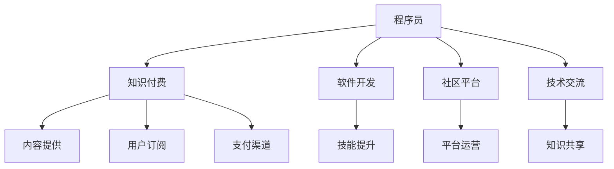

                 

# 程序员利用知识付费实现财富自由的途径

> 关键词：知识付费, 程序员, 财富自由, 学习资源, 软件开发, 社区平台, 技术交流

## 1. 背景介绍

在数字化时代，程序员作为知识和技术的创造者，拥有巨大的市场需求和商业价值。然而，如何在竞争激烈的职场环境中脱颖而出，实现个人价值最大化，是每个程序员必须面对的问题。近年来，知识付费作为一种新兴的商业模式，为程序员提供了一种全新的盈利途径。

知识付费，即通过提供有价值的知识和技能，获取相应的经济回报。这种模式不仅改变了知识的传播方式，也颠覆了传统的盈利模式，为程序员带来新的商业机会。本文将深入探讨程序员如何通过知识付费实现财富自由，并给出实用的策略和建议。

## 2. 核心概念与联系

### 2.1 核心概念概述

为更好地理解知识付费的商业模式，本节将介绍几个关键概念：

- 知识付费：即通过提供有价值的知识和技能，获取相应的经济回报。
- 程序员：即编写、测试和维护软件代码的专业人士，是知识付费的重要提供者。
- 软件开发：即通过编程语言和工具，设计和实现软件系统的过程。
- 社区平台：即知识付费交易和交流的在线平台，如知乎、B站、Coursera等。
- 技术交流：即程序员之间通过技术分享和讨论，进行知识和技能交流的过程。

这些概念之间的逻辑关系可以通过以下Mermaid流程图来展示：



这个流程图展示了几者之间的关系：

1. 程序员通过软件开发和技术交流积累知识。
2. 通过社区平台发布知识付费内容。
3. 用户订阅相关内容，获得有价值的知识。
4. 知识付费平台提供交易渠道，促进知识和经济利益的交换。

这些概念共同构成了知识付费的商业模式，为程序员提供了新的盈利途径。

## 3. 核心算法原理 & 具体操作步骤

### 3.1 算法原理概述

知识付费平台的运作依赖于以下核心算法原理：

- 用户匹配算法：将有需求的用户与合适的知识提供者匹配，提高交易效率。
- 推荐算法：根据用户的历史行为和偏好，推荐最相关的内容，提高用户满意度。
- 价格确定算法：根据内容的价值和市场需求，动态调整价格，保持市场竞争力。
- 内容审核算法：确保内容的质量和合规性，保护用户权益。

这些算法原理共同支撑了知识付费平台的正常运营，为程序员提供了稳定的盈利环境。

### 3.2 算法步骤详解

知识付费平台的知识付费算法步骤主要包括以下几个关键环节：

**Step 1: 用户需求采集**

平台通过问卷调查、用户反馈等方式，收集用户的需求和偏好，为内容匹配和推荐提供数据支撑。

**Step 2: 内容提供与发布**

程序员将所掌握的知识和技能转化为可售内容，如技术文章、视频教程、代码示例等，并发布在平台上。

**Step 3: 用户匹配与订阅**

平台根据用户需求和内容标签，进行匹配推荐，用户可以选择订阅感兴趣的内容，支付相应的费用。

**Step 4: 内容交付与反馈**

平台将订阅内容交付给用户，并收集用户的反馈，持续优化内容质量和推荐算法。

**Step 5: 收益分配与激励**

平台根据订阅量、好评度等指标，进行收益分配，激励程序员持续提供高质量内容。

**Step 6: 违规处理与法律合规**

平台对违规内容进行封禁处理，确保内容质量和合规性，保障用户权益。

以上步骤详细描述了知识付费平台的工作流程，程序员可以通过这些步骤，将自身知识和技能转化为经济收益。

### 3.3 算法优缺点

知识付费平台的算法具有以下优点：

1. 市场空间大：知识付费市场迅速发展，市场需求大，提供了丰富的盈利机会。
2. 收益透明：平台提供了详细的收益报告，程序员可以清晰了解收入来源和变化。
3. 用户反馈及时：用户可以通过平台提供反馈，帮助程序员改进内容，提升用户体验。
4. 持续激励：平台通过收益分配激励程序员不断提供优质内容，形成良性循环。

同时，该算法也存在一些局限性：

1. 用户需求多样化：不同用户需求差异较大，难以精确匹配。
2. 内容质量难以控制：部分低质量内容影响用户体验和平台声誉。
3. 价格波动较大：市场需求变化快，价格调整可能滞后。
4. 法律风险：知识付费内容涉及版权和隐私，需要严格遵守法律法规。

尽管存在这些局限性，但就目前而言，知识付费算法仍是一种高效的盈利模式，为程序员提供了新的发展方向。

### 3.4 算法应用领域

知识付费平台在多个领域都有广泛应用，以下是几个典型应用场景：

1. 技术培训：程序员可以通过课程和视频讲解技术原理、开发技巧等，帮助初学者和进阶者提升技能。

2. 问题答疑：程序员可以提供技术咨询和问题答疑服务，解决用户的技术难题，积累口碑和信誉。

3. 项目合作：程序员可以发布项目需求和成果，寻找合作机会，拓展职业发展空间。

4. 软件开发：程序员可以将开发心得和技巧转化为文章和视频，供其他开发者参考学习。

5. 产品推广：程序员可以将自己的产品或服务通过知识付费平台进行推广，提高知名度和市场份额。

## 4. 数学模型和公式 & 详细讲解 & 举例说明

### 4.1 数学模型构建

知识付费平台的数学模型主要包括用户需求模型、内容推荐模型和收益分配模型。下面将分别构建这些模型：

**用户需求模型**

用户需求模型基于用户的历史行为和偏好，构建用户画像，用于匹配和推荐内容。可以使用聚类算法、协同过滤算法等方法进行建模。

**内容推荐模型**

内容推荐模型根据用户需求和内容特征，计算内容的相关度，进行排序推荐。可以使用基于矩阵分解的推荐算法、深度学习推荐模型等方法。

**收益分配模型**

收益分配模型根据内容订阅量和好评度，计算程序员的收益。可以采用线性回归模型、回归树模型等方法。

### 4.2 公式推导过程

以内容推荐模型为例，使用基于矩阵分解的协同过滤算法进行推导：

设用户$u$对内容$c$的评分$R_{uc}$为$R_{uc} = (a_u \cdot w_c) + b$，其中$a_u$为用户$u$的特征向量，$w_c$为内容$c$的特征向量，$b$为常数项。

假设平台上有$M$个用户和$N$个内容，用户-内容评分矩阵为$R \in \mathbb{R}^{M \times N}$，用户特征矩阵为$A \in \mathbb{R}^{M \times D}$，内容特征矩阵为$W \in \mathbb{R}^{N \times D}$，用户特征和内容特征的共现矩阵为$X \in \mathbb{R}^{M \times N}$。

则推荐模型可表示为：

$$
\hat{R}_{uc} = \frac{A_u W_c^T + b}{\sqrt{(A_u W_c)^T (A_u W_c)}} = X_{uc} + b
$$

其中$\hat{R}_{uc}$为推荐分数，$(A_u W_c)^T$为特征向量点积。

### 4.3 案例分析与讲解

以Coursera平台为例，进行知识付费算法的案例分析：

Coursera是一个全球知名的在线教育平台，提供大量付费课程和视频教程。Coursera的用户主要来自各大高校和科研机构，他们对课程内容和质量有较高要求。

Coursera使用基于矩阵分解的推荐算法，根据用户的历史行为和偏好，推荐合适的课程。同时，Coursera还提供丰富的课程内容，涵盖编程、数据科学、人工智能等诸多领域，满足不同用户的需求。

Coursera还采用公平的收益分配机制，根据课程的订阅量和好评度，分配相应的收益，激励教师持续提供优质内容。Coursera的成功经验为程序员提供了有价值的借鉴。

## 5. 项目实践：代码实例和详细解释说明

### 5.1 开发环境搭建

在进行知识付费项目开发前，我们需要准备好开发环境。以下是使用Python进行Flask开发的配置流程：

1. 安装Anaconda：从官网下载并安装Anaconda，用于创建独立的Python环境。

2. 创建并激活虚拟环境：
```bash
conda create -n py36 python=3.6
conda activate py36
```

3. 安装Flask：
```bash
pip install Flask
```

4. 安装其他常用工具包：
```bash
pip install Flask-WTF Flask-SQLAlchemy Flask-Login
```

完成上述步骤后，即可在`py36`环境中开始开发。

### 5.2 源代码详细实现

下面以知识付费平台的课程推荐系统为例，给出使用Flask开发的代码实现。

首先，定义课程和用户模型：

```python
from flask_sqlalchemy import SQLAlchemy

db = SQLAlchemy()

class Course(db.Model):
    id = db.Column(db.Integer, primary_key=True)
    name = db.Column(db.String(255), unique=True, nullable=False)
    price = db.Column(db.Float, nullable=False)
    tags = db.Column(db.String(255), nullable=True)

class User(db.Model):
    id = db.Column(db.Integer, primary_key=True)
    name = db.Column(db.String(255), unique=True, nullable=False)
    email = db.Column(db.String(255), unique=True, nullable=False)
    courses = db.relationship('Course', backref='buyers', lazy=True)
```

然后，定义Flask应用和路由：

```python
from flask import Flask, render_template, request, redirect, url_for

app = Flask(__name__)
app.config['SQLALCHEMY_DATABASE_URI'] = 'sqlite:///courses.db'
db.init_app(app)

@app.route('/')
def index():
    courses = Course.query.all()
    return render_template('index.html', courses=courses)

@app.route('/user/<id>', methods=['GET', 'POST'])
def purchase(id):
    course = Course.query.get(id)
    if request.method == 'POST':
        user = User.query.get(request.form['user'])
        user.courses.append(course)
        db.session.commit()
        return redirect(url_for('index'))
    return render_template('purchase.html', course=course)
```

接着，定义Flask模板：

```html
<!-- index.html -->
<h1>Courses</h1>

    <a href="{{ url_for('purchase', id=course.id) }}">{{ course.name }} - {{ course.price }} USD</a>


<!-- purchase.html -->
<h1>Purchase Course</h1>
<form method="post">
    {{ form.hidden_tag CSRF_ENABLED=True }}
    {{ form.user.label }} <input type="text" name="user" placeholder="Enter your email">
    <button type="submit">Purchase</button>
</form>
```

最后，运行Flask应用：

```bash
python app.py
```

在浏览器中访问`http://127.0.0.1:5000/`，即可看到一个简单的课程推荐系统。

### 5.3 代码解读与分析

让我们再详细解读一下关键代码的实现细节：

**Course和User模型**：
- 定义了课程和用户的基本属性和关系，使用SQLAlchemy进行数据库管理。

**Flask应用和路由**：
- 创建Flask应用，并配置数据库连接。
- 定义路由，实现课程列表展示和课程购买功能。
- 使用模板渲染页面，显示课程信息。

**Flask模板**：
- 使用Flask的模板引擎，展示课程列表和购买表单。

可以看出，Flask提供了一个简洁易用的Web框架，使得知识付费平台的开发变得简单高效。开发者可以专注于业务逻辑的实现，而不必过多关注底层技术细节。

当然，工业级的系统实现还需考虑更多因素，如用户认证、权限控制、数据安全性等。但核心的知识付费算法和模型框架基本与此类似。

## 6. 实际应用场景

### 6.1 技术培训

知识付费平台在技术培训领域的应用最为广泛。程序员可以通过课程和视频讲解技术原理、开发技巧等，帮助初学者和进阶者提升技能。

例如，某在线教育平台提供Java和Python课程，内容涵盖基础语法、框架应用、项目实践等。程序员可以将其课程内容转化为知识付费内容，收取用户订阅费。

### 6.2 问题答疑

程序员可以提供技术咨询和问题答疑服务，解决用户的技术难题，积累口碑和信誉。

例如，某程序员开设了一个Python问题答疑社区，用户在平台上发布问题，程序员进行解答。问题答疑的收费标准可以根据用户满意度、回答速度等综合评分设定。

### 6.3 项目合作

程序员可以发布项目需求和成果，寻找合作机会，拓展职业发展空间。

例如，某程序员将自己的开源项目发布在平台上，介绍项目背景、功能和使用方式。其他开发者可以根据自己的需求，进行定制开发或商业合作。

### 6.4 未来应用展望

随着知识付费平台的发展，未来的应用场景将更加多样化，以下是几个可能的方向：

1. 智能推荐：引入机器学习算法，根据用户行为进行个性化推荐，提升用户体验。
2. 实时互动：开发实时聊天功能，增强用户和课程提供者的互动体验。
3. 虚拟教室：使用视频会议工具，实现线上互动教学，提升课程效果。
4. 直播课程：推出直播功能，实现在线授课，提高课程覆盖面。
5. 多语言支持：提供多语言内容，拓展国际市场。

知识付费平台的未来发展方向将更加多样化，为程序员提供更多元化的盈利途径。

## 7. 工具和资源推荐

### 7.1 学习资源推荐

为帮助程序员系统掌握知识付费的相关知识，以下是几组优质的学习资源：

1. Coursera课程：提供大量优质课程和视频教程，涵盖编程、数据科学、人工智能等诸多领域。
2. Udemy课程：提供付费课程和视频讲解，内容丰富，覆盖面广。
3. edX课程：提供大学级别的课程和视频教程，深入浅出地讲解技术原理和应用。
4. GitHub：提供大量开源项目和代码示例，程序员可以从中学习开发技巧和经验。
5. Stack Overflow：提供技术问答社区，程序员可以发布问题，获取其他开发者解答。

通过对这些资源的学习实践，相信你一定能够系统掌握知识付费的精髓，并应用于实际开发中。

### 7.2 开发工具推荐

高效的开发离不开优秀的工具支持。以下是几款用于知识付费平台开发的常用工具：

1. Python：简单易用的编程语言，提供了丰富的库和框架，如Flask、SQLAlchemy等，适合Web开发。
2. JavaScript：用于前端开发，提供丰富的库和框架，如React、Vue等，适合构建交互式界面。
3. MySQL：开源的关系型数据库，适合存储和查询数据，提供良好的扩展性和性能。
4. Redis：开源的内存数据库，适合存储缓存数据，提供快速访问和高可用性。
5. Docker：用于容器化应用，适合多环境部署和测试。

合理利用这些工具，可以显著提升知识付费平台的开发效率，加快创新迭代的步伐。

### 7.3 相关论文推荐

知识付费平台的运作依赖于多种算法和模型，以下是几篇奠基性的相关论文，推荐阅读：

1. "Collaborative Filtering for Implicit Feedback Datasets"：介绍了基于协同过滤的推荐算法，是知识付费平台的核心技术之一。
2. "Feature Engineering for Recommendation Systems"：介绍了特征工程在推荐算法中的应用，对知识付费平台的优化有指导意义。
3. "Adapting User Interfaces to User Interfaces"：介绍了推荐系统的用户界面设计，对知识付费平台的UI设计有借鉴意义。
4. "A Survey of Recommender Systems"：总结了推荐系统的各种算法和技术，对知识付费平台的算法选择有指导意义。
5. "Machine Learning with Python"：介绍了机器学习在知识付费平台中的应用，对算法实现有参考价值。

这些论文代表了大数据和人工智能技术在知识付费平台中的应用，通过学习这些前沿成果，可以帮助研究者把握学科前进方向，激发更多的创新灵感。

## 8. 总结：未来发展趋势与挑战

### 8.1 总结

本文对程序员利用知识付费实现财富自由的途径进行了全面系统的介绍。首先阐述了知识付费的商业模式和程序员作为知识提供者的角色。其次，从原理到实践，详细讲解了知识付费的数学模型和核心算法。最后，通过项目实践和案例分析，展示了知识付费的实际应用场景和未来发展方向。

通过本文的系统梳理，可以看到，知识付费为程序员提供了一种全新的盈利途径，使得程序员可以通过提供有价值的知识和技能，获取相应的经济回报。未来，随着知识付费平台的不断发展和完善，知识付费将在更多领域得到应用，为程序员带来新的发展机遇。

### 8.2 未来发展趋势

展望未来，知识付费平台将呈现以下几个发展趋势：

1. 技术融合：知识付费平台将与大数据、人工智能、区块链等技术进行深度融合，提升平台的智能化和安全性。
2. 场景扩展：知识付费平台将拓展到更多领域，如教育、医疗、金融等，提供更多元化的服务。
3. 个性化推荐：平台将引入机器学习算法，进行个性化推荐，提升用户体验和转化率。
4. 多语言支持：平台将提供多语言内容，拓展国际市场，提升全球影响力。
5. 社区生态：平台将构建强大的社区生态，吸引更多知识提供者和用户参与，形成良性循环。

这些趋势将为知识付费平台带来更多的发展机会，为程序员提供更广阔的盈利空间。

### 8.3 面临的挑战

尽管知识付费平台的发展前景广阔，但在实际运营中，仍面临诸多挑战：

1. 内容质量控制：如何确保内容的质量和合规性，避免低质量内容的出现，保护用户权益。
2. 市场竞争激烈：平台需面对来自传统教育机构、大型科技公司等强敌的竞争，如何保持市场竞争力。
3. 法律法规风险：知识付费内容涉及版权和隐私，需严格遵守法律法规，避免法律风险。
4. 用户体验提升：如何提升用户满意度和互动体验，增强用户粘性，提升平台活跃度。

尽管存在这些挑战，但知识付费平台的商业前景仍然乐观。只有解决好这些挑战，才能实现平台的可持续发展。

### 8.4 研究展望

面对知识付费平台面临的挑战，未来的研究需要在以下几个方面寻求新的突破：

1. 内容质量评估：开发高质量内容的筛选和推荐算法，确保内容质量和合规性。
2. 市场差异化：根据不同领域的需求，设计差异化的知识付费方案，提升市场竞争力。
3. 法律法规遵循：引入法律风险评估算法，规避法律法规风险，确保内容合规。
4. 用户体验优化：引入个性化推荐和实时互动功能，提升用户满意度和平台活跃度。
5. 社区生态构建：建立社区规则和激励机制，吸引更多知识提供者和用户参与，形成良性的社区生态。

这些研究方向将为知识付费平台的发展提供新的思路，助力程序员实现财富自由。

## 9. 附录：常见问题与解答

**Q1：知识付费平台对程序员有哪些要求？**

A: 知识付费平台对程序员的要求主要包括以下几个方面：
1. 专业技能：掌握编程语言和开发工具，具备扎实的技术基础。
2. 沟通能力：具备良好的表达和沟通能力，能够清晰传达技术原理和应用。
3. 内容创意：具备内容创作能力，能够将复杂的技术问题转化为易懂的课程内容。
4. 问题解决：具备问题分析和解决能力，能够快速响应用户需求。

**Q2：知识付费平台如何激励程序员持续提供优质内容？**

A: 知识付费平台可以通过以下方式激励程序员持续提供优质内容：
1. 收益分配：根据内容订阅量和好评度，分配相应的收益，激励程序员不断提供优质内容。
2. 用户反馈：收集用户反馈，优化课程内容，提升用户体验。
3. 社区评价：建立社区评价机制，根据用户评价，筛选优质内容。
4. 激励措施：提供课程推广和认证等激励措施，鼓励程序员提供高质量课程。

**Q3：知识付费平台面临的主要风险有哪些？**

A: 知识付费平台面临的主要风险包括：
1. 内容质量风险：低质量内容的出现，影响用户体验和平台声誉。
2. 法律风险：知识付费内容涉及版权和隐私，需严格遵守法律法规，避免法律风险。
3. 市场风险：市场竞争激烈，需保持市场竞争力。
4. 技术风险：平台需保持技术领先，避免技术漏洞和系统故障。

**Q4：程序员如何选择合适的知识付费平台？**

A: 程序员选择合适的知识付费平台可以从以下几个方面考虑：
1. 平台声誉：选择知名度高、用户评价好的平台，保障内容质量和平台安全性。
2. 平台功能：选择功能丰富、操作简便的平台，便于课程发布和用户互动。
3. 平台收入：选择收入分配合理、激励机制完善的平台，确保收益最大化。
4. 平台支持：选择支持多平台发布和推广的平台，拓展市场覆盖面。

**Q5：知识付费平台如何提升用户满意度？**

A: 知识付费平台可以通过以下方式提升用户满意度：
1. 个性化推荐：根据用户历史行为和偏好，进行个性化推荐，提升用户体验。
2. 实时互动：开发实时聊天功能，增强用户和课程提供者的互动体验。
3. 用户反馈：收集用户反馈，持续优化课程内容，提升用户满意度。
4. 多语言支持：提供多语言内容，拓展国际市场，提升全球影响力。

通过解决这些常见问题，程序员可以更好地利用知识付费平台实现财富自由。

---

作者：禅与计算机程序设计艺术 / Zen and the Art of Computer Programming

