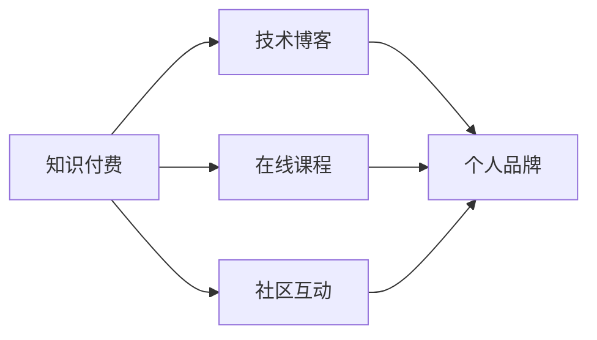

                 

# 程序员利用知识付费打造个人影响力

## 1. 背景介绍

在当今快速发展的科技行业中，个人品牌和影响力的建设已成为程序员职业发展的重要因素。随着知识付费时代的到来，在线课程、技术博客、视频讲座等新兴形式为程序员提供了展示个人技能和知识的机会。通过这些方式，程序员不仅能提升自己的技术水平，还能建立起自己的行业影响力，进而推动自己的职业生涯发展。

本文将深入探讨程序员如何通过知识付费打造个人影响力的策略和方法。我们将从背景、核心概念、具体实施步骤等多个角度，提供全面系统的分析与实践指南。

## 2. 核心概念与联系

### 2.1 核心概念概述

在进行详细分析前，我们需要首先明确几个核心概念：

- **知识付费**：指通过在线课程、视频讲座、技术博客等形式，向用户收取一定费用以获取专业知识和技能的互联网服务。
- **个人影响力**：指程序员在特定技术领域或行业内通过发布内容、技术分享、社区互动等方式建立的专业形象和信任度。
- **技术博客**：指程序员通过撰写技术文章，分享自己的技术见解和项目经验，提升自己在行业内的知名度和影响力。
- **在线课程**：指程序员制作的视频或图文课程，通过平台出售给有需求的学习者，建立品牌效应并吸引关注。
- **社区互动**：指程序员积极参与技术社区（如Stack Overflow、GitHub、知乎等）的讨论和交流，分享经验，建立自己的专业声誉。

这些概念之间的联系可以通过以下Mermaid流程图来展示：

从流程图可以看出，知识付费的三种形式（技术博客、在线课程、社区互动）均有助于提升个人品牌和影响力。

## 3. 核心算法原理 & 具体操作步骤

### 3.1 算法原理概述

知识付费和影响力提升的核心在于内容的价值和互动的质量。算法原理主要分为两大部分：

1. **内容创作与分发**：优质内容是提升影响力的基础。通过内容创作，程序员能够向用户提供有价值的信息和见解，建立专业形象。分发渠道则需精心选择，以最大化内容的覆盖和影响范围。
2. **用户互动与反馈**：互动是知识付费的另一个重要组成部分。通过与用户的互动，程序员可以及时获取反馈，了解需求，持续改进内容，同时建立信任和连接。

### 3.2 算法步骤详解

基于上述算法原理，以下是详细的操作步骤：

#### 步骤1: 确定目标受众和内容定位

1. **市场调研**：了解目标受众的需求和兴趣点，确定适合自己的内容和方向。
2. **制定内容规划**：基于调研结果，制定长期和短期内容计划，确保内容连贯性和覆盖面。

#### 步骤2: 内容创作与优化

1. **技术文章撰写**：撰写有深度、有广度、有方法论的技术文章，分享自己的实践经验和思考。
2. **视频课程制作**：录制高质量的视频课程，覆盖基础到高级的知识点，增加互动性。
3. **互动与反馈**：在技术社区和社交媒体上积极互动，回答用户问题，收集反馈，不断改进。

#### 步骤3: 内容分发与推广

1. **选择合适的平台**：根据目标受众的习惯，选择适合的发布平台，如Medium、Bilibili、知乎等。
2. **优化发布策略**：利用SEO、标签、关键词等策略，提升内容的曝光率。
3. **社交媒体推广**：在社交媒体上进行宣传，吸引更多关注和互动。

#### 步骤4: 用户互动与维护

1. **建立社群**：在社交媒体和社区上建立自己的社群，定期分享内容和互动。
2. **反馈收集与分析**：收集用户反馈，分析受众需求，不断调整内容策略。
3. **持续更新**：保持内容的持续更新，确保信息和技术的时效性。

### 3.3 算法优缺点

知识付费和影响力提升的算法有以下优点和缺点：

**优点**：
- **高效积累专业技能**：通过系统化的内容创作和学习，程序员能够快速提升自己的技术水平。
- **建立专业声誉**：优质的内容发布能够建立程序员在特定领域的专业形象，增加信任度。
- **拓展人脉**：通过社区互动和社群建设，程序员可以结识更多同行，拓展自己的人脉圈。

**缺点**：
- **时间和精力投入**：高质量内容创作和维护需要大量时间和精力。
- **市场竞争激烈**：知识付费市场竞争激烈，如何脱颖而出是一个挑战。
- **内容更新难度**：持续高质量的内容更新需要持续的精力投入和灵感源泉。

### 3.4 算法应用领域

知识付费和影响力提升的算法可以广泛应用于以下领域：

- **职业转型**：程序员通过在线课程和博客，分享自己的转型经验，帮助有相同需求的人。
- **技术教育**：创建高质量的教学内容，帮助初学者和技术爱好者学习新技能。
- **技术咨询**：在社区和社群中提供技术咨询，解答用户问题，建立专业声誉。
- **项目协作**：通过博客和社交媒体分享项目经验，吸引志同道合的开发者，共同合作。

## 4. 数学模型和公式 & 详细讲解

### 4.1 数学模型构建

知识付费和影响力提升的过程可以用数学模型来描述。设目标受众为 $U$，影响力为 $F$，内容质量为 $Q$，互动质量为 $I$，则数学模型可以表示为：

$$
F = f(U, Q, I)
$$

其中 $f$ 为影响函数，表示如何根据受众需求、内容质量和互动质量计算出影响力。

### 4.2 公式推导过程

根据影响函数 $f$ 的定义，我们可以进一步推导出：

$$
\frac{\partial F}{\partial Q} > 0
$$

$$
\frac{\partial F}{\partial I} > 0
$$

这表明，内容质量和互动质量是提升影响力的关键因素。内容质量越高，互动质量越好，影响力越大。

### 4.3 案例分析与讲解

以一个技术博客为例，我们可以使用A/B测试方法来分析内容质量和互动质量对影响力的影响。假设博客A的内容质量比博客B高，且两者互动质量相同，则根据公式推导结果，博客A的影响力必然高于博客B。

## 5. 项目实践：代码实例和详细解释说明

### 5.1 开发环境搭建

为了开展知识付费和影响力提升的项目实践，首先需要搭建好开发环境。以下是基本步骤：

1. **选择平台**：如Medium、Bilibili、知乎等。
2. **安装开发工具**：如VS Code、Atom、Sublime Text等。
3. **配置开发环境**：安装必要的开发工具和库，如Markdown、Git等。

### 5.2 源代码详细实现

以下是一个简单的博客文章撰写和发布流程示例：

1. **撰写文章**：使用Markdown编写博客文章，包括标题、正文、代码块、链接等。
2. **生成Markdown文件**：使用VS Code或其他编辑器将Markdown文件保存为 `.md` 格式。
3. **发布到Medium**：在Medium上创建一个账号，使用Markdown文件发布文章。

### 5.3 代码解读与分析

- **文章标题**：标题应简洁明了，包含关键词，吸引用户点击。
- **正文内容**：正文要结构清晰，内容丰富，有逻辑性，涵盖技术原理、实际应用、代码示例等。
- **代码块**：使用代码块展示关键代码，便于读者理解和复制。
- **链接**：在文章中插入相关链接，如GitHub、论文等，增加内容的权威性和可参考性。

### 5.4 运行结果展示

在Medium上成功发布文章后，可以查看阅读量、评论数、点赞数等数据，了解文章的影响力和受众反馈。

## 6. 实际应用场景

### 6.1 技术博客

技术博客是程序员展示专业技能和分享技术经验的主要方式。通过撰写高质量的技术文章，程序员可以建立自己的专业声誉，吸引更多关注和粉丝。

**应用场景**：
- **技术分享**：如深度学习、数据科学、区块链等前沿技术。
- **项目经验**：分享具体项目的实现过程、遇到的困难和解决方法。
- **技术教程**：编写详细的技术教程，帮助初学者学习和入门。

**具体实施**：
- **选择平台**：如Medium、CSDN、知乎等。
- **内容规划**：制定长期内容计划，定期发布新文章。
- **互动维护**：积极回复评论，分享社区文章，参与讨论。

### 6.2 在线课程

在线课程是程序员通过系统化的知识传授建立专业声誉的重要途径。通过录制高质量的视频课程，程序员可以覆盖更广的知识范围，吸引更多用户。

**应用场景**：
- **技术课程**：如Python、JavaScript、数据库管理等基础课程。
- **进阶课程**：如机器学习、人工智能、深度学习等高级课程。
- **专题课程**：如特定技术的深入讲解和实战应用。

**具体实施**：
- **平台选择**：如Udemy、Coursera、Bilibili等。
- **内容制作**：录制高质量的视频课程，提供配套笔记和代码示例。
- **推广宣传**：利用社交媒体、社区等渠道宣传课程，吸引用户。

### 6.3 社区互动

社区互动是程序员建立和维护专业影响力的重要方式。通过积极参与社区讨论，分享经验，程序员可以结识更多同行，拓展人脉。

**应用场景**：
- **问答社区**：如Stack Overflow、知乎等。
- **开源项目**：如GitHub等。
- **技术论坛**：如Reddit、CSDN等。

**具体实施**：
- **选择社区**：根据自己的兴趣和专业领域选择适合的社区。
- **积极互动**：回答问题，分享项目，参与讨论，建立自己的社群。
- **定期更新**：持续发布内容，分享最新技术动态。

## 7. 工具和资源推荐

### 7.1 学习资源推荐

以下是一些推荐的知识付费和影响力提升的学习资源：

1. **《知识付费：如何打造个人品牌》**：深入浅出地介绍了知识付费的发展和重要性，提供了实用的内容创作和运营策略。
2. **《内容营销全攻略》**：讲解了内容营销的核心原理和实践方法，适用于技术博客和在线课程的运营。
3. **《社交媒体营销：如何在抖音、微博、知乎等平台建立品牌》**：提供了社交媒体营销的详细指南，帮助程序员在各大平台推广内容。

### 7.2 开发工具推荐

以下是一些推荐的开发工具：

1. **VS Code**：功能强大、易用性高的编辑器，支持多种语言和扩展。
2. **Git**：版本控制系统，支持代码版本管理，适合团队协作。
3. **GitHub Pages**：免费托管Markdown文件，支持自动生成静态网站，方便博客发布。

### 7.3 相关论文推荐

以下是一些推荐的相关论文：

1. **《内容生成与用户互动的协同机制》**：分析了内容生成和用户互动的协同机制，提出了提高内容影响力的算法。
2. **《知识付费市场的用户行为分析》**：研究了知识付费市场中的用户行为，提出了提升用户满意度和忠诚度的策略。
3. **《社交媒体对个人品牌的影响》**：分析了社交媒体对个人品牌建立和维护的影响，提供了有效的社区互动策略。

## 8. 总结：未来发展趋势与挑战

### 8.1 总结

本文详细探讨了程序员如何通过知识付费打造个人影响力。我们首先介绍了背景和核心概念，接着分析了核心算法原理和具体操作步骤，最后提供了项目实践和资源推荐。通过系统的分析和实践指南，程序员可以更好地利用知识付费平台，提升自己在技术领域的知名度和影响力。

## 8.2 未来发展趋势

随着知识付费市场的不断成熟和扩展，未来将会出现更多的创新模式和平台。程序员可以利用这些新工具和新渠道，进一步提升自己的影响力。

**趋势**：
- **内容形式多样化**：除了文章和视频，音频、直播等形式也将逐渐普及。
- **社区互动深入化**：社区功能和工具将更加完善，程序员可以更高效地进行互动。
- **个性化推荐**：利用AI技术，提供个性化内容推荐，提高用户粘性。

## 8.3 面临的挑战

尽管知识付费和影响力提升有广阔的前景，但也面临以下挑战：

**挑战**：
- **内容质量要求高**：高质量的内容创作需要大量时间和精力。
- **平台竞争激烈**：知识付费市场竞争激烈，如何脱颖而出是一个挑战。
- **持续更新困难**：需要持续输出高质量的内容，保持内容的时效性和新颖性。

## 8.4 研究展望

未来的研究可以从以下几个方向进行：

**研究方向**：
- **AI辅助内容创作**：利用AI技术自动生成内容，提升创作效率和质量。
- **多渠道内容分发**：结合多种内容形式和渠道，最大化内容的覆盖和影响力。
- **用户行为分析**：深入研究用户行为，优化内容策略，提升用户体验和满意度。

## 9. 附录：常见问题与解答

### Q1: 如何选择一个合适的知识付费平台？

**A**: 选择平台时需要考虑以下几个因素：
1. **目标受众**：了解平台的受众特点，选择适合的内容形式和发布渠道。
2. **平台口碑**：选择有良好口碑的平台，确保内容的曝光率和可信度。
3. **平台功能**：选择功能完善、易于操作的平台，降低内容发布的门槛。

### Q2: 如何提升内容质量？

**A**: 提升内容质量可以从以下几个方面入手：
1. **深入研究**：选择感兴趣的领域，深入研究技术原理和应用场景。
2. **多维度展现**：利用文字、代码、图表等多种形式展示内容，增加阅读体验。
3. **定期更新**：持续输出高质量的内容，保持内容的及时性和新颖性。

### Q3: 如何有效互动？

**A**: 有效互动的关键在于积极参与和及时反馈：
1. **积极回复**：及时回复用户评论和提问，增加互动频率。
2. **分享互动**：在社区中分享自己的文章和项目，吸引更多关注和互动。
3. **建立社群**：在社交媒体和社区上建立自己的社群，定期分享内容和互动。

---

作者：禅与计算机程序设计艺术 / Zen and the Art of Computer Programming

