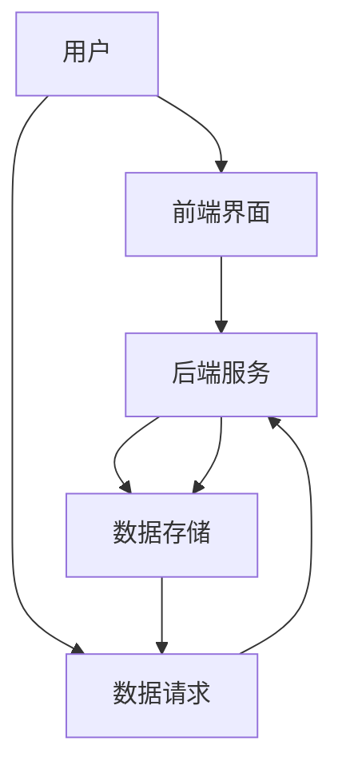

                 

# 程序员副业：移动应用开发

## 1. 背景介绍

在当下快速发展的数字时代，软件开发已成为一种越来越受欢迎的职业选择，不仅限于全职，同时也成为了许多程序员的主要副业来源。特别是随着移动设备的普及，开发移动应用的需求激增，为程序员提供了广阔的副业机会。本文旨在全面介绍移动应用开发的背景、核心概念以及实际操作步骤，以期帮助程序员更好地了解这一领域，并为其副业发展提供实用的建议。

## 2. 核心概念与联系

### 2.1 核心概念概述

移动应用开发是指开发运行在智能手机、平板电脑等移动设备上的应用程序，以满足用户特定需求的过程。这一过程涉及前端界面设计、后端服务开发、数据存储与处理等多个环节。

- **前端界面设计**：涉及用户界面(UI)和用户体验(UX)的设计，主要使用如Swift、Kotlin、JavaScript等编程语言。
- **后端服务开发**：包括服务端逻辑实现、API接口设计、数据存储与处理，主要使用如Java、Python、Node.js等编程语言。
- **数据存储与处理**：涉及数据库设计、数据同步与处理，主要使用如SQL、NoSQL、Firebase等技术。

### 2.2 核心概念原理和架构的 Mermaid 流程图

该流程图展示了移动应用开发的基本架构和流程：用户首先与前端界面进行交互，前端界面通过API请求后端服务，后端服务负责数据处理并将结果返回给前端，数据存储是数据处理的必要环节。

## 3. 核心算法原理 & 具体操作步骤

### 3.1 算法原理概述

移动应用开发的核心算法原理主要包括前端界面设计、后端服务开发和数据存储与处理。这些原理和技术的结合，使得移动应用能够满足用户的各种需求，提供流畅的用户体验。

- **前端界面设计**：通过UI/UX设计，用户界面简洁直观，易于使用。
- **后端服务开发**：服务端逻辑严谨，数据处理高效。
- **数据存储与处理**：确保数据的完整性和安全性，提供快速的数据访问和同步。

### 3.2 算法步骤详解

#### 3.2.1 前端界面设计

1. **需求分析**：与用户沟通，了解用户需求。
2. **原型设计**：使用工具如Sketch、Adobe XD等，创建应用原型。
3. **界面开发**：使用Swift、Kotlin等语言，开发用户界面。
4. **测试与优化**：通过用户测试，收集反馈，不断优化界面。

#### 3.2.2 后端服务开发

1. **需求分析**：明确应用的服务端需求。
2. **架构设计**：选择合适的技术栈，设计系统架构。
3. **服务实现**：使用Java、Python等语言，实现服务端逻辑。
4. **API设计**：设计RESTful API，定义数据接口。
5. **测试与部署**：进行单元测试、集成测试，部署服务到服务器。

#### 3.2.3 数据存储与处理

1. **需求分析**：明确应用的数据存储需求。
2. **数据库设计**：选择合适的数据库，设计数据模型。
3. **数据同步**：实现数据同步机制，确保数据一致性。
4. **数据处理**：进行数据清洗、分析等处理。
5. **测试与部署**：进行数据测试，部署数据库。

### 3.3 算法优缺点

#### 3.3.1 优点

1. **多功能性**：移动应用开发覆盖了前端、后端和数据处理等多个环节，技能应用广泛。
2. **高收入潜力**：市场对移动应用需求量大，开发应用有较高的收入潜力。
3. **灵活性**：可以在原有工作基础上，通过副业增加收入。

#### 3.3.2 缺点

1. **技术门槛高**：涉及多种技术栈，需要较长时间的学习和实践。
2. **市场需求变化快**：移动应用市场竞争激烈，需不断学习和适应新技术。
3. **时间投入大**：开发周期长，需要大量时间和精力投入。

### 3.4 算法应用领域

移动应用开发在多个领域都有广泛应用，包括但不限于：

- **教育**：开发教育类应用，如在线课程、学习工具等。
- **娱乐**：开发游戏、视频、音乐等娱乐类应用。
- **健康**：开发健康管理、健身、营养等应用。
- **金融**：开发理财、支付、金融信息等应用。
- **社交**：开发社交网络、即时通讯等应用。

## 4. 数学模型和公式 & 详细讲解 & 举例说明

### 4.1 数学模型构建

移动应用开发涉及的数学模型主要包括前端界面设计、后端服务开发和数据存储与处理。

#### 4.1.1 前端界面设计

1. **用户界面设计**：使用图形界面(GUI)模型，设计直观的UI。
2. **交互设计**：使用事件驱动模型，实现用户与应用的交互。

#### 4.1.2 后端服务开发

1. **服务端逻辑设计**：使用面向对象模型(OOP)，设计服务端逻辑。
2. **API接口设计**：使用RESTful接口设计模型，定义数据接口。

#### 4.1.3 数据存储与处理

1. **数据库设计**：使用关系型数据库(RDBMS)模型，设计数据模型。
2. **数据同步**：使用数据同步模型，确保数据一致性。

### 4.2 公式推导过程

#### 4.2.1 前端界面设计

$$
UI = UI_{设计} \times UI_{开发} \times UI_{测试}
$$

#### 4.2.2 后端服务开发

$$
服务端 = 服务端_{逻辑} \times 服务端_{API} \times 服务端_{测试}
$$

#### 4.2.3 数据存储与处理

$$
数据处理 = 数据存储 \times 数据同步 \times 数据测试
$$

### 4.3 案例分析与讲解

以一款在线教育应用为例，其开发过程如下：

1. **需求分析**：与教育机构沟通，了解课程需求。
2. **原型设计**：使用Sketch工具，创建应用原型。
3. **界面开发**：使用Swift语言，开发用户界面。
4. **服务端开发**：使用Java语言，实现课程管理、用户认证等服务端逻辑。
5. **API设计**：设计RESTful API，定义数据接口。
6. **数据存储**：使用MySQL数据库，设计课程和用户数据模型。
7. **数据同步**：实现数据同步机制，确保课程数据一致性。
8. **测试与部署**：进行单元测试、集成测试，部署应用到服务器。

## 5. 项目实践：代码实例和详细解释说明

### 5.1 开发环境搭建

1. **安装开发环境**：
   - 安装Xcode（iOS应用开发）或Android Studio（Android应用开发）。
   - 安装JDK、Maven等工具。
   - 配置本地开发环境，包括数据库、服务器等。

2. **配置Git仓库**：
   - 创建Git仓库，将项目代码上传到仓库。
   - 使用Git进行版本控制，方便团队协作。

3. **集成开发环境(IDE)**：
   - 使用Xcode或Android Studio等IDE，进行项目开发和调试。
   - 使用Gradle或CMake等工具，进行项目构建和打包。

### 5.2 源代码详细实现

以开发一款简单的To-Do应用为例：

#### 5.2.1 iOS应用开发

1. **界面设计**：
   - 使用Storyboard或XIB文件，设计应用界面。
   - 实现视图控制器，处理用户输入。

2. **服务端开发**：
   - 使用Node.js语言，实现任务管理、用户认证等服务端逻辑。
   - 设计RESTful API，定义数据接口。

3. **数据存储**：
   - 使用Firebase数据库，存储用户任务和数据。
   - 实现数据同步机制，确保数据一致性。

#### 5.2.2 Android应用开发

1. **界面设计**：
   - 使用XML布局文件，设计应用界面。
   - 实现Activity和Fragment，处理用户输入。

2. **服务端开发**：
   - 使用Java语言，实现任务管理、用户认证等服务端逻辑。
   - 设计RESTful API，定义数据接口。

3. **数据存储**：
   - 使用MySQL数据库，存储用户任务和数据。
   - 实现数据同步机制，确保数据一致性。

### 5.3 代码解读与分析

#### iOS应用开发

1. **界面设计**：
   - 使用Storyboard设计视图控制器，实现用户任务添加、删除等功能。
   - 使用XIB文件，设计视图布局，保证界面一致性。

2. **服务端开发**：
   - 使用Express框架，设计RESTful API，定义任务管理接口。
   - 实现用户认证，确保数据安全。

3. **数据存储**：
   - 使用Firebase实时数据库，存储用户任务和数据。
   - 实现数据同步机制，确保数据一致性。

#### Android应用开发

1. **界面设计**：
   - 使用XML布局文件，设计应用界面。
   - 实现Activity和Fragment，处理用户输入。

2. **服务端开发**：
   - 使用Spring Boot框架，实现任务管理、用户认证等服务端逻辑。
   - 设计RESTful API，定义数据接口。

3. **数据存储**：
   - 使用MySQL数据库，存储用户任务和数据。
   - 实现数据同步机制，确保数据一致性。

### 5.4 运行结果展示

#### iOS应用开发

1. **界面展示**：
   - 任务列表展示，显示用户添加的待办事项。
   - 任务编辑界面，允许用户修改任务信息。

2. **功能测试**：
   - 添加任务功能，允许用户添加新的待办事项。
   - 删除任务功能，允许用户删除待办事项。

#### Android应用开发

1. **界面展示**：
   - 任务列表展示，显示用户添加的待办事项。
   - 任务编辑界面，允许用户修改任务信息。

2. **功能测试**：
   - 添加任务功能，允许用户添加新的待办事项。
   - 删除任务功能，允许用户删除待办事项。

## 6. 实际应用场景

### 6.1 教育应用

教育应用开发在当今在线教育领域具有广泛的市场需求。开发在线课程、学习工具等应用，可以提供便捷的学习体验，满足用户的学习需求。

### 6.2 娱乐应用

娱乐应用开发涵盖游戏、视频、音乐等多个领域，可以为用户提供丰富的娱乐体验，增强用户黏性。

### 6.3 健康应用

健康应用开发涉及健康管理、健身、营养等领域，可以提供健康指导和建议，提升用户健康水平。

### 6.4 金融应用

金融应用开发包括理财、支付、金融信息等，可以提供便捷的金融服务，满足用户的金融需求。

### 6.5 社交应用

社交应用开发涉及社交网络、即时通讯等领域，可以提供便捷的社交功能，增强用户互动体验。

## 7. 工具和资源推荐

### 7.1 学习资源推荐

1. **Udacity课程**：提供iOS和Android应用开发的完整课程，涵盖前端、后端、数据存储等多个环节。
2. **Coursera课程**：提供深度学习在移动应用开发中的应用，涵盖AI技术在移动应用中的融合。
3. **GitHub项目**：大量开源移动应用项目，提供丰富的学习资源和代码参考。
4. **Google Play和App Store**：展示大量优秀移动应用，了解市场应用需求。
5. **Stack Overflow**：提供技术交流和问题解答平台，解决技术难题。

### 7.2 开发工具推荐

1. **Xcode**：苹果官方开发工具，支持iOS应用开发。
2. **Android Studio**：谷歌官方开发工具，支持Android应用开发。
3. **Visual Studio**：微软官方开发工具，支持跨平台应用开发。
4. **React Native**：跨平台开发框架，支持iOS和Android应用开发。
5. **Flutter**：跨平台开发框架，支持iOS和Android应用开发。

### 7.3 相关论文推荐

1. **《移动应用开发基础》**：详细介绍了移动应用开发的原理和实现技术。
2. **《移动应用性能优化》**：讨论了移动应用开发的性能优化策略。
3. **《移动应用安全性》**：讨论了移动应用开发中的安全问题和技术实现。

## 8. 总结：未来发展趋势与挑战

### 8.1 未来发展趋势

1. **AI技术融合**：AI技术在移动应用开发中的融合，将提升应用的功能和智能化水平。
2. **跨平台开发**：跨平台开发工具如React Native、Flutter等，将简化开发流程，提高开发效率。
3. **微服务架构**：微服务架构的应用，将提升应用的可扩展性和可维护性。
4. **无代码开发**：无代码开发工具的应用，将降低开发门槛，推动更多人进入移动应用开发领域。

### 8.2 面临的挑战

1. **技术更新快速**：移动应用开发涉及多种技术栈，需要不断学习和适应新技术。
2. **市场需求变化快**：市场竞争激烈，需不断优化和更新应用。
3. **资源消耗大**：移动应用开发资源消耗大，需合理分配和利用资源。
4. **用户需求多样**：用户需求多样，需灵活应对和满足。

### 8.3 研究展望

1. **AI与移动应用的深度融合**：探讨AI技术在移动应用中的深度融合，提升应用的智能化水平。
2. **跨平台开发的优化**：优化跨平台开发工具，提高开发效率。
3. **微服务架构的优化**：优化微服务架构，提升应用的可扩展性和可维护性。
4. **无代码开发的推广**：推广无代码开发工具，降低开发门槛。

## 9. 附录：常见问题与解答

**Q1：移动应用开发需要掌握哪些技术？**

A: 移动应用开发需要掌握前端界面设计、后端服务开发、数据存储与处理等多个技术。

**Q2：移动应用开发需要哪些开发工具？**

A: 移动应用开发需要Xcode、Android Studio、Visual Studio等开发工具，以及React Native、Flutter等跨平台开发框架。

**Q3：移动应用开发需要学习哪些编程语言？**

A: 移动应用开发需要学习Swift、Kotlin、Java、Python等编程语言。

**Q4：移动应用开发如何提高开发效率？**

A: 使用跨平台开发工具如React Native、Flutter，可以降低开发门槛，提高开发效率。

**Q5：移动应用开发如何优化性能？**

A: 优化数据同步机制、使用缓存技术、优化网络请求等方法可以提高移动应用的性能。

---

作者：禅与计算机程序设计艺术 / Zen and the Art of Computer Programming

