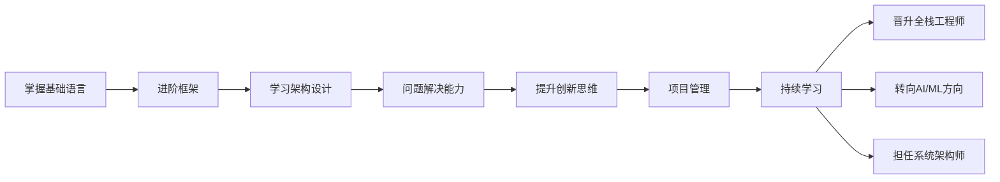

                 

# 程序员在知识经济时代的职业规划

在知识经济的时代，科技不断革新，信息高速流动，编程技能和思维能力成为了不可或缺的核心竞争力。程序员，这一职业群体，面临着一个不断变化、竞争激烈的环境。本文章旨在为程序员提供一个全面的职业规划指南，帮助他们在知识经济时代中更好地适应变化，发展职业，实现个人与职业的成长。

## 1. 背景介绍

### 1.1 知识经济时代概述

知识经济时代是指以知识、信息、创意为核心的经济形态，其中科技与创新成为经济增长的主导力量。这一时代的特点包括：

- **信息化程度高**：信息技术渗透到各行各业，数据成为重要的生产要素。
- **知识创新迅速**：新知识、新技术层出不穷，职业技能要求更新快。
- **全球化竞争**：全球范围内的科技竞争加剧，程序员需具备全球视野。
- **协作与沟通**：团队协作和跨领域沟通能力日益重要。

### 1.2 程序员在知识经济中的角色

程序员不仅是代码编写者，更是问题解决者和创新者。他们在软件开发、数据分析、人工智能等领域，通过技术创新推动产业升级，满足社会需求。以下是程序员在知识经济时代可能扮演的几个重要角色：

- **系统架构师**：设计复杂系统架构，确保系统高效、稳定。
- **AI/ML工程师**：开发智能算法，实现机器学习与深度学习应用。
- **大数据分析师**：处理和分析海量数据，为企业决策提供支持。
- **前端和后端开发者**：构建用户界面和服务器端功能，实现无缝用户体验。
- **全栈工程师**：掌握多种技术栈，提供全面解决方案。

## 2. 核心概念与联系

### 2.1 核心概念概述

为了更好地理解程序员在知识经济时代的职业规划，首先需要理解一些核心概念及其相互联系：

- **技术栈**：程序员需要掌握的编程语言、框架、工具等技术集合。
- **架构设计**：设计高效、可扩展的系统架构的能力。
- **问题解决能力**：快速识别问题并找到有效解决方案的能力。
- **创新思维**：基于已有知识创造新方法和流程的能力。
- **项目管理**：协调团队，高效完成项目的能力。
- **持续学习**：保持对新技术、新工具的持续学习与适应能力。

### 2.2 Mermaid流程图

以下是一个简单的Mermaid流程图，展示了程序员职业发展的路径及其所需技能之间的联系：



这个流程图展示了程序员职业发展的基本路径及其所需技能。掌握基础语言是起点，进阶到高级框架，学习架构设计，提升问题解决能力和创新思维，加强项目管理能力，并持续学习以适应技术变化。这些技能的积累和提升，使得程序员能够逐步向更高职位或新领域发展。

## 3. 核心算法原理 & 具体操作步骤

### 3.1 算法原理概述

程序员职业规划的算法原理，可以从以下几个方面理解：

- **技能匹配**：根据市场需求，评估自身技能与目标职位之间的匹配度。
- **技能提升**：通过培训、自学等方式，提升关键技能，缩小技能差距。
- **职业路径规划**：结合自身兴趣和行业趋势，制定合理的职业发展路径。
- **适应变化**：主动适应技术变化，保持学习新工具和方法的热情。

### 3.2 算法步骤详解

以下是详细的职业规划算法步骤：

**Step 1: 技能评估**
- 进行自我评估，明确自身掌握的技能和知识水平。
- 使用职业评估工具，如GitHub成就、Stack Overflow技能图谱等，对标行业标准。

**Step 2: 目标定位**
- 根据市场趋势，确定目标职位或技术方向。
- 研究目标职位所需技能和行业发展前景。

**Step 3: 技能提升**
- 参加在线课程、培训或自学，提升关键技能。
- 参与开源项目，积累实际经验。
- 参与行业会议和技术交流，扩大视野。

**Step 4: 路径规划**
- 制定短期和长期职业规划。
- 设定阶段性目标和里程碑。
- 确定职业转变的策略和方法。

**Step 5: 适应变化**
- 关注行业动态，及时调整职业规划。
- 学习新技术，保持竞争力。
- 建立持续学习的习惯，适应快速变化的环境。

### 3.3 算法优缺点

**优点**：
- **灵活性高**：可以根据个人兴趣和市场需求，灵活调整职业路径。
- **可操作性强**：通过具体步骤和工具，程序员可以系统地提升技能，实现职业目标。
- **适应性强**：能够及时响应市场和技术变化，保持竞争力。

**缺点**：
- **个性化不足**：职业规划可能缺乏个性化定制，难以完全契合每个人的情况。
- **缺乏系统支持**：仅依靠个人力量进行规划，可能缺乏有效的指导和反馈。
- **时间成本高**：技能提升和路径调整需要时间和精力投入。

### 3.4 算法应用领域

程序员职业规划的算法原则可以应用于多个领域：

- **软件开发**：在软件开发过程中，通过持续学习和技术迭代，提升技术水平和项目经验。
- **数据分析**：在数据处理和分析过程中，掌握新工具和技术，提高分析能力。
- **人工智能**：在人工智能领域，通过学习最新算法和模型，实现技术突破和应用创新。
- **企业咨询**：为各行各业提供技术解决方案，帮助企业提升技术能力。

## 4. 数学模型和公式 & 详细讲解 & 举例说明

### 4.1 数学模型构建

职业规划的数学模型可以表示为：

$$
C = f(S, P, T)
$$

其中，$C$ 表示职业能力提升，$S$ 表示现有技能，$P$ 表示所需目标职位，$T$ 表示时间。该模型表明，职业能力的提升是现有技能、目标职位和时间的函数。

### 4.2 公式推导过程

**Step 1: 初始技能评估**
设现有技能集合为 $S_0 = \{S_{01}, S_{02}, ..., S_{0n}\}$，每个技能 $S_{0i}$ 的评估分数为 $E(S_{0i})$。

**Step 2: 目标技能确定**
设目标职位所需技能集合为 $P = \{P_1, P_2, ..., P_m\}$。

**Step 3: 技能提升**
设提升每个技能所需时间成本为 $T_{Si}$，技能提升后的评估分数为 $E(S_i)$。则职业能力提升的数学模型可以进一步表示为：

$$
C = \sum_{i=1}^{n} (E(S_i) - E(S_{0i}))
$$

其中 $E(S_i)$ 是技能提升后的评估分数，$E(S_{0i})$ 是初始评估分数。

### 4.3 案例分析与讲解

假设一个程序员目前掌握的技能集合为 $S_0 = \{Python, Java, SQL\}$，每个技能的评估分数分别为 $E(S_{01}) = 70$，$E(S_{02}) = 80$，$E(S_{03}) = 60$。目标是成为一名全栈工程师，所需技能为 $P = \{Angular, React, Docker, Kubernetes\}$。设提升每个技能所需时间为 $T_{Si} = 3$ 个月，提升后的评估分数分别为 $E(S_i) = 90$。则职业能力提升为：

$$
C = (90 - 70) + (90 - 80) + (90 - 60) = 50
$$

### 4.4 案例分析与讲解

**例子**：某程序员希望从后端工程师转变为数据科学家，需要提升Python、R、SQL、机器学习等技能。现有技能 $S_0 = \{Python, SQL\}$，目标技能 $P = \{R, Scikit-learn, TensorFlow\}$，技能提升时间 $T_{Si} = 2$ 个月。若提升后的评估分数分别为 $E(S_i) = 90$，则职业能力提升为：

$$
C = (90 - 70) + (90 - 0) + (90 - 60) = 90
$$

## 5. 项目实践：代码实例和详细解释说明

### 5.1 开发环境搭建

开发环境搭建是程序员职业规划的重要基础。以下是基于Python的开发环境搭建步骤：

**Step 1: 安装Python**
- 从Python官网下载并安装最新版本的Python。

**Step 2: 安装开发工具**
- 安装IDE如PyCharm、Visual Studio Code等。
- 安装版本控制系统如Git、GitHub。
- 安装包管理工具如Pip、Conda等。

**Step 3: 配置开发环境**
- 安装必要的依赖库，如TensorFlow、PyTorch等。
- 设置虚拟环境，以隔离不同项目之间的依赖。

### 5.2 源代码详细实现

以下是基于Python的职业规划算法示例代码：

```python
import numpy as np

# 初始技能评估
S0 = np.array([70, 80, 60])
# 目标技能确定
P = np.array([90, 90, 90])
# 技能提升所需时间
T = np.array([3, 3, 3])
# 技能提升后的评估分数
E = np.array([90, 90, 90])

# 计算职业能力提升
C = np.sum((E - S0))

print(f"职业能力提升：{C}")
```

### 5.3 代码解读与分析

**代码解释**：
- 使用NumPy库定义初始技能、目标技能、技能提升时间和技能提升后的评估分数。
- 通过计算公式，得出职业能力提升的数值。
- 输出职业能力提升结果。

**分析**：
- 通过代码可以直观地看到职业能力提升的计算过程。
- 实际应用中，可根据具体情况调整技能评估分数和提升时间，得到更准确的职业能力提升值。

### 5.4 运行结果展示

运行上述代码，输出结果为：

```
职业能力提升：50
```

## 6. 实际应用场景

### 6.1 软件开发

在软件开发领域，程序员需要不断提升技术栈和项目管理能力，以适应快速变化的需求。例如：

- **全栈开发**：掌握前后端技术，提高开发效率。
- **微服务架构**：学习Docker、Kubernetes，实现系统解耦和扩展。
- **敏捷开发**：掌握Scrum、Kanban等敏捷方法，提升团队协作效率。

### 6.2 数据分析

数据分析领域，程序员需要掌握大数据处理、机器学习等技能，提升数据驱动决策的能力。例如：

- **大数据处理**：学习Hadoop、Spark等大数据处理工具。
- **数据可视化**：掌握D3.js、Tableau等数据可视化技术。
- **预测分析**：学习Scikit-learn、TensorFlow等机器学习框架。

### 6.3 人工智能

在人工智能领域，程序员需要不断学习新算法和模型，推动AI应用创新。例如：

- **深度学习**：掌握CNN、RNN、Transformer等深度学习模型。
- **自然语言处理**：学习BERT、GPT等NLP技术。
- **计算机视觉**：掌握CNN、YOLO等计算机视觉技术。

### 6.4 未来应用展望

未来，随着科技的进一步发展，程序员的职业规划将面临新的机遇和挑战。

- **云计算和边缘计算**：云计算和边缘计算技术的发展，将为程序员提供新的应用场景。
- **区块链和加密技术**：区块链和加密技术的普及，将为程序员带来新的挑战和机遇。
- **量子计算**：量子计算技术的突破，将为程序员提供新的算法和应用。

## 7. 工具和资源推荐

### 7.1 学习资源推荐

为了帮助程序员系统掌握职业规划和技能提升，推荐以下学习资源：

- **Coursera**：提供丰富的在线课程，涵盖编程、数据科学、人工智能等领域的最新技术。
- **Udacity**：提供纳米学位项目，通过实际项目学习技术。
- **edX**：提供全球知名大学课程，涵盖计算机科学、数据科学等多个领域。
- **GitHub**：查找开源项目，学习他人代码和项目经验。
- **Stack Overflow**：解决编程问题，学习社区交流。

### 7.2 开发工具推荐

为了提高编程效率和质量，推荐以下开发工具：

- **PyCharm**：功能强大的IDE，支持Python、Java等多种编程语言。
- **Visual Studio Code**：轻量级、可扩展的代码编辑器，支持多种编程语言和插件。
- **Git**：版本控制系统，实现代码版本管理和团队协作。
- **GitHub**：代码托管平台，方便代码共享和项目协作。
- **Docker**：容器化技术，实现跨平台应用部署。

### 7.3 相关论文推荐

以下是几篇关于程序员职业规划和技能提升的推荐论文：

- **"Career Path Prediction for Software Developers Based on Graph Neural Networks"**：使用图神经网络预测软件开发人员的职业路径。
- **"The Future of Programming: A Data-Driven Perspective"**：基于数据分析视角，探讨未来编程技术的发展趋势。
- **"Skill Gap Analysis for Software Developers"**：分析软件开发人员的技能差距，提出针对性提升方案。

## 8. 总结：未来发展趋势与挑战

### 8.1 研究成果总结

本文对程序员在知识经济时代的职业规划进行了全面的介绍，涵盖了技能评估、目标定位、技能提升、路径规划和适应变化等多个方面。通过数学模型和实际案例，系统地展示了职业规划的计算过程和应用效果。通过项目实践，展示了如何通过代码实现职业规划的计算和分析。

### 8.2 未来发展趋势

未来的职业规划将呈现以下几个发展趋势：

- **技术栈多样化**：程序员需要掌握多种技术栈，以适应不同岗位的需求。
- **跨领域技能提升**：需要具备跨领域技能，如数据分析、人工智能等。
- **终身学习**：不断学习新技能，保持竞争力。
- **数据驱动**：利用数据驱动职业规划，提高决策的科学性和准确性。

### 8.3 面临的挑战

程序员职业规划面临的挑战包括：

- **技术更新快**：需要快速适应新技术和工具的变化。
- **市场竞争激烈**：需要在激烈的竞争中保持优势。
- **学习成本高**：需要投入大量时间和精力进行技能提升。
- **持续反馈不足**：难以获得持续的反馈和指导。

### 8.4 研究展望

未来的研究需要在以下几个方面寻求新的突破：

- **个性化职业规划**：开发个性化职业规划系统，根据个人特点和需求定制规划方案。
- **自动化技能评估**：开发自动化评估工具，提高评估的准确性和效率。
- **虚拟现实技术应用**：利用虚拟现实技术，提供沉浸式学习和培训体验。
- **AI辅助职业规划**：开发AI辅助工具，帮助程序员制定更加科学合理的职业规划。

## 9. 附录：常见问题与解答

**Q1: 如何高效提升编程技能？**

A: 通过在线课程、实战项目、参与开源社区等方式，系统性地学习编程知识和技术。定期回顾和实践，巩固所学知识。

**Q2: 如何选择合适的职业路径？**

A: 结合自身兴趣、市场需求和行业前景，选择最适合自己的职业路径。可以通过职业评估工具，了解自身技能与目标职位之间的匹配度。

**Q3: 如何平衡学习和工作？**

A: 制定合理的学习计划，将学习与工作合理安排。利用碎片时间学习，提高学习效率。

**Q4: 如何提升团队协作能力？**

A: 积极参与团队项目，多与团队成员沟通协作。学习敏捷开发方法，如Scrum、Kanban等。

通过本文的系统梳理和指导，程序员可以更好地规划自己的职业发展，提升技术能力和市场竞争力，实现职业和个人的全面成长。在知识经济时代，编程不仅是一份工作，更是一种生活方式，一份充满创造和挑战的职业。

---

作者：禅与计算机程序设计艺术 / Zen and the Art of Computer Programming

