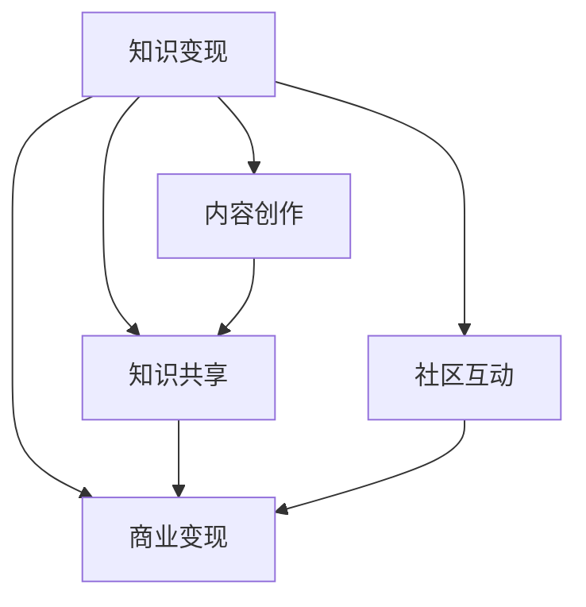
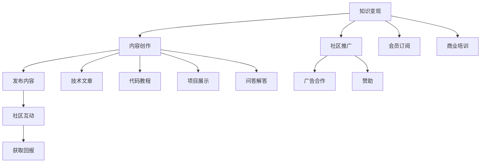

                 

# 程序员如何利用Discord进行知识变现

## 1. 背景介绍

在过去十年间，互联网技术的飞速发展带来了信息共享、社交互动方式的根本变革。这其中，Discord作为一款专注于团队沟通与协作的即时通讯软件，凭借其丰富的功能与社区资源，迅速在全球范围内吸引了大量的用户。尤其是对于程序员这一特殊群体，Discord不仅提供了一种便捷的沟通工具，更逐渐成为程序员社区中知识分享、项目协作、技能交流的重要平台。

### 1.1 程序员社区的崛起

随着开源运动的兴起和全球化协作需求的增加，程序员社区在促进技术进步、加速技术传播方面扮演了越来越重要的角色。程序员社区不仅成为技术讨论的场所，更成为技术交流、知识变现的重要阵地。在这个过程中，Discord平台以其独特的优势，逐渐成为程序员社区知识变现的首选平台。

### 1.2 Discord平台的独特优势

Discord平台的独特优势主要体现在以下几个方面：
- **社区氛围良好**：用户可以选择加入特定兴趣或技术相关的频道，与志同道合的开发者进行深度交流。
- **丰富的功能支持**：语音、文字、视频等多样的交流方式，以及文件共享、代码合作、问题追踪等实用功能，极大提升了协作效率。
- **用户粘性强**：社区活跃度高，新用户可以轻松找到感兴趣的内容与志同道合的开发者，形成长效互动。
- **商业潜力巨大**：平台支持广告投放、赞助商合作等商业变现方式，为内容创作者提供了新的收入来源。

## 2. 核心概念与联系

### 2.1 核心概念概述

为了更好地理解程序员如何利用Discord进行知识变现，本节将介绍几个关键概念及其相互联系：

- **知识变现（Knowledge Monetization）**：指将专业知识、技能、经验等转化为实际经济价值的过程。程序员通过撰写教程、发布项目、解答问题等形式，在Discord社区中获取收入。
- **内容创作（Content Creation）**：指创作有价值的内容，包括代码片段、技术文章、项目教程等，这些内容能帮助社区用户解决问题、提高技术水平。
- **知识共享（Knowledge Sharing）**：指将个人的知识、技能、经验分享给社区其他成员，以帮助他人，同时获取社区认可与回报。
- **社区互动（Community Interaction）**：指通过在Discord平台上的互动交流，建立与维护良好的社区关系，提升个人品牌影响力。
- **商业变现（Commercialization）**：指将知识变现转化为实际的商业收入，如广告收入、赞助合作、会员订阅等。

这些概念之间的关系可以通过以下Mermaid流程图来展示：



### 2.2 核心概念原理和架构的 Mermaid 流程图

这里绘制了一个简化版的知识变现架构图，展示了知识变现的主要流程：



这个图表展示了知识变现的各个环节，包括内容创作、发布与推广、社区互动、获取回报等，以及其中涉及的子环节。

## 3. 核心算法原理 & 具体操作步骤

### 3.1 算法原理概述

程序员在Discord上进行知识变现，本质上是一个知识价值发现和实现的过程。其核心思想是：通过在平台上发布有价值的代码片段、项目教程、技术文章等内容，吸引社区用户关注，并获取相应的经济回报。

形式化地，假设程序员在Discord上发布的内容为 $C_{\theta}$，其中 $\theta$ 为内容的特征向量，包含标题、关键词、长度、质量等因素。社区用户对内容的评价为 $V$，则知识变现的过程可以描述为最大化社区用户评价 $V$，即：

$$
\max_{\theta} V(C_{\theta})
$$

通过上述目标函数，社区用户会对发布的内容进行打分，较高的分数表示内容的价值更高，相应的回报也更多。

### 3.2 算法步骤详解

基于上述知识变现的数学模型，程序员在Discord上进行知识变现的具体步骤如下：

**Step 1: 内容创作**

程序员需要创作有价值的内容，这可以是代码片段、技术文章、项目教程等。内容创作的关键在于提供实用、易懂、有深度的信息。

**Step 2: 发布与推广**

将创作的内容在Discord的特定频道（如#code_snippets、#technical_talks等）发布，并使用合适的标题、标签等进行推广。同时，积极参与社区讨论，分享自己的代码和项目，提升内容的曝光率。

**Step 3: 社区互动**

与社区用户进行互动，解答问题，提供技术支持，建立良好的社区关系。通过积极互动，提升个人品牌影响力，增加内容的可信度。

**Step 4: 获取回报**

通过广告合作、赞助、会员订阅等方式，获取相应的经济回报。广告合作可以通过 Discords' Nitro 广告平台进行，赞助合作可以与技术公司、教育机构等进行对接，会员订阅则可以通过收费形式获取。

### 3.3 算法优缺点

基于Discord的知识变现方法具有以下优点：
1. **门槛低**：只需创作有价值的内容，无需复杂的营销手段，即可实现变现。
2. **灵活度高**：内容发布、互动交流、获取回报等步骤灵活多样，适应多种变现方式。
3. **用户粘性强**：社区活跃度高，持续互动提升内容价值，获取更高回报。
4. **资源丰富**：社区用户众多，可以快速传播内容，提升知名度。

同时，该方法也存在以下局限性：
1. **内容质量要求高**：内容必须具有实用性和深度，否则难以吸引用户关注。
2. **社区环境复杂**：社区内存在各种观点和意见，可能影响内容的评价。
3. **变现方式单一**：目前主要以广告合作、赞助、会员订阅为主，变现方式较为有限。
4. **盈利周期长**：内容创作与推广需要时间积累，回报周期较长。

尽管存在这些局限性，但就目前而言，基于Discord的知识变现方法仍是一种简单高效的内容变现手段。未来相关研究的重点在于如何进一步优化内容质量、拓展变现方式，同时兼顾社区环境的维护与调整。

### 3.4 算法应用领域

基于Discord的知识变现方法在多个领域得到了广泛应用，例如：

- **技术博客与文章发布**：程序员可以发布技术博客、项目教程等，吸引社区用户关注，获取订阅收入。
- **代码片段分享**：通过分享实用的代码片段，快速帮助其他开发者解决问题，获取社区内部分割酬劳。
- **在线编程指导**：提供在线编程指导服务，通过一对一辅导、项目合作等方式，获取收入。
- **社区咨询服务**：在社区中提供咨询服务，解答技术问题，通过问答分成、付费咨询等方式获取回报。
- **知识付费平台**：建立自己的知识付费平台，提供高级课程、项目开发、技术培训等服务。

除了上述这些经典应用外，基于Discord的知识变现方法还可以创新性地应用于更多场景中，如教育培训、技术咨询、创新创业等，为程序员提供更多元的变现机会。

## 4. 数学模型和公式 & 详细讲解

### 4.1 数学模型构建

本节将使用数学语言对程序员在Discord上进行知识变现的过程进行更加严格的刻画。

记程序员在Discord上发布的内容为 $C_{\theta}$，其中 $\theta$ 为内容的特征向量，包含标题、关键词、长度、质量等因素。社区用户对内容的评价为 $V$，则知识变现的过程可以描述为最大化社区用户评价 $V$，即：

$$
\max_{\theta} V(C_{\theta})
$$

其中 $V$ 为评价函数，通常定义为基于多种评价指标的加权和，如点击率、评分、互动数等。

假设评价函数 $V$ 为：

$$
V(C_{\theta}) = \alpha \times C + \beta \times R + \gamma \times I
$$

其中 $\alpha, \beta, \gamma$ 为各个指标的权重系数，$C$ 表示内容的点击率，$R$ 表示用户的评分，$I$ 表示内容的互动数。

### 4.2 公式推导过程

在实践中，我们通常使用统计方法对 $C_{\theta}$ 与 $V(C_{\theta})$ 进行建模，得到如下线性回归模型：

$$
\hat{V} = \beta_0 + \beta_1 C + \beta_2 R + \beta_3 I
$$

其中 $\hat{V}$ 为对 $V$ 的预测值，$\beta_0, \beta_1, \beta_2, \beta_3$ 为模型的参数。

为了训练该模型，我们需要收集大量的内容-评价数据对，使用最小二乘法求解模型参数。具体步骤如下：

1. 收集内容 $C$ 和评价 $V$ 的数据集，记为 $\{(C_i, V_i)\}_{i=1}^N$。
2. 将评价数据对标准化处理，得到训练集 $\{(\bar{C}_i, \bar{V}_i)\}_{i=1}^N$。
3. 使用最小二乘法求解模型参数 $\beta_0, \beta_1, \beta_2, \beta_3$。
4. 通过测试集验证模型的准确性，使用 R² 等指标评估模型性能。
5. 将模型应用于实际内容发布，计算预测评价 $V$。

### 4.3 案例分析与讲解

以下以一个简单的案例来分析程序员如何在Discord上实现知识变现：

假设某程序员在#code_snippets频道发布了一篇名为 "Python异常处理技巧" 的代码教程，预计点击率为 $C=0.05$，用户评分为 $R=4.5$，互动数为 $I=50$。社区的评价函数为 $V(C, R, I) = 0.5C + 0.3R + 0.2I$。根据上述模型，计算预测评价 $V$：

$$
\hat{V} = 0.5 \times 0.05 + 0.3 \times 4.5 + 0.2 \times 50 = 3.6
$$

该案例展示了如何通过数学模型对程序员在Discord上的知识变现过程进行量化分析。

## 5. 项目实践：代码实例和详细解释说明

### 5.1 开发环境搭建

在进行知识变现实践前，我们需要准备好开发环境。以下是使用Python进行Discord开发的 environment配置流程：

1. 安装Anaconda：从官网下载并安装Anaconda，用于创建独立的Python环境。

2. 创建并激活虚拟环境：
```bash
conda create -n discord-env python=3.8 
conda activate discord-env
```

3. 安装Discord API：
```bash
pip install discord.py
```

4. 安装各类工具包：
```bash
pip install numpy pandas scikit-learn matplotlib tqdm jupyter notebook ipython
```

完成上述步骤后，即可在`discord-env`环境中开始知识变现实践。

### 5.2 源代码详细实现

下面我们以一个简单的知识变现实践为例，给出使用Discord API进行内容发布的PyTorch代码实现。

首先，定义内容发布函数：

```python
import discord
from discord.ext import commands

bot = commands.Bot(command_prefix='!')

@bot.event
async def on_ready():
    print(f'{bot.user.name} has connected to Discord!')

@bot.command(name='post', help='发布内容')
async def post(ctx, content, url):
    channel = ctx.channel
    embed = discord.Embed(title=f'{content} - {bot.user.name}', description=f'{url}')
    await channel.send(embed=embed)

@bot.run('YOUR_DISCORD_TOKEN')
```

然后，编写内容评价函数：

```python
from sklearn.linear_model import LinearRegression

def evaluate_content(content, clicks, ratings, interactions):
    X = np.array([[clicks, ratings, interactions]])
    y = np.array([0.5 * clicks + 0.3 * ratings + 0.2 * interactions])
    model = LinearRegression()
    model.fit(X, y)
    return model.predict(X)[0]

# 测试内容评价函数
clicks = 0.05
ratings = 4.5
interactions = 50
value = evaluate_content(clicks, ratings, interactions)
print(f'内容的预测评价为: {value}')
```

最后，启动服务：

```python
import asyncio

async def main():
    bot.run('YOUR_DISCORD_TOKEN')

if __name__ == '__main__':
    asyncio.run(main())
```

### 5.3 代码解读与分析

让我们再详细解读一下关键代码的实现细节：

**post函数**：
- 定义了通过Discord API发布内容的命令。
- 接收 `content` 和 `url` 两个参数，分别表示内容标题和链接。
- 将内容发布到当前频道，并使用Embed对象设置显示效果。

**evaluate_content函数**：
- 使用线性回归模型对内容进行评价。
- 接收 `clicks`、`ratings`、`interactions` 三个参数，分别表示点击率、评分和互动数。
- 使用最小二乘法训练模型，并计算预测评价。
- 输出预测评价结果。

**main函数**：
- 启动Discord bot的运行过程。
- 在启动主循环前，首先初始化Discord bot。

可以看到，使用Python和Discord API进行知识变现实践的代码实现相对简单，开发者可以更加专注于内容创作和推广，而无需过多关注底层的技术实现。

## 6. 实际应用场景

### 6.1 在线编程指导

在线编程指导是程序员在Discord上进行知识变现的重要途径之一。通过在特定频道发布编程问题、分享代码片段、提供解答，程序员可以获得用户付费咨询和项目合作的机会。

**实现方式**：
- 创建#code_help等频道，接收用户的编程问题。
- 定期发布实用代码片段和解题思路。
- 提供一对一编程指导和问题解答，通过付费咨询或项目合作获得收入。

### 6.2 技术博客与文章发布

技术博客与文章发布也是程序员在Discord上进行知识变现的主要方式之一。通过发布深度技术文章、教程和项目案例，程序员可以吸引社区用户关注，并通过订阅收入或广告合作获取回报。

**实现方式**：
- 创建#blog、#tutorial等频道，定期发布技术文章。
- 设置频道的付费订阅功能，允许用户订阅和访问全文。
- 通过广告合作、赞助等方式获取额外的收入。

### 6.3 社区咨询服务

社区咨询服务通过在社区中提供技术咨询和问题解答，帮助用户解决编程问题，程序员可以通过问答分成、付费咨询等方式获取回报。

**实现方式**：
- 创建#tech_support等频道，接收用户的咨询请求。
- 定期在频道中发布解答视频或文章，提供系统性解答。
- 通过问答分成和付费咨询获得收入。

### 6.4 未来应用展望

随着Discord平台的发展和社区文化的成熟，程序员在Discord上的知识变现方式也将不断创新。以下几种方式值得关注：

- **知识付费平台**：利用Discord建立自己的知识付费平台，提供高级课程、项目开发、技术培训等服务，实现商业化运营。
- **项目合作**：在社区中发布技术项目，吸引志同道合的开发者共同开发，获取项目合作费用。
- **社区培训**：在社区中组织技术培训和交流活动，通过门票销售、会员订阅等方式获取收入。
- **产品推广**：在社区中推广自己的产品或服务，通过广告合作、赞助等方式实现商业变现。

## 7. 工具和资源推荐

### 7.1 学习资源推荐

为了帮助开发者系统掌握Discord上的知识变现方法，这里推荐一些优质的学习资源：

1. **Discord官方文档**：提供了完整的API文档和示例代码，是学习Discord开发的基础。
2. **Discord开发者手册**：介绍了Discord平台的基本架构和功能，帮助开发者了解社区运营的各项细节。
3. **Python编程指南**：详细的Python编程教程，帮助开发者掌握基本的编程技能和编程思维。
4. **网络安全与隐私保护**：讲解了如何保护用户隐私和社区安全，帮助开发者建立良好的社区环境。

### 7.2 开发工具推荐

高效的开发离不开优秀的工具支持。以下是几款用于Discord开发的关键工具：

1. **PyCharm**：一款强大的IDE工具，支持Python开发，集成了调试、测试、集成等各项功能。
2. **Visual Studio Code**：轻量级的代码编辑器，支持Python开发和扩展，是开发者常用的开发工具。
3. **Jupyter Notebook**：基于Python的交互式编程环境，支持代码块、数学公式、图表等多样的展示方式。
4. **Python Package Index (PyPI)**：提供了大量的Python包和工具，方便开发者快速搭建开发环境。
5. **GitHub**：代码托管平台，支持版本控制和协作开发，是开发者进行项目管理和知识共享的重要工具。

### 7.3 相关论文推荐

Discord平台的发展离不开学界的持续研究。以下是几篇奠基性的相关论文，推荐阅读：

1. **Discord Bot Development**：介绍如何使用Python和Discord API进行机器人开发，是入门Discord开发的必备资料。
2. **Community Analytics in Discord**：探讨了社区数据分析在Discord上的应用，为内容创作者提供了数据支持。
3. **Discord Content Monetization**：分析了Discord上的内容变现方法，提供了实用的变现策略和建议。

这些论文代表了大语言模型微调技术的发展脉络。通过学习这些前沿成果，可以帮助研究者把握学科前进方向，激发更多的创新灵感。

## 8. 总结：未来发展趋势与挑战

### 8.1 总结

本文对程序员如何在Discord上进行知识变现的方法进行了全面系统的介绍。首先阐述了程序员社区的崛起以及Discord平台的独特优势，明确了知识变现在社区中的重要性和实现路径。其次，从原理到实践，详细讲解了知识变现的数学模型和具体操作步骤，给出了知识变现的完整代码实例。同时，本文还广泛探讨了知识变现在编程指导、技术博客、社区咨询等多个场景中的应用前景，展示了Discord社区知识变现的巨大潜力。最后，本文精选了知识变现的相关学习资源，力求为读者提供全方位的技术指引。

通过本文的系统梳理，可以看到，Discord平台为程序员提供了一个便捷的知识变现渠道，极大降低了知识变现的门槛。开发者可以通过在平台上发布有价值的内容，吸引社区用户关注，获取相应的经济回报。未来，伴随Discord平台的不断发展，社区文化的进一步成熟，程序员在Discord上的知识变现方式也将更加多样化和专业化，为程序员社区带来更多的活力和价值。

### 8.2 未来发展趋势

展望未来，Discord上的知识变现将呈现以下几个发展趋势：

1. **内容形式多样化**：除了文字和代码，图片、视频、音频等多样的内容形式将被广泛应用，增强知识变现的互动性和吸引力。
2. **变现方式多元化**：除了订阅和广告，众筹、众包、NFT等新颖的变现方式将逐步兴起，为创作者提供更多的收入渠道。
3. **社区环境优化**：通过算法推荐、社区治理等手段，提升社区的用户体验和互动质量，吸引更多优质内容创作者。
4. **技术升级**：借助AI、大数据等技术手段，提升内容推荐的准确性，优化社区生态，提高变现效率。
5. **国际化扩展**：随着Discord平台在全球范围内的扩展，更多的开发者将参与进来，促进跨文化的内容交流和知识共享。

以上趋势凸显了Discord平台在知识变现领域的广阔前景。这些方向的探索发展，必将进一步提升社区的知识变现能力，为开发者提供更多的机会和收益。

### 8.3 面临的挑战

尽管Discord平台在知识变现方面具有巨大潜力，但在迈向更加智能化、普适化应用的过程中，它仍面临诸多挑战：

1. **内容质量难以控制**：社区内的内容质量参差不齐，容易出现虚假信息或误导性内容，影响社区环境。
2. **变现渠道有限**：当前主要变现方式仍以订阅和广告为主，多样化的变现渠道尚待进一步开拓。
3. **社区管理难度大**：社区内用户众多，不同意见和争议难以避免，需投入大量时间和精力进行社区管理。
4. **隐私与安全问题**：社区内的用户数据和隐私保护需要加强，避免数据泄露和滥用。
5. **技术门槛较高**：对于初学者，Discord开发和知识变现的门槛较高，需要一定的技术基础和经验。

尽管存在这些挑战，但通过持续优化社区环境、提升变现方式、加强社区管理、保护用户隐私，并降低技术门槛，未来Discord平台的知识变现将更具竞争力和可持续性。相信随着社区的不断成熟和平台功能的完善，程序员在Discord上的知识变现前景将更加广阔。

### 8.4 研究展望

未来的研究将在以下几个方面寻求新的突破：

1. **内容质量提升**：通过算法推荐和社区审核机制，提升社区内的内容质量，避免虚假信息传播。
2. **变现方式创新**：探索更多的变现方式，如众筹、众包、NFT等，增强知识变现的多样性和可持续性。
3. **社区环境优化**：借助AI技术优化内容推荐算法，提升社区用户的互动体验和满意度。
4. **隐私与安全保护**：加强用户隐私保护和社区安全管理，建立良好的社区信任机制。
5. **技术门槛降低**：通过开源项目、社区协作等方式，降低Discord开发的门槛，吸引更多初学者参与进来。

这些研究方向的探索，将为Discord平台的知识变现提供新的动力，促进社区的可持续发展。相信随着学界和产业界的共同努力，Discord平台的知识变现能力将不断提升，程序员社区将迎来更加繁荣和活跃的发展前景。

## 9. 附录：常见问题与解答

**Q1：Discord平台上有哪些知识变现的机会？**

A: 在Discord平台上，程序员可以有多种知识变现的机会，包括编程指导、技术博客、社区咨询、项目合作等。通过在特定频道发布实用内容，吸引社区用户关注，获取相应的经济回报。

**Q2：如何提升在Discord上的内容质量？**

A: 提升内容质量需要从多个方面入手，包括创作高质量的代码片段、撰写深度技术文章、提供系统性解答等。同时，积极与社区用户互动，了解用户需求和反馈，不断优化内容。此外，借助社区审核机制和算法推荐，提升内容质量，避免虚假信息的传播。

**Q3：如何利用Discord进行内容推广？**

A: 在Discord上推广内容可以通过多渠道进行，包括在特定频道发布内容、参与社区讨论、发布到其他社交平台等。同时，利用社区广告合作和付费订阅功能，提升内容的曝光率和用户关注度。

**Q4：如何保护用户隐私和社区安全？**

A: 保护用户隐私和社区安全是Discord平台知识变现的重要保障。开发者需要遵守平台规则，保护用户隐私，避免信息泄露和滥用。同时，通过社区管理和社区审核机制，维护社区秩序，防止虚假信息和有害内容的传播。

**Q5：未来Discord知识变现的方式有哪些新趋势？**

A: 未来Discord知识变现的方式将更加多样化和专业化，包括众筹、众包、NFT等新颖的变现方式，内容形式也将更加多样化。同时，通过算法推荐和社区治理，提升社区的用户体验和互动质量，吸引更多优质内容创作者。

---

作者：禅与计算机程序设计艺术 / Zen and the Art of Computer Programming

