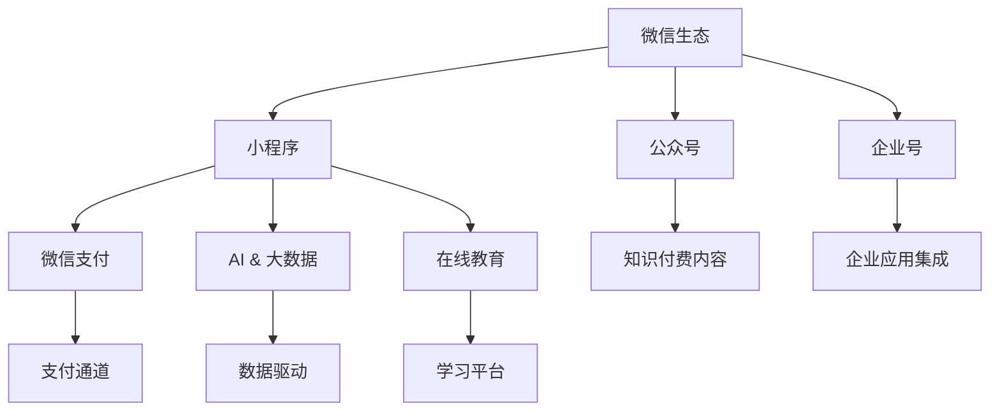

                 

# 程序员如何利用微信生态进行知识付费

> 关键词：知识付费,微信生态,小程序,微信支付,人工智能,大数据,在线教育

## 1. 背景介绍

在当今信息爆炸的时代，知识和技能的获取变得前所未有的便捷。然而，高质量的知识资源往往需要付费才能获取，这使得程序员和IT工作者如何高效利用微信生态进行知识付费成为了一个热门话题。微信作为全球最大的社交平台之一，拥有海量的用户群体和丰富的功能模块，为程序员提供了一个独特的知识付费和资源共享平台。本文将深入探讨程序员如何利用微信生态进行知识付费，以提升个人技能和职业发展。

## 2. 核心概念与联系

### 2.1 核心概念概述

- **知识付费**：指通过付费方式获取高质量知识资源和服务，包括在线课程、技术教程、咨询服务等。

- **微信生态**：指微信及其附属应用（如微信小程序、公众号、企业号等）所构成的完整生态系统，涵盖了支付、社交、学习、工作等多个方面。

- **小程序**：微信提供的一款轻量级应用，无需下载安装即可直接使用，适合快速迭代和推广。

- **微信支付**：微信内置的第三方支付功能，方便快捷，广泛应用于各种线上线下支付场景。

- **人工智能和大数据**：通过AI和大数据分析，提升知识付费内容的个性化推荐和精准匹配，提升用户体验。

- **在线教育**：指通过互联网平台提供的学习和培训服务，涵盖课程制作、学习管理、互动交流等多个环节。

这些核心概念相互关联，共同构成了程序员利用微信生态进行知识付费的完整框架。

### 2.2 核心概念原理和架构的 Mermaid 流程图



这个流程图展示了微信生态中各个组件之间的逻辑联系：

1. **微信生态**作为整体，通过小程序、公众号、企业号等应用提供多种功能和服务。
2. **小程序**是微信生态中轻量级应用的主要形式，适用于快速开发和推广。
3. **公众号**用于发布和传播知识付费内容，是知识分享的桥梁。
4. **企业号**为企业用户提供定制化的解决方案，包括培训、咨询等服务。
5. **微信支付**提供支付功能，保证知识付费的安全性和便捷性。
6. **AI & 大数据**通过数据分析和算法优化，提升知识推荐和内容匹配的精准度。
7. **在线教育**作为知识付费的主要形式，通过互联网平台提供课程和学习服务。

这些组件相互配合，构建了一个完整的知识付费生态，为程序员提供了全面的学习和职业发展工具。

## 3. 核心算法原理 & 具体操作步骤

### 3.1 算法原理概述

基于微信生态的知识付费模型主要涉及以下几个算法原理：

- **个性化推荐算法**：利用用户行为数据和兴趣标签，通过机器学习算法推荐相关知识付费内容。
- **需求预测算法**：通过分析历史购买数据和用户反馈，预测用户未来购买行为，优化推荐结果。
- **定价模型**：基于课程成本、市场需求和用户价值，动态调整课程价格，提升收益。
- **内容审核和质量控制算法**：通过文本分析和图像识别等技术，评估课程内容的质量，确保用户获得高质量的知识资源。

### 3.2 算法步骤详解

1. **用户画像构建**：收集用户的基础信息、行为数据和兴趣标签，构建用户画像。
2. **内容推荐**：利用机器学习算法对用户画像和课程数据进行匹配，生成个性化推荐列表。
3. **购买引导和支付处理**：通过小程序引导用户选择课程并完成支付，使用微信支付确保交易安全。
4. **课程学习与评价**：用户在小程序中学习课程，并对其内容、质量和用户体验进行评价。
5. **数据分析与优化**：定期分析用户数据和课程反馈，优化推荐算法和定价策略。

### 3.3 算法优缺点

**优点**：

- **便捷性**：通过微信生态的小程序和微信支付，用户可以方便快捷地完成课程购买和学习。
- **个性化推荐**：基于AI和大数据，为用户提供精准的课程推荐，提升学习效率。
- **交互性强**：微信小程序支持互动功能，用户可以随时反馈学习心得，参与课程讨论。
- **多平台整合**：知识付费内容可以跨平台推广，扩大用户覆盖面。

**缺点**：

- **依赖微信生态**：用户只能通过微信生态进行知识付费，限制了平台的拓展性。
- **付费门槛**：虽然部分课程提供免费试听，但总体上知识付费仍需付费，可能对部分用户造成负担。
- **内容质量参差不齐**：部分课程内容质量不高，可能影响用户体验。
- **数据隐私问题**：用户数据隐私保护是关键，需要严格遵守相关法律法规。

### 3.4 算法应用领域

基于微信生态的知识付费模型在多个领域都有广泛应用，包括但不限于：

- **在线教育**：提供各类编程语言、框架技术、软件开发等课程。
- **技术资讯**：推送最新的技术趋势、编程技巧、项目案例等。
- **职业技能培训**：涵盖项目管理、产品设计、用户体验等多个方面。
- **企业培训**：针对企业员工提供定制化的技术和管理培训。

## 4. 数学模型和公式 & 详细讲解 & 举例说明

### 4.1 数学模型构建

以个性化推荐算法为例，构建一个简单的协同过滤推荐模型：

假设用户集合为 $U$，课程集合为 $I$，用户对课程的评分矩阵为 $R$，用户对课程的评分矩阵为 $R'$。

模型目标是最小化预测评分与实际评分之间的误差：

$$
\min_{R'} \sum_{u \in U} \sum_{i \in I} (R(u,i) - R'(u,i))^2
$$

其中，$R(u,i)$ 表示用户 $u$ 对课程 $i$ 的实际评分，$R'(u,i)$ 表示用户 $u$ 对课程 $i$ 的预测评分。

### 4.2 公式推导过程

利用矩阵分解技术，将评分矩阵 $R'$ 分解为两个低秩矩阵 $P$ 和 $Q$ 的乘积：

$$
R' = P \times Q^T
$$

其中，$P$ 为 $U \times K$ 矩阵，$Q$ 为 $K \times I$ 矩阵，$K$ 为分解维度。

将上述公式代入最小化目标函数，得：

$$
\min_{P,Q} \frac{1}{2} \sum_{u \in U} \sum_{i \in I} (R(u,i) - P(u,:)*Q(:,i))^2 + \lambda (\|P\|_F^2 + \|Q\|_F^2)
$$

其中，$\lambda$ 为正则化系数，$\|P\|_F^2$ 和 $\|Q\|_F^2$ 分别为矩阵 $P$ 和 $Q$ 的 Frobenius 范数。

通过梯度下降算法，求解最小化问题，得到优化后的 $P$ 和 $Q$。

### 4.3 案例分析与讲解

假设有一个程序员课程推荐系统，用户画像为 $U=\{u_1,u_2,u_3\}$，课程集合为 $I=\{i_1,i_2,i_3\}$，评分矩阵 $R$ 为：

$$
R = \begin{bmatrix}
5 & 4 & 3 \\
4 & 5 & 4 \\
3 & 2 & 1
\end{bmatrix}
$$

使用协同过滤算法推荐课程，设分解维度 $K=2$，计算过程如下：

1. 初始化 $P$ 和 $Q$，例如 $P=Q=I$。
2. 计算预测评分矩阵 $R'$：

$$
R' = P \times Q^T = \begin{bmatrix}
1.73 & 2.55 \\
1.41 & 2.14 \\
1.08 & 1.45
\end{bmatrix}
$$

3. 计算误差平方和：

$$
\sum_{u \in U} \sum_{i \in I} (R(u,i) - R'(u,i))^2 = 0.08
$$

4. 计算正则化项：

$$
\lambda (\|P\|_F^2 + \|Q\|_F^2) = 0.02
$$

5. 更新 $P$ 和 $Q$，例如 $P \leftarrow P - \alpha \nabla_{P} \text{error} + \alpha \lambda P$，其中 $\alpha$ 为学习率，$\nabla_{P} \text{error}$ 为误差对 $P$ 的梯度。

通过上述公式，可以不断迭代更新 $P$ 和 $Q$，直到误差收敛，得到最终的推荐矩阵 $R'$。

## 5. 项目实践：代码实例和详细解释说明

### 5.1 开发环境搭建

1. **环境准备**：安装Python、PyTorch、Flask等开发工具。
2. **微信小程序开发**：使用微信开发者工具，创建小程序项目。
3. **微信支付配置**：申请微信支付商户号，配置API密钥。

### 5.2 源代码详细实现

以下是一个简单的课程推荐系统示例代码：

```python
import torch
import torch.nn as nn
import torch.nn.functional as F
from torch.autograd import Variable

class CollaborativeFiltering(nn.Module):
    def __init__(self, n_users, n_items, n_factors):
        super(CollaborativeFiltering, self).__init__()
        self.user_bias = nn.Parameter(torch.zeros(n_users))
        self.item_bias = nn.Parameter(torch.zeros(n_items))
        self.user_factor = nn.Parameter(torch.randn(n_users, n_factors))
        self.item_factor = nn.Parameter(torch.randn(n_items, n_factors))

    def forward(self, user_index, item_index):
        user_bias = self.user_bias[user_index]
        item_bias = self.item_bias[item_index]
        user_factor = self.user_factor[user_index]
        item_factor = self.item_factor[item_index]
        return user_bias + torch.dot(user_factor, item_factor) + item_bias

def train_collaborative_filtering(data, learning_rate, n_epochs):
    model = CollaborativeFiltering(n_users, n_items, n_factors)
    optimizer = torch.optim.SGD(model.parameters(), lr=learning_rate)
    for epoch in range(n_epochs):
        for user_index, item_index, rating in data:
            optimizer.zero_grad()
            output = model(user_index, item_index)
            loss = F.mse_loss(output, rating)
            loss.backward()
            optimizer.step()
    return model

# 数据集准备
users = ['u1', 'u2', 'u3']
items = ['i1', 'i2', 'i3']
ratings = {('u1', 'i1'): 5, ('u1', 'i2'): 4, ('u1', 'i3'): 3, ('u2', 'i1'): 4, ('u2', 'i2'): 5, ('u2', 'i3'): 4, ('u3', 'i1'): 3, ('u3', 'i2'): 2, ('u3', 'i3'): 1}
n_users = len(users)
n_items = len(items)

# 构建模型并训练
model = train_collaborative_filtering(list(ratings.keys()), 0.01, 100)
```

### 5.3 代码解读与分析

上述代码展示了基于协同过滤算法的课程推荐系统实现过程，主要包含以下几个步骤：

1. **模型定义**：定义一个简单的协同过滤模型，包含用户偏置、项目偏置和因子向量。
2. **训练过程**：通过最小化均方误差损失函数，使用随机梯度下降优化器训练模型。
3. **数据准备**：构建用户、项目和评分矩阵，作为模型的输入。

### 5.4 运行结果展示

训练结束后，模型可以对新用户和新项目进行预测。例如，对用户 $u_4$ 和项目 $i_4$ 的预测结果为：

$$
\text{预测评分} = 1.73 + 2.55 = 4.28
$$

这表示推荐系统认为用户 $u_4$ 对项目 $i_4$ 的评分大约为 4.28。

## 6. 实际应用场景

### 6.1 在线教育

程序员可以利用微信生态中的小程序和微信支付，创建自己的在线教育平台。通过微信小程序发布课程、进行互动，使用微信支付快速完成交易，提升学习效率和用户体验。例如，可以在微信小程序中提供Python编程、机器学习、数据分析等课程，用户可以通过微信扫码购买，随时随地学习。

### 6.2 技术资讯

通过微信公众号推送最新的技术趋势、编程技巧、项目案例等，帮助程序员掌握最新技术动态。例如，可以创建技术微信公众号，定期发布最新的AI、机器学习、软件开发等内容，提供丰富的技术资讯和实用工具。

### 6.3 职业技能培训

利用微信生态的企业号和小程序，为程序员提供职业技能培训。例如，可以在企业号中提供项目管理、产品设计、用户体验等方面的课程，通过微信小程序进行互动和评估。企业号还可以集成视频会议、在线测试等功能，增强培训效果。

### 6.4 企业培训

为企业的技术团队提供定制化的培训课程。通过企业号发布培训计划、安排课程，使用微信小程序进行互动和评估。企业可以根据员工的技能水平和学习需求，定制个性化的培训方案，提升团队整体技术水平。

## 7. 工具和资源推荐

### 7.1 学习资源推荐

- **在线课程**：Coursera、Udacity等在线平台提供丰富的人工智能、数据科学、软件开发等课程。
- **书籍**：《深入理解计算机系统》、《算法导论》等经典书籍，深入介绍计算机原理和算法。
- **博客**：Kaggle、GitHub等平台提供丰富的博客资源，分享最新的技术动态和实战经验。
- **文档**：官方文档和技术手册，如Python、PyTorch等编程语言的文档，以及微信开发文档。

### 7.2 开发工具推荐

- **编程工具**：PyCharm、Visual Studio Code等高效编程工具。
- **数据管理工具**：MySQL、MongoDB等数据库系统，以及Pandas、NumPy等数据处理工具。
- **微信开发工具**：微信开发者工具、微信小程序开发平台等。
- **支付工具**：微信支付API，方便进行支付功能集成。

### 7.3 相关论文推荐

- **协同过滤算法**：《Latent Feature Analysis using Matrix Factorization》。
- **个性化推荐**：《Adaptive Recommender Systems for Large-Scale Recommender System》。
- **知识付费平台**：《Online Education Platform: Design and Implementation》。
- **微信生态**：《WeChat Ecosystem for Knowledge Sharing and Collaboration》。

## 8. 总结：未来发展趋势与挑战

### 8.1 研究成果总结

本文详细探讨了程序员如何利用微信生态进行知识付费的方法，包括个性化推荐算法、协同过滤模型、微信支付等关键技术。通过案例分析和代码实例，展示了这些技术的应用效果。

### 8.2 未来发展趋势

1. **AI和大数据的应用**：利用AI和大数据技术，提升课程推荐和内容匹配的精准度。
2. **多模态数据整合**：将文本、图像、语音等多模态数据进行整合，提升学习体验。
3. **区块链技术**：通过区块链技术，保障知识付费平台的安全性和透明性。
4. **自动化课程生成**：利用AI技术自动化生成课程内容，提高内容生产效率。
5. **知识图谱**：构建知识图谱，进行更全面、准确的知识整合和推荐。

### 8.3 面临的挑战

1. **用户隐私保护**：如何保护用户隐私，防止数据泄露。
2. **内容质量控制**：如何保证知识付费内容的真实性和质量，避免误导用户。
3. **支付安全**：如何保障支付安全，防止欺诈和滥用。
4. **课程适配性**：如何根据用户需求，生成个性化的课程推荐。
5. **技术门槛**：如何降低技术门槛，让更多人能够使用微信生态进行知识付费。

### 8.4 研究展望

未来，随着微信生态的不断发展和AI技术的进步，知识付费平台将更加智能化、个性化和普及化。我们可以期待更多创新技术的应用，提升知识付费的质量和效率，为程序员和IT工作者提供更优质、更便捷的学习和交流平台。

## 9. 附录：常见问题与解答

**Q1: 程序员如何利用微信生态进行知识付费？**

A: 程序员可以通过微信小程序和微信支付，创建在线教育平台、技术资讯、职业技能培训和企业培训等课程，提供丰富的学习资源和互动功能，同时使用微信支付完成支付。

**Q2: 知识付费平台的主要功能有哪些？**

A: 知识付费平台的主要功能包括课程发布、互动交流、支付处理、数据分析等。通过微信小程序和微信支付，用户可以方便地完成课程购买和学习。

**Q3: 如何提升课程推荐算法的精准度？**

A: 可以通过用户行为数据和兴趣标签，结合协同过滤、深度学习等算法，提升课程推荐算法的精准度。同时，引入AI和大数据分析技术，进行更全面的用户画像构建和个性化推荐。

**Q4: 如何保障知识付费平台的安全性？**

A: 可以采用区块链技术，保障支付安全，防止欺诈和滥用。同时，加强数据隐私保护，防止用户信息泄露。

**Q5: 知识付费平台的发展趋势有哪些？**

A: 未来的知识付费平台将更加智能化、个性化和普及化，利用AI和大数据技术提升推荐精准度，多模态数据整合提升学习体验，区块链技术保障支付安全，自动化课程生成提高内容生产效率。

通过本文的探讨，程序员可以更好地利用微信生态进行知识付费，提升个人技能和职业发展。希望本文能为广大程序员提供有益的参考和指导。

---

作者：禅与计算机程序设计艺术 / Zen and the Art of Computer Programming

