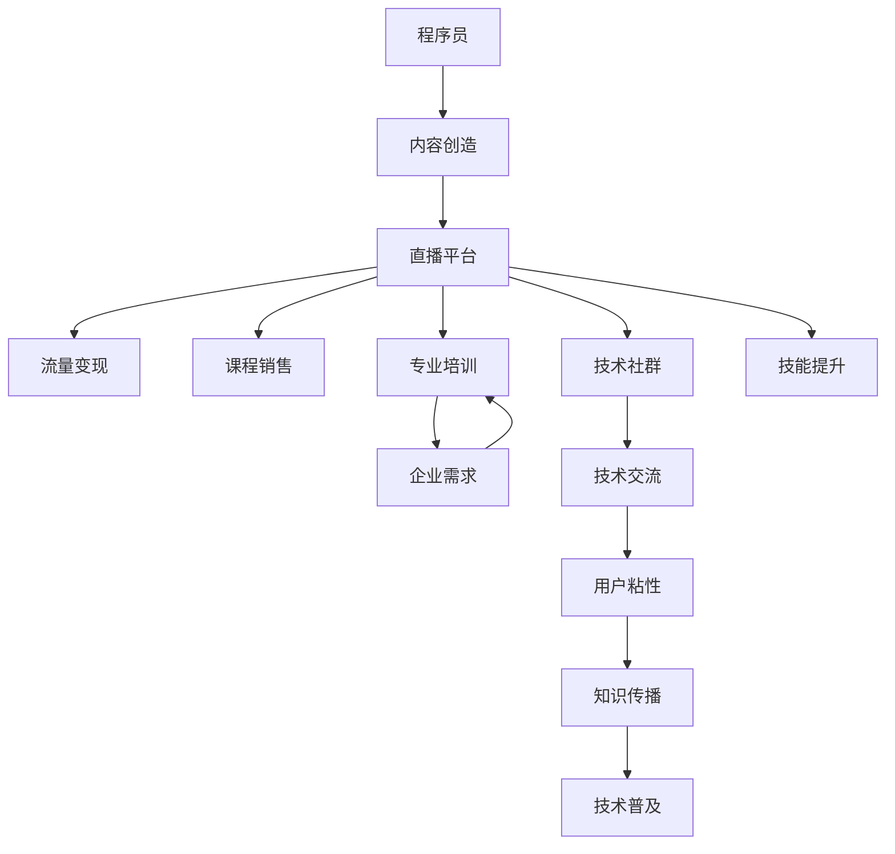

                 

# 程序员如何利用直播平台进行知识变现

> 关键词：程序员,直播平台,知识变现,内容创造,流量变现,技术分享,课程销售,技术社群,专业培训,技能提升

## 1. 背景介绍

### 1.1 问题由来
随着互联网技术的迅猛发展，尤其是短视频和直播行业的兴起，越来越多的程序员开始尝试通过直播平台分享自己的技术经验、解决问题、教授编程技巧，以此实现知识变现。在Web3.0时代，程序员的"编程"不再仅仅局限于写代码，更在于如何将个人的专业知识转化为有形的价值。

### 1.2 问题核心关键点
当前，通过直播平台进行知识变现主要体现在以下几个方面：
- **内容创造**：通过制作有价值的教程、技术分享等内容，吸引大量用户观看，建立个人品牌。
- **流量变现**：通过流量获取广告、赞助、付费订阅等方式实现盈利。
- **课程销售**：在直播或视频平台上推出付费课程，系统化地传授编程技能或技术原理。
- **技术社群**：构建线上技术交流社群，组织线下技术交流活动，加强社区粘性，推动知识传播。
- **专业培训**：针对企业需求，提供定制化的技术培训，解决企业技术难题。
- **技能提升**：帮助初学者掌握编程技能，提升职业发展潜力。

### 1.3 问题研究意义
利用直播平台进行知识变现，不仅能够显著提高程序员的知名度和影响力，还能有效将个人技术转化为经济收益，实现"编码-创作-变现"的良性循环。这不仅有助于提升程序员的收入，还能加速技术的普及和应用，推动整个行业的发展。

## 2. 核心概念与联系

### 2.1 核心概念概述

为更好地理解程序员如何通过直播平台进行知识变现，本节将介绍几个关键概念：

- **程序员**：指具备软件开发、系统维护、网络安全等专业技能的人才。
- **直播平台**：指通过互联网提供实时视频、音频内容的平台，如Bilibili、抖音、快手等。
- **知识变现**：指通过向他人提供知识、技术、经验等信息，实现商业变现。
- **内容创造**：指创作有价值、有创意的内容，吸引用户关注。
- **流量变现**：指通过增加平台流量，获取广告、赞助、付费订阅等收入。
- **课程销售**：指将知识内容系统化、结构化，制作成课程，通过付费方式进行销售。
- **技术社群**：指通过平台或线下活动，组织技术爱好者、开发者交流沟通的社区。
- **专业培训**：指针对企业需求，提供定制化的技术培训服务。
- **技能提升**：指通过直播或视频教程，帮助初学者提升编程技能。

这些核心概念之间的逻辑关系可以通过以下Mermaid流程图来展示：



这个流程图展示了好程序员利用直播平台进行知识变现的关键环节：

1. 程序员通过内容创造吸引观众，直播平台提供展示渠道。
2. 流量变现、课程销售、技术社群、专业培训、技能提升等环节，都围绕内容创造展开。
3. 技术社群和技术交流帮助加强用户粘性，推动知识传播和技术普及。

## 3. 核心算法原理 & 具体操作步骤
### 3.1 算法原理概述

通过直播平台进行知识变现的核心算法原理可以简单概括为：内容创作 - 平台展示 - 用户互动 - 变现过程。

1. **内容创作**：程序员通过创作高质量的技术内容，如代码解析、算法讲解、项目演示等，建立个人品牌。
2. **平台展示**：选择合适的直播平台，如Bilibili、抖音、YouTube等，通过技术优势和内容质量获取流量。
3. **用户互动**：在直播或视频中与用户进行互动，解答疑问、展示编程过程，增强用户参与度。
4. **变现过程**：通过平台提供的广告、赞助、付费订阅、课程销售等方式实现商业变现。

### 3.2 算法步骤详解

基于以上算法原理，程序员可以通过以下步骤实现知识变现：

**Step 1: 准备直播内容**
- 根据自身专业和兴趣选择合适的主题，如算法设计、架构优化、编程技巧等。
- 制作PPT、代码演示、项目案例等，准备直播物料。

**Step 2: 选择直播平台**
- 分析各平台用户特点，选择适合自己内容风格和目标受众的平台。
- 注册账号并完善个人资料，如头像、签名、简介等。

**Step 3: 发布直播预告**
- 提前在社交媒体、技术论坛发布直播预告，吸引潜在观众。
- 确认直播时间、时长、主题，准备设备（如摄像头、麦克风、电脑等）。

**Step 4: 进行直播互动**
- 直播开始后，展示准备好的内容，讲解技术细节，演示代码实现。
- 与观众互动，回答观众问题，引导观众参与讨论。
- 设置互动环节，如问答、投票、抽奖等，增加互动性和趣味性。

**Step 5: 直播后反馈和优化**
- 直播结束后，查看观众反馈和互动数据，总结经验和不足。
- 根据反馈和数据，优化内容和互动方式，提升直播质量。
- 持续发布直播预告，吸引更多观众，建立稳定观众群体。

### 3.3 算法优缺点

通过直播平台进行知识变现，具有以下优点：
1. **高效互动**：直播形式能够实时与观众互动，增强观众参与感。
2. **内容多样化**：直播内容可以实时展示代码演示、项目案例等，形式更加灵活。
3. **成本低廉**：相比于线下培训和书籍销售，直播平台的运营成本较低。
4. **快速变现**：通过平台广告、赞助、付费订阅等方式，快速获取收入。

同时，该方法也存在一些局限性：
1. **时间成本高**：准备内容、进行直播、进行互动都需要投入大量时间。
2. **技术要求高**：直播需要稳定的网络环境和设备，技术门槛较高。
3. **内容同质化**：直播内容容易被同类型内容淹没，难以脱颖而出。
4. **缺乏系统化**：相比于系统化课程，直播内容可能不够系统，难以满足深度学习需求。
5. **数据隐私问题**：直播过程中可能涉及敏感数据泄露，需注意数据安全。

尽管存在这些局限性，但直播平台无疑为程序员提供了更加直观、互动性更强的知识变现途径。

### 3.4 算法应用领域

基于直播平台的知识变现方法，在多个领域已得到应用，例如：

- **技术教学**：通过直播或视频平台教授编程技巧、框架原理等技术内容，实现知识变现。
- **项目演示**：展示个人或团队项目案例，讲解实现细节，吸引技术爱好者关注。
- **算法讲解**：详细讲解算法原理、优化方法，帮助初学者理解和掌握技术知识。
- **企业咨询**：针对企业技术难题，提供在线技术咨询和解决方案，收取咨询费用。
- **技能提升**：帮助初级开发者提高编程技能，解答常见问题，提升职业发展潜力。
- **技术社群**：组织线上线下技术交流活动，促进技术爱好者、开发者之间的沟通和合作。

除了上述这些经典应用外，直播平台还被创新性地应用到更多场景中，如在线答疑、技术研讨会、产品演示等，为程序员的知识变现带来了更多可能性。

## 4. 数学模型和公式 & 详细讲解 & 举例说明
### 4.1 数学模型构建

在直播平台进行知识变现的核心数学模型可以概括为：

$$
\text{总收入} = \text{内容质量} \times \text{观众数量} \times \text{变现渠道数量}
$$

其中：
- 内容质量：指内容的专业性、趣味性、教育性等综合评价指标。
- 观众数量：指直播或视频平台的观众数量，可以通过平台数据分析获取。
- 变现渠道数量：指通过不同方式变现的渠道数量，如广告、赞助、付费订阅、课程销售等。

### 4.2 公式推导过程

**内容质量计算公式**：
$$
Q = \frac{\text{观众评分} + \text{互动数据} + \text{视频点击率}}{\text{观众总数}}
$$

其中：
- 观众评分：观众对直播内容的平均评分，如1-5分。
- 互动数据：观众参与互动的活跃度，如评论数量、点赞数量等。
- 视频点击率：直播视频的点击率，即观看观众占比。

**观众数量计算公式**：
$$
N = \text{直播平台用户数} \times \text{推荐算法排序} \times \text{直播推广曝光}
$$

其中：
- 直播平台用户数：目标直播平台的用户总数。
- 推荐算法排序：平台推荐算法根据内容质量、用户偏好等因素排序，影响观众曝光率。
- 直播推广曝光：通过平台广告、推广等手段增加直播曝光率。

**变现渠道数量计算公式**：
$$
C = \text{广告数量} + \text{赞助数量} + \text{付费订阅数量} + \text{课程销售数量}
$$

其中：
- 广告数量：直播过程中展示的广告数量。
- 赞助数量：平台提供的品牌赞助数量。
- 付费订阅数量：观众选择付费订阅的数量。
- 课程销售数量：直播后通过平台销售课程的数量。

### 4.3 案例分析与讲解

以B站（Bilibili）为例，讲解程序员如何在B站进行知识变现：

1. **内容质量提升**：
   - 创作高互动性内容，如代码演示、算法讲解、项目案例等，提升观众评分和互动数据。
   - 利用平台推荐算法，优化直播视频排序，增加曝光率。
   - 通过B站广告、推广等手段，提升直播推广曝光率。

2. **观众数量增加**：
   - 定期发布直播预告，通过社交媒体、技术论坛等渠道吸引潜在观众。
   - 优化直播内容形式，增加视频点击率，吸引更多观众。
   - 与技术社群合作，联合举办技术研讨会，扩大观众基础。

3. **变现渠道多样化**：
   - 通过平台广告、品牌赞助等方式获取流量收益。
   - 提供付费订阅服务，如提供专属视频、技术咨询等。
   - 推出系统化课程，如系统学习编程语言、框架等。

4. **持续优化反馈**：
   - 收集观众反馈和互动数据，分析直播效果和观众偏好。
   - 根据反馈和数据，优化直播内容、互动方式、变现策略。
   - 持续发布直播预告，吸引更多观众，建立稳定观众群体。

## 5. 项目实践：代码实例和详细解释说明
### 5.1 开发环境搭建

在进行直播平台知识变现的项目实践前，我们需要准备好开发环境。以下是使用Python进行直播平台知识变现的环境配置流程：

1. 安装Anaconda：从官网下载并安装Anaconda，用于创建独立的Python环境。

2. 创建并激活虚拟环境：
```bash
conda create -n pytorch-env python=3.8 
conda activate pytorch-env
```

3. 安装PyTorch：根据CUDA版本，从官网获取对应的安装命令。例如：
```bash
conda install pytorch torchvision torchaudio cudatoolkit=11.1 -c pytorch -c conda-forge
```

4. 安装Flask：用于搭建服务器，实现直播互动和内容分发。
```bash
pip install flask
```

5. 安装Twitch库：用于连接和控制Twitch直播平台，实现自动化直播控制。
```bash
pip install twitchlib
```

完成上述步骤后，即可在`pytorch-env`环境中开始项目实践。

### 5.2 源代码详细实现

以下是使用Flask和Twitch库实现直播平台知识变现的Python代码实现：

```python
from flask import Flask, render_template, request
import twitchlib

app = Flask(__name__)

# 初始化Twitch客户端
twitch = twitchlib.Client()
twitch.id = 'your_twitch_client_id'
twitch.oauth = 'your_twitch_oauth_token'

@app.route('/')
def index():
    return render_template('index.html')

@app.route('/start', methods=['POST'])
def start_live():
    twitch.twitchapi.streamer.chat.startGame('Python编程实战')
    return '直播开始'

@app.route('/stop', methods=['POST'])
def stop_live():
    twitch.twitchapi.streamer.chat.stopGame()
    return '直播结束'

@app.route('/message', methods=['POST'])
def send_message():
    message = request.form['message']
    twitch.twitchapi.streamer.chat.send_message(message)
    return '消息发送成功'

if __name__ == '__main__':
    app.run(debug=True)
```

这是一个简单的基于Flask和Twitch库的Python代码实现，用于控制Twitch直播平台的直播开关和消息发送。开发者可以进一步开发直播内容展示、直播互动、观众数据分析等功能，实现完整的知识变现系统。

### 5.3 代码解读与分析

**Flask框架**：
- Flask是一个轻量级的Python Web框架，用于搭建Web服务器和API。
- 通过Flask，开发者可以方便地创建Web应用，实现直播互动、内容分发等功能。

**Twitch库**：
- Twitch库提供了与Twitch直播平台API的接口，方便开发者实现直播控制、消息发送等功能。
- 开发者可以通过Twitch库实现直播的自动控制，如自动开始、自动结束、自动切换等。

**代码实现**：
- `index`函数：渲染网页模板，展示直播预告和互动入口。
- `start_live`函数：通过Twitch库控制Twitch平台，自动开始直播。
- `stop_live`函数：通过Twitch库控制Twitch平台，自动结束直播。
- `send_message`函数：接收用户输入的消息，通过Twitch库发送直播间的消息。

开发者可以通过上述代码实现基本的直播互动和内容分发功能，在此基础上进一步开发完整的知识变现系统。

## 6. 实际应用场景
### 6.1 技术教学

直播平台为技术教学提供了极佳的舞台。通过直播平台，程序员可以系统化地讲解编程语言、框架原理、算法设计等内容，帮助初学者快速掌握技术知识。

### 6.2 项目演示

程序员可以通过直播平台展示个人或团队的项目案例，讲解实现细节，吸引技术爱好者关注。这不仅能够提升个人知名度，还能获取商业机会。

### 6.3 算法讲解

直播平台能够提供实时互动的环境，帮助程序员详细讲解算法原理、优化方法，增强观众的理解和记忆。

### 6.4 企业咨询

针对企业技术难题，直播平台提供在线技术咨询和解决方案，收取咨询费用。这种方式能够快速响应企业需求，提高技术服务的效率和质量。

### 6.5 技能提升

通过直播或视频教程，帮助初级开发者提高编程技能，解答常见问题，提升职业发展潜力。这种方式比传统的线上课程更具有互动性和即时性。

### 6.6 技术社群

直播平台能够组织线上线下技术交流活动，促进技术爱好者、开发者之间的沟通和合作。这种方式能够建立更加紧密的技术社群，增强社区粘性。

## 7. 工具和资源推荐
### 7.1 学习资源推荐

为了帮助开发者系统掌握直播平台知识变现的理论基础和实践技巧，这里推荐一些优质的学习资源：

1. **《Web前端开发进阶之路》系列博文**：由知名前端开发者撰写，深入浅出地介绍了Web前端开发的高级技巧和实战经验。
2. **《Web后端开发实战》课程**：通过具体项目案例，讲解Web后端开发的实战技术和技巧。
3. **《Web应用开发》书籍**：详细介绍Web应用开发的理论和实践，涵盖前端、后端、数据库等多个方面。
4. **Twitch官方文档**：Twitch提供的官方API文档，详细介绍了Twitch直播平台的API接口和使用方法。
5. **Flask官方文档**：Flask提供的官方文档，详细介绍了Flask框架的使用方法和最佳实践。

通过对这些资源的学习实践，相信你一定能够快速掌握直播平台知识变现的精髓，并用于解决实际的Web开发问题。
### 7.2 开发工具推荐

高效的开发离不开优秀的工具支持。以下是几款用于直播平台知识变现开发的常用工具：

1. **Flask**：轻量级的Python Web框架，用于搭建Web服务器和API，方便实现直播互动和内容分发。
2. **Twitch**：提供与直播平台API的接口，方便开发者实现直播控制、消息发送等功能。
3. **Jupyter Notebook**：用于数据处理和模型训练，方便开发者进行算法实验和数据分析。
4. **GitHub**：代码版本控制平台，方便开发者管理和分享代码，促进团队协作。
5. **PyTorch**：深度学习框架，用于构建和训练直播平台所需的数据模型。

合理利用这些工具，可以显著提升直播平台知识变现的开发效率，加快创新迭代的步伐。

### 7.3 相关论文推荐

直播平台知识变现技术的发展源于学界的持续研究。以下是几篇奠基性的相关论文，推荐阅读：

1. **《Web前端开发最佳实践》**：介绍Web前端开发的高级技巧和最佳实践，帮助开发者提升开发质量。
2. **《Web后端开发架构设计》**：讲解Web后端开发的架构设计方法和技巧，帮助开发者构建高效、稳定的系统。
3. **《Web应用性能优化》**：介绍Web应用性能优化的技术和方法，帮助开发者提升用户体验。
4. **《直播平台API设计》**：介绍直播平台API的设计方法和最佳实践，帮助开发者实现直播控制和消息发送。
5. **《Web应用安全设计》**：讲解Web应用安全的设计方法和防护措施，帮助开发者提升系统安全性。

这些论文代表了大语言模型微调技术的发展脉络。通过学习这些前沿成果，可以帮助研究者把握学科前进方向，激发更多的创新灵感。

## 8. 总结：未来发展趋势与挑战
### 8.1 总结

本文对程序员如何利用直播平台进行知识变现进行了全面系统的介绍。首先阐述了直播平台知识变现的重要性和可行性，明确了知识变现的核心步骤和方法。其次，从原理到实践，详细讲解了知识变现的数学模型和计算公式，给出了详细的代码实现和分析。同时，本文还广泛探讨了知识变现在技术教学、项目演示、算法讲解、企业咨询、技能提升等多个领域的应用前景，展示了知识变现的广阔可能性。此外，本文精选了知识变现技术的各类学习资源，力求为开发者提供全方位的技术指引。

通过本文的系统梳理，可以看到，利用直播平台进行知识变现，不仅能够显著提高程序员的知名度和影响力，还能有效将个人技术转化为经济收益，实现"编码-创作-变现"的良性循环。这不仅有助于提升程序员的收入，还能加速技术的普及和应用，推动整个行业的发展。

### 8.2 未来发展趋势

展望未来，直播平台知识变现技术将呈现以下几个发展趋势：

1. **内容多样化**：除了技术教学和项目演示，未来的直播平台将更加注重内容的多样化，涵盖更多领域和话题。
2. **互动性增强**：通过实时互动、问答等环节，增强观众的参与感和沉浸感，提升直播质量。
3. **技术创新**：结合新技术如AI、VR、AR等，提升直播的沉浸感和趣味性，增加观众的粘性。
4. **商业变现多样化**：除了广告、赞助、付费订阅、课程销售等方式，直播平台将探索更多商业变现途径。
5. **个性化推荐**：利用推荐算法，为用户推荐个性化的内容，提高观众的观看效率和满意度。
6. **跨平台融合**：直播平台与其他社交媒体、短视频平台等融合，实现内容互通和用户互动。

以上趋势凸显了直播平台知识变现技术的广阔前景。这些方向的探索发展，必将进一步提升直播平台的服务质量，为技术爱好者、开发者提供更加优质的学习资源和交流平台。

### 8.3 面临的挑战

尽管直播平台知识变现技术已经取得了瞩目成就，但在迈向更加智能化、普适化应用的过程中，它仍面临着诸多挑战：

1. **技术门槛高**：直播平台知识变现需要具备一定的编程和直播技能，技术门槛较高。
2. **时间成本高**：内容创作、互动控制、观众数据分析等环节都需要投入大量时间。
3. **内容同质化**：直播内容容易被同类型内容淹没，难以脱颖而出。
4. **数据隐私问题**：直播过程中可能涉及敏感数据泄露，需注意数据安全。
5. **变现方式单一**：目前主要依靠广告、赞助、付费订阅等传统方式，缺乏创新性。

尽管存在这些挑战，但直播平台无疑为程序员提供了更加直观、互动性更强的知识变现途径。未来，随着技术的进步和市场的成熟，这些问题有望逐步得到解决。

### 8.4 研究展望

面对直播平台知识变现所面临的挑战，未来的研究需要在以下几个方面寻求新的突破：

1. **内容创新**：结合AI、VR、AR等新技术，创作更加多样化和互动性的直播内容。
2. **商业变现创新**：探索更多的商业变现途径，如直播电商、技术咨询等，提升直播平台的商业价值。
3. **推荐算法优化**：利用推荐算法提高内容推荐效率和精准度，提升观众的观看体验。
4. **数据安全保障**：研究数据隐私保护技术，保障用户数据安全。
5. **互动性增强**：通过实时互动、问答等环节，增强观众的参与感和沉浸感。

这些研究方向的探索，必将引领直播平台知识变现技术迈向更高的台阶，为技术爱好者、开发者提供更加优质的学习资源和交流平台。面向未来，直播平台知识变现技术还需要与其他人工智能技术进行更深入的融合，如AI、VR、AR等，多路径协同发力，共同推动技术进步和行业发展。

## 9. 附录：常见问题与解答
**Q1：直播平台知识变现是否适用于所有程序员？**

A: 直播平台知识变现对程序员的技术水平、表达能力和时间投入都有一定要求。适合那些具有一定技术深度、善于表达和互动，并且有足够时间和精力的程序员。

**Q2：如何提升直播内容的吸引力？**

A: 提升直播内容的吸引力可以从以下几个方面入手：
1. 选取热门话题，如前沿技术、热门项目等。
2. 增强互动性，如实时问答、投票等。
3. 提供有价值的知识和技巧，帮助观众解决问题。
4. 利用数据和案例，展示技术效果和实际应用。

**Q3：直播平台知识变现是否需要高额的技术成本？**

A: 直播平台知识变现虽然需要一定的技术投入，但相比于传统的线下培训和书籍销售，成本较低。许多开源工具和平台API已经提供了很多便捷的功能，减少了技术成本。

**Q4：如何确保直播内容的质量？**

A: 确保直播内容的质量可以从以下几个方面入手：
1. 严格筛选直播内容，保证其专业性和实用性。
2. 定期更新直播内容，保持新鲜感和热度。
3. 邀请业内专家参与直播，提高直播内容的权威性。
4. 利用观众反馈和数据，不断优化直播内容。

**Q5：直播平台知识变现如何实现商业变现？**

A: 直播平台知识变现的商业变现可以通过以下几种方式：
1. 广告收入：通过直播平台提供的广告位获取收入。
2. 付费订阅：提供专属内容，如高级课程、技术咨询等，收取订阅费用。
3. 课程销售：将直播内容系统化、结构化，制作成课程，通过平台销售课程。
4. 品牌赞助：与品牌合作，获取品牌赞助和广告收益。

**Q6：如何保护直播平台知识变现的版权？**

A: 保护直播平台知识变现的版权可以从以下几个方面入手：
1. 明确版权归属，确保内容原创性。
2. 使用开源协议，确保内容共享和传播。
3. 利用技术手段，如水印、加密等，保护内容版权。
4. 建立法律保障，维权和打击侵权行为。

通过这些措施，可以确保直播平台知识变现的版权得到充分保护，避免侵权和盗用行为。

**Q7：直播平台知识变现如何吸引更多观众？**

A: 吸引更多观众可以通过以下几种方式：
1. 通过社交媒体、技术论坛等渠道发布直播预告，吸引潜在观众。
2. 利用平台推荐算法，优化直播视频排序，增加曝光率。
3. 通过平台广告、推广等手段，提升直播推广曝光率。
4. 定期举办技术研讨会、技术交流活动，扩大观众基础。

通过这些措施，可以显著提高直播平台的观众数量，实现更好的知识变现效果。

---

作者：禅与计算机程序设计艺术 / Zen and the Art of Computer Programming

