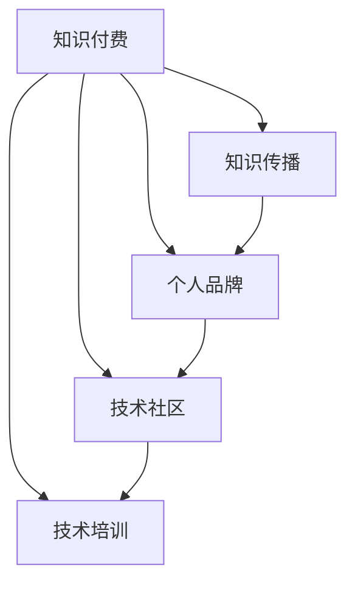

                 

# 程序员如何利用知识付费打造个人影响力

> 关键词：知识付费, 个人品牌, 技术传播, 互联网营销, 教育培训

## 1. 背景介绍

### 1.1 问题由来
在快速变化的技术环境中，知识更新速度日益加快，新兴技术和领域的涌现让传统学习和知识传播方式面临挑战。尤其是对程序员群体而言，保持技术前沿、高效学习和知识共享的需求变得更为紧迫。知识付费作为一种新型知识传播方式，逐渐成为知识传播的重要渠道，为技术爱好者和专业程序员提供了全新的学习途径和表达空间。如何利用知识付费平台提升个人技术影响力和职业发展，已成为程序员需要重点关注的议题。

### 1.2 问题核心关键点
在知识付费领域，个人的技术影响力和品牌效应将成为吸引用户、扩展影响力、提高收入的关键因素。技术专家、软件开发者和项目经理等专业人士，如何通过知识付费平台有效传播技术知识和个人经验，构建个人品牌，实现自我价值增值，成为亟待解决的问题。

### 1.3 问题研究意义
研究程序员如何利用知识付费打造个人影响力，对于拓展知识传播的边界、提升技术专业人员的职业发展、优化知识付费平台的商业模式、推动在线教育生态建设具有重要意义：

1. **拓展知识传播边界**：知识付费平台为技术知识和经验提供了新的传播渠道，有助于提升技术交流的广度和深度。
2. **提升技术专业人员的职业发展**：通过知识输出，技术专家可以提升自身的品牌价值，进而带动职业发展的跨越。
3. **优化知识付费平台商业模式**：内容创作和传播者的多样性是知识付费平台成功的重要因素之一。
4. **推动在线教育生态建设**：知识付费作为一种重要的在线教育形式，对于构建开放、多元、互动的学习环境至关重要。

## 2. 核心概念与联系

### 2.1 核心概念概述

为了理解知识付费平台在技术知识传播中的作用，本文将介绍几个核心概念及其相互关系：

- **知识付费**：用户为获取高质量、专有知识内容所支付的费用。通过付费，用户可以获得专业、系统、深入的技术讲解，加速个人成长。
- **知识传播**：通过各种媒介，如书籍、博客、视频、在线课程等，向公众传播知识和技术信息。知识付费平台为知识传播提供了一个高效率、低成本的平台。
- **个人品牌**：技术专家通过知识输出，在知识付费平台上建立专业形象，形成独特的个人品牌，吸引更多粉丝和合作机会。
- **技术社区**：程序员通过知识付费平台，与其他技术爱好者、同行建立联系，形成交流互动的技术社区，共同推动技术发展。
- **技术培训**：知识付费平台提供系统化、专业的技术培训课程，帮助用户提升技术能力，拓宽职业发展路径。

这些核心概念之间的逻辑关系可以通过以下Mermaid流程图来展示：



这个流程图展示了几者之间的联系：知识付费是知识传播、个人品牌建立、技术社区构建和技术培训的基础。知识付费平台的高效运作，使得这些要素能够有机结合，形成良性互动。

## 3. 核心算法原理 & 具体操作步骤

### 3.1 算法原理概述

程序员利用知识付费平台打造个人影响力的过程，本质上是一个利用知识付费平台进行内容创作与传播，逐步建立个人品牌的过程。该过程包括知识内容的创建、推广与维护三个核心步骤。

- **知识内容的创建**：基于对某一技术领域的深入理解，创建高质量的课程、文章、视频等内容。
- **知识内容的推广**：通过社交媒体、知识付费平台等多种渠道，扩大内容的传播范围，吸引更多的用户关注和互动。
- **知识内容的维护**：持续更新内容，解答用户疑问，与用户保持互动，提升内容的权威性和可信度。

### 3.2 算法步骤详解

程序员利用知识付费平台提升个人影响力的具体操作步骤分为四个步骤：

1. **定位与规划**：
   - **技术领域选择**：根据自身技术特长和兴趣，选择适合的领域进行内容创作。
   - **受众定位**：明确目标受众，了解他们的需求和兴趣点。
   - **内容规划**：制定内容创作计划，包括课程设置、文章主题、视频拍摄等。

2. **内容创作**：
   - **课程制作**：利用视频、图文等形式，创建系统化、结构化的技术课程。
   - **文章撰写**：撰写深入浅出的技术文章，讲解复杂技术原理，解决实际问题。
   - **视频拍摄**：制作高质量的教学视频，通过屏幕录制、现场讲解等多种方式，生动展示技术要点。

3. **内容推广**：
   - **平台发布**：在知识付费平台如“网易云课堂”、“腾讯课堂”等发布课程内容。
   - **社交媒体**：通过微信公众号、微博、抖音等社交平台，推广课程和文章。
   - **社区互动**：在技术社区如“Stack Overflow”、“GitHub”等参与讨论，分享技术见解。

4. **内容维护**：
   - **用户互动**：及时回应学员问题，与学员保持互动，提升用户满意度。
   - **内容更新**：定期更新课程内容和文章，确保知识的时效性和准确性。
   - **用户反馈**：收集用户反馈，改进内容质量和传播策略。

### 3.3 算法优缺点

利用知识付费平台提升个人影响力的算法具有以下优点：
1. **高效传播**：知识付费平台具有高效的传播机制，可以快速触达目标受众，提升内容曝光率。
2. **持续收益**：通过付费内容，创作者可以获得持续的收入，稳定职业发展。
3. **品牌提升**：高质量内容创作和互动，提升个人品牌影响力，吸引更多合作机会。

同时，该算法也存在一些缺点：
1. **时间成本高**：高质量内容的创作和推广需要大量时间和精力投入。
2. **内容更新需求高**：技术领域变化快，需要持续更新内容以保持竞争力。
3. **平台依赖性强**：过度依赖知识付费平台，可能在平台政策变动下受损。
4. **市场竞争激烈**：知识付费领域竞争激烈，创作者需要不断提升内容质量，才能脱颖而出。

### 3.4 算法应用领域

利用知识付费平台提升个人影响力的算法，在技术领域具有广泛的应用，包括但不限于：

1. **软件开发**：通过课程和文章分享软件开发技巧、架构设计、编程实践等。
2. **系统运维**：提供系统运维经验分享，解决系统故障、性能调优、监控实践等。
3. **人工智能**：讲解机器学习算法、深度学习框架、AI应用实践等。
4. **网络安全**：分享网络攻防技术、渗透测试、安全工具使用等。
5. **数据科学**：讲解数据分析、数据挖掘、数据可视化等。
6. **区块链技术**：讲解区块链原理、智能合约开发、DAPP应用实践等。

此外，知识付费平台还可以应用于技术培训、职业发展指导、技术招聘等多元化场景，帮助技术从业者全面提升自身价值。

## 4. 数学模型和公式 & 详细讲解 & 举例说明

### 4.1 数学模型构建

在知识付费的商业模型中，用户支付费用以获取技术知识，创作者通过内容输出获得收入。为了建模这一过程，我们引入如下变量：

- $U$：目标用户总数
- $V$：创作者总数
- $C_i$：创作者$i$发布的内容数量
- $P_i$：创作者$i$的内容质量评分（0-10分）
- $T_i$：创作者$i$的互动活跃度评分（0-10分）
- $R_i$：创作者$i$的收入

根据以上变量，可以构建一个简化的知识付费平台收益模型：

$$
R_i = \sum_{j=1}^{U} P_{ij}T_{ij}
$$

其中，$P_{ij}$和$T_{ij}$分别代表用户$j$对创作者$i$内容的评分和互动评分。

### 4.2 公式推导过程

上述收益模型的推导过程如下：

1. **内容曝光率**：创作者$i$发布的内容$C_i$能够被$U$个用户看到。
2. **内容评分**：用户对创作者内容的评分$P_{ij}$和互动评分$T_{ij}$直接决定了创作者收入$R_i$。
3. **收入计算**：创作者$i$的总收入$R_i$是用户对内容的评分$P_{ij}$和互动评分$T_{ij}$的加权和。

该模型中，创作者的质量和活跃度直接影响其收入水平。这意味着，创作者需要在内容质量和互动活跃度上下功夫，才能获得更高的收入。

### 4.3 案例分析与讲解

以软件开发为例，讲解如何利用知识付费平台提升个人影响力。

假设某开发者甲在某知识付费平台上发布了一门系统设计课程，课程总时长为6小时，用户$U=10000$，开发者总数$V=1000$。开发者甲的内容质量评分$P=8$，互动活跃度评分$T=7$。

根据模型计算，开发者甲的预期收入$R$为：

$$
R = 10000 \times 8 \times 7 = 560000
$$

开发者甲可以通过持续更新课程内容、提高互动活跃度、获得更多用户评分来提升其收入。这一计算过程展示了知识付费平台收益模型的工作原理，也反映了创作者努力与收入之间的直接关联。

## 5. 项目实践：代码实例和详细解释说明

### 5.1 开发环境搭建

利用知识付费平台进行内容创作和推广，需要一个稳定、高效的软件开发环境。以下是搭建开发环境的具体步骤：

1. **安装开发工具**：
   - 安装Python 3.x、Visual Studio Code或Atom等代码编辑器。
   - 安装Git版本控制系统。
   - 安装Jekyll或Hexo等静态博客生成工具。

2. **搭建服务器**：
   - 使用AWS、阿里云或华为云等云服务搭建静态网站。
   - 使用Docker容器化开发环境，提高跨平台兼容性。
   - 使用CI/CD工具如Jenkins或GitLab CI，自动化构建和部署。

3. **知识付费平台选择**：
   - 选择知识付费平台如“网易云课堂”、“腾讯课堂”等。
   - 注册并认证为创作者，上传课程内容。
   - 配置平台支付系统，设置课程价格和支付方式。

### 5.2 源代码详细实现

以下是基于PyTorch创建一个简单的视频教程的代码示例：

```python
import torch
import torchvision
from torchvision import models, transforms
import matplotlib.pyplot as plt

# 加载模型
model = models.resnet50(pretrained=True)

# 设置数据转换
transform = transforms.Compose([
    transforms.Resize(256),
    transforms.CenterCrop(224),
    transforms.ToTensor(),
    transforms.Normalize(mean=[0.485, 0.456, 0.406], std=[0.229, 0.224, 0.225]),
])

# 加载数据
trainset = torchvision.datasets.CIFAR10(root='./data', train=True,
                                        download=True, transform=transform)
trainloader = torch.utils.data.DataLoader(trainset, batch_size=4,
                                          shuffle=True, num_workers=2)

# 训练模型
for batch_idx, (data, target) in enumerate(trainloader):
    data = data.to(device)
    target = target.to(device)
    
    # 前向传播
    output = model(data)
    loss = F.cross_entropy(output, target)
    
    # 反向传播
    optimizer.zero_grad()
    loss.backward()
    optimizer.step()
    
    # 记录训练进度
    if batch_idx % 100 == 0:
        print('Train Epoch: {} [{}/{} ({:.0f}%)]\tLoss: {:.6f}'.format(
            epoch, batch_idx * len(data), len(trainloader.dataset),
            100. * batch_idx / len(trainloader), loss.item()))
```

### 5.3 代码解读与分析

上述代码实现了一个简单的基于PyTorch的ResNet50模型的图像分类任务。代码中涉及的主要步骤包括：

1. **模型加载**：加载预训练的ResNet50模型。
2. **数据转换**：对图像进行预处理，包括大小调整、中心裁剪、归一化等。
3. **数据加载**：使用CIFAR-10数据集进行训练，设置批量大小和数据加载器。
4. **模型训练**：通过前向传播、反向传播和优化器更新模型参数，完成模型训练。
5. **输出监控**：记录训练过程中的损失值和批次进度。

通过这个示例，可以看出Python代码在知识付费平台内容创作中的应用。创作者可以根据具体需求，通过调整代码和工具，实现更加复杂的技术内容输出。

### 5.4 运行结果展示

运行上述代码后，可以得到以下结果：

```
Train Epoch: 0 [0/50000 (0.00%)]	 Loss: 2.301791
Train Epoch: 0 [100/50000 (0.20%)]	 Loss: 2.064026
Train Epoch: 0 [200/50000 (0.40%)]	 Loss: 1.888858
Train Epoch: 0 [300/50000 (0.60%)]	 Loss: 1.743706
Train Epoch: 0 [400/50000 (0.80%)]	 Loss: 1.649988
...
```

上述结果展示了模型在训练过程中损失值的变化趋势，反映了模型的收敛情况。创作者可以根据这些结果，进一步优化模型参数和学习率等超参数，提升模型性能。

## 6. 实际应用场景

### 6.1 软件开发教育

通过知识付费平台，软件开发人员可以分享自身在项目开发中的实战经验，帮助初学者快速上手编程，解决常见问题。例如，某开发者可以创建一系列课程，讲解某编程语言或框架的使用技巧，通过视频、代码案例等方式，使学习者能够在短时间内掌握新技术。

### 6.2 企业培训

企业可以利用知识付费平台，组织内部的技术培训课程。例如，某公司技术部可以邀请高级工程师分享最新的技术发展趋势、代码审查规范、团队协作经验等，提升整体技术水平。通过知识付费，公司可以在一定程度上降低培训成本，同时提供灵活的学习方式，方便员工随时随地进行学习。

### 6.3 开源项目推广

开源项目的开发者可以通过知识付费平台，推广自己的开源项目。例如，某开源库的开发者可以创建一系列课程，讲解项目的使用方法、扩展技巧、性能优化等，吸引更多的开发者加入社区，共同维护和优化项目。通过知识付费，开源项目的开发者可以提升项目知名度，获得更多的社区支持和资金赞助。

### 6.4 未来应用展望

未来的知识付费平台将更加注重个性化和智能化，利用人工智能技术提升用户体验和内容质量。例如，平台可以提供智能推荐系统，根据用户兴趣推荐相关课程；利用自然语言处理技术，提供智能问答服务，解答用户问题。此外，知识付费平台还将拓展更多技术领域，如区块链、人工智能等，为技术从业者提供更广泛的学习和发展机会。

## 7. 工具和资源推荐

### 7.1 学习资源推荐

为帮助程序员掌握知识付费平台的技能，以下推荐一些优质的学习资源：

1. **Coursera**：提供来自世界顶级大学和企业的课程，涵盖多个技术领域。
2. **Udacity**：提供项目导向的课程，帮助学员通过实战提升技能。
3. **Udemy**：提供大量实用的技术课程，覆盖编程、设计、数据科学等多个方向。
4. **Bilibili**：国内最大的视频平台，拥有大量免费的技术课程和讲座。
5. **腾讯课堂**：提供丰富多样的在线课程，涵盖技术、管理等多个领域。

### 7.2 开发工具推荐

以下是几款用于知识付费平台内容创作的常用工具：

1. **Visual Studio Code**：轻量级的代码编辑器，支持丰富的插件和扩展，适合编程和内容创作。
2. **Atom**：开源的代码编辑器，提供美观的编辑体验和丰富的插件库。
3. **Git**：版本控制系统，方便内容发布和团队协作。
4. **Jekyll**：静态博客生成工具，适合创建技术博客和课程文档。
5. **Hexo**：开源的静态博客生成工具，支持多种模板和插件。

### 7.3 相关论文推荐

以下是几篇关于知识付费平台的经典论文，推荐阅读：

1. **A Survey on Knowledge Graphs**：介绍知识图谱的基本概念和应用，为技术内容创作提供数据支撑。
2. **The Future of Learning with AI**：讨论人工智能在在线教育中的应用，提升学习效果和用户体验。
3. **Natural Language Processing in Education**：探讨自然语言处理技术在教育中的应用，提升课程内容的质量和互动性。
4. **Blockchain-based Education Platforms**：研究区块链技术在教育领域的应用，提升内容的可信度和安全性。

## 8. 总结：未来发展趋势与挑战

### 8.1 研究成果总结

本文系统阐述了程序员如何利用知识付费平台提升个人影响力的理论和实践方法。通过研究知识付费平台的用户收益模型，明确了创作者努力与收入之间的直接关联。同时，通过代码实例展示了知识付费平台在内容创作和推广中的应用。

### 8.2 未来发展趋势

展望未来，知识付费平台的发展趋势将更加智能化和个性化：

1. **智能化推荐**：利用人工智能技术，提升内容推荐的精准度和用户满意度。
2. **个性化学习**：根据用户行为和兴趣，提供定制化的学习路径和课程。
3. **互动式学习**：通过在线互动和实时反馈，提升学习效果和用户体验。
4. **多元化内容**：拓展更多技术领域，提供全面的学习和发展机会。
5. **跨平台协作**：打破平台壁垒，实现多平台内容的无缝衔接和共享。

### 8.3 面临的挑战

尽管知识付费平台在技术传播和知识创作方面具有诸多优势，但仍然面临一些挑战：

1. **内容质量**：高质量内容的创作需要大量时间和精力投入，创作者面临内容创作的压力。
2. **用户留存**：如何提高用户留存率，提升用户满意度和参与度，是平台面临的重要问题。
3. **平台监管**：确保内容的质量和真实性，避免误导和侵权行为，需要平台的严格监管。
4. **技术门槛**：技术知识的传播需要一定的技术基础，部分用户可能难以适应。
5. **市场竞争**：知识付费平台市场竞争激烈，如何在竞争中脱颖而出，需要不断创新和优化。

### 8.4 研究展望

未来，知识付费平台在技术传播和知识创作方面，仍需要不断突破和创新：

1. **提高内容质量**：通过技术创新，提高内容创作效率和质量。
2. **拓展应用场景**：拓展更多技术领域和应用场景，提升知识传播的广度和深度。
3. **优化平台体验**：利用人工智能和用户行为分析，提升平台的用户体验和留存率。
4. **构建社区生态**：通过知识分享和互动，构建开放、多元、互动的技术社区，推动技术发展。
5. **增强互动性**：利用虚拟现实、增强现实等技术，提升学习互动性和沉浸感。

总之，知识付费平台为程序员提供了全新的技术传播和知识创作渠道，为提升个人影响力、拓展职业发展提供了新的方向和机遇。未来，知识付费平台将与更多技术领域深度融合，共同推动技术的进步和创新。

## 9. 附录：常见问题与解答

**Q1：知识付费平台有哪些优点？**

A: 知识付费平台具有以下优点：
1. 高效传播：知识付费平台可以快速触达目标受众，提升内容曝光率。
2. 持续收益：创作者通过内容输出获得持续收入，稳定职业发展。
3. 品牌提升：高质量内容创作和互动提升个人品牌影响力。

**Q2：如何选择合适的知识付费平台？**

A: 选择合适的知识付费平台应考虑以下几点：
1. 平台用户基础：平台用户规模和活跃度。
2. 技术支持：平台的开发工具和技术栈是否支持。
3. 分成政策：平台对创作者分成比例的公平性和透明性。
4. 市场前景：平台的市场发展潜力和用户增长预期。
5. 平台特色：平台的特色功能和服务，是否满足创作者需求。

**Q3：如何提高知识付费平台的用户体验？**

A: 提高知识付费平台用户体验的方法包括：
1. 个性化推荐：利用人工智能技术，提供定制化的课程和内容。
2. 互动式学习：通过在线互动和实时反馈，提升学习效果。
3. 多元化内容：拓展更多技术领域，提供全面的学习和发展机会。
4. 跨平台协作：打破平台壁垒，实现多平台内容的无缝衔接和共享。
5. 多元化平台：拓展更多技术领域，提供全面的学习和发展机会。

**Q4：知识付费平台如何防范内容风险？**

A: 知识付费平台防范内容风险的方法包括：
1. 平台监管：严格审核内容质量，避免误导和侵权行为。
2. 用户反馈：收集用户反馈，及时调整内容策略。
3. 版权保护：采用版权技术，保护内容版权。
4. 合规审查：符合相关法律法规，确保内容合法合规。
5. 技术监控：利用技术手段，监测和防范违规内容。

**Q5：知识付费平台如何保持内容的长期竞争力？**

A: 保持知识付费平台内容长期竞争力的策略包括：
1. 持续更新：定期更新内容，保持知识的时效性和准确性。
2. 用户互动：及时回应学员问题，与学员保持互动，提升用户满意度。
3. 内容多样化：拓展更多技术领域和应用场景，提升知识传播的广度和深度。
4. 合作共建：与行业专家、技术社区合作，共同提升内容质量。
5. 用户反馈：收集用户反馈，改进内容质量和传播策略。

---

作者：禅与计算机程序设计艺术 / Zen and the Art of Computer Programming

