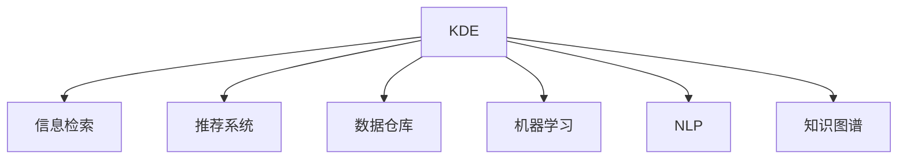

                 

# 程序员如何利用知识发现引擎提升技能

> 关键词：知识发现引擎, 程序员, 技能提升, 编程, 软件工程, 人工智能

## 1. 背景介绍

在当今信息爆炸的时代，技术的更新换代速度日益加快。对于程序员而言，保持技能的前沿性、持续提升技术水平变得愈发重要。然而，在纷繁复杂的技术体系和广袤的信息海洋中，如何快速高效地获取有用的知识和技能，一直是程序员面临的巨大挑战。

### 1.1 问题由来

随着人工智能技术的不断进步，知识发现引擎(Knowledge Discovery Engine, KDE)逐渐走入程序员的视野。KDE是一类智能化的信息检索和分析工具，能够从海量数据中自动挖掘和发现有用的知识，帮助用户更快、更准确地获取所需信息。程序员可以利用KDE深入挖掘编程技术、工具和最佳实践的知识，有效提升自身技能。

## 2. 核心概念与联系

### 2.1 核心概念概述

本节将介绍几个与知识发现引擎紧密相关的核心概念：

- **知识发现引擎(KDE)**：通过数据挖掘、机器学习和人工智能技术，从数据中自动发现知识并提取有用信息。常见的KDE包括信息检索、推荐系统、数据仓库等。

- **信息检索(Information Retrieval, IR)**：从大规模数据集中检索与用户查询相关的信息，广泛应用于搜索引擎、数据库查询等场景。

- **推荐系统(Recommender System)**：通过用户行为数据和物品属性，为用户推荐感兴趣的内容，广泛用于电商、社交网络、视频网站等平台。

- **数据仓库(Data Warehouse)**：集中管理大规模数据，通过OLAP工具进行复杂查询和分析，为决策支持提供数据支撑。

- **机器学习(Machine Learning, ML)**：通过算法自动分析数据、学习规律，从而做出预测或决策。

- **自然语言处理(Natural Language Processing, NLP)**：使计算机能够理解、分析、生成自然语言文本。

- **知识图谱(Knowledge Graph)**：以图结构表示实体和它们之间的关系，提供直观、结构化的知识表示和查询。

这些核心概念之间的逻辑关系可以通过以下Mermaid流程图来展示：



这个流程图展示出知识发现引擎与其相关技术的关联：

1. KDE利用信息检索、推荐系统、数据仓库、机器学习、自然语言处理、知识图谱等多种技术手段，从数据中发现知识。
2. 这些技术相互配合，提升KDE的知识发现效率和准确性。

## 3. 核心算法原理 & 具体操作步骤
### 3.1 算法原理概述

知识发现引擎的核心原理是利用数据挖掘和机器学习算法，从大量数据中发现潜在的知识模式。这些算法通常包括：

- 统计分析：如频率分析、趋势分析等，用于发现数据的基本特征和趋势。
- 关联规则学习：如Apriori算法，用于发现数据项之间的关联关系。
- 聚类分析：如K-Means算法，用于将数据分成不同的群组。
- 分类算法：如决策树、支持向量机等，用于预测数据的新值。
- 序列模式挖掘：如FP-Tree算法，用于发现数据序列的规律。

程序员可以利用KDE从技术博客、论坛、GitHub代码库、学术论文等多种数据源中发现有用的编程技巧、工具库和最佳实践。

### 3.2 算法步骤详解

基于知识发现引擎的编程技能提升方法一般包括以下几个关键步骤：

**Step 1: 准备数据源**
- 确定知识发现的来源，如技术博客、论坛、GitHub代码库、学术论文等。
- 收集相关领域的文本数据，进行预处理（如分词、去除停用词等）。

**Step 2: 设计检索查询**
- 根据需求设计查询词，利用信息检索技术从数据源中提取相关内容。
- 使用布尔查询、模糊查询、近义词扩展等技术提升查询效果。

**Step 3: 应用推荐算法**
- 对检索到的内容进行特征提取和建模。
- 利用推荐算法（如协同过滤、内容推荐等）找到最相关的技能提升资源。

**Step 4: 知识图谱构建**
- 将检索到的资源构建成知识图谱，形成直观的关系网络。
- 利用知识图谱进行关联查询，发现相关领域的隐含知识。

**Step 5: 持续学习与优化**
- 对发现的知识进行定期更新和优化。
- 利用机器学习模型对推荐算法进行自适应调整，提升推荐效果。

### 3.3 算法优缺点

知识发现引擎具有以下优点：

- 自动发现：能够从大量数据中自动发现有用知识，无需手动筛选。
- 高效性：通过算法优化，提高知识发现和推荐的速度。
- 适用性：可以应用于各种数据源和知识类型，灵活性高。

同时，该方法也存在一些缺点：

- 依赖数据质量：数据源的质量直接影响知识发现的准确性。
- 算法复杂性：部分算法（如深度学习、强化学习）可能需要较高级的计算资源。
- 知识表达：对于复杂的关系和隐含知识，难以用标准化的方式表达。
- 解释性：部分推荐算法（如神经网络）的黑盒特性使得结果难以解释。

尽管存在这些局限性，但总体而言，知识发现引擎仍是一种强有力的工具，可以帮助程序员高效获取和掌握编程技能。

### 3.4 算法应用领域

知识发现引擎在程序员技能提升中的应用主要包括以下几个方面：

- **编程技巧学习**：通过检索技术从技术博客、论坛中获取编程技巧和最佳实践。
- **工具库推荐**：利用推荐算法从GitHub等代码库中找到适合项目的工具库。
- **问题解决**：通过知识图谱构建和关联查询，发现解决编程问题的现有解决方案。
- **学习路线规划**：利用数据分析和聚类算法，制定个性化的学习路线。

## 4. 数学模型和公式 & 详细讲解 & 举例说明

### 4.1 数学模型构建

知识发现引擎的数学模型通常基于以下几类数据：

- 文本数据：形式化表示为向量形式，包含单词频率、TF-IDF值等特征。
- 关系数据：形式化表示为图结构，包含实体和关系。
- 序列数据：形式化表示为时序序列，包含时间戳和事件。

常用的数学模型包括：

- **向量空间模型**：将文本数据表示为向量，用于检索和聚类。
- **图嵌入模型**：将关系数据嵌入低维空间，用于关系查询和推荐。
- **序列模型**：用于时序数据的预测和模式挖掘。

### 4.2 公式推导过程

以向量空间模型为例，推导检索和聚类的基本公式。

**检索公式**：

$$
R = IDF \times TF \times \cos(\theta)
$$

其中，$R$ 表示检索到的相关文档，$IDF$ 为逆文档频率，$TF$ 为文本频率，$\theta$ 为向量夹角余弦值，用于衡量文档与查询的相关性。

**聚类公式**：

$$
C = \min \sum_{i,j} d(i,j) 
$$

其中，$C$ 表示聚类结果，$d(i,j)$ 为文档$i$和$j$的相似度度量（如欧式距离、余弦相似度等）。

### 4.3 案例分析与讲解

以GitHub代码库为例，说明如何利用知识发现引擎找到适合的编程工具库。

**Step 1: 数据准备**
- 从GitHub获取某个项目的相关代码库数据。
- 对代码进行预处理，如去除注释、提取函数等。

**Step 2: 检索查询**
- 设计查询词，如"git flow"、"npm package manager"等。
- 利用布尔查询检索包含相关技术或工具的代码片段。

**Step 3: 推荐算法**
- 提取代码片段的特征，如工具使用频率、代码质量等。
- 利用协同过滤算法，根据工具使用上下文推荐相似的工具。

**Step 4: 知识图谱构建**
- 将推荐结果构建成知识图谱，形成工具之间的连接。
- 利用图嵌入算法将工具嵌入低维空间，进行关联查询。

## 5. 项目实践：代码实例和详细解释说明
### 5.1 开发环境搭建

在进行知识发现引擎的实践前，我们需要准备好开发环境。以下是使用Python进行TensorFlow开发的配置步骤：

1. 安装TensorFlow：
   ```bash
   pip install tensorflow
   ```

2. 安装Gensim：用于文本向量化和词嵌入：
   ```bash
   pip install gensim
   ```

3. 安装Scikit-Learn：用于机器学习模型的训练和评估：
   ```bash
   pip install scikit-learn
   ```

4. 安装Jupyter Notebook：用于交互式数据处理和模型训练：
   ```bash
   pip install jupyter notebook
   ```

完成上述步骤后，即可在Python环境中开始知识发现引擎的实践。

### 5.2 源代码详细实现

下面以Python为例，展示如何利用TensorFlow和Gensim实现一个简单的信息检索系统。

**Step 1: 数据准备**
- 获取文本数据，如技术博客、论坛帖子等。
- 使用Gensim进行文本向量化和词嵌入，得到文档-词向量矩阵。

**Step 2: 模型训练**
- 设计查询词，将查询词向量化。
- 利用TensorFlow搭建检索模型，进行文档相似度计算。

**Step 3: 检索结果**
- 计算查询词与文档向量的余弦相似度。
- 根据相似度排序，输出前N个相关文档。

```python
import tensorflow as tf
import gensim
import numpy as np

# 数据准备
doc2vec = gensim.models.doc2vec.load('doc2vec.model')
query_words = np.array(['machine learning', 'python', 'numpy'])
query_vec = doc2vec.infer_vector(query_words)

# 模型训练
cos_sim = tf.keras.layers.CosineSimilarity(axis=1)
doc_vectors = doc2vec.vectors
similarities = cos_sim(tf.convert_to_tensor(doc_vectors), tf.convert_to_tensor(query_vec))

# 检索结果
top_n = 10
relevant_docs = np.argsort(-similarities)[:top_n]

# 输出相关文档
for doc_id in relevant_docs:
    print(doc_id, doc2vec.doc2vec[doc_id])
```

### 5.3 代码解读与分析

以下是代码的详细解读：

- **Gensim的doc2vec模型**：用于文本向量化和词嵌入，将文本转换为向量形式。
- **TensorFlow的余弦相似度层**：用于计算向量间的余弦相似度，衡量文档与查询的相关性。
- **数据处理**：将查询词向量化，并计算查询词与文档的余弦相似度。
- **结果排序**：根据相似度排序，输出最相关的文档。

## 6. 实际应用场景
### 6.1 软件开发

知识发现引擎在软件开发中的应用极为广泛，包括但不限于以下几个方面：

- **技术选型**：利用检索系统快速找到所需技术栈和工具库。
- **问题解决**：通过推荐系统查找已有的问题解决方案和最佳实践。
- **持续学习**：定期更新知识库，不断提升技术水平。

### 6.2 项目管理

项目管理中，知识发现引擎可以辅助团队快速获取项目相关的技术文档、API文档等，提升项目的协作效率和开发质量。

## 7. 工具和资源推荐
### 7.1 学习资源推荐

为了帮助开发者掌握知识发现引擎的基本原理和应用技巧，这里推荐一些优质的学习资源：

1. **TensorFlow官方文档**：提供详尽的API文档和教程，快速上手TensorFlow开发。
2. **Gensim官方文档**：介绍Gensim库的文档向量化和词嵌入功能，适合文本数据分析。
3. **Coursera《机器学习》课程**：由斯坦福大学提供，涵盖机器学习基础和深度学习原理，适合初学者和进阶者。
4. **Kaggle竞赛**：参与Kaggle数据科学竞赛，通过实战提升数据挖掘和推荐算法的能力。
5. **GitHub代码库**：广泛收集开源项目和代码库，利用知识发现引擎查找有用的代码片段和技术实现。

### 7.2 开发工具推荐

以下是几款用于知识发现引擎开发的常用工具：

1. **Jupyter Notebook**：用于交互式数据处理和模型训练，适合Python和R语言开发。
2. **PyCharm**：用于Python开发的全功能IDE，提供代码高亮、调试、自动补全等功能。
3. **TensorFlow**：基于数据流图计算的开源机器学习库，提供丰富的模型和算法支持。
4. **Scikit-Learn**：用于机器学习模型训练和评估的Python库，提供简单易用的API。
5. **Gensim**：用于文本向量化和词嵌入的Python库，支持多种文本处理算法。

### 7.3 相关论文推荐

知识发现引擎的研究领域涉及多个学科，以下是几篇经典论文，推荐阅读：

1. **《PageRank算法》**：由Larry Page和Sergey Brin提出，广泛应用于网页搜索引擎。
2. **《协同过滤推荐算法》**：由Badrulchowdhury和Sarwar等人提出，广泛应用于电商推荐系统。
3. **《关系抽取》**：由Palenik和Dillon等人提出，利用知识图谱进行关系抽取和推荐。
4. **《自然语言处理中的深度学习》**：由Tomas Mikolov等人提出，介绍深度学习在NLP中的应用。
5. **《基于聚类的推荐系统》**：由He和Koren等人提出，利用聚类算法提升推荐系统的效果。

## 8. 总结：未来发展趋势与挑战
### 8.1 总结

本文对利用知识发现引擎提升程序员技能进行了全面系统的介绍。首先阐述了知识发现引擎的原理和应用背景，明确了其在程序员技能提升中的独特价值。其次，从原理到实践，详细讲解了知识发现引擎的数学模型和操作步骤，给出了代码实例和详细解释。最后，探讨了知识发现引擎在软件开发、项目管理等领域的实际应用场景，提供了学习资源和开发工具的推荐。

通过本文的系统梳理，可以看到，知识发现引擎在程序员技能提升中发挥了重要作用。借助先进的算法和丰富的数据资源，程序员能够高效获取编程技巧、工具库和最佳实践，显著提升技术水平。未来，随着技术的不断进步，知识发现引擎将更加智能化、便捷化，成为程序员不可或缺的辅助工具。

### 8.2 未来发展趋势

展望未来，知识发现引擎将呈现以下几个发展趋势：

1. **智能化水平提升**：利用深度学习和强化学习技术，提升知识发现和推荐的智能化水平，更精准地匹配用户需求。
2. **多模态数据融合**：结合文本、图像、视频等多种数据类型，进行更全面的知识发现和分析。
3. **实时性和交互性增强**：通过流式计算和大数据技术，实现实时的知识发现和推荐，提升用户的交互体验。
4. **跨领域知识融合**：将不同领域的数据和知识进行融合，构建跨领域知识库，提供更广泛的解决方案。
5. **个性化推荐**：根据用户的历史行为和兴趣，进行个性化推荐，提升推荐的效果和精准度。

这些趋势表明，知识发现引擎的应用前景将更加广阔，成为程序员技能提升的重要工具。

### 8.3 面临的挑战

尽管知识发现引擎在程序员技能提升中具有显著优势，但在发展过程中仍面临一些挑战：

1. **数据质量**：数据源的可靠性和准确性直接影响知识发现的有效性，如何保证数据质量是一大难题。
2. **算法复杂性**：部分算法（如深度学习、强化学习）需要较高的计算资源，如何在低资源环境下实现高效计算。
3. **知识表达**：复杂的关系和隐含知识难以用标准化的方式表达，如何有效处理这一问题。
4. **可解释性**：部分推荐算法（如神经网络）的黑盒特性使得结果难以解释，如何增强推荐结果的可解释性。

尽管存在这些挑战，但总体而言，知识发现引擎仍是一类强有力的工具，能够帮助程序员高效获取和掌握编程技能。

### 8.4 研究展望

未来的研究需要在以下几个方面寻求新的突破：

1. **数据质量提升**：利用数据清洗和增强技术，提升数据源的可靠性和准确性。
2. **算法优化**：开发更加高效和轻量级的算法，减少计算资源的需求。
3. **知识表达改进**：利用符号化和逻辑表示技术，提升复杂关系的表达能力。
4. **可解释性增强**：引入可解释性技术，增强推荐结果的透明性和可信度。

这些研究方向的探索，将进一步提升知识发现引擎的智能化和可靠性，为程序员技能提升提供更强大的支持。

## 9. 附录：常见问题与解答

**Q1: 知识发现引擎如何提升程序员技能？**

A: 知识发现引擎通过从大量数据中自动发现和推荐知识，帮助程序员快速获取编程技巧、工具库和最佳实践，显著提升技能水平。

**Q2: 如何选择适合的算法和工具？**

A: 根据具体需求选择算法和工具，例如利用信息检索技术快速找到技术文档，利用推荐算法找到适合的编程工具库。

**Q3: 如何保证知识发现引擎的数据质量？**

A: 定期更新和清洗数据源，利用数据增强技术提升数据质量和可靠性。

**Q4: 如何在低资源环境下使用知识发现引擎？**

A: 优化算法和模型结构，采用流式计算和大数据技术，减少计算资源的需求。

**Q5: 如何增强推荐结果的可解释性？**

A: 引入可解释性技术，如模型可视化、规则推理等，增强推荐结果的透明性和可信度。

---

作者：禅与计算机程序设计艺术 / Zen and the Art of Computer Programming

