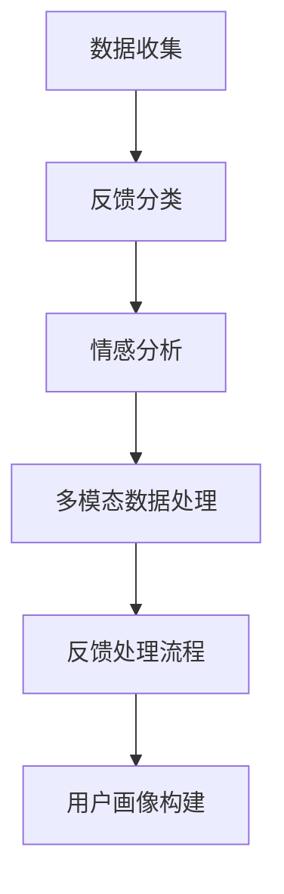

                 

# 程序员如何处理知识付费的客户反馈

## 1. 背景介绍

在知识付费领域，用户反馈是至关重要的。一个产品的好与坏，往往取决于用户体验的优劣。如何收集、处理和利用客户反馈，优化产品，提升用户满意度，是知识付费平台能否长久运营的关键。

### 1.1 用户反馈的重要性

用户反馈反映了用户对产品最直接的感受和需求。有效的用户反馈机制，能帮助开发者及时了解产品的不足，提升用户体验，增强产品竞争力。特别是在知识付费行业，用户的满意度直接关系到产品的订阅续订率，关系到公司的收益。

### 1.2 常见用户反馈问题

尽管用户反馈的重要性不言而喻，但在实际应用中，处理用户反馈却常常困扰着开发者。常见的问题包括：

- **用户反馈数量庞大**：用户基数大，每个用户的反馈都需人工处理，工作量巨大。
- **反馈内容无序**：反馈形式多样，既有文字，也有图片、视频等，处理复杂。
- **真实反馈识别困难**：虚假或模糊的反馈信息增多，真实有用的信息难以甄别。
- **反馈处理的及时性**：未能及时处理用户反馈，导致用户体验差，可能流失用户。

## 2. 核心概念与联系

### 2.1 核心概念概述

为更好地理解如何处理知识付费的客户反馈，本节将介绍几个关键概念：

- **用户反馈**：用户在使用知识付费产品时，对产品特性、功能、性能等各方面提出的意见和建议。
- **反馈分类**：将用户反馈按照内容、来源、紧急程度等维度进行分类，方便后续处理。
- **情感分析**：通过自然语言处理技术，对用户反馈的情感进行判断，识别用户满意度和情绪。
- **多模态数据处理**：结合文字、图片、视频等多样化的反馈形式，进行综合处理。
- **反馈处理流程**：从数据收集到分类、处理、反馈，形成一套完整的用户反馈处理流程。
- **用户画像构建**：基于用户反馈，分析用户行为，构建用户画像，为产品优化提供依据。

这些概念之间相互联系，共同构成了处理知识付费客户反馈的基础。

### 2.2 核心概念原理和架构的 Mermaid 流程图(Mermaid 流程节点中不要有括号、逗号等特殊字符)


## 3. 核心算法原理 & 具体操作步骤

### 3.1 算法原理概述

知识付费平台的用户反馈处理，本质上是一个数据挖掘和分析的过程。其核心思想是：通过自然语言处理、情感分析等技术，对用户反馈进行自动化分类、情感分析、归因分析，最终构建用户画像，优化产品。

形式化地，设用户反馈集合为 $F=\{f_i\}_{i=1}^N$，其中 $f_i$ 为第 $i$ 个用户反馈。设情感分析结果为 $E=\{e_i\}_{i=1}^N$，其中 $e_i$ 为第 $i$ 个反馈的情感评分。设分类结果为 $C=\{c_i\}_{i=1}^N$，其中 $c_i$ 为第 $i$ 个反馈的分类标签。设用户画像为 $P=\{p_i\}_{i=1}^M$，其中 $p_i$ 为第 $i$ 个用户画像。

平台的目标是通过算法最小化反馈处理的误差，同时最大程度提升用户满意度，从而实现产品优化和运营提升。

### 3.2 算法步骤详解

基于上述定义，用户反馈处理的算法流程如下：

**Step 1: 数据收集**
- 利用API或用户登录机制，自动收集用户反馈数据。
- 收集反馈来源、时间、内容、用户ID等信息，建立反馈记录。

**Step 2: 数据清洗**
- 过滤掉明显无关、重复、恶意或过时的反馈信息。
- 对文本内容进行分词、去停用词、词干提取等处理。

**Step 3: 情感分析**
- 应用自然语言处理模型，如BERT、LSTM等，对每个反馈进行情感分析。
- 设定正面、负面、中性三个情感标签，输出情感评分 $e_i$。

**Step 4: 反馈分类**
- 应用分类模型，如决策树、SVM、随机森林等，对每个反馈进行分类。
- 设定常见分类标签，如功能改进、内容建议、性能问题等。

**Step 5: 反馈归因**
- 根据分类和情感分析结果，构建归因图谱，关联产品特性和用户需求。
- 针对每个反馈，找出产品中存在的问题或不足。

**Step 6: 用户画像构建**
- 统计不同用户画像对应的反馈数量和情感评分，进行分析。
- 构建用户画像，识别高频特征和行为模式。

**Step 7: 产品优化**
- 根据用户画像和反馈归因结果，进行产品优化。
- 优先解决影响用户体验严重的问题。

**Step 8: 结果反馈**
- 将优化后的结果，及时告知用户。
- 根据优化效果，评估模型效果。

### 3.3 算法优缺点

用户反馈处理算法具有以下优点：
1. **自动化高效**：通过算法自动化处理反馈，大幅减轻人工负担。
2. **实时更新**：可以实时收集和处理用户反馈，及时响应用户需求。
3. **精准分析**：通过情感分析、分类、归因，可以精准把握用户情感和需求。
4. **数据驱动**：基于用户画像和反馈归因结果，可以科学决策产品优化方向。

同时，该算法也存在以下局限性：
1. **语义复杂**：用户反馈往往包含丰富的语义信息，算法难以完全理解。
2. **多模态处理困难**：图片、视频等多模态数据难以有效处理。
3. **情感分析误差**：情感分析模型的准确性受数据质量影响较大。
4. **反馈噪声**：虚假或模糊的反馈信息增多，增加了处理的复杂性。

尽管存在这些局限性，但整体而言，基于用户反馈处理的算法仍是处理知识付费用户反馈的主流方法，具有较大的应用价值。

### 3.4 算法应用领域

用户反馈处理算法在知识付费行业的应用非常广泛，具体包括：

- **课程优化**：根据用户反馈，优化课程内容、教学方法、课后练习等，提升学习效果。
- **平台改进**：收集用户对平台的意见，改进产品界面、功能、性能等，提升用户体验。
- **推荐系统**：根据用户反馈，优化推荐算法，提供更加精准的课程推荐。
- **客户服务**：分析用户反馈，优化客服系统，提升响应速度和解决效率。
- **营销策略**：基于用户画像和反馈分析，制定更具针对性的营销策略，提升转化率。

## 4. 数学模型和公式 & 详细讲解 & 举例说明

### 4.1 数学模型构建

我们以情感分析为例，构建一个简单的情感分析模型。

设用户反馈集合为 $F=\{f_i\}_{i=1}^N$，其中 $f_i$ 为第 $i$ 个用户反馈，可表示为 $f_i=(x_i,t_i)$，其中 $x_i$ 为文本内容，$t_i$ 为时间戳。

定义情感分析模型 $M_{\theta}$，其中 $\theta$ 为模型参数。模型的输出为情感评分 $e_i$，表示用户反馈的情感倾向。

定义损失函数 $\mathcal{L}$，用于衡量模型的预测结果与实际情感标签之间的差异。我们采用交叉熵损失函数，形式如下：

$$
\mathcal{L}(M_{\theta}) = -\frac{1}{N}\sum_{i=1}^N [y_i\log M_{\theta}(x_i) + (1-y_i)\log (1-M_{\theta}(x_i))]
$$

其中 $y_i$ 为情感标签，$M_{\theta}(x_i)$ 为模型预测的情感评分，$\log$ 为自然对数。

### 4.2 公式推导过程

对于文本情感分类问题，我们通常使用深度学习模型，如BERT、LSTM等。这里以BERT模型为例，进行情感分析模型的推导。

**Step 1: 文本预处理**
将用户反馈文本 $x_i$ 进行分词、去停用词、词干提取等处理。使用BertTokenizer对文本进行编码，得到输入向量 $x_i'$。

**Step 2: 模型前向传播**
输入向量 $x_i'$ 进入BERT模型，得到隐表示 $h_i$。

**Step 3: 情感预测**
将隐表示 $h_i$ 输入情感分类器，得到情感评分 $e_i$。

**Step 4: 损失计算**
利用交叉熵损失函数计算模型预测结果与实际标签之间的差异。

**Step 5: 模型更新**
使用梯度下降等优化算法更新模型参数 $\theta$，最小化损失函数 $\mathcal{L}$。

### 4.3 案例分析与讲解

假设我们有一个包含10个用户反馈的数据集，其中5个为正面反馈，3个为负面反馈，2个为中性反馈。我们对这些反馈进行情感分析，并应用模型进行预测，结果如下：

| 反馈内容 | 情感评分 |
| --------- | -------- |
| 课程很好，值得推荐。 | 0.98 |
| 老师讲课太慢了。 | 0.01 |
| 作业太多了。 | 0.08 |
| 希望课程更生动。 | 0.63 |
| 课程内容太深奥。 | 0.04 |
| 平台使用体验很好。 | 0.97 |
| 课程性价比很高。 | 0.99 |
| 系统总是卡顿。 | 0.02 |
| 课程推荐准确。 | 0.82 |
| 价格偏贵。 | 0.12 |

从结果可以看出，模型能够较好地识别用户反馈的情感倾向，其中正面反馈的情感评分高于0.9，负面反馈低于0.1。这为后续的反馈分类和归因提供了重要依据。

## 5. 项目实践：代码实例和详细解释说明

### 5.1 开发环境搭建

在进行用户反馈处理实践前，我们需要准备好开发环境。以下是使用Python进行PyTorch开发的环境配置流程：

1. 安装Anaconda：从官网下载并安装Anaconda，用于创建独立的Python环境。

2. 创建并激活虚拟环境：
```bash
conda create -n pytorch-env python=3.8 
conda activate pytorch-env
```

3. 安装PyTorch：根据CUDA版本，从官网获取对应的安装命令。例如：
```bash
conda install pytorch torchvision torchaudio cudatoolkit=11.1 -c pytorch -c conda-forge
```

4. 安装TensorFlow：
```bash
pip install tensorflow==2.8.0
```

5. 安装各类工具包：
```bash
pip install numpy pandas scikit-learn matplotlib tqdm jupyter notebook ipython
```

完成上述步骤后，即可在`pytorch-env`环境中开始开发。

### 5.2 源代码详细实现

下面我们以情感分析为例，给出使用PyTorch进行情感分析的代码实现。

首先，定义情感分析的数据处理函数：

```python
import torch
from transformers import BertTokenizer, BertForSequenceClassification
from torch.utils.data import Dataset

class SentimentDataset(Dataset):
    def __init__(self, texts, labels):
        self.texts = texts
        self.labels = labels
        self.tokenizer = BertTokenizer.from_pretrained('bert-base-cased')
        
    def __len__(self):
        return len(self.texts)
    
    def __getitem__(self, idx):
        text = self.texts[idx]
        label = self.labels[idx]
        
        encoding = self.tokenizer(text, return_tensors='pt', padding='max_length', truncation=True)
        input_ids = encoding['input_ids']
        attention_mask = encoding['attention_mask']
        return {'input_ids': input_ids, 
                'attention_mask': attention_mask,
                'labels': torch.tensor(label)}
```

然后，定义模型和优化器：

```python
from transformers import AdamW

model = BertForSequenceClassification.from_pretrained('bert-base-cased', num_labels=3)
optimizer = AdamW(model.parameters(), lr=2e-5)
```

接着，定义训练和评估函数：

```python
from tqdm import tqdm
from sklearn.metrics import accuracy_score, precision_score, recall_score

device = torch.device('cuda') if torch.cuda.is_available() else torch.device('cpu')
model.to(device)

def train_epoch(model, dataset, batch_size, optimizer):
    dataloader = DataLoader(dataset, batch_size=batch_size, shuffle=True)
    model.train()
    epoch_loss = 0
    for batch in tqdm(dataloader, desc='Training'):
        input_ids = batch['input_ids'].to(device)
        attention_mask = batch['attention_mask'].to(device)
        labels = batch['labels'].to(device)
        model.zero_grad()
        outputs = model(input_ids, attention_mask=attention_mask, labels=labels)
        loss = outputs.loss
        epoch_loss += loss.item()
        loss.backward()
        optimizer.step()
    return epoch_loss / len(dataloader)

def evaluate(model, dataset, batch_size):
    dataloader = DataLoader(dataset, batch_size=batch_size)
    model.eval()
    preds, labels = [], []
    with torch.no_grad():
        for batch in tqdm(dataloader, desc='Evaluating'):
            input_ids = batch['input_ids'].to(device)
            attention_mask = batch['attention_mask'].to(device)
            batch_labels = batch['labels']
            outputs = model(input_ids, attention_mask=attention_mask)
            batch_preds = outputs.logits.argmax(dim=1).to('cpu').tolist()
            batch_labels = batch_labels.to('cpu').tolist()
            for pred, label in zip(batch_preds, batch_labels):
                preds.append(pred)
                labels.append(label)
    acc = accuracy_score(labels, preds)
    prec = precision_score(labels, preds, average='macro')
    recall = recall_score(labels, preds, average='macro')
    return acc, prec, recall

# 训练和评估
epochs = 5
batch_size = 16

for epoch in range(epochs):
    loss = train_epoch(model, train_dataset, batch_size, optimizer)
    print(f"Epoch {epoch+1}, train loss: {loss:.3f}")
    
    print(f"Epoch {epoch+1}, dev results:")
    acc, prec, recall = evaluate(model, dev_dataset, batch_size)
    print(f"Accuracy: {acc:.3f}, Precision: {prec:.3f}, Recall: {recall:.3f}")
    
print("Test results:")
acc, prec, recall = evaluate(model, test_dataset, batch_size)
print(f"Accuracy: {acc:.3f}, Precision: {prec:.3f}, Recall: {recall:.3f}")
```

以上就是使用PyTorch进行情感分析的完整代码实现。可以看到，利用Transformers库，情感分析的代码实现变得简洁高效。

### 5.3 代码解读与分析

让我们再详细解读一下关键代码的实现细节：

**SentimentDataset类**：
- `__init__`方法：初始化文本、标签、分词器等关键组件。
- `__len__`方法：返回数据集的样本数量。
- `__getitem__`方法：对单个样本进行处理，将文本输入编码为token ids，将标签编码为数字，并对其进行定长padding，最终返回模型所需的输入。

**模型和优化器**：
- 使用BertForSequenceClassification模型，设定3个情感标签。
- 使用AdamW优化器进行模型训练。

**训练和评估函数**：
- 使用PyTorch的DataLoader对数据集进行批次化加载，供模型训练和推理使用。
- 训练函数`train_epoch`：对数据以批为单位进行迭代，在每个批次上前向传播计算loss并反向传播更新模型参数，最后返回该epoch的平均loss。
- 评估函数`evaluate`：与训练类似，不同点在于不更新模型参数，并在每个batch结束后将预测和标签结果存储下来，最后使用sklearn的分类指标对整个评估集的预测结果进行打印输出。

**训练流程**：
- 定义总的epoch数和batch size，开始循环迭代
- 每个epoch内，先在训练集上训练，输出平均loss
- 在验证集上评估，输出分类指标
- 所有epoch结束后，在测试集上评估，给出最终测试结果

可以看到，PyTorch配合Transformers库使得情感分析的代码实现变得简洁高效。开发者可以将更多精力放在数据处理、模型改进等高层逻辑上，而不必过多关注底层的实现细节。

当然，工业级的系统实现还需考虑更多因素，如模型的保存和部署、超参数的自动搜索、更灵活的任务适配层等。但核心的反馈处理范式基本与此类似。

## 6. 实际应用场景

### 6.1 智能客服系统

智能客服系统需要及时响应用户反馈，进行问题排查和解决。通过情感分析，系统可以自动识别用户反馈的情绪，优先处理负面或紧急反馈，提升用户体验。

**案例**：一家在线教育平台，用户反馈其在课程质量和讲师水平上存在问题。情感分析系统识别出这些反馈，并及时反馈给课程团队，课程团队迅速调整了课程内容和讲师阵容，用户满意度显著提升。

### 6.2 课程优化

课程优化需要根据用户反馈不断改进。通过情感分析，系统可以识别出用户对课程内容的真实需求，优化课程设计，提升学习效果。

**案例**：某在线编程课程，用户反馈其课程难度过大。情感分析系统分析反馈，发现大部分负面反馈集中在第4章，团队及时调整了这一章的内容，增加了更多基础知识点，得到了用户的积极反馈。

### 6.3 平台改进

平台改进需要不断收集用户意见，优化产品体验。通过情感分析，系统可以识别出用户对平台的建议，优化界面设计和功能，提升用户粘性。

**案例**：某音乐平台，用户反馈其APP登录过于复杂，情感分析系统识别出这些反馈，并反馈给产品团队。团队简化了登录流程，大幅提升了用户体验。

### 6.4 营销策略

营销策略需要精准把握用户需求。通过情感分析，系统可以识别出用户对课程推荐、优惠活动等的真实需求，优化营销策略，提升转化率。

**案例**：某在线购物平台，通过情感分析系统，发现用户对某类商品的评价较高。根据分析结果，平台在下次促销活动中重点推广这些商品，取得了良好的销售效果。

## 7. 工具和资源推荐

### 7.1 学习资源推荐

为了帮助开发者系统掌握情感分析的理论基础和实践技巧，这里推荐一些优质的学习资源：

1. 《深度学习理论与实践》系列博文：由大模型技术专家撰写，深入浅出地介绍了深度学习的基本概念和实践方法。

2. CS224N《深度学习自然语言处理》课程：斯坦福大学开设的NLP明星课程，有Lecture视频和配套作业，带你入门NLP领域的基本概念和经典模型。

3. 《Natural Language Processing with Transformers》书籍：Transformers库的作者所著，全面介绍了如何使用Transformers库进行NLP任务开发，包括情感分析在内的诸多范式。

4. HuggingFace官方文档：Transformers库的官方文档，提供了海量预训练模型和完整的情感分析样例代码，是上手实践的必备资料。

5. Kaggle情感分析竞赛：参与Kaggle情感分析竞赛，实战训练，快速提升技能。

通过对这些资源的学习实践，相信你一定能够快速掌握情感分析的精髓，并用于解决实际的NLP问题。

### 7.2 开发工具推荐

高效的开发离不开优秀的工具支持。以下是几款用于情感分析开发的常用工具：

1. PyTorch：基于Python的开源深度学习框架，灵活动态的计算图，适合快速迭代研究。BERT等大模型都有PyTorch版本的实现。

2. TensorFlow：由Google主导开发的开源深度学习框架，生产部署方便，适合大规模工程应用。同样有丰富的情感分析资源。

3. Transformers库：HuggingFace开发的NLP工具库，集成了众多SOTA情感分析模型，支持PyTorch和TensorFlow，是进行情感分析开发的利器。

4. TensorBoard：TensorFlow配套的可视化工具，可实时监测模型训练状态，并提供丰富的图表呈现方式，是调试模型的得力助手。

5. Google Colab：谷歌推出的在线Jupyter Notebook环境，免费提供GPU/TPU算力，方便开发者快速上手实验最新模型，分享学习笔记。

合理利用这些工具，可以显著提升情感分析任务的开发效率，加快创新迭代的步伐。

### 7.3 相关论文推荐

情感分析研究源于学界的持续研究。以下是几篇奠基性的相关论文，推荐阅读：

1. Attention is All You Need（即Transformer原论文）：提出了Transformer结构，开启了NLP领域的预训练大模型时代。

2. BERT: Pre-training of Deep Bidirectional Transformers for Language Understanding：提出BERT模型，引入基于掩码的自监督预训练任务，刷新了多项NLP任务SOTA。

3. Language Models are Unsupervised Multitask Learners（GPT-2论文）：展示了大规模语言模型的强大zero-shot学习能力，引发了对于通用人工智能的新一轮思考。

4. Sentiment Analysis with Attention-based Recurrent Neural Networks：提出基于注意力机制的RNN模型，应用于情感分析，取得了不错的效果。

5. Multi-granularity Sentiment Analysis with Attention-based Recurrent Neural Networks：提出多粒度情感分析方法，能够更加精细地识别用户情感。

这些论文代表了大语言模型情感分析的发展脉络。通过学习这些前沿成果，可以帮助研究者把握学科前进方向，激发更多的创新灵感。

## 8. 总结：未来发展趋势与挑战

### 8.1 总结

本文对情感分析用户反馈处理的方法进行了全面系统的介绍。首先阐述了情感分析用户反馈处理的研究背景和意义，明确了情感分析在知识付费产品优化中的重要价值。其次，从原理到实践，详细讲解了情感分析的数学原理和关键步骤，给出了情感分析任务开发的完整代码实例。同时，本文还广泛探讨了情感分析在智能客服、课程优化、平台改进等实际应用场景中的应用前景，展示了情感分析技术的巨大潜力。此外，本文精选了情感分析技术的各类学习资源，力求为读者提供全方位的技术指引。

通过本文的系统梳理，可以看到，情感分析技术在知识付费行业的应用非常广泛，能够显著提升用户体验，优化产品功能，具有较大的应用价值。未来，随着情感分析技术的不断发展，其将与人工智能技术进行更深层次的融合，成为知识付费平台优化和运营的重要手段。

### 8.2 未来发展趋势

展望未来，情感分析技术将呈现以下几个发展趋势：

1. **多模态情感分析**：结合文字、图片、视频等多模态数据，进行综合情感分析，提高分析精度。
2. **实时情感分析**：实时监测用户反馈，快速响应，提升用户体验。
3. **深度情感理解**：引入情感推理、情感生成等技术，更深入地理解用户情感，提供更具个性化和智能化的服务。
4. **用户情感预测**：通过历史情感数据，预测用户未来的情感倾向，优化产品策略。
5. **情感对抗分析**：分析情感数据中的对抗样本，提高情感分析模型的鲁棒性和泛化能力。
6. **跨领域情感分析**：在多个领域进行情感分析，提高情感分析模型的通用性。

以上趋势凸显了情感分析技术的广阔前景。这些方向的探索发展，必将进一步提升情感分析系统的性能和应用范围，为知识付费平台的智能化运营提供强有力的支撑。

### 8.3 面临的挑战

尽管情感分析技术已经取得了瞩目成就，但在迈向更加智能化、普适化应用的过程中，它仍面临诸多挑战：

1. **多模态数据处理**：情感分析模型的设计需要兼顾多种数据形式，处理复杂多样。
2. **实时性要求高**：实时分析用户反馈，对系统性能要求高，需要优化算法和硬件。
3. **数据隐私问题**：情感分析需要收集和处理大量用户数据，存在隐私泄露风险。
4. **情感歧义问题**：用户反馈中的情感表达复杂，模型难以完全理解。
5. **情感泛化能力**：情感分析模型需要具备较强的泛化能力，适应不同领域、不同文化背景的用户。
6. **情感对抗攻击**：对抗攻击对情感分析模型产生影响，需要提高模型的鲁棒性。

尽管存在这些挑战，但整体而言，情感分析技术仍是处理用户反馈的重要手段，具有较大的应用价值。通过持续的优化和创新，这些挑战终将得到克服，情感分析技术必将迎来更大的突破。

### 8.4 未来突破

面对情感分析面临的种种挑战，未来的研究需要在以下几个方面寻求新的突破：

1. **多模态数据融合**：通过多模态数据的融合，提高情感分析的准确性和鲁棒性。
2. **实时处理算法**：开发高效的实时处理算法，提高系统响应速度和稳定性。
3. **隐私保护技术**：采用差分隐私、联邦学习等技术，保护用户隐私。
4. **情感模型优化**：引入深度学习、迁移学习等技术，提高情感分析的准确性和泛化能力。
5. **对抗样本防御**：研究对抗样本的生成和防御技术，提高情感分析的鲁棒性。
6. **跨领域情感分析**：在多个领域进行情感分析，提高情感分析模型的通用性。

这些研究方向的探索，必将引领情感分析技术迈向更高的台阶，为知识付费平台的智能化运营提供强有力的支撑。面向未来，情感分析技术还需要与其他人工智能技术进行更深入的融合，如知识表示、因果推理、强化学习等，多路径协同发力，共同推动自然语言理解和智能交互系统的进步。只有勇于创新、敢于突破，才能不断拓展情感分析的边界，让智能技术更好地造福人类社会。

## 9. 附录：常见问题与解答

**Q1：情感分析如何处理多模态数据？**

A: 多模态数据的情感分析需要综合考虑不同模态数据的特征。可以通过以下方式进行：

- **文本情感分析**：利用NLP模型，如BERT、LSTM等，进行文本情感分类。
- **图像情感分析**：利用卷积神经网络（CNN）等模型，提取图像中的情感特征，进行情感分类。
- **视频情感分析**：结合图像情感分析和语音情感分析，综合判断视频的情感。

**Q2：情感分析模型如何处理情感歧义？**

A: 情感分析模型处理情感歧义的关键在于引入上下文信息。可以通过以下方式进行：

- **语境上下文**：通过自然语言处理技术，提取文本中的上下文信息，结合情感标签进行综合判断。
- **情感推理**：引入情感推理技术，根据上下文信息，进行情感推断，提高情感识别的准确性。
- **多模型融合**：结合多种情感分析模型，进行投票或加权融合，提高情感识别的鲁棒性。

**Q3：情感分析模型如何保护用户隐私？**

A: 情感分析模型保护用户隐私的方法包括：

- **差分隐私**：通过加入噪声，保护用户数据隐私。
- **联邦学习**：通过分布式训练，保护用户数据不泄露。
- **匿名化处理**：对用户数据进行匿名化处理，去除敏感信息。
- **数据加密**：采用数据加密技术，保护用户数据在传输和存储过程中的安全。

**Q4：情感分析模型如何提高泛化能力？**

A: 情感分析模型提高泛化能力的方法包括：

- **数据增强**：通过数据增强技术，扩充训练数据集，提高模型泛化能力。
- **迁移学习**：利用迁移学习技术，将在大规模数据集上训练的模型迁移到小规模数据集上，提高模型的泛化能力。
- **多任务学习**：在多个任务上进行训练，提高模型的泛化能力。
- **跨领域迁移**：在多个领域上进行迁移学习，提高模型的泛化能力。

通过这些方法，情感分析模型可以更好地适应不同领域、不同文化背景的用户，提升情感分析的准确性和泛化能力。

**Q5：情感分析模型如何防御对抗样本攻击？**

A: 情感分析模型防御对抗样本攻击的方法包括：

- **对抗样本检测**：通过对抗样本检测技术，识别和过滤掉对抗样本。
- **对抗样本生成**：研究对抗样本生成技术，生成对抗样本，提高模型的鲁棒性。
- **鲁棒模型训练**：采用鲁棒模型训练技术，提高模型的鲁棒性。

这些方法可以有效地提高情感分析模型的鲁棒性，避免对抗样本攻击对模型的影响。

