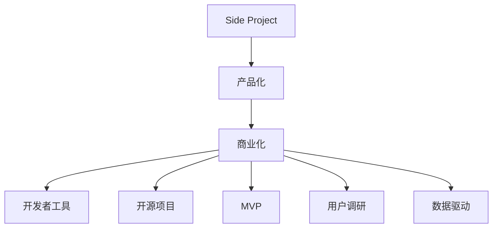

                 

# 程序员如何将Side Project转化为付费产品

> 关键词：Side Project, 产品化, 商业化, 开发者工具, 开源项目, MVP, 用户调研, 数据驱动

## 1. 背景介绍

### 1.1 问题由来
在软件开发者职业生涯中，Side Project（业余项目）占据了重要的位置。对于开发者而言，Side Project不仅是一种兴趣所在，更是一种持续学习和创新的重要方式。然而，尽管许多Side Project在技术上非常出色，但却难以商业化，无法转化为实际的收入来源。如何将Side Project转化为付费产品，不仅可以让开发者获得额外的收入，同时也可以让产品获得更广泛的认可和支持。

### 1.2 问题核心关键点
本节将详细介绍如何将Side Project转化为付费产品的关键步骤，并分析其中涉及的核心概念和技术细节。

## 2. 核心概念与联系

### 2.1 核心概念概述

- **Side Project**：指开发者在业余时间开发的各种项目，通常不与正式工作直接相关，但代表开发者个人兴趣和能力。
- **产品化(Productization)**：指将Side Project转化为可规模化生产和销售的商业产品。
- **商业化(Commercialization)**：指将产品推向市场，获取实际收入。
- **开发者工具(Developer Tools)**：指帮助开发者提升工作效率和产品质量的各种工具，包括IDE、版本控制、持续集成等。
- **开源项目(Open Source Project)**：指公开源代码的项目，可以共享和协作开发。
- **最小可行产品(Minimum Viable Product, MVP)**：指具备核心功能，可以迅速上线并获得市场反馈的最小产品形态。
- **用户调研(User Research)**：指通过各种方法了解目标用户需求，指导产品设计和开发的过程。
- **数据驱动(Data-Driven)**：指通过数据分析和监控，优化产品性能和用户体验。

这些概念之间的逻辑关系可以通过以下Mermaid流程图来展示：



这个流程图展示了将Side Project转化为付费产品的核心流程：

1. 将Side Project进行产品化，构建可规模化的商业产品。
2. 将产品推向市场进行商业化，获得收入。
3. 使用开发者工具、开源项目等提升产品开发效率。
4. 在MVP阶段进行用户调研，明确用户需求。
5. 通过数据驱动优化产品性能和用户体验。

## 3. 核心算法原理 & 具体操作步骤

### 3.1 算法原理概述

将Side Project转化为付费产品的核心在于产品化。产品化的关键在于识别产品核心价值，并在此基础上构建可规模化生产和销售的商业产品。具体步骤包括：

1. **需求识别**：明确产品的核心功能需求，解决用户痛点。
2. **功能规划**：根据需求识别，规划产品的功能模块和优先级。
3. **技术选型**：选择适合的技术栈和框架，构建产品原型。
4. **市场验证**：通过MVP验证产品市场接受度，收集用户反馈。
5. **产品迭代**：根据用户反馈，不断优化产品功能和性能。
6. **市场推广**：通过各种渠道推广产品，获取实际收入。

### 3.2 算法步骤详解

#### 3.2.1 需求识别
需求识别是产品化的第一步，主要通过以下方法：

1. **用户调研**：通过问卷调查、访谈等方式，了解目标用户需求。
2. **竞品分析**：分析竞争对手的产品，找出自己的优势和不足。
3. **问题反馈**：收集用户的反馈和建议，找出常见问题和痛点。

#### 3.2.2 功能规划
功能规划基于需求识别，主要通过以下步骤：

1. **优先级排序**：根据功能的重要性和实现难度，确定功能优先级。
2. **功能模块划分**：将功能划分为不同的模块，便于开发和管理。
3. **功能依赖分析**：分析功能之间的依赖关系，确保模块间的协调性。

#### 3.2.3 技术选型
技术选型基于功能规划，主要通过以下方法：

1. **技术栈评估**：评估不同技术栈的优势和适用场景。
2. **开源项目利用**：选择适合的开源项目和工具，提高开发效率。
3. **开发者技能匹配**：根据开发者技能匹配技术栈，降低技术风险。

#### 3.2.4 市场验证
市场验证主要通过MVP（最小可行产品）实现，具体步骤包括：

1. **产品原型构建**：构建功能最简单的MVP版本，快速上线。
2. **用户测试**：邀请目标用户测试MVP，收集使用反馈。
3. **市场反应评估**：评估MVP的市场接受度，收集用户建议。

#### 3.2.5 产品迭代
产品迭代基于市场验证，主要通过以下方法：

1. **用户反馈整合**：整合用户反馈，确定优化方向。
2. **功能扩展和优化**：扩展MVP功能，优化用户体验。
3. **性能提升**：优化系统性能，确保稳定性。

#### 3.2.6 市场推广
市场推广基于产品迭代，主要通过以下方法：

1. **营销策略制定**：制定有效的营销策略，推广产品。
2. **渠道拓展**：拓展各种销售渠道，覆盖更广泛用户。
3. **客户服务**：提供良好的客户服务，提升用户满意度。

### 3.3 算法优缺点

产品化的优点：

1. **市场验证**：通过MVP验证产品市场接受度，降低开发风险。
2. **用户反馈**：收集用户反馈，不断优化产品。
3. **技术复用**：利用已有技术栈和开源项目，提高开发效率。

产品化的缺点：

1. **投入成本高**：需要大量资源投入，包括时间、资金等。
2. **市场竞争激烈**：市场竞争激烈，需要创新和差异化。
3. **风险不确定**：市场反应不确定，存在失败风险。

### 3.4 算法应用领域

产品化不仅适用于技术类Side Project，也适用于各种其他类型的Side Project。例如，数据分析、设计工具、应用开发等领域都可以通过产品化实现商业化。

## 4. 数学模型和公式 & 详细讲解 & 举例说明

### 4.1 数学模型构建

在产品化的过程中，可以通过以下数学模型对需求、功能、用户反馈等进行量化分析：

1. **需求量化模型**：通过问卷调查等方法，量化用户需求。
2. **功能重要性模型**：通过专家评估法、层次分析法等，量化功能重要性。
3. **用户反馈模型**：通过文本分析、情感分析等方法，量化用户反馈。

### 4.2 公式推导过程

以下以功能重要性模型为例，推导其量化公式：

1. **专家评估法**：邀请专家对各个功能进行打分，计算平均分。
2. **层次分析法**：将功能划分为多个层次，计算各个层次的权重。
3. **加权平均法**：将专家评估得分与层次分析权重结合，计算最终功能重要性得分。

具体公式如下：

$$
FI = \frac{\sum_{i=1}^n F_i \times W_i}{\sum_{i=1}^n W_i}
$$

其中，$F_i$ 表示第$i$个功能的专家评估得分，$W_i$ 表示第$i$个功能的层次分析权重。

### 4.3 案例分析与讲解

假设某个Side Project是一款数据分析工具，用户调研结果显示，用户最关心的是数据可视化和数据处理功能。通过专家评估法和层次分析法，计算得出数据可视化的重要性得分为0.8，数据处理的重要性得分为0.6。根据加权平均法，可以计算得出该Side Project的功能重要性得分为0.72。

## 5. 项目实践：代码实例和详细解释说明

### 5.1 开发环境搭建

要实现Side Project的产品化，首先需要搭建开发环境。以下是使用Python进行Django开发的开发环境配置流程：

1. 安装Anaconda：从官网下载并安装Anaconda，用于创建独立的Python环境。
2. 创建并激活虚拟环境：
```bash
conda create -n django-env python=3.8 
conda activate django-env
```
3. 安装Django：根据CUDA版本，从官网获取对应的安装命令。例如：
```bash
conda install django
```
4. 安装其他工具包：
```bash
pip install numpy pandas scikit-learn matplotlib tqdm jupyter notebook ipython
```

完成上述步骤后，即可在`django-env`环境中开始开发实践。

### 5.2 源代码详细实现

以下以Django开发的在线协作工具为例，给出产品化的完整代码实现。

首先，定义协作工具的数据模型：

```python
from django.db import models

class User(models.Model):
    name = models.CharField(max_length=100)
    email = models.EmailField(unique=True)
    # 其他字段...

class Task(models.Model):
    title = models.CharField(max_length=200)
    description = models.TextField()
    # 其他字段...
```

然后，定义视图函数：

```python
from django.shortcuts import render, redirect
from django.http import HttpResponse

def index(request):
    # 处理请求，返回视图函数对应的HTML页面
    return render(request, 'index.html')

def task_detail(request, task_id):
    task = Task.objects.get(id=task_id)
    # 处理请求，返回任务详情页面
    return render(request, 'task_detail.html', {'task': task})

def add_task(request):
    if request.method == 'POST':
        title = request.POST['title']
        description = request.POST['description']
        task = Task(title=title, description=description)
        task.save()
        return redirect('index')
    # 处理请求，返回表单页面
    return render(request, 'add_task.html')
```

接着，定义模板：

```html
<!-- index.html -->
<h1>在线协作工具</h1>
<a href="/add_task/">添加任务</a>

<!-- add_task.html -->
<form method="post">
    
    <label for="title">任务标题:</label>
    <input type="text" name="title"><br>
    <label for="description">任务描述:</label>
    <textarea name="description"></textarea><br>
    <button type="submit">提交</button>
</form>
```

最后，启动Django开发服务器：

```bash
python manage.py runserver
```

通过以上步骤，即可在开发环境中搭建Django应用的开发环境，实现在线协作工具的基本功能。

### 5.3 代码解读与分析

以下是关键代码的实现细节：

**User和Task模型**：
- 定义了用户和任务的基本信息，用于数据存储和查询。

**视图函数**：
- 实现首页显示、任务详情页显示和任务添加功能。
- 使用Django的模板渲染功能，动态生成HTML页面。

**模板**：
- 使用HTML和Django模板语言，定义页面结构和交互逻辑。

通过以上代码实现，可以看到Django框架提供了强大的Web应用开发支持，开发者只需关注业务逻辑的实现，可以快速构建高质量的Web应用。

### 5.4 运行结果展示

通过运行Django开发服务器，访问`http://127.0.0.1:8000/`，即可在Web浏览器中看到在线协作工具的运行结果。用户可以添加任务、查看任务详情，实现了基本的在线协作功能。

## 6. 实际应用场景

### 6.1 在线协作工具

在线协作工具可以帮助团队高效协作，实现任务分配、进度跟踪、文件共享等功能。开发者可以将Side Project转化为在线协作工具，解决团队协作中的痛点，获得用户认可和付费支持。

### 6.2 数据分析平台

数据分析平台可以帮助企业高效分析海量数据，生成直观的可视化报告。开发者可以将Side Project转化为数据分析平台，为数据驱动的决策提供支持，获得企业客户的付费支持。

### 6.3 学习管理系统

学习管理系统可以帮助学生高效学习，实现课程管理、作业提交、考试评估等功能。开发者可以将Side Project转化为学习管理系统，为教育行业的数字化转型提供支持，获得学生和教育机构的付费支持。

### 6.4 未来应用展望

随着技术的发展，Side Project产品化的应用场景将不断拓展。未来，Side Project可以应用于更多垂直领域，如医疗、金融、智能家居等，为各行各业带来创新和变革。

## 7. 工具和资源推荐

### 7.1 学习资源推荐

为了帮助开发者掌握将Side Project产品化的技能，这里推荐一些优质的学习资源：

1. Django官方文档：Django框架的官方文档，提供了详细的教程和API参考。
2. Flask官方文档：Flask框架的官方文档，提供了详细的教程和API参考。
3. React官方文档：React框架的官方文档，提供了详细的教程和API参考。
4. Bootstrap官方文档：Bootstrap框架的官方文档，提供了详细的教程和API参考。
5. Git官方文档：Git版本控制的官方文档，提供了详细的教程和API参考。
6. Docker官方文档：Docker容器化的官方文档，提供了详细的教程和API参考。

通过对这些资源的学习实践，相信你一定能够掌握将Side Project产品化的技能，并用于解决实际的业务问题。

### 7.2 开发工具推荐

高效的开发离不开优秀的工具支持。以下是几款用于Side Project产品化开发的常用工具：

1. Django：Python语言下的Web开发框架，提供了强大的路由、模板、表单等功能，适合开发Web应用。
2. Flask：Python语言下的微框架，灵活高效，适合快速开发小型应用。
3. React：JavaScript语言下的前端开发框架，支持组件化开发，适合构建交互性强的Web应用。
4. Bootstrap：CSS框架，提供了丰富的UI组件，适合快速开发响应式Web应用。
5. Git：版本控制系统，支持分布式版本控制，适合多人协作开发。
6. Docker：容器化工具，支持应用打包、部署、管理，适合分布式环境下的开发和部署。

合理利用这些工具，可以显著提升Side Project产品化任务的开发效率，加快创新迭代的步伐。

### 7.3 相关论文推荐

Side Project产品化的发展源于学界的持续研究。以下是几篇奠基性的相关论文，推荐阅读：

1. "Software as a Service: A Modern Artifact of the Information Economy" （软件即服务：信息经济的现代产物）。
2. "Cloud Computing: Concepts, Technology and Architecture" （云计算：概念、技术和架构）。
3. "Designing for Scalability" （设计可扩展性）。
4. "Agile Software Development: Principles, Patterns, and Practices" （敏捷软件开发：原则、模式和实践）。
5. "Design Patterns: Elements of Reusable Object-Oriented Software" （设计模式：可重用的面向对象软件的元素）。

这些论文代表了就职于大公司、进行商业化产品开发的背景，为开发者提供了宝贵的经验和建议。

## 8. 总结：未来发展趋势与挑战

### 8.1 总结

本文对将Side Project转化为付费产品的关键步骤进行了详细讲解，涵盖了需求识别、功能规划、技术选型、市场验证、产品迭代和市场推广等核心环节。通过本文的系统梳理，可以看到，将Side Project产品化不仅需要技术上的突破，还需要商业、市场、用户体验等多方面的综合考虑。只有在各个环节进行全面优化，才能真正实现Side Project的成功商业化。

通过本文的系统梳理，可以看到，将Side Project产品化不仅需要技术上的突破，还需要商业、市场、用户体验等多方面的综合考虑。只有在各个环节进行全面优化，才能真正实现Side Project的成功商业化。

### 8.2 未来发展趋势

展望未来，Side Project产品化的发展趋势将呈现以下几个方向：

1. **自动化开发**：随着AI和自动化工具的发展，开发者可以更快地进行功能实现和测试，提升开发效率。
2. **云原生架构**：云原生技术使得应用更易部署、扩展和管理，适合分布式和动态环境下的应用开发。
3. **DevOps**：DevOps实践使得开发、测试、部署、运维等环节更加协同，提升交付速度和稳定性。
4. **微服务架构**：微服务架构使得应用更易扩展和维护，适合复杂和分布式环境下的应用开发。
5. **人工智能应用**：AI技术可以用于自动化测试、数据分析、用户行为预测等，提升产品开发和用户管理效率。

以上趋势凸显了Side Project产品化技术的广阔前景。这些方向的探索发展，必将进一步提升Side Project的成功率，为开发者带来更多的商业机会。

### 8.3 面临的挑战

尽管Side Project产品化技术已经取得了一定进展，但在迈向更加智能化、普适化应用的过程中，它仍面临着诸多挑战：

1. **开发成本高**：Side Project产品化需要大量资源投入，包括时间、资金等。
2. **市场竞争激烈**：市场竞争激烈，需要创新和差异化。
3. **用户需求多样**：用户需求各异，产品需要灵活应对。
4. **技术风险高**：技术栈和框架的选择对产品成败至关重要。
5. **用户体验复杂**：用户体验涉及方方面面，产品需要不断优化。
6. **安全性风险**：数据和隐私安全是首要考虑，需要做好安全防护。

这些挑战需要开发者从技术、市场、用户体验等多个方面进行全面优化，才能真正实现Side Project的成功商业化。

### 8.4 研究展望

面向未来，Side Project产品化研究需要在以下几个方面寻求新的突破：

1. **自动化开发工具**：开发自动化工具，提升开发效率和代码质量。
2. **云原生架构**：研究云原生技术，支持分布式和动态环境下的应用开发。
3. **DevOps实践**：推广DevOps文化，提升交付速度和稳定性。
4. **微服务架构**：研究微服务技术，提升应用的可扩展性和可维护性。
5. **人工智能应用**：研究AI技术在产品开发和用户管理中的应用。

这些研究方向的探索，必将引领Side Project产品化技术迈向更高的台阶，为开发者带来更多的商业机会。

## 9. 附录：常见问题与解答

**Q1：Side Project如何转化为付费产品？**

A: 将Side Project转化为付费产品主要包括以下几个关键步骤：

1. **需求识别**：明确产品的核心功能需求，解决用户痛点。
2. **功能规划**：根据需求识别，规划产品的功能模块和优先级。
3. **技术选型**：选择适合的技术栈和框架，构建产品原型。
4. **市场验证**：通过MVP验证产品市场接受度，收集用户反馈。
5. **产品迭代**：根据用户反馈，不断优化产品功能和性能。
6. **市场推广**：通过各种渠道推广产品，获取实际收入。

**Q2：Side Project产品化的关键要素有哪些？**

A: Side Project产品化的关键要素包括：

1. **用户需求**：明确目标用户的需求和痛点。
2. **功能设计**：合理设计产品的核心功能和用户界面。
3. **技术栈选择**：选择合适的技术栈和开发工具。
4. **市场验证**：通过MVP验证产品市场接受度，收集用户反馈。
5. **产品迭代**：根据用户反馈，不断优化产品功能和性能。
6. **市场推广**：通过各种渠道推广产品，获取实际收入。

**Q3：Side Project产品化的投入成本如何控制？**

A: Side Project产品化的投入成本控制主要通过以下方法：

1. **合理规划**：明确项目的范围和优先级，避免过度投入。
2. **敏捷开发**：采用敏捷开发方法，快速迭代和交付功能。
3. **资源优化**：使用云原生架构、DevOps等技术，降低开发和运维成本。
4. **开源利用**：利用开源项目和工具，降低技术栈选择和开发成本。
5. **用户体验优化**：优化用户体验，提升用户满意度和留存率。

**Q4：Side Project产品化的技术风险有哪些？**

A: Side Project产品化的技术风险主要包括以下方面：

1. **技术栈选择**：选择合适的技术栈和框架，避免技术风险。
2. **性能优化**：优化系统性能，确保稳定性。
3. **安全性防护**：做好数据和隐私安全防护，避免泄露和攻击。
4. **兼容性问题**：确保不同平台和浏览器的兼容性。
5. **扩展性问题**：确保系统具有良好的扩展性和可维护性。

**Q5：Side Project产品化的市场推广策略有哪些？**

A: Side Project产品化的市场推广策略主要包括以下方面：

1. **品牌建设**：建立品牌形象，提升产品知名度。
2. **用户社区**：建立用户社区，增强用户粘性。
3. **渠道拓展**：拓展各种销售渠道，覆盖更广泛用户。
4. **市场定位**：明确市场定位，针对目标用户推广。
5. **内容营销**：通过内容营销，提升产品曝光率。

通过以上问题的解答，可以看出Side Project产品化不仅需要技术上的突破，还需要商业、市场、用户体验等多方面的综合考虑。只有在各个环节进行全面优化，才能真正实现Side Project的成功商业化。

---

作者：禅与计算机程序设计艺术 / Zen and the Art of Computer Programming

