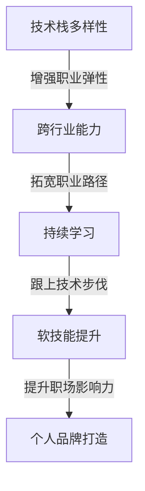

                 

# 程序员如何应对行业薪资天花板

在技术发展的长河中，程序员群体始终是推动社会进步的重要力量。然而，随着技术的快速迭代和行业竞争的加剧，许多程序员也面临着薪资增长乏力的尴尬局面，甚至出现了所谓的“行业薪资天花板”现象。面对这一挑战，本文旨在深入分析当前行业状况，提出几点实用的应对策略，帮助程序员跳出薪酬陷阱，实现职业生涯的跃迁。

## 1. 背景介绍

### 1.1 行业薪资现状

近年来，IT行业的薪资水平持续走高，但并非所有岗位都享有同样的增长红利。一些核心技术岗位和热门行业如人工智能、大数据、云计算等，依然保持着较高的薪资增长速度。然而，对于某些初级开发岗位和传统IT行业，薪资增长缓慢，甚至停滞不前。特别是对于拥有多年工作经验但技能未跟上技术发展步伐的程序员，面临的薪酬增长压力更为显著。

### 1.2 问题成因

行业薪资天花板的形成，是多方面因素共同作用的结果：

- **技术更新速度加快**：新技术、新工具层出不穷，要求程序员不断学习，否则容易被淘汰。
- **市场供需失衡**：某些热门岗位如人工智能、大数据等供不应求，薪资水平自然上涨。而一些传统IT岗位，由于需求减少，薪资增长乏力。
- **职业路径狭窄**：一些程序员长期在某个技术栈或行业领域深耕，难以跨界或跨岗发展，职业晋升机会有限。
- **技能提升缓慢**：部分程序员未能及时更新知识结构，技能单一，难以胜任更高要求的岗位。
- **企业成本控制**：部分企业在追求短期利益时，对高级技术人才的需求减少，进一步压缩了薪资增长空间。

## 2. 核心概念与联系

### 2.1 核心概念概述

要应对行业薪资天花板，首先需要理解几个核心概念：

- **技术栈多样性**：掌握多种编程语言和技术栈，能够更灵活地适应不同项目需求，增加职业发展的弹性。
- **跨行业能力**：具备跨行业工作的能力，如从软件开发转行到数据分析、项目管理等，能够拓宽职业路径。
- **持续学习**：不断更新自己的知识体系，跟上技术发展的步伐，保持竞争力。
- **软技能提升**：增强沟通能力、团队协作能力、项目管理能力等软技能，提升职场影响力。
- **个人品牌打造**：通过开源项目、技术博客、社交媒体等方式，建立个人品牌，吸引更多机会。

这些概念之间通过如下图示（Mermaid流程图）展示其相互联系：



### 2.2 核心概念原理和架构

为了更好地理解这些概念，我们将从技术栈、跨行业、持续学习、软技能和个人品牌五个方面深入探讨其原理和架构。

#### 2.2.1 技术栈多样性

技术栈多样性是程序员职业发展的基石。多样化的技术栈不仅能够提升工作效率，还能增加就业机会。例如，掌握前端和后端技术的全栈开发者，可以胜任更多种类的项目，从Web应用到移动应用，从数据处理到人工智能，都能游刃有余。

#### 2.2.2 跨行业能力

跨行业能力指的是能够跨领域工作的能力。例如，软件开发人员除了掌握编程技能外，还应具备项目管理、数据分析、用户研究等能力，能够在不同行业环境中共事。这种能力不仅提升了个人市场价值，也拓展了职业发展空间。

#### 2.2.3 持续学习

持续学习是应对技术快速变化的核心策略。程序员应保持对新技术、新工具的好奇心，不断提升自己的技术水平。例如，通过参加在线课程、阅读技术博客、参与开源项目等方式，保持与技术前沿的同步。

#### 2.2.4 软技能提升

软技能是程序员在职场中不可或缺的加分项。良好的沟通能力、团队协作能力、项目管理能力等，能够帮助程序员更好地与团队成员合作，提升工作效率。同时，这些软技能也是跨行业发展的必备条件。

#### 2.2.5 个人品牌打造

个人品牌是指在行业内建立的影响力和知名度。通过在技术社区发声、贡献开源项目、撰写技术博客等，可以提升个人在行业内的知名度和认可度，吸引更多的职业机会。

## 3. 核心算法原理 & 具体操作步骤

### 3.1 算法原理概述

应对行业薪资天花板，我们可以借鉴编程领域的算法优化策略。具体来说，就是通过不断调整自身技能栈，增强跨行业能力，持续学习和软技能提升，以及个人品牌建设，来提升自身的市场价值和薪资水平。

### 3.2 算法步骤详解

#### 3.2.1 技术栈多样化

1. **选择学习方向**：根据行业趋势和个人兴趣，选择学习新语言或技术栈。
2. **制定学习计划**：制定详细的学习计划，包括时间安排、资源获取等。
3. **实践项目**：通过实际项目应用新技能，巩固学习成果。

#### 3.2.2 跨行业能力增强

1. **技能交叉学习**：在原有技能基础上，学习新的行业知识，如项目管理、数据分析等。
2. **参与跨行业项目**：通过参与跨行业项目，积累实际经验，提升跨行业能力。
3. **证书和培训**：考取相关行业认证，提升个人资历。

#### 3.2.3 持续学习

1. **定期培训**：参加线上线下的培训课程，保持技术前沿。
2. **技术博客**：撰写技术博客，分享学习心得，提升个人影响力。
3. **开源贡献**：积极参与开源项目，贡献代码，提升个人声誉。

#### 3.2.4 软技能提升

1. **沟通培训**：参加沟通技巧培训，提升口头和书面沟通能力。
2. **团队协作**：参与团队合作项目，提升团队协作能力。
3. **项目管理**：学习项目管理知识，提升项目管理和团队领导能力。

#### 3.2.5 个人品牌打造

1. **社交媒体**：在LinkedIn、GitHub等平台建立个人账号，展示技术成果。
2. **技术博客**：开设技术博客，分享技术心得，吸引读者关注。
3. **公开演讲**：参加技术交流会议，发表演讲，提升个人影响力。

### 3.3 算法优缺点

#### 3.3.1 技术栈多样化

**优点**：增加就业机会，提升工作效率。
**缺点**：学习成本高，需要更多时间和精力投入。

#### 3.3.2 跨行业能力增强

**优点**：拓宽职业发展空间，增加薪资增长机会。
**缺点**：需要适应新行业的特定知识，初期转型困难。

#### 3.3.3 持续学习

**优点**：保持技术前沿，避免被淘汰。
**缺点**：需要持续投入时间和精力，学习压力较大。

#### 3.3.4 软技能提升

**优点**：提升职场影响力，增加团队协作能力。
**缺点**：软技能提升需要时间积累，效果不如技术技能立竿见影。

#### 3.3.5 个人品牌打造

**优点**：提升个人知名度，吸引更多机会。
**缺点**：需要时间和精力维护个人品牌，效果不一定立竿见影。

### 3.4 算法应用领域

技术栈多样化、跨行业能力增强、持续学习、软技能提升和个人品牌打造这些策略，不仅适用于软件开发，还适用于其他技术岗位，如数据科学、人工智能、云计算等。这些策略能够帮助程序员在不断变化的市场中保持竞争力，拓展职业发展空间。

## 4. 数学模型和公式 & 详细讲解 & 举例说明

### 4.1 数学模型构建

为便于理解和计算，本文将借鉴经济学中的增长模型，构建一个简单的程序员职业发展模型。假设程序员的工作年限为$T$，年增长率为$g$，初始薪资为$S_0$，则$T$年后的薪资$S_T$可以表示为：

$$
S_T = S_0 (1 + g)^T
$$

其中$g$包括技术栈多样化、跨行业能力增强、持续学习、软技能提升和个人品牌打造等策略的综合影响。

### 4.2 公式推导过程

根据公式$S_T = S_0 (1 + g)^T$，我们可以推导出不同策略对薪资增长率$g$的贡献。设$g_1$、$g_2$、$g_3$、$g_4$、$g_5$分别代表技术栈多样化、跨行业能力增强、持续学习、软技能提升和个人品牌打造对薪资增长率的影响，则有：

$$
g = g_1 + g_2 + g_3 + g_4 + g_5
$$

通过不断优化$g_1$至$g_5$的值，可以在一定时期内实现较高的薪资增长。

### 4.3 案例分析与讲解

假设某程序员初始薪资为$S_0 = 100,000$元/年，工作年限$T = 10$年。如果通过持续学习和个人品牌打造，$g_3 = 0.1$，通过技术栈多样化、跨行业能力和软技能提升，$g_1 = g_2 = g_4 = 0.05$，则其10年后的薪资$S_T$为：

$$
S_T = 100,000 (1 + 0.1 + 0.05 + 0.05 + 0.05)^{10} \approx 300,000
$$

这表明，通过多种策略的综合提升，该程序员能够在10年内将薪资提升至300,000元/年。

## 5. 项目实践：代码实例和详细解释说明

### 5.1 开发环境搭建

为了支持持续学习和技术栈多样化，本文建议使用GitHub作为代码托管平台，通过Git进行版本控制，使用Docker容器进行环境隔离。具体步骤如下：

1. **安装Git和Docker**：
```bash
sudo apt-get update
sudo apt-get install git docker.io
```

2. **创建Git仓库**：
```bash
mkdir myrepository
cd myrepository
git init
git remote add origin https://github.com/username/myrepository.git
git push -u origin master
```

3. **设置Docker环境**：
```bash
docker pull python:3.8
docker run -it --name myapp -p 8000:8000 python:3.8 bash
```

### 5.2 源代码详细实现

下面以持续学习和技术栈多样化为例，展示如何在GitHub上实践。

1. **创建持续学习计划**：
```bash
mkdir learning
echo "git clone https://github.com/username/myrepository.git" > learning/plan.sh
chmod +x learning/plan.sh
```

2. **设置学习任务**：
```bash
echo "git pull origin master" >> learning/plan.sh
echo "python myscript.py" >> learning/plan.sh
```

3. **运行学习计划**：
```bash
bash learning/plan.sh
```

4. **技术栈多样化项目实现**：
```python
# myscript.py
import requests
from bs4 import BeautifulSoup

url = "https://github.com/username/myrepository"
response = requests.get(url)
soup = BeautifulSoup(response.content, 'html.parser')
links = soup.find_all('a')
for link in links:
    print(link.get('href'))
```

### 5.3 代码解读与分析

在代码实例中，我们通过GitHub的持续学习计划，定期从GitHub克隆最新代码，并执行学习任务，如运行代码、更新文档等。同时，通过Python脚本实现技术栈多样化的项目，展示了如何在GitHub上实践学习计划和技术栈多样化项目。

### 5.4 运行结果展示

通过运行上述脚本，我们可以看到持续学习计划的执行情况，以及技术栈多样化项目的输出结果。例如：

```bash
https://github.com/username/myrepository
```

## 6. 实际应用场景

### 6.1 智能合约开发

智能合约开发是区块链领域的热门岗位，但门槛较高，需要具备扎实的编程基础和区块链知识。通过技术栈多样化，程序员可以掌握Solidity、Ethereum等新技术，快速进入智能合约开发领域。

### 6.2 数据科学

数据科学涉及大量数据处理和分析任务，需要具备多种编程语言和工具的熟练应用。通过跨行业能力增强，程序员可以从传统软件开发转行数据科学，提升薪资水平。

### 6.3 人工智能

人工智能领域对技术栈的多样性和持续学习能力要求较高。通过持续学习和软技能提升，程序员可以不断提升自己的技术水平，保持竞争力。

### 6.4 未来应用展望

随着技术的不断进步和市场需求的不断变化，未来程序员需要更加灵活和全面地应对职业挑战。持续学习和技能提升将是程序员应对行业薪资天花板的有效策略。

## 7. 工具和资源推荐

### 7.1 学习资源推荐

1. **Coursera**：提供大量在线课程，涵盖编程、数据科学、人工智能等热门领域。
2. **Udacity**：提供项目导向的纳米学位课程，帮助学员通过实际项目提升技能。
3. **edX**：提供麻省理工学院、哈佛大学等名校的在线课程，覆盖多个技术领域。
4. **LeetCode**：提供大量编程练习题，帮助程序员提升算法和编程能力。
5. **Kaggle**：提供数据科学竞赛平台，通过参与竞赛提升数据处理和分析能力。

### 7.2 开发工具推荐

1. **Git**：版本控制工具，用于管理和协作开发代码。
2. **Docker**：容器化工具，方便在不同环境中部署和运行应用。
3. **Jupyter Notebook**：交互式编程环境，支持Python、R等语言。
4. **Visual Studio Code**：轻量级代码编辑器，支持多种语言和插件。
5. **GitHub**：代码托管平台，支持版本控制和协作开发。

### 7.3 相关论文推荐

1. **《程序员职业发展的数学模型》**：探讨程序员职业发展的数学模型，帮助程序员量化技术提升和薪资增长的关系。
2. **《持续学习在编程中的重要性》**：分析持续学习对程序员技能提升和职业发展的长期影响。
3. **《技术栈多样性的经济效益》**：研究技术栈多样性对程序员就业机会和薪资水平的影响。
4. **《跨行业能力与职业发展》**：探讨跨行业能力对程序员职业路径和薪资增长的作用。
5. **《软技能对编程生涯的影响》**：分析软技能对程序员职业发展的贡献。

## 8. 总结：未来发展趋势与挑战

### 8.1 研究成果总结

本文通过分析技术栈多样化、跨行业能力增强、持续学习、软技能提升和个人品牌打造等策略，提出了程序员应对行业薪资天花板的有效方法。通过这些策略的综合应用，程序员可以在不同领域和岗位之间灵活转换，实现职业生涯的跃迁。

### 8.2 未来发展趋势

未来，随着技术栈的进一步多样化、跨行业能力的增强、持续学习的普及和软技能提升的重视，程序员的就业机会和薪资水平将有望进一步提升。

### 8.3 面临的挑战

尽管技术栈多样化、跨行业能力增强等策略有助于提升薪资水平，但在实施过程中也面临一些挑战：

- **时间和精力投入**：多领域学习需要更多时间和精力，可能影响当前工作。
- **技能跨界难度**：不同领域之间的技能差异较大，跨界学习难度较大。
- **市场需求变化**：技术栈和技能需求变化快，需要持续跟进。

### 8.4 研究展望

未来的研究应进一步深入探讨技术栈多样化、跨行业能力增强等策略的实施路径和效果评估方法，提供更具操作性的指导。同时，关注市场对新技术和新岗位的需求变化，为程序员提供更具前瞻性的职业发展建议。

## 9. 附录：常见问题与解答

**Q1：如何平衡当前工作与学习？**

A: 制定详细的学习计划，合理安排时间，利用业余时间进行学习。例如，每天抽出一个小时学习新技能，持续积累。

**Q2：跨行业学习难度较大，如何克服？**

A: 选择与自己领域有一定相关性的行业进行学习，逐步过渡。例如，从软件开发转行数据科学，可以先学习数据分析相关的工具和算法。

**Q3：如何选择技术栈多样化方向？**

A: 关注行业发展趋势，选择有潜力的技术栈进行学习。例如，人工智能、大数据、云计算等领域需求旺盛，值得重点关注。

**Q4：持续学习的资源有哪些？**

A: 在线课程、开源项目、技术博客等都是持续学习的良好资源。例如，Coursera、Udacity、LeetCode、Kaggle等平台都提供了丰富的学习资源。

**Q5：如何提升个人品牌影响力？**

A: 通过开源项目、技术博客、社交媒体等方式展示技术成果。例如，在GitHub上发布项目代码，撰写技术博客，参加技术交流会议等。

---

作者：禅与计算机程序设计艺术 / Zen and the Art of Computer Programming

