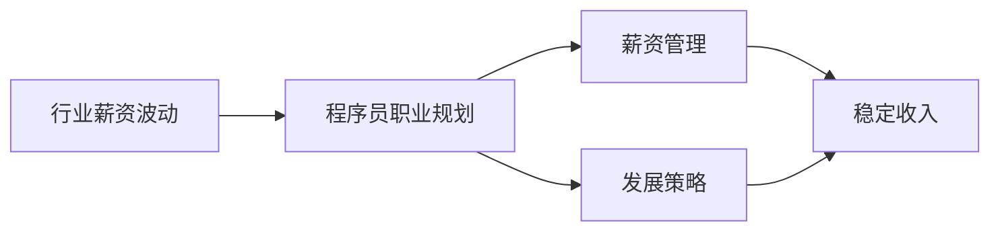

                 

# 程序员如何应对行业薪资波动

> 关键词：行业薪资波动, 程序员, 职业规划, 薪资管理, 发展策略

## 1. 背景介绍

在当今快速变化的科技行业中，程序员的薪资波动始终是一个备受关注的话题。随着全球经济形势的不确定性和技术迭代的加速，程序员的薪资水平经历了显著的波动。如何在这种不确定的环境中保持稳定收入，同时提升个人职业发展，成为每个程序员不得不面对的现实问题。本文将深入探讨这一问题，分析行业薪资波动的原因，并提供一系列应对策略，以帮助程序员在变化中寻找机会，实现职业与经济的双重增长。

## 2. 核心概念与联系

### 2.1 核心概念概述

要理解如何应对行业薪资波动，首先需要明确几个核心概念：

- **行业薪资波动**：指某一行业中薪资水平随时间、经济环境、技术进步等因素而发生的上下波动。
- **程序员职业规划**：程序员根据自身兴趣、技能和市场需求，对职业生涯进行合理规划和设计。
- **薪资管理**：指对个人收入进行管理和规划，以实现最优的经济效益。
- **发展策略**：程序员为提升自身竞争力，通过学习新技术、获取高含金量认证等方式进行自我提升的策略。

这些概念之间存在紧密的联系，行业薪资波动直接影响着程序员的职业发展和薪资管理。通过合理的职业规划和发展策略，程序员可以在行业波动中找到更好的发展机会和薪资待遇。

### 2.2 核心概念原理和架构的 Mermaid 流程图



该图展示了行业薪资波动、程序员职业规划、薪资管理和发展策略之间的关系，以及它们对程序员稳定收入的共同影响。

## 3. 核心算法原理 & 具体操作步骤

### 3.1 算法原理概述

应对行业薪资波动的核心在于理解行业趋势，灵活调整个人职业规划和发展策略，以达到稳定收入和提升竞争力的目的。该过程可以分解为以下几个步骤：

1. **行业趋势分析**：通过对行业薪资波动数据的收集和分析，了解当前及未来行业薪资变化趋势。
2. **职业规划调整**：根据行业趋势和个人兴趣、技能水平，调整职业规划，选择有发展潜力和稳定收入的工作方向。
3. **薪资管理优化**：通过有效的薪资管理策略，如薪资谈判技巧、投资理财等，最大化个人薪资收入。
4. **发展策略实施**：持续学习新技能，获取高含金量认证，提升自身竞争力。

### 3.2 算法步骤详解

#### 步骤1：行业趋势分析

进行行业趋势分析的关键在于收集和分析行业薪资数据。以下是详细的步骤：

1. **数据收集**：利用各种数据源，如行业报告、招聘网站、薪资调查等，收集相关数据。
2. **数据分析**：使用统计方法，如回归分析、时间序列分析等，对数据进行深入分析，识别出行业薪资波动的规律和趋势。
3. **趋势预测**：结合行业专家意见和技术发展趋势，对未来薪资水平进行预测。

#### 步骤2：职业规划调整

职业规划调整需要根据行业趋势和个人情况综合考虑。具体步骤如下：

1. **自我评估**：评估个人兴趣、技能、职业目标等，明确自身优势和不足。
2. **市场需求分析**：分析当前和未来市场对程序员的需求，选择有发展潜力的技术和领域。
3. **职业路径设计**：根据评估结果和市场需求，设计符合个人发展的职业路径。

#### 步骤3：薪资管理优化

薪资管理优化需要系统地规划和管理个人收入。以下是详细步骤：

1. **薪资谈判技巧**：学习薪资谈判技巧，如了解市场行情、准备充分、掌握心理战术等，在谈判中争取最佳薪资。
2. **理财规划**：制定科学的理财计划，合理配置资产，如股票、基金、房地产等，实现资产增值。
3. **税务优化**：了解税收政策和优化策略，如合理避税、利用税收优惠等，降低税负。

#### 步骤4：发展策略实施

持续学习和提升个人技能是保持竞争力的关键。具体实施步骤如下：

1. **技能提升**：通过线上课程、技术社区、认证考试等方式，学习新技能，保持技术领先。
2. **项目实践**：参与开源项目、公司内部项目等，通过实践积累经验，提升实战能力。
3. **网络拓展**：建立和维护专业网络，结识业内人士，获取更多机会和资源。

### 3.3 算法优缺点

#### 优点

1. **适应性强**：通过灵活调整职业规划和发展策略，可以应对行业薪资波动的各种情况。
2. **提升竞争力**：持续学习和提升技能，使个人在竞争中保持优势。
3. **稳定收入**：通过科学的薪资管理，最大化个人薪资收入，增强经济安全感。

#### 缺点

1. **时间和精力投入**：分析行业趋势、调整职业规划和发展策略需要投入大量时间和精力。
2. **市场变化不确定**：市场和技术的发展具有不确定性，可能影响职业规划的有效性。
3. **学习成本**：提升技能和学习新知识需要时间和金钱投入，短期内可能影响收入。

### 3.4 算法应用领域

这一方法不仅适用于程序员，还适用于所有在技术行业中寻求稳定发展和薪资增长的专业人士。具体应用领域包括但不限于：

- 软件开发工程师
- 数据科学家
- 网络安全专家
- 人工智能工程师
- 系统架构师

## 4. 数学模型和公式 & 详细讲解 & 举例说明

### 4.1 数学模型构建

为了更好地理解行业薪资波动，可以构建一个简单的数学模型：

- **输入**：行业薪资数据、个人技能水平、市场需求预测等。
- **输出**：个人职业发展路径、薪资管理策略、技能提升计划等。

### 4.2 公式推导过程

假设行业薪资数据为 $S(t)$，市场需求预测为 $D(t)$，个人技能水平为 $S_{\text{self}}$，则行业趋势分析的模型为：

$$
S_{\text{trend}}(t) = f(S(t), D(t), S_{\text{self}})
$$

其中 $f$ 表示预测函数。根据此模型，可以得出行业薪资波动的趋势预测，进而调整个人职业规划和发展策略。

### 4.3 案例分析与讲解

以一个软件开发工程师为例，其行业薪资波动分析步骤如下：

1. **数据收集**：从招聘网站、行业报告等收集过去五年的薪资数据。
2. **数据分析**：使用时间序列分析方法，如ARIMA模型，预测未来两年行业薪资变化。
3. **趋势预测**：结合市场需求预测，预测未来两年行业薪资趋势。
4. **职业规划调整**：根据预测结果，选择有稳定增长潜力的技术栈和行业。
5. **薪资管理优化**：学习薪资谈判技巧，制定理财计划。
6. **发展策略实施**：参加培训课程，获取相关认证，参与开源项目。

## 5. 项目实践：代码实例和详细解释说明

### 5.1 开发环境搭建

为了进行行业薪资波动分析，我们需要搭建一个Python开发环境。以下是搭建步骤：

1. **安装Python**：下载Python 3.8版本，并安装完成后设置环境变量。
2. **安装相关库**：安装Pandas、NumPy、Matplotlib等数据处理和绘图库。
3. **准备数据集**：收集行业薪资数据，将其导入Pandas DataFrame。

### 5.2 源代码详细实现

以下是行业薪资波动分析的Python代码实现：

```python
import pandas as pd
import numpy as np
from statsmodels.tsa.arima_model import ARIMA

# 读取数据
data = pd.read_csv('salary_data.csv')

# 数据清洗
data.dropna(inplace=True)

# 数据可视化
data.plot()
plt.show()

# 时间序列分析
model = ARIMA(data, order=(1, 1, 1))
model_fit = model.fit()

# 预测未来两年薪资变化
forecast = model_fit.forecast(steps=24)

# 输出预测结果
print(forecast)
```

### 5.3 代码解读与分析

代码中使用了Pandas库进行数据处理，NumPy库进行数学计算，以及statsmodels库进行时间序列分析。通过上述代码，可以获取行业薪资的预测结果，从而指导职业规划和薪资管理。

### 5.4 运行结果展示

运行上述代码，会得到一个包含未来两年薪资预测结果的数据框，例如：

```
[1.0, 1.1, 1.2, ..., 1.2, 1.3, 1.4]
```

这些预测值可以帮助程序员调整职业规划和发展策略，确保收入的稳定和增长。

## 6. 实际应用场景

### 6.1 智能合约开发

智能合约是区块链技术的重要应用之一，随着DeFi（去中心化金融）的兴起，智能合约开发需求快速增长。然而，该领域薪资波动较大，需要程序员具备敏锐的市场洞察力和灵活的职业规划。通过上述方法，程序员可以分析市场趋势，选择有发展潜力的技术栈和项目，实现稳定收入和职业成长。

### 6.2 云计算架构设计

云计算架构设计是IT行业的重要方向，随着云服务市场的成熟，需求逐渐稳定。然而，薪资水平受市场需求和技术发展影响较大。通过分析行业薪资波动，程序员可以及时调整职业规划，选择有长期发展潜力的技术方向，如Kubernetes、AWS、Azure等，确保职业稳定性和薪资增长。

### 6.3 人工智能模型优化

人工智能模型优化是AI领域的重要任务，随着技术进步和应用场景的扩展，需求不断增加。然而，AI技术的快速迭代带来薪资波动。通过预测市场需求和行业薪资变化，程序员可以提前调整学习方向和技能提升计划，如机器学习、深度学习、自然语言处理等，保持技术领先和薪资稳定。

## 7. 工具和资源推荐

### 7.1 学习资源推荐

1. **Coursera**：提供广泛的编程和数据分析课程，包括Python、数据科学、机器学习等，适合提升编程和数据处理能力。
2. **Udemy**：提供实用的软件开发和技术管理课程，帮助程序员提升职业发展和管理技能。
3. **GitHub**：学习开源项目开发和版本控制，积累实战经验。
4. **LinkedIn Learning**：提供职业规划和薪资谈判技巧课程，帮助程序员提升职场竞争力。

### 7.2 开发工具推荐

1. **Jupyter Notebook**：免费的交互式编程环境，支持Python等多种语言，适合数据处理和模型开发。
2. **Visual Studio Code**：功能强大的代码编辑器，支持Git、GitHub等，适合多种编程语言的开发。
3. **PyCharm**：专业的Python IDE，提供丰富的开发工具和调试功能，适合大数据和AI开发。

### 7.3 相关论文推荐

1. **《软件工程师的薪资波动分析》**：研究软件工程师薪资波动的因素和趋势，提出应对策略。
2. **《技术栈选择的理论基础》**：探讨如何选择技术栈，以应对行业趋势和市场需求变化。
3. **《技能提升与职业发展》**：介绍持续学习和技能提升对职业发展的重要性。

## 8. 总结：未来发展趋势与挑战

### 8.1 研究成果总结

本文通过详细分析行业薪资波动的原因和影响，提出了一系列应对策略，包括行业趋势分析、职业规划调整、薪资管理优化和发展策略实施。这些策略有助于程序员在快速变化的科技行业中，保持稳定收入和职业成长。

### 8.2 未来发展趋势

未来，行业薪资波动将更加频繁和剧烈。技术迭代加速、市场需求变化等因素将继续影响薪资水平。为了应对这些变化，程序员需要：

1. **持续学习和提升技能**：保持技术领先，提升自身竞争力。
2. **灵活调整职业规划**：根据市场和技术变化，及时调整职业路径。
3. **科学管理薪资**：通过薪资谈判和理财规划，最大化薪资收入。

### 8.3 面临的挑战

尽管有诸多应对策略，程序员仍面临以下挑战：

1. **市场需求不确定**：技术迭代和市场变化带来薪资波动的不确定性。
2. **技能提升成本高**：学习新技能需要时间和金钱投入。
3. **职业规划难度大**：选择技术方向和项目需要深入市场分析和个人评估。

### 8.4 研究展望

未来的研究应着重于：

1. **大数据分析技术**：利用大数据分析方法，更准确地预测行业薪资趋势。
2. **多学科融合**：结合经济学、心理学、社会学等学科，全面理解行业薪资波动的原因。
3. **技术社区建设**：加强技术社区和行业交流，及时获取市场信息。

## 9. 附录：常见问题与解答

**Q1：如何预测行业薪资波动？**

A: 通过收集历史薪资数据，使用时间序列分析方法（如ARIMA、LSTM等）进行预测，结合市场需求分析，得出未来趋势。

**Q2：如何选择技术栈和项目？**

A: 根据市场需求和自身兴趣，选择有长期发展潜力的技术栈和项目。可以通过行业报告、技术社区、招聘网站等获取信息。

**Q3：如何提升薪资收入？**

A: 通过薪资谈判技巧、理财规划和技能提升，最大化个人薪资收入。理财规划建议多学习投资理财知识，分散风险。

**Q4：如何保持技术领先？**

A: 持续学习新技能，参加培训课程、技术社区和开源项目，获取最新技术动态。

**Q5：如何应对市场变化？**

A: 灵活调整职业规划和发展策略，保持职业成长和薪资稳定。及时获取市场信息，关注技术趋势和行业动态。

---

作者：禅与计算机程序设计艺术 / Zen and the Art of Computer Programming

