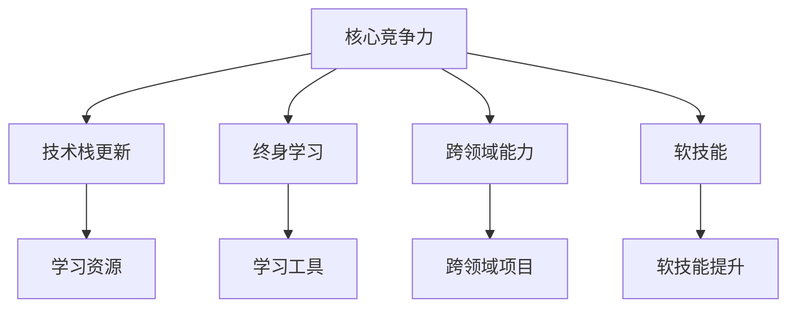

                 

# 程序员如何建立长期的职业竞争力

## 1. 背景介绍

在日新月异的科技行业中，技术的更新迭代速度之快，使得程序员面临着前所未有的挑战。如何保持自身的竞争力，不断学习新的技能和知识，是每一位程序员都必须思考的问题。本文将深入探讨程序员如何通过不断的学习和实践，建立长期的职业竞争力。

## 2. 核心概念与联系

### 2.1 核心概念概述

- **核心竞争力**：指个人或组织在特定领域拥有的超越竞争对手的独特能力和优势。对程序员而言，意味着能够掌握前沿技术，快速适应新的编程语言和框架，并具备解决复杂问题的能力。

- **长期职业发展**：指在职业生涯中持续提升技能和经验，保持行业领先地位的过程。

- **终身学习**：持续获取新知识和技能，不断提升自己的专业能力。

- **技术栈更新**：掌握最新的编程语言、框架和技术，确保技能与行业趋势保持同步。

- **跨领域能力**：在多个技术领域具备基础知识和应用能力，能够解决跨领域问题。

- **软技能**：如沟通能力、团队合作、项目管理、用户体验等，对技术开发者同样重要。

这些概念之间存在紧密的联系。掌握最新的技术栈，不断学习和应用新技术，持续提升软技能，可以帮助程序员在竞争激烈的行业中保持优势，实现长期的职业发展。

### 2.2 核心概念原理和架构的 Mermaid 流程图



## 3. 核心算法原理 & 具体操作步骤

### 3.1 算法原理概述

建立长期职业竞争力并非一蹴而就，而是一个持续学习和实践的过程。本文将从以下几个方面探讨核心算法和具体操作步骤：

- **技术栈跟踪算法**：识别并掌握行业最新的编程语言和框架。
- **终身学习算法**：持续获取新知识和技能。
- **软技能提升算法**：通过实战项目提升沟通、团队合作等能力。

### 3.2 算法步骤详解

#### 3.2.1 技术栈跟踪算法

1. **关注行业动态**：订阅技术博客、参加行业会议、参与技术讨论组，了解最新技术趋势。
2. **设置技术学习路径**：根据行业需求和自身兴趣，制定学习计划。
3. **实施学习计划**：通过在线课程、书籍、项目实践等方式学习新技能。
4. **定期评估**：定期回顾学习内容，评估学习效果，调整学习策略。

#### 3.2.2 终身学习算法

1. **制定学习计划**：规划每天/每周的学习时间，设置学习目标。
2. **多样化学习方式**：结合在线课程、书籍、实践项目、动手实验等多样化的学习方式。
3. **记录学习笔记**：通过写博客、做笔记、参与讨论等方式记录学习心得和问题。
4. **建立反馈机制**：与导师、同事、社区交流，获取反馈和建议。

#### 3.2.3 软技能提升算法

1. **参与团队项目**：通过团队合作提升沟通、协作能力。
2. **领导力培养**：参与项目管理，学习领导和团队管理技巧。
3. **用户体验设计**：学习用户界面设计、用户体验研究等技能，提升产品感。
4. **心理素质训练**：参加心理辅导、压力管理课程，提升抗压能力。

### 3.3 算法优缺点

#### 3.3.1 技术栈跟踪算法

**优点**：
- 保持技术栈新鲜，能够快速适应新的技术变化。
- 提升自身竞争力，有助于职业发展。

**缺点**：
- 学习量大，需要持续投入时间和精力。
- 新技能可能存在技术壁垒，需要更多实践才能掌握。

#### 3.3.2 终身学习算法

**优点**：
- 持续获取新知识，保持专业能力。
- 能够适应行业变化，提升个人竞争力。

**缺点**：
- 学习过程可能枯燥，需要持续的动机和意志力。
- 信息过载，需要有效筛选学习资源。

#### 3.3.3 软技能提升算法

**优点**：
- 提升综合素质，增强职业发展潜力。
- 提升团队协作和项目管理能力，有助于个人成长。

**缺点**：
- 软技能提升需要时间和实践，过程较为缓慢。
- 个人提升与团队氛围和环境有关，难以独立完成。

### 3.4 算法应用领域

技术栈跟踪算法适用于所有技术岗位，能够帮助程序员快速适应新技术。终身学习算法适用于所有技术岗位，帮助程序员持续提升专业技能。软技能提升算法适用于所有技术岗位，帮助程序员在团队中更好地发挥作用。

## 4. 数学模型和公式 & 详细讲解 & 举例说明

### 4.1 数学模型构建

本节将使用数学语言对建立长期职业竞争力的过程进行更严格的刻画。

假设程序员每天投入 $t$ 小时学习新技术，学习周期为 $n$ 天，每天获取的新知识量为 $k$，则 $n$ 天后掌握的新技能量为 $S = nt$。

设掌握新技能所需的练习次数为 $p$，则学习过程中掌握新技能的比例为：

$$
\frac{S}{p} = \frac{nt}{p}
$$

### 4.2 公式推导过程

假设每天学习的效果为 $E$，则总学习效果 $E_t = tE$。如果每天学习效果是线性的，则：

$$
E_t = t \cdot k
$$

将 $E_t$ 代入 $S$ 的公式中，得：

$$
\frac{S}{p} = \frac{ntk}{p}
$$

### 4.3 案例分析与讲解

假设某程序员每天投入 2 小时学习新技能，每小时掌握的知识量为 $k=1$，需要 $p=100$ 次练习才能掌握一项新技能。则：

$$
\frac{S}{p} = \frac{2n}{100}
$$

如果该程序员连续学习 30 天，则：

$$
\frac{S}{p} = \frac{2 \times 30}{100} = \frac{60}{100} = 0.6
$$

这表示该程序员在这 30 天里掌握了 60% 的新技能。

## 5. 项目实践：代码实例和详细解释说明

### 5.1 开发环境搭建

- **安装编程环境**：使用 Visual Studio Code、PyCharm、Atom 等集成开发环境 (IDE)。
- **配置版本控制**：使用 Git，并配置 GitHub、GitLab 等版本控制平台。
- **安装开发工具**：安装 Node.js、Python、Docker、Kubernetes 等开发工具。

### 5.2 源代码详细实现

以下是一个基本的编程练习项目：实现一个简单的计算器。

```python
# calculator.py

def add(a, b):
    return a + b

def subtract(a, b):
    return a - b

def multiply(a, b):
    return a * b

def divide(a, b):
    return a / b

print("Please select operation.")
print("1. Add")
print("2. Subtract")
print("3. Multiply")
print("4. Divide")

while True:
    try:
        choice = int(input("Enter choice (1/2/3/4): "))
        if choice == 1:
            num1 = float(input("Enter first number: "))
            num2 = float(input("Enter second number: "))
            print(num1, "+", num2, "=", add(num1, num2))
        elif choice == 2:
            num1 = float(input("Enter first number: "))
            num2 = float(input("Enter second number: "))
            print(num1, "-", num2, "=", subtract(num1, num2))
        elif choice == 3:
            num1 = float(input("Enter first number: "))
            num2 = float(input("Enter second number: "))
            print(num1, "*", num2, "=", multiply(num1, num2))
        elif choice == 4:
            num1 = float(input("Enter first number: "))
            num2 = float(input("Enter second number: "))
            print(num1, "/", num2, "=", divide(num1, num2))
        else:
            print("Invalid Input")
    except ValueError:
        print("Please enter numeric values.")
```

### 5.3 代码解读与分析

**添加和减法函数**：
```python
def add(a, b):
    return a + b

def subtract(a, b):
    return a - b
```

**乘法和除法函数**：
```python
def multiply(a, b):
    return a * b

def divide(a, b):
    return a / b
```

**主程序**：
```python
print("Please select operation.")
print("1. Add")
print("2. Subtract")
print("3. Multiply")
print("4. Divide")

while True:
    try:
        choice = int(input("Enter choice (1/2/3/4): "))
        if choice == 1:
            num1 = float(input("Enter first number: "))
            num2 = float(input("Enter second number: "))
            print(num1, "+", num2, "=", add(num1, num2))
        elif choice == 2:
            num1 = float(input("Enter first number: "))
            num2 = float(input("Enter second number: "))
            print(num1, "-", num2, "=", subtract(num1, num2))
        elif choice == 3:
            num1 = float(input("Enter first number: "))
            num2 = float(input("Enter second number: "))
            print(num1, "*", num2, "=", multiply(num1, num2))
        elif choice == 4:
            num1 = float(input("Enter first number: "))
            num2 = float(input("Enter second number: "))
            print(num1, "/", num2, "=", divide(num1, num2))
        else:
            print("Invalid Input")
    except ValueError:
        print("Please enter numeric values.")
```

### 5.4 运行结果展示

通过上述练习，程序员能够熟悉 Python 编程语言的基本语法，提升代码编写的准确性和效率。此外，通过实际项目的实践，程序员能够巩固知识，加深理解。

## 6. 实际应用场景

### 6.1 公司项目

在项目开发中，程序员需要掌握多种编程语言和框架，如 Java、C#、React、Angular 等。通过不断学习和实践，程序员能够快速上手新项目，提升工作效率。

### 6.2 个人项目

通过开展个人项目，程序员可以不断探索新的技术领域，如人工智能、区块链、物联网等，拓宽自己的技术视野。

### 6.3 开源项目

参与开源项目是程序员建立职业竞争力的重要途径。通过贡献代码和解决问题，程序员能够结识更多的技术社区成员，提升自身影响力。

### 6.4 未来应用展望

未来，随着新技术和新兴领域的不断涌现，程序员需要不断学习和实践，保持对新技术的好奇心和探索精神。

## 7. 工具和资源推荐

### 7.1 学习资源推荐

1. **Coursera、edX、Udacity**：提供高质量在线课程，涵盖编程语言、数据科学、人工智能等多个领域。
2. **Stack Overflow**：全球最大的程序员问答社区，可以获取代码示例和最佳实践。
3. **GitHub**：全球最大的开源代码托管平台，可以学习优秀的开源项目和代码贡献技巧。
4. **Kaggle**：数据科学竞赛平台，可以通过实战提升数据分析和机器学习技能。
5. **LeetCode、HackerRank、Codeforces**：编程竞赛平台，提升编程能力和算法思维。

### 7.2 开发工具推荐

1. **Visual Studio Code**：跨平台的代码编辑器，支持丰富的插件和扩展。
2. **PyCharm**：Python IDE，提供智能代码补全、调试、测试等功能。
3. **IntelliJ IDEA**：Java IDE，提供丰富的Java开发工具和插件。
4. **Docker**：容器化平台，可以方便地部署和管理应用。
5. **Kubernetes**：容器编排平台，可以自动化管理分布式系统。

### 7.3 相关论文推荐

1. **《程序员学习曲线分析》**：通过数据分析，探索程序员技能学习的过程和效果。
2. **《软件工程师职业发展模型》**：研究软件工程师的职业发展路径和策略。
3. **《终身学习与职业成长的关系》**：分析终身学习对职业成长的影响。
4. **《跨领域技能提升对职业生涯的影响》**：研究跨领域技能提升与职业竞争力之间的关系。

## 8. 总结：未来发展趋势与挑战

### 8.1 研究成果总结

本文深入探讨了程序员如何通过技术栈跟踪、终身学习和软技能提升，建立长期的职业竞争力。通过不断的学习和实践，程序员可以保持对新技术的好奇心和探索精神，提升自身技能和经验，实现职业发展。

### 8.2 未来发展趋势

1. **技术栈更新加速**：随着新技术的不断涌现，技术栈更新的速度将越来越快。
2. **终身学习常态化**：持续学习将成为职业发展的重要手段。
3. **跨领域能力需求增加**：多领域知识整合能力的重要性将逐渐增加。
4. **软技能应用广泛**：团队合作、项目管理等软技能将在职业生涯中发挥越来越重要的作用。

### 8.3 面临的挑战

1. **学习成本高**：新技术和跨领域能力的学习需要投入大量时间和精力。
2. **知识更新快**：需要快速掌握和更新新知识，避免落后于行业趋势。
3. **心理压力大**：持续学习和竞争压力可能导致心理压力增大。
4. **资源获取难**：高质量的学习资源和工具获取可能存在困难。

### 8.4 研究展望

1. **个性化学习路径**：探索基于人工智能的个性化学习路径推荐系统，帮助程序员更高效地学习。
2. **技能评估模型**：建立技能评估模型，量化评估程序员技能水平，指导职业发展。
3. **跨领域能力整合**：研究跨领域能力整合方法，提升团队协作和项目管理的效率。
4. **心理压力管理**：研究心理压力管理方法，帮助程序员保持健康的心理状态。

## 9. 附录：常见问题与解答

**Q1：如何保持持续学习的动力？**

A: 设定短期和长期目标，定期评估学习成果。同时，参与社区讨论和实践项目，可以增强学习的乐趣和成就感。

**Q2：如何选择学习资源？**

A: 根据自身兴趣和职业发展需求，选择质量高、应用广泛的资源。多关注业界大牛和团队的学习经验分享。

**Q3：如何平衡工作和学习？**

A: 制定合理的学习计划，利用碎片时间学习。避免过度加班，保持健康的生活和工作节奏。

**Q4：如何提升跨领域能力？**

A: 多参与跨领域项目，与不同领域的专家合作，学习新领域的知识。持续学习并实践跨领域技术。

**Q5：如何应对学习中的心理压力？**

A: 设定可实现的小目标，逐步积累成就感。通过运动、休息等方式调节情绪，保持积极心态。

---

作者：禅与计算机程序设计艺术 / Zen and the Art of Computer Programming

