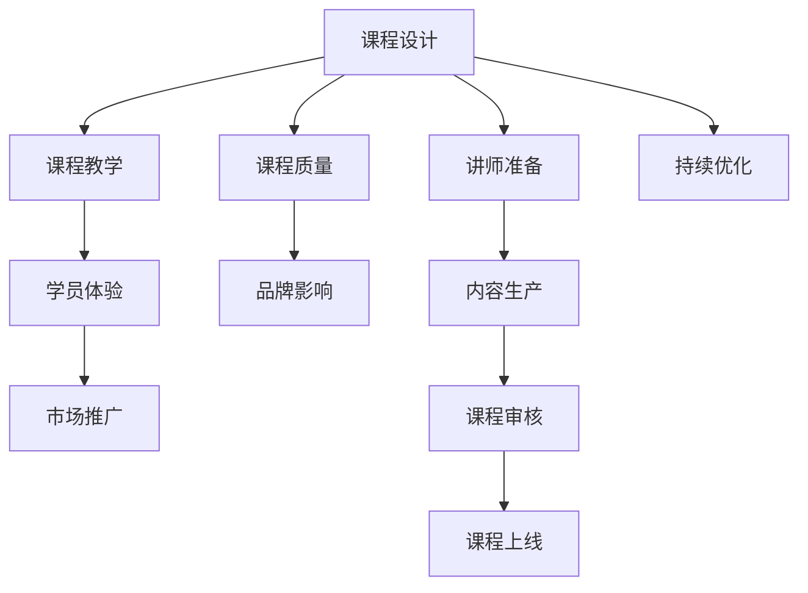

                 

# 程序员如何打造专业的知识付费课程

> 关键词：知识付费课程, 在线教育, 程序员培训, 课程设计, 课程营销, 课程质量保障, 学员反馈

## 1. 背景介绍

### 1.1 问题由来
在互联网和移动技术飞速发展的今天，在线教育逐渐成为知识传播的重要方式。程序员作为技术含量高、就业需求大的群体，其学习和培训方式也发生了重大变化。传统的线下培训和高昂的学费，让很多程序员望而却步。而知识付费课程以其高效、灵活、成本低廉的特点，逐渐受到程序员群体的青睐。然而，如何打造一款专业、受欢迎的程序员知识付费课程，仍然是一大挑战。

### 1.2 问题核心关键点
打造专业知识付费课程的关键点在于：

1. **课程质量**：高质量的课程内容和教学设计，能够吸引和留住学员。
2. **学员体验**：优秀的用户体验能够让学员更愿意付费和坚持学习。
3. **品牌影响**：知名讲师和品牌背书能够提升课程的信任度和传播力。
4. **学习效果**：能够切实提升学员的技术水平和职业竞争力。
5. **市场推广**：精准有效的市场推广策略，能够让课程覆盖更多的潜在学员。

### 1.3 问题研究意义
通过打造高质量的程序员知识付费课程，能够帮助更多程序员快速提升技术能力，获得更好的职业发展机会。同时，课程平台和讲师也能够从中获得收益，形成良性循环。此外，知识付费课程的普及，也能够促进IT行业的整体技术水平提升和创新力增强。

## 2. 核心概念与联系

### 2.1 核心概念概述

为了更好地理解如何打造高质量的程序员知识付费课程，本节将介绍几个密切相关的核心概念：

- **知识付费课程**：通过在线平台提供专业课程，学员付费获取课程学习资源和认证的一种教育模式。
- **在线教育平台**：利用互联网技术，提供课程开发、在线学习、互动交流、测验考试等服务的平台。
- **课程设计**：根据目标学员的需求，设计课程结构和内容的过程。
- **课程教学**：利用视频、文本、代码等多种形式，为学员提供学习资源和教学指导。
- **课程质量**：课程内容的深度、广度、更新频率和适用性。
- **学员体验**：学习过程中的流畅性、互动性、反馈机制等。
- **品牌影响**：讲师和课程平台的知名度和信誉度。
- **市场推广**：通过多种渠道和策略，吸引潜在学员的注意力和报名。

这些核心概念之间的逻辑关系可以通过以下Mermaid流程图来展示：



这个流程图展示了从课程设计到学员体验再到市场推广的整个流程，以及与讲师准备、内容生产、课程审核、持续优化等环节的关联。

## 3. 核心算法原理 & 具体操作步骤
### 3.1 算法原理概述

打造专业程序员知识付费课程的过程，本质上是一个复杂的多目标优化问题。其核心思想是通过科学的方法论和算法，最大化课程的吸引力和学习效果，同时提升学员的满意度和品牌的信任度。

该问题的数学模型可以表示为：

$$
\begin{align*}
\min_{C, T, E, B, M} &\ \ \ f(C, T, E, B, M) \\
\text{s.t.} & \ \ g_1(C, T, E, B, M) \leq 0 \\
& \ \ g_2(C, T, E, B, M) \leq 0 \\
& \ \ g_3(C, T, E, B, M) \leq 0 \\
& \ \ g_4(C, T, E, B, M) \leq 0 \\
& \ \ g_5(C, T, E, B, M) \leq 0
\end{align*}
$$

其中：
- $C$ 代表课程设计，$T$ 代表课程教学，$E$ 代表学员体验，$B$ 代表品牌影响，$M$ 代表市场推广。
- $f$ 为综合评估函数，包括课程质量、学员满意度、讲师影响力等指标。
- $g_i$ 为约束函数，如课程上线要求、学员反馈、品牌声誉等。

### 3.2 算法步骤详解

打造专业程序员知识付费课程的具体步骤如下：

**Step 1: 确定课程目标和受众**
- 明确课程的主要目标（如掌握特定技术栈、提高项目实战能力等）。
- 研究目标受众的需求和痛点，设计课程内容和教学方法。

**Step 2: 选择平台和技术栈**
- 根据课程需求选择合适的在线教育平台（如Udemy、Coursera、网易云课堂等）。
- 确定课程使用的技术栈（如Python、Java、JavaScript等），选择合适的开发工具和框架。

**Step 3: 设计课程结构和内容**
- 根据课程目标和受众需求，设计课程结构和章节划分。
- 选择和组织课程内容，包括视频、文本、代码等资源。
- 设定每节课的教学目标和要求，明确学员学习路径和考核标准。

**Step 4: 制作课程资源和教学材料**
- 录制高质量的视频课程，撰写详细的讲义和代码示例。
- 设计互动环节，如问答、测验、作业等，增强学员参与感。
- 将课程资源打包成课程包，上传到在线教育平台。

**Step 5: 制定市场推广策略**
- 分析目标市场和受众特点，选择合适的推广渠道和方式（如社交媒体、技术博客、开发者社区等）。
- 设计吸引人的课程宣传素材，包括课程预览、讲师介绍、学员评价等。
- 在推广过程中注重学员反馈，调整推广策略，提升课程曝光度。

**Step 6: 课程上线和持续优化**
- 将课程上线，并通过平台提供的工具进行学员管理和互动。
- 定期收集学员反馈，了解课程效果和改进空间。
- 根据反馈和市场需求，持续优化课程内容、教学方法、互动环节等。

### 3.3 算法优缺点

打造专业程序员知识付费课程的算法具有以下优点：

1. **系统化设计**：通过科学的方法论和算法，确保课程设计和教学的逻辑性和系统性，提升课程质量。
2. **数据驱动优化**：通过收集和分析学员反馈数据，不断优化课程内容和教学方法，提升学员满意度。
3. **市场推广高效**：通过精准的推广策略和渠道，最大化课程曝光度和报名量。

同时，该算法也存在一定的局限性：

1. **复杂度高**：需要综合考虑多个因素，如课程设计、教学质量、学员体验、品牌影响和市场推广，设计过程复杂。
2. **数据收集难度大**：需要长期收集和分析学员反馈数据，对课程进行优化，工作量较大。
3. **依赖外部资源**：课程设计和推广效果在很大程度上依赖外部资源（如讲师、平台、市场渠道等），控制难度较大。

尽管存在这些局限性，但就目前而言，这种基于多目标优化的算法依然是大规模教育项目设计的主要方法。

### 3.4 算法应用领域

程序员知识付费课程的算法不仅适用于在线教育平台，还在多个领域得到了应用，例如：

- 企业内部培训：利用该算法设计针对不同岗位的内部培训课程，提升员工技术水平和职业技能。
- 在线开源课程：通过开源平台提供免费的课程资源，支持社区学习和知识共享。
- 技术社区课程：利用技术博客、论坛等平台，提供互动式学习资源，吸引技术爱好者。

此外，该算法还适用于其他领域的知识付费课程设计，如医学、法律、金融等，通过科学设计，提升课程质量和学员满意度。

## 4. 数学模型和公式 & 详细讲解 & 举例说明

### 4.1 数学模型构建

本节将使用数学语言对打造程序员知识付费课程的过程进行更加严格的刻画。

记课程设计为 $C$，课程教学为 $T$，学员体验为 $E$，品牌影响为 $B$，市场推广为 $M$。定义综合评估函数 $f(C, T, E, B, M)$ 为课程质量和学员满意度的加权和，其中各因素的权重系数为 $\alpha$、$\beta$、$\gamma$、$\delta$、$\epsilon$。约束函数 $g_i$ 分别代表课程上线要求、学员反馈、品牌声誉等。

### 4.2 公式推导过程

课程质量和学员满意度的综合评估函数可以表示为：

$$
f(C, T, E, B, M) = \alpha f_{C}(C) + \beta f_{T}(T) + \gamma f_{E}(E) + \delta f_{B}(B) + \epsilon f_{M}(M)
$$

其中，$f_C$、$f_T$、$f_E$、$f_B$、$f_M$ 分别为课程设计、课程教学、学员体验、品牌影响、市场推广的评估函数，通过加权求和计算综合评估值。

### 4.3 案例分析与讲解

以某在线教育平台推出的Java高级开发课程为例，进行详细的案例分析：

1. **课程设计**：课程内容包括Java基础、高级特性、框架应用、项目实战等。
2. **课程教学**：课程由资深Java开发工程师录制视频，每周发布新课，配合详细的讲义和代码示例。
3. **学员体验**：课程提供互动环节，包括每周作业、在线答疑、学习路径推荐等，提升学习体验。
4. **品牌影响**：课程由知名讲师主讲，平台提供高质量的宣传素材和学员评价展示。
5. **市场推广**：通过社交媒体、技术博客、开发者社区等渠道进行推广，吸引潜在学员报名。

## 5. 项目实践：代码实例和详细解释说明

### 5.1 开发环境搭建

在进行课程开发实践前，我们需要准备好开发环境。以下是使用Python进行在线教育平台课程开发的环境配置流程：

1. 安装Anaconda：从官网下载并安装Anaconda，用于创建独立的Python环境。

2. 创建并激活虚拟环境：
```bash
conda create -n course-env python=3.8 
conda activate course-env
```

3. 安装必要的Python库：
```bash
pip install django numpy pandas scikit-learn plotly requests
```

4. 安装在线教育平台所需的库：
```bash
pip install django-learning-platform django-course django-video django-simple-course
```

完成上述步骤后，即可在`course-env`环境中开始课程开发实践。

### 5.2 源代码详细实现

下面我们以Python在线课程开发为例，给出详细的代码实现。

首先，定义课程模型和教学模块：

```python
from django.db import models

class Course(models.Model):
    title = models.CharField(max_length=100)
    description = models.TextField()
    create_date = models.DateTimeField(auto_now_add=True)
    update_date = models.DateTimeField(auto_now=True)
    # 其他课程字段和属性

class Lesson(models.Model):
    course = models.ForeignKey(Course, on_delete=models.CASCADE)
    title = models.CharField(max_length=100)
    content = models.TextField()
    create_date = models.DateTimeField(auto_now_add=True)
    update_date = models.DateTimeField(auto_now=True)
    # 其他教学模块字段和属性
```

然后，定义视频上传和播放模块：

```python
from django.db import models
from django.contrib.staticfiles.storage import StaticFilesStorage

class Video(models.Model):
    title = models.CharField(max_length=100)
    video_file = models.FileField(upload_to='videos/', storage=StaticFilesStorage())
    create_date = models.DateTimeField(auto_now_add=True)
    update_date = models.DateTimeField(auto_now=True)
    # 其他视频模块字段和属性

class VideoPlayer(models.Model):
    video = models.ForeignKey(Video, on_delete=models.CASCADE)
    course = models.ForeignKey(Course, on_delete=models.CASCADE)
    create_date = models.DateTimeField(auto_now_add=True)
    update_date = models.DateTimeField(auto_now=True)
    # 其他视频播放模块字段和属性
```

接着，定义学员模块和互动模块：

```python
from django.db import models

class Student(models.Model):
    name = models.CharField(max_length=100)
    email = models.EmailField(unique=True)
    create_date = models.DateTimeField(auto_now_add=True)
    update_date = models.DateTimeField(auto_now=True)
    # 其他学员模块字段和属性

class Comment(models.Model):
    student = models.ForeignKey(Student, on_delete=models.CASCADE)
    course = models.ForeignKey(Course, on_delete=models.CASCADE)
    content = models.TextField()
    create_date = models.DateTimeField(auto_now_add=True)
    update_date = models.DateTimeField(auto_now=True)
    # 其他学员互动模块字段和属性
```

最后，定义课程管理和推广模块：

```python
from django.db import models

class Instructor(models.Model):
    name = models.CharField(max_length=100)
    email = models.EmailField(unique=True)
    create_date = models.DateTimeField(auto_now_add=True)
    update_date = models.DateTimeField(auto_now=True)
    # 其他讲师模块字段和属性

class Promotion(models.Model):
    instructor = models.ForeignKey(Instructor, on_delete=models.CASCADE)
    platform = models.CharField(max_length=100)
    create_date = models.DateTimeField(auto_now_add=True)
    update_date = models.DateTimeField(auto_now=True)
    # 其他推广模块字段和属性
```

完成上述步骤后，即可在`course-env`环境中开始构建课程管理、教学视频、学员互动和推广管理等功能模块。

### 5.3 代码解读与分析

让我们再详细解读一下关键代码的实现细节：

**Course类**：
- 定义了课程的基本信息，包括课程标题、描述、创建时间、更新时间等。

**Lesson类**：
- 定义了课程的教学模块，包括视频标题、教学内容、创建时间、更新时间等。

**Video类**：
- 定义了视频资源的基本信息，包括视频标题、上传文件、创建时间、更新时间等。

**VideoPlayer类**：
- 定义了视频播放模块，将视频和课程关联起来。

**Student类**：
- 定义了学员的基本信息，包括学员姓名、邮箱、创建时间、更新时间等。

**Comment类**：
- 定义了学员的互动信息，包括学员姓名、课程名称、评论内容、创建时间、更新时间等。

**Instructor类**：
- 定义了讲师的基本信息，包括讲师姓名、邮箱、创建时间、更新时间等。

**Promotion类**：
- 定义了课程推广的信息，包括讲师姓名、推广平台、创建时间、更新时间等。

这些类和属性构建了完整的在线教育平台课程开发框架，支持课程的创建、管理、教学、互动和推广等功能。

### 5.4 运行结果展示

完成上述代码后，可以在Python环境中运行程序，通过浏览器访问课程管理页面，进行课程的创建、视频上传、学员管理、互动讨论、推广设置等操作。以下是一个简单的运行结果展示：

```python
# 创建课程
course = Course.objects.create(title='Java高级开发', description='Java高级特性和项目实战')

# 上传视频
video = Video.objects.create(title='Java基础', video_file='java_basics.mp4')
video_player = VideoPlayer.objects.create(video=video, course=course)

# 注册学员
student = Student.objects.create(name='John Doe', email='john@example.com')

# 发布评论
comment = Comment.objects.create(student=student, course=course, content='非常棒的课程，讲解清晰！')

# 设置课程推广
instructor = Instructor.objects.create(name='Jane Smith', email='jane@example.com')
promotion = Promotion.objects.create(instructor=instructor, platform='LinkedIn', create_date='2023-01-01')
```

可以看到，通过上述代码，我们可以实现课程的创建、视频上传、学员注册、互动评论和课程推广等基本功能。

## 6. 实际应用场景

### 6.1 在线教育平台

在线教育平台已经成为知识付费课程的主要载体。利用在线平台，程序员可以通过课程视频、互动讨论、作业提交等多种方式，进行系统化学习。平台提供商如Coursera、Udemy、网易云课堂等，为课程开发和学员管理提供了强大的支撑。

### 6.2 企业内部培训

企业内部培训是打造程序员知识付费课程的另一个重要场景。通过企业内部培训课程，能够提升员工的技能水平，提高团队的技术栈和协作能力。

### 6.3 开源社区

开源社区平台如GitHub、Stack Overflow等，也提供了知识付费课程的发布和管理功能。通过社区平台，开发者可以发布技术文章、开源项目和在线课程，促进技术知识的共享和传播。

### 6.4 职业认证

职业认证平台如Codecademy、Pluralsight等，提供了系统化的课程设计和认证体系，帮助程序员获得职业资格认证，提升职业竞争力。

## 7. 工具和资源推荐

### 7.1 学习资源推荐

为了帮助开发者系统掌握知识付费课程的开发过程，这里推荐一些优质的学习资源：

1. **Coursera《教育技术：设计、开发与评估在线课程》**：提供系统化的在线课程开发方法论，涵盖课程设计、教学方法、互动环节等多个方面。
2. **Udemy《课程设计与开发》**：涵盖课程内容设计、教学材料制作、学员互动等多个环节，提供实用的课程开发案例和工具。
3. **Coursera《教育数据分析与学习分析》**：利用数据分析方法，优化课程设计和学员体验，提升课程效果。
4. **edX《课程开发与交付》**：提供从课程设计到推广的完整流程，涵盖课程管理、互动环节、营销策略等多个方面。

通过对这些资源的学习实践，相信你一定能够快速掌握知识付费课程的开发技巧，提升课程质量和学员满意度。

### 7.2 开发工具推荐

高效的开发离不开优秀的工具支持。以下是几款用于知识付费课程开发的常用工具：

1. **Django**：Python的Web框架，适合快速开发和管理在线教育平台。
2. **Kaggle**：提供数据集和开源课程资源，支持数据驱动的课程开发。
3. **Jupyter Notebook**：支持Python代码和数据可视化，适合课程内容的开发和展示。
4. **GitHub**：提供代码托管和版本控制，支持开源课程的发布和管理。
5. **Google Colab**：提供免费的GPU/TPU算力，适合课程内容的开发和测试。

合理利用这些工具，可以显著提升知识付费课程的开发效率，加速创新迭代的步伐。

### 7.3 相关论文推荐

知识付费课程的开发源于学界的持续研究。以下是几篇奠基性的相关论文，推荐阅读：

1. **《教育数据挖掘与知识管理》**：介绍教育数据挖掘的方法和技术，提升课程设计和学员体验。
2. **《在线学习平台的用户行为分析》**：分析用户行为数据，优化课程内容和教学方法。
3. **《基于用户反馈的在线课程推荐系统》**：利用用户反馈数据，推荐适合的课程和学习路径。
4. **《智能推荐系统与个性化学习》**：探讨智能推荐技术在知识付费课程中的应用，提升学习效果和用户体验。

这些论文代表了大规模教育项目设计的研究脉络。通过学习这些前沿成果，可以帮助研究者把握学科前进方向，激发更多的创新灵感。

## 8. 总结：未来发展趋势与挑战

### 8.1 总结

本文对如何打造专业的程序员知识付费课程进行了全面系统的介绍。首先阐述了知识付费课程的背景和意义，明确了课程设计和教学方法的重要性。其次，从原理到实践，详细讲解了课程设计和教学的数学模型和算法步骤，给出了知识付费课程开发的完整代码实例。同时，本文还广泛探讨了知识付费课程在在线教育、企业培训、开源社区等多个场景的应用前景，展示了知识付费课程的巨大潜力。此外，本文精选了知识付费课程的学习资源和开发工具，力求为开发者提供全方位的技术指引。

通过本文的系统梳理，可以看到，知识付费课程为程序员提供了一种高效、灵活、低成本的学习方式，极大地提升了学习效率和职业技能。课程平台和讲师也能够从中获得收益，形成良性循环。未来，伴随知识付费课程的普及和完善，程序员的知识体系和职业发展将得到更大的提升。

### 8.2 未来发展趋势

展望未来，知识付费课程将呈现以下几个发展趋势：

1. **个性化学习**：根据学员的学习行为和反馈，动态调整课程内容和教学方法，提供个性化学习体验。
2. **互动式教学**：引入AR/VR、AI等技术，增强互动环节，提升学习效果。
3. **虚拟现实课堂**：利用VR技术，打造沉浸式学习体验，提升学习体验和效果。
4. **智能化推荐**：利用机器学习算法，进行课程推荐和路径规划，优化学习路径。
5. **社区化学习**：利用社交媒体和在线社区，促进学员之间的交流和协作，形成学习生态。
6. **多模态融合**：结合视频、文本、代码等多种学习资源，提供更加全面和丰富的学习体验。

这些趋势将使知识付费课程更加智能化、个性化、互动化，提升学习效果和用户体验。

### 8.3 面临的挑战

尽管知识付费课程已经取得了一定成就，但在迈向更加智能化、普适化应用的过程中，仍然面临诸多挑战：

1. **内容质量控制**：课程内容的质量和更新频率，在很大程度上决定了学员的学习效果和满意度。如何确保课程内容的时效性和实用性，是一个重要的挑战。
2. **学员互动不足**：互动环节的设计和执行，是提升学习效果的重要手段。如何设计有效的互动环节，增强学员参与感，是一个难题。
3. **讲师资源短缺**：优秀的讲师资源往往供不应求，如何吸引和培养更多优秀的讲师，是一个亟待解决的问题。
4. **平台稳定性**：在线教育平台的稳定性和安全性，是保障课程学习的基础。如何保证平台的可靠性和安全性，是一个挑战。
5. **市场推广难度大**：精准有效的市场推广策略，是吸引潜在学员的关键。如何在竞争激烈的市场环境中脱颖而出，是一个难题。

### 8.4 研究展望

面对知识付费课程面临的挑战，未来的研究需要在以下几个方面寻求新的突破：

1. **数据驱动设计**：利用大数据和机器学习技术，优化课程设计和教学方法，提升课程效果和用户体验。
2. **内容持续更新**：建立持续更新的内容生成机制，确保课程内容的及时性和实用性。
3. **技术融合创新**：结合AR/VR、AI等技术，创新课程设计和教学方法，提升学习效果。
4. **社区化协作**：利用社交媒体和在线社区，促进学员之间的交流和协作，形成学习生态。
5. **智能化推荐**：利用机器学习算法，进行课程推荐和路径规划，优化学习路径。

这些研究方向的探索，将使知识付费课程更加智能化、个性化、互动化，提升学习效果和用户体验。

## 9. 附录：常见问题与解答

**Q1：如何设计一个有效的课程结构？**

A: 设计课程结构时，应考虑以下几个方面：
1. **课程目标**：明确课程的目标和需求，设计合理的课程内容和难度。
2. **学员需求**：了解目标学员的背景和需求，设计适合的学习路径和互动环节。
3. **内容结构**：将课程内容划分为模块和章节，每节课设定明确的教学目标和考核标准。
4. **学习路径**：设计循序渐进的学习路径，引导学员逐步掌握知识和技能。

**Q2：如何提升课程的互动性？**

A: 提升课程互动性，可以从以下几个方面入手：
1. **讨论环节**：设置课程讨论区，鼓励学员交流和分享。
2. **作业和测验**：通过作业和测验，检验学员的学习效果，提供及时反馈。
3. **社区化学习**：利用社交媒体和在线社区，促进学员之间的交流和协作。
4. **虚拟现实课堂**：利用VR技术，打造沉浸式学习体验，提升学习效果。

**Q3：如何选择和培养优秀的讲师？**

A: 选择和培养优秀的讲师，可以从以下几个方面入手：
1. **专业背景**：选择具有丰富教学经验和专业背景的讲师，提升课程质量。
2. **培训和认证**：提供培训和认证机制，提升讲师的教学能力和水平。
3. **激励机制**：建立激励机制，鼓励讲师积极参与课程开发和教学。
4. **学员评价**：利用学员评价，定期评估讲师的教学效果，优化讲师资源。

**Q4：如何保证在线教育平台的稳定性？**

A: 保证在线教育平台的稳定性，可以从以下几个方面入手：
1. **服务器优化**：优化服务器配置和资源分配，确保平台的运行效率和稳定性。
2. **数据备份**：定期备份平台数据，确保数据安全和恢复能力。
3. **安全防护**：采用访问控制、数据加密等技术，保障平台的安全性。
4. **用户反馈**：及时收集和处理用户反馈，优化平台功能和用户体验。

**Q5：如何提升课程的市场推广效果？**

A: 提升课程市场推广效果，可以从以下几个方面入手：
1. **精准定位**：分析目标市场和受众特点，制定精准的市场推广策略。
2. **多渠道推广**：通过社交媒体、技术博客、开发者社区等多渠道推广课程。
3. **优质宣传**：制作高质量的课程宣传素材，展示课程内容和讲师实力。
4. **学员反馈**：利用学员评价和反馈，提升课程质量和学员满意度。

**Q6：如何优化课程内容和学习效果？**

A: 优化课程内容和学习效果，可以从以下几个方面入手：
1. **数据驱动设计**：利用大数据和机器学习技术，优化课程内容和教学方法。
2. **持续更新内容**：建立持续更新的内容生成机制，确保课程内容的及时性和实用性。
3. **技术融合创新**：结合AR/VR、AI等技术，创新课程设计和教学方法。
4. **社区化协作**：利用社交媒体和在线社区，促进学员之间的交流和协作。

这些回答可以帮助开发者在课程设计和开发过程中，更好地应对各类挑战，提升课程质量和学员满意度。

---

作者：禅与计算机程序设计艺术 / Zen and the Art of Computer Programming

