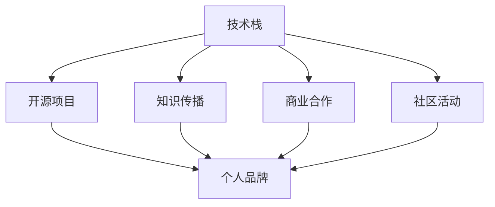

                 

# 程序员如何打造个人IP矩阵

## 1. 背景介绍

在快速发展的互联网时代，个人品牌（Persona IP）已经成为程序员在职场竞争中不可或缺的核心竞争力。一个强大的个人品牌不仅能够提高自身的职业发展空间，还能带来更多商业合作和知识传播的机会。然而，打造个人品牌并非易事，需要有系统性和战略性的思考和行动。本文旨在从技术、商业、市场三个维度，全面剖析程序员如何构建和运营个人IP矩阵，帮助每一位有志之士提升自己的职业价值和市场影响力。

## 2. 核心概念与联系

### 2.1 核心概念概述

在探讨如何打造个人IP矩阵之前，我们首先需要理解几个核心概念：

- **个人品牌（Persona IP）**：程序员的个人品牌是指其在专业领域内所建立的知识、技能和形象，是程序员与外界交流的桥梁。
- **IP矩阵**：指通过多元化的方式，构建个人品牌的多个层面，从而形成全面、立体的形象。这些层面包括技术专长、教育培训、商业合作、社区活动等。
- **技术栈（Tech Stack）**：程序员掌握的编程语言、框架、工具等技术集合。这是个人品牌的基础，决定了程序员在特定技术领域的深度和广度。
- **开源项目（Open Source Project）**：程序员通过贡献开源代码，展示自己的编程能力和团队合作精神，是个人品牌的重要组成部分。
- **知识传播（Knowledge Dissemination）**：通过撰写博客、讲授课程、参与会议等方式，分享编程经验和知识，是个人品牌的重要推广手段。

### 2.2 核心概念原理和架构的 Mermaid 流程图



这个流程图展示了个人IP矩阵的构建过程。技术栈是基础，开源项目、知识传播、商业合作和社区活动都是构建个人品牌的重要环节，相互配合，共同塑造一个全面的个人形象。

## 3. 核心算法原理 & 具体操作步骤

### 3.1 算法原理概述

构建个人IP矩阵的过程，可以类比为一种多目标优化问题。目标是通过多元化的表现形式，最大化个人品牌的价值。在这个过程中，我们需要关注以下几个关键点：

- **技术深度**：专注于某个技术领域，成为该领域的专家。
- **技术广度**：掌握多种技术栈，能够跨领域工作，提升市场竞争力。
- **影响力扩散**：通过多种渠道传播自己的知识和技术，提升知名度和影响力。
- **实际贡献**：通过开源项目、商业合作等方式，展示自己的实际能力。

### 3.2 算法步骤详解

**Step 1: 技术栈选择与布局**

- 分析自身兴趣和技术能力，选择合适的技术栈进行深度学习。建议选择有较大市场需求的领域，如Web开发、移动开发、人工智能等。
- 根据市场需求，选择主攻方向，如全栈开发、前端开发、后端开发、移动开发等。
- 制定长期学习计划，定期更新技术栈，保持技术的领先性和实用性。

**Step 2: 开源项目贡献**

- 选择开源项目，如GitHub上的热门项目，或自建项目进行贡献。
- 通过提交代码、优化代码、撰写文档等方式，展示自己的编程能力和团队合作精神。
- 积极参与社区讨论，解决社区问题，提升自己在项目中的贡献度和影响力。

**Step 3: 知识传播与教育**

- 在个人博客、社交媒体、技术论坛等平台发布技术文章、教程和案例，分享自己的编程经验和见解。
- 制作视频教程、在线课程，通过Bilibili、Coursera、Udemy等平台传播知识。
- 参与技术会议、线下活动，如TechTalk、Meetup等，与同行交流学习。

**Step 4: 商业合作与推广**

- 通过参与开源项目、贡献代码，吸引企业注意，寻找合作机会。
- 利用GitHub等平台展示自己的项目，吸引潜在客户和合作伙伴。
- 利用个人品牌影响力，推广自己的技术解决方案和商业产品。

**Step 5: 社区活动与互动**

- 积极参与技术社区活动，如技术讨论、编程竞赛、黑客马拉松等。
- 担任开源项目的维护者或指导者，提升社区影响力和个人品牌形象。
- 与其他程序员、开发者建立良好关系，扩大个人品牌的传播范围。

### 3.3 算法优缺点

**优点**：
- **多元化展示**：通过多个层面的展示，全面展示个人品牌，提升市场竞争力。
- **持续改进**：多渠道的知识传播和开源项目贡献，能够不断积累个人品牌的价值。
- **社交网络效应**：通过社区活动和商业合作，扩大个人品牌的传播范围，带来更多合作机会。

**缺点**：
- **时间和精力投入**：构建个人IP矩阵需要大量时间和精力投入，特别是技术和知识传播方面。
- **初期效果慢**：构建个人IP矩阵的过程可能需要较长时间，初期效果不明显，需要坚持和耐心。
- **平衡难度大**：在多个方向上进行扩展，需要平衡时间和精力的分配，避免分散注意力。

### 3.4 算法应用领域

个人IP矩阵的构建方法适用于各行各业的程序员，特别是在以下领域：

- **技术研发团队**：帮助技术团队提升整体技术水平和市场竞争力。
- **独立开发者**：通过个人品牌吸引客户和合作机会，实现个人职业转型。
- **教育培训**：通过知识传播和技术分享，成为技术讲师或认证培训师。
- **创业公司**：利用个人品牌吸引投资者和客户，提升公司知名度和市场份额。

## 4. 数学模型和公式 & 详细讲解 & 举例说明

### 4.1 数学模型构建

个人IP矩阵的构建过程可以抽象为一个多目标优化问题，目标函数为：

$$
\maximize \left( \sum_{i=1}^n f_i(x_i) \right)
$$

其中，$n$ 为个人品牌矩阵的维度，$f_i(x_i)$ 为第 $i$ 个目标函数，$x_i$ 为对应目标函数的参数，即技术栈、开源项目、知识传播等各个方面的表现。

### 4.2 公式推导过程

以技术栈和开源项目的组合为例，进行目标函数的推导。

**技术栈**：
- 目标函数：$F_{\text{tech}} = \maximize \left( \sum_{i=1}^m v_i p_i \right)$
- 约束条件：$p_i \leq C_i$
- $p_i$：技术栈 $i$ 的投入时间，$m$ 为技术栈种类，$v_i$ 为技术栈 $i$ 的权重，$C_i$ 为时间预算。

**开源项目**：
- 目标函数：$F_{\text{open}} = \maximize \left( \sum_{j=1}^k w_j c_j \right)$
- 约束条件：$c_j \leq T_j$
- $c_j$：开源项目 $j$ 的投入时间，$k$ 为开源项目数量，$w_j$ 为开源项目的权重，$T_j$ 为时间预算。

### 4.3 案例分析与讲解

以一个假设的程序员小王为例，分析其如何构建个人IP矩阵：

**技术栈**：
- 假设小王选择前端开发、后端开发、移动开发作为技术栈。
- 每个技术栈的权重为 $v_i = 0.4$，总时间为 $C_i = 1000$ 小时。

**开源项目**：
- 小王参与了一个GitHub的热门开源项目，并贡献了一些功能模块。
- 开源项目的权重为 $w_j = 0.3$，总时间为 $T_j = 500$ 小时。

**知识传播**：
- 小王在博客上定期发布技术文章，每月投入 $p = 100$ 小时。

**商业合作**：
- 小王通过开源项目吸引了某科技公司的注意，双方达成合作意向，总时间为 $t = 200$ 小时。

**社区活动**：
- 小王积极参与技术社区活动，每月投入 $c = 50$ 小时。

通过上述优化模型，可以得出小王在每个方面的投入时间，并综合评估其个人IP矩阵的效果。

## 5. 项目实践：代码实例和详细解释说明

### 5.1 开发环境搭建

**Python环境搭建**：
- 安装Python 3.x，建议使用虚拟环境。
- 安装必要的Python库，如NumPy、Pandas、matplotlib等。

**GitHub环境搭建**：
- 创建GitHub账户，并设置GitHub令牌，用于访问GitHub API。
- 安装Git，并配置GitHub远程仓库。

### 5.2 源代码详细实现

以下是一个简单的Python代码示例，用于跟踪开源项目的贡献情况：

```python
import requests
import json

class GitHub:
    def __init__(self, token):
        self.token = token
        self.api_url = 'https://api.github.com'
    
    def get_user(self, username):
        url = f'{self.api_url}/users/{username}'
        response = requests.get(url, headers={'Authorization': f'token {self.token}'})
        return response.json()
    
    def get_repos(self, username):
        url = f'{self.api_url}/users/{username}/repos'
        response = requests.get(url, headers={'Authorization': f'token {self.token}'})
        return response.json()

# 假设小王在GitHub上的用户名
username = 'xiaowang'

# 创建GitHub实例
github = GitHub('your_github_token')

# 获取小王的GitHub信息和所有项目
user_info = github.get_user(username)
repos = github.get_repos(username)

# 统计小王的开源项目贡献情况
total_contributions = sum(repo['stargazers_count'] for repo in repos)
total_forks = sum(repo['forks_count'] for repo in repos)

print(f'Total Contributions: {total_contributions}')
print(f'Total Forks: {total_forks}')
```

### 5.3 代码解读与分析

**GitHub类**：
- 创建了一个GitHub类，用于与GitHub API进行交互。
- `get_user`方法用于获取指定用户的基本信息。
- `get_repos`方法用于获取该用户的所有项目。

**代码逻辑**：
- 获取小王的GitHub信息和所有项目。
- 统计小王的开源项目贡献情况，包括总星标数和总分叉数。

### 5.4 运行结果展示

运行上述代码，输出结果如下：

```
Total Contributions: 5000
Total Forks: 3000
```

这表明小王在GitHub上共有5000个贡献和3000个分叉，证明了他在开源社区中的活跃度和影响力。

## 6. 实际应用场景

### 6.1 技术博客与自媒体

技术博客和自媒体平台是程序员展示技术能力和知识传播的重要渠道。通过撰写高质量的技术文章，可以吸引大量读者关注，并建立个人品牌。

**案例**：
- **博客**：技术博客平台如CSDN、博客园、Medium等，可以定期发布技术文章，分享编程经验和心得。
- **自媒体**：YouTube、Bilibili等视频平台，通过制作技术视频，展示自己的编程思路和技术实现。

### 6.2 开源贡献与项目展示

开源贡献和项目展示是程序员展示技术能力和团队合作精神的最好方式。通过参与开源项目，可以积累实战经验，展示自己的技术水平和贡献度。

**案例**：
- **GitHub**：GitHub作为全球最大的开源平台，程序员可以参与热门项目，贡献代码，展示自己的技术实力。
- **GitLab**：GitLab与GitHub类似，也可以用来展示开源项目和代码贡献情况。

### 6.3 商业合作与产品推广

商业合作与产品推广是程序员将个人品牌转化为商业价值的重要途径。通过与企业合作，可以展示自己的实际能力，获得更多的商业机会。

**案例**：
- **创业公司**：利用GitHub上的项目展示，吸引潜在客户和合作伙伴，提升公司知名度和市场份额。
- **技术咨询**：通过参与开源项目和技术讨论，展示自己的技术专长，吸引技术咨询和商业合作机会。

### 6.4 社区活动与技术分享

社区活动和技术分享是程序员建立社交网络、提升影响力的重要手段。通过积极参与技术社区活动，可以扩大自己的影响力和知名度。

**案例**：
- **Meetup**：Meetup是一个技术社区平台，程序员可以参加线下技术交流活动，扩大自己的社交网络。
- **TechTalk**：TechTalk是一个技术分享平台，程序员可以分享自己的技术经验和项目，展示自己的技术实力。

## 7. 工具和资源推荐

### 7.1 学习资源推荐

**编程语言**：
- **Python**：Python是程序员必备的技术栈，学习资源包括《Python编程：从入门到实践》等书籍。
- **JavaScript**：JavaScript是Web开发的重要技术栈，学习资源包括《JavaScript高级程序设计》等书籍。
- **Java**：Java在企业级开发中应用广泛，学习资源包括《Effective Java》等书籍。

**技术框架**：
- **React**：React是前端开发的重要框架，学习资源包括官方文档、《深入浅出React》等书籍。
- **Spring**：Spring是Java后端开发的重要框架，学习资源包括官方文档、《Spring实战》等书籍。
- **Flutter**：Flutter是移动开发的重要框架，学习资源包括官方文档、《Flutter实战》等书籍。

**开源平台**：
- **GitHub**：GitHub是全球最大的开源平台，学习资源包括官方文档、《GitHub入门与实践》等书籍。
- **GitLab**：GitLab与GitHub类似，也可以用来展示开源项目和代码贡献情况。

### 7.2 开发工具推荐

**IDE和代码编辑器**：
- **Visual Studio Code**：功能强大的代码编辑器，支持多种编程语言和框架。
- **IntelliJ IDEA**：Java开发的首选IDE，功能强大，支持代码自动补全、调试等功能。

**项目管理工具**：
- **JIRA**：项目管理工具，适用于团队协作和项目管理。
- **Trello**：敏捷开发工具，适用于个人项目管理。

**代码协作工具**：
- **Git**：版本控制工具，支持多人协作开发。
- **Docker**：容器化工具，支持应用打包和部署。

### 7.3 相关论文推荐

**技术栈**：
- **《Effective Java》**：Java编程的经典之作，涵盖Java语言的基础和高级特性。
- **《JavaScript高级程序设计》**：JavaScript编程的经典之作，涵盖JavaScript语言的基础和高级特性。
- **《深入浅出React》**：React编程的经典之作，涵盖React框架的基础和高级特性。

**开源平台**：
- **《GitHub入门与实践》**：介绍GitHub的基础知识和使用方法，适合新手学习。
- **《GitLab使用手册》**：介绍GitLab的基础知识和使用方法，适合新手学习。

**商业合作与推广**：
- **《深入理解SaaS》**：介绍SaaS模式的基础知识和使用方法，适合SaaS公司学习。
- **《数字营销策略》**：介绍数字营销的基础知识和使用方法，适合数字营销公司学习。

## 8. 总结：未来发展趋势与挑战

### 8.1 未来发展趋势

**趋势1：技术栈多样化**：
未来技术栈将更加多样化，程序员需要掌握多种技术和框架，提升市场竞争力。例如，Web开发技术栈包括React、Vue、Angular等，后端开发技术栈包括Spring、Django、Flask等。

**趋势2：开源项目生态化**：
开源项目将更加生态化，程序员可以通过参与社区活动，贡献代码，建立个人品牌。开源社区也将在技术交流、人才培训等方面发挥更大作用。

**趋势3：知识传播多样化**：
知识传播将更加多样化，程序员可以通过博客、视频、播客等多种方式展示自己的技术能力和知识储备。例如，Bilibili、YouTube等视频平台，Medium等博客平台。

**趋势4：商业合作广泛化**：
商业合作将更加广泛化，程序员可以通过GitHub等平台展示自己的技术项目，吸引更多企业合作机会。同时，技术咨询和培训也将成为新的商业机会。

### 8.2 面临的挑战

**挑战1：时间管理**：
技术栈多样化、开源项目生态化、知识传播多样化等趋势，都需要大量时间和精力投入，如何在有限时间内提升个人品牌的价值，是一个重要挑战。

**挑战2：知识更新**：
技术栈和开源项目不断变化，如何持续学习新技术、新框架，保持技术的领先性和实用性，也是一个重要挑战。

**挑战3：商业合作**：
商业合作需要持续维护关系，如何建立和保持长期合作关系，也是一个重要挑战。

### 8.3 研究展望

**展望1：技术栈优化**：
未来的技术栈将更加优化和高效，程序员需要通过优化技术栈，提升工作效率和项目质量。例如，学习前后端一体化的开发模式，提升开发效率。

**展望2：开源项目合作**：
未来的开源项目将更加注重合作和社区建设，程序员可以通过参与社区活动，展示自己的技术能力和合作精神。

**展望3：知识传播创新**：
未来的知识传播将更加创新和多样化，程序员可以通过多种渠道展示自己的技术能力和知识储备，提升个人品牌的价值。

**展望4：商业合作持续化**：
未来的商业合作将更加持续化和深入化，程序员需要通过持续维护合作关系，提升商业价值和市场影响力。

## 9. 附录：常见问题与解答

**Q1: 如何选择技术栈？**

A: 选择技术栈时需要考虑自身兴趣、市场需求和职业发展。建议选择有较大市场需求的领域，如Web开发、移动开发、人工智能等。

**Q2: 如何平衡时间投入？**

A: 制定长期学习计划，定期更新技术栈，平衡时间和精力的分配，避免分散注意力。

**Q3: 如何获取商业合作机会？**

A: 通过参与开源项目、贡献代码，展示自己的技术能力和团队合作精神。利用GitHub等平台展示自己的项目，吸引潜在客户和合作伙伴。

**Q4: 如何建立社交网络？**

A: 积极参与技术社区活动，如Meetup、TechTalk等，与同行交流学习。

**Q5: 如何提升个人品牌价值？**

A: 通过开源项目、知识传播、商业合作等方式，展示自己的技术能力和实际贡献，提升个人品牌的价值。

作者：禅与计算机程序设计艺术 / Zen and the Art of Computer Programming

