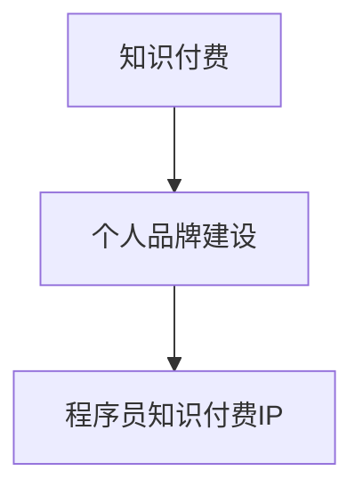
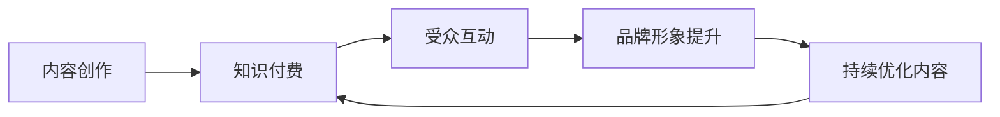

                 

# 程序员如何打造个人知识付费IP

> 关键词：知识付费, 个人品牌, 程序员, 技术博客, 数据分析, 用户心理学, 商业模式, 流量运营, 数据驱动, 投资回报率, 创业

## 1. 背景介绍

在互联网和数字化转型的大背景下，程序员作为技术创新和生产力提升的重要力量，已经逐步从幕后走向前台。个人品牌建设不仅能够提升程序员的专业形象，也能帮助他们获取更多的商业机会。知识付费，作为互联网新兴商业模式，正成为程序员获取个人收益的重要渠道之一。本文将系统地介绍如何从0到1打造个人知识付费IP，帮助程序员在技术知识传递中实现个人价值和商业价值。

## 2. 核心概念与联系

### 2.1 核心概念概述

为更好地理解本文的主旨，我们首先介绍几个核心概念：

- **知识付费**：基于互联网平台，通过付费方式获取技术、知识、信息等内容，提升个人知识价值和收益的一种模式。
- **个人品牌建设**：通过在线内容创作和互动，塑造并传递个人专业形象和价值主张，形成稳定的受众群体。
- **程序员知识付费IP**：以程序员专业背景为基础，聚焦技术、工程、管理等领域，提供有价值的知识服务，并形成具有商业价值的个人品牌。

通过以下Mermaid流程图，我们将呈现这些概念之间的关系：



**A (知识付费)**与**B (个人品牌建设)**的结合，正是本文探讨的核心。**C (程序员知识付费IP)**则是在这一结合下形成的具体形态。

### 2.2 核心概念原理和架构的 Mermaid 流程图

在知识付费模式中，用户为获取特定信息或知识内容而支付费用。个人品牌则是一个持续的过程，通过在线内容（如博客、视频、直播等）传递专业知识和技术见解，逐渐建立起与受众之间的信任和连接。最终，一个具备独特价值和受众基础的个人品牌便形成了知识付费IP。



在这一架构中，内容创作是知识付费和品牌建设的基础。通过持续互动，品牌形象得以提升。而品牌形象的提升，又反过来促进了更高质量的内容创作。这是一个动态的循环过程。

## 3. 核心算法原理 & 具体操作步骤

### 3.1 算法原理概述

打造个人知识付费IP，核心在于内容创作与受众互动的闭环优化。这一过程可以通过以下步骤实现：

1. **确定内容定位**：识别个人技术特长和兴趣领域，明确知识服务内容的核心主题和目标受众。
2. **内容创作与传播**：通过博客、视频、直播等形式，传递专业知识，同时借助社交媒体和平台推广，扩大传播范围。
3. **受众互动与反馈**：通过评论区、社群、问卷等渠道，收集受众反馈，调整优化内容。
4. **品牌形象塑造**：通过持续高质量的内容输出，建立个人品牌形象，提升受众信任度。

### 3.2 算法步骤详解

以下详细介绍每个步骤的具体操作：

#### 3.2.1 确定内容定位

**定位**：明确知识服务的核心主题和目标受众。比如，是面向初级开发者的基础教程，还是针对高级工程师的深度解析。

**调研**：通过调研市场需求、竞争格局和受众偏好，确定细分市场和差异化策略。

**定位策略**：根据调研结果，制定具体内容定位策略。例如，可以选择以下策略：

- 垂直细分：聚焦某一技术栈或行业领域，如AI、云计算、大数据等。
- 跨领域融合：结合多种技术栈和应用场景，提供综合解决方案。
- 教育导向：注重知识传授和技能提升，提供系统化的学习路径。
- 实用导向：侧重实际问题解决和项目实战，提供可操作的案例和工具。

#### 3.2.2 内容创作与传播

**内容形式**：选择适合的形式进行内容创作。博客、视频、直播、专栏、电子书等都是常见的形式。

**平台选择**：选择合适的平台进行内容传播。如知乎、微信公众号、B站、Coursera等。

**传播策略**：制定传播策略，如SEO优化、关键词选择、内容推广等，提升内容曝光度。

#### 3.2.3 受众互动与反馈

**互动渠道**：建立互动渠道，如评论区、社群、邮件等，鼓励受众参与讨论。

**反馈收集**：通过问卷、评分、评论等形式，收集受众反馈，了解内容质量和受众需求。

**内容优化**：根据反馈调整内容形式、难度和深度，提升受众满意度。

#### 3.2.4 品牌形象塑造

**品牌建设**：通过持续高质量的内容输出，建立专业形象和品牌声誉。

**社群运营**：建立和维护社群，增加品牌粘性，提升用户忠诚度。

**合作推广**：与平台、企业合作，扩大品牌影响力和受众群体。

### 3.3 算法优缺点

**优点**：
- **效率高**：通过内容创作和传播，快速建立个人品牌和市场影响力。
- **盈利模式清晰**：知识付费平台提供稳定的收益渠道。
- **可扩展性强**：可以通过内容多元化、跨平台运营等方式扩展品牌影响力。

**缺点**：
- **高竞争性**：知识付费市场竞争激烈，需要持续创新和优化。
- **时间成本高**：内容创作和品牌建设需要时间和精力的投入。
- **质量要求高**：内容质量直接影响受众接受度和品牌形象。

### 3.4 算法应用领域

知识付费IP的应用领域非常广泛，几乎涵盖了所有技术相关的领域：

- **软件开发**：基础编程语言、框架、开发工具等内容。
- **数据科学**：数据处理、机器学习、人工智能等内容。
- **云计算**：云平台、容器、微服务等内容。
- **网络安全**：安全漏洞、加密技术、威胁情报等内容。
- **项目管理**：敏捷开发、DevOps、测试自动化等内容。

此外，个人品牌建设也为其他领域提供了借鉴，如教育、咨询、创业指导等。

## 4. 数学模型和公式 & 详细讲解 & 举例说明

### 4.1 数学模型构建

知识付费IP的打造过程，可以抽象为以下数学模型：

$$
\begin{aligned}
&\max_{\text{内容质量} C, \text{受众反馈} F, \text{品牌形象} B} \text{ROI} = \text{收入} - \text{成本} \\
&\text{内容质量} = f(\text{知识储备}, \text{创作能力}, \text{传播渠道}) \\
&\text{受众反馈} = g(\text{互动渠道}, \text{用户评价}, \text{内容质量}) \\
&\text{品牌形象} = h(\text{品牌活动}, \text{受众反馈}, \text{内容质量}) \\
&\text{收入} = \text{订阅费用} + \text{广告收入} + \text{其他收益} \\
&\text{成本} = \text{内容制作成本} + \text{平台运营成本} + \text{推广成本}
\end{aligned}
$$

其中，$\text{内容质量}$、$\text{受众反馈}$和$\text{品牌形象}$是关键变量，直接影响$\text{ROI}$。

### 4.2 公式推导过程

1. **内容质量**：

$$
C = \sum_{i} (x_i \times p_i)
$$

其中，$x_i$代表第$i$类知识点的数量，$p_i$代表该知识点的专业度评分。

2. **受众反馈**：

$$
F = \frac{\sum_{j} y_j}{n}
$$

其中，$y_j$为第$j$个受众的反馈评分，$n$为总受众数量。

3. **品牌形象**：

$$
B = \sum_{k} (z_k \times r_k)
$$

其中，$z_k$为第$k$个品牌活动的质量和规模，$r_k$为品牌活动的影响力评分。

### 4.3 案例分析与讲解

**案例**：某程序员通过在B站上传视频课程，逐步建立了影响力。

**分析**：
- **内容质量**：视频内容详细讲解了Python基础和项目实战，覆盖知识点全面，专业度评分高。
- **受众反馈**：通过弹幕互动、评分反馈，收集受众意见，优化课程内容。
- **品牌形象**：通过定期直播答疑、发布技术文章，逐步建立起专业形象和社群。

**结果**：课程获得高评分，积累大量订阅用户，并通过广告收益和课程周边商品销售获得额外收入。

## 5. 项目实践：代码实例和详细解释说明

### 5.1 开发环境搭建

**环境准备**：
1. **编程语言**：Python是常用的编程语言。
2. **开发环境**：如Anaconda、PyCharm等。
3. **框架选择**：选择适合的知识付费平台，如微信公众号、B站等。
4. **工具安装**：安装Markdown编辑器、视频制作工具等。

**具体步骤**：
1. **搭建环境**：安装所需工具和依赖包，搭建本地开发环境。
2. **平台账号**：创建平台账号，申请所需功能，如视频上传、广告收益等。
3. **内容创作工具**：选择合适的内容创作工具，如Markdown编辑器、Python开发环境等。

### 5.2 源代码详细实现

以下是一个基于B站视频平台的内容发布示例代码：

```python
import requests
from bs4 import BeautifulSoup

def get_bilibili_video_id(url):
    response = requests.get(url)
    soup = BeautifulSoup(response.content, 'html.parser')
    vid = soup.find("input", {"name": "vid"})['value']
    return vid

def upload_video(title, description, video_path):
    vid = get_bilibili_video_id(video_path)
    data = {
        "title": title,
        "description": description,
        "video_id": vid
    }
    headers = {
        'User-Agent': 'Mozilla/5.0 (Windows NT 10.0; Win64; x64) AppleWebKit/537.36 (KHTML, like Gecko) Chrome/58.0.3029.110 Safari/537.3'
    }
    response = requests.post('https://api.bilibili.com/x/package/program/submit', data=data, headers=headers)
    print(response.json())

video_title = "Python基础教程"
video_description = "本视频教程涵盖Python基础语法、常用库、项目实战等内容，适合初学者学习。"
video_path = "path/to/video.mp4"

upload_video(video_title, video_description, video_path)
```

**代码解读**：
1. **get_bilibili_video_id**函数用于获取视频的ID。
2. **upload_video**函数用于上传视频，并填写视频标题、描述等信息。

### 5.3 代码解读与分析

**代码分析**：
1. **数据获取**：使用BeautifulSoup库解析HTML页面，获取视频ID。
2. **视频上传**：使用requests库进行API调用，上传视频并填写标题、描述等元数据。
3. **异常处理**：需要对API调用结果进行异常处理，确保上传成功。

### 5.4 运行结果展示

**结果展示**：
1. **视频上传**：视频成功上传到B站，用户可以观看。
2. **用户互动**：视频评论区出现互动，开发者可以及时回复。
3. **品牌推广**：通过社交媒体、个人博客等推广视频，吸引更多观众。

## 6. 实际应用场景

**应用场景**：
1. **技术博客**：定期在个人博客上发布技术文章，吸引技术爱好者关注。
2. **视频课程**：在视频平台发布编程教程、项目实战等视频，提升受众参与度。
3. **在线直播**：通过直播形式解答技术问题，提升互动性和知识传播效果。
4. **社群运营**：建立技术社群，分享最新技术动态和开发经验，增强品牌粘性。
5. **产品推广**：利用知识付费IP推广自有技术产品或服务，提升市场竞争力。

**示例**：某程序员通过在技术博客上分享Python项目实战经验，逐步建立起专业声誉。通过在视频平台发布系列编程教程，吸引了大量订阅用户。最终，他推出了自己的技术培训课程，并通过知识付费实现了商业化运营。

## 7. 工具和资源推荐

### 7.1 学习资源推荐

1. **《深入浅出知识付费模式》**：系统介绍知识付费的理论和实践，帮助开发者建立全面的知识付费观念。
2. **《打造个人品牌：程序员的自媒体之路》**：分享成功程序员的自媒体经验，提供具体的操作方法。
3. **《知识付费平台运营手册》**：详细介绍各大知识付费平台的操作流程和技巧。
4. **《内容创作指南：如何写出有价值的内容》**：提供内容创作的方法和技巧，提升创作质量和效果。

### 7.2 开发工具推荐

1. **编程语言**：Python是知识付费内容创作和编程的基础。
2. **视频制作工具**：如Adobe Premiere Pro、Final Cut Pro等。
3. **图形化工具**：如GraphPad Prism、Tableau等。
4. **代码编辑器**：如Visual Studio Code、Atom等。
5. **Markdown编辑器**：如Typora、Miro等。

### 7.3 相关论文推荐

1. **《知识付费的市场潜力与商业模式分析》**：深入分析知识付费的市场潜力与商业模式。
2. **《内容创作的心理学：如何抓住受众的心》**：揭示内容创作背后的心理学原理，提升创作效果。
3. **《数据驱动的知识付费平台优化》**：探讨数据驱动的知识付费平台优化策略。
4. **《个人品牌建设与知识付费的融合》**：分享个人品牌建设与知识付费的融合经验。

## 8. 总结：未来发展趋势与挑战

### 8.1 研究成果总结

本文从0到1全面介绍了如何打造个人知识付费IP。通过确定内容定位、内容创作与传播、受众互动与反馈和品牌形象塑造四个关键步骤，阐述了个人知识付费IP的打造过程。这一过程需要持续的内容创作、数据驱动的优化和用户互动的反馈，才能形成稳定的受众群体和商业收益。

### 8.2 未来发展趋势

1. **内容多元化**：知识付费内容将更加多元，涵盖技术、管理、教育等多个领域。
2. **数据驱动**：通过数据分析优化内容策略，提升用户满意度和品牌影响力。
3. **社群化运营**：建立更加活跃的社群，增强用户粘性和品牌忠诚度。
4. **跨平台联动**：通过多平台联动，扩大受众群体和提升品牌曝光。
5. **个性化推荐**：利用AI技术进行个性化推荐，提升用户体验。

### 8.3 面临的挑战

1. **内容同质化**：知识付费市场内容趋同，如何差异化突围是关键。
2. **用户忠诚度**：如何通过内容和服务提升用户粘性，防止用户流失。
3. **市场竞争**：面对激烈的市场竞争，如何保持持续创新和优化。
4. **品牌形象**：如何在保持品牌一致性的同时，进行差异化策略。
5. **技术壁垒**：如何提升技术水平，保持内容的专业性和前瞻性。

### 8.4 研究展望

未来，知识付费IP将更注重差异化和个性化，数据驱动的优化和社群化运营。通过技术创新和内容创新，提升品牌影响力和商业价值。开发者应持续关注市场动态，提升技术水平，不断优化内容策略，才能在知识付费市场中脱颖而出。

## 9. 附录：常见问题与解答

**Q1：如何确定内容定位？**

A: 确定内容定位需要综合考虑自身的技术专长、市场需求和竞争格局。可以通过调研、市场分析等方式，明确细分市场和差异化策略。

**Q2：如何提升内容质量？**

A: 提升内容质量需要不断学习、积累和创新。可以通过持续学习新技术、实践项目、发布高质量的案例等手段，提升内容的专业度和吸引力。

**Q3：如何增加受众互动？**

A: 增加受众互动可以通过建立评论区、社群、直播等多种渠道。及时回复用户评论和提问，增强互动效果。

**Q4：如何优化品牌形象？**

A: 优化品牌形象需要持续高质量的内容输出，建立专业形象和品牌声誉。可以通过发布技术文章、参与技术会议、合作推广等方式，提升品牌影响力。

**Q5：如何评估收益ROI？**

A: 评估收益ROI需要明确收入和成本的计算方法。通过数据分析和用户体验反馈，持续优化内容和服务，提升整体收益。

---

作者：禅与计算机程序设计艺术 / Zen and the Art of Computer Programming

