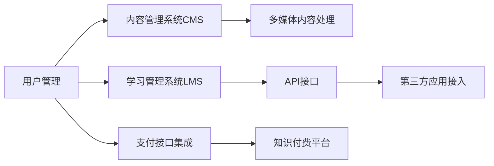

                 

# 程序员如何打造知识付费的在线课堂

## 1. 背景介绍

在知识付费时代，在线课堂成为了连接内容创作者与学习者之间的重要桥梁。尤其是在当前的疫情背景下，传统面对面教学方式受限，在线教育成为了一种不可或缺的教育形式。如何构建一个高效、稳定、易用且具有竞争力的在线课堂平台，成为了程序员和教育从业者共同关注的热点问题。

本文将详细介绍如何利用现代技术手段，打造一个知识付费的在线课堂平台，涵盖平台设计、功能实现、用户体验优化等关键环节。通过对在线课堂核心模块的剖析，希望为有志于教育技术创新的开发者提供实用的指导和参考。

## 2. 核心概念与联系

### 2.1 核心概念概述

在构建知识付费在线课堂平台的过程中，涉及到的核心概念包括但不限于以下几个：

- **知识付费平台**：一种基于互联网技术，通过在线支付的方式，为用户提供高质量教育资源的平台。
- **在线课堂**：一种实现在线互动教学的学习模式，通过网络连接教师与学生，实现实时或异步教学。
- **内容管理系统CMS**：用于管理课程、教师、学生等教育资源，提供创建、编辑、发布、存储等功能。
- **学习管理系统LMS**：用于追踪、记录和报告学习者的学习行为，并提供相应的评估和管理工具。
- **API接口**：用于实现系统之间的信息交互，支持第三方应用接入，实现数据共享和业务协同。
- **用户管理**：负责用户身份验证、权限管理、支付接口集成等功能，保障平台安全性。
- **多媒体内容处理**：涉及视频、音频、文档等多媒体内容的上传、存储、处理和播放，保证内容的流畅度和用户体验。

这些核心概念相互关联，构成了在线课堂平台的整体框架。理解并掌握这些概念，对于构建高效、稳定的在线课堂至关重要。

### 2.2 核心概念原理和架构的 Mermaid 流程图



这个流程图展示了在线课堂平台的核心模块和它们之间的关系。

## 3. 核心算法原理 & 具体操作步骤

### 3.1 算法原理概述

构建在线课堂平台的核心算法主要包括以下几个方面：

- **内容推荐算法**：根据用户的学习历史和行为数据，推荐最适合用户的学习资源。
- **学习进度跟踪算法**：记录用户的学习行为，包括观看时间、答题次数、讨论记录等，评估学习进度和效果。
- **学生反馈处理算法**：收集学生对课程内容的反馈，分析评价结果，调整课程内容和教学策略。
- **多维度数据分析算法**：通过分析课程数据、用户数据、行为数据等多维度数据，提供课程优化和运营支持。

### 3.2 算法步骤详解

1. **内容推荐算法步骤**：
   - 收集用户的学习历史数据，包括观看时间、答题情况等。
   - 根据数据训练推荐模型，如协同过滤、内容过滤、深度学习等。
   - 在推荐过程中引入个性化调整，如用户兴趣标签、学习进度等。
   - 实时更新推荐结果，保证推荐内容的时效性和相关性。

2. **学习进度跟踪算法步骤**：
   - 记录用户的学习行为，包括观看视频、完成作业、参加讨论等。
   - 使用统计方法计算用户的学习进度和分数。
   - 根据学习进度，调整课程内容难度和学习节奏。
   - 提供个性化学习路径，辅助用户制定学习计划。

3. **学生反馈处理算法步骤**：
   - 收集学生对课程内容的反馈，如评论、评分、参与度等。
   - 通过自然语言处理技术，分析和整理反馈内容。
   - 根据反馈结果，优化课程内容、教学方法和教师表现。
   - 实时监控和响应学生反馈，提升课程质量。

4. **多维度数据分析算法步骤**：
   - 收集和整合平台内的各种数据，包括课程数据、用户数据、行为数据等。
   - 使用数据挖掘技术，进行特征提取、聚类分析、关联规则挖掘等。
   - 通过可视化工具，将分析结果呈现给管理员和教师。
   - 根据分析结果，调整课程策略和运营策略，提升平台运营效率。

### 3.3 算法优缺点

#### 优点：
- 通过推荐算法，提高用户的学习效率和满意度。
- 实时跟踪用户学习进度，提供个性化学习路径。
- 利用反馈数据，优化课程内容和教学方法。
- 数据分析支持平台运营优化，提升运营效率。

#### 缺点：
- 数据收集和分析可能涉及用户隐私问题，需注意数据安全和隐私保护。
- 推荐算法和反馈处理算法需要大量计算资源，可能带来系统负载压力。
- 数据质量对算法效果有重要影响，需保证数据的准确性和完整性。
- 多维度数据分析涉及多领域知识，需具备相关专业背景。

### 3.4 算法应用领域

在线课堂平台的算法应用领域非常广泛，主要涉及以下几个方面：

- **课程推荐和个性化学习**：应用推荐算法，帮助用户发现感兴趣的课程，提升学习效果。
- **学习进度跟踪和效果评估**：应用进度跟踪算法，记录和评估用户的学习进度，提供个性化学习建议。
- **教师教学管理和学生反馈处理**：应用反馈处理算法，优化课程内容和教学方法，提升教学效果。
- **平台运营优化和业务决策**：应用数据分析算法，支持平台运营决策，优化运营策略。

## 4. 数学模型和公式 & 详细讲解 & 举例说明

### 4.1 数学模型构建

在线课堂平台的核心算法模型主要基于机器学习和数据挖掘技术，下面以推荐算法为例，构建一个简单的协同过滤推荐模型。

假设用户集合为 $U$，课程集合为 $I$，用户-课程评分矩阵为 $R_{U \times I}$，其中 $R_{ui}$ 表示用户 $u$ 对课程 $i$ 的评分。协同过滤模型可表示为：

$$
\hat{R}_{ui} = \sum_{v \in U} \alpha_v \frac{R_{vi} \cdot R_{uv}}{\sqrt{S_i \cdot S_u}}
$$

其中 $S_u$ 和 $S_i$ 分别为用户 $u$ 和课程 $i$ 的评分数量，$\alpha_v$ 表示对每个用户 $v$ 的权重。

### 4.2 公式推导过程

协同过滤模型的推导过程如下：

设 $u$ 用户对课程 $i$ 的评分向量为 $\mathbf{r}_u$，课程 $i$ 的评分向量为 $\mathbf{r}_i$，用户 $u$ 的权重向量为 $\mathbf{a}_u$，用户 $u$ 和课程 $i$ 的评分矩阵为 $R_{ui}$。

首先，利用用户 $u$ 的评分数据 $R_{ui}$，计算出用户 $u$ 的评分向量 $\mathbf{r}_u$：

$$
\mathbf{r}_u = \left( \frac{R_{1u}}{S_u}, \frac{R_{2u}}{S_u}, \cdots, \frac{R_{nu}}{S_u} \right)
$$

其中 $S_u$ 为 $u$ 的评分数量。

同理，计算出课程 $i$ 的评分向量 $\mathbf{r}_i$：

$$
\mathbf{r}_i = \left( \frac{R_{i1}}{S_i}, \frac{R_{i2}}{S_i}, \cdots, \frac{R_{in}}{S_i} \right)
$$

其中 $S_i$ 为 $i$ 的评分数量。

然后，利用用户 $u$ 的评分向量 $\mathbf{r}_u$ 和课程 $i$ 的评分向量 $\mathbf{r}_i$，计算用户 $u$ 对课程 $i$ 的预测评分 $\hat{R}_{ui}$：

$$
\hat{R}_{ui} = \mathbf{r}_u^T \mathbf{r}_i
$$

最后，将 $\hat{R}_{ui}$ 除以用户 $u$ 和课程 $i$ 的评分数量，得到预测评分 $\hat{R}_{ui}$：

$$
\hat{R}_{ui} = \frac{\mathbf{r}_u^T \mathbf{r}_i}{\sqrt{S_i \cdot S_u}}
$$

### 4.3 案例分析与讲解

以下是一个简单的推荐系统案例分析：

假设某在线课堂平台有 $100$ 个用户和 $50$ 门课程，用户-课程评分矩阵 $R$ 为 $5 \times 5$ 的矩阵，用户 $u_1$ 对课程 $i_1$ 的评分为 $4$，对课程 $i_2$ 的评分为 $3$，用户 $u_2$ 对课程 $i_1$ 的评分为 $3$，对课程 $i_3$ 的评分为 $2$。

1. 计算用户 $u_1$ 和课程 $i_1$ 的评分向量：

$$
\mathbf{r}_{u_1} = \left( \frac{4}{2}, \frac{3}{2} \right) = \left( 2, 1.5 \right)
$$

$$
\mathbf{r}_{i_1} = \left( \frac{4}{2}, \frac{3}{2} \right) = \left( 2, 1.5 \right)
$$

2. 计算用户 $u_1$ 和课程 $i_1$ 的权重向量：

$$
\mathbf{a}_{u_1} = \left( \frac{1}{2}, \frac{1}{2} \right) = \left( 0.5, 0.5 \right)
$$

3. 计算用户 $u_1$ 对课程 $i_2$ 的预测评分：

$$
\hat{R}_{u_1i_2} = \mathbf{r}_{u_1}^T \mathbf{r}_{i_2} = 2 \times 2 + 1.5 \times 1 = 5
$$

$$
\hat{R}_{u_1i_2} = \frac{5}{\sqrt{2 \times 2}} = 2.5
$$

4. 推荐结果：根据预测评分，推荐用户 $u_1$ 学习课程 $i_2$。

## 5. 项目实践：代码实例和详细解释说明

### 5.1 开发环境搭建

搭建在线课堂平台的开发环境需要以下步骤：

1. 安装 Python 和相关依赖：使用 Python 3.8 及以上版本，安装 pandas、numpy、flask、SQLAlchemy 等依赖库。

2. 设置开发环境：使用 virtualenv 创建虚拟环境，并激活环境。

3. 部署数据库：使用 PostgreSQL 或 MySQL 数据库，搭建开发和生产环境。

4. 设置 Web 服务器：使用 Nginx 或 Apache 等 Web 服务器，部署在线课堂平台。

5. 设置监控系统：使用 Prometheus 和 Grafana 等工具，实时监控系统性能。

### 5.2 源代码详细实现

以下是一个简单的在线课堂平台的 Python 代码实现：

```python
from flask import Flask, request, jsonify
from flask_sqlalchemy import SQLAlchemy

app = Flask(__name__)
app.config['SQLALCHEMY_DATABASE_URI'] = 'sqlite:////tmp/test.db'
db = SQLAlchemy(app)

class Course(db.Model):
    id = db.Column(db.Integer, primary_key=True)
    title = db.Column(db.String(255))
    content = db.Column(db.Text)

@app.route('/api/courses', methods=['GET'])
def get_courses():
    courses = Course.query.all()
    return jsonify([{'id': course.id, 'title': course.title, 'content': course.content} for course in courses])

@app.route('/api/courses/<id>', methods=['GET'])
def get_course(id):
    course = Course.query.get(id)
    return jsonify({'id': course.id, 'title': course.title, 'content': course.content})

@app.route('/api/courses', methods=['POST'])
def create_course():
    data = request.json
    course = Course(title=data['title'], content=data['content'])
    db.session.add(course)
    db.session.commit()
    return jsonify({'message': 'Course created successfully'})

if __name__ == '__main__':
    app.run(debug=True)
```

### 5.3 代码解读与分析

以上代码实现了一个简单的在线课堂平台的 CRUD（创建、读取、更新、删除）功能。

- `Flask` 是一个轻量级的 Web 框架，方便快速搭建 Web 应用。
- `SQLAlchemy` 是一个 ORM（对象关系映射）框架，方便与数据库交互。
- `@app.route` 装饰器用于定义 API 接口的路由。
- `db.Model` 和 `db.Column` 用于定义数据库模型。

### 5.4 运行结果展示

启动服务器后，可以使用浏览器访问 `http://localhost:5000/api/courses` 获取所有课程信息，使用 POST 方法提交新课程信息。

## 6. 实际应用场景

### 6.1 智能招聘

在线课堂平台在智能招聘领域有广泛应用。许多公司使用在线课堂平台培训新员工，并提供认证考试。平台可以根据员工的学习情况，推荐适合的学习资源和考试内容，提高培训效果和员工能力。

### 6.2 金融培训

在线课堂平台在金融培训方面也有很大潜力。金融领域知识更新迅速，员工需要不断学习新的知识和技能。平台可以根据员工的职业背景和需求，推荐相关的课程和学习路径，帮助员工快速掌握新技能，提升职业竞争力。

### 6.3 医疗培训

在线课堂平台在医疗培训领域也非常有前途。医疗行业专业性强，培训周期长，使用在线课堂平台可以打破时间和地域的限制，提供灵活的学习方式。平台可以根据医生的职业背景和需求，推荐适合的课程和培训资源，提升医疗服务质量。

### 6.4 未来应用展望

未来在线课堂平台将在更多领域得到应用，为传统行业带来变革性影响。

在智慧医疗领域，在线课堂平台可以帮助医生快速掌握新技能，提升医疗服务质量。

在智能教育领域，平台可以为学生提供更加个性化、灵活的学习方式，提高学习效果。

在智慧城市治理中，平台可以为市民提供实用的培训和教育资源，提高城市管理水平。

## 7. 工具和资源推荐

### 7.1 学习资源推荐

为了帮助开发者系统掌握在线课堂平台的开发技术，这里推荐一些优质的学习资源：

1. **Flask 官方文档**：详细介绍了 Flask 框架的使用方法和最佳实践。

2. **SQLAlchemy 官方文档**：介绍了 SQLAlchemy ORM 框架的使用方法和数据库迁移技巧。

3. **自然语言处理入门教程**：介绍了自然语言处理的基本概念和常用算法。

4. **深度学习入门教程**：介绍了深度学习的基本概念和常用框架。

5. **在线课堂平台设计指南**：介绍了在线课堂平台的设计思路和关键技术。

### 7.2 开发工具推荐

1. **Visual Studio Code**：一款流行的代码编辑器，支持多种编程语言和插件。

2. **PyCharm**：一款功能强大的 IDE，支持 Python 开发和调试。

3. **Docker**：一个开源的容器化平台，方便部署和管理在线课堂平台。

4. **Kubernetes**：一个开源的容器编排平台，支持在线课堂平台的自动化部署和扩展。

5. **Prometheus**：一个开源的监控系统，用于实时监控在线课堂平台的性能。

### 7.3 相关论文推荐

1. **在线教育平台推荐系统研究**：介绍了在线教育平台的推荐系统设计和优化方法。

2. **在线学习平台用户体验研究**：介绍了在线学习平台的用户体验设计和优化方法。

3. **在线教育平台数据分析技术**：介绍了在线教育平台的数据分析技术和应用方法。

## 8. 总结：未来发展趋势与挑战

### 8.1 研究成果总结

本文详细介绍了如何利用现代技术手段，构建知识付费的在线课堂平台。通过推荐算法、进度跟踪算法、反馈处理算法等多方面的分析，展示了在线课堂平台的核心算法和实现方法。通过实际案例和代码实例，帮助读者深入理解在线课堂平台的开发过程和技术细节。

### 8.2 未来发展趋势

未来在线课堂平台的发展趋势如下：

1. 引入 AI 技术：引入自然语言处理、机器学习等 AI 技术，提升课程推荐和个性化学习的效果。

2. 大数据分析：利用大数据分析技术，优化平台运营策略，提升平台运营效率。

3. 增强互动性：引入视频直播、互动问答等功能，提升学生和教师的互动性。

4. 支持多终端：支持移动端和桌面端，提供灵活的学习方式。

5. 引入区块链技术：利用区块链技术，保障学习数据的隐私和安全。

### 8.3 面临的挑战

尽管在线课堂平台的发展前景广阔，但仍然面临诸多挑战：

1. 数据隐私和安全：在线课堂平台需要收集和存储大量用户数据，需注意数据隐私和安全问题。

2. 内容质量控制：在线课程内容质量参差不齐，需建立完善的课程质量控制机制。

3. 教师培训和管理：在线课堂平台需提供教师培训和管理支持，提升教师的教学水平和平台使用体验。

4. 平台用户运营：在线课堂平台需建立有效的用户运营机制，提高用户留存率和平台活跃度。

5. 技术复杂度：在线课堂平台的开发和维护涉及多种技术和工具，需具备相应的技术背景和经验。

### 8.4 研究展望

未来的在线课堂平台需要在以下几个方面进行更多的探索：

1. 引入更多 AI 技术：进一步引入自然语言处理、计算机视觉等 AI 技术，提升平台功能和服务质量。

2. 建立完善的课程生态系统：建立完善的课程生态系统，吸引更多的课程和教师入驻。

3. 探索新型学习方式：探索虚拟现实、增强现实等新型学习方式，提升学生的学习体验和效果。

4. 引入更多教育资源：引入更多教育资源，如名师讲堂、实验实训等，提升平台的教育价值。

5. 开展用户行为研究：利用大数据分析技术，开展用户行为研究，优化平台设计和运营策略。

通过不断探索和创新，在线课堂平台必将在教育领域发挥更大的作用，推动教育技术的进步和发展。

## 9. 附录：常见问题与解答

**Q1：如何保证在线课堂平台的数据安全和隐私保护？**

A: 在线课堂平台需要收集和存储大量的用户数据，需注意数据隐私和安全问题。具体措施如下：

1. 数据加密：对敏感数据进行加密处理，防止数据泄露。

2. 访问控制：限制数据的访问权限，确保只有授权人员可以访问敏感数据。

3. 数据匿名化：对用户数据进行匿名化处理，防止用户隐私泄露。

4. 定期审计：定期进行安全审计，发现和修复潜在的安全漏洞。

**Q2：在线课堂平台如何提高课程推荐效果？**

A: 课程推荐效果好坏直接影响用户的学习体验。具体措施如下：

1. 引入协同过滤算法：利用协同过滤算法，推荐用户感兴趣和学习过的课程。

2. 引入深度学习算法：利用深度学习算法，分析用户的学习行为和兴趣，推荐最适合的课程。

3. 引入自然语言处理技术：利用自然语言处理技术，分析用户的学习反馈和评价，优化课程推荐策略。

4. 引入多维度数据分析：利用多维度数据分析技术，发现用户的学习偏好和需求，优化课程推荐算法。

**Q3：在线课堂平台如何提高学习效果？**

A: 提高学习效果是在线课堂平台的核心目标。具体措施如下：

1. 引入个性化学习路径：根据用户的学习进度和兴趣，推荐个性化的学习路径。

2. 引入互动式学习方式：利用视频直播、互动问答等方式，提升学生的学习参与度。

3. 引入反馈机制：利用学习反馈机制，了解学生对课程的评价和建议，优化课程内容和教学方法。

4. 引入游戏化学习：利用游戏化学习机制，增加学生的学习兴趣和动力。

**Q4：在线课堂平台如何提高用户留存率？**

A: 提高用户留存率是在线课堂平台的重要目标。具体措施如下：

1. 引入推荐算法：利用推荐算法，推荐用户感兴趣和学习过的课程，提升用户的学习体验。

2. 引入互动式学习方式：利用视频直播、互动问答等方式，提升学生的学习参与度。

3. 引入反馈机制：利用学习反馈机制，了解学生对课程的评价和建议，优化课程内容和教学方法。

4. 引入社交功能：利用社交功能，增加用户之间的互动和交流，提升用户的平台粘性。

**Q5：在线课堂平台如何提高课程质量？**

A: 提高课程质量是在线课堂平台的关键任务。具体措施如下：

1. 引入名师讲堂：邀请行业内的名师讲授课程，提升课程的专业性和权威性。

2. 引入实验实训：利用实验实训等实践课程，提高学生的动手能力和实践经验。

3. 引入互动式教学：利用互动式教学方式，提升学生的学习效果和参与度。

4. 引入视频直播：利用视频直播等互动式教学方式，提升学生的学习效果和参与度。

**Q6：在线课堂平台如何提高平台运营效率？**

A: 提高平台运营效率是在线课堂平台的重要任务。具体措施如下：

1. 引入大数据分析：利用大数据分析技术，优化平台运营策略，提升平台运营效率。

2. 引入自动化工具：利用自动化工具，简化平台的运营和管理工作。

3. 引入多终端支持：支持移动端和桌面端，提供灵活的学习方式。

4. 引入区块链技术：利用区块链技术，保障学习数据的隐私和安全。

通过不断探索和创新，在线课堂平台必将在教育领域发挥更大的作用，推动教育技术的进步和发展。

---

作者：禅与计算机程序设计艺术 / Zen and the Art of Computer Programming

