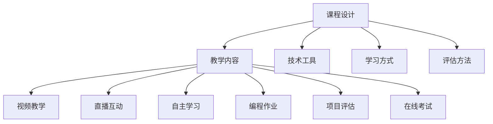

                 

# 程序员如何打造高质量的在线编程课程

> 关键词：在线编程课程, 编程教育, 课程设计, 学生参与度, 互动教学, 反馈机制, 自适应学习, 持续改进

## 1. 背景介绍

在数字化转型的浪潮下，编程技能已成为个人和企业的核心竞争力。而在线编程课程以其灵活性、可扩展性和覆盖面广等特点，正在迅速成为编程教育和技能培训的重要方式。如何打造高质量的在线编程课程，吸引并留住学员，培养真正掌握编程技能的人才，是教育工作者和程序员所面临的共同挑战。本文将从课程设计、教学实践、技术支持等多个角度，系统探讨如何打造高质量的在线编程课程。

## 2. 核心概念与联系

### 2.1 核心概念概述

在线编程课程的构建涉及多个关键概念，包括课程设计、教学内容、技术工具、学习方式和评估方法等。这些概念相互关联，共同构成了一个完整的在线编程课程体系。

- **课程设计**：课程设计是在线编程课程的骨架，决定了课程的结构、内容和目标。好的课程设计应符合教育学原理，能够系统地介绍编程知识和技能。

- **教学内容**：教学内容是课程设计的核心，包括理论知识、实践操作、项目案例等。内容应具有趣味性、挑战性和实用性，能够激发学生的学习兴趣和成就感。

- **技术工具**：技术工具支持课程的在线交付，如视频播放器、代码编辑器、协作平台等。这些工具需要稳定、易用，且支持多种编程语言和框架。

- **学习方式**：在线编程课程应采用多样化的学习方式，如视频教学、直播互动、自主学习等，以满足不同学习者的需求。

- **评估方法**：有效的评估方法能客观反映学生的学习效果，包括编程作业、项目评估、在线考试等。评估应多样化，能够覆盖知识掌握、技能应用和创新能力。

这些核心概念之间的逻辑关系可以通过以下Mermaid流程图来展示：



这个流程图展示了课程设计、教学内容、技术工具、学习方式和评估方法之间的相互关系和影响。课程设计决定了教学内容的深度和广度，技术工具支持学习方式的实现，评估方法验证学习效果，而多样化的学习方式则进一步促进学生的参与和理解。

## 3. 核心算法原理 & 具体操作步骤

### 3.1 算法原理概述

在线编程课程的构建涉及多种算法和策略，以确保课程的有效性和吸引力。这些算法和策略包括但不限于：

- **个性化学习路径算法**：根据学生的学习进度和偏好，动态调整学习内容，实现自适应学习。
- **互动教学算法**：通过实时互动和反馈，提高学生的参与度和学习效果。
- **内容推荐算法**：根据学生的学习行为和反馈，推荐合适的学习内容和资源。
- **评估算法**：综合多种评估方式，全面衡量学生的学习成果和能力。

### 3.2 算法步骤详解

构建高质量的在线编程课程，可以按照以下步骤进行：

**Step 1: 需求分析与目标设定**
- 分析目标受众的需求和期望，明确课程目标。
- 确定课程的知识体系和技能框架。

**Step 2: 课程设计**
- 设计课程的结构和内容，包括理论讲解、实践操作和项目案例等。
- 选择适当的编程语言和框架，确保课程的前沿性和实用性。

**Step 3: 教学内容开发**
- 制作视频教程、编写教学文档、设计编程作业和项目案例。
- 确保内容科学、严谨、有趣，能够激发学生的学习兴趣。

**Step 4: 技术工具选择与集成**
- 选择合适的技术工具，如视频平台、代码编辑器、在线互动工具等。
- 确保这些工具稳定、易用，能够支持多种编程语言和框架。

**Step 5: 学习方式设计**
- 设计多样化的学习方式，如视频教学、直播互动、自主学习等。
- 根据学生的学习进度和反馈，动态调整学习内容和难度。

**Step 6: 评估方法选择与实施**
- 设计多种评估方式，如编程作业、项目评估、在线考试等。
- 根据评估结果，及时反馈给学生，帮助其改进和提升。

**Step 7: 持续改进与优化**
- 收集学生的反馈和评估结果，不断优化课程设计和技术工具。
- 引入新技术和教学方法，提升课程的吸引力和效果。

### 3.3 算法优缺点

在线编程课程的构建和优化涉及多种算法和策略，这些方法各有优缺点：

**优点**：
- 个性化学习路径算法能够根据学生的需求和进度，提供定制化的学习内容，提高学习效果。
- 互动教学算法通过实时互动和反馈，提高学生的参与度和学习积极性。
- 内容推荐算法能够根据学生的学习行为和反馈，推荐合适的学习内容和资源，提高学习效率。
- 评估算法能够全面衡量学生的学习成果和能力，为课程改进提供数据支持。

**缺点**：
- 个性化学习路径算法需要大量的数据和计算资源，实施成本较高。
- 互动教学算法在技术实现和维护上存在挑战，需要持续的投入和优化。
- 内容推荐算法和评估算法的效果依赖于数据质量和评估标准，需要不断地调整和优化。

### 3.4 算法应用领域

在线编程课程的构建方法可以应用于多个领域，包括但不限于：

- **企业培训**：企业可以利用在线编程课程，对员工进行编程技能和特定技术的培训。
- **学校教育**：学校可以设计在线编程课程，培养学生的编程思维和实际编程能力。
- **个人学习**：个人可以利用在线编程课程，自主学习编程知识和技能。
- **职业发展**：在线编程课程可以用于程序员的职业发展和技能提升。

## 4. 数学模型和公式 & 详细讲解 & 举例说明

### 4.1 数学模型构建

在线编程课程的设计和评估涉及多个数学模型和公式，这些模型和公式用于描述课程的运作过程和学习效果。

**数学模型构建**：
- 课程设计模型：用于描述课程的结构、内容和目标。
- 教学内容模型：用于描述课程的教学方法和内容。
- 技术工具模型：用于描述课程的技术支持和实现方式。
- 学习方式模型：用于描述学生的学习行为和方式。
- 评估方法模型：用于描述课程的评估方式和效果。

### 4.2 公式推导过程

以下以编程作业的评估公式为例，展示数学模型的应用：

设学生完成的编程作业为 $T$，标准答案为 $S$，评估公式为 $E(T, S)$。

$$
E(T, S) = \frac{1}{N} \sum_{i=1}^{N} \left( \frac{T_i}{S_i} \right)^p
$$

其中，$N$ 为测试数据集的大小，$p$ 为评估参数，通常取值为2。$T_i$ 和 $S_i$ 分别表示第 $i$ 个测试数据的得分和标准得分。

该公式用于计算编程作业的得分，其中 $p$ 用于控制评估的严格程度，$p$ 值越大，评估越严格。

### 4.3 案例分析与讲解

**案例分析**：
- 某在线编程课程要求学生完成一个网页开发的编程作业。课程组设计了多个测试用例，分别评估学生的代码正确性、性能和可读性。
- 课程组使用上述评估公式，计算每个测试用例的得分，并将这些得分进行平均，得到学生的最终编程作业得分。

## 5. 项目实践：代码实例和详细解释说明

### 5.1 开发环境搭建

以下是使用Python和Flask框架搭建在线编程课程开发环境的步骤：

**Step 1: 安装Flask**  
```bash
pip install Flask
```

**Step 2: 创建Flask应用程序**  
```python
from flask import Flask, request, jsonify

app = Flask(__name__)

@app.route('/api/homework', methods=['POST'])
def submit_homework():
    # 接收学生提交的编程作业
    submission = request.json['submission']
    
    # 计算编程作业的得分
    score = calculate_score(submission)
    
    # 返回得分
    return jsonify({'score': score})

def calculate_score(submission):
    # 计算得分
    # ...
    return score
```

**Step 3: 部署Flask应用程序**  
使用Gunicorn和Nginx部署Flask应用程序：  
```bash
gunicorn --bind 0.0.0.0:5000 myapp:app
nginx -c nginx.conf
```

### 5.2 源代码详细实现

以下是Flask应用程序的完整代码，展示如何接收学生提交的编程作业，并计算其得分：

```python
from flask import Flask, request, jsonify

app = Flask(__name__)

@app.route('/api/homework', methods=['POST'])
def submit_homework():
    # 接收学生提交的编程作业
    submission = request.json['submission']
    
    # 计算编程作业的得分
    score = calculate_score(submission)
    
    # 返回得分
    return jsonify({'score': score})

def calculate_score(submission):
    # 计算得分
    # ...
    return score

if __name__ == '__main__':
    app.run(debug=True)
```

### 5.3 代码解读与分析

**代码解读**：
- Flask是一个轻量级的Python Web框架，用于构建Web应用程序。
- 在`submit_homework`函数中，通过`request.json`接收学生提交的编程作业，使用`calculate_score`函数计算得分，并通过`jsonify`将得分返回给客户端。
- `calculate_score`函数用于计算编程作业的得分，其中具体算法需要根据课程设计进行定制。

**代码分析**：
- Flask框架简单易用，适合快速开发Web应用程序。
- 代码中使用了`jsonify`函数，用于将Python对象转换为JSON格式，方便前端处理。
- `calculate_score`函数需要根据具体课程设计和评估方法进行定制，不同的课程可能需要不同的评估公式和标准。

### 5.4 运行结果展示

运行上述代码后，可以通过`curl`或Web浏览器访问`http://localhost:5000/api/homework`，提交编程作业，并接收得分反馈。

## 6. 实际应用场景

在线编程课程在多个领域和场景中得到了广泛应用：

### 6.1 企业培训

企业可以通过在线编程课程，对员工进行编程技能和特定技术的培训。例如，某科技公司利用在线编程课程，为IT部门员工提供最新的编程语言和框架培训，提升团队的开发效率和创新能力。

### 6.2 学校教育

学校可以利用在线编程课程，培养学生的编程思维和实际编程能力。例如，某中学利用在线编程课程，设计了多个编程项目，让学生在实践中掌握编程技能。

### 6.3 个人学习

个人可以利用在线编程课程，自主学习编程知识和技能。例如，某大学生利用在线编程课程，学习Python和Web开发技术，最终在实习中得到肯定和晋升。

### 6.4 职业发展

在线编程课程可以用于程序员的职业发展和技能提升。例如，某程序员利用在线编程课程，学习了机器学习和深度学习的编程技巧，成功转型为数据科学家。

## 7. 工具和资源推荐

### 7.1 学习资源推荐

为了帮助程序员掌握在线编程课程的构建和优化，以下是一些推荐的资源：

**1. Coursera和Udacity**：提供大量在线编程课程和项目，涵盖多个编程语言和框架。

**2. edX和Khan Academy**：提供免费的编程课程和资源，适合自主学习。

**3. Codecademy**：提供互动式的编程课程和练习，适合初学者。

**4. GitHub Learning Lab**：提供基于GitHub的编程练习，培养实际开发能力。

**5. Stanford CS Education Library**：提供最新的编程教育研究和实践资源。

### 7.2 开发工具推荐

以下是一些用于在线编程课程开发的常用工具：

**1. Jupyter Notebook**：用于编写和分享Python代码和数据处理，适合编程教学和练习。

**2. GitHub**：用于代码托管和版本控制，方便课程组和学生管理课程内容和代码。

**3. Docker**：用于容器化应用程序，确保课程的可移植性和稳定性。

**4. AWS和Google Cloud**：提供云资源和API服务，支持大规模课程部署和优化。

### 7.3 相关论文推荐

以下是几篇关于在线编程课程研究的经典论文：

**1. "A Taxonomy of Learning by Doing"**：对编程学习方式进行分类和描述，探讨了多种编程学习策略。

**2. "Flipped Classroom: A Key to Advanced Programming Education"**：探讨了翻转课堂对编程教学的影响和效果。

**3. "Learning with Video Lessons: Experience and Comparison"**：比较了视频教学和现场教学的效果，提出了改进建议。

**4. "The Effectiveness of Peer Instruction in Programming"**：研究了同伴指导对编程学习的影响和效果。

**5. "Assessment in Computer Science Education"**：探讨了编程评估的方法和工具，提出了多种评估策略。

这些论文代表了在线编程课程的研究前沿，对实践有很强的指导意义。

## 8. 总结：未来发展趋势与挑战

### 8.1 总结

本文详细探讨了如何打造高质量的在线编程课程，涉及课程设计、教学内容、技术工具、学习方式和评估方法等多个方面。通过系统地介绍这些关键概念和算法，希望能帮助程序员和教育工作者构建更加科学、高效、吸引人的在线编程课程。

## 8.2 未来发展趋势

展望未来，在线编程课程的发展趋势包括：

**趋势1：自适应学习**：利用机器学习和大数据分析，实现个性化的学习路径，提供定制化的教学内容。

**趋势2：实时互动**：通过视频会议、实时问答等工具，实现师生和同伴之间的实时互动和反馈。

**趋势3：虚拟现实和增强现实**：利用VR和AR技术，提供沉浸式和交互式的编程学习体验。

**趋势4：混合学习模式**：结合线上线下学习，提供灵活多样的学习方式，满足不同学习者的需求。

**趋势5：社区和协作学习**：利用在线社区和协作工具，促进学生之间的交流和合作，提升学习效果。

这些趋势将推动在线编程课程的不断优化和升级，使其更好地适应学生的需求和行业的变化。

### 8.3 面临的挑战

尽管在线编程课程的发展前景广阔，但仍面临一些挑战：

**挑战1：课程质量控制**：如何确保课程内容的科学性和严谨性，避免误导学生。

**挑战2：学生参与度**：如何提高学生的参与度和学习积极性，避免在线学习的枯燥和被动。

**挑战3：技术工具的更新**：如何保持技术工具的前沿性和稳定性，避免课程部署和使用的障碍。

**挑战4：个性化学习路径的实现**：如何准确把握学生的学习需求和进度，实现有效的个性化学习。

**挑战5：评估方法的公正性**：如何设计公平、有效的评估方法，全面衡量学生的学习成果。

这些挑战需要课程设计和实施者持续投入和优化，以实现高质量的在线编程课程。

### 8.4 研究展望

未来的研究需要在以下几个方向进行深入探讨：

**研究方向1：自适应学习算法**：开发更加智能和高效的自适应学习算法，提升个性化学习的准确性和效果。

**研究方向2：互动教学工具**：研究新的互动教学工具和策略，提高学生的参与度和学习效果。

**研究方向3：混合学习模式**：探索混合学习模式下的在线编程课程设计，提供灵活多样的学习方式。

**研究方向4：学习数据分析**：利用大数据和机器学习技术，分析和优化学生的学习行为和效果，提供个性化的学习建议。

**研究方向5：社区和协作学习**：研究社区和协作学习对在线编程课程的影响和效果，建立有效的学习社区。

这些研究方向将进一步推动在线编程课程的发展，提升教学效果和学生体验。

## 9. 附录：常见问题与解答

### Q1: 如何设计高质量的在线编程课程？

**A:** 高质量的在线编程课程设计应遵循以下步骤：
1. 需求分析与目标设定。明确课程目标，设计合理的知识体系和技能框架。
2. 课程设计。设计课程的结构和内容，确保内容的科学性和趣味性。
3. 技术工具选择与集成。选择合适的前端和后端工具，实现课程的在线交付。
4. 学习方式设计。设计多样化的学习方式，如视频教学、直播互动、自主学习等。
5. 评估方法选择与实施。设计多种评估方式，全面衡量学生的学习成果。

### Q2: 如何提高在线编程课程的参与度？

**A:** 提高在线编程课程的参与度，可以采取以下措施：
1. 多样化的学习方式。结合视频教学、直播互动、自主学习等，满足不同学习者的需求。
2. 实时互动和反馈。通过视频会议、实时问答等工具，实现师生和同伴之间的互动和反馈。
3. 有趣的课程内容。设计有趣的编程项目和案例，激发学生的学习兴趣。
4. 有效的评估和奖励机制。通过多种评估方式和奖励机制，激励学生积极参与课程。

### Q3: 如何评估在线编程课程的学习效果？

**A:** 评估在线编程课程的学习效果，可以采取以下方式：
1. 编程作业和项目评估。通过编程作业和项目评估，全面衡量学生的编程能力和应用能力。
2. 在线考试和测验。设计在线考试和测验，评估学生的理论知识和应用能力。
3. 学习分析和反馈。利用大数据和机器学习技术，分析学生的学习行为和效果，提供个性化的学习建议。

### Q4: 如何优化在线编程课程的技术支持？

**A:** 优化在线编程课程的技术支持，可以采取以下措施：
1. 选择稳定可靠的技术工具。选择合适的前端和后端工具，确保课程的稳定性和可用性。
2. 持续更新和优化技术工具。跟踪技术工具的更新，确保课程的现代性和先进性。
3. 提供技术支持和服务。建立技术支持团队，及时解决课程实施中的技术问题。

---

作者：禅与计算机程序设计艺术 / Zen and the Art of Computer Programming

