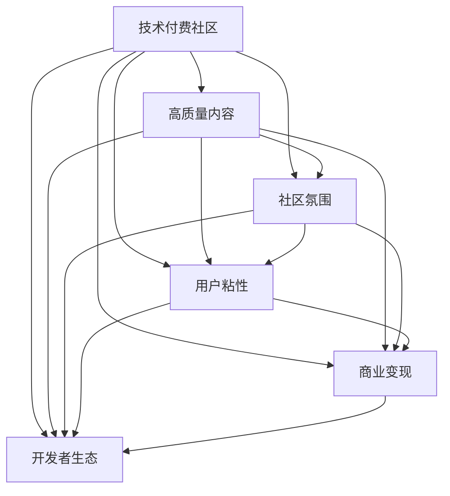

                 

# 程序员如何打造高质量的技术付费社区

> 关键词：技术付费社区，高质量内容，社区运营，用户粘性，商业变现，开发者生态

## 1. 背景介绍

### 1.1 问题由来

近年来，随着互联网技术的不断成熟和普及，技术的门槛在逐渐降低，更多的人开始涌入软件开发、人工智能等技术领域。然而，尽管技术门槛在降低，但高质量、深入浅出的技术内容依然是稀缺资源，很多人难以找到系统、详实的学习资料。在这样的背景下，技术付费社区应运而生。

技术付费社区，通过提供专业的技术内容、高质量的学习资源和实时的问题答疑，帮助开发者提升技能、解决问题，同时社区平台也能从中获得稳定的收入来源。这种模式既满足了开发者的学习需求，又为社区运营者提供了可持续的商业模式，一举两得。

### 1.2 问题核心关键点

为了成功打造高质量的技术付费社区，需要关注以下核心关键点：

- 如何高效生成高质量的原创内容，满足用户的学习需求。
- 如何构建和维护良好的社区氛围，提高用户粘性。
- 如何高效变现，确保社区的可持续性。
- 如何构建开放、健康的开发者生态，促进社区的良性循环。

这些关键点贯穿了社区的运营和发展的始终，需要在各个环节进行全面优化和设计。

## 2. 核心概念与联系

### 2.1 核心概念概述

在探讨如何打造高质量的技术付费社区前，首先需要理解相关的核心概念及其相互联系：

- **技术付费社区**：通过提供有价值的技术内容和服务，用户需要付费购买或订阅才能获取这些资源。这种模式既能保证内容的优质性，又能为运营者带来稳定的收入。
- **高质量内容**：系统、深入、实用的技术内容，能够帮助用户快速提升技能，解决实际问题。高质量的内容通常由有经验的开发者撰写，并在实践中经过不断验证和迭代。
- **社区氛围**：一个良好的社区氛围能够促进知识的共享和交流，提高用户粘性和参与度。社区氛围主要体现在用户的友好互动、积极讨论和持续贡献。
- **用户粘性**：用户对社区的依赖和忠诚度，是衡量社区健康的重要指标。高粘性的社区能够持续带来稳定的流量和收益。
- **商业变现**：通过多样化的变现手段，如订阅费、广告、企业合作等，为社区提供持续发展的动力。
- **开发者生态**：社区内开发者之间的互动、合作和互助，形成了良性循环的开发者生态。这种生态不仅能够提升社区的活力和影响力，还能吸引更多优秀开发者加入。

这些概念之间的联系可以通过以下Mermaid流程图来展示：



这个流程图展示了一系列的关联性：高质量的内容是社区的基础；良好的社区氛围和用户粘性能够吸引用户和开发者参与；商业变现提供社区运营的动力；开发者生态则能够进一步提升社区的影响力和活力。

## 3. 核心算法原理 & 具体操作步骤
### 3.1 算法原理概述

技术付费社区的核心算法原理，主要是通过以下几个关键步骤来实现：

1. **内容生成**：利用自然语言处理技术，自动生成高质量的技术内容。
2. **内容推荐**：通过机器学习算法，为用户推荐最相关、最有价值的内容。
3. **用户互动**：使用社交网络理论，促进用户之间的互动和讨论，提高社区活跃度。
4. **流量变现**：利用流量经济的原理，通过广告、付费订阅等方式变现。

这些步骤彼此相互依赖，共同构成了技术付费社区的运营体系。

### 3.2 算法步骤详解

接下来，我们将详细讲解每个步骤的具体操作：

#### 3.2.1 内容生成

**内容生成的主要步骤**：

1. **选题策划**：根据社区用户的需求和热点，制定内容选题计划。选题应具有实际应用价值和高度关注度。
2. **内容创作**：邀请有经验的开发者撰写文章、教程、视频等，确保内容的专业性和实用性。
3. **内容审核**：对提交的内容进行审核，确保其符合社区的质量标准。
4. **内容发布**：将审核通过的内容发布到社区平台上，供用户访问和互动。

**内容生成的算法流程**：

1. **选题生成算法**：利用大数据分析工具，分析用户搜索行为、关注热点和社区讨论主题，生成高质量的选题。
2. **内容创作算法**：采用自然语言生成技术，辅助开发者快速创作内容。
3. **内容审核算法**：使用机器学习模型，如文本分类、情感分析等，对内容进行自动审核，识别低质量、不实或有害信息。

#### 3.2.2 内容推荐

**内容推荐的主要步骤**：

1. **用户画像**：根据用户的行为数据和交互历史，构建用户画像，了解其兴趣和需求。
2. **内容匹配**：使用推荐算法，将用户画像与内容进行匹配，找到最相关的内容。
3. **结果排序**：根据匹配度、用户反馈等指标，对推荐结果进行排序，确保用户能看到最有价值的内容。

**内容推荐的算法流程**：

1. **用户画像生成算法**：使用协同过滤、深度学习等技术，构建用户画像。
2. **内容匹配算法**：采用基于向量空间模型、神经网络等方法，将用户画像与内容进行匹配。
3. **结果排序算法**：使用强化学习、排序算法等，对匹配结果进行排序，优化推荐效果。

#### 3.2.3 用户互动

**用户互动的主要步骤**：

1. **社区规则**：制定社区规则，规范用户行为，维护良好的社区氛围。
2. **讨论平台**：搭建讨论平台，如论坛、问答、聊天室等，促进用户互动。
3. **激励机制**：设计激励机制，如积分、排名、奖励等，鼓励用户积极参与。

**用户互动的算法流程**：

1. **社区规则生成算法**：根据社区需求和用户反馈，自动生成社区规则。
2. **讨论平台构建算法**：使用自然语言处理技术，构建讨论平台，确保平台界面友好、操作便捷。
3. **激励机制设计算法**：结合游戏设计理论，设计合理的激励机制，激发用户参与热情。

#### 3.2.4 流量变现

**流量变现的主要步骤**：

1. **广告投放**：在社区平台上投放广告，通过展示广告获得收入。
2. **付费订阅**：提供付费订阅服务，用户需要付费才能访问部分高质量内容。
3. **企业合作**：与企业合作，提供定制化的技术咨询、解决方案等服务，获得收益。

**流量变现的算法流程**：

1. **广告投放算法**：利用程序化广告技术，精准投放广告，优化广告效果。
2. **付费订阅算法**：使用定价策略算法，确定订阅价格，最大化收益。
3. **企业合作算法**：采用需求匹配算法，为社区找到合适的企业合作伙伴，提供定制化服务。

### 3.3 算法优缺点

**优点**：

1. **高效生成内容**：自然语言生成和推荐算法能够快速生成高质量的内容，满足用户需求。
2. **精准推荐**：推荐算法能够精准匹配用户兴趣，提高内容阅读率。
3. **用户粘性高**：良好的社区氛围和激励机制能够提高用户粘性，持续带来流量和收益。
4. **多样化变现**：多样化的变现手段能够确保社区的可持续发展。

**缺点**：

1. **内容质量难以保证**：尽管有算法辅助，但人工创作的环节仍然存在内容质量不均的问题。
2. **用户需求多变**：用户需求和热点变化快，需要持续优化算法和内容。
3. **社区维护成本高**：社区氛围和规则的维护需要大量的人力和物力投入。
4. **技术门槛高**：需要掌握自然语言处理、机器学习、推荐算法等技术，有一定技术门槛。

### 3.4 算法应用领域

技术付费社区已经在多个领域得到了广泛应用，例如：

- **软件开发**：通过提供高质量的编程教程、框架使用指南等，帮助开发者快速提升技能。
- **人工智能**：提供AI算法、模型调优、项目实战等资源，帮助AI开发者学习和应用AI技术。
- **数据科学**：提供数据处理、数据分析、数据可视化等工具和技术，提升数据科学家的工作效率。
- **运维工程**：提供云平台运维、DevOps工具、系统架构设计等知识，帮助运维工程师提升运维水平。

除了这些主流领域，技术付费社区还在游戏开发、设计、用户体验等更多领域发挥着重要作用。随着技术的不断进步，技术付费社区的应用范围还将进一步扩大，为技术传播和应用带来更多便利。

## 4. 数学模型和公式 & 详细讲解 & 举例说明
### 4.1 数学模型构建

在本节中，我们将使用数学语言对技术付费社区的核心算法进行更加严格的刻画。

假设社区中的用户数量为 $U$，内容数量为 $C$，内容推荐算法生成的匹配结果为 $M$，广告投放策略为 $A$，订阅用户数量为 $S$，企业合作数量为 $E$。

根据以上定义，我们可以构建社区运营的数学模型：

1. **内容生成模型**：
   $$
   M_U = f_U(U, C)
   $$
   其中 $f_U$ 为内容生成函数，将用户 $U$ 和内容 $C$ 映射为推荐结果 $M_U$。

2. **内容推荐模型**：
   $$
   M_C = f_C(C, M_U)
   $$
   其中 $f_C$ 为内容推荐函数，将内容 $C$ 和推荐结果 $M_U$ 映射为最终推荐结果 $M_C$。

3. **用户互动模型**：
   $$
   A_U = g_U(U, M_C)
   $$
   其中 $g_U$ 为互动生成函数，将用户 $U$ 和推荐结果 $M_C$ 映射为广告投放策略 $A_U$。

4. **流量变现模型**：
   $$
   R_S = h_S(S, A_U, E)
   $$
   其中 $h_S$ 为变现函数，将订阅用户数量 $S$、广告投放策略 $A_U$ 和企业合作数量 $E$ 映射为流量变现收入 $R_S$。

5. **社区规则模型**：
   $$
   R_E = i_E(E, A_U)
   $$
   其中 $i_E$ 为规则生成函数，将企业合作数量 $E$ 和广告投放策略 $A_U$ 映射为规则结果 $R_E$。

### 4.2 公式推导过程

在上述数学模型中，每个函数的具体形式需要根据实际情况进行调整。下面以内容推荐模型为例，推导其基本公式：

设用户 $u$ 对内容 $c$ 的兴趣度为 $I(u,c)$，内容 $c$ 的推荐度为 $R(c)$，用户 $u$ 的交互历史为 $H(u)$。则内容推荐模型可以表示为：

1. **兴趣度计算**：
   $$
   I(u,c) = \sum_{h \in H(u)} w_h f_h(u, c)
   $$
   其中 $w_h$ 为历史权重，$f_h$ 为历史兴趣度函数，计算用户 $u$ 对内容 $c$ 的历史兴趣度。

2. **推荐度计算**：
   $$
   R(c) = \sum_{u \in U} I(u,c) \cdot p_u(c)
   $$
   其中 $p_u(c)$ 为用户 $u$ 对内容 $c$ 的预测概率，可以通过训练模型获得。

3. **匹配度计算**：
   $$
   M_U = \{c | I(u,c) \cdot R(c) > \epsilon\}
   $$
   其中 $\epsilon$ 为匹配阈值，确定最终推荐结果 $M_U$。

通过上述公式，我们可以计算出用户 $u$ 的内容推荐结果 $M_U$，进而通过互动生成函数 $g_U$ 计算出广告投放策略 $A_U$，最终通过变现函数 $h_S$ 计算出流量变现收入 $R_S$。

### 4.3 案例分析与讲解

为了更好地理解这些数学模型和公式的应用，我们以一个具体的案例进行分析：

假设一个技术付费社区有 10,000 名用户和 1,000 篇内容，通过内容推荐算法，推荐给用户一篇内容。内容推荐算法基于用户兴趣度和内容质量进行匹配，生成推荐结果 $M_U$。

1. **内容生成过程**：
   - 内容 $c_1$ 的兴趣度 $I(u_1,c_1) = 0.8$，历史权重 $w_h = 0.6$，兴趣度函数 $f_h(u_1, c_1) = 0.7$。
   - 内容 $c_1$ 的推荐度 $R(c_1) = 0.9$，用户 $u_1$ 的预测概率 $p_{u_1}(c_1) = 0.85$。
   - 匹配度 $M_U = \{c_1\}$，生成推荐结果 $M_U = \{c_1\}$。

2. **内容推荐过程**：
   - 广告投放策略 $A_U = 0.2$，表示用户 $u_1$ 对内容 $c_1$ 感兴趣的概率为 20%。
   - 变现收入 $R_S = 100$，表示社区通过广告投放获得 100 元的收益。

3. **用户互动过程**：
   - 规则生成函数 $i_E = 0.5$，表示企业合作 $E = 500$ 对广告投放策略 $A_U$ 的影响为 50%。
   - 规则结果 $R_E = 50$，表示社区通过规则生成获得 50 元的收益。

通过以上分析，我们可以看到，技术付费社区的各个环节和变量通过数学模型和公式得以量化和优化，为社区的运营提供了科学依据。

## 5. 项目实践：代码实例和详细解释说明
### 5.1 开发环境搭建

在进行技术付费社区的项目实践前，我们需要准备好开发环境。以下是使用Python进行Flask开发的环境配置流程：

1. 安装Anaconda：从官网下载并安装Anaconda，用于创建独立的Python环境。

2. 创建并激活虚拟环境：
```bash
conda create -n flask-env python=3.8 
conda activate flask-env
```

3. 安装Flask：
```bash
pip install Flask
```

4. 安装Flask-RESTful：
```bash
pip install Flask-RESTful
```

5. 安装Flask-SQLAlchemy：
```bash
pip install Flask-SQLAlchemy
```

6. 安装Flask-WTF：
```bash
pip install Flask-WTF
```

完成上述步骤后，即可在`flask-env`环境中开始项目实践。

### 5.2 源代码详细实现

下面以一个简单的技术付费社区平台为例，给出使用Flask和SQLAlchemy构建社区的PyTorch代码实现。

首先，定义数据库模型：

```python
from flask_sqlalchemy import SQLAlchemy

db = SQLAlchemy()

class User(db.Model):
    id = db.Column(db.Integer, primary_key=True)
    username = db.Column(db.String(64), unique=True, nullable=False)
    email = db.Column(db.String(120), unique=True, nullable=False)
    password_hash = db.Column(db.String(128))
    is_admin = db.Column(db.Boolean, default=False)
```

然后，定义Flask应用：

```python
from flask import Flask, render_template, request, redirect, url_for
from flask_restful import Api
from flask_sqlalchemy import SQLAlchemy
from flask_login import LoginManager, login_user, logout_user, login_required, current_user

app = Flask(__name__)
app.config['SQLALCHEMY_DATABASE_URI'] = 'sqlite:///data.db'
db.init_app(app)
api = Api(app)
login_manager = LoginManager()
login_manager.init_app(app)

@login_manager.user_loader
def load_user(user_id):
    return User.query.get(int(user_id))
```

接着，定义用户登录、注册等路由：

```python
from flask_login import login_user, logout_user, login_required, current_user
from flask_wtf import FlaskForm
from wtforms import StringField, PasswordField, SubmitField
from wtforms.validators import DataRequired, Length, Email, EqualTo
from flask_wtf.csrf import CSRFProtect

csrf = CSRFProtect(app)

class LoginForm(FlaskForm):
    email = StringField('Email', validators=[DataRequired(), Email()])
    password = PasswordField('Password', validators=[DataRequired()])
    submit = SubmitField('Log In')

@app.route('/login', methods=['GET', 'POST'])
def login():
    form = LoginForm()
    if form.validate_on_submit():
        user = User.query.filter_by(email=form.email.data).first()
        if user is None or not user.check_password(form.password.data):
            return redirect(url_for('login'))
        login_user(user)
        return redirect(url_for('index'))
    return render_template('login.html', title='Log In', form=form)

@app.route('/logout')
@login_required
def logout():
    logout_user()
    return redirect(url_for('index'))
```

最后，启动Flask应用并测试：

```python
if __name__ == '__main__':
    app.run(debug=True)
```

以上就是使用Flask和SQLAlchemy构建技术付费社区平台的完整代码实现。可以看到，Flask的灵活性和SQLAlchemy的数据库支持使得社区平台的开发变得简洁高效。开发者可以进一步完善用户管理、内容管理、广告投放等模块，实现更丰富的功能。

### 5.3 代码解读与分析

让我们再详细解读一下关键代码的实现细节：

**User模型**：
- `__init__`方法：初始化用户信息，包括用户名、邮箱、密码等。
- `id`字段：数据库自增主键。
- `username`字段：用户唯一标识。
- `email`字段：用户邮箱，用于登录。
- `password_hash`字段：用户密码的哈希值，用于密码验证。
- `is_admin`字段：表示用户是否为管理员。

**Flask应用**：
- `__init__`方法：初始化Flask应用，并配置SQLAlchemy数据库连接。
- `config`属性：配置数据库URI。
- `db.init_app(app)`：初始化SQLAlchemy。
- `api`属性：初始化Flask-RESTful。
- `login_manager`属性：初始化Flask-Login。

**用户登录路由**：
- `login`方法：处理用户登录请求。
- `form`变量：封装登录表单。
- `form.validate_on_submit()`：表单提交后，进行数据验证。
- `User.query.filter_by(email=form.email.data).first()`：查询用户，检查邮箱和密码是否匹配。
- `login_user(user)`：登录用户。
- `render_template`：渲染登录页面。

**用户注册路由**：
- 与用户登录路由类似，只是增加了注册表单。

**用户退出路由**：
- `logout`方法：处理用户退出请求。
- `logout_user()`：注销用户。

以上代码实现了基本的用户登录、注册和退出功能，可以作为技术付费社区平台的基础模块。开发者可以在此基础上，继续完善更多功能和界面，构建完整的社区应用。

## 6. 实际应用场景
### 6.1 智能客服系统

基于技术付费社区的智能客服系统，可以通过引入开发者社区和专家资源，快速部署智能客服解决方案。社区平台可以为智能客服系统提供丰富的知识库和算法模型，提升客服系统的响应速度和问题解决能力。

具体而言，社区可以收集企业内部的客服数据，利用自然语言处理技术进行标注，然后对BERT等预训练模型进行微调，得到高质量的智能客服模型。这些模型可以实时接入客服系统，对用户提问进行智能回答，并提供持续的知识更新和算法改进。

### 6.2 金融风险控制

在金融领域，技术付费社区可以为金融机构提供实时风险控制服务。社区平台可以整合多源金融数据，通过机器学习算法进行风险分析，提供早期预警和风险评估。

具体而言，社区可以建立多个金融风控模型，包括信用评估、欺诈检测、舆情分析等。这些模型可以通过社区平台发布，供金融机构进行调用，实时监控金融市场的风险变化。金融机构可以根据模型结果，采取相应的风险控制措施，保障金融资产的安全。

### 6.3 在线教育平台

在线教育平台可以利用技术付费社区的知识资源，为学生提供高质量的学习资源和实时答疑。社区平台可以提供系统化的课程体系和深入浅出的学习材料，同时引入专家资源，进行在线授课和实时互动。

具体而言，社区可以发布多种课程和教学资源，包括视频教程、在线测试、编程练习等。学生可以通过社区平台进行学习和测试，遇到问题时可以通过在线答疑平台，向社区专家或师生提问，获取实时解答。

### 6.4 未来应用展望

随着技术付费社区的不断发展和完善，未来的应用场景将更加丰富多样。以下是几个可能的应用方向：

1. **医疗健康**：为医疗机构提供健康知识库和在线咨询，提升医疗服务的智能化水平。社区可以发布健康知识、医疗案例、在线咨询等资源，帮助用户查询健康问题，获取医疗建议。
2. **智能家居**：为智能家居平台提供设备兼容性测试和解决方案，提升用户使用体验。社区可以发布智能家居设备兼容测试报告、开发指南等资源，帮助用户选择和安装智能家居设备。
3. **环境保护**：为环保组织提供环境知识库和监测数据，提升环境保护工作的智能化水平。社区可以发布环境知识、监测数据、环保案例等资源，帮助用户了解环境问题，参与环保行动。

此外，技术付费社区还可以应用于更多行业领域，如交通出行、旅游规划、法律咨询等，为各行业的数字化转型和智能化升级提供支持和帮助。

## 7. 工具和资源推荐
### 7.1 学习资源推荐

为了帮助开发者系统掌握技术付费社区的理论基础和实践技巧，这里推荐一些优质的学习资源：

1. **《Python Web开发》**：一本系统介绍Web开发技术的书籍，涵盖Flask、SQLAlchemy等库的使用。
2. **《Flask Web开发》**：一本详细讲解Flask框架的书籍，包括Flask-RESTful、Flask-Login等扩展库的使用。
3. **《Python自然语言处理》**：一本全面介绍自然语言处理技术的书籍，涵盖自然语言生成、推荐算法等前沿技术。
4. **《深度学习入门》**：一本通俗易懂的深度学习入门书籍，适合初学者阅读。
5. **Coursera的《机器学习》课程**：由斯坦福大学教授Andrew Ng主讲，系统介绍机器学习理论和实践。

通过对这些资源的学习实践，相信你一定能够快速掌握技术付费社区的理论基础和实践技巧，为社区的运营和发展提供有力支持。

### 7.2 开发工具推荐

高效的开发离不开优秀的工具支持。以下是几款用于技术付费社区开发的常用工具：

1. **Flask**：基于Python的开源Web框架，灵活、高效，适合快速迭代开发。
2. **SQLAlchemy**：开源的数据库ORM工具，支持多种数据库，灵活高效。
3. **Flask-RESTful**：基于Flask的RESTful开发工具，适合构建API服务。
4. **Flask-Login**：基于Flask的用户登录和管理工具，简单易用。
5. **WTForms**：基于Flask的表单处理工具，支持多种表单验证。
6. **SQLAlchemy**：开源的数据库ORM工具，支持多种数据库，灵活高效。

合理利用这些工具，可以显著提升技术付费社区的开发效率，加快创新迭代的步伐。

### 7.3 相关论文推荐

技术付费社区的发展离不开学界的持续研究。以下是几篇奠基性的相关论文，推荐阅读：

1. **《A Survey of Recommendation Systems》**：一篇综述论文，系统介绍推荐系统的发展历程和最新研究成果。
2. **《Machine Learning for Human-Machine Interaction》**：一篇关于机器学习在人机交互中的应用综述，涵盖自然语言处理、推荐算法等技术。
3. **《Deep Learning for NLP》**：一本介绍深度学习在自然语言处理领域应用的书籍，涵盖文本生成、推荐算法等前沿技术。
4. **《Social Media Mining and Statistical Learning》**：一本关于社交媒体数据分析和机器学习应用的书籍，涵盖社交网络分析、推荐算法等技术。
5. **《Natural Language Processing with Python》**：一本全面介绍自然语言处理技术的书籍，涵盖NLP技术和实践案例。

这些论文代表了大语言模型微调技术的发展脉络。通过学习这些前沿成果，可以帮助研究者把握学科前进方向，激发更多的创新灵感。

## 8. 总结：未来发展趋势与挑战
### 8.1 总结

本文对技术付费社区的构建进行了全面系统的介绍。首先阐述了技术付费社区的背景和重要性，明确了社区运营的核心关键点。其次，从原理到实践，详细讲解了社区构建的各个环节和步骤，给出了完整的代码实例。同时，本文还探讨了技术付费社区在多个行业领域的应用前景，展示了社区的广阔发展空间。最后，本文精选了社区构建的学习资源和开发工具，力求为开发者提供全方位的技术指引。

通过本文的系统梳理，我们可以看到，技术付费社区为开发者提供了高效、灵活的学习平台和交流渠道，有助于提升技术传播和应用效率。未来，随着技术付费社区的不断发展和完善，相信将为更多行业带来深远影响，加速数字化和智能化进程。

### 8.2 未来发展趋势

展望未来，技术付费社区将呈现以下几个发展趋势：

1. **内容生成自动化**：随着自然语言生成技术的发展，社区可以自动生成高质量的原创内容，满足用户的学习需求。
2. **推荐算法多样化**：社区将引入更多的推荐算法，如协同过滤、深度学习等，提高内容的个性化推荐效果。
3. **用户互动多样化**：社区将提供更多的互动方式，如直播、视频会议等，促进用户之间的交流和协作。
4. **流量变现多元化**：社区将引入更多的变现手段，如付费订阅、知识付费、广告投放等，确保社区的可持续发展。
5. **社区生态开放化**：社区将构建开放、健康的开发者生态，吸引更多的开发者加入，提升社区的影响力和活力。

以上趋势凸显了技术付费社区的广阔前景。这些方向的探索发展，必将进一步提升社区的运营效率和用户体验，推动技术付费社区迈向成熟。

### 8.3 面临的挑战

尽管技术付费社区已经取得了一定的成绩，但在迈向更加智能化、普适化应用的过程中，它仍面临以下挑战：

1. **内容质量控制**：社区需要不断优化内容生成算法，确保内容的质量和准确性。
2. **用户需求变化快**：社区需要持续跟踪用户需求变化，及时调整推荐算法和内容。
3. **社区管理复杂**：社区需要制定和维护规则，确保良好的社区氛围和用户互动。
4. **技术门槛高**：社区需要掌握自然语言处理、机器学习、推荐算法等技术，有一定技术门槛。
5. **隐私和安全**：社区需要确保用户数据的安全和隐私保护，避免数据泄露和滥用。

这些挑战需要社区运营者不断优化算法和技术，提高运营效率，提升用户体验。只有不断应对和克服这些挑战，社区才能持续健康发展。

### 8.4 研究展望

面对技术付费社区所面临的挑战，未来的研究需要在以下几个方面寻求新的突破：

1. **内容生成算法优化**：开发更加智能、高效的内容生成算法，提升内容质量和生成速度。
2. **推荐算法改进**：引入更多高效、多样化的推荐算法，提高推荐精度和个性化水平。
3. **用户互动优化**：通过自然语言处理和社交网络分析，优化用户互动方式，提高社区活跃度。
4. **变现手段多样化**：引入更多变现手段，如知识付费、众筹、广告等，提升社区收入。
5. **社区管理自动化**：开发自动化管理工具，提高社区规则制定和执行效率。

这些研究方向的探索，必将推动技术付费社区迈向更高的台阶，为技术传播和应用带来更多便利。面向未来，社区需要不断创新和优化，才能在激烈的市场竞争中保持领先地位。

## 9. 附录：常见问题与解答

**Q1：如何保证社区内容的质量？**

A: 保证社区内容的质量是社区运营的关键，以下是几种有效的策略：

1. **内容审核机制**：建立严格的内容审核机制，人工审核和自动化审核相结合，确保内容的质量和准确性。
2. **用户反馈机制**：引入用户反馈机制，用户可以举报低质量内容，社区管理员及时处理。
3. **专家评审机制**：邀请领域专家进行评审，确保高价值内容的发布。
4. **数据驱动分析**：利用数据分析工具，监控内容质量指标，及时调整内容生成算法。

**Q2：如何提高用户粘性？**

A: 提高用户粘性是社区运营的核心目标，以下是几种有效的策略：

1. **内容丰富度**：提供丰富多样的高质量内容，满足用户的学习需求。
2. **互动体验**：提供多种互动方式，如在线答疑、讨论组、直播等，促进用户之间的交流和协作。
3. **激励机制**：设计合理的激励机制，如积分、排名、奖励等，激发用户参与热情。
4. **社区氛围**：营造积极、友好的社区氛围，增强用户归属感。

**Q3：如何实现高效的流量变现？**

A: 高效的流量变现是社区运营的重要指标，以下是几种有效的策略：

1. **多样化变现手段**：引入多种变现手段，如付费订阅、知识付费、广告等。
2. **精准广告投放**：利用程序化广告技术，精准投放广告，优化广告效果。
3. **社区电商**：引入社区电商，通过销售相关产品或服务，增加收入来源。
4. **企业合作**：与企业合作，提供定制化的技术咨询、解决方案等服务。

**Q4：如何处理用户投诉和纠纷？**

A: 处理用户投诉和纠纷是社区运营的重要环节，以下是几种有效的策略：

1. **明确规则**：制定清晰的社区规则，用户应明确知道哪些行为是不可接受的。
2. **快速响应**：建立高效的投诉处理机制，快速响应用户投诉，及时解决问题。
3. **多渠道沟通**：提供多种沟通渠道，如邮件、论坛、客服等，方便用户反馈问题。
4. **社区调解**：引入社区调解机制，帮助用户和解纠纷，维护社区和谐。

通过这些策略，社区可以有效地处理用户投诉和纠纷，提升用户满意度，维护社区秩序。

**Q5：如何确保用户数据的安全和隐私保护？**

A: 确保用户数据的安全和隐私保护是社区运营的重要职责，以下是几种有效的策略：

1. **数据加密**：对用户数据进行加密存储和传输，防止数据泄露。
2. **隐私政策**：制定完善的隐私政策，明确用户数据的收集、使用和保护方式。
3. **安全审计**：定期进行安全审计，发现和修复潜在的安全漏洞。
4. **用户授权**：在收集用户数据时，获取用户的明确授权，并告知数据的使用方式。

通过这些策略，社区可以确保用户数据的安全和隐私保护，提升用户信任度。

---

作者：禅与计算机程序设计艺术 / Zen and the Art of Computer Programming

