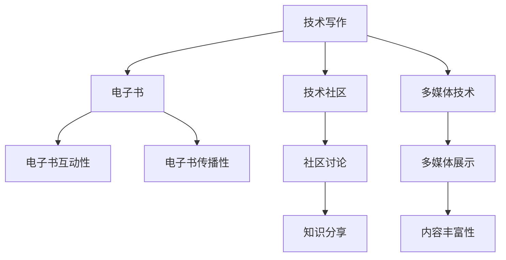

                 

## 1. 背景介绍

在互联网与数字化转型的浪潮下，技术的更新迭代速度日益加快，新的工具、框架和库层出不穷。作为一名有志于贡献自己智慧的程序员，如何将自己的技术知识和实践经验整理成易于理解、可操作的电子书，成为提升自身影响力、帮助他人成长的有效方式。

### 1.1 技术写作的重要性

技术写作不仅能展示个人的技术水平和专业素养，更能够通过分享，帮助其他开发者更好地理解复杂的技术概念、设计思想和实践方法，从而加速技术普及和应用。此外，技术写作也是积累知识、梳理思维的重要手段，能有效提升个人解决问题的能力。

### 1.2 电子书的发展趋势

随着互联网技术的发展，电子书已不再仅仅是纸质书籍的数字版，而是集合了视频、互动元素、社区讨论等多媒体形式的综合性产品。高质量的电子书，能通过多样化的展示形式，全面、深入地阐述技术原理和应用方法，帮助读者系统掌握相关知识。

## 2. 核心概念与联系

### 2.1 核心概念概述

打造高质量的技术电子书，需要明确几个关键概念：

- **技术写作（Technical Writing）**：将复杂的技术概念、代码实现、应用场景等用通俗易懂的文字、图片、视频等形式呈现，便于读者理解和实践。
- **电子书（E-book）**：基于互联网和数字化技术的书籍形式，能提供多媒体、互动性强的阅读体验。
- **技术社区（Technical Community）**：通过线上讨论、论坛、博客等形式，促进技术交流和知识共享的平台。
- **多媒体技术（Multimedia Technology）**：包括文本、图片、视频、音频等多形式内容的集成应用。

这些概念紧密相连，共同构成高质量技术电子书的制作基础。

### 2.2 核心概念原理和架构的 Mermaid 流程图



这个流程图展示了技术写作、电子书、技术社区和多媒体技术之间的联系。技术写作是电子书内容的核心，而技术社区和多媒体技术则是提升电子书互动性和传播性的关键要素。

## 3. 核心算法原理 & 具体操作步骤

### 3.1 算法原理概述

制作高质量技术电子书的过程，可以类比为算法设计中的特征选择和优化过程。核心目标是通过合理选择和组合内容形式（即特征），最大化提升读者理解和实践的效率。

- **特征选择**：从技术文档、代码示例、图示、视频等多种形式中选择最合适的展示方式。
- **特征优化**：根据目标读者群体的特征（如技术水平、学习习惯等），调整内容的深度和广度，以达到最佳的传播效果。
- **特征组合**：通过合理的结构组织，使内容能够连贯、有逻辑地传递给读者，帮助其构建完整的知识体系。

### 3.2 算法步骤详解

打造高质量的技术电子书，主要包括以下几个关键步骤：

**Step 1: 确定目标读者和内容方向**
- 明确目标读者的技术水平和知识背景。
- 确定电子书的核心内容和目标，如系统架构设计、应用框架使用、前沿技术探索等。

**Step 2: 设计电子书结构和内容**
- 确定电子书的大纲和章节，保证内容的逻辑连贯和结构清晰。
- 每个章节的标题、副标题、目录等需要简洁明了，指引读者快速定位所需内容。
- 在每个章节内，选择适当的技术文档、代码示例、图示、视频等多种形式的内容组合。

**Step 3: 编写和审核技术文档**
- 使用清晰的语言和结构化的方法撰写技术文档，避免冗长和复杂的描述。
- 结合图示、代码片段、引用示例等辅助说明，提升文档的可读性和实用性。
- 邀请同行或专家审核文档，确保准确性和权威性。

**Step 4: 制作电子书多媒体元素**
- 选择恰当的文本、图片、视频等形式，增强电子书的表现力和互动性。
- 确保多媒体元素的质量和一致性，避免技术细节的缺失和错误。
- 根据不同的读者群体，优化多媒体元素的使用策略，如提供中英文双语、不同速度的视频等。

**Step 5: 整合技术社区和互动元素**
- 在电子书中加入技术社区的链接和讨论区，鼓励读者参与互动和交流。
- 通过在线问答、代码库、技术博客等方式，提供丰富的学习资源和支持服务。
- 定期更新电子书内容，引入最新的技术进展和案例分析，保持其时效性。

**Step 6: 发布和推广电子书**
- 选择合适的电子书发布平台和传播渠道，如Github Pages、Medium、知乎专栏等。
- 利用社交媒体、技术博客、社区论坛等渠道，推广电子书，吸引更多读者关注和使用。
- 收集读者反馈，不断改进和优化电子书内容。

### 3.3 算法优缺点

高质量技术电子书制作的主要优点包括：

- **提升学习效率**：通过多媒体、互动元素等形式的结合，帮助读者更直观地理解和实践技术。
- **扩大影响力**：借助技术社区和传播渠道，提升技术知识和经验的传播范围和影响力。
- **促进交流与合作**：技术社区的互动元素，鼓励读者分享和讨论，促进技术和知识共享。

缺点方面，需要特别注意：

- **制作复杂度**：多媒体元素的制作和整合，以及社区互动的维护，需要投入大量时间和精力。
- **持续更新难度**：技术领域的快速迭代要求电子书内容不断更新，以保持其时效性和权威性。
- **读者适应性**：内容形式和结构的多样性可能对部分读者造成一定学习负担。

### 3.4 算法应用领域

技术电子书的制作，不仅能应用于软件开发、系统架构设计、数据分析等领域，还能延伸到跨学科的技术分享，如数据科学、人工智能、区块链等。通过多样化形式的内容展示和社区互动，帮助各行各业的从业者获取技术知识，提升整体行业水平。

## 4. 数学模型和公式 & 详细讲解 & 举例说明

### 4.1 数学模型构建

技术文档的制作，可以通过以下数学模型来描述：

$$
\text{电子书质量} = f(\text{内容质量}, \text{形式多样性}, \text{社区互动度}, \text{多媒体元素质量})
$$

其中，$f$ 表示各项因素的综合作用。

### 4.2 公式推导过程

内容质量方面，可通过以下公式衡量：

$$
\text{内容质量} = \frac{\text{文档清晰度}}{\text{冗余度}} \times \text{例证丰富度}
$$

其中，文档清晰度通过文本的可读性指标（如Flesch-Kincaid易读性评分）来衡量，例证丰富度则通过文档中代码示例、图示、引用资料的数量和质量来评价。

形式多样性可通过以下公式表示：

$$
\text{形式多样性} = \text{文本比例} + \text{图片比例} + \text{视频比例} + \text{互动元素比例}
$$

社区互动度可以通过以下指标来衡量：

$$
\text{社区互动度} = \text{用户评论数量} + \text{论坛讨论活跃度} + \text{代码库引用次数}
$$

多媒体元素质量可通过用户反馈和专业评价来综合评估：

$$
\text{多媒体元素质量} = \text{用户满意度} + \text{专业评价分数}
$$

### 4.3 案例分析与讲解

以《深入理解TensorFlow》一书为例，该书通过以下几个方面提升电子书质量：

1. **内容质量**：使用清晰的语言和结构化的方法，详细讲解TensorFlow的核心概念和应用场景，并提供大量的代码示例和图示。
2. **形式多样性**：除了文本内容，书中还包括在线教程、代码库链接、实际案例分析等形式的多样化内容，增强读者的实践能力。
3. **社区互动度**：通过GitHub页面提供代码示例和文档的源代码，吸引读者提交PR和问题讨论，形成活跃的技术社区。
4. **多媒体元素质量**：使用高质量的屏幕截图、动画视频等，清晰地展示TensorFlow的操作和效果，提升读者的学习体验。

## 5. 项目实践：代码实例和详细解释说明

### 5.1 开发环境搭建

首先，需要安装必要的开发工具和框架。以Markdown和Jupyter Notebook为例，具体的安装命令如下：

```bash
conda install jupyterlab nbconvert 
pip install markdown
```

### 5.2 源代码详细实现

下面是一个简单的Jupyter Notebook代码示例，用于展示如何将代码片段嵌入到Markdown文档中：

```python
from markdown import markdown

# 定义代码示例
code_example = """
def add(a, b):
    return a + b
"""

# 将代码示例转换为Markdown格式
md_code = markdown(code_example, mode="gfm")

# 输出Markdown格式的代码示例
print(md_code)
```

执行上述代码，会在Markdown文档块中显示如下代码片段：

```python
def add(a, b):
    return a + b
```

### 5.3 代码解读与分析

上述代码通过Markdown的`markdown`函数将Python代码转换为Markdown格式，实现了在技术文档中嵌入代码的功能。这种嵌入方式不仅方便阅读，还支持代码高亮和自动执行，极大地提升了技术文档的交互性。

### 5.4 运行结果展示

在Markdown文档中嵌入代码后，可以通过GitHub Pages等平台发布电子书，读者可以在线阅读和交互。例如，在GitHub上创建一个仓库，并添加Markdown文件，使用`nbconvert`命令将Notebook文件转换为HTML格式，即可在线发布。

## 6. 实际应用场景

### 6.1 软件开发

在软件开发过程中，高质量的技术电子书能够帮助开发者系统学习新技术、理解复杂架构、解决实际问题。例如，通过阅读《Python Cookbook》一书，开发者可以快速掌握Python语言的高级用法，提升编程效率。

### 6.2 系统架构设计

系统架构设计中的技术电子书，能帮助架构师了解不同技术栈的优缺点，评估各种架构方案的可行性和优劣。例如，《微服务架构设计模式》一书提供了丰富的架构案例和设计原则，为架构师提供系统设计的借鉴。

### 6.3 数据分析

数据分析领域的技术电子书，能帮助数据科学家和分析师掌握最新的数据分析技术和工具。例如，《Python数据科学手册》通过丰富的案例和实践示例，帮助读者快速上手数据科学领域的核心技术。

### 6.4 未来应用展望

随着技术社区和数字化技术的不断发展，技术电子书的应用场景将进一步扩展：

1. **跨学科知识共享**：技术电子书可以跨越不同学科和领域，促进跨学科知识的学习和交流。
2. **远程教育和培训**：在线技术电子书成为远程教育和培训的重要资源，帮助全球范围内的学习者获取技术知识。
3. **智能工具集成**：技术电子书可以与智能搜索、语音助手等工具集成，实现知识自动推荐和检索，提升学习的便捷性。

## 7. 工具和资源推荐

### 7.1 学习资源推荐

为了帮助开发者系统掌握技术电子书的制作技巧，以下是几个推荐的学习资源：

1. **《技术写作的艺术》（"The Art of Technical Writing"）**：该书系统介绍了技术写作的基本原则和实践方法，是技术写作领域的经典之作。
2. **《电子书设计指南》（"The E-book Design Guide"）**：专注于电子书设计的专业书籍，提供了丰富的电子书设计和优化技巧。
3. **Coursera《技术写作与编辑》课程（"Technical Writing and Editing" on Coursera）**：由知名大学和专家授课的技术写作课程，涵盖电子书制作、多媒体元素应用等多个方面。
4. **Medium博客**：Medium平台上大量高质量的技术博客和电子书，提供了丰富的案例和实践经验。
5. **Google Books**：Google Books提供的电子书搜索功能，可以帮助读者找到高质量的技术书籍资源。

### 7.2 开发工具推荐

以下是几款用于技术电子书制作和出版的常用工具：

1. **Markdown编辑器**：如Typora、Jekyll、Github Pages等，支持Markdown格式编写和发布电子书。
2. **Jupyter Notebook**：支持Python等编程语言的交互式开发和文档编写，便于展示代码示例和数据分析。
3. **LaTeX编辑器**：如Overleaf、TeXstudio等，支持生成高质量的学术和技术文档。
4. **Sphinx文档生成工具**：支持生成静态网站，适合制作详细和系统的技术手册。
5. **GitHub Pages**：免费且易于使用的平台，支持静态网站的托管和发布。

### 7.3 相关论文推荐

以下是几篇关于技术写作和电子书制作的经典论文，推荐阅读：

1. **《技术文档在开发过程中的重要性》（"Importance of Technical Documentation in Development Processes"）**：探讨技术文档在软件开发过程中的作用和实践方法。
2. **《电子书设计的用户体验研究》（"User Experience Studies in E-book Design"）**：分析用户对电子书界面和功能的使用体验，提供优化建议。
3. **《跨领域知识共享：技术书评和社区讨论的结合》（"Cross-domain Knowledge Sharing: Combining Book Reviews and Community Discussions"）**：讨论技术书籍与技术社区的结合，提升知识共享效果。

## 8. 总结：未来发展趋势与挑战

### 8.1 研究成果总结

高质量技术电子书的制作，不仅能够提升个人的技术水平和影响力，还能促进技术的普及和应用。当前，技术写作和电子书制作正成为软件开发、系统架构设计等领域的重要趋势。

### 8.2 未来发展趋势

未来，技术电子书的制作将呈现以下几个发展趋势：

1. **多媒体化和互动化**：通过视频、动画等多媒体元素，增强电子书的表现力和互动性。
2. **跨学科融合**：技术电子书将跨越不同学科和领域，促进跨学科知识的学习和交流。
3. **远程教育和培训**：在线电子书成为远程教育和培训的重要资源，提升全球学习者的技术素养。
4. **智能工具集成**：技术电子书可以与智能搜索、语音助手等工具集成，实现知识自动推荐和检索。

### 8.3 面临的挑战

尽管技术电子书具有诸多优点，但在制作和推广过程中，仍面临以下挑战：

1. **内容质量保证**：确保技术文档的准确性和权威性，避免误导读者。
2. **用户体验优化**：提升电子书的多媒体元素质量和阅读体验，吸引更多读者关注。
3. **技术社区建设**：维护和活跃技术社区，增强读者的互动和参与。
4. **持续更新维护**：技术领域的快速迭代要求电子书内容不断更新，以保持其时效性和权威性。

### 8.4 研究展望

未来的研究应在以下几个方面寻求新的突破：

1. **智能化内容生成**：通过人工智能技术，自动生成高质量的技术文档和多媒体元素，提升电子书制作效率。
2. **跨平台和设备适配**：开发跨平台和设备的电子书展示方式，提升技术文档的通用性和可访问性。
3. **增强现实和虚拟现实**：利用增强现实和虚拟现实技术，增强技术文档的互动性和沉浸感。
4. **个性化推荐系统**：引入个性化推荐系统，根据读者的学习习惯和兴趣，智能推荐相关技术和资源。

## 9. 附录：常见问题与解答

**Q1：如何确保技术文档的准确性和权威性？**

A: 确保技术文档的准确性和权威性，可以通过以下几个步骤实现：
1. **引用权威资料**：引用学术文章、官方文档、开源项目等权威资料，增强文档的可靠性。
2. **同行评审**：邀请技术领域的专家和同行对文档进行评审，提供反馈和修正意见。
3. **持续更新**：定期更新文档内容，引入最新的技术进展和实践经验。

**Q2：技术文档中的代码示例如何保证正确性？**

A: 保证技术文档中的代码示例正确性，可以通过以下方法：
1. **运行测试**：在发布代码示例前，运行代码并进行测试，确保其能够正常运行。
2. **版本控制**：使用Git等版本控制工具，跟踪代码示例的变化，确保其与文档内容保持一致。
3. **社区验证**：通过技术社区和读者反馈，及时发现和修正代码示例中的错误。

**Q3：电子书的多媒体元素如何确保质量和一致性？**

A: 确保电子书多媒体元素的质量和一致性，可以通过以下方法：
1. **专业设计**：聘请专业的设计师或使用高质量的模板，确保多媒体元素的设计和排版符合规范。
2. **统一标准**：制定多媒体元素的标准和规范，确保其风格和格式的一致性。
3. **用户测试**：邀请用户测试电子书的多媒体元素，收集反馈并不断优化。

**Q4：如何维护和活跃技术社区？**

A: 维护和活跃技术社区，可以通过以下方法：
1. **定期发布内容**：定期发布技术博客、代码示例、教程等，保持社区的活跃度。
2. **互动讨论**：鼓励社区成员进行技术讨论和问题解答，建立积极的互动氛围。
3. **用户激励**：通过点赞、评论、分享等方式，激励用户积极参与社区活动。

**Q5：如何提升电子书的多媒体元素质量？**

A: 提升电子书的多媒体元素质量，可以通过以下方法：
1. **专业制作**：聘请专业的视频制作团队或使用高质量的视频编辑软件，确保多媒体元素的质量。
2. **用户反馈**：收集用户的反馈和建议，不断改进多媒体元素的内容和形式。
3. **多样化展示**：提供中英文双语、不同速度的视频等多样化的多媒体元素，满足不同用户的需求。

---

作者：禅与计算机程序设计艺术 / Zen and the Art of Computer Programming

