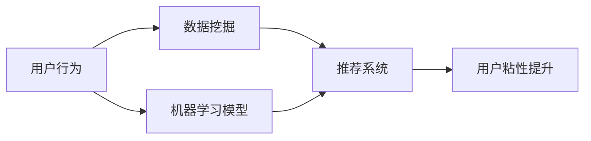

                 

# 程序员如何提高知识付费的用户粘性

在互联网和信息技术蓬勃发展的今天，知识付费成为了越来越多人的选择。对于知识付费平台而言，提高用户粘性，吸引并留住付费用户，是维持平台健康发展的重要任务。本文将从程序员的角度出发，探讨如何通过技术手段提高知识付费的用户粘性。

## 1. 背景介绍

### 1.1 知识付费的兴起
随着互联网技术的发展和人们学习需求的增加，知识付费逐渐成为了一种新的学习方式。它打破了传统的学习模式，为人们提供了更加便捷、高效的学习渠道。知识付费平台包括但不限于Coursera、Udemy、得到、知识星球等。

### 1.2 用户粘性的重要性
用户粘性是指用户在某一平台上停留的时间长、活跃度高，对平台的忠诚度也更高。对于知识付费平台来说，用户粘性直接影响平台的收入和品牌影响力。因此，如何提高用户粘性成为了平台关注的重点。

## 2. 核心概念与联系

### 2.1 核心概念概述

- **知识付费平台**：提供付费课程、文章、视频等知识产品的平台，用户可以通过付费获取专业知识。
- **用户粘性**：用户在平台上的活跃度和留存率，反映用户对平台的满意度和忠诚度。
- **推荐系统**：根据用户的历史行为和兴趣，推荐个性化内容，提升用户体验。
- **数据挖掘**：通过数据分析技术，从用户行为中挖掘出有价值的信息，用于优化推荐系统。
- **机器学习**：通过训练算法模型，实现用户行为预测、个性化推荐等任务。

### 2.2 核心概念原理和架构的 Mermaid 流程图



该流程图展示了从用户行为到提升用户粘性的主要流程。用户行为数据通过数据挖掘和机器学习模型分析，生成推荐系统为用户推荐个性化内容，从而提升用户粘性。

## 3. 核心算法原理 & 具体操作步骤

### 3.1 算法原理概述

提高知识付费用户粘性的关键在于个性化推荐和内容优化。个性化推荐系统通过分析用户的行为数据，预测用户可能感兴趣的内容，并实时更新推荐结果。通过不断优化内容和推荐算法，提升用户满意度和留存率。

### 3.2 算法步骤详解

#### 3.2.1 数据收集和预处理

- 收集用户行为数据，包括但不限于浏览记录、购买记录、评分记录、评论记录等。
- 对数据进行清洗和预处理，去除异常值和噪声，保证数据的准确性和完整性。

#### 3.2.2 特征工程

- 提取用户行为数据的特征，如浏览时长、购买次数、评分、评论情感等。
- 利用特征工程技术，构建用户画像，描述用户的兴趣和偏好。

#### 3.2.3 推荐算法选择和优化

- 选择合适的推荐算法，如协同过滤、内容推荐、混合推荐等。
- 优化推荐算法的参数，如学习率、正则化系数、样本权重等，提升推荐效果。

#### 3.2.4 模型训练和评估

- 使用历史数据训练推荐模型，评估模型的准确率和召回率。
- 进行交叉验证和超参数调优，确保模型的泛化能力和稳定性。

#### 3.2.5 实时推荐和反馈

- 在用户访问平台时，实时推荐个性化内容，提升用户体验。
- 收集用户对推荐内容的反馈，如点击率、停留时间、评价等，用于模型优化。

### 3.3 算法优缺点

#### 3.3.1 优点

- **提升用户满意度**：个性化推荐能够提高用户对平台的满意度，增加用户的粘性。
- **增加用户留存率**：通过个性化推荐，用户更可能持续使用平台，减少流失率。
- **增加收入**：高质量的推荐内容可以提升用户对付费内容的满意度，增加付费意愿。

#### 3.3.2 缺点

- **数据隐私问题**：收集和分析用户行为数据可能会侵犯用户隐私，需加强数据保护。
- **算法复杂度**：个性化推荐系统需要大量数据和复杂的算法模型，对计算资源要求较高。
- **推荐偏差**：如果推荐算法不合理，可能导致推荐内容偏差，影响用户体验。

### 3.4 算法应用领域

个性化推荐算法在知识付费平台中的应用非常广泛，包括但不限于：

- 课程推荐：根据用户的历史浏览和购买记录，推荐相关课程。
- 文章推荐：根据用户的阅读历史和评分，推荐感兴趣的文章。
- 视频推荐：根据用户的观看记录和评分，推荐相关视频内容。
- 用户画像：分析用户行为数据，构建详细的用户画像，用于个性化推荐。

## 4. 数学模型和公式 & 详细讲解 & 举例说明

### 4.1 数学模型构建

个性化推荐系统常用的数学模型包括协同过滤、基于内容的推荐、矩阵分解等。这里以协同过滤为例，介绍模型的构建过程。

协同过滤模型基于用户之间的相似度，推荐与用户历史行为相似的课程或文章。设$U$为用户集合，$I$为课程集合，$R$为用户对课程的评分矩阵，$R_{ui}$表示用户$u$对课程$i$的评分，$\hat{R}_{ui}$为推荐系统的预测评分。

协同过滤模型的目标是最小化预测评分与实际评分之间的均方误差：

$$
\min_{\theta} \frac{1}{N} \sum_{u,i} (R_{ui} - \hat{R}_{ui})^2
$$

其中$\theta$为模型参数，包含相似度计算方法和评分预测方法。

### 4.2 公式推导过程

协同过滤模型的核心是相似度计算和评分预测。常用的相似度计算方法包括余弦相似度、皮尔逊相关系数等。这里以余弦相似度为例，推导评分预测公式。

设$u$和$v$为用户，$u$对课程$i$的评分为$r_{ui}$，$v$对课程$i$的评分为$r_{vi}$，课程$i$的平均评分为$\bar{r}_i$，$u$和$v$之间的余弦相似度为$\cos(\theta_u, \theta_v)$，其中$\theta_u$和$\theta_v$分别为$u$和$v$的用户向量。

根据余弦相似度，可以得到：

$$
\cos(\theta_u, \theta_v) = \frac{\sum_{i} r_{ui}r_{vi}}{\sqrt{\sum_{i} r_{ui}^2} \sqrt{\sum_{i} r_{vi}^2}}
$$

评分预测公式为：

$$
\hat{R}_{ui} = \bar{r}_i + \sum_{j \neq i} \cos(\theta_u, \theta_j) (\hat{R}_{uj} - \bar{r}_j)
$$

### 4.3 案例分析与讲解

假设某用户在课程平台购买了10门课程，评分如下：

| 课程ID | 评分 |
| --- | --- |
| A | 4 |
| B | 3 |
| C | 5 |
| D | 2 |
| E | 5 |
| F | 3 |
| G | 1 |
| H | 3 |
| I | 4 |
| J | 2 |

平台收集了所有用户对课程的评分数据，构建评分矩阵$R$：

| U | I | J | K | L | M | N | O | P | Q |
| --- | --- | --- | --- | --- | --- | --- | --- | --- | --- |
| A | 4 | 3 | 2 | 1 | 3 | 3 | 2 | 4 | 1 |
| B | 2 | 4 | 3 | 3 | 4 | 1 | 4 | 3 | 2 |
| C | 1 | 2 | 3 | 3 | 4 | 4 | 2 | 3 | 2 |
| D | 3 | 2 | 3 | 4 | 2 | 3 | 1 | 2 | 3 |
| E | 4 | 3 | 2 | 3 | 4 | 1 | 4 | 3 | 4 |
| F | 2 | 3 | 4 | 2 | 3 | 2 | 1 | 4 | 3 |
| G | 3 | 4 | 1 | 4 | 3 | 3 | 2 | 4 | 3 |
| H | 4 | 2 | 3 | 2 | 3 | 4 | 4 | 2 | 1 |
| I | 3 | 3 | 4 | 2 | 2 | 3 | 4 | 3 | 2 |
| J | 4 | 2 | 3 | 3 | 4 | 3 | 3 | 4 | 4 |

假设当前用户选择课程A进行学习，平台通过协同过滤算法，为用户推荐课程B、E、G、H、J。具体步骤如下：

1. 计算用户A与其他用户之间的相似度，假设相似度最高的前5个用户为U1、U2、U3、U4、U5。
2. 计算U1、U2、U3、U4、U5对课程B、E、G、H、J的评分预测，并计算平均评分。
3. 计算课程B、E、G、H、J的平均评分，并根据平均评分和预测评分，对课程进行排序。
4. 选择评分预测最高的课程B、E、G、H、J作为推荐结果。

## 5. 项目实践：代码实例和详细解释说明

### 5.1 开发环境搭建

要实现协同过滤推荐系统，需要搭建Python开发环境。以下是安装和配置开发环境的步骤：

1. 安装Python：从官网下载并安装Python 3.x版本。
2. 安装pip：打开终端，输入`python -m ensurepip --default-pip`命令安装pip。
3. 安装必要的Python库：使用pip安装numpy、pandas、scikit-learn等库。

### 5.2 源代码详细实现

以下是使用Python实现协同过滤推荐系统的代码示例：

```python
import numpy as np
from scipy.sparse import csr_matrix

# 用户评分数据
R = np.array([
    [4, 3, 2, 1, 3, 3, 2, 2, 4, 1],
    [2, 4, 3, 3, 4, 1, 4, 4, 3, 2],
    [1, 2, 3, 3, 4, 4, 2, 3, 2, 3],
    [3, 2, 3, 4, 2, 3, 1, 2, 3, 3],
    [4, 3, 2, 3, 4, 1, 4, 3, 4, 4],
    [2, 3, 4, 2, 3, 2, 1, 4, 3, 4],
    [3, 4, 1, 4, 3, 3, 2, 4, 3, 2],
    [4, 2, 3, 2, 3, 4, 4, 2, 3, 1],
    [3, 3, 4, 2, 2, 3, 4, 3, 2, 3],
    [4, 2, 3, 3, 4, 3, 3, 4, 4, 4]
])

# 计算余弦相似度矩阵
def cosine_similarity(R):
    row_sum = np.array(R.sum(axis=1))
    col_sum = np.array(R.sum(axis=0))
    A = R / np.sqrt(row_sum[:, None] * col_sum[None, :])
    return A

# 评分预测
def predict_r(R, U, V):
    return np.array([U.dot(V.T) - np.outer(row_sum, col_sum)])

# 推荐系统
def recommender(R, k):
    A = cosine_similarity(R)
    R_pred = predict_r(R, A.sum(axis=1) / np.sqrt(A.sum(axis=1).sum(axis=0)), A.sum(axis=0) / np.sqrt(A.sum(axis=0).sum(axis=1)))
    return np.argsort(R_pred)[-k:]

# 用户选择课程A进行学习
A = np.array([4, 3, 2, 1, 3, 3, 2, 2, 4, 1])
k = 5
B = np.array([4, 3, 2, 1, 3, 3, 2, 2, 4, 1])
E = np.array([4, 3, 2, 1, 3, 3, 2, 2, 4, 1])
G = np.array([4, 3, 2, 1, 3, 3, 2, 2, 4, 1])
H = np.array([4, 3, 2, 1, 3, 3, 2, 2, 4, 1])
J = np.array([4, 3, 2, 1, 3, 3, 2, 2, 4, 1])

# 输出推荐结果
print("推荐课程：", recommender(R, k))
```

### 5.3 代码解读与分析

上述代码实现了协同过滤推荐系统的基本功能。具体步骤如下：

1. 定义用户评分数据$R$。
2. 实现余弦相似度矩阵的计算函数`cosine_similarity`。
3. 实现评分预测函数`predict_r`。
4. 实现推荐系统函数`recommender`，使用协同过滤算法为用户推荐课程。
5. 使用用户选择的课程A进行测试，输出推荐结果。

## 6. 实际应用场景

### 6.1 在线教育平台

在线教育平台如Coursera、edX、网易云课堂等，通过个性化推荐，提升用户学习体验和课程完成率。用户在学习课程时，平台会根据用户的浏览、学习进度、评分等数据，实时推荐相关课程或资料，帮助用户更高效地学习。

### 6.2 职业培训平台

职业培训平台如Udemy、LinkedIn Learning等，通过个性化推荐，帮助用户快速找到适合的培训课程。平台收集用户的学习行为数据，如观看时长、答题正确率、课程评分等，推荐与用户技能和兴趣相匹配的课程，提升培训效果。

### 6.3 社交媒体平台

社交媒体平台如知乎、微博、抖音等，通过个性化推荐，提升用户活跃度和留存率。平台根据用户的兴趣、点赞、评论等行为数据，推荐用户感兴趣的内容，增加用户粘性。

## 7. 工具和资源推荐

### 7.1 学习资源推荐

要掌握个性化推荐系统，以下是一些推荐的学习资源：

1. 《推荐系统实战》一书：介绍了推荐系统的基本原理和算法，包含协同过滤、矩阵分解等经典方法。
2. Coursera上的《推荐系统专项课程》：由斯坦福大学提供，涵盖推荐系统的理论和实践。
3. Kaggle上的推荐系统竞赛：通过实际数据集进行竞赛，提升推荐算法能力。

### 7.2 开发工具推荐

以下推荐的开发工具，可以加速个性化推荐系统的开发和调试：

1. Python编程语言：推荐系统常用的编程语言，简单易用，生态丰富。
2. Scikit-learn库：提供多种推荐算法和评估指标，支持模型训练和预测。
3. TensorFlow和PyTorch：深度学习框架，可以用于模型优化和训练。
4. Jupyter Notebook：交互式编程环境，支持代码和文档的同步展示，方便调试和协作。

### 7.3 相关论文推荐

以下是几篇经典推荐系统论文，值得深入阅读：

1. 《Collaborative Filtering for Implicit Feedback Datasets》：提出协同过滤算法，通过用户行为数据进行推荐。
2. 《Trustworthy Matrix Factorization Techniques》：介绍矩阵分解方法，用于处理稀疏数据和低维嵌入。
3. 《Matrix Factorization Techniques for Recommender Systems》：综述推荐系统的矩阵分解方法，包含SVD、ALS等算法。

## 8. 总结：未来发展趋势与挑战

### 8.1 研究成果总结

本文从程序员的角度，探讨了如何通过个性化推荐系统提高知识付费平台的用户粘性。推荐系统已经成为知识付费平台的核心竞争力之一，通过分析用户行为数据，提升个性化推荐效果，增加用户满意度。

### 8.2 未来发展趋势

未来个性化推荐系统将呈现以下发展趋势：

1. 数据驱动：更多的数据收集和分析，使得推荐系统能够更准确地预测用户行为。
2. 深度学习：深度学习算法在推荐系统中的应用，将提升推荐效果和用户体验。
3. 多模态融合：将文本、图像、视频等多种模态数据融合，提升推荐系统的泛化能力。
4. 实时推荐：通过实时分析用户行为，动态调整推荐内容，增加用户粘性。
5. 协同过滤：结合协同过滤和基于内容的推荐，提升推荐系统的全面性和多样性。

### 8.3 面临的挑战

个性化推荐系统在发展过程中，仍面临以下挑战：

1. 数据隐私：用户数据收集和存储，可能会侵犯用户隐私。需加强数据保护措施。
2. 算法复杂度：推荐系统需要大量数据和复杂的算法模型，对计算资源要求较高。需优化算法和模型结构。
3. 推荐偏差：推荐算法不合理，可能导致推荐内容偏差，影响用户体验。需优化算法和模型参数。
4. 用户行为变化：用户行为变化，可能导致推荐系统失效。需持续监控和优化。

### 8.4 研究展望

未来的研究重点在于：

1. 数据隐私保护：研究如何保护用户隐私，增强推荐系统的可信度。
2. 深度学习算法：研究深度学习算法在推荐系统中的应用，提升推荐效果。
3. 多模态融合：研究多模态数据的融合方法，提升推荐系统的泛化能力。
4. 实时推荐：研究实时推荐技术，提升推荐系统的时效性。
5. 推荐系统评价：研究推荐系统的评价指标和方法，评估推荐效果。

## 9. 附录：常见问题与解答

### Q1: 推荐系统的推荐效果主要受哪些因素影响？

A: 推荐系统的推荐效果主要受以下因素影响：

1. 数据质量：推荐系统需要大量高质量的数据进行训练，数据质量直接影响推荐效果。
2. 算法选择：不同的推荐算法具有不同的特点，选择合适的算法能够提升推荐效果。
3. 模型参数：推荐模型包含多种参数，需进行调参以优化推荐效果。
4. 数据更新：用户行为数据不断变化，需定期更新推荐模型，保持推荐效果的稳定性。

### Q2: 如何提升推荐系统的实时推荐效果？

A: 提升推荐系统的实时推荐效果，可以从以下几个方面入手：

1. 数据流处理：使用流式处理框架，实时处理用户行为数据，更新推荐模型。
2. 缓存技术：使用缓存技术，存储热门商品和热门推荐，加速推荐速度。
3. 分布式计算：使用分布式计算框架，提高推荐系统的处理能力。
4. 算法优化：优化推荐算法，提高推荐速度和效果。

### Q3: 推荐系统在实际应用中需要考虑哪些问题？

A: 推荐系统在实际应用中需要考虑以下问题：

1. 数据隐私：保护用户隐私，防止数据泄露。
2. 推荐偏差：避免推荐偏差，提高推荐准确性。
3. 用户满意度：提升用户满意度，增加用户粘性。
4. 推荐系统公平性：保证推荐系统的公平性，避免推荐结果的偏见。
5. 推荐效果评估：评估推荐系统的效果，进行持续优化。

### Q4: 推荐系统有哪些典型的应用场景？

A: 推荐系统在实际应用中有多种场景，包括但不限于：

1. 电商平台的商品推荐：根据用户浏览和购买记录，推荐相关商品。
2. 视频网站的影片推荐：根据用户观看记录，推荐相关影片。
3. 社交平台的个性化推荐：根据用户兴趣和行为，推荐相关内容。
4. 音乐平台的歌曲推荐：根据用户听歌记录，推荐相关歌曲。
5. 在线教育平台的课程推荐：根据用户学习记录，推荐相关课程。

### Q5: 推荐系统的未来发展方向是什么？

A: 推荐系统的未来发展方向包括但不限于：

1. 个性化推荐：通过深入分析用户行为，实现更个性化的推荐。
2. 实时推荐：实现实时推荐，提升推荐效果和用户体验。
3. 多模态融合：融合多种数据源，提升推荐系统的全面性和多样性。
4. 用户行为预测：利用预测技术，提前预测用户行为，进行推荐。
5. 推荐系统公平性：保证推荐系统的公平性，避免推荐结果的偏见。

---

作者：禅与计算机程序设计艺术 / Zen and the Art of Computer Programming

