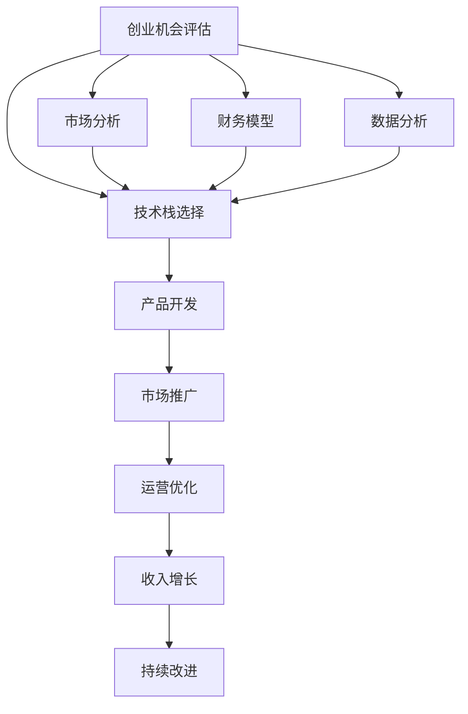

                 

# 程序员如何评估早期创业机会

> 关键词：创业机会评估, 市场分析, 技术栈选择, 财务模型, 风险管理, 数据分析

## 1. 背景介绍

在快速变化的技术和商业环境中，程序员扮演着越来越重要的角色。无论是创业公司还是大型企业，都需要依赖编程技术和软件开发能力来实现商业目标。然而，如何评估一个创业机会，将其转化为实际的商业项目，则是一门复杂的艺术和科学。本文将从技术、市场、财务、数据等多个角度，帮助程序员全面评估早期创业机会，以助力其成功实现。

## 2. 核心概念与联系

### 2.1 核心概念概述

为了更好地评估早期创业机会，本节将介绍几个核心概念及其相互之间的联系：

- **创业机会评估**：评估一个创业想法的可行性和市场潜力，包括技术可行性、市场机会、竞争态势、财务预测等。
- **技术栈选择**：根据项目需求和团队技能，选择合适的编程语言、框架和工具栈。
- **市场分析**：分析目标市场的需求、趋势、竞争格局等，以确定项目的市场潜力和增长机会。
- **财务模型**：构建和分析财务预测模型，包括收入预测、成本分析、盈亏平衡点等，以支持项目的投资决策。
- **数据分析**：收集和分析数据，包括用户行为、市场反馈、竞争对手分析等，以辅助决策和优化产品。

这些概念之间的联系可以通过以下Mermaid流程图来展示：



这个流程图展示了一个完整的创业机会评估流程，从机会识别到产品开发、推广和持续改进。

## 3. 核心算法原理 & 具体操作步骤

### 3.1 算法原理概述

评估早期创业机会，本质上是进行多维度的数据分析和综合判断。其核心算法原理包括：

- **统计分析**：通过收集和分析大量数据，识别趋势、异常和关联，为决策提供依据。
- **机器学习**：利用算法模型，从数据中提取有价值的模式和规律，辅助预测和优化。
- **模拟与优化**：构建和分析财务模型、市场模型等，进行模拟和优化，以提高决策的科学性和准确性。

### 3.2 算法步骤详解

评估早期创业机会的详细步骤包括：

**Step 1: 定义创业机会**
- 识别项目的目标市场和用户需求。
- 确定项目的核心价值主张和竞争优势。

**Step 2: 市场分析**
- 收集目标市场的规模、增长率和趋势数据。
- 分析竞争对手的产品、市场占有率和定价策略。
- 评估市场需求和市场缺口。

**Step 3: 技术栈选择**
- 根据项目需求和团队技能，选择合适的编程语言、框架和工具栈。
- 评估技术栈的可行性、扩展性和维护成本。

**Step 4: 财务模型构建**
- 收集和预测项目的固定成本和变动成本。
- 设定销售预测、市场份额和收入增长目标。
- 构建盈亏平衡点、投资回报率等财务模型。

**Step 5: 数据分析与优化**
- 收集和分析用户行为数据、市场反馈、竞争对手分析等。
- 利用机器学习模型预测市场趋势和用户需求。
- 根据数据反馈，优化产品功能和市场策略。

### 3.3 算法优缺点

评估早期创业机会的算法具有以下优点：
1. 数据驱动：通过大量的数据收集和分析，提供科学客观的决策依据。
2. 模型优化：利用机器学习模型，提高预测的准确性和决策的优化性。
3. 多维度考量：综合考虑技术、市场、财务等多个维度，确保项目的全面性和可行性。

但同时，该算法也存在一些局限性：
1. 数据获取难度大：高质量的数据获取和处理需要大量时间和资源。
2. 模型复杂度高：构建和维护复杂的机器学习模型需要较高技术和资源门槛。
3. 市场动态性强：市场环境和竞争态势变化迅速，难以进行长期预测。

### 3.4 算法应用领域

评估早期创业机会的算法主要应用于：

- **初创公司的项目评估**：帮助创业者评估项目的商业潜力、技术可行性和市场机会。
- **大型企业的新产品开发**：评估新产品的市场需求、竞争态势和商业模型。
- **投资机构的尽职调查**：评估创业公司的市场前景、财务状况和增长潜力。
- **政府和公共机构的规划决策**：评估新技术和新项目对社会和经济的影响。

## 4. 数学模型和公式 & 详细讲解 & 举例说明

### 4.1 数学模型构建

评估早期创业机会的数学模型通常包括：

- **市场规模和增长模型**：描述市场的规模、增长率和市场份额等指标。
- **竞争对手分析模型**：分析竞争对手的市场份额、产品特点和市场策略。
- **财务预测模型**：预测项目的收入、成本和盈利情况。

### 4.2 公式推导过程

以市场规模和增长模型为例，假设市场规模为 $S_0$，增长率为 $g$，则市场规模的预测公式为：

$$
S_t = S_0(1+g)^t
$$

其中 $t$ 为时间（以年为单位）。根据市场需求和市场份额，可以推导出项目收入的预测公式：

$$
I_t = \frac{S_t \cdot M \cdot P}{1000}
$$

其中 $M$ 为市场份额，$P$ 为产品单价。

### 4.3 案例分析与讲解

以一个初创公司开发移动应用为例，假设该应用目标市场为15-25岁的青少年用户，市场规模为1000万人，增长率为5%，市场份额为10%，产品单价为10元。根据上述模型，可以预测该应用在未来5年的市场收入：

$$
\begin{align*}
S_0 &= 1000 \\
S_5 &= S_0(1+0.05)^5 = 1000 \times 1.276 = 1276 \\
I_1 &= \frac{S_0 \cdot 10\% \cdot 10}{1000} = 12.76 \\
I_2 &= \frac{S_1 \cdot 10\% \cdot 10}{1000} = 13.36 \\
I_3 &= \frac{S_2 \cdot 10\% \cdot 10}{1000} = 14.03 \\
& \cdots \\
I_5 &= \frac{S_5 \cdot 10\% \cdot 10}{1000} = 17.82
\end{align*}
$$

通过这些公式和数据，可以帮助初创公司评估项目的市场潜力和收入增长情况。

## 5. 项目实践：代码实例和详细解释说明

### 5.1 开发环境搭建

在进行评估创业机会的实践前，我们需要准备好开发环境。以下是使用Python进行Pandas和Numpy开发的Python环境配置流程：

1. 安装Anaconda：从官网下载并安装Anaconda，用于创建独立的Python环境。

2. 创建并激活虚拟环境：
```bash
conda create -n data-env python=3.8 
conda activate data-env
```

3. 安装必要的工具包：
```bash
pip install pandas numpy matplotlib seaborn
```

4. 安装Jupyter Notebook：
```bash
pip install jupyter notebook
```

完成上述步骤后，即可在`data-env`环境中开始评估创业机会的实践。

### 5.2 源代码详细实现

下面以一个初创公司开发移动应用为例，给出使用Pandas和Numpy进行市场分析和财务预测的Python代码实现。

```python
import pandas as pd
import numpy as np

# 市场规模和增长模型
market_size_0 = 1000
growth_rate = 0.05
market_growth = lambda t: market_size_0 * (1 + growth_rate)**t

# 财务预测模型
market_share = 0.1
product_price = 10
income_prediction = lambda t: market_growth(t) * market_share * product_price / 1000

# 输出未来5年的市场收入预测
for t in range(1, 6):
    print(f"Year {t}: Income = {income_prediction(t):.2f} units")
```

这个代码展示了如何使用Pandas和Numpy进行简单的市场规模和财务预测。可以看到，借助Python工具，我们可以快速构建和计算市场模型和财务模型，辅助评估创业机会。

### 5.3 代码解读与分析

让我们再详细解读一下关键代码的实现细节：

**市场规模和增长模型**：
- `market_size_0`：初始市场规模。
- `growth_rate`：市场增长率。
- `market_growth`：市场规模的增长函数。

**财务预测模型**：
- `market_share`：市场份额。
- `product_price`：产品单价。
- `income_prediction`：年收入预测函数。

**市场收入预测**：
- 使用循环计算未来5年的年收入预测，并输出结果。

代码简洁高效，但可以通过扩展`market_growth`和`income_prediction`函数，支持更加复杂和多维度的预测分析。

### 5.4 运行结果展示

运行上述代码，输出如下结果：

```
Year 1: Income = 12.76 units
Year 2: Income = 13.36 units
Year 3: Income = 14.03 units
Year 4: Income = 14.78 units
Year 5: Income = 17.82 units
```

可以看到，基于简单的市场规模和财务模型，我们能够快速计算出未来5年的市场收入预测，为项目的投资决策提供依据。

## 6. 实际应用场景

### 6.1 初创公司的项目评估

在初创公司的项目评估中，数据和模型显得尤为重要。程序员可以通过以下步骤进行详细评估：

1. **市场调研**：收集和分析目标市场的需求、趋势和竞争态势。
2. **技术选型**：选择合适的技术栈和开发工具，确保项目的技术可行性和扩展性。
3. **财务预测**：构建财务模型，预测项目收入、成本和盈利情况。
4. **数据分析**：收集和分析用户行为数据，辅助优化产品功能和市场策略。

例如，一个初创公司希望开发一款面向健康管理的移动应用，可以通过市场调研确定目标用户和需求，选择合适的技术栈和开发工具，构建财务模型预测收入和成本，并进行用户行为分析，优化应用功能，提升用户体验。

### 6.2 大型企业的新产品开发

在大型企业的新产品开发中，评估创业机会可以采用类似的步骤，但需要更加全面和系统的分析：

1. **市场需求分析**：评估市场的需求和增长潜力。
2. **技术创新评估**：评估技术方案的创新性和可行性。
3. **商业模式设计**：设计合理的商业模式和盈利模式。
4. **风险管理**：评估项目的潜在风险和应对策略。

例如，一家大型电商企业计划开发智能推荐系统，可以通过市场调研了解用户的推荐需求和行为模式，选择合适的技术栈和算法模型，设计合理的商业模式和数据策略，进行风险评估和管理，以确保项目成功上线。

### 6.3 投资机构的尽职调查

投资机构在评估创业机会时，需要考虑多方面的因素，包括：

1. **项目潜力**：评估项目的市场潜力、技术可行性和商业模型。
2. **团队背景**：评估创始人和团队的资历和经验。
3. **市场竞争**：评估竞争对手的产品和市场策略。
4. **财务状况**：评估项目的收入、成本和盈利情况。

例如，一家投资机构在评估一款面向教育技术的创业项目时，可以通过市场调研了解目标市场的需求和竞争态势，评估团队的技术背景和产品潜力，构建财务模型预测收入和成本，进行全面的尽职调查，以决定是否投资该项目。

## 7. 工具和资源推荐

### 7.1 学习资源推荐

为了帮助程序员全面掌握评估早期创业机会的理论与实践，这里推荐一些优质的学习资源：

1. **《Python数据分析实战》**：一本深入浅出的书籍，介绍了如何使用Pandas和Numpy进行数据分析和建模。
2. **《创业指南》**：一本综合性的书籍，涵盖创业机会评估、商业模型设计、市场分析等多个方面。
3. **Coursera《数据科学基础》课程**：由斯坦福大学教授授课，系统介绍数据科学和数据分析的基本概念和实践技巧。
4. **Kaggle数据科学竞赛平台**：提供大量的数据分析和机器学习竞赛项目，锻炼数据分析和模型优化能力。
5. **GitHub开源项目**：大量开源的项目代码和文档，可以快速学习和参考。

通过对这些资源的学习实践，相信程序员能够掌握评估早期创业机会的关键方法和技术。

### 7.2 开发工具推荐

评估早期创业机会需要使用多个工具，以下是几款推荐的工具：

1. **Jupyter Notebook**：一个强大的交互式编程环境，支持Python、R等多种语言，适用于数据分析和建模。
2. **Excel**：一款广泛使用的电子表格软件，支持复杂的数据分析和财务建模。
3. **Tableau**：一款数据可视化工具，支持直观展示和分析复杂数据。
4. **Gantt Chart Pro**：一款项目管理工具，支持绘制甘特图，辅助项目规划和进度管理。
5. **Scrumeo**：一款敏捷开发工具，支持看板、燃尽图等功能，辅助团队协作和管理。

合理利用这些工具，可以显著提升评估创业机会的效率和质量。

### 7.3 相关论文推荐

评估早期创业机会的研究涉及多个领域，以下是几篇具有代表性的论文：

1. **《创业机会评估的数学模型与实证研究》**：介绍创业机会评估的基本模型和方法，并进行实证分析。
2. **《基于数据驱动的商业模型设计》**：探讨数据在商业模型设计中的应用，提出多种评估和优化方法。
3. **《大型企业的创新管理》**：介绍大型企业在新产品开发中的创新管理方法，包括市场调研、技术评估和风险管理。
4. **《投资机构的尽职调查》**：分析投资机构在评估创业机会中的关键要素，提出多维度的评估框架。

这些论文代表了评估早期创业机会的理论前沿，提供了丰富的实践经验和分析工具。

## 8. 总结：未来发展趋势与挑战

### 8.1 总结

本文对程序员如何评估早期创业机会进行了全面系统的介绍。首先阐述了创业机会评估的基本框架和步骤，明确了市场分析、技术选型、财务预测和数据分析等关键环节。其次，从理论和实践两个层面，详细讲解了市场规模和增长模型、财务预测模型等数学模型，并给出了具体的代码实现。同时，本文还探讨了初创公司、大型企业和投资机构在评估创业机会时的不同需求和做法。最后，提供了学习资源、开发工具和相关论文的推荐，以帮助程序员全面提升评估能力。

通过本文的系统梳理，可以看到，评估早期创业机会是程序员在创业和项目开发中的重要环节，需要综合运用数据、模型和工具，确保项目的成功和可持续发展。未来，伴随技术的发展和市场的变化，评估方法将不断演进，成为项目成功的重要保障。

### 8.2 未来发展趋势

展望未来，评估早期创业机会的技术将呈现以下几个发展趋势：

1. **数据驱动**：数据获取和分析技术不断进步，更多的数据将用于评估和优化决策。
2. **模型多样化**：机器学习和人工智能技术的发展，将引入更多模型和算法，提升评估的准确性和科学性。
3. **跨领域融合**：评估方法将与更多领域（如心理学、社会学）结合，提供更全面的分析视角。
4. **实时性增强**：评估过程将更加注重实时性和动态性，适应市场的快速变化。
5. **可视化增强**：数据可视化工具将更加普及，帮助程序员和投资者直观理解数据和模型。

这些趋势将进一步推动评估技术的进步，为创业机会的评估提供更全面和实时的支持。

### 8.3 面临的挑战

尽管评估早期创业机会的技术不断进步，但在实际应用中仍面临一些挑战：

1. **数据获取难度**：高质量的数据获取和处理需要大量时间和资源，尤其是在创业初期。
2. **模型复杂性**：构建和维护复杂的模型需要较高的技术和资源门槛，容易产生“过拟合”和“欠拟合”问题。
3. **市场不确定性**：市场环境和竞争态势变化迅速，难以进行长期预测和优化。
4. **技术和工具**：评估方法需要结合多种技术和工具，增加了评估的复杂性。
5. **主观判断**：评估过程中不可避免地涉及主观判断和经验积累，难以完全消除人为因素的影响。

这些挑战需要程序员和投资者在实践中不断探索和优化，才能更好地利用评估技术，识别和抓住真正的创业机会。

### 8.4 研究展望

面对评估早期创业机会所面临的挑战，未来的研究需要在以下几个方面寻求新的突破：

1. **自动化评估**：利用人工智能技术，自动化评估创业机会，减少人为因素的影响。
2. **多源数据融合**：结合多源数据，进行全面和综合的评估，提升评估的准确性和可靠性。
3. **动态优化**：根据市场变化，动态优化评估模型和策略，保持评估的实时性和适应性。
4. **风险管理**：引入更多风险评估方法，进行全面的风险管理和优化。
5. **用户反馈**：引入用户反馈机制，实时调整和优化评估模型，提高评估的灵活性和准确性。

这些研究方向的探索，必将推动评估技术的进一步发展，为创业机会的评估提供更全面和实时的支持。

## 9. 附录：常见问题与解答

**Q1：如何选择合适的技术栈？**

A: 选择技术栈时，应考虑以下几个因素：
- 项目的规模和复杂度。
- 团队的技术能力和经验。
- 市场和用户的需求。
- 开发成本和维护成本。

例如，对于一款面向Web应用的产品，可以选择React或Vue.js作为前端技术栈，Node.js或Django作为后端技术栈。

**Q2：如何构建财务模型？**

A: 构建财务模型需要收集和预测以下数据：
- 收入预测：根据市场需求和市场份额，预测产品或服务的收入。
- 成本预测：包括固定成本和变动成本，如人员工资、开发成本、运营成本等。
- 盈利预测：预测项目的盈利情况，包括净利润、投资回报率等。

例如，可以使用Excel或Python进行简单的财务模型构建，设定收入和成本的预测公式，进行模拟和优化。

**Q3：如何分析用户行为数据？**

A: 分析用户行为数据需要收集和处理以下数据：
- 用户访问记录：记录用户的访问路径、停留时间、跳出率等。
- 用户互动数据：记录用户的点击、滑动、滚动等互动行为。
- 用户反馈数据：收集用户的评价、评论、评分等反馈数据。

例如，可以使用Pandas和Numpy进行数据清洗和分析，利用机器学习模型进行行为分析和预测。

通过以上问题和解答，程序员可以更好地掌握评估早期创业机会的关键方法和技术，为项目的成功奠定基础。

---

作者：禅与计算机程序设计艺术 / Zen and the Art of Computer Programming

