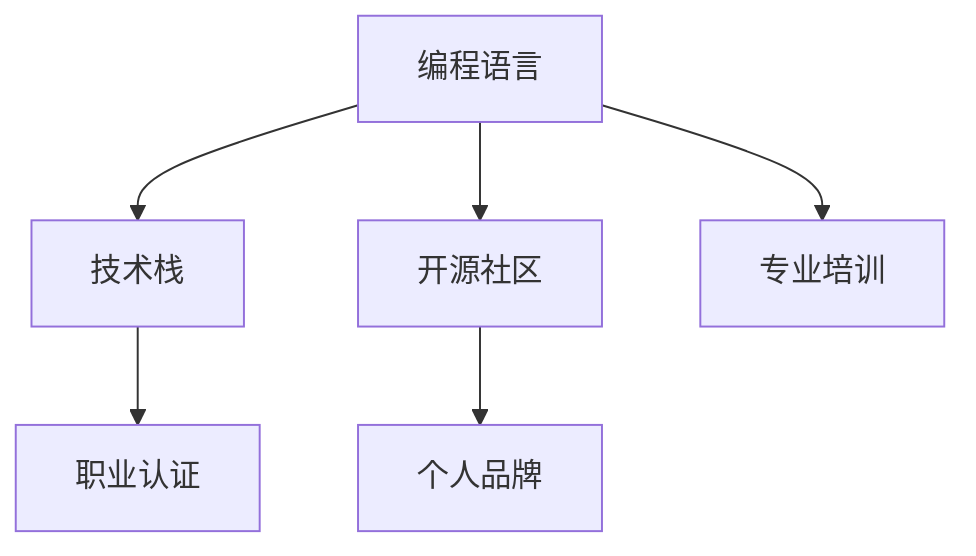

                 

# 程序员如何进行职业规划

## 1. 背景介绍

### 1.1 问题由来
当今社会，信息技术发展迅速，程序员作为推动这一进程的核心力量，面临着不断变化的职业环境和技术趋势。如何在这样一个多变的环境中，明确职业规划，不断提升自我，成为每位程序员必须面对的问题。

### 1.2 问题核心关键点
职业规划的核心关键点在于：
1. **目标设定**：明确个人职业发展的短期和长期目标。
2. **技能提升**：掌握最新的编程语言和技术栈。
3. **学习路径**：构建合理的学习路径和项目实践。
4. **行业动态**：关注行业趋势和技术更新。
5. **个人成长**：注重个人品牌的建立和软技能的发展。

### 1.3 问题研究意义
职业规划对程序员的成长和发展具有重要意义：
1. **提升效率**：有助于明确学习方向，提升工作和学习效率。
2. **增加竞争力**：掌握最新技术和行业趋势，保持竞争力。
3. **优化路径**：避免盲目学习，有针对性地提升个人技能。
4. **实现目标**：明确职业发展目标，有助于实现职业理想。
5. **持续进步**：建立持续学习和成长的心态，实现个人价值的最大化。

## 2. 核心概念与联系

### 2.1 核心概念概述

为了更好地理解程序员职业规划的方法和流程，本节将介绍几个核心概念：

- **编程语言**：如Python、Java、JavaScript等，是程序员进行软件开发的基础工具。
- **技术栈**：指一个项目或应用中使用的所有技术和工具，包括编程语言、框架、库等。
- **开源社区**：如GitHub、Stack Overflow等，是程序员交流、学习和分享的平台。
- **专业培训**：通过线上和线下的课程、讲座和研讨会，提升个人技能。
- **职业认证**：如Oracle、Cisco等公司的认证，提升个人信誉和职业竞争力。
- **个人品牌**：通过博客、社交媒体和公开演讲等方式，建立个人在行业内的知名度和影响力。

这些核心概念之间的逻辑关系可以通过以下Mermaid流程图来展示：



这个流程图展示了几大核心概念及其之间的关系：

1. 编程语言和技术栈的掌握是基础。
2. 通过开源社区交流和专业培训学习，获取更多知识和技能。
3. 职业认证提升个人信誉，增强竞争力。
4. 个人品牌建立和维护，有助于提升在行业内的影响力和职业发展。

## 3. 核心算法原理 & 具体操作步骤

### 3.1 算法原理概述

职业规划的算法原理主要围绕以下几个方面展开：
1. **需求分析**：通过自我评估和市场需求分析，确定职业发展目标。
2. **路径规划**：根据目标设定合理的学习路径，包括编程语言、技术栈和项目实践。
3. **资源整合**：整合开源社区、专业培训等资源，提升个人技能。
4. **持续学习**：建立持续学习的机制，跟踪最新技术和行业趋势。
5. **品牌建设**：通过建立个人品牌，提升在行业内的知名度和影响力。

### 3.2 算法步骤详解

基于上述算法原理，程序员职业规划的步骤如下：

**Step 1: 需求分析**
- **自我评估**：分析自己的技术水平、兴趣和职业目标。
- **市场需求**：研究行业趋势、公司招聘要求等，确定目标岗位的技能需求。

**Step 2: 路径规划**
- **技能目标**：根据目标岗位的要求，列出必须掌握的技能和工具。
- **学习路径**：构建详细的学习路径，包括在线课程、书籍、项目实践等。

**Step 3: 资源整合**
- **社区参与**：加入开源社区，参与讨论、贡献代码，提升技术水平。
- **培训课程**：参加专业培训课程，提升专业技能。
- **认证考试**：通过职业认证考试，获取认证证书，增强竞争力。

**Step 4: 持续学习**
- **知识更新**：定期更新技术栈，学习新工具和技术。
- **行业动态**：关注行业博客、会议、讲座等，了解最新动态。

**Step 5: 品牌建设**
- **博客写作**：在技术博客上分享项目经验、技术心得。
- **社交媒体**：在LinkedIn、Twitter等社交媒体上建立个人品牌。
- **公开演讲**：参加技术会议、研讨会，进行公开演讲。

### 3.3 算法优缺点

职业规划的算法具有以下优点：
1. **系统性**：通过系统分析，明确目标和路径，避免盲目学习。
2. **针对性强**：根据市场需求和自身条件，制定个性化学习计划。
3. **效率高**：通过资源整合，利用最优资源提升学习效果。
4. **持续性**：建立持续学习机制，保持技术进步。
5. **影响力大**：通过品牌建设，提升在行业内的知名度和影响力。

同时，该算法也存在以下局限性：
1. **时间成本高**：职业规划和实施需要大量时间和精力。
2. **灵活性不足**：规划的路径可能与实际需求不符。
3. **市场变化快**：市场需求变化快，规划可能过时。
4. **个人差异大**：不同人的职业目标和兴趣不同，需个性化调整。

尽管存在这些局限性，但职业规划的算法仍是最为科学和高效的方法，帮助程序员实现职业理想。

### 3.4 算法应用领域

职业规划算法适用于各种职业发展场景，特别是在技术领域，其应用范围广泛：

- **软件开发**：选择合适的编程语言和技术栈，提升软件开发技能。
- **数据科学**：学习数据处理、分析工具和算法，提升数据科学能力。
- **人工智能**：掌握机器学习、深度学习技术，构建智能应用。
- **网络安全**：学习安全工具和协议，提升网络安全防护能力。
- **移动开发**：学习iOS、Android开发技术，构建移动应用。
- **云计算**：学习云计算平台和微服务架构，提升云计算能力。

这些领域中的程序员都可以利用职业规划算法，制定适合自己的职业发展路径。

## 4. 数学模型和公式 & 详细讲解 & 举例说明

### 4.1 数学模型构建

为更好地理解职业规划的数学模型，本节将使用数学语言对其进行描述。

假设程序员的初始技能水平为 $S_0$，目标技能水平为 $S_t$。设 $S_0$ 和 $S_t$ 均为连续变量，表示技能水平的高低。设 $k$ 为学习速度， $t$ 为时间变量，则技能提升的数学模型为：

$$
S(t) = S_0 + k \cdot t
$$

其中 $S(t)$ 表示在时间 $t$ 时的技能水平。

### 4.2 公式推导过程

根据上述模型，推导技能提升的具体公式。以软件开发为例，假设学习速度为 $k = 0.1$，初始技能水平 $S_0 = 5$，目标技能水平 $S_t = 8$，则：

$$
S(t) = 5 + 0.1 \cdot t
$$

当 $S(t) = 8$ 时，解方程得：

$$
t = \frac{8 - 5}{0.1} = 30
$$

即需要30个月的时间，通过持续学习，才能达到目标技能水平。

### 4.3 案例分析与讲解

假设某程序员希望在一年内掌握Python和机器学习技术，并提升到行业标准水平。根据上述模型，计算需要每天学习的时间：

设 $k = 0.1$，目标技能水平 $S_t = 8$，初始技能水平 $S_0 = 4$，则：

$$
S(t) = 4 + 0.1 \cdot t
$$

当 $S(t) = 8$ 时，解方程得：

$$
t = \frac{8 - 4}{0.1} = 40
$$

即需要40个月的时间，每天学习1小时，才能达到目标技能水平。

## 5. 项目实践：代码实例和详细解释说明

### 5.1 开发环境搭建

在进行职业规划项目实践前，我们需要准备好开发环境。以下是使用Python进行开发的环境配置流程：

1. 安装Anaconda：从官网下载并安装Anaconda，用于创建独立的Python环境。

2. 创建并激活虚拟环境：
```bash
conda create -n career-env python=3.8 
conda activate career-env
```

3. 安装PyTorch：根据CUDA版本，从官网获取对应的安装命令。例如：
```bash
conda install pytorch torchvision torchaudio cudatoolkit=11.1 -c pytorch -c conda-forge
```

4. 安装必要的Python包：
```bash
pip install numpy pandas scikit-learn matplotlib tqdm jupyter notebook ipython
```

完成上述步骤后，即可在`career-env`环境中开始职业规划实践。

### 5.2 源代码详细实现

下面是Python代码示例，用于计算达到某一技能水平所需的时间：

```python
import numpy as np

def skill_level(time, initial_skill=4, target_skill=8, learning_rate=0.1):
    return initial_skill + learning_rate * time

def required_time(initial_skill, target_skill, learning_rate=0.1):
    time = (target_skill - initial_skill) / learning_rate
    return time

# 计算达到目标技能水平所需的时间
initial_skill = 4
target_skill = 8
learning_rate = 0.1
required_time = required_time(initial_skill, target_skill)
print(f"需要 {required_time} 个月的时间达到目标技能水平。")
```

### 5.3 代码解读与分析

让我们再详细解读一下关键代码的实现细节：

**skill_level函数**：
- 计算在时间 $t$ 时的技能水平 $S(t)$。
- 输入参数包括时间 $t$、初始技能水平 $S_0$、目标技能水平 $S_t$、学习速度 $k$。
- 返回计算出的技能水平 $S(t)$。

**required_time函数**：
- 计算达到目标技能水平所需的时间 $t$。
- 输入参数包括初始技能水平 $S_0$、目标技能水平 $S_t$、学习速度 $k$。
- 返回计算出的所需时间 $t$。

**代码输出**：
- 输出计算出的所需时间，帮助程序员明确职业规划的具体时间。

通过上述代码，我们能够清晰地看到如何通过数学模型计算达到目标技能水平所需的时间。这为程序员进行职业规划提供了具体的方法和工具。

## 6. 实际应用场景

### 6.1 软件开发

软件开发是程序员职业规划的重要场景之一。通过合理的路径规划和持续学习，程序员可以不断提升技术水平，掌握新的编程语言和框架。

以Python为例，程序员可以：
- 学习Python基础语法，构建自己的第一个程序。
- 学习Web开发框架如Django、Flask，构建Web应用。
- 学习数据科学库如NumPy、Pandas，进行数据分析。
- 学习机器学习库如Scikit-learn、TensorFlow，构建智能应用。
- 学习云计算平台如AWS、Azure，进行云计算开发。

通过以上步骤，程序员可以逐步提升技能水平，实现职业发展目标。

### 6.2 数据科学

数据科学是一个快速发展且需求旺盛的领域，程序员可以通过职业规划快速掌握相关技能，进入数据科学领域。

数据科学的学习路径包括：
- 学习Python、R等编程语言，进行数据处理和分析。
- 学习数据可视化工具如Matplotlib、Seaborn，进行数据展示。
- 学习机器学习算法，如线性回归、决策树、随机森林等。
- 学习数据挖掘工具如Scikit-learn、TensorFlow，进行模型构建和优化。
- 学习数据安全知识，保护数据隐私和安全性。

通过以上步骤，程序员可以迅速掌握数据科学技能，进入这一高薪且前沿的领域。

### 6.3 人工智能

人工智能是一个充满挑战且富有前景的领域，程序员可以通过职业规划进入这一领域，构建智能应用。

人工智能的学习路径包括：
- 学习深度学习框架如TensorFlow、PyTorch，进行神经网络建模。
- 学习自然语言处理技术如NLP、NLG，构建智能对话系统。
- 学习计算机视觉技术如CNN、RNN，进行图像识别和处理。
- 学习强化学习算法，如Q-learning、SARSA，构建智能机器人。
- 学习AI伦理和安全知识，构建安全、可信赖的智能应用。

通过以上步骤，程序员可以不断提升自己的技术水平，进入人工智能领域，实现职业理想。

### 6.4 未来应用展望

职业规划的未来发展趋势如下：

1. **跨领域融合**：程序员可以同时掌握多种技能，跨领域应用，如AI、数据科学、Web开发等。
2. **持续学习**：建立终身学习机制，随时更新技能和知识。
3. **在线培训**：借助在线教育平台，随时随地进行学习和实践。
4. **行业认证**：获取行业认证，增强个人信誉和竞争力。
5. **个人品牌**：通过建立个人品牌，提升在行业内的知名度和影响力。

职业规划的不断发展，将使程序员更具竞争力，更好地适应未来的职业环境。

## 7. 工具和资源推荐

### 7.1 学习资源推荐

为了帮助程序员系统掌握职业规划的理论基础和实践技巧，这里推荐一些优质的学习资源：

1. **《编程珠玑》**：Lewis、Looney等著作，介绍了大量编程技巧和最佳实践，是程序员必读之作。
2. **《代码大全》**：Steve McConnell著作，涵盖了代码编写、调试、测试等全面内容，是程序员学习的宝典。
3. **《程序员修炼之道》**：Sandi Metz、Katrina Owen著作，介绍了编程、设计、测试等方面的经验和技巧。
4. **《高性能Python》**：Doug Hellmann著作，介绍了Python编程技巧和最佳实践。
5. **《软件设计模式》**：Erich Gamma等著作，介绍了23种常用的设计模式，提升程序员设计能力。
6. **《算法导论》**：Thomas H. Cormen等著作，全面介绍了算法和数据结构，是程序员学习算法的重要参考资料。

通过学习这些经典书籍，程序员可以系统地提升编程能力，构建良好的职业发展基础。

### 7.2 开发工具推荐

高效的开发离不开优秀的工具支持。以下是几款用于程序员职业规划开发的常用工具：

1. **GitHub**：全球最大的开源社区，程序员可以贡献代码、协作开发，提升技术水平。
2. **JIRA**：项目管理工具，程序员可以跟踪任务、管理项目，提升工作效率。
3. **Docker**：容器化部署工具，程序员可以轻松部署和管理应用程序。
4. **Slack**：即时通讯工具，程序员可以高效沟通、协作，提升团队合作能力。
5. **VS Code**：开源的IDE，支持多种编程语言，提供丰富的插件和扩展，提升开发效率。
6. **Scratch**：可视化编程工具，适合初学者学习编程逻辑。

合理利用这些工具，可以显著提升程序员的职业规划效率，加快创新迭代的步伐。

### 7.3 相关论文推荐

职业规划技术的发展源于学界的持续研究。以下是几篇奠基性的相关论文，推荐阅读：

1. **《程序员的诞生与成长》**：探讨了程序员职业生涯的全过程，介绍了职业规划的基本概念和实践方法。
2. **《软件开发的艺术》**：通过案例分析，介绍了软件开发的各个环节和最佳实践，提升程序员的职业素养。
3. **《机器学习工程师的职业规划》**：介绍了机器学习工程师的职业路径，提供了具体的学习建议和实践指南。
4. **《数据科学家的成长之路》**：探讨了数据科学家的职业发展，提供了详细的学习资源和实践方法。
5. **《人工智能工程师的职业规划》**：介绍了人工智能工程师的职业路径，提供了具体技术栈和学习建议。

这些论文代表了大语言模型微调技术的发展脉络。通过学习这些前沿成果，可以帮助程序员掌握职业规划的核心方法，实现职业理想。

## 8. 总结：未来发展趋势与挑战

### 8.1 总结

本文对程序员的职业规划方法进行了全面系统的介绍。首先阐述了职业规划的背景和意义，明确了目标设定、技能提升、学习路径、资源整合、持续学习、品牌建设等核心关键点。其次，从原理到实践，详细讲解了职业规划的算法原理和具体操作步骤，给出了职业规划项目开发的完整代码实例。同时，本文还广泛探讨了职业规划方法在软件开发、数据科学、人工智能等多个领域的应用前景，展示了职业规划的巨大潜力。此外，本文精选了职业规划技术的各类学习资源，力求为读者提供全方位的技术指引。

通过本文的系统梳理，可以看到，职业规划对程序员的成长和发展具有重要意义。职业规划不仅有助于明确学习方向，提升工作和学习效率，还能增加竞争力，实现职业理想。未来，随着职业规划方法的不断演进，程序员必将能够更好地适应不断变化的职业环境，实现个人价值的最大化。

### 8.2 未来发展趋势

展望未来，程序员职业规划技术将呈现以下几个发展趋势：

1. **智能化**：借助AI和大数据技术，实现职业规划的智能化和个性化。
2. **自动化**：通过自动化工具，提升职业规划的效率和准确性。
3. **全球化**：建立全球化的职业规划平台，帮助程序员在全球范围内寻找机会。
4. **多元化**：提供多元化的职业路径和学习资源，满足程序员的不同需求。
5. **社区化**：建立社区化的职业规划平台，促进程序员之间的交流和合作。

这些趋势将使程序员职业规划更加科学、高效、智能，帮助程序员在全球范围内实现职业理想。

### 8.3 面临的挑战

尽管职业规划技术已经取得了一定的进展，但在迈向更加智能化、普适化应用的过程中，它仍面临着诸多挑战：

1. **需求分析困难**：个人需求和市场需求的匹配仍是一个难题，需要更多的算法和技术支持。
2. **学习路径多样**：学习路径的选择多样，缺乏系统的评估和优化方法。
3. **技能评估复杂**：技能评估的标准和工具仍需进一步发展和完善。
4. **资源整合难度**：开源社区和专业培训的资源整合和利用仍需提升。
5. **持续学习挑战**：建立终身学习机制，跟踪最新技术和行业趋势，需要更多的时间和精力。
6. **品牌建设困难**：建立个人品牌需要时间和精力，缺乏系统化的推广和维护方法。

尽管存在这些挑战，但职业规划技术仍具有广阔的发展前景。未来研究需要在数据、算法、工程、业务等多个维度进行深入探索，克服现有难题，推动技术不断进步。

### 8.4 研究展望

面对职业规划所面临的挑战，未来的研究需要在以下几个方面寻求新的突破：

1. **需求分析算法**：研发更准确的需求分析算法，实现个人需求和市场需求的精准匹配。
2. **路径规划算法**：研究更高效的路径规划算法，提供个性化的学习建议。
3. **技能评估工具**：开发更准确的评估工具，对技能水平进行系统评估。
4. **资源整合平台**：建立更高效的资源整合平台，提供丰富的学习资源。
5. **持续学习机制**：设计更有效的持续学习机制，跟踪最新技术和行业趋势。
6. **品牌建设工具**：开发更系统的品牌建设工具，帮助程序员提升在行业内的知名度和影响力。

这些研究方向将推动职业规划技术的不断进步，为程序员的职业发展提供更科学、高效的支持。

## 9. 附录：常见问题与解答

**Q1：如何设定合理的职业目标？**

A: 设定职业目标时，可以从短期和长期两个方面考虑。短期目标可以是提升某一技能、完成某一项目，长期目标可以是成为某一领域的专家、获取某项认证等。设定目标时，需要考虑自身兴趣和市场需求，选择有挑战性但可达成的目标。

**Q2：如何选择合适的学习路径？**

A: 选择合适的学习路径需要考虑以下几个因素：
1. **市场需求**：选择当前和未来需求旺盛的技能和工具。
2. **自身条件**：根据自己的兴趣和现有技能，选择适合的学习路径。
3. **资源可用**：利用开源社区和专业培训资源，选择可行的学习路径。
4. **目标导向**：选择能够帮助实现职业目标的学习路径。

**Q3：如何提升学习效率？**

A: 提升学习效率可以通过以下方法：
1. **定期复习**：定期复习已有知识，巩固学习成果。
2. **主动实践**：通过项目实践，提升实战经验。
3. **多渠道学习**：利用多种学习渠道，如书籍、视频、在线课程等。
4. **团队合作**：与他人协作学习，分享学习资源和经验。
5. **持续改进**：不断反思和改进学习方法和路径。

**Q4：如何建立个人品牌？**

A: 建立个人品牌可以通过以下方法：
1. **写博客**：在技术博客上分享项目经验、技术心得。
2. **参与社区**：在GitHub、Stack Overflow等社区积极参与讨论和贡献代码。
3. **公开演讲**：参加技术会议、研讨会，进行公开演讲。
4. **社交媒体**：在LinkedIn、Twitter等社交媒体上发布文章和分享成果。
5. **网络课程**：通过在线教育平台，开设课程和分享知识。

通过以上方法，可以逐步建立个人品牌，提升在行业内的知名度和影响力。

---

作者：禅与计算机程序设计艺术 / Zen and the Art of Computer Programming

