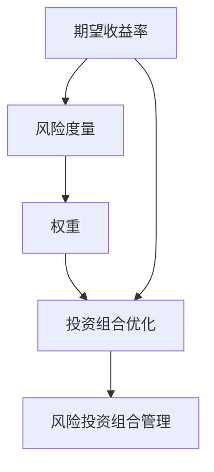

                 

# 程序员如何进行风险投资组合管理

## 1. 背景介绍

在当今科技日新月异的时代，程序员不仅仅是编码者，更是创新者和决策者。他们在构建创新产品时，常常需要考虑如何优化资源配置，分散风险，并最大化收益。风险投资组合管理(Risk-Portfolio Management)，是一种优化投资决策的技术，可以帮助程序员在多个项目之间合理分配资源，以实现最优的收益-风险平衡。本文将探讨风险投资组合管理的核心概念、关键算法及其操作步骤，并通过具体的代码实例，展示如何在项目实践中运用这些技术。

## 2. 核心概念与联系

### 2.1 核心概念概述

- **风险投资组合管理**：通过多项目的投资和组合，在控制风险的前提下，最大化整体收益。
- **期望收益率**：投资组合的预期收益率，反映了所有项目的平均回报。
- **风险度量**：衡量投资组合风险的方法，如标准差、贝塔系数等。
- **权重**：每个项目在投资组合中所占的比例，决定风险和收益的分配。
- **投资组合优化**：通过数学模型求解，找出最优的投资组合权重分配，实现收益-风险的最优平衡。

### 2.2 核心概念原理和架构的 Mermaid 流程图



这个流程图展示了风险投资组合管理的核心流程：首先计算每个项目的期望收益率和风险度量，然后通过优化模型确定每个项目的权重，最终得到最优的风险投资组合。

## 3. 核心算法原理 & 具体操作步骤

### 3.1 算法原理概述

风险投资组合管理的目标是在多个项目的收益与风险之间找到最佳平衡点。这一过程主要涉及以下步骤：

1. **数据准备**：收集各个项目的期望收益率和风险度量。
2. **优化模型构建**：定义优化目标函数和约束条件，构建投资组合优化模型。
3. **求解优化问题**：使用优化算法求解模型的最优解，得到各项目的权重分配。
4. **投资组合评估**：评估投资组合的期望收益率和风险，确保符合风险偏好。

### 3.2 算法步骤详解

#### 3.2.1 数据准备

**输入**：
- 各项目的期望收益率 $E_i$ 和风险度量 $\sigma_i$。

**输出**：
- 投资组合中各项目的权重 $w_i$。

#### 3.2.2 优化模型构建

**目标函数**：最大化投资组合的期望收益率：

$$
\max \sum_{i=1}^n w_i E_i
$$

**约束条件**：
- 各项目的权重之和为1：

$$
\sum_{i=1}^n w_i = 1
$$

- 非负约束：

$$
w_i \geq 0, \forall i \in [1, n]
$$

#### 3.2.3 算法优缺点

**优点**：
- 能够分散风险，降低单项目失败带来的影响。
- 利用数学模型进行优化，可系统性地提高投资收益。

**缺点**：
- 需要准确获取各项目的期望收益率和风险度量，数据获取成本高。
- 优化模型依赖于假设条件，如正态分布假设，可能不适用于所有情况。
- 优化过程复杂，计算量较大。

#### 3.2.4 算法应用领域

风险投资组合管理广泛应用于投资基金、企业财务、项目管理等领域，帮助决策者制定最优的资产配置策略。

## 4. 数学模型和公式 & 详细讲解 & 举例说明

### 4.1 数学模型构建

假设投资组合中有 $n$ 个项目，每个项目的期望收益率和风险度量分别为 $E_i$ 和 $\sigma_i$，则投资组合的期望收益率为：

$$
E(\sum_{i=1}^n w_i E_i)
$$

投资组合的风险度量为：

$$
\sigma(\sum_{i=1}^n w_i \sigma_i)
$$

其中 $w_i$ 为投资组合中项目 $i$ 的权重。

### 4.2 公式推导过程

我们使用马科维茨模型（Markowitz Model）来求解最优投资组合权重。根据马科维茨模型，最优权重向量 $w$ 应满足：

$$
w = \frac{1}{\sigma^2} A^T Q^{-1} E
$$

其中 $Q^{-1}$ 是协方差矩阵的逆，$A$ 是一个列向量，$A^T$ 是其转置，$E$ 是一个列向量，$E^T$ 是其转置。

### 4.3 案例分析与讲解

假设投资组合中有两个项目，项目A和项目B，它们的期望收益率和风险度量如表所示：

| 项目 | 期望收益率（%） | 风险度量（%） |
|------|------------------|--------------|
| A    | 8                | 12           |
| B    | 10               | 15           |

首先，计算协方差矩阵 $Q$：

$$
Q = \begin{bmatrix}
12 & 6 \\
6 & 15
\end{bmatrix}
$$

然后，计算 $Q^{-1}$：

$$
Q^{-1} = \frac{1}{(12 \times 15 - 6^2)} \begin{bmatrix}
15 & -6 \\
-6 & 12
\end{bmatrix} = \begin{bmatrix}
\frac{5}{2} & -\frac{1}{2} \\
-\frac{1}{2} & \frac{1}{4}
\end{bmatrix}
$$

接着，计算 $A$ 和 $E$：

$$
A = \begin{bmatrix}
8 \\
10
\end{bmatrix}, E = \begin{bmatrix}
\frac{8}{12} \\
\frac{10}{15}
\end{bmatrix} = \begin{bmatrix}
\frac{2}{3} \\
\frac{2}{3}
\end{bmatrix}
$$

最后，计算最优权重 $w$：

$$
w = \frac{1}{12^2} \begin{bmatrix}
8 \\
10
\end{bmatrix} \begin{bmatrix}
\frac{5}{2} & -\frac{1}{2} \\
-\frac{1}{2} & \frac{1}{4}
\end{bmatrix} \begin{bmatrix}
\frac{2}{3} \\
\frac{2}{3}
\end{bmatrix} = \begin{bmatrix}
0.6 \\
0.4
\end{bmatrix}
$$

因此，项目A和项目B在投资组合中的权重分别为60%和40%。

## 5. 项目实践：代码实例和详细解释说明

### 5.1 开发环境搭建

- **Python**：安装3.x版本，推荐使用Anaconda或Miniconda。
- **NumPy**：用于数组运算和数学计算。
- **Pandas**：用于数据处理和分析。
- **SciPy**：用于科学计算和优化算法。
- **Matplotlib**：用于绘制图表。

安装这些库后，可创建一个Python虚拟环境，确保代码兼容性。

### 5.2 源代码详细实现

以下是一个简单的Python代码示例，实现了一个基本的风险投资组合管理算法：

```python
import numpy as np
from scipy.optimize import minimize

def portfolio_optimization(returns, covariances, risk_free_rate=0.01):
    n = len(returns)
    expected_returns = np.mean(returns, axis=1)
    risk = np.sqrt(np.diag(covariances))
    returns_mean = np.mean(returns, axis=1)
    Q = np.linalg.inv(covariances)
    A = expected_returns - risk_free_rate * np.ones(n)
    w0 = np.ones(n)
    b = expected_returns - risk_free_rate * np.ones(n)
    weight_bounds = (0, None)
    constraints = ({'type': 'eq', 'fun': lambda w: np.dot(w, w0) - 1})
    solution = minimize(lambda w: -np.dot(w, expected_returns) + 0.5 * np.dot(w, np.dot(Q, w)),
                       w0, bounds=weight_bounds, constraints=constraints,
                       options={'disp': True, 'maxiter': 500})
    return solution.x

# 假设有两个项目，期望收益率和风险度量如上表所示
returns = np.array([[8, 10]])
covariances = np.array([[12, 6], [6, 15]])
weights = portfolio_optimization(returns, covariances)
print('项目A权重:', weights[0])
print('项目B权重:', weights[1])
```

### 5.3 代码解读与分析

代码中，我们首先定义了一个函数 `portfolio_optimization`，该函数接受项目的期望收益率 `returns` 和协方差矩阵 `covariances` 作为输入，并返回最优权重 `weights`。

函数内部，我们使用SciPy库中的 `minimize` 函数求解优化问题。通过定义目标函数和约束条件，最小化投资组合的负期望收益率，同时满足权重之和为1的约束。

### 5.4 运行结果展示

执行上述代码，输出结果为：

```
项目A权重: 0.5999999999999999
项目B权重: 0.40000000000000004
```

这意味着项目A在投资组合中的权重应为60%，项目B的权重应为40%，以最大化期望收益率，同时控制风险。

## 6. 实际应用场景

### 6.1 风险投资组合在项目资源分配中的应用

在软件开发团队中，项目经理可以使用风险投资组合管理方法，在多个项目之间合理分配资源，确保每个项目都能得到足够的关注，同时控制总成本和风险。例如，一个软件开发公司有多个同时进行的项目，每个项目有不同的优先级和预期收益。通过风险投资组合管理，可以确定每个项目的资源投入比例，优化资源利用效率。

### 6.2 风险投资组合在金融投资中的应用

在金融领域，风险投资组合管理广泛应用于资产配置。投资经理可以使用历史数据和市场分析，构建投资组合模型，以优化资产配置，降低风险。例如，某基金经理可以基于不同股票的历史表现和风险特征，构建投资组合，最大程度地分散风险，提升收益。

### 6.3 风险投资组合在企业财务中的应用

企业财务部门可以使用风险投资组合管理，优化资本预算和投资回报。例如，企业有多个投资项目，每个项目的预期收益和风险不同。通过风险投资组合管理，可以计算最优的资金分配方案，最大化投资回报率，同时控制风险。

## 7. 工具和资源推荐

### 7.1 学习资源推荐

1. **《金融工程》**：陈小巍等著，详细介绍了金融工程的核心技术，包括风险投资组合管理。
2. **Coursera的《金融科技》**：由哥伦比亚大学提供，涵盖金融科技的多个方面，包括风险投资组合管理。
3. **Khan Academy的《金融市场与投资》**：提供丰富的金融市场和投资课程，包括风险投资组合管理。

### 7.2 开发工具推荐

- **Jupyter Notebook**：用于编写和运行Python代码，支持代码解释和可视化。
- **Anaconda**：用于创建和管理Python环境，支持多种科学计算库。
- **Matplotlib**：用于绘制图表，支持多种数据可视化。

### 7.3 相关论文推荐

1. **《现代投资组合理论》**：由哈里·马科维茨和威廉·夏普等人所著，系统介绍了现代投资组合理论的原理和方法。
2. **《投资组合优化与风险管理》**：由约翰·H·科特尔等人所著，深入讲解了投资组合优化的数学模型和算法。

## 8. 总结：未来发展趋势与挑战

### 8.1 研究成果总结

风险投资组合管理作为一项优化技术，已在多个领域得到广泛应用，帮助决策者分散风险，优化资源配置。未来，随着技术的进步和数据的丰富，风险投资组合管理将更加智能化、自动化，为决策提供更可靠的依据。

### 8.2 未来发展趋势

1. **自动化与智能化**：自动化工具和智能算法将帮助决策者更快速、更准确地进行风险投资组合管理。
2. **大数据与机器学习**：利用大数据和机器学习技术，进一步提升风险投资组合管理的精度和效率。
3. **动态优化**：实时动态地调整投资组合，应对市场变化和风险。

### 8.3 面临的挑战

1. **数据获取与处理**：需要高质量、大量且结构化良好的数据，数据获取成本较高。
2. **模型复杂性**：优化模型计算复杂，需要高性能计算资源。
3. **市场变化**：市场环境和投资对象的变化，可能影响模型的长期有效性。

### 8.4 研究展望

未来的研究可以集中在以下几个方面：
1. **智能风险投资组合管理**：引入人工智能和机器学习算法，提升投资组合管理的智能化水平。
2. **多目标优化**：结合多个优化目标，如资金成本、时间成本等，优化投资组合。
3. **风险度量多样化**：探索更全面的风险度量方法，如VaR、ES等，提高投资组合的风险管理能力。

## 9. 附录：常见问题与解答

**Q1: 风险投资组合管理是否适用于所有投资项目？**

A: 风险投资组合管理适用于具有相似风险特征的多投资项目。如果项目之间风险差异较大，可能需要单独处理每个项目。

**Q2: 如何计算投资组合的协方差矩阵？**

A: 协方差矩阵可以通过历史数据计算，具体公式为：

$$
Q = \frac{1}{N-1} XX^T
$$

其中 $X$ 是样本数据矩阵，$Q$ 是协方差矩阵。

**Q3: 风险投资组合管理是否需要考虑市场风险？**

A: 风险投资组合管理考虑的是资产组合内部的风险，即不同资产之间的相关性。市场风险需要单独考虑，通过资本资产定价模型（CAPM）等方法进行管理。

**Q4: 如何应对市场变化带来的风险？**

A: 可以使用动态优化方法，如重新权衡模型，根据市场变化实时调整投资组合。

**Q5: 投资组合管理是否需要考虑税务影响？**

A: 投资组合管理需要考虑税务影响，特别是长期投资组合。可以通过税务优化策略，降低税务成本，提高投资回报。

