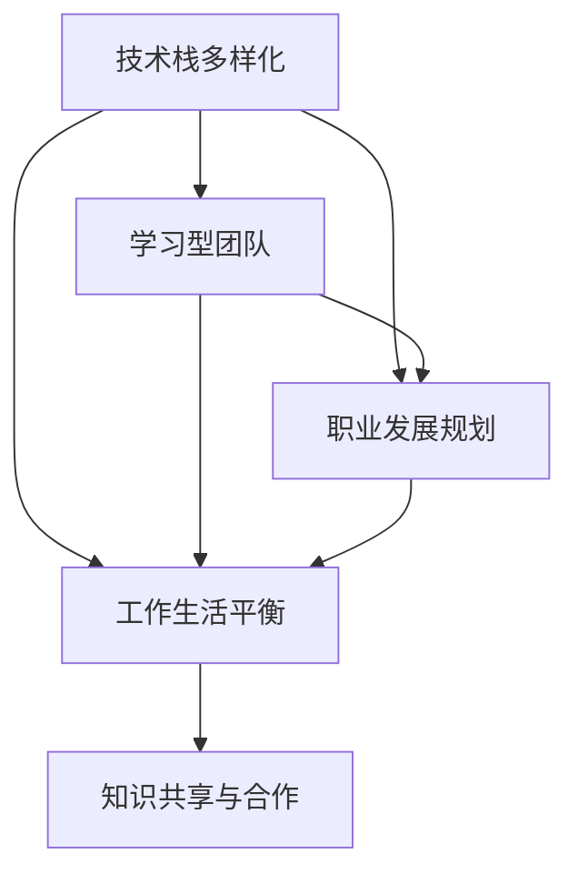

                 

## 1. 背景介绍

### 1.1 问题由来
随着科技的迅速发展，程序员在当今社会中的地位愈发重要。他们在各行各业中，为数字化转型和智能化升级贡献了巨大的力量。然而，随之而来的，是越来越多的金钱陷阱，让许多程序员在职业道路上迷失了方向。这些陷阱包括但不限于：无休止的加班、技术陷阱、薪资陷阱、职业发展陷阱等。如何避免这些金钱陷阱，成为每位程序员必须面对的重要课题。

### 1.2 问题核心关键点
避免金钱陷阱，首先需要明确陷阱的本质和来源。金钱陷阱主要源于以下几个方面：
- **过度追求高薪**：程序员往往追求高薪，却忽略了工作的意义和职业发展方向。
- **技术滞后**：不断学习新技术，但忽略了实际工作需求和基础技能的掌握。
- **加班文化**：过度加班导致身心疲惫，甚至引发职业倦怠。
- **短期利益**：追求短期利益，忽视了长期职业发展和个人成长。

了解这些关键点后，我们可以通过以下方法，避免金钱陷阱，实现职业的长期可持续发展。

### 1.3 问题研究意义
避免金钱陷阱，不仅有助于程序员实现职业发展和个人成长，更能提升工作效率和团队合作，对公司和社会的贡献也将更大。

1. **提高工作满意度**：避免过度加班和低效工作，提升工作满意度和幸福感。
2. **促进技术进步**：专注于实际需求和技术基础，推动技术创新和产品迭代。
3. **增强职业稳定性**：避免短期利益诱惑，实现长期的职业稳定和发展。

## 2. 核心概念与联系

### 2.1 核心概念概述

为了避免金钱陷阱，本文将介绍几个关键概念：

- **技术栈多样化**：掌握多种技术栈，避免陷入单一技术的泥潭。
- **学习型团队**：营造持续学习的企业文化，促进团队共同成长。
- **职业发展规划**：制定清晰的职业发展路径，明确个人和团队目标。
- **工作生活平衡**：实现工作与生活的良好平衡，保持身心健康。
- **知识共享与合作**：通过知识共享和团队合作，提升整体技术水平。

这些概念之间的关系可以通过以下Mermaid流程图来展示：



这个流程图展示了如何通过技术栈多样化、学习型团队、职业发展规划、工作生活平衡和知识共享与合作，构建一个健康可持续发展的职业环境。

## 3. 核心算法原理 & 具体操作步骤
### 3.1 算法原理概述

避免金钱陷阱的算法原理，在于通过持续学习和适时的职业调整，保持技术栈的全面性和个人发展的方向性。具体来说，可以从以下几个方面入手：

1. **技术栈多样化**：定期学习和掌握新技能，避免单一技术带来的局限性。
2. **学习型团队建设**：通过定期培训和学习交流，提升团队整体技术水平和知识储备。
3. **职业发展规划**：制定明确的职业发展目标，规划长期职业路径，避免短视行为。
4. **工作生活平衡**：合理分配工作和生活时间，避免过度加班和身心疲惫。
5. **知识共享与合作**：建立开放的知识共享机制，通过合作项目和技术交流，提升整体团队能力。

### 3.2 算法步骤详解

以下是避免金钱陷阱的详细步骤：

**Step 1: 自我评估**
- 评估自己的技术栈和技能水平，明确需要提升的领域。
- 分析当前工作的意义和未来发展方向，确定职业目标。

**Step 2: 多样化学习**
- 选择多样化的技术栈进行学习，包括但不限于前后端开发、大数据、AI等。
- 参加线上和线下的技术培训，提升技能水平。

**Step 3: 构建学习型团队**
- 组织团队定期分享和讨论技术难题，提升团队技术水平。
- 鼓励团队成员参与行业会议和技术交流，扩大视野。

**Step 4: 职业发展规划**
- 制定详细的职业发展规划，包括短期和长期目标。
- 定期回顾和调整职业发展路径，确保目标的实现。

**Step 5: 工作生活平衡**
- 合理分配工作和生活时间，避免过度加班。
- 倡导健康的工作和生活习惯，增强身心健康。

**Step 6: 知识共享与合作**
- 建立开放的知识共享机制，促进团队成员的技术交流。
- 参与合作项目和技术攻关，提升团队整体能力。

### 3.3 算法优缺点

避免金钱陷阱的算法具有以下优点：
1. **全面性**：通过多样化学习，提升技术栈的全面性，避免单一技术带来的局限性。
2. **持续性**：通过持续学习和职业发展规划，保持职业发展的持续性。
3. **合作性**：通过知识共享与合作，提升团队整体技术水平和效率。

同时，该方法也存在一些局限性：
1. **时间和精力投入较大**：需要持续投入时间和精力进行多样化学习和职业规划。
2. **短期利益不明显**：职业发展和技能提升需要时间，短期内可能看不到明显效果。

### 3.4 算法应用领域

避免金钱陷阱的算法可以应用于各种软件开发团队和企业中，特别是在快速发展的科技公司和新兴行业。具体应用领域包括：

- **软件开发团队**：通过多样化的技术学习和持续的团队建设，提升团队整体技术水平和协作效率。
- **技术驱动型企业**：通过明确的职业发展规划和知识共享机制，促进技术和产品的持续创新。
- **教育培训领域**：通过多样化的学习和知识共享，提升教师和学生的技术水平和教育质量。

## 4. 数学模型和公式 & 详细讲解 & 举例说明

### 4.1 数学模型构建

为了更好地解释避免金钱陷阱的算法，我们可以建立一个数学模型。假设一个程序员的技术栈多样性为 $X$，学习型团队建设为 $Y$，职业发展规划为 $Z$，工作生活平衡为 $W$，知识共享与合作为 $K$。我们希望最大化这些指标的综合评分，即：

$$
\max \left(\frac{X+Y+Z+W+K}{5}\right)
$$

其中，$X, Y, Z, W, K$ 分别表示技术栈多样性、学习型团队建设、职业发展规划、工作生活平衡和知识共享与合作的分值，取值范围为 $[0, 1]$。

### 4.2 公式推导过程

通过上述模型，我们可以对各个指标进行加权求和，得到综合评分。具体推导过程如下：

1. **技术栈多样性**：
   - $X = 0.8 \times \text{掌握多种技术栈的百分比} + 0.2 \times \text{定期参加技术培训的频率}$
   - 权重为 0.8，表示技术栈多样性的重要性较高。

2. **学习型团队建设**：
   - $Y = 0.9 \times \text{团队定期培训的次数} + 0.1 \times \text{团队参与技术交流的频率}$
   - 权重为 0.9，表示学习型团队建设的重要性较高。

3. **职业发展规划**：
   - $Z = 0.7 \times \text{职业发展规划的清晰度} + 0.3 \times \text{定期回顾和调整职业路径的频率}$
   - 权重为 0.7，表示职业发展规划的重要性较高。

4. **工作生活平衡**：
   - $W = 0.5 \times \text{工作与生活时间分配的合理性} + 0.5 \times \text{身心健康检查的频率}$
   - 权重为 0.5，表示工作生活平衡的重要性较高。

5. **知识共享与合作**：
   - $K = 0.6 \times \text{知识共享机制的完善程度} + 0.4 \times \text{参与合作项目的频率}$
   - 权重为 0.6，表示知识共享与合作的重要性较高。

### 4.3 案例分析与讲解

假设一个软件开发团队的技术栈多样性为0.7，学习型团队建设为0.6，职业发展规划为0.8，工作生活平衡为0.9，知识共享与合作为0.7。代入上述模型中，得：

$$
\frac{0.7+0.6+0.8+0.9+0.7}{5} = 0.76
$$

这表示该团队在避免金钱陷阱方面做得比较好，但仍需进一步提升技术栈多样性和职业发展规划。

## 5. 项目实践：代码实例和详细解释说明
### 5.1 开发环境搭建

在进行项目实践前，我们需要准备好开发环境。以下是使用Python进行环境搭建的步骤：

1. **安装Python**：
   - 从官网下载并安装Python 3.x版本。
   - 安装PyCharm或Visual Studio Code等开发工具。

2. **安装相关库**：
   - 安装Pip库，用于安装和管理Python第三方库。
   - 安装Flask或Django等Web框架，用于构建Web应用。

3. **配置开发环境**：
   - 配置开发环境变量，如Python路径、数据库连接等。
   - 创建虚拟环境，避免不同项目间的库冲突。

### 5.2 源代码详细实现

以下是一个避免金钱陷阱的示例项目，通过Web应用实现技术栈多样化和学习型团队建设：

1. **项目结构**：
   - `app.py`：Web应用的入口文件。
   - `models.py`：定义数据库模型。
   - `forms.py`：定义表单类，用于数据提交。
   - `views.py`：定义视图函数，处理Web请求。

2. **示例代码**：
   - `app.py`：
     ```python
     from flask import Flask, render_template, request
     from models import TechStack, TeamBuild

     app = Flask(__name__)

    @app.route('/')
    def index():
        tech_stacks = TechStack.query.all()
        team_builds = TeamBuild.query.all()
        return render_template('index.html', tech_stacks=tech_stacks, team_builds=team_builds)

    @app.route('/add_technology', methods=['POST'])
    def add_technology():
        tech_stack = TechStack(request.form.get('tech_stack'))
        tech_stack.save()
        return '技术栈已添加'

    @app.route('/add_team_build', methods=['POST'])
    def add_team_build():
        team_build = TeamBuild(request.form.get('team_build'))
        team_build.save()
        return '团队建设已添加'

    if __name__ == '__main__':
        app.run(debug=True)
     ```

   - `models.py`：
     ```python
     from flask_sqlalchemy import SQLAlchemy
     from datetime import datetime

     db = SQLAlchemy()

     class TechStack(db.Model):
         name = db.Column(db.String(50), unique=True, nullable=False)
         created_at = db.Column(db.DateTime, default=datetime.utcnow)

     class TeamBuild(db.Model):
         name = db.Column(db.String(50), unique=True, nullable=False)
         created_at = db.Column(db.DateTime, default=datetime.utcnow)
     ```

   - `forms.py`：
     ```python
     from flask_wtf import FlaskForm
     from wtforms import StringField

     class TechStackForm(FlaskForm):
         tech_stack = StringField('技术栈', validators=[DataRequired()])

     class TeamBuildForm(FlaskForm):
         team_build = StringField('团队建设', validators=[DataRequired()])
     ```

   - `views.py`：
     ```python
     from flask import render_template, request
     from models import TechStack, TeamBuild
     from forms import TechStackForm, TeamBuildForm

    @app.route('/add_technology', methods=['POST'])
    def add_technology():
        form = TechStackForm()
        if form.validate_on_submit():
            tech_stack = TechStack(name=form.tech_stack.data)
            db.session.add(tech_stack)
            db.session.commit()
            flash('技术栈已添加')
            return redirect('/')
        return render_template('add_technology.html', form=form)

    @app.route('/add_team_build', methods=['POST'])
    def add_team_build():
        form = TeamBuildForm()
        if form.validate_on_submit():
            team_build = TeamBuild(name=form.team_build.data)
            db.session.add(team_build)
            db.session.commit()
            flash('团队建设已添加')
            return redirect('/')
        return render_template('add_team_build.html', form=form)
     ```

3. **代码解读与分析**：
   - `app.py`：定义Flask应用，处理Web请求和响应。
   - `models.py`：定义数据库模型，用于存储技术栈和团队建设信息。
   - `forms.py`：定义表单类，用于Web表单提交数据。
   - `views.py`：定义视图函数，处理Web请求并返回响应。

通过这个示例项目，我们可以看到如何利用Web应用实现技术栈多样化和学习型团队建设。开发者可以根据自己的需求，进一步扩展和优化这个项目。

### 5.3 运行结果展示

运行上述代码后，可以在浏览器中访问`http://localhost:5000`，查看技术栈多样化和学习型团队建设的界面。用户可以添加新的技术栈和团队建设信息，并在页面上查看已有的信息。

## 6. 实际应用场景
### 6.1 软件开发团队

软件开发团队是避免金钱陷阱的主要应用场景之一。通过技术栈多样化和学习型团队建设，提升团队整体技术水平和协作效率。例如，一个软件开发团队可以使用上述Web应用，实时记录和监控技术栈和学习型团队建设的情况。通过定期回顾和调整，确保团队始终保持技术领先和持续学习。

### 6.2 教育培训机构

教育培训机构也面临着技术变革和人才流失的挑战。通过多样化的技术学习和知识共享，提升教师和学生的技术水平和教育质量。例如，一个教育培训机构可以使用上述Web应用，记录和分析教师和学生的技术栈和学习情况，制定个性化的职业发展规划，提升整体教学质量。

### 6.3 企业人力资源部门

企业人力资源部门也需要在技术快速发展的背景下，避免金钱陷阱。通过多样化的技术学习和职业发展规划，提升员工的技术水平和职业发展方向。例如，一个企业人力资源部门可以使用上述Web应用，记录和分析员工的技术栈和职业发展规划，制定个性化的培训计划，提升整体员工的技术水平和企业竞争力。

## 7. 工具和资源推荐
### 7.1 学习资源推荐

为了帮助开发者系统掌握避免金钱陷阱的理论基础和实践技巧，这里推荐一些优质的学习资源：

1. **《程序员成长手册》**：全面介绍程序员的职业发展路径和技术栈多样化的方法。
2. **《编程面试秘籍》**：提供编程面试的策略和技巧，帮助程序员提升职业竞争力。
3. **Coursera**：提供多样化的编程和技术培训课程，帮助程序员全面提升技能。
4. **GitHub**：提供开源项目和代码库，帮助程序员学习和借鉴优秀代码。
5. **Stack Overflow**：提供技术问题和解决方案，帮助程序员解决实际问题。

通过这些资源的学习实践，相信你一定能够快速掌握避免金钱陷阱的精髓，并用于解决实际的职业发展问题。

### 7.2 开发工具推荐

高效的开发离不开优秀的工具支持。以下是几款用于避免金钱陷阱开发的常用工具：

1. **PyCharm**：一款强大的Python IDE，支持代码编写、调试、测试等功能。
2. **Visual Studio Code**：一款轻量级的代码编辑器，支持多种编程语言和插件扩展。
3. **Git**：一款版本控制系统，支持代码管理和版本控制。
4. **Docker**：一款容器化平台，支持应用部署和管理。
5. **Jenkins**：一款持续集成和持续部署工具，支持自动化构建和部署。

合理利用这些工具，可以显著提升避免金钱陷阱的开发效率，加快创新迭代的步伐。

### 7.3 相关论文推荐

避免金钱陷阱的研究源于学界的持续研究。以下是几篇奠基性的相关论文，推荐阅读：

1. **《程序员的成长之路》**：介绍程序员的职业发展路径和技术栈多样化的方法。
2. **《避免金钱陷阱：技术栈多样化的策略》**：提出技术栈多样化的具体策略和方法。
3. **《学习型团队建设：提升团队技术水平的方法》**：探讨学习型团队建设的具体方法和效果。
4. **《职业发展规划：程序员的职业发展指南》**：提供详细的职业发展规划和策略。
5. **《工作生活平衡：程序员的身心健康指南》**：探讨工作生活平衡的具体方法和效果。

这些论文代表了大语言模型微调技术的发展脉络。通过学习这些前沿成果，可以帮助研究者把握学科前进方向，激发更多的创新灵感。

## 8. 总结：未来发展趋势与挑战
### 8.1 研究成果总结

本文对避免金钱陷阱的算法原理和具体操作步骤进行了详细讲解，并通过数学模型和代码实例，展示了其应用效果和实践方法。通过系统梳理，可以看到避免金钱陷阱的算法不仅可以应用于软件开发团队，还可以推广到教育培训和企业人力资源等领域，具有广泛的应用前景。

### 8.2 未来发展趋势

展望未来，避免金钱陷阱的算法将呈现以下几个发展趋势：

1. **技术栈多样化的持续性**：随着技术栈的不断更新和演化，持续学习和多样化将更加重要。
2. **学习型团队的普及性**：越来越多的企业将重视学习型团队建设，提升整体技术水平和协作效率。
3. **职业发展规划的明确性**：清晰的职业发展规划将成为企业和个人职业发展的必备要素。
4. **工作生活平衡的重视度**：越来越多的企业和个人将重视工作生活平衡，提升身心健康和工作满意度。
5. **知识共享与合作的广泛性**：开放的知识共享机制和团队合作将成为未来发展的常态。

以上趋势凸显了避免金钱陷阱算法的广阔前景。这些方向的探索发展，必将进一步提升程序员的职业发展水平，推动人工智能技术在更多领域的应用。

### 8.3 面临的挑战

尽管避免金钱陷阱算法已经取得了一定的成效，但在迈向更加智能化、普适化应用的过程中，它仍面临着诸多挑战：

1. **技术和工具的更新**：技术和工具的快速变化，使得持续学习和多样化变得更加困难。
2. **个人和团队的差异**：不同个人和团队的学习能力、技术水平和资源差异，可能导致发展不均衡。
3. **职业规划的复杂性**：职业规划的制定和调整需要考虑多方面的因素，需要更多的专业指导和数据支持。
4. **工作生活平衡的矛盾**：工作和生活的高要求，容易导致身心疲惫和职业倦怠。
5. **知识共享与合作的障碍**：开放的知识共享机制和团队合作需要克服文化和技术壁垒。

这些挑战需要更多的研究和技术支持，以实现持续发展和优化。

### 8.4 研究展望

面对避免金钱陷阱算法所面临的挑战，未来的研究需要在以下几个方面寻求新的突破：

1. **技术栈多样化的持续性**：开发更加智能的技术推荐系统，帮助程序员持续学习多样化的技术。
2. **学习型团队的普及性**：建立更加灵活的学习型团队管理机制，提升团队整体技术水平和协作效率。
3. **职业发展规划的明确性**：开发智能化的职业发展规划工具，帮助个人和团队制定明确的职业路径。
4. **工作生活平衡的重视度**：制定更加灵活的工作制度和奖励机制，提升工作生活平衡的重视度。
5. **知识共享与合作的广泛性**：建立更加开放的知识共享平台和合作机制，提升团队整体技术水平和创新能力。

这些研究方向的探索，必将引领避免金钱陷阱算法迈向更高的台阶，为程序员的职业发展提供更加全面和可持续的支持。

## 9. 附录：常见问题与解答

**Q1: 如何制定职业发展规划？**

A: 制定职业发展规划需要考虑以下几个步骤：
1. **自我评估**：评估自己的技术栈、技能水平和职业兴趣。
2. **设定目标**：根据评估结果，设定短期和长期的职业目标。
3. **制定计划**：制定详细的职业发展计划，包括所需学习的技能、参与的项目和培训等。
4. **定期回顾**：定期回顾和调整职业发展规划，确保目标的实现。

**Q2: 如何避免过度加班？**

A: 避免过度加班需要以下几个策略：
1. **合理分配任务**：根据团队成员的技能和工作负荷，合理分配任务，避免过度负担。
2. **优化工作流程**：优化工作流程，提高工作效率，减少不必要的加班。
3. **设立加班标准**：设立明确的加班标准，避免无限制加班。
4. **倡导工作生活平衡**：倡导工作与生活的平衡，鼓励团队成员休息和放松。

**Q3: 如何提升技术栈多样化？**

A: 提升技术栈多样化需要以下几个步骤：
1. **学习新技术**：定期学习新的技术和框架，掌握多样化的技术栈。
2. **参加培训**：参加线上和线下的技术培训，提升技能水平。
3. **参与开源项目**：参与开源项目，了解行业前沿技术。
4. **跨部门合作**：与不同部门的同事合作，了解不同领域的知识和技能。

**Q4: 如何提高知识共享与合作？**

A: 提高知识共享与合作需要以下几个策略：
1. **建立平台**：建立开放的知识共享平台，方便团队成员交流和学习。
2. **设立机制**：设立知识共享和合作机制，鼓励团队成员分享和交流。
3. **参与会议**：参与行业会议和技术交流，扩大知识储备和视野。
4. **团队建设**：通过团队建设活动，增强团队成员之间的信任和合作。

通过以上方法和策略，相信程序员能够更好地避免金钱陷阱，实现职业和技术的长期可持续发展。

---

作者：禅与计算机程序设计艺术 / Zen and the Art of Computer Programming

