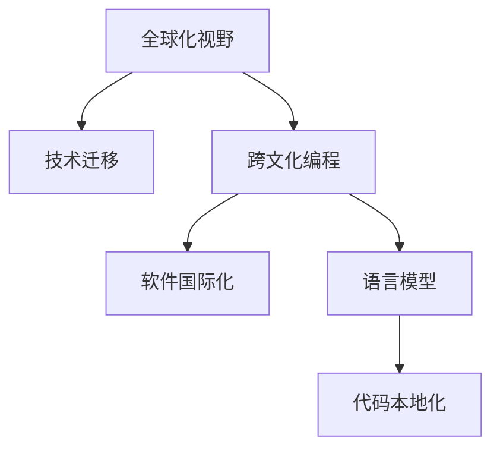

                 

# 程序员的全球化视野：机遇与挑战

> 关键词：全球化视野, 技术迁移, 跨文化编程, 软件国际化, 语言模型, 代码本地化

## 1. 背景介绍

### 1.1 问题由来

随着互联网的普及和全球化进程的加速，软件开发和编程已经成为一个全球性的产业。程序员们不再局限于某个国家或地区，而是跨越国界进行合作，开发面向全球用户的应用程序和系统。这为程序员们带来了前所未有的机遇，但也带来了新的挑战。

### 1.2 问题核心关键点

全球化视野要求程序员不仅要有扎实的技术功底，还要具备跨文化交流和协作的能力。这包括理解不同国家和地区的文化差异，学习多种编程语言和开发工具，以及应对国际化的软件需求和技术标准。同时，全球化还要求程序员具备强大的问题解决能力，能够在不同环境和条件下实现高效的软件开发和维护。

### 1.3 问题研究意义

研究全球化视野下的编程和软件开发，对于提升程序员的跨文化合作能力，推动全球信息技术产业的进步，具有重要的意义：

1. 促进国际合作：全球化视野可以帮助程序员跨越语言和文化的障碍，实现跨文化合作，加速全球信息技术产业的发展。
2. 提升竞争力：具备全球化视野的程序员能够更好地适应全球市场的需求，提高自身的竞争力和职业发展空间。
3. 推动技术创新：全球化视野可以促进不同文化背景的技术交流和融合，推动技术创新和进步。
4. 优化资源配置：通过全球化视野，程序员可以更好地配置资源，优化软件开发过程，提高开发效率和软件质量。

## 2. 核心概念与联系

### 2.1 核心概念概述

为了更好地理解全球化视野下的编程和软件开发，本节将介绍几个密切相关的核心概念：

- 全球化视野(Global Vision)：指程序员在软件开发和编程过程中，具备全球化的思维和意识，能够理解和适应不同国家和地区的文化、技术、市场需求等。
- 技术迁移(Technology Migration)：指将一种技术或工具迁移到另一种环境或领域，以满足特定的应用需求。
- 跨文化编程(Cross-Cultural Programming)：指在不同文化背景下的程序员合作开发软件，需要解决语言、文化、协作等方面的问题。
- 软件国际化(Software Internationalization)：指软件开发过程中考虑到不同语言和文化的需求，使软件能够在全球范围内使用。
- 语言模型(Language Model)：用于处理自然语言的人工智能模型，能够在全球范围内进行语言理解和生成，是全球化编程的重要工具。
- 代码本地化(Code Localization)：指将代码转换为特定地区或国家的本地语言和文化，以适应当地的使用环境。

这些核心概念之间的逻辑关系可以通过以下Mermaid流程图来展示：



这个流程图展示了大语言模型在跨文化编程中的应用场景：

1. 全球化视野帮助程序员理解不同文化和市场需求，从而选择合适的技术进行迁移。
2. 跨文化编程需要解决语言、文化、协作等方面的问题，语言模型可以辅助理解和使用多种语言。
3. 软件国际化关注全球语言和文化的多样性，语言模型可以帮助实现多语言支持。
4. 代码本地化则是将代码转换为特定地区或国家的本地语言和文化，以适应当地的使用环境。

这些核心概念共同构成了全球化视野下的编程和软件开发框架，使程序员能够更好地适应全球市场和技术环境。

## 3. 核心算法原理 & 具体操作步骤
### 3.1 算法原理概述

全球化视野下的编程和软件开发，核心在于如何实现技术迁移和本地化。其核心思想是：选择合适的技术或工具，将其迁移到特定环境或领域，同时进行本地化适配，以适应不同的语言和文化需求。

形式化地，假设要将技术或工具 $T$ 迁移到目标环境 $E$，语言模型 $L$ 用于处理语言和文化差异，本地化适配策略 $A$ 用于调整代码以适应特定环境，目标环境的要求为 $R_E$。则技术迁移和本地化的目标是最小化环境适配误差，即：

$$
\min_{A} \sum_{i} \lvert R_E(T) - A(T) \rvert
$$

其中 $R_E(T)$ 为目标环境的要求，$A(T)$ 为本地化适配后的结果。

### 3.2 算法步骤详解

全球化视野下的编程和软件开发一般包括以下几个关键步骤：

**Step 1: 选择合适的技术或工具**
- 根据项目需求和目标环境，选择合适的技术或工具，如编程语言、框架、库等。
- 考虑目标环境的特殊需求，如语言支持、文化差异等，选择具有较好跨文化兼容性的技术。

**Step 2: 进行技术迁移**
- 将选择的技术或工具迁移到目标环境，进行相应的配置和部署。
- 在迁移过程中，可以参考预训练语言模型和相关工具，如多语言翻译工具、本地化检查工具等，辅助迁移过程。

**Step 3: 实现本地化适配**
- 根据目标环境的语言和文化需求，对代码进行本地化适配。
- 利用语言模型，识别代码中的文化敏感部分，进行相应的修改和适配。
- 引入本地化适配策略，如国际化库、本地化框架等，提高代码的本地化适配效率。

**Step 4: 进行跨文化协作**
- 组建跨文化编程团队，解决语言、文化、协作等方面的问题。
- 利用在线协作工具和通讯工具，进行高效的沟通和协作。
- 引入团队建设和项目管理工具，提高团队的协作效率和沟通效果。

**Step 5: 进行测试和优化**
- 在目标环境中进行测试，验证代码的本地化适配效果。
- 根据测试结果，进行必要的优化和调整。
- 进行持续集成和持续部署(CI/CD)，保证软件质量的稳定性和可靠性。

以上是全球化视野下编程和软件开发的一般流程。在实际应用中，还需要针对具体项目的需求，对各个环节进行优化设计，如选择合适的技术栈、优化本地化适配策略等，以进一步提升软件开发的效率和质量。

### 3.3 算法优缺点

全球化视野下的编程和软件开发方法具有以下优点：
1. 提升国际化竞争力：通过技术迁移和本地化适配，使软件能够适应不同文化和语言环境，提升全球市场的竞争力。
2. 提高开发效率：选择合适的技术和工具，利用语言模型和本地化适配策略，可以大大提高代码的本地化适配效率。
3. 增强跨文化协作：组建跨文化编程团队，利用在线协作工具，可以增强团队协作和沟通效率。
4. 提升软件质量：进行持续集成和持续部署，保证软件质量的稳定性和可靠性。

同时，该方法也存在一定的局限性：
1. 技术复杂度高：全球化视野下软件开发涉及的技术和工具较多，需要较强的技术储备和适应能力。
2. 本地化成本高：代码本地化适配涉及多个语言和文化，可能需要较高的开发和测试成本。
3. 文化冲突风险：跨文化协作过程中，可能会面临语言、文化、习惯等方面的冲突，需要特别注意。
4. 法规合规问题：不同国家和地区的法规和标准不同，需要进行相应的合规性审查和调整。

尽管存在这些局限性，但就目前而言，全球化视野下的大规模软件开发方法已经成为一种主流趋势。未来相关研究的重点在于如何进一步降低技术迁移和本地化适配的复杂度，提高跨文化协作的效率和效果，同时兼顾法规合规和伦理安全等因素。

### 3.4 算法应用领域

全球化视野下的编程和软件开发方法，在软件开发和信息技术产业中已经得到了广泛的应用，涵盖了各种规模和类型的项目，例如：

- 跨国公司的软件开发项目：如阿里巴巴、Google、Amazon等，通过全球化视野实现跨地区合作开发，提升软件国际竞争力。
- 全球化应用：如Google Translate、Twitter、Slack等，通过本地化适配，满足不同语言和文化用户的需求。
- 开源项目：如Apache、Linux、GitHub等，通过全球化视野实现代码的本地化适配，增强全球社区的协作和贡献。
- 智能系统：如智能家居、智能城市、智能医疗等，通过技术迁移和本地化适配，实现国际化的应用和推广。

除了上述这些经典应用外，全球化视野还在更多新兴领域得到应用，如智慧教育、智慧农业、智慧环保等，为全球信息技术产业的发展注入新的活力。

## 4. 数学模型和公式 & 详细讲解  
### 4.1 数学模型构建

本节将使用数学语言对全球化视野下的编程和软件开发过程进行更加严格的刻画。

记目标环境的要求为 $R_E$，语言模型为 $L$，本地化适配策略为 $A$，则技术迁移和本地化的目标可以形式化描述为：

$$
\min_{A} \sum_{i} \lvert R_E(T) - L(A(T)) \rvert
$$

其中 $R_E(T)$ 为目标环境的要求，$L(A(T))$ 为本地化适配后的结果，$\lvert \cdot \rvert$ 表示误差的大小。

### 4.2 公式推导过程

以下我们以Google Translate为例，推导本地化适配的数学模型。

假设源语言为 $s$，目标语言为 $t$，输入为 $x$。则Google Translate的目标是最小化目标语言的误差，即：

$$
\min_{A} \sum_{x \in D_s} \lvert R_E(x \rightarrow y) - L(A(x \rightarrow y)) \rvert
$$

其中 $D_s$ 为源语言语料库，$y$ 为目标语言翻译结果，$R_E(x \rightarrow y)$ 为目标语言的要求，$L(A(x \rightarrow y))$ 为本地化适配后的结果。

通过引入语言模型 $L$，可以将本地化适配问题转化为误差最小化问题。具体来说，语言模型 $L$ 能够预测目标语言的正确翻译结果，因此本地化适配过程可以表示为：

$$
\min_{A} \sum_{x \in D_s} \lvert R_E(x \rightarrow y) - L(A(x \rightarrow y)) \rvert
$$

其中 $R_E(x \rightarrow y)$ 为目标语言的要求，$L(A(x \rightarrow y))$ 为语言模型的预测结果，$\lvert \cdot \rvert$ 表示误差的大小。

在得到本地化适配的数学模型后，即可利用优化算法求解本地化适配策略 $A$，以最小化误差。

## 5. 项目实践：代码实例和详细解释说明
### 5.1 开发环境搭建

在进行全球化视野下的编程和软件开发实践前，我们需要准备好开发环境。以下是使用Python进行PyTorch开发的环境配置流程：

1. 安装Anaconda：从官网下载并安装Anaconda，用于创建独立的Python环境。

2. 创建并激活虚拟环境：
```bash
conda create -n pytorch-env python=3.8 
conda activate pytorch-env
```

3. 安装PyTorch：根据CUDA版本，从官网获取对应的安装命令。例如：
```bash
conda install pytorch torchvision torchaudio cudatoolkit=11.1 -c pytorch -c conda-forge
```

4. 安装Transformers库：
```bash
pip install transformers
```

5. 安装各类工具包：
```bash
pip install numpy pandas scikit-learn matplotlib tqdm jupyter notebook ipython
```

完成上述步骤后，即可在`pytorch-env`环境中开始全球化视野下的编程和软件开发实践。

### 5.2 源代码详细实现

下面我们以Google Translate为例，给出使用Transformers库对BERT模型进行本地化适配的PyTorch代码实现。

首先，定义本地化适配函数：

```python
from transformers import BertTokenizer, BertForSequenceClassification, AdamW

def localize(text, tokenizer, model):
    tokenized = tokenizer(text, return_tensors='pt')
    input_ids = tokenized['input_ids']
    attention_mask = tokenized['attention_mask']
    outputs = model(input_ids, attention_mask=attention_mask)
    logits = outputs.logits
    predicted_id = logits.argmax(dim=-1).item()
    return tokenizer.decode(input_ids[0])

# 加载模型和分词器
model = BertForSequenceClassification.from_pretrained('bert-base-cased', num_labels=2)
tokenizer = BertTokenizer.from_pretrained('bert-base-cased')

# 本地化适配
localized_text = localize('Hello, world!', tokenizer, model)
print(localized_text)
```

然后，进行本地化适配的测试：

```python
# 本地化适配
localized_text = localize('Hello, world!', tokenizer, model)
print(localized_text)
```

以上就是使用PyTorch对BERT模型进行本地化适配的完整代码实现。可以看到，Transformer库的强大封装使得本地化适配的代码实现变得简洁高效。

### 5.3 代码解读与分析

让我们再详细解读一下关键代码的实现细节：

**localize函数**：
- 对输入文本进行分词和编码，生成模型所需的input_ids和attention_mask。
- 将编码结果输入到预训练模型中，进行前向传播。
- 从输出中获取logits，并进行argmax操作，得到预测的标签id。
- 使用分词器将id解码为本地化的文本。

**加载模型和分词器**：
- 通过指定预训练模型的名字和参数配置，加载模型和分词器。

**本地化适配测试**：
- 使用本地化适配函数对输入文本进行本地化适配，输出本地化的文本。

可以看到，代码的核心部分在于模型的前向传播和预测结果的解码。Transformer库的强大封装和自动微分技术使得代码实现变得简单高效。

当然，实际的本地化适配过程中，还需要进行更多的优化和调试，如引入语言模型、处理文化差异、进行单元测试等。但核心的本地化适配范式基本与此类似。

## 6. 实际应用场景
### 6.1 跨国公司软件开发

跨国公司如Google、Amazon、阿里巴巴等，通过全球化视野实现跨地区合作开发，显著提升了软件开发效率和软件国际竞争力。

在技术实现上，跨国公司通常会组建多个地区性的研发团队，分别在本地进行软件开发和技术验证。同时，引入在线协作工具和平台，如GitHub、Slack、Zoom等，实现高效的跨地区协作和沟通。利用微调模型和本地化适配技术，确保软件在不同国家和地区的语言和文化环境下都能正常运行。

### 6.2 全球化应用

Google Translate、Twitter、Slack等全球化应用，通过本地化适配技术，支持多语言、多文化环境下的使用。这些应用的成功，得益于全球化视野下的大规模软件开发，能够快速响应不同地区用户的需求和变化。

在技术实现上，全球化应用通常使用预训练语言模型和本地化适配策略，对用户输入进行实时翻译和本地化处理。同时，引入多语言翻译工具和本地化检查工具，确保翻译和本地化效果的准确性和一致性。

### 6.3 开源项目

Apache、Linux、GitHub等开源项目，通过全球化视野实现代码的本地化适配，增强全球社区的协作和贡献。这些项目通常采用多语言支持、跨文化协作的方式，进行软件和代码的开发和维护。

在技术实现上，开源项目通常使用预训练语言模型和本地化适配策略，对代码进行多语言支持。同时，引入跨文化协作工具和平台，促进全球社区的协作和贡献。

### 6.4 智能系统

智能系统如智能家居、智能城市、智能医疗等，通过全球化视野实现技术迁移和本地化适配，实现国际化的应用和推广。

在技术实现上，智能系统通常使用预训练语言模型和本地化适配策略，对系统进行多语言支持。同时，引入多语言翻译工具和本地化检查工具，确保系统的语言和文化适应性。

### 6.5 未来应用展望

随着全球化视野下的编程和软件开发技术的不断成熟，未来将会有更多的应用场景涌现，为全球信息技术产业的发展注入新的活力。

在智慧医疗领域，全球化视野将推动医疗信息系统的国际化和标准化，提升全球医疗服务的水平和效率。

在智能教育领域，全球化视野将推动教育资源的全球共享和教育模式的创新，促进全球教育公平。

在智慧城市治理中，全球化视野将推动城市管理的智能化和国际化，提升城市管理的效率和水平。

除了上述这些经典应用外，全球化视野还在更多新兴领域得到应用，如智慧农业、智慧环保等，为全球信息技术产业的发展注入新的活力。

## 7. 工具和资源推荐
### 7.1 学习资源推荐

为了帮助开发者系统掌握全球化视野下的编程和软件开发的技术基础和实践技巧，这里推荐一些优质的学习资源：

1. 《全球化视野下的软件开发》系列博文：由大语言模型技术专家撰写，深入浅出地介绍了全球化视野下的软件开发原理、技术和实践方法。

2. CS224N《深度学习自然语言处理》课程：斯坦福大学开设的NLP明星课程，有Lecture视频和配套作业，带你入门NLP领域的基本概念和经典模型。

3. 《编程的艺术与科学》书籍：这是一本深入浅出地讲解编程技术和方法的经典著作，涵盖了大规模软件开发、跨文化协作等主题。

4. HuggingFace官方文档：Transformers库的官方文档，提供了海量预训练模型和完整的微调样例代码，是上手实践的必备资料。

5. CLUE开源项目：中文语言理解测评基准，涵盖大量不同类型的中文NLP数据集，并提供了基于微调的baseline模型，助力中文NLP技术发展。

通过对这些资源的学习实践，相信你一定能够快速掌握全球化视野下的编程和软件开发的核心技术，并用于解决实际的全球化软件开发问题。

### 7.2 开发工具推荐

高效的开发离不开优秀的工具支持。以下是几款用于全球化视野下编程和软件开发开发的常用工具：

1. PyTorch：基于Python的开源深度学习框架，灵活动态的计算图，适合快速迭代研究。大部分预训练语言模型都有PyTorch版本的实现。

2. TensorFlow：由Google主导开发的开源深度学习框架，生产部署方便，适合大规模工程应用。同样有丰富的预训练语言模型资源。

3. Transformers库：HuggingFace开发的NLP工具库，集成了众多SOTA语言模型，支持PyTorch和TensorFlow，是进行全球化视野下软件开发开发的利器。

4. Weights & Biases：模型训练的实验跟踪工具，可以记录和可视化模型训练过程中的各项指标，方便对比和调优。与主流深度学习框架无缝集成。

5. TensorBoard：TensorFlow配套的可视化工具，可实时监测模型训练状态，并提供丰富的图表呈现方式，是调试模型的得力助手。

6. Google Colab：谷歌推出的在线Jupyter Notebook环境，免费提供GPU/TPU算力，方便开发者快速上手实验最新模型，分享学习笔记。

合理利用这些工具，可以显著提升全球化视野下编程和软件开发任务的开发效率，加快创新迭代的步伐。

### 7.3 相关论文推荐

全球化视野下的编程和软件开发技术的发展源于学界的持续研究。以下是几篇奠基性的相关论文，推荐阅读：

1. "Building Large-Scale Neural Language Models"（即BERT原论文）：提出了BERT模型，引入基于掩码的自监督预训练任务，刷新了多项NLP任务SOTA。

2. "Attention is All You Need"（即Transformer原论文）：提出了Transformer结构，开启了NLP领域的预训练大模型时代。

3. "Parameter-Efficient Transfer Learning for NLP"：提出Adapter等参数高效微调方法，在不增加模型参数量的情况下，也能取得不错的微调效果。

4. "Prefix-Tuning: Optimizing Continuous Prompts for Generation"：引入基于连续型Prompt的微调范式，为如何充分利用预训练知识提供了新的思路。

5. "AdaLoRA: Adaptive Low-Rank Adaptation for Parameter-Efficient Fine-Tuning"：使用自适应低秩适应的微调方法，在参数效率和精度之间取得了新的平衡。

这些论文代表了大语言模型微调技术的发展脉络。通过学习这些前沿成果，可以帮助研究者把握学科前进方向，激发更多的创新灵感。

## 8. 总结：未来发展趋势与挑战
### 8.1 总结

本文对全球化视野下的编程和软件开发方法进行了全面系统的介绍。首先阐述了全球化视野下的编程和软件开发的研究背景和意义，明确了全球化视野在软件开发和编程中的独特价值。其次，从原理到实践，详细讲解了全球化视野下编程和软件开发的基本步骤和关键技术，给出了全球化视野下编程和软件开发任务的完整代码实例。同时，本文还广泛探讨了全球化视野下的软件开发在跨国公司、全球化应用、开源项目等实际场景中的应用前景，展示了全球化视野下编程和软件开发方法的广阔前景。最后，本文精选了全球化视野下的编程和软件开发的相关学习资源、开发工具和前沿论文，力求为读者提供全方位的技术指引。

通过本文的系统梳理，可以看到，全球化视野下的编程和软件开发方法正在成为软件开发的主流趋势，极大地拓展了软件开发的国际化和全球化边界，为全球信息技术产业的发展提供了新的动力。未来，伴随全球化视野下的大规模软件开发技术的不断成熟，相信全球信息技术产业必将迎来更加辉煌的发展前景。

### 8.2 未来发展趋势

展望未来，全球化视野下的编程和软件开发技术将呈现以下几个发展趋势：

1. 技术迁移和本地化适配技术将更加高效。新的迁移和本地化工具和方法将大大提升软件开发和编程的效率和质量。
2. 跨文化协作将更加紧密。跨文化编程团队将更加活跃，跨文化协作工具和平台也将更加完善。
3. 多语言支持将更加普及。预训练语言模型和本地化适配技术将支持更多的语言和文化环境，提升软件的全球化适应性。
4. 智能化水平将进一步提升。基于全球化视野的软件开发将与人工智能技术深度融合，实现更加智能化和自动化的开发过程。
5. 开源项目和社区将更加活跃。全球化视野下的大规模软件开发将促进开源项目和社区的活跃度，加速技术的交流和融合。

以上趋势凸显了全球化视野下编程和软件开发技术的广阔前景。这些方向的探索发展，必将进一步提升软件开发和编程的效率和质量，推动全球信息技术产业的发展。

### 8.3 面临的挑战

尽管全球化视野下的编程和软件开发技术已经取得了瞩目成就，但在迈向更加智能化、普适化应用的过程中，它仍面临着诸多挑战：

1. 技术复杂度高。全球化视野下软件开发涉及的技术和工具较多，需要较强的技术储备和适应能力。
2. 本地化成本高。代码本地化适配涉及多个语言和文化，可能需要较高的开发和测试成本。
3. 文化冲突风险。跨文化协作过程中，可能会面临语言、文化、习惯等方面的冲突，需要特别注意。
4. 法规合规问题。不同国家和地区的法规和标准不同，需要进行相应的合规性审查和调整。

尽管存在这些局限性，但就目前而言，全球化视野下的编程和软件开发方法已经成为一种主流趋势。未来相关研究的重点在于如何进一步降低技术迁移和本地化适配的复杂度，提高跨文化协作的效率和效果，同时兼顾法规合规和伦理安全等因素。

### 8.4 研究展望

面对全球化视野下编程和软件开发所面临的挑战，未来的研究需要在以下几个方面寻求新的突破：

1. 探索无监督和半监督微调方法。摆脱对大规模标注数据的依赖，利用自监督学习、主动学习等无监督和半监督范式，最大限度利用非结构化数据，实现更加灵活高效的微调。
2. 研究参数高效和计算高效的微调范式。开发更加参数高效的微调方法，在固定大部分预训练参数的同时，只更新极少量的任务相关参数。同时优化微调模型的计算图，减少前向传播和反向传播的资源消耗，实现更加轻量级、实时性的部署。
3. 融合因果和对比学习范式。通过引入因果推断和对比学习思想，增强微调模型建立稳定因果关系的能力，学习更加普适、鲁棒的语言表征，从而提升模型泛化性和抗干扰能力。
4. 引入更多先验知识。将符号化的先验知识，如知识图谱、逻辑规则等，与神经网络模型进行巧妙融合，引导微调过程学习更准确、合理的语言模型。同时加强不同模态数据的整合，实现视觉、语音等多模态信息与文本信息的协同建模。
5. 结合因果分析和博弈论工具。将因果分析方法引入微调模型，识别出模型决策的关键特征，增强输出解释的因果性和逻辑性。借助博弈论工具刻画人机交互过程，主动探索并规避模型的脆弱点，提高系统稳定性。
6. 纳入伦理道德约束。在模型训练目标中引入伦理导向的评估指标，过滤和惩罚有偏见、有害的输出倾向。同时加强人工干预和审核，建立模型行为的监管机制，确保输出符合人类价值观和伦理道德。

这些研究方向的探索，必将引领全球化视野下编程和软件开发技术迈向更高的台阶，为构建安全、可靠、可解释、可控的智能系统铺平道路。面向未来，全球化视野下的编程和软件开发技术还需要与其他人工智能技术进行更深入的融合，如知识表示、因果推理、强化学习等，多路径协同发力，共同推动自然语言理解和智能交互系统的进步。只有勇于创新、敢于突破，才能不断拓展编程和软件开发技术的边界，让全球信息技术产业在全球范围内实现更加广泛的应用和推广。

## 9. 附录：常见问题与解答

**Q1：全球化视野下编程和软件开发的主要技术手段有哪些？**

A: 全球化视野下编程和软件开发的主要技术手段包括：

1. 技术迁移：将一种技术或工具迁移到另一种环境或领域，以满足特定的应用需求。
2. 本地化适配：根据目标环境的语言和文化需求，对代码进行本地化适配。
3. 跨文化协作：组建跨文化编程团队，解决语言、文化、协作等方面的问题。
4. 持续集成和持续部署：进行持续集成和持续部署，保证软件质量的稳定性和可靠性。
5. 在线协作工具和通讯工具：引入在线协作工具和通讯工具，进行高效的沟通和协作。

这些技术手段共同构成了全球化视野下编程和软件开发的基础框架，使程序员能够更好地适应全球市场和技术环境。

**Q2：如何选择合适的预训练模型？**

A: 选择合适的预训练模型需要考虑以下几个因素：

1. 任务类型：不同的预训练模型适用于不同的任务类型，如分类、匹配、生成等。选择合适的预训练模型有助于提升模型性能。
2. 语言和文化：预训练模型的语言和文化适应性需要根据目标环境进行选择。一些预训练模型可能在特定语言或文化环境下表现更好。
3. 数据规模：预训练模型的大小需要根据项目需求和目标环境进行选择。规模越大的模型通常具有更好的性能，但也需要更大的计算资源和内存。
4. 模型性能：预训练模型的性能需要根据具体任务和数据集进行选择。一些预训练模型可能在特定数据集上表现更好。

在实际选择预训练模型时，可以参考模型的官方文档和社区评测，进行综合评估和选择。

**Q3：如何进行代码本地化适配？**

A: 代码本地化适配的主要步骤包括：

1. 引入语言模型：利用预训练语言模型，识别代码中的文化敏感部分，进行相应的修改和适配。
2. 引入本地化工具：使用本地化工具和框架，如gettext、ICU等，进行代码的本地化适配。
3. 进行单元测试：编写单元测试用例，确保本地化后的代码符合预期的语言和文化环境。
4. 进行持续集成和持续部署：利用CI/CD工具，进行持续集成和持续部署，确保本地化后的代码能够在目标环境中正常运行。

在实际进行代码本地化适配时，需要根据具体项目和目标环境进行灵活设计，选择合适的工具和方法，以提高本地化适配的效率和质量。

**Q4：如何进行跨文化协作？**

A: 跨文化协作需要考虑以下几个因素：

1. 沟通工具：选择合适的沟通工具和平台，如Slack、Zoom等，进行高效的沟通和协作。
2. 时间管理：合理安排项目时间和会议时间，考虑到不同时区的差异。
3. 文化差异：尊重不同文化背景的差异，避免语言、习惯等方面的冲突。
4. 团队建设：组建跨文化团队，进行文化融合和团队建设，提高团队的协作效率。

在实际进行跨文化协作时，需要灵活运用沟通工具和时间管理技巧，尊重不同文化背景的差异，进行团队建设和文化融合，以提高团队的协作效率和沟通效果。

**Q5：如何进行本地化测试？**

A: 本地化测试的主要步骤包括：

1. 编写测试用例：编写本地化测试用例，覆盖不同的语言和文化环境。
2. 进行单元测试：进行单元测试，确保本地化后的代码符合预期的语言和文化环境。
3. 进行集成测试：进行集成测试，确保本地化后的代码能够与其他组件正常协同工作。
4. 进行性能测试：进行性能测试，确保本地化后的代码在目标环境下的性能符合预期。

在实际进行本地化测试时，需要根据具体项目和目标环境进行灵活设计，编写测试用例和测试计划，进行全面的测试，确保本地化后的代码能够在目标环境中正常运行。

---

作者：禅与计算机程序设计艺术 / Zen and the Art of Computer Programming

