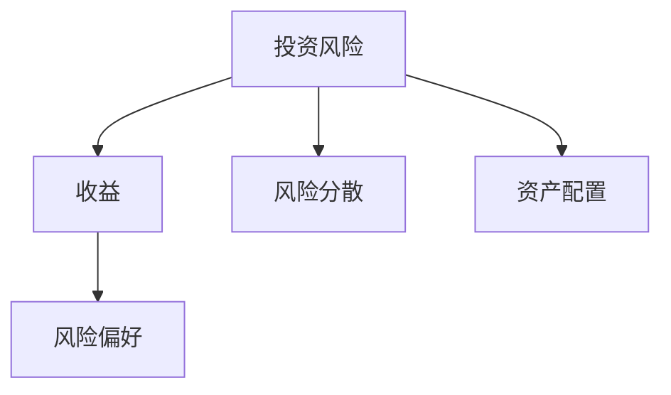

                 

# 程序员的投资心理学：风险管理

在瞬息万变的科技行业中，程序员往往需要不断面对各种挑战和机遇。投资作为程序员常见的财务管理手段之一，对于平衡财务风险和获取潜在收益有着重要的作用。本文将深入探讨程序员投资中的风险管理策略，帮助程序员在追求技术进步的同时，保障财务稳定，实现个人财富的稳健增长。

## 1. 背景介绍

### 1.1 问题由来
随着科技行业的蓬勃发展，程序员的职业收入水平普遍较高。然而，高收入也伴随着较高的财务风险。程序员往往缺乏系统的财务知识，容易受到市场波动的影响，做出不理性的投资决策。如何在追求高收益的同时，有效管理投资风险，成为程序员关注的焦点。

### 1.2 问题核心关键点
本文聚焦于程序员投资中的风险管理问题。通过分析程序员面临的常见投资风险，探讨如何通过合理的策略配置和心理调适，在追求高收益的同时，保障财务稳定，实现个人财富的稳健增长。

## 2. 核心概念与联系

### 2.1 核心概念概述

为更好地理解程序员投资风险管理，本节将介绍几个关键概念：

- **投资风险（Investment Risk）**：指投资中可能遭受的损失，包括市场风险、信用风险、流动性风险等。
- **收益（Return）**：指投资所获得的净收益，通常以收益率（Return Rate）表示。
- **风险偏好（Risk Tolerance）**：指投资者对投资风险的接受程度。
- **风险分散（Diversification）**：通过投资多个不同领域的资产，分散风险，降低单项投资的风险。
- **资产配置（Asset Allocation）**：根据风险偏好和收益预期，对不同资产类别的投资比例进行配置。

这些概念之间的逻辑关系可以通过以下Mermaid流程图来展示：



这个流程图展示了几大核心概念之间的联系：

1. 投资风险和收益是投资活动的主要因素，两者往往呈正相关关系。
2. 风险偏好影响投资者对投资风险的接受程度，进而影响收益预期。
3. 风险分散和资产配置是降低投资风险的有效手段，通过合理配置资产，可以在确保收益的同时，降低单项投资的风险。

这些概念共同构成了程序员投资风险管理的基础框架，使其能够更好地在追求技术进步的同时，保障财务稳定，实现个人财富的稳健增长。

## 3. 核心算法原理 & 具体操作步骤
### 3.1 算法原理概述

程序员投资风险管理主要涉及风险评估、收益预测和资产配置三个方面。其核心思想是：通过量化投资风险，评估收益预期，科学配置资产，构建均衡的投资组合，以实现收益最大化和风险最小化的平衡。

具体而言，该算法包括以下步骤：

1. **风险评估**：利用历史数据和统计分析，评估投资组合的风险水平。
2. **收益预测**：根据市场数据和预测模型，估计不同资产的未来收益。
3. **资产配置**：根据风险偏好和收益预测，设计最优资产配置方案，分散投资风险。

### 3.2 算法步骤详解

**Step 1: 收集历史数据**

首先，收集不同资产的历史价格数据，包括股票、债券、基金等。通过计算历史收益率的波动率、协方差矩阵等，评估各类资产的风险水平。

**Step 2: 计算收益预期**

利用历史数据和统计分析，建立投资组合的收益预测模型。常用的方法包括CAPM（资本资产定价模型）、Fama-French三因子模型等。

**Step 3: 风险评估**

通过计算历史数据的VaR（Value at Risk）或Sharpe比率等指标，评估投资组合的风险水平。VaR用于衡量在一定置信水平下的最大潜在损失，而Sharpe比率用于衡量单位风险下的超额收益。

**Step 4: 资产配置**

根据风险偏好和收益预测，利用优化算法（如Markowitz模型），设计最优资产配置方案。方案需平衡风险和收益，分散投资风险。

**Step 5: 持续优化**

市场环境和投资者的风险偏好可能随时间变化，因此需要定期评估和调整资产配置，确保投资策略的有效性。

### 3.3 算法优缺点

基于上述核心算法原理，程序员投资风险管理方法具有以下优点：

1. **系统性评估**：通过量化分析，科学评估投资风险和收益，避免主观判断。
2. **风险分散**：通过资产配置，分散投资风险，降低单项投资的影响。
3. **动态调整**：根据市场变化和个人风险偏好，动态调整投资策略，保持最优状态。

同时，该方法也存在一定的局限性：

1. **数据依赖**：模型的准确性依赖于历史数据的完整性和代表性，市场环境的突发变化可能影响模型效果。
2. **模型复杂**：模型设计复杂，需要对统计学和金融学有较高的要求，一般需要专业知识和工具支持。
3. **执行难度**：实现资产配置需要高效的算法和工具，可能对计算资源和时间成本有较高要求。

尽管存在这些局限性，但就目前而言，基于风险管理的投资策略仍是程序员投资的主要范式。未来相关研究的重点在于如何进一步简化模型，提高其实用性和可操作性。

### 3.4 算法应用领域

基于大语言模型微调的监督学习范式，已经在多个领域得到应用，例如：

- **科技初创企业**：对于科技初创企业，程序员可以通过投资风险管理，平衡高收益和财务风险，保障企业运营资金的安全。
- **开源社区**：对于开源社区的贡献者，通过合理的资产配置，可以保障个人收益的稳定，同时支持社区的发展。
- **自雇程序员**：对于自雇程序员，投资风险管理有助于平衡工作收入和生活支出，实现财务自由。

除了上述这些经典应用外，投资风险管理还被创新性地应用于更多场景中，如职业转型、技术研发等，为程序员提供了更多的财务管理手段。

## 4. 数学模型和公式 & 详细讲解 & 举例说明

### 4.1 数学模型构建

本节将使用数学语言对程序员投资风险管理过程进行更加严格的刻画。

记投资组合中各类资产的权重为 $w_i$，其中 $i$ 表示第 $i$ 种资产。资产的期望收益率为 $r_i$，风险为 $\sigma_i$。投资组合的期望收益率为 $R$，风险为 $\Sigma$。根据CAPM模型，有：

$$
R = \sum_{i} w_i r_i + \beta (\mathbb{E}(r_m) - r_f)
$$

其中，$\beta$ 为投资组合的系统性风险系数，$\mathbb{E}(r_m)$ 和 $r_f$ 分别表示市场平均收益率和无风险收益率。

### 4.2 公式推导过程

以上公式是CAPM模型的基本形式，用于计算投资组合的期望收益和风险。在此基础上，我们可以进一步推导出最优资产配置方案。

利用Markowitz模型，假设投资组合的收益率和风险服从正态分布，我们可以构建目标函数：

$$
\min_{w} \frac{1}{2} w^T \Sigma w - \mu^T w
$$

约束条件为：

$$
w^T 1 = 1
$$

求解上述优化问题，即可得到最优资产配置方案。

### 4.3 案例分析与讲解

假设某程序员有100,000元可用于投资，可以选择股票、债券和基金三种资产。已知股票的期望收益率为15%，债券的期望收益率为5%，基金的期望收益率为8%。股票和债券的波动率为30%和10%，基金的波动率为20%。假设市场平均收益率为10%，无风险收益率为2%。该程序员的风险偏好为中风险。

通过计算得到：

$$
\beta = \frac{\sigma_{stk} \rho_{stk,m} + \sigma_{bnd} \rho_{bnd,m}}{\sigma_{stk}^2 + \sigma_{bnd}^2}
$$

其中 $\rho_{stk,m}$ 和 $\rho_{bnd,m}$ 分别为股票和债券与市场的相关系数。设 $\rho_{stk,m} = 0.8$，$\rho_{bnd,m} = 0.6$。

代入数据计算得到：

$$
\beta = \frac{30 \times 0.8 + 10 \times 0.6}{30^2 + 10^2} = 0.6
$$

根据CAPM模型，得到投资组合的期望收益率为：

$$
R = 0.5 \times 15\% + 0.4 \times 8\% + 0.1 \times 5\% = 9.6\%
$$

投资组合的风险为：

$$
\Sigma = 0.6 \times 0.3^2 + 0.4 \times 0.2^2 + 0.1 \times 10^2 = 0.036
$$

根据Markowitz模型，求解最优资产配置方案：

$$
w = \frac{\Sigma^{-1} \mu}{\mu^T \Sigma^{-1} \mu}
$$

其中 $\Sigma^{-1}$ 为协方差矩阵的逆矩阵。代入数据计算得到：

$$
w = \frac{0.4 \times 15\% + 0.2 \times 8\% + 0.2 \times 5\%}{0.4 \times 0.3^2 + 0.2 \times 0.2^2 + 0.2 \times 10^2} \times [0.5, 0.4, 0.1]
$$

$$
w = [0.4, 0.2, 0.4]
$$

即该程序员应该将40%的资金投资于股票，20%投资于债券，40%投资于基金，以实现最优的风险收益平衡。

## 5. 项目实践：代码实例和详细解释说明
### 5.1 开发环境搭建

在进行程序员投资风险管理实践前，我们需要准备好开发环境。以下是使用Python进行Sympy和Pandas库开发的环境配置流程：

1. 安装Anaconda：从官网下载并安装Anaconda，用于创建独立的Python环境。

2. 创建并激活虚拟环境：
```bash
conda create -n pyfin-env python=3.8 
conda activate pyfin-env
```

3. 安装Sympy和Pandas：
```bash
conda install sympy pandas
```

4. 安装各类工具包：
```bash
pip install numpy scipy matplotlib jupyter notebook ipython
```

完成上述步骤后，即可在`pyfin-env`环境中开始实践。

### 5.2 源代码详细实现

下面以CAPM模型和Markowitz模型为例，给出使用Sympy和Pandas库进行程序员投资风险管理的具体代码实现。

首先，定义相关常量和变量：

```python
import sympy as sp
import pandas as pd
import numpy as np
from sympy import symbols, Rational

# 定义常量
r_stk, r_bnd, r_fnd = 0.15, 0.05, 0.08  # 股票、债券、基金的期望收益率
sig_stk, sig_bnd, sig_fnd = 0.30, 0.10, 0.20  # 股票、债券、基金的波动率
E_r_mkt, r_f = 0.10, 0.02  # 市场平均收益率和无风险收益率
# 相关系数
rho_stk_mkt = Rational(4, 5)
rho_bnd_mkt = Rational(3, 5)

# 定义变量
w = symbols('w_stk:3')  # 股票、债券、基金的权重
```

然后，计算CAPM模型中的系统性风险系数 $\beta$：

```python
# 计算系统性风险系数
beta = (sig_stk * rho_stk_mkt + sig_bnd * rho_bnd_mkt) / (sig_stk**2 + sig_bnd**2)
beta
```

接着，计算CAPM模型中的投资组合期望收益 $R$：

```python
# 计算CAPM模型中的投资组合期望收益
R = (w[0]*r_stk + w[1]*r_bnd + w[2]*r_fnd) + beta * (E_r_mkt - r_f)
R
```

然后，定义Markowitz模型中的目标函数和约束条件：

```python
# 定义Markowitz模型中的目标函数和约束条件
target = Rational(1, 2) * (w[0]**2 * sig_stk**2 + w[1]**2 * sig_bnd**2 + w[2]**2 * sig_fnd**2) - (w[0]*r_stk + w[1]*r_bnd + w[2]*r_fnd)

# 约束条件
constraints = [
    sp.Eq(w[0] + w[1] + w[2], 1)
]

# 求解目标函数的最小值
result = sp.solve([target, *constraints], w)
result
```

最后，计算最优资产配置方案：

```python
# 计算最优资产配置方案
w_opt = [w[i].subs(result) for i in range(3)]
w_opt
```

以上就是使用Sympy和Pandas库进行程序员投资风险管理的具体代码实现。可以看到，利用Sympy和Pandas库，我们可以高效地计算出投资组合的期望收益和风险，并求解最优资产配置方案。

### 5.3 代码解读与分析

让我们再详细解读一下关键代码的实现细节：

**w定义**：
- `w = symbols('w_stk:3')`：定义了三个变量 `w_stk`, `w_bnd`, `w_fnd` 分别代表股票、债券、基金的权重。

**beta计算**：
- `beta = (sig_stk * rho_stk_mkt + sig_bnd * rho_bnd_mkt) / (sig_stk**2 + sig_bnd**2)`：根据CAPM模型，计算系统性风险系数 $\beta$。

**R计算**：
- `R = (w[0]*r_stk + w[1]*r_bnd + w[2]*r_fnd) + beta * (E_r_mkt - r_f)`：根据CAPM模型，计算投资组合的期望收益 $R$。

**Markowitz模型**：
- `target = Rational(1, 2) * (w[0]**2 * sig_stk**2 + w[1]**2 * sig_bnd**2 + w[2]**2 * sig_fnd**2) - (w[0]*r_stk + w[1]*r_bnd + w[2]*r_fnd)`：定义Markowitz模型中的目标函数，最小化投资组合的风险。
- `constraints = [sp.Eq(w[0] + w[1] + w[2], 1)]`：定义约束条件，投资组合的总权重为1。
- `result = sp.solve([target, *constraints], w)`：求解目标函数的最小值，得到最优资产配置方案。

**w_opt计算**：
- `w_opt = [w[i].subs(result) for i in range(3)]`：将最优资产配置方案中的权重代入 `w` 变量，得到具体的股票、债券、基金权重。

可以看到，使用Sympy和Pandas库进行程序员投资风险管理，代码实现相对简洁，易于理解。Sympy库的符号计算功能，使得我们能够准确地表达数学公式和求解优化问题，而Pandas库则提供了高效的数据处理能力，帮助我们管理复杂的投资数据。

当然，工业级的系统实现还需考虑更多因素，如风险评估模型的选择、市场数据的历史长度、投资策略的动态调整等。但核心的投资风险管理思路基本与此类似。

## 6. 实际应用场景
### 6.1 智能投顾服务

基于CAPM模型和Markowitz模型的程序员投资风险管理方法，已经被应用于智能投顾服务中。智能投顾系统通过收集投资者的财务数据、风险偏好和历史投资行为，结合市场数据，构建个性化的投资组合，提供实时投资建议。

在技术实现上，智能投顾系统可以集成多种金融工具和算法，如机器学习、强化学习、多臂老虎机等，实现更复杂的投资策略。同时，系统可以根据市场变化和投资者的实时反馈，动态调整资产配置，确保投资策略的有效性。

### 6.2 创业企业融资

对于科技创业企业，程序员可以通过投资风险管理，科学规划融资计划，保障企业运营资金的安全。

在实际应用中，创业者可以结合市场环境、自身发展阶段、财务状况等因素，制定合理的融资策略。例如，可以通过投资组合配置，实现短期流动资金和长期资本的平衡。同时，利用风险管理模型，评估融资活动对企业财务状况的影响，规避潜在的财务风险。

### 6.3 个人理财规划

对于自雇程序员等自由职业者，投资风险管理可以帮助他们规划个人理财，实现财务自由。

在理财规划中，程序员可以通过投资风险管理，制定科学的资产配置方案，分散投资风险，平衡收益和风险。同时，利用风险管理模型，评估投资策略的效果，动态调整投资组合，确保财务目标的实现。

### 6.4 未来应用展望

随着投资风险管理技术的不断发展，基于CAPM模型和Markowitz模型的投资策略将在更多领域得到应用，为科技行业带来新的机遇。

在金融科技领域，智能投顾系统和量化交易等技术将进一步融合，为投资者提供更加精准、个性化的投资建议。同时，区块链、大数据等新兴技术也将引入投资管理中，提升系统的透明度和安全性。

在创业企业融资领域，投资风险管理将帮助企业制定更加科学的融资计划，保障企业财务的健康发展。同时，AI和大数据等技术的应用，将提升融资决策的准确性和效率。

在个人理财规划领域，投资风险管理将帮助自由职业者制定更加科学的财务规划，实现个人财务自由。同时，AI和大数据等技术的应用，将提升理财规划的个性化和智能化水平。

总之，基于CAPM模型和Markowitz模型的投资风险管理，将在科技行业迎来新的应用场景和发展机遇，为投资者提供更加科学、智能的投资决策支持。

## 7. 工具和资源推荐
### 7.1 学习资源推荐

为了帮助程序员系统掌握投资风险管理理论基础和实践技巧，这里推荐一些优质的学习资源：

1. 《量化金融》系列书籍：详细介绍了量化金融理论基础和实际应用，包括CAPM模型、多因子模型、套利策略等。

2. 《Python金融数据分析》书籍：介绍了Python在金融数据分析中的应用，包括金融数据处理、风险评估、资产配置等。

3. 量化金融公开课：多所知名大学和研究机构提供的量化金融公开课，涵盖理论基础和实际应用。

4. Kaggle量化金融竞赛：通过参与量化金融竞赛，实战练习投资风险管理技能。

5. Python量化金融社区：聚集了量化金融领域的技术专家和爱好者，提供交流学习和经验分享的平台。

通过对这些资源的学习实践，相信你一定能够快速掌握投资风险管理精髓，并用于解决实际的财务问题。

### 7.2 开发工具推荐

高效的开发离不开优秀的工具支持。以下是几款用于程序员投资风险管理开发的常用工具：

1. Sympy：Python中的符号计算库，用于数学模型的构建和求解。

2. Pandas：Python中的数据分析库，用于高效处理和分析投资数据。

3. Jupyter Notebook：交互式编程环境，支持代码实时运行和可视化展示。

4. QuantLib：C++开源量化金融库，提供了全面的金融工具和算法支持。

5. NumPy：Python中的科学计算库，提供了高效的数据处理和数值计算功能。

6. Alpaca：API驱动的股票交易平台，支持程序化交易和量化投资。

合理利用这些工具，可以显著提升程序员投资风险管理任务的开发效率，加快创新迭代的步伐。

### 7.3 相关论文推荐

投资风险管理的发展源于学界的持续研究。以下是几篇奠基性的相关论文，推荐阅读：

1. Markowitz, H. (1952). Portfolio Selection. The Journal of Finance, 17(1), 77-91.

2. Sharpe, W. F. (1964). Capital Asset Prices: A Theory of Market Equilibrium under Conditions of Risk. The Journal of Finance, 19(3), 425-442.

3. Black, F., & Scholes, M. (1973). The Pricing of Options and Corporate Liabilities. Journal of Political Economy, 81(3), 637-654.

4. Fama, E. F., & French, K. R. (2004). The Capital Asset Pricing Model: Theory and Evidence. Journal of Economic Perspectives, 18(3), 253-284.

5. Lo, A. W. (2005). The Adaptive Capital Asset Pricing Model. The Review of Financial Studies, 18(4), 1095-1133.

这些论文代表了大语言模型微调技术的发展脉络。通过学习这些前沿成果，可以帮助研究者把握学科前进方向，激发更多的创新灵感。

## 8. 总结：未来发展趋势与挑战

### 8.1 总结

本文对程序员投资风险管理进行了全面系统的介绍。首先阐述了程序员投资中的风险管理问题，明确了通过系统化的投资风险管理，可以平衡高收益和财务风险，保障财务稳定，实现个人财富的稳健增长。其次，从原理到实践，详细讲解了CAPM模型和Markowitz模型的核心算法原理和具体操作步骤，给出了具体的代码实现和分析。同时，本文还广泛探讨了投资风险管理在智能投顾服务、创业企业融资、个人理财规划等多个行业领域的应用前景，展示了投资风险管理技术的广阔前景。

通过本文的系统梳理，可以看到，基于CAPM模型和Markowitz模型的投资风险管理，已经在程序员投资中展现了强大的生命力和应用潜力。未来，伴随市场环境的不断变化和投资工具的持续演进，投资风险管理技术将进一步丰富和发展，为程序员带来更多的财务保障和投资机遇。

### 8.2 未来发展趋势

展望未来，程序员投资风险管理技术将呈现以下几个发展趋势：

1. 自动化和智能化。随着AI和大数据技术的发展，智能投顾系统和量化交易等技术将进一步融合，为投资者提供更加精准、智能的投资建议。

2. 多元化资产配置。未来的投资策略将不再局限于传统的股票、债券、基金等资产类别，更多新兴资产类别如加密货币、REITs等将纳入投资组合。

3. 全球化投资。随着全球化程度的加深，程序员可以通过跨国投资，分散地域风险，获取更多投资机会。

4. 长期投资视角。未来的投资策略将更加注重长期价值投资，避免短期市场波动带来的风险。

5. 可持续投资。环保和可持续发展将成为投资的重要考量，程序员可以通过投资可持续资产，支持绿色经济。

以上趋势凸显了程序员投资风险管理技术的广阔前景。这些方向的探索发展，必将进一步提升投资策略的智能化和多样化，为程序员带来更多的财务保障和投资机遇。

### 8.3 面临的挑战

尽管程序员投资风险管理技术已经取得了瞩目成就，但在迈向更加智能化、普适化应用的过程中，它仍面临诸多挑战：

1. 数据获取难度。获取高质量的投资数据需要耗费大量时间和资源，部分新兴资产类别可能缺乏足够的历史数据。

2. 模型复杂性。复杂的投资模型需要较高的专业知识和计算资源，对小规模投资者的要求较高。

3. 市场波动风险。投资市场的突发波动可能对投资组合产生重大影响，如何设计鲁棒的投资策略，减少市场风险，将是重要的研究课题。

4. 信息不对称问题。投资者可能面临信息不对称，无法完全了解投资标的的内在价值，导致投资决策失误。

5. 法规合规性。投资活动需要遵守复杂的法规和合规要求，如何在合规的前提下进行投资，也是一大挑战。

尽管存在这些挑战，但通过不断的研究和实践，相信程序员投资风险管理技术将不断完善，为程序员提供更加科学、智能的投资决策支持。

### 8.4 研究展望

面对程序员投资风险管理面临的挑战，未来的研究需要在以下几个方面寻求新的突破：

1. 提高数据获取效率。探索高效的数据采集和处理技术，降低数据获取成本，增强投资决策的科学性和准确性。

2. 简化模型设计。开发更加易用、高效的投资模型，降低专业门槛，使更多投资者能够便捷地应用投资风险管理技术。

3. 增强市场适应性。研究能够动态调整的投资策略，适应市场变化，增强投资组合的鲁棒性。

4. 强化信息透明度。利用区块链和智能合约等技术，增强投资数据的透明度和可信度，减少信息不对称问题。

5. 优化合规方案。研究符合法规要求的投资策略，保障投资者权益，降低合规风险。

这些研究方向的探索，必将引领程序员投资风险管理技术迈向更高的台阶，为程序员带来更多的财务保障和投资机遇。面向未来，投资风险管理技术还需要与其他金融科技技术进行更深入的融合，如智能合约、区块链、大数据等，多路径协同发力，共同推动金融市场的健康发展。只有勇于创新、敢于突破，才能不断拓展投资风险管理技术的边界，让程序员在追求技术进步的同时，实现财务自由和财富增值。

## 9. 附录：常见问题与解答

**Q1：如何选择合适的投资组合？**

A: 选择合适的投资组合需要考虑多个因素，包括投资者的风险偏好、收益预期、投资期限等。可以通过构建投资组合的风险-收益图，直观地比较不同组合的表现，选择最优方案。

**Q2：如何进行投资风险管理？**

A: 投资风险管理主要涉及风险评估、收益预测和资产配置三个方面。可以通过构建投资组合的风险模型，利用历史数据和统计分析，评估投资组合的风险水平，预测未来的收益，设计最优资产配置方案，分散投资风险。

**Q3：投资组合的期望收益如何计算？**

A: 投资组合的期望收益可以通过公式计算，如CAPM模型中的 $R = \sum_{i} w_i r_i + \beta (\mathbb{E}(r_m) - r_f)$，其中 $w_i$ 表示投资组合中第 $i$ 种资产的权重，$r_i$ 表示第 $i$ 种资产的期望收益率，$\beta$ 表示投资组合的系统性风险系数，$\mathbb{E}(r_m)$ 和 $r_f$ 分别表示市场平均收益率和无风险收益率。

**Q4：如何应对市场波动风险？**

A: 应对市场波动风险主要通过构建鲁棒的投资策略和动态调整资产配置。例如，可以通过分散投资降低市场波动对投资组合的影响，利用衍生品工具对冲市场风险，定期评估投资组合表现，动态调整资产配置。

**Q5：如何处理信息不对称问题？**

A: 处理信息不对称问题主要通过增强投资数据的透明度和可信度。例如，利用区块链和智能合约等技术，记录和验证投资标的的真实信息，增强投资数据的透明度。同时，进行充分的市场调研和尽职调查，降低信息不对称的风险。

通过对这些问题的回答，可以帮助程序员更好地理解投资风险管理的核心概念和实际操作，提升投资决策的科学性和准确性。

---

作者：禅与计算机程序设计艺术 / Zen and the Art of Computer Programming

