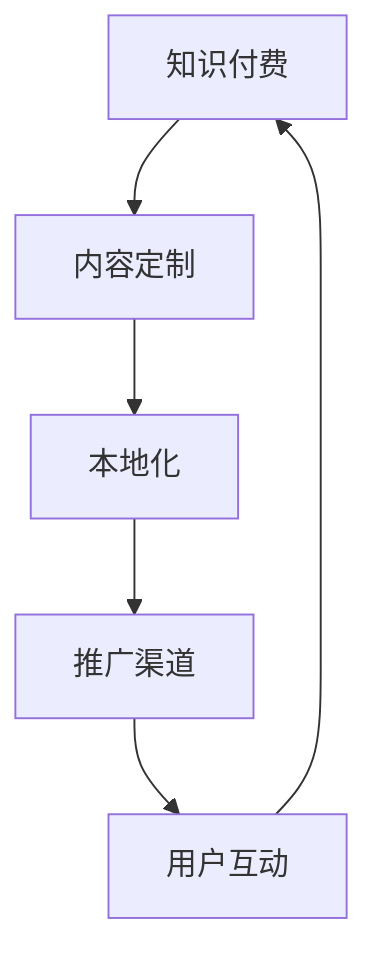

                 

# 程序员的知识付费内容本地化策略

> 关键词：知识付费, 本地化, 开发者, 内容策略, 推广渠道, 用户需求

## 1. 背景介绍

随着互联网的快速发展，知识付费市场迅速壮大，尤其在程序员群体中，具有高性价比和针对性强的在线课程、文章和书籍成为了行业内人士的重要学习资源。然而，尽管知识付费内容极其丰富，各地用户对知识内容的接受度却存在显著差异。本地化是知识付费内容发展的重要环节，能够针对不同地域用户的特定需求，提供更精准、更符合当地文化和市场环境的内容，从而提升用户的接受度和转化率。

### 1.1 问题由来
当前知识付费市场的平台众多，内容资源丰富，但用户的选择面广、付费意愿低，内容的同质化现象严重，且内容本土化程度不足。特别是对于开发者而言，由于不同地域的IT发展水平和职业需求不同，内容的相关性和适用性也存在差异。因此，如何做好知识付费内容的本地化，提高内容价值和用户体验，成为了知识付费平台和内容创作者亟需解决的重要问题。

### 1.2 问题核心关键点
知识付费内容的本地化策略涉及多个关键点：

- **用户需求分析**：了解不同地域用户的特定需求，包括职业水平、学习目的和兴趣方向等。
- **内容定制化**：针对用户需求定制内容，提升内容的实用性和相关性。
- **文化适应性**：考虑目标市场文化和语言差异，增强内容的可接受度和亲和力。
- **渠道推广**：选择适合的目标用户群体和市场推广策略，提高内容的曝光率和转化率。
- **用户互动**：加强与用户的互动和反馈，收集用户意见，持续改进内容。

本博文将重点探讨知识付费内容本地化的核心概念和具体策略，并结合实践案例，给出基于本地化策略的知识付费内容推广方案。

## 2. 核心概念与联系

### 2.1 核心概念概述

为更好地理解知识付费内容的本地化策略，本节将介绍几个关键概念及其联系：

- **知识付费**：即通过付费形式获取特定知识或技能服务，通常以在线课程、文章、书籍、讲座、问答等多种形式存在。知识付费的核心在于提供有价值、有深度的专业知识和技能培训，满足用户的学习需求。

- **本地化**：即将内容按照特定地域的用户需求和文化背景进行适配，包括语言翻译、文化适配、内容定制等。本地化内容能够更贴近用户需求，提高内容的接受度和转化率。

- **内容定制**：针对不同用户群体的特定需求，定制符合其职业水平、兴趣方向的内容。内容定制的关键在于了解用户需求并设计内容解决方案。

- **推广渠道**：选择适合目标用户群体和市场环境的推广渠道，如社交媒体、专业论坛、技术博客、视频平台等，扩大内容的曝光率和影响力。

- **用户互动**：通过用户评论、反馈、社群互动等方式，加强与用户的沟通交流，收集用户意见，持续改进和优化内容。

这些概念之间的逻辑关系可以通过以下Mermaid流程图来展示：



这个流程图展示了知识付费内容本地化策略的全流程：

1. 知识付费平台提供内容定制服务，分析用户需求，设计符合特定用户群体的内容。
2. 根据目标市场的文化和语言特点，对内容进行本地化处理。
3. 通过选择合适的推广渠道，扩大内容的覆盖范围和用户群体。
4. 通过用户互动收集反馈，持续优化和改进内容。

## 3. 核心算法原理 & 具体操作步骤

### 3.1 算法原理概述

知识付费内容的本地化策略核心在于理解用户需求，并进行定制化、本地化处理，以提升内容的实用性和亲和力。其基本原理包括：

- **需求分析**：通过调查问卷、用户行为分析、市场调研等方式，收集用户需求和痛点，设计符合特定用户群体的内容。
- **内容定制**：结合用户需求和内容资源，设计符合特定用户需求的内容框架，并细化内容模块，如课程章节、文章段落等。
- **本地化处理**：对内容进行语言翻译、文化适配、风格调整等处理，提升内容的可接受度。
- **渠道推广**：选择适合目标用户群体和市场环境的推广渠道，扩大内容的曝光率和用户群体。
- **用户互动**：通过用户评论、反馈、社群互动等方式，收集用户意见，持续改进和优化内容。

### 3.2 算法步骤详解

知识付费内容的本地化步骤具体包括：

**Step 1: 需求分析**
- 通过调查问卷、用户行为分析、市场调研等方式，收集目标用户群体的特定需求和痛点。
- 结合IT行业职业水平和市场发展状况，设计符合特定用户群体需求的内容框架。

**Step 2: 内容定制**
- 根据用户需求和内容资源，设计符合特定用户群体的内容模块。
- 细化课程章节、文章段落等，确保内容的实用性和相关性。

**Step 3: 本地化处理**
- 对内容进行语言翻译，确保目标市场用户易于理解。
- 根据目标市场的文化和语言特点，对内容进行风格和文化适配，增强内容的亲和力。

**Step 4: 渠道推广**
- 选择适合目标用户群体和市场环境的推广渠道，如技术论坛、视频平台、专业博客等。
- 制定推广策略，通过SEO优化、内容合作、广告投放等方式，扩大内容的曝光率和用户群体。

**Step 5: 用户互动**
- 通过用户评论、反馈、社群互动等方式，收集用户意见，了解用户对内容的满意度和改进需求。
- 根据用户反馈，持续改进和优化内容，提升内容的实用性和用户接受度。

### 3.3 算法优缺点

知识付费内容本地化策略的主要优点包括：

- **精准覆盖**：通过本地化内容，可以精准覆盖目标用户群体，提高内容的实用性和用户接受度。
- **提高转化率**：本地化内容符合特定市场环境和文化背景，能够有效提升用户的付费意愿和转化率。
- **增强用户粘性**：通过用户互动和反馈机制，不断改进和优化内容，提升用户对平台的粘性和忠诚度。

同时，该策略也存在一定的局限性：

- **成本较高**：本地化处理和推广策略需要投入额外的时间和资源，成本较高。
- **复杂度增加**：本地化处理涉及多语言、文化适配等问题，增加了内容制作和维护的复杂度。
- **效果依赖**：本地化效果受目标市场的用户需求和文化差异影响较大，效果难以预测。

尽管存在这些局限性，但总体而言，知识付费内容本地化策略仍是大势所趋，有助于提升平台的用户体验和价值转化率。

### 3.4 算法应用领域

知识付费内容本地化策略在IT行业的应用十分广泛，尤其在以下几个领域：

- **技术培训**：针对不同职业水平的开发者，设计符合其技能提升需求的技术课程和文章。
- **职业发展**：结合目标市场的职业需求和发展趋势，设计符合用户职业发展目标的内容。
- **项目管理**：提供针对特定市场环境的项目管理知识，提升用户的项目管理能力。
- **技术社区**：通过本地化内容，增强技术社区的吸引力和用户粘性。

## 4. 数学模型和公式 & 详细讲解 & 举例说明

### 4.1 数学模型构建

知识付费内容的本地化可以构建如下数学模型：

设目标市场用户数量为 $N$，其中愿意付费的用户数量为 $P$，内容接受度为 $A$，转化率为 $T$。则本地化策略的目标为最大化用户转化率 $T$，模型如下：

$$
\max T = P \times A
$$

其中 $P$ 可以通过用户行为分析、市场调研等方式获得；$A$ 可以通过内容定制、本地化处理等方式提升。

### 4.2 公式推导过程

以技术培训课程为例，通过调查问卷收集用户需求和职业水平，设定课程内容框架，对内容进行本地化处理，设计符合用户需求的课程模块，计算转化率 $T$。

首先，通过调查问卷，获得目标用户群体的特定需求和痛点 $D$，结合职业水平 $O$ 和市场发展状况 $M$，设计符合特定用户群体的课程框架 $C$。然后，对课程内容进行本地化处理 $L$，设计符合用户需求的课程模块 $M$，最终计算转化率 $T$：

$$
T = \frac{C}{L} \times M
$$

其中 $C$ 为课程框架，$L$ 为本地化处理过程，$M$ 为课程模块设计。

### 4.3 案例分析与讲解

某技术培训平台根据其目标用户群体（高级开发者）的需求，设计了一门高级Java课程，并进行了本地化处理。课程包括以下模块：

- **模块1**：高级Java框架介绍
- **模块2**：Java性能优化技巧
- **模块3**：Java并发编程
- **模块4**：Java微服务架构

本地化处理包括：

- **语言翻译**：将课程内容翻译成目标市场的语言（如中文），确保用户易于理解。
- **文化适配**：结合目标市场的IT发展水平和职业需求，调整课程内容，使其更符合本地用户需求。

通过调查问卷和用户行为分析，获得目标用户群体的特定需求和痛点，结合市场调研数据，设计符合用户需求的课程框架，对课程内容进行本地化处理，最终计算出转化率。

## 5. 项目实践：代码实例和详细解释说明

### 5.1 开发环境搭建

在进行知识付费内容本地化实践前，我们需要准备好开发环境。以下是使用Python进行Web开发的环境配置流程：

1. 安装Anaconda：从官网下载并安装Anaconda，用于创建独立的Python环境。

2. 创建并激活虚拟环境：
```bash
conda create -n web-env python=3.8 
conda activate web-env
```

3. 安装Flask：
```bash
pip install flask
```

4. 安装Jinja2：
```bash
pip install jinja2
```

5. 安装SQLAlchemy：
```bash
pip install sqlalchemy
```

完成上述步骤后，即可在`web-env`环境中开始本地化项目开发。

### 5.2 源代码详细实现

下面给出本地化技术培训平台的Python代码实现，包括需求分析、内容定制、本地化处理、渠道推广和用户互动等功能模块：

```python
from flask import Flask, request, jsonify
from sqlalchemy import create_engine, Column, Integer, String
from sqlalchemy.ext.declarative import declarative_base
from sqlalchemy.orm import sessionmaker
from sqlalchemy.sql import func

app = Flask(__name__)

# 数据库连接
engine = create_engine('sqlite:///localization.db')
Base = declarative_base()

# 用户需求表
class UserRequirement(Base):
    __tablename__ = 'requirements'
    id = Column(Integer, primary_key=True)
    user_id = Column(Integer)
    requirement = Column(String)
    source = Column(String)

# 课程内容表
class CourseContent(Base):
    __tablename__ = 'content'
    id = Column(Integer, primary_key=True)
    course_id = Column(Integer)
    content = Column(String)
    localization = Column(String)

# 用户互动表
class UserInteraction(Base):
    __tablename__ = 'interactions'
    id = Column(Integer, primary_key=True)
    user_id = Column(Integer)
    interaction = Column(String)
    time = Column(DateTime, default=func.now())

# 创建表
Base.metadata.create_all(engine)

# 数据库操作
Session = sessionmaker(bind=engine)
session = Session()

@app.route('/requirements', methods=['POST'])
def add_requirement():
    data = request.json
    user_id = data['user_id']
    requirement = data['requirement']
    source = data['source']
    new_req = UserRequirement(user_id=user_id, requirement=requirement, source=source)
    session.add(new_req)
    session.commit()
    return jsonify({'status': 'OK'})

@app.route('/content', methods=['POST'])
def add_content():
    data = request.json
    course_id = data['course_id']
    content = data['content']
    localization = data['localization']
    new_cont = CourseContent(course_id=course_id, content=content, localization=localization)
    session.add(new_cont)
    session.commit()
    return jsonify({'status': 'OK'})

@app.route('/interactions', methods=['POST'])
def add_interaction():
    data = request.json
    user_id = data['user_id']
    interaction = data['interaction']
    new_int = UserInteraction(user_id=user_id, interaction=interaction)
    session.add(new_int)
    session.commit()
    return jsonify({'status': 'OK'})

@app.route('/get_requirements', methods=['GET'])
def get_requirements():
    user_id = request.args.get('user_id')
    reqs = session.query(UserRequirement).filter_by(user_id=user_id).all()
    return jsonify([{'requirement': req.requirement, 'source': req.source} for req in reqs])

@app.route('/get_content', methods=['GET'])
def get_content():
    course_id = request.args.get('course_id')
    conts = session.query(CourseContent).filter_by(course_id=course_id).all()
    return jsonify([{'id': cont.id, 'content': cont.content, 'localization': cont.localization} for cont in conts])

@app.route('/get_interactions', methods=['GET'])
def get_interactions():
    user_id = request.args.get('user_id')
    ints = session.query(UserInteraction).filter_by(user_id=user_id).all()
    return jsonify([{'interaction': int.interaction} for int in ints])

if __name__ == '__main__':
    app.run(debug=True)
```

### 5.3 代码解读与分析

让我们再详细解读一下关键代码的实现细节：

**用户需求表UserRequirement**：
- 用于存储用户需求，包括用户ID、需求内容、来源等信息。

**课程内容表CourseContent**：
- 用于存储课程内容，包括课程ID、内容内容、本地化处理等信息。

**用户互动表UserInteraction**：
- 用于记录用户互动，包括用户ID、互动内容、互动时间等信息。

**数据库操作**：
- 使用SQLAlchemy库实现数据库连接和操作，包括创建表、添加数据、查询数据等。

**Flask路由**：
- 使用Flask框架实现Web服务，通过路由处理用户请求。

**API接口**：
- 提供API接口供前端获取用户需求、课程内容和用户互动信息，用于数据处理和显示。

**项目实例**：
- 通过Flask框架，可以搭建本地化技术培训平台，实现用户需求收集、课程内容本地化处理、用户互动记录等功能。

## 6. 实际应用场景

### 6.1 技术培训平台

某技术培训平台通过本地化内容，提升了高级Java课程的用户转化率。平台根据用户调查问卷和行为分析，收集目标用户群体的特定需求和痛点，设计符合用户需求的课程框架，并对课程内容进行本地化处理。例如，对于Java并发编程模块，平台提供了多语言版本和详细的本地化文档，帮助用户更好地理解和掌握并发编程技巧。

### 6.2 职业发展社区

某职业发展社区通过本地化内容，增强了用户的粘性和活跃度。社区根据用户职业水平和市场发展状况，提供针对性的职业发展课程和案例分析，并对内容进行本地化处理。例如，对于人工智能领域的课程，社区提供中文翻译和案例讲解，帮助用户更好地理解和应用人工智能技术。

### 6.3 项目管理工具

某项目管理工具通过本地化内容，提升了项目管理课程的用户满意度。平台根据用户反馈和市场调研，设计符合用户需求的课程模块，并对内容进行本地化处理。例如，对于敏捷项目管理课程，平台提供了详细的本地化文档和实战案例，帮助用户更好地掌握敏捷项目管理方法。

## 7. 工具和资源推荐

### 7.1 学习资源推荐

为了帮助开发者系统掌握知识付费内容的本地化策略，这里推荐一些优质的学习资源：

1. Udacity《用户体验设计》课程：通过实际案例，介绍如何设计符合用户需求的本地化内容。

2. Coursera《全球化市场营销》课程：讲解如何在全球化市场环境下推广本地化内容，提升用户转化率。

3. 《知识付费内容的本地化策略》系列博文：由知识付费平台技术专家撰写，深入浅出地介绍了知识付费内容本地化的策略和实践方法。

4. HubSpot《内容本地化指南》：提供了详细的内容本地化策略和实际案例，助力内容创作者提升本地化效果。

5. Alexa《全球化网站优化指南》：讲解如何通过本地化内容提升网站的用户体验和转化率，适用于技术培训平台。

通过这些资源的学习实践，相信你一定能够快速掌握知识付费内容的本地化策略，并用于解决实际的业务问题。

### 7.2 开发工具推荐

高效的开发离不开优秀的工具支持。以下是几款用于知识付费内容本地化开发的常用工具：

1. Flask：基于Python的Web开发框架，灵活轻量，适合快速迭代和内容管理。

2. SQLAlchemy：Python的ORM框架，提供数据库连接和操作的功能，方便数据存储和处理。

3. Jupyter Notebook：交互式Python开发环境，适合数据处理和模型训练。

4. Git：版本控制系统，方便团队协作和代码管理。

5. Docker：容器化技术，方便应用程序的打包、部署和迁移。

6. TensorBoard：TensorFlow的可视化工具，方便模型训练和调试。

合理利用这些工具，可以显著提升知识付费内容本地化任务的开发效率，加快创新迭代的步伐。

### 7.3 相关论文推荐

知识付费内容本地化的研究涉及多个学科领域，以下是几篇奠基性的相关论文，推荐阅读：

1. "The Effects of Localization on User Experience and Conversion"（用户体验与转化率的关系）：探讨本地化内容对用户体验和转化的影响。

2. "Content Localization in a Global Market"（全球市场下的内容本地化）：提供全球化市场环境下内容本地化的策略和方法。

3. "User-Centric Content Creation and Localization"（用户中心的内容创建和本地化）：介绍如何设计符合用户需求的内容本地化方案。

4. "The Impact of Cultural Factors on Content Localization"（文化因素对内容本地化的影响）：分析不同文化背景下内容本地化的挑战和解决方案。

5. "Adaptive Localization Strategies for E-learning Platforms"（适应性本地化策略）：介绍如何根据用户需求和市场变化，动态调整内容本地化策略。

这些论文代表了大语言模型微调技术的发展脉络。通过学习这些前沿成果，可以帮助研究者把握学科前进方向，激发更多的创新灵感。

## 8. 总结：未来发展趋势与挑战

### 8.1 总结

本文对知识付费内容本地化的核心概念和具体策略进行了全面系统的介绍。首先阐述了知识付费内容和本地化的背景及意义，明确了本地化在提升用户接受度和转化率方面的重要性。其次，从需求分析到内容定制、本地化处理、推广渠道和用户互动等环节，详细讲解了本地化策略的各个步骤，并给出了实际应用案例。通过本文的系统梳理，可以看到，知识付费内容本地化策略正成为内容创作者和平台运营商的重要关注点，能够显著提升内容的实用性和用户转化率。

通过本文的系统梳理，可以看到，知识付费内容本地化策略正成为内容创作者和平台运营商的重要关注点，能够显著提升内容的实用性和用户转化率。

### 8.2 未来发展趋势

展望未来，知识付费内容本地化策略将呈现以下几个发展趋势：

1. **智能化分析**：利用AI和大数据技术，深入分析用户需求和行为，设计更精准的本地化内容。

2. **自动化工具**：开发自动化本地化工具，提升内容定制和本地化处理的效率和准确性。

3. **跨平台推广**：利用社交媒体、视频平台等跨平台渠道，扩大内容的覆盖范围和用户群体。

4. **个性化推荐**：结合用户行为数据和内容特征，提供个性化的内容推荐，提升用户满意度。

5. **本地化社区**：构建本地化内容社区，增强用户互动和粘性，促进内容交流和共享。

以上趋势凸显了知识付费内容本地化策略的广阔前景。这些方向的探索发展，必将进一步提升内容的价值和用户体验，为知识付费平台和内容创作者带来更多的发展机遇。

### 8.3 面临的挑战

尽管知识付费内容本地化策略已经取得了一定的进展，但在迈向更加智能化、普适化应用的过程中，仍面临诸多挑战：

1. **成本高昂**：本地化处理和推广策略需要投入额外的时间和资源，成本较高。

2. **复杂度高**：本地化处理涉及多语言、文化适配等问题，增加了内容制作和维护的复杂度。

3. **效果不稳定**：本地化效果受目标市场的用户需求和文化差异影响较大，效果难以预测。

4. **用户期望高**：用户对内容的期望值高，本地化内容必须符合高标准，否则易引发用户不满。

5. **市场变化快**：市场环境和用户需求变化快，需要不断调整和优化本地化策略。

尽管存在这些挑战，但总体而言，知识付费内容本地化策略仍是大势所趋，有助于提升平台的用户体验和价值转化率。

### 8.4 研究展望

面对知识付费内容本地化所面临的挑战，未来的研究需要在以下几个方面寻求新的突破：

1. **数据驱动**：利用大数据和AI技术，深入分析用户需求和行为，设计更精准的本地化内容。

2. **自动化工具**：开发自动化本地化工具，提升内容定制和本地化处理的效率和准确性。

3. **多模态融合**：结合文本、视频、音频等多模态数据，提升内容的多样性和用户体验。

4. **社交网络**：利用社交媒体、视频平台等跨平台渠道，扩大内容的覆盖范围和用户群体。

5. **个性化推荐**：结合用户行为数据和内容特征，提供个性化的内容推荐，提升用户满意度。

6. **本地化社区**：构建本地化内容社区，增强用户互动和粘性，促进内容交流和共享。

这些研究方向将引领知识付费内容本地化策略走向更高的台阶，为内容创作者和平台运营商带来更多的发展机遇。面向未来，知识付费内容本地化策略还需要与其他人工智能技术进行更深入的融合，共同推动自然语言理解和智能交互系统的进步。只有勇于创新、敢于突破，才能不断拓展内容本地化的边界，让知识付费技术更好地服务于人类社会。

## 9. 附录：常见问题与解答

**Q1：如何进行用户需求分析？**

A: 用户需求分析可以通过调查问卷、用户行为分析、市场调研等方式进行。例如，可以通过在线调查问卷了解用户对课程内容的期望和痛点，结合用户行为数据分析用户的学习路径和偏好，最后结合市场调研数据，设计符合用户需求的课程框架。

**Q2：如何选择适合目标用户群体的推广渠道？**

A: 选择推广渠道需要考虑目标用户群体的特点和市场环境。例如，对于技术开发者，可以选择技术论坛、视频平台、专业博客等渠道；对于职业发展人员，可以选择职业发展社区、行业报告、职业认证平台等渠道。

**Q3：如何进行本地化处理？**

A: 本地化处理主要涉及语言翻译、文化适配、风格调整等。例如，将课程内容翻译成目标市场的语言，根据目标市场的文化和语言特点，调整课程内容，使其更符合本地用户需求。

**Q4：如何进行用户互动和反馈收集？**

A: 用户互动和反馈收集可以通过评论、反馈表、社群互动等方式进行。例如，可以在课程页面下方设置评论区，让用户发表自己的意见和建议，定期收集和分析用户反馈，持续改进和优化课程内容。

**Q5：如何设计符合用户需求的课程框架？**

A: 设计符合用户需求的课程框架需要结合用户行为分析、市场调研和专家意见。例如，可以通过用户行为数据了解用户的职业水平和学习目标，结合市场调研和专家意见，设计符合用户需求的课程框架。

通过本文的系统梳理，可以看到，知识付费内容的本地化策略正成为内容创作者和平台运营商的重要关注点，能够显著提升内容的实用性和用户转化率。未来，通过不断创新和优化，知识付费内容本地化策略必将进一步提升用户价值，助力内容创作者和平台运营商实现更高的市场份额和用户满意度。

