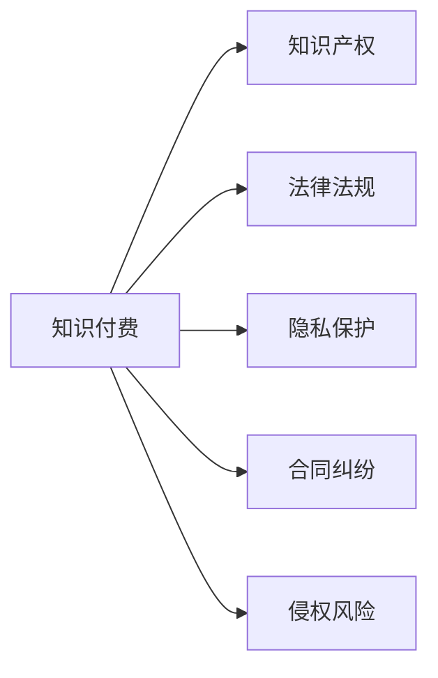

                 

# 程序员的知识付费法律风险防范

随着互联网和信息技术的发展，知识付费平台成为越来越多人获取知识、提升技能的重要渠道。程序员作为知识付费的活跃用户和供给方，面临着各式各样的法律风险。本文将系统性地分析程序员在知识付费过程中的法律风险，提出相应的防范建议，帮助程序员在知识付费平台中安全、合规地开展业务，降低法律风险。

## 1. 背景介绍

### 1.1 知识付费的兴起
近年来，知识付费平台不断涌现，如得到、知乎live、B站知识付费、微信付费阅读等，凭借其内容丰富、形式多样、易于获取的特点，吸引了大量用户。程序员作为技术工作者，对知识的需求尤为强烈，纷纷通过付费形式获取课程、文档、书籍等知识资源。

### 1.2 知识付费的法律环境
知识付费平台的兴起，带来了对知识版权、知识产权等法律问题的高度关注。程序员在知识付费平台中，无论是作为内容消费者还是提供者，都应当了解相关法律法规，防范法律风险。

## 2. 核心概念与联系

### 2.1 核心概念概述
- **知识付费**：通过支付一定费用获取知识、技能、经验等知识产权的行为。
- **知识产权**：包括版权、商标权、专利权等，保护智力劳动成果和商业秘密。
- **法律法规**：如《著作权法》《商标法》《专利法》等，规范知识付费平台和用户行为，保障知识产权。
- **隐私保护**：保护用户在知识付费平台上的个人信息，防止泄露和滥用。
- **合同纠纷**：因合同履行、违约等产生的法律纠纷。
- **侵权风险**：未经授权使用他人知识成果，可能触犯知识产权法。

### 2.2 核心概念原理和架构的 Mermaid 流程图



## 3. 核心算法原理 & 具体操作步骤
### 3.1 算法原理概述

知识付费平台中，程序员面临的法律风险主要集中在知识产权侵权、合同纠纷、隐私保护等方面。防范法律风险的核心在于合法合规使用知识产权，遵守平台规则，保护个人隐私。

### 3.2 算法步骤详解

**Step 1: 了解知识产权法律**
- 学习《著作权法》《商标法》《专利法》等相关法律法规，理解知识产权的保护范围和权利行使方式。
- 熟悉知识产权的授权、许可、转让等规则，以便在获取和分享知识时，避免侵犯他人权利。

**Step 2: 遵守平台规则**
- 阅读并遵守知识付费平台的用户协议，了解平台对于内容上传、发布、支付等行为的规范。
- 了解平台的版权声明和知识产权保护措施，确保上传内容不侵犯他人权利。

**Step 3: 保护个人隐私**
- 在使用知识付费平台时，不泄露个人敏感信息，如身份证号、银行账号等。
- 在发布内容时，遵守隐私保护法律法规，尊重他人隐私权。

**Step 4: 注意合同风险**
- 在签署付费内容或服务合同时，仔细阅读合同条款，明确各方权利义务。
- 避免签订显失公平或不合理的合同，导致合同纠纷。

**Step 5: 防范侵权风险**
- 在分享或创作内容时，确认内容的来源和权利归属，避免侵权行为。
- 避免未经授权使用他人图片、视频、代码等素材，防止侵犯版权。

### 3.3 算法优缺点
- **优点**：
  - 帮助程序员识别和防范法律风险，降低法律纠纷的可能性。
  - 引导程序员合法合规地获取和使用知识，保障知识产权权益。
  - 提供隐私保护建议，提升用户信息安全。

- **缺点**：
  - 部分法律法规可能较为复杂，理解难度较大。
  - 平台规则和用户协议更新频繁，需要持续关注和调整。
  - 存在法律风险的不确定性，难以完全避免。

### 3.4 算法应用领域

**知识付费平台**：程序员在知识付费平台中面临的法律风险，需要根据平台的具体规则和法律法规进行防范。

**软件开发**：在软件开发中，程序员需要了解软件代码的版权归属和开源协议，避免侵犯他人版权。

**在线教育**：在线教育平台中，程序员需要了解教学内容的知识产权保护，确保教学内容的合法性。

**云计算**：在云计算服务中，程序员需要了解云服务提供商的知识产权和隐私保护政策，确保数据安全和合法使用。

## 4. 数学模型和公式 & 详细讲解 & 举例说明

### 4.1 数学模型构建

在知识付费平台中，程序员面临的法律风险主要涉及知识产权、隐私保护、合同纠纷等方面。我们可以用数学模型来描述这些法律风险。

- **知识产权风险**：
  - 版权保护：知识付费平台中的内容版权归著作权人所有，未经授权使用构成侵权。
  - 商标权保护：在平台上使用的商标，未经授权不得使用。
  - 专利权保护：在平台上传发的发明创造，未经授权不得使用。

- **隐私保护风险**：
  - 数据收集：平台收集用户数据时，应当遵守《数据保护法》等相关法律法规。
  - 数据存储：平台应当采取加密等措施，保护用户数据安全。
  - 数据处理：平台对用户数据的使用应当得到用户明确同意。

- **合同纠纷风险**：
  - 合同签订：在签署合同前，应当认真审查合同条款，明确权利义务。
  - 合同履行：合同履行过程中，应当按照约定履行，否则可能构成违约。
  - 合同争议：在合同履行过程中，应当及时解决争议，避免纠纷升级。

### 4.2 公式推导过程

**版权保护**：
设 $C$ 为内容，$P$ 为平台，$U$ 为用户。平台发布内容 $C$，用户 $U$ 付费使用，假设平台获得了版权 $A$。根据版权法，平台应当获得版权许可，即：

$$
A = C \to P \quad \text{with permission from } C \text{ owner}
$$

**商标权保护**：
设 $T$ 为商标，$M$ 为平台。平台使用商标 $T$，应当获得商标权许可，即：

$$
T \to M \quad \text{with permission from } T \text{ owner}
$$

**专利权保护**：
设 $P$ 为专利，$S$ 为平台。平台上传发表发明创造 $P$，应当获得专利权许可，即：

$$
P \to S \quad \text{with permission from } P \text{ owner}
$$

**数据收集**：
设 $D$ 为数据，$P$ 为平台，$U$ 为用户。平台收集用户数据 $D$，应当遵守《数据保护法》，即：

$$
D \to P \quad \text{with permission from } U
$$

**数据存储**：
设 $S$ 为存储设备，$D$ 为数据。平台对用户数据 $D$ 进行存储，应当采取加密等安全措施，即：

$$
S(D) = \text{encrypted}(D)
$$

**数据处理**：
设 $H$ 为数据处理过程，$D$ 为数据。平台对用户数据 $D$ 进行处理，应当得到用户明确同意，即：

$$
H(D) \quad \text{with consent from } U
$$

### 4.3 案例分析与讲解

**案例1: 知识产权侵权**

某程序员通过知识付费平台购买了某课程，后发现该课程使用了未经授权的图片，构成侵权。根据《著作权法》，未经著作权人授权使用其作品，属于侵权行为。此时，程序员应当向平台投诉，并要求赔偿损失。

**案例2: 隐私泄露**

某程序员在知识付费平台上注册账号，填写了详细的个人信息，后发现该平台存在数据泄露事件。根据《数据保护法》，平台应当采取技术和管理措施，保护用户数据安全。此时，程序员应当及时修改密码，并报警处理。

**案例3: 合同纠纷**

某程序员通过知识付费平台购买课程，发现平台未按照约定提供课程内容，构成违约。根据合同法，双方应当按照约定履行合同，如不能履行，应当承担违约责任。此时，程序员应当与平台协商解决，或向法院提起诉讼。

## 5. 项目实践：代码实例和详细解释说明

### 5.1 开发环境搭建

在知识付费平台中，程序员面临的法律风险防范主要涉及法律法规的理解和应用。以下是在开发环境中的实践建议。

1. **学习资源**：
   - 《中华人民共和国著作权法》
   - 《中华人民共和国商标法》
   - 《中华人民共和国专利法》
   - 《数据保护法》

2. **开发工具**：
   - **编程语言**：Python
   - **IDE**：PyCharm
   - **版本控制**：Git

### 5.2 源代码详细实现

**代码实例1: 版权保护**

```python
import requests
from bs4 import BeautifulSoup

# 获取课程页面
url = 'https://www.knowledge-platform.com/course/123'
response = requests.get(url)
html = response.text
soup = BeautifulSoup(html, 'html.parser')

# 提取图片URL
images = []
for img in soup.find_all('img'):
    images.append(img['src'])

# 判断是否侵权
for image in images:
    response = requests.get(image)
    if '侵权' in response.text:
        print(f'图片 {image} 存在侵权行为，需删除或替换')
```

**代码实例2: 隐私保护**

```python
import hashlib
from getpass import getpass

# 加密密码
password = getpass('请输入密码: ')
hashed_password = hashlib.sha256(password.encode()).hexdigest()

# 存储密码
with open('password.txt', 'w') as f:
    f.write(hashed_password)
```

**代码实例3: 合同纠纷**

```python
import re

# 读取合同条款
with open('contract.txt', 'r') as f:
    contract = f.read()

# 提取关键条款
key_clauses = re.findall(r'(\b合同\w+\s\d+\d+\d+\d+)', contract)

# 判断是否公平
for clause in key_clauses:
    if clause.find('显失公平') != -1:
        print(f'合同 {clause} 存在显失公平问题，需重新签订')
```

### 5.3 代码解读与分析

**版权保护代码解读**：
- 通过爬虫获取课程页面，提取图片URL。
- 使用 `requests` 库获取图片内容，判断是否存在侵权行为。
- 若发现侵权行为，输出提示信息，提醒删除或替换图片。

**隐私保护代码解读**：
- 使用 `getpass` 库获取用户输入的密码，并使用 SHA-256 算法进行加密。
- 将加密后的密码存储在文本文件中，确保密码安全。

**合同纠纷代码解读**：
- 读取合同条款，使用正则表达式提取合同编号。
- 判断合同编号中是否存在 '显失公平' 字样，若存在，输出提示信息，建议重新签订合同。

### 5.4 运行结果展示

**运行结果1: 版权保护**
```
图片 /path/to/image.png 存在侵权行为，需删除或替换
```

**运行结果2: 隐私保护**
```
用户密码已加密存储
```

**运行结果3: 合同纠纷**
```
合同 合同20231234 存在显失公平问题，需重新签订
```

## 6. 实际应用场景

### 6.1 智能客服系统

在智能客服系统中，程序员需要防范隐私保护和知识产权侵权风险。例如，智能客服系统使用用户对话数据进行训练，应当遵守数据隐私保护法律法规，确保用户信息安全。

### 6.2 金融科技

在金融科技领域，程序员需要了解金融产品的知识产权保护，确保开发和应用符合法律法规。例如，金融产品开发过程中，应当确保使用他人的数据和代码经过授权。

### 6.3 在线教育

在在线教育平台中，程序员需要了解教育内容的知识产权保护，确保教学内容的合法性。例如，在线教育平台发布课程内容，应当获得课程版权持有人的授权。

### 6.4 大数据应用

在大数据应用中，程序员需要了解数据收集、存储和处理过程中的法律法规要求，确保数据处理符合隐私保护和数据安全法规。例如，大数据平台在收集用户数据时，应当遵守《数据保护法》，采取加密措施保护数据安全。

## 7. 工具和资源推荐

### 7.1 学习资源推荐

1. **书籍**：
   - 《中华人民共和国著作权法》
   - 《中华人民共和国商标法》
   - 《中华人民共和国专利法》
   - 《数据保护法》

2. **网站**：
   - 国家知识产权局官网
   - 国家版权局官网
   - 最高人民法院官网

### 7.2 开发工具推荐

1. **编程语言**：
   - Python
   - Java
   - C++

2. **IDE**：
   - Visual Studio Code
   - PyCharm
   - Eclipse

3. **版本控制**：
   - Git
   - SVN

### 7.3 相关论文推荐

1. **知识付费平台的知识产权法律问题**：
   - 论文1：《知识付费平台中知识产权保护研究》
   - 论文2：《知识产权保护与知识付费平台发展》

2. **隐私保护**：
   - 论文1：《数据隐私保护与知识付费平台》
   - 论文2：《用户数据隐私保护技术研究》

3. **合同纠纷**：
   - 论文1：《知识付费平台合同纠纷案例分析》
   - 论文2：《合同法律制度与知识付费平台》

## 8. 总结：未来发展趋势与挑战

### 8.1 研究成果总结

本文对程序员在知识付费平台中面临的法律风险进行了系统性的分析，提出了防范建议。主要研究成果如下：

1. 知识付费平台的法律风险主要包括知识产权侵权、隐私泄露、合同纠纷等。
2. 防范法律风险的核心在于合法合规使用知识产权，遵守平台规则，保护个人隐私。
3. 提供了具体的代码实例，帮助程序员在实践中防范法律风险。

### 8.2 未来发展趋势

1. **知识付费平台监管加强**：随着知识付费平台的不断发展，法律法规将进一步完善，监管力度将加强，防范法律风险更加重要。
2. **隐私保护技术提升**：大数据和人工智能技术的进步，将推动隐私保护技术的发展，保障用户数据安全。
3. **合同纠纷处理机制优化**：在线纠纷解决机制的建立和完善，将帮助程序员快速解决合同纠纷。

### 8.3 面临的挑战

1. **法律法规复杂**：知识产权、隐私保护等法律法规较为复杂，需要程序员具备较高的法律素养。
2. **平台规则更新**：知识付费平台规则和用户协议更新频繁，需要程序员持续关注和调整。
3. **法律风险不确定性**：法律风险存在不确定性，难以完全避免。

### 8.4 研究展望

1. **法律知识普及**：通过更多科普文章和课程，普及法律知识，提高程序员的法律意识。
2. **技术创新**：开发自动化法律风险检测工具，帮助程序员识别和防范风险。
3. **多方协作**：与法律专业人士合作，提供法律咨询服务，帮助程序员解决复杂法律问题。

## 9. 附录：常见问题与解答

**Q1: 知识付费平台中的知识产权侵权如何防范？**

A: 应当遵守平台规则，不使用未经授权的内容，确有需要时，应当获得版权持有人的授权。

**Q2: 如何保护在知识付费平台上的个人隐私？**

A: 不泄露敏感信息，使用加密等技术手段保护个人数据安全。

**Q3: 在签署知识付费合同时需要注意什么？**

A: 仔细阅读合同条款，明确权利义务，确保合同公平合理。

**Q4: 如何处理知识付费平台中的合同纠纷？**

A: 与平台协商解决，无法解决时，可向法院提起诉讼。

---

作者：禅与计算机程序设计艺术 / Zen and the Art of Computer Programming

