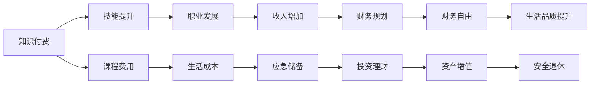

                 

# 程序员的知识付费财务规划

> 关键词：知识付费, 程序员, 财务规划, 财务自由, 投资理财

## 1. 背景介绍

在当今数字化、智能化的浪潮中，知识付费逐渐成为了一个热门趋势。特别是在IT行业，技术日新月异，开发者需要通过不断学习和提升自身技能以保持竞争力。然而，高昂的课程费用、项目开发成本以及日常生活中的其他开销，使得许多程序员面临财务压力。本文旨在为程序员提供一份系统的财务规划指南，帮助他们在追求知识和职业发展的同时，实现财务自由。

## 2. 核心概念与联系

### 2.1 核心概念概述

在制定财务规划时，首先需要明确以下几个核心概念：

- **知识付费**：指的是通过付费购买课程、订阅服务、参加培训等方式，获取新知识或提升技能的行为。对于程序员而言，知识付费不仅包括技术课程，还包括软技能培训、个人兴趣拓展等。
- **财务自由**：指的是个人或家庭的财务状况，在扣除基本生活开销和应急储备后，剩余收入能够覆盖所有开支，无需担心收入不足的情况。
- **财务规划**：是指通过合理规划个人或家庭的收入、支出和资产配置，以达到财务自由的目标。财务规划需要考虑到税收、投资、风险管理等多方面因素。

这些概念之间存在紧密的联系。知识付费是实现财务自由的重要手段之一，而良好的财务规划则是确保知识付费投资能够带来实际收益的关键。

### 2.2 核心概念原理和架构的 Mermaid 流程图



## 3. 核心算法原理 & 具体操作步骤

### 3.1 算法原理概述

知识付费和财务规划的结合，本质上是一个动态平衡的过程。通过系统地规划知识付费的投入和收益，使得个人财务状况能够向更好的方向发展。

在这个过程中，需要考虑到以下几个关键因素：

- **目标设定**：明确知识付费的目标和期望，比如学习某项技术、提升工作效率等。
- **成本评估**：评估每次知识付费的实际成本，包括课程费用、工具购买等。
- **收益预估**：根据所学知识和技能，预估未来可能的收入增加或职业发展机会。
- **风险管理**：评估财务规划过程中的潜在风险，如投资失败、职业变动等。
- **定期调整**：根据实际情况和市场变化，定期调整财务规划和知识付费策略。

### 3.2 算法步骤详解

下面是知识付费财务规划的详细步骤：

**Step 1: 设定目标和预算**

- 明确知识付费的目标：是提升专业技能、还是拓展兴趣爱好。
- 根据目标设定预算：评估每次知识付费的成本，并根据财务状况制定合理的年度预算。

**Step 2: 选择知识付费渠道**

- 选择性价比高的课程和服务：比较不同平台的课程内容、价格和评价，选择最适合的。
- 利用免费资源：充分利用在线资源，如GitHub、Stack Overflow等，提升自学能力。

**Step 3: 实施财务规划**

- 增加收入：通过提升技能和职业发展，增加工作机会和收入来源。
- 控制开支：精简生活开销，建立应急储备金，确保财务安全。
- 资产配置：合理配置金融资产，如股票、基金、储蓄等，实现资产增值。

**Step 4: 定期评估和调整**

- 定期评估财务状况：分析收入、支出和资产增值情况，调整知识付费和财务规划策略。
- 应对市场变化：根据市场趋势和个人职业发展，适时调整学习和投资计划。

### 3.3 算法优缺点

知识付费和财务规划的结合方法具有以下优点：

- **系统性**：通过系统规划，最大化知识付费的投资回报率。
- **灵活性**：能够根据个人情况和市场变化，灵活调整计划。
- **目标导向**：明确目标和预期，使得知识付费和学习更具方向性。

同时，也存在一些缺点：

- **时间成本**：知识付费需要花费大量时间学习，可能会影响工作和生活。
- **资源限制**：高质量的知识资源通常费用较高，可能超出个人预算。
- **风险不确定性**：知识付费的回报和市场变化存在不确定性，可能与预期不符。

### 3.4 算法应用领域

知识付费财务规划方法不仅适用于程序员，也适用于所有希望通过持续学习提升竞争力的专业人士。在各个领域，如金融、医疗、教育等，通过系统化的财务规划和知识付费，都能够实现个人财务状况的改善和职业发展的加速。

## 4. 数学模型和公式 & 详细讲解 & 举例说明

### 4.1 数学模型构建

为了更好地量化知识付费和财务规划的效果，我们可以构建一个简单的数学模型：

- **收入增长模型**：假设每次知识付费带来的收入增长为 $I$，每年知识付费的总投入为 $C$，则 $n$ 年后的收入增长为 $I \times n$。
- **财务自由模型**：假设每年生活成本为 $E$，应急储备金为 $R$，则实现财务自由的条件为 $C \times (1 + r)^n \geq E \times n + R$，其中 $r$ 为投资回报率。

### 4.2 公式推导过程

以收入增长模型为例，假设每年投入 $C=1000$ 元，每次知识付费带来的收入增长 $I=0.1$，投资回报率 $r=0.05$，则 $n=5$ 年后的收入增长为：

$$
I \times n = 0.1 \times 5 = 0.5 \text{万元}
$$

这表示，通过系统规划和持续学习，程序员有望在五年内通过知识付费实现 $0.5$ 万元的额外收入。

### 4.3 案例分析与讲解

考虑一个软件开发工程师，每年需支付 $C=10000$ 元的知识付费费用，每次知识付费带来的收入增长 $I=0.2$ 万元。假设投资回报率 $r=0.1$，通过五年规划，可以实现财务自由的条件为：

$$
C \times (1 + r)^n \geq E \times n + R
$$

将 $C=10000$，$r=0.1$，$n=5$ 代入上式，可得：

$$
10000 \times (1 + 0.1)^5 \geq E \times 5 + R
$$

简化得：

$$
E \times 5 + R \leq 10000 \times 1.1^5 - 10000
$$

假设每年生活成本 $E=80000$ 元，应急储备金 $R=100000$ 元，则需满足：

$$
80000 \times 5 + 100000 \leq 10000 \times 1.1^5 - 10000
$$

解得 $E \times 5 + R \approx 250000$，即在五年内需积累 $25$ 万元的财务储备。

## 5. 项目实践：代码实例和详细解释说明

### 5.1 开发环境搭建

为了进行财务规划和知识付费分析，可以使用Python和相关的财务分析库，如Pandas、NumPy等。首先需要安装这些库：

```bash
pip install pandas numpy
```

### 5.2 源代码详细实现

以下是一个简化的Python代码示例，用于计算知识付费投资回报率：

```python
import pandas as pd

# 定义变量
C = 10000  # 每年知识付费投入
I = 20000  # 每次知识付费带来的收入增长
r = 0.1    # 投资回报率
n = 5      # 规划年限

# 计算收入增长
income_growth = I * n

# 计算财务自由的条件
E = 80000  # 每年生活成本
R = 100000 # 应急储备金

# 计算需要积累的财务储备
required_savings = E * n + R

# 输出结果
print(f"每年知识付费投资回报率为: {income_growth/ C:.2f}")
print(f"需要积累的财务储备为: {required_savings:.2f} 元")
```

### 5.3 代码解读与分析

以上代码实现了基本的知识付费投资回报率计算，并输出所需财务储备的数额。需要注意的是，实际应用中还需要考虑多种因素，如税费、通胀率、职业变动等。

## 6. 实际应用场景

### 6.1 软件开发

对于软件开发工程师，持续学习新技术和工具是职业发展的重要环节。通过系统化的财务规划，可以平衡知识付费和学习时间，最大化投资回报率。

### 6.2 创业

对于创业者和自由职业者，财务规划尤为重要。通过知识付费投资，可以提升项目技术和管理能力，提高创业成功率。

### 6.3 跨界转型

对于希望跨界转型的程序员，财务规划可以帮助他们评估转型的经济成本和潜在收益，做出更明智的选择。

### 6.4 未来应用展望

未来，随着人工智能和大数据技术的发展，知识付费和财务规划将更加智能化。通过大数据分析，可以更精准地预测知识付费的投资回报，并动态调整财务策略。

## 7. 工具和资源推荐

### 7.1 学习资源推荐

1. **《程序员的财务自由之路》**：全面介绍程序员如何通过知识付费和财务规划实现财务自由。
2. **《理财入门》**：适合初学者了解基本财务知识。
3. **《Python财务分析实战》**：利用Python进行财务数据分析的教程。

### 7.2 开发工具推荐

1. **Excel**：简单易用的财务分析工具，适合进行基础规划。
2. **Python**：强大的编程语言，适合进行复杂财务模型和数据分析。
3. **Mint**：财务管理软件，自动跟踪收入和支出。

### 7.3 相关论文推荐

1. **《知识付费的经济性分析》**：研究知识付费对个人和社会的经济影响。
2. **《理财决策的数学模型》**：介绍各种财务规划和投资模型。
3. **《财务自由：实现路径与策略》**：分析不同背景人群的财务自由路径。

## 8. 总结：未来发展趋势与挑战

### 8.1 研究成果总结

知识付费和财务规划的结合方法，不仅帮助程序员实现财务自由，也为其他专业人士提供了有力的工具。通过持续学习和合理规划，许多人在职业发展和财务状况上取得了显著进步。

### 8.2 未来发展趋势

未来，知识付费和财务规划将更加智能化和自动化。大数据、人工智能技术的应用，将使得财务分析更加精准和高效。同时，跨领域的学习和投资也将成为趋势，程序员可以借助知识付费提升更多领域的竞争力。

### 8.3 面临的挑战

尽管知识付费和财务规划有诸多优势，但仍然面临一些挑战：

- **知识过载**：大量的知识付费资源可能让人难以抉择，需要更多筛选和评估机制。
- **市场波动**：经济环境的不确定性可能影响财务规划的效果。
- **个人自律**：持续学习和知识付费需要较强的自律性，容易受到外界干扰。

### 8.4 研究展望

未来的研究将重点关注以下几点：

- **个性化财务规划**：基于大数据和人工智能，开发个性化财务规划系统。
- **长期投资策略**：研究长期投资组合的优化和风险管理。
- **跨领域学习**：开发跨领域的知识付费平台，提升综合竞争力。

## 9. 附录：常见问题与解答

**Q1: 如何进行知识付费的投资回报率分析？**

A: 可以通过计算每次知识付费带来的收入增长，并结合投资回报率，评估未来收益。例如，假设每次知识付费带来的收入增长为 $I$，投资回报率为 $r$，则 $n$ 年后的收入增长为 $I \times n$。

**Q2: 如何平衡知识付费和学习时间？**

A: 可以通过设定明确的学习目标和时间规划，合理分配知识付费和学习时间。例如，每周固定时间学习新知识，并设置学习任务清单，避免时间浪费。

**Q3: 如何应对财务规划中的市场波动？**

A: 可以选择多元化投资组合，分散风险。同时，定期评估财务状况和市场变化，灵活调整投资策略。

**Q4: 如何提高知识付费的筛选效率？**

A: 可以利用大数据分析，筛选高质量的知识付费资源。例如，通过分析评价、评分等指标，选择评价较高的课程和服务。

**Q5: 如何评估财务规划的效果？**

A: 可以通过定期评估财务状况，分析收入、支出和资产增值情况，调整知识付费和财务规划策略。例如，每年进行财务分析，并根据结果调整下一年度计划。

---

作者：禅与计算机程序设计艺术 / Zen and the Art of Computer Programming

