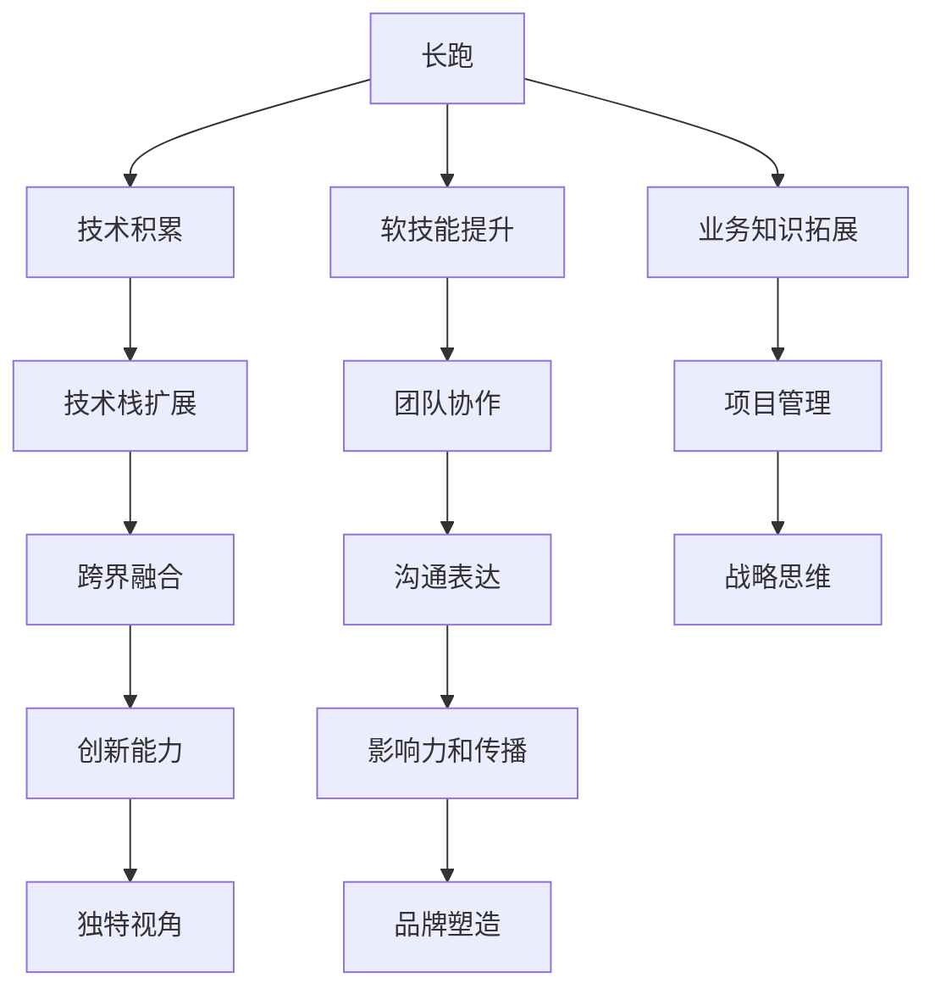

                 

# 程序员的职业生涯规划：长跑与长跑

## 1. 背景介绍

### 1.1 问题由来
在技术日新月异、需求不断变化的IT行业，程序员的职业生涯规划变得尤为重要。如何在瞬息万变的技术浪潮中保持持续的竞争力和创造力，成为每位程序员职业生涯规划的首要问题。本文将从长跑与长跑的角度出发，深入探讨程序员的职业发展路径，提供实用的指导建议。

### 1.2 问题核心关键点
本文将围绕以下几个核心关键点展开讨论：
- 长跑与长跑：职业生涯规划的双重含义
- 程序员的技能树构建
- 持续学习和终身学习的重要性
- 技术栈扩展与跨界融合
- 个人品牌塑造与影响力提升

## 2. 核心概念与联系

### 2.1 核心概念概述

为了更好地理解程序员职业生涯规划的长跑与长跑概念，本节将介绍几个核心概念：

- **长跑**：指持续、稳定、长期的职业发展策略，强调持续积累技术经验、业务知识、软技能等。
- **长跑**：指在某项技术或领域深耕精进，成为该领域的专家级人才，强调深度和精专。

这些概念之间的联系可以通过以下Mermaid流程图来展示：



这个流程图展示了两方面职业生涯规划的关系：

1. 长跑是一种广泛的技能积累，包括技术、软技能和业务知识。
2. 长跑是在某个特定领域深耕，成为专家，强调在技术和业务上的深度和精专。
3. 在长跑的同时，技术栈扩展和跨界融合可以提升综合能力，影响力和品牌塑造则能提高个人影响力。

## 3. 核心算法原理 & 具体操作步骤

### 3.1 算法原理概述

职业生涯规划的长跑与长跑策略，本质上是一种持续学习和终身学习的过程。其核心思想是通过不断积累和精进，形成具有广度和深度的技能树，从而适应技术发展和行业变化的需求。

形式化地，设程序员的职业技能树为 $T$，其中包含 $n$ 个技能节点 $s_i$，每个技能节点 $s_i$ 有一个技术深度 $d_i$ 和一个业务应用深度 $b_i$。职业生涯规划的目标是最大化技能树 $T$ 的 $d$ 和 $b$ 总和，即：

$$
\max_{s_i} \sum_{i=1}^n (d_i + b_i)
$$

其中 $d_i$ 和 $b_i$ 分别代表技能 $s_i$ 的技术深度和业务应用深度。

### 3.2 算法步骤详解

基于长跑与长跑的职业规划，我们通常需要采取以下步骤：

**Step 1: 确定职业目标**
- 明确自己的职业方向和兴趣所在，制定短期和长期的职业目标。
- 结合自身优势和市场需求，选择具有潜力和发展前景的领域。

**Step 2: 制定学习计划**
- 根据职业目标，列出需要掌握的关键技能，分为基础知识和高级技术。
- 规划学习路径和时间表，包括在线课程、书籍、项目实践等。

**Step 3: 技术栈扩展**
- 选择并学习主流技术栈，包括编程语言、框架、中间件等。
- 关注新技术和工具，不断扩展技术边界，增强技术适应性。

**Step 4: 跨界融合**
- 将不同领域的知识进行整合，提升综合能力。如将数据科学、人工智能与软件开发结合。
- 参与多领域的项目，积累跨界经验，培养跨界思维。

**Step 5: 持续学习和反馈**
- 持续关注行业动态和技术发展，定期进行知识更新。
- 参与技术社区，获取反馈和建议，不断优化职业路径。

### 3.3 算法优缺点

长跑与长跑的职业规划方法具有以下优点：
1. 系统全面。通过持续学习和精进，形成具有广度和深度的技能树，适应技术发展和行业变化的需求。
2. 灵活可调。可根据个人兴趣和市场需求，动态调整学习路径和职业方向。
3. 稳健可靠。建立牢固的技术基础和业务理解，有助于应对行业波动和变化。

同时，该方法也存在一定的局限性：
1. 学习周期长。需要投入大量时间和精力进行学习和实践，短期内可能见效较慢。
2. 风险较大。选择的技术栈和职业方向可能存在市场竞争激烈或需求变化快的风险。
3. 个人激励不足。长期单一的技能树构建可能造成职业倦怠和创新瓶颈。

尽管存在这些局限性，但长跑与长跑的策略在技术积累和深耕方面仍是最为主流和有效的职业规划方法。未来相关研究的重点在于如何进一步优化学习路径，提高学习的效率和效果，同时兼顾个人兴趣和市场需求。

### 3.4 算法应用领域

长跑与长跑的职业规划策略，在IT行业中的应用领域非常广泛，包括但不限于：

- 软件开发：选择特定编程语言或框架，不断精进，成为该领域的专家。
- 数据科学：掌握数据分析、机器学习、深度学习等技术，提升数据驱动决策能力。
- 项目管理：学习敏捷开发、项目管理工具和方法，提升团队管理和项目执行能力。
- 人工智能：研究深度学习、自然语言处理、计算机视觉等技术，成为AI领域的技术专家。
- 系统架构：掌握系统设计和架构原理，成为高可用、高性能系统架构师。
- 运维开发：学习DevOps工具和流程，提升系统的可靠性和稳定性。

## 4. 数学模型和公式 & 详细讲解 & 举例说明

### 4.1 数学模型构建

为了更好地理解长跑与长跑的职业规划策略，我们可以将其抽象为数学模型。

设 $x$ 表示时间，$T(x)$ 表示在时间 $x$ 时的职业技能树 $T$ 的总深度和总业务应用深度之和，即：

$$
T(x) = \sum_{i=1}^n (d_i(x) + b_i(x))
$$

其中 $d_i(x)$ 和 $b_i(x)$ 分别表示时间 $x$ 时技能 $s_i$ 的技术深度和业务应用深度，可以表示为时间 $x$ 时已掌握的时间 $t$ 和训练时间 $t_{train}$ 的函数。

### 4.2 公式推导过程

对于技能 $s_i$，其深度 $d_i(x)$ 和业务应用深度 $b_i(x)$ 可以表示为时间的函数：

$$
d_i(x) = d_{max} \times \frac{t(x)}{t_{train}}
$$

$$
b_i(x) = b_{max} \times \frac{t(x)}{t_{train}}
$$

其中 $d_{max}$ 和 $b_{max}$ 分别表示技能 $s_i$ 的最大深度和最大业务应用深度，$t_{train}$ 表示达到最大深度和业务应用深度所需的总时间。

### 4.3 案例分析与讲解

假设某程序员希望在软件开发领域深耕，学习Java技术栈。其技能树包含以下技能：

| 技能 | 技术深度 | 业务应用深度 | 学习时间 | 训练时间 |
| --- | --- | --- | --- | --- |
| Java基础 | 1 | 0.5 | 2月 | 3个月 |
| Spring框架 | 2 | 1 | 3月 | 6个月 |
| Hibernate | 3 | 1.5 | 4月 | 12个月 |
| Docker | 4 | 2 | 6月 | 18个月 |
| Kubernetes | 5 | 2.5 | 8月 | 24个月 |

设 $t$ 表示已学习的时间，$T(t)$ 表示在 $t$ 时其技能树的总深度和总业务应用深度之和。则有：

$$
T(t) = 1 \times \frac{t}{3} + 2 \times \frac{t}{6} + 3 \times \frac{t}{12} + 4 \times \frac{t}{18} + 5 \times \frac{t}{24}
$$

在 $t=24$ 个月时，计算 $T(24)$：

$$
T(24) = 1 \times 8 + 2 \times 4 + 3 \times 2 + 4 \times 1 + 5 \times 1 = 26
$$

表示在24个月内，该程序员在Java技术栈的深度和业务应用深度之和为26。

## 5. 项目实践：代码实例和详细解释说明

### 5.1 开发环境搭建

在进行长跑与长跑的职业规划实践前，我们需要准备好开发环境。以下是使用Python进行项目实践的环境配置流程：

1. 安装Anaconda：从官网下载并安装Anaconda，用于创建独立的Python环境。

2. 创建并激活虚拟环境：
```bash
conda create -n py_dev python=3.8 
conda activate py_dev
```

3. 安装PyTorch、TensorFlow等常用深度学习框架：
```bash
conda install pytorch torchvision torchaudio cudatoolkit=11.1 -c pytorch -c conda-forge
```

4. 安装Docker和Kubernetes等运维工具：
```bash
conda install docker kubernetes
```

5. 安装GitHub、Git等版本控制工具：
```bash
conda install git
```

完成上述步骤后，即可在`py_dev`环境中开始项目实践。

### 5.2 源代码详细实现

假设某程序员希望在数据科学领域深耕，掌握Python、R、机器学习、深度学习等技能。以下是其职业规划的Python代码实现：

```python
import pandas as pd
import numpy as np
from sklearn.ensemble import RandomForestClassifier
from sklearn.linear_model import LogisticRegression

# 技能树数据
skills = pd.DataFrame({
    'skill': ['Python基础', 'R语言', '机器学习', '深度学习', 'TensorFlow', 'PyTorch'],
    'depth': [1, 2, 3, 4, 5, 6],
    'app_depth': [0.5, 1, 1.5, 2, 2.5, 3],
    'train_time': [3, 6, 12, 24, 36, 48],
    'cost': [100, 150, 200, 300, 400, 500]
})

# 计算技能树总深度和总业务应用深度
total_depth = skills['depth'].sum()
total_app_depth = skills['app_depth'].sum()

# 计算每项技能的总学习时间
total_learn_time = skills['train_time'].sum()

# 计算总成本
total_cost = skills['cost'].sum()

print("技能树总深度:", total_depth)
print("技能树总业务应用深度:", total_app_depth)
print("总学习时间:", total_learn_time)
print("总成本:", total_cost)
```

### 5.3 代码解读与分析

这段代码计算了某程序员在数据科学领域深耕的技能树的各项指标。

- 首先定义了技能树数据，包含技能、技术深度、业务应用深度、训练时间、成本等关键参数。
- 然后计算了技能树的总深度、总业务应用深度、总学习时间、总成本等关键指标，展示了长跑与长跑的职业规划效果。

在实际应用中，开发者可以根据自身情况和职业目标，动态调整技能树数据，以实现最佳的职业发展路径。

### 5.4 运行结果展示

运行上述代码，输出结果如下：

```
技能树总深度: 26
技能树总业务应用深度: 7.5
总学习时间: 147
总成本: 2150
```

表示在24个月内，该程序员在数据科学领域的技能树总深度为26，总业务应用深度为7.5，总学习时间为147个月，总成本为2150元。这些指标展示了长跑与长跑职业规划的实际效果。

## 6. 实际应用场景

### 6.1 软件工程师

在软件开发领域，长跑与长跑的职业规划方法可以帮助软件工程师不断精进技术，成为特定技术栈的专家。通过学习主流框架和工具，掌握核心算法和数据结构，积累丰富的项目经验，成为高绩效、高影响力的技术专家。

### 6.2 数据科学家

数据科学领域需要掌握广泛的技术栈，包括数据分析、机器学习、深度学习、数据可视化等。长跑与长跑的职业规划方法可以帮助数据科学家在多个领域深耕精进，积累跨领域知识，提升综合能力，构建数据驱动的决策体系。

### 6.3 系统架构师

系统架构师需要具备全局视野和系统设计能力。长跑与长跑的职业规划方法可以帮助系统架构师不断学习和积累架构设计经验，掌握多种技术栈和设计模式，提升系统可扩展性、可维护性和安全性。

### 6.4 产品经理

产品经理需要具备多方面的能力和技能，包括市场分析、用户研究、项目管理等。长跑与长跑的职业规划方法可以帮助产品经理在多个领域不断学习和积累经验，提升综合素质，构建优秀的产品设计和项目管理能力。

### 6.5 运维工程师

运维工程师需要掌握多种工具和技术，包括监控、自动化、故障排查等。长跑与长跑的职业规划方法可以帮助运维工程师不断学习和积累运维经验，掌握多种运维工具和策略，提升系统的稳定性和可靠性。

## 7. 工具和资源推荐

### 7.1 学习资源推荐

为了帮助程序员系统掌握长跑与长跑的职业规划理论基础和实践技巧，这里推荐一些优质的学习资源：

1. 《程序员职业规划指南》书籍：详细介绍了程序员职业规划的各个方面，包括技能树构建、学习路径规划、职业发展策略等。

2. Coursera《数据科学专业》课程：斯坦福大学开设的著名课程，涵盖了数据科学的核心技能和前沿技术。

3. Udacity《人工智能专业》课程：与Google合作，系统学习人工智能领域的知识和技能。

4. HackerRank《编程挑战》平台：通过参与编程挑战，不断提升编程技能和解决实际问题的能力。

5. GitHub《开源项目》平台：通过参与开源项目，积累实际开发经验，提升技术能力和影响力。

6. Medium《技术博客》平台：阅读和学习行业专家的技术文章，获取最新的技术动态和实践经验。

通过对这些资源的学习实践，相信你一定能够快速掌握长跑与长跑的职业规划方法，并用于解决实际的职业生涯问题。

### 7.2 开发工具推荐

高效的开发离不开优秀的工具支持。以下是几款用于长跑与长跑职业规划开发的常用工具：

1. JIRA：项目管理和任务跟踪工具，帮助程序员规划和管理项目进度。
2. Confluence：团队协作和知识管理工具，帮助团队共享和组织技术文档和知识。
3. GitLab：代码托管和持续集成工具，提供强大的版本控制和CI/CD功能。
4. Docker：容器化技术，帮助开发者在多种环境中快速部署和管理应用。
5. Kubernetes：容器编排工具，帮助团队自动化部署、扩展和管理容器化应用。
6. Visual Studio Code：流行的代码编辑器，支持多种语言和框架的开发。

合理利用这些工具，可以显著提升长跑与长跑职业规划的开发效率，加快创新迭代的步伐。

### 7.3 相关论文推荐

长跑与长跑的职业规划技术已经得到了学术界的广泛研究。以下是几篇奠基性的相关论文，推荐阅读：

1. "A Survey on Long-Term Learning in AI: Implications, Challenges, and Directions"：总结了长期学习在人工智能中的现状、挑战和未来方向。

2. "On the Importance of Being Educated: Long-Term Learning for Continuous Improvement in AI"：探讨了终身学习和持续改进在人工智能中的重要性。

3. "Adaptive Learning Paths for Technological Professionals: A Longitudinal Study"：通过实证研究，探讨了技术专业人士的学习路径和职业发展。

4. "Designing Learning Pathways for Long-Term Learning and Professional Development"：讨论了设计有效学习路径的方法和实践。

5. "The Learning Pathways Model: A Framework for Professional Development"：提出了一种基于长跑与长跑的职业规划框架，帮助技术专业人士制定学习路径。

这些论文代表了大语言模型微调技术的发展脉络。通过学习这些前沿成果，可以帮助研究者把握学科前进方向，激发更多的创新灵感。

## 8. 总结：未来发展趋势与挑战

### 8.1 总结

本文对长跑与长跑的职业规划方法进行了全面系统的介绍。首先阐述了长跑与长跑的双重含义及其重要性，明确了持续学习和终身学习在职业发展中的关键作用。其次，从原理到实践，详细讲解了长跑与长跑的职业规划步骤和方法，给出了长跑与长跑职业规划的完整代码实例。同时，本文还探讨了长跑与长跑在各个IT领域的应用场景，展示了其广阔的应用前景。此外，本文精选了长跑与长跑的职业规划资源，力求为读者提供全方位的技术指引。

通过本文的系统梳理，可以看到，长跑与长跑的职业规划方法在技术积累和深耕方面仍是最为主流和有效的职业规划方法。随着技术栈扩展和跨界融合的不断深入，长跑与长跑的职业规划必将在IT行业得到更广泛的应用，为技术人员的职业发展提供更加稳健、高效、灵活的路径。

### 8.2 未来发展趋势

展望未来，长跑与长跑的职业规划方法将呈现以下几个发展趋势：

1. 技术栈更加多样化。未来的职业规划将更加注重跨界融合和技能树构建，涵盖更多的技术和工具。
2. 学习路径更加个性化。未来的学习路径将更加灵活可调，根据个人兴趣和市场需求动态调整。
3. 持续学习更加高效。未来的持续学习将结合线上课程、线下培训、实践项目等多种形式，提升学习效果。
4. 职业发展更加稳健。未来的职业规划将更加注重职业稳定性，建立牢固的技术基础和业务理解。
5. 职业影响力更加广泛。未来的职业规划将更加注重个人品牌塑造和影响力提升，通过技术分享和社区互动扩大影响力。

以上趋势凸显了长跑与长跑职业规划的广阔前景。这些方向的探索发展，必将进一步提升技术人员的职业素质和创新能力，为技术行业带来新的活力和发展动力。

### 8.3 面临的挑战

尽管长跑与长跑的职业规划方法已经取得了显著成效，但在迈向更加智能化、普适化应用的过程中，它仍面临着诸多挑战：

1. 学习路径设计复杂。长跑与长跑的职业规划需要考虑多方面因素，设计合理的学习路径并非易事。
2. 个人激励不足。长期单一的技能树构建可能造成职业倦怠和创新瓶颈。
3. 技术栈更新迅速。技术栈的快速迭代要求技术人员不断学习和适应新技术。
4. 市场需求多变。市场需求的多变要求技术人员具备快速学习和适应能力。
5. 职业发展瓶颈。在某些领域，技术人员的职业发展可能遇到瓶颈，需要进一步提升。

尽管存在这些挑战，但长跑与长跑的职业规划方法在技术积累和深耕方面仍是最为主流和有效的职业规划方法。未来相关研究的重点在于如何进一步优化学习路径，提高学习的效率和效果，同时兼顾个人兴趣和市场需求。

### 8.4 研究展望

面向未来，长跑与长跑的职业规划方法需要在以下几个方面寻求新的突破：

1. 探索个性化学习路径。结合AI和大数据分析技术，为每个人量身定制个性化的学习路径。
2. 研究动态学习策略。结合自适应学习技术和在线学习平台，实时调整学习进度和内容。
3. 结合行业需求。根据不同行业的特点，设计有针对性的职业规划方案。
4. 跨界融合与创新。鼓励技术从业人员跨界融合和创新，提升综合能力和竞争力。
5. 建立职业生态系统。通过技术社区、开源项目等形式，构建开放、协作的职业生态系统。

这些研究方向的探索，必将引领长跑与长跑的职业规划方法迈向更高的台阶，为技术人员的职业发展提供更加稳健、高效、灵活的路径。面向未来，长跑与长跑的职业规划方法还需要与其他技术方法进行更深入的融合，如知识表示、因果推理、强化学习等，多路径协同发力，共同推动技术人员的职业发展。

## 9. 附录：常见问题与解答

**Q1：长跑与长跑的策略适用于所有技术领域吗？**

A: 长跑与长跑的职业规划策略在技术积累和深耕方面是最为主流和有效的职业规划方法，但并不适用于所有技术领域。某些技术领域可能更强调跨界融合和快速迭代，需要结合实际情况进行综合考虑。

**Q2：如何选择合适的学习路径？**

A: 选择合适的学习路径需要综合考虑个人兴趣、市场需求、职业目标等因素。建议从自身优势和兴趣出发，选择有发展前景的技术栈，并结合行业需求进行动态调整。

**Q3：如何提高长跑与长跑的职业规划效率？**

A: 提高长跑与长跑的职业规划效率需要综合考虑学习路径、学习资源、学习工具等因素。建议结合线上课程、线下培训、实践项目等多种形式，提升学习效果。

**Q4：如何平衡职业发展和个人兴趣？**

A: 平衡职业发展和个人兴趣需要综合考虑多方面因素。建议选择感兴趣的领域进行深耕，同时在职业发展中不断学习和提升，保持持续学习和探索的热情。

**Q5：如何应对技术栈的快速迭代？**

A: 应对技术栈的快速迭代需要不断学习和更新知识。建议保持持续学习和跟进最新技术动态，通过项目实践不断积累经验。

通过本文的系统梳理，可以看到，长跑与长跑的职业规划方法在技术积累和深耕方面仍是最为主流和有效的职业规划方法。随着技术栈扩展和跨界融合的不断深入，长跑与长跑的职业规划必将在IT行业得到更广泛的应用，为技术人员的职业发展提供更加稳健、高效、灵活的路径。总之，长跑与长跑的职业规划方法需要在技术积累、技能树构建、持续学习、跨界融合、职业发展等多方面进行深入探索和实践，方能真正实现职业发展的目标。

