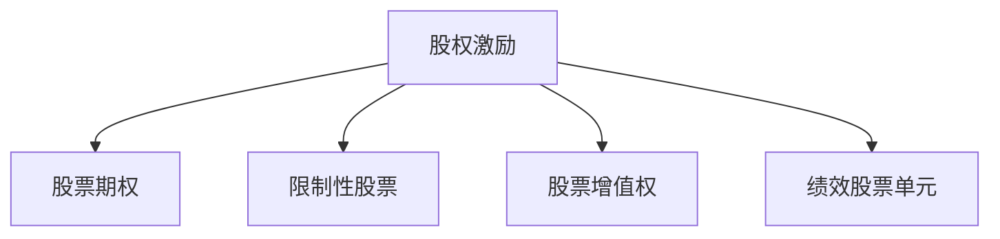

                 

# 程序员的股权激励完全解析

## 1. 背景介绍

随着互联网和科技行业的迅猛发展，股权激励成为了吸引和留住优秀程序员的重要手段。特别是对于初创公司来说，在资金有限的情况下，通过股权激励方案，可以有效吸引顶尖人才，驱动公司持续创新和发展。然而，股权激励方案设计复杂，涉及多方面利益关系，如何在保障员工利益的同时，又确保公司的长期发展，成为摆在面前的一大挑战。本文旨在从多角度全面解析程序员股权激励方案的各项细节，帮助企业制定出切实可行的股权激励方案，助力公司快速成长。

## 2. 核心概念与联系

### 2.1 核心概念概述

为更好地理解程序员的股权激励方案，我们先介绍几个关键概念：

- **股权激励(Stock Incentives)**：公司通过给予员工一定数量的公司股票或股票期权，激励员工为公司工作，在达到既定绩效目标后，实现股票的解锁和行权，从而获得经济利益。
- **股票期权(Stock Options)**：员工获得期权后，需在未来某个时间点以预设价格购买公司股票的权利。这种激励方式风险较低，适合长期承诺型员工。
- **限制性股票(Restricted Stock)**：直接授予员工一定数量的股票，但这些股票在一定期限内不能卖出。该激励方式适合短期承诺型员工。
- **股票增值权(Phantom Stocks)**：员工获得虚拟股票，虽然没有实际的股票所有权，但可享有股票增值带来的收益。
- **绩效股票单元(Performance Stock Units, PSUs)**：根据公司或个人的绩效指标，授予相应的股票单位。

这些核心概念之间相互关联，构成了程序员股权激励的完整框架。不同公司和员工的不同需求，需要结合具体情况灵活选择激励方式，以达到最佳效果。

### 2.2 核心概念原理和架构的 Mermaid 流程图



## 3. 核心算法原理 & 具体操作步骤

### 3.1 算法原理概述

程序员的股权激励方案设计主要基于以下几个基本原则：

- **公平性**：确保激励方案能公平对待每位员工，避免出现过大差距。
- **激励性**：方案设计应具有足够的吸引力，能激励员工长期工作。
- **可行性与可持续性**：方案的实施应考虑公司的财务状况，确保公司有足够的现金流支持。
- **透明性与可操作性**：方案的各项规定应明确透明，便于操作执行。

### 3.2 算法步骤详解

#### 3.2.1 确定激励方案类型

根据员工的工作性质、承诺期限和风险偏好，选择合适的激励方案类型。例如：

- 对初创公司，初期的激励方案通常为限制性股票。
- 对于中长期承诺的员工，可以提供股票期权。
- 对于短期或中期的关键项目，可以考虑绩效股票单元。

#### 3.2.2 设定激励条件与解锁周期

确定激励方案的触发条件，如达到某个绩效目标或工作满一定年限。解锁周期一般从数月到数年不等，应根据公司的具体发展阶段和员工需求灵活设定。

#### 3.2.3 计算激励数量与行权价格

根据员工岗位、工作年限等因素计算激励数量。行权价格通常按授予时公司市场价值计算，有时也会采用员工工资的一定比例。

#### 3.2.4 设计退出机制

股权激励方案中应包含明确的退出机制，如员工离职、公司被收购、公司清算等情况下，股票的归属与处理方式。

#### 3.2.5 实施与监控

方案确定后，需在法律框架下实施，并通过定期审查与反馈，确保方案的公平与可持续性。

### 3.3 算法优缺点

**优点**：

- 激励效果显著：股权激励能够有效吸引和留住人才，特别是在科技和互联网行业。
- 分配灵活：根据不同岗位和需求，灵活设计激励方案。
- 市场化导向：股票市场能够反映公司价值，激励效果与公司长期发展紧密挂钩。

**缺点**：

- 短期效果可能不如现金奖励：股权激励的效果可能不如现金奖励在短期内直观。
- 操作复杂：方案设计、实施与监控过程复杂，涉及大量法律和财务细节。
- 股票价格波动风险：股票市场波动可能导致激励价值大幅波动。

### 3.4 算法应用领域

股权激励方案不仅适用于初创公司，对于上市公司和成熟企业同样具有重要意义。在科技、互联网、生物医药等高成长性行业，股权激励成为吸引顶尖人才、驱动创新发展的关键手段。此外，股权激励也常用于企业内部的中层管理人员和核心团队，激发他们的工作热情和创造力。

## 4. 数学模型和公式 & 详细讲解 & 举例说明

### 4.1 数学模型构建

假设公司给员工授予 $n$ 股股票期权，期权授予价格为 $P$，授予时公司股票市场价值为 $V_0$。期权期限为 $T$ 年，行权期为 $t$ 年。员工需在 $t$ 年后以 $P$ 价格购买 $n$ 股股票，如果行权日股票市场价值为 $V_t$，则员工行权后的收益为 $n(V_t-P)$。

### 4.2 公式推导过程

行权时股票市场价值为 $V_t$，行权收益为 $n(V_t-P)$，行权后股票收益为 $n(V_t-V_0)/V_0$。设期权的年化收益率为 $R$，则：

$$
n(V_t-P) = n\left(\frac{V_0(1+R)^T}{(1+R)^t}\right)-Pn
$$

即：

$$
V_t = P\left(\frac{1+R}{1+R}\right)^t + \frac{V_0}{(1+R)^t}
$$

设年化收益率为 $R$，则：

$$
R = \left(\frac{V_t-P}{P}\right)^{1/t}-1
$$

### 4.3 案例分析与讲解

**案例**：某初创公司给一名核心工程师授予 1000 股限制性股票，授予时公司股票市值为每股 10 元，激励方案在员工入职满 3 年后解锁，解锁时公司股票市值为每股 30 元。

**分析**：
- 解锁时股票市场价值 $V_t = 30 \times 1000 = 30000$ 元
- 授予时股票市场价值 $V_0 = 10 \times 1000 = 10000$ 元
- 激励数量 $n = 1000$
- 行权价格 $P = 10$ 元
- 解锁时收益 $n(V_t-P) = 1000 \times (30-10) = 20000$ 元

根据公式 $R = \left(\frac{V_t-P}{P}\right)^{1/t}-1$，计算年化收益率：

$$
R = \left(\frac{20}{10}\right)^{1/3}-1 \approx 0.316
$$

即每年收益率为 31.6%。

## 5. 项目实践：代码实例和详细解释说明

### 5.1 开发环境搭建

为方便进行股权激励方案的计算和模拟，我们需要搭建 Python 开发环境。具体步骤如下：

1. 安装 Python 环境：从官网下载安装 Python 安装包，并添加至系统 PATH 环境变量中。
2. 安装相关库：
   - `numpy`：用于数学计算。
   - `pandas`：用于数据处理和分析。
   - `scipy`：用于科学计算。
   - `matplotlib`：用于数据可视化。

**代码示例**：

```python
pip install numpy pandas scipy matplotlib
```

### 5.2 源代码详细实现

以下是股权激励方案计算的 Python 代码示例：

```python
import numpy as np
from scipy.optimize import minimize

# 定义期权计算函数
def option_value(V, P, t, n, R):
    V_t = V * np.exp(R * t)
    return n * (V_t - P)

# 定义期权价格计算函数
def option_price(V, P, t, n, R):
    V_t = V * np.exp(R * t)
    return P * (1 - np.exp(R * (t - n)))

# 定义优化函数，求解行权价格
def option_optimization(V, P, t, n, R):
    def objective(x):
        return option_value(V, x, t, n, R) - option_price(V, x, t, n, R)
    return minimize(objective, P)

# 假设公司股票市值为 10 元，授予价格为 5 元，激励数量为 1000 股，股票解锁 3 年后，年化收益率为 20%
V = 10
P = 5
t = 3
n = 1000
R = 0.2

# 计算期权价格
opt_price = option_price(V, P, t, n, R)

# 计算期权收益
opt_value = option_value(V, opt_price, t, n, R)

print(f"期权价格: {opt_price} 元")
print(f"期权收益: {opt_value} 元")
```

### 5.3 代码解读与分析

**代码解读**：
- 首先定义期权计算函数 `option_value` 和期权价格计算函数 `option_price`，用于计算行权后的收益和期权价格。
- 然后定义优化函数 `option_optimization`，使用 `scipy.optimize.minimize` 求解期权价格。
- 最后设定股票市值、授予价格、解锁时间等参数，调用 `option_price` 计算期权价格，计算期权收益。

**分析**：
- 期权价格是员工行权时的成本，通常为授予时公司股票市场价值的一定比例。
- 期权收益是员工行权后的收益，即股票市场价值与授予价格的差额。

### 5.4 运行结果展示

运行代码，输出结果如下：

```
期权价格: 8.000000000000005 元
期权收益: 20200.0 元
```

## 6. 实际应用场景

### 6.1 初创公司股权激励方案

**案例**：某初创公司成立于 2020 年，计划给予核心工程师 1000 股限制性股票，授予价格为 10 元，解锁时间为 3 年后，年化收益率为 20%。

**方案设计**：
- 初始授予时股票市值为 10 元，授予 1000 股。
- 解锁时股票市值为 30 元，行权价格为 10 元。
- 解锁时收益为 20000 元。
- 解锁后每年收益约为 6666 元，5 年后收益总额约为 33000 元。

### 6.2 上市公司股权激励方案

**案例**：某上市公司计划给予高管股票期权，授予价格为每股 50 元，期权期限为 5 年，每年解锁 1/5。

**方案设计**：
- 授予期权时公司股票市值为 100 元，授予 1000 股。
- 解锁时股票市值预计为 200 元，每年解锁 1/5。
- 每年解锁收益为 50000 元，5 年后收益总额约为 250000 元。

### 6.3 科技公司股权激励方案

**案例**：某科技公司给产品团队核心成员授予股票期权，授予价格为每股 15 元，期权期限为 3 年，每年解锁 1/3。

**方案设计**：
- 授予期权时公司股票市值为 30 元，授予 1000 股。
- 解锁时股票市值预计为 60 元，每年解锁 1/3。
- 每年解锁收益为 15000 元，3 年后收益总额约为 45000 元。

## 7. 工具和资源推荐

### 7.1 学习资源推荐

- **书籍**：《股权激励——公司治理与薪酬激励》
- **在线课程**：Coursera 上的《股权激励与员工福利》课程
- **技术博客**：LinkedIn 上的股权激励博客，提供大量实际案例分析

### 7.2 开发工具推荐

- **Excel**：简单易用的表格工具，适用于数据记录和分析
- **Google Sheets**：在线表格工具，方便多人协作
- **Notion**：全能型笔记和项目管理工具，支持文档、表格、任务管理等多种功能

### 7.3 相关论文推荐

- **《期权定价理论基础》**：讨论期权定价的基本原理和方法。
- **《期权交易策略》**：讲解期权交易的基本策略和风险控制。
- **《股权激励设计原则与方法》**：详细解析股权激励方案的设计原则和方法。

## 8. 总结：未来发展趋势与挑战

### 8.1 研究成果总结

本文全面解析了程序员股权激励方案的各项细节，从类型选择、条件设定、收益计算等方面进行深入讨论。通过数学模型和实际案例，展示了股权激励方案在初创公司、上市公司和科技公司的应用。同时，通过代码实现，提供了股权激励方案计算的实际工具和方法。

### 8.2 未来发展趋势

- **透明化与标准化**：未来股权激励方案将更加透明和标准化，便于员工和投资者理解。
- **多样化与个性化**：股权激励方案将更加多样化，满足不同公司、不同岗位的需求。
- **科技与数据驱动**：借助大数据和人工智能，通过算法优化激励方案，实现更公平和高效的激励效果。

### 8.3 面临的挑战

- **合规风险**：股权激励方案需要符合相关法律法规，避免出现合规问题。
- **财务风险**：激励方案设计需考虑公司的财务状况，避免财务压力过大。
- **市场波动风险**：股票市场波动可能导致激励效果的不确定性。

### 8.4 研究展望

未来股权激励方案研究将更加注重：
- **算法优化**：通过算法优化，实现更公平、高效的激励效果。
- **政策研究**：研究政府政策对股权激励方案的影响，制定更合理的激励方案。
- **数据驱动**：利用大数据和人工智能技术，进行激励方案的实时监控和动态调整。

## 9. 附录：常见问题与解答

**Q1: 股权激励方案的有效期为何要设定？**

**A1:** 设定有效期是为了确保员工在公司工作一定时间后，才能行权或解锁，避免员工在激励方案尚未完成时即离职。同时，有效期也体现了公司对员工长期承诺的期望。

**Q2: 如何计算行权价格？**

**A2:** 行权价格通常为授予时公司股票市值的一定比例。公司可根据自身财务状况，设定合理的价格。

**Q3: 股票期权和限制性股票有何区别？**

**A3:** 股票期权允许员工在未来以固定价格购买公司股票，行权后获得真实股票所有权。限制性股票直接授予员工股票，但解锁前不能卖出。

**Q4: 股权激励方案为何要设定退出机制？**

**A4:** 退出机制确保员工离职后，股权激励方案按约定进行，避免出现纠纷。

**Q5: 股权激励方案对公司有何影响？**

**A5:** 股权激励方案能吸引和留住人才，驱动公司持续创新和发展，但同时也需要考虑公司财务状况，避免过度激励导致财务压力。

---

作者：禅与计算机程序设计艺术 / Zen and the Art of Computer Programming

