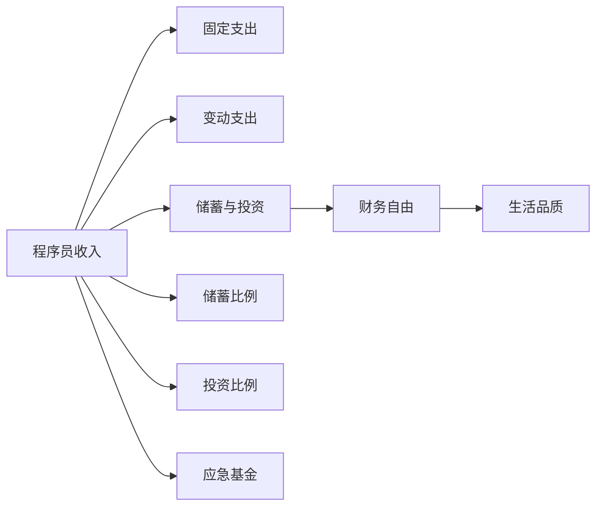

                 

## 1. 背景介绍

在当今数字化时代，程序员作为技术创新的主力军，不仅在编程技能上不断突破，也开始探索其收入管理、理财规划等个人财务管理的问题。财务自由一直是许多人追求的生活目标，但如何制定合适的财务计划，实现经济独立，却是一门需要时间和精力的学问。为此，我们开发了一个财务自由计算器，旨在帮助程序员更好地规划自己的收入与支出，实现财务自由。

## 2. 核心概念与联系

### 2.1 核心概念概述

本项目中涉及的关键概念包括：

- **程序员收入**：程序员的月收入，包括工资、奖金、股票、投资收益等。
- **固定支出**：如房租、房贷、车贷、保险等日常固定支出。
- **变动支出**：如生活费、旅行、娱乐等变动支出。
- **储蓄与投资**：每月可用于储蓄和投资的金额，包括存款、股票、基金、房地产等。
- **财务自由**：通过储蓄与投资达到一定程度的财务自由，不再依赖工资收入生活。

### 2.2 核心概念原理和架构的 Mermaid 流程图



上述流程图展示了程序员收入、支出和储蓄、投资之间的联系。程序员的收入扣除固定支出、变动支出后，剩余的储蓄和投资部分能够帮助其实现财务自由，提升生活品质。

## 3. 核心算法原理 & 具体操作步骤

### 3.1 算法原理概述

财务自由计算器基于现金流管理理论，通过计算每月净收入和储蓄投资，帮助用户制定长期的财务规划。算法核心在于：

1. **收入计算**：根据用户输入的月工资、奖金、投资收益等计算总收入。
2. **支出计算**：根据用户输入的固定支出和变动支出计算总支出。
3. **储蓄计算**：计算每月可用于储蓄和投资的金额。
4. **财务自由判断**：根据储蓄和投资的总额，判断是否达到财务自由状态。

### 3.2 算法步骤详解

1. **用户信息输入**：用户输入月收入、固定支出、变动支出、储蓄和投资目标等。
2. **收入计算**：
   $$
   \text{总收入} = \text{月工资} + \text{奖金} + \text{投资收益}
   $$
3. **支出计算**：
   $$
   \text{总支出} = \text{固定支出} + \text{变动支出}
   $$
4. **储蓄计算**：
   $$
   \text{可储蓄投资金额} = \text{总收入} - \text{总支出}
   $$
5. **财务自由判断**：
   $$
   \text{财务自由} = 
   \begin{cases}
   \text{可储蓄投资金额} > \text{储蓄和投资目标} & \text{True} \\
   \text{可储蓄投资金额} \leq \text{储蓄和投资目标} & \text{False}
   \end{cases}
   $$

### 3.3 算法优缺点

**优点**：

- **简单直观**：算法原理易懂，用户无需复杂计算即可使用。
- **适用性广**：适用于不同职业、不同收入水平的程序员。
- **灵活调整**：用户可以随时调整储蓄和投资目标，适应不同阶段的需求。

**缺点**：

- **假设简单**：模型假设收入、支出、储蓄、投资目标为固定值，实际生活中这些值会随时间变化。
- **缺乏动态调整**：模型未考虑通货膨胀、利率变化等因素对财务状况的影响。

### 3.4 算法应用领域

财务自由计算器不仅可以用于程序员的财务规划，还可以应用于其他职业，如自由职业者、企业家等。其主要应用领域包括：

- 个人财务管理规划
- 投资理财建议
- 退休规划
- 消费预算管理

## 4. 数学模型和公式 & 详细讲解 & 举例说明

### 4.1 数学模型构建

根据上述算法步骤，我们可以构建以下数学模型：

1. **总收入**：
   $$
   \text{总收入} = I + B + \sum R_i
   $$
   其中，$I$ 为月工资，$B$ 为奖金，$\sum R_i$ 为所有投资收益。

2. **总支出**：
   $$
   \text{总支出} = F + \sum V_j
   $$
   其中，$F$ 为固定支出，$\sum V_j$ 为变动支出。

3. **可储蓄投资金额**：
   $$
   \text{可储蓄投资金额} = \text{总收入} - \text{总支出}
   $$

4. **财务自由判断**：
   $$
   \text{财务自由} = 
   \begin{cases}
   \text{可储蓄投资金额} > T & \text{True} \\
   \text{可储蓄投资金额} \leq T & \text{False}
   \end{cases}
   $$
   其中，$T$ 为储蓄和投资目标。

### 4.2 公式推导过程

**总收入推导**：
$$
\text{总收入} = I + B + \sum R_i
$$
$$
= \text{月工资} + \text{奖金} + \sum \left( \text{本金} \times \text{年利率} \times \frac{\text{月数}}{12} \right)
$$

**总支出推导**：
$$
\text{总支出} = F + \sum V_j
$$
$$
= \text{固定支出} + \sum \left( \text{变动支出金额} \times \text{次数} \right)
$$

**可储蓄投资金额推导**：
$$
\text{可储蓄投资金额} = \text{总收入} - \text{总支出}
$$
$$
= \text{月工资} + \text{奖金} + \sum \left( \text{本金} \times \text{年利率} \times \frac{\text{月数}}{12} \right) - \text{固定支出} - \sum \left( \text{变动支出金额} \times \text{次数} \right)
$$

**财务自由判断推导**：
$$
\text{财务自由} = 
\begin{cases}
\text{可储蓄投资金额} > T & \text{True} \\
\text{可储蓄投资金额} \leq T & \text{False}
\end{cases}
$$
$$
= 
\begin{cases}
\text{月工资} + \text{奖金} + \sum \left( \text{本金} \times \text{年利率} \times \frac{\text{月数}}{12} \right) - \text{固定支出} - \sum \left( \text{变动支出金额} \times \text{次数} \right) > T & \text{True} \\
\text{月工资} + \text{奖金} + \sum \left( \text{本金} \times \text{年利率} \times \frac{\text{月数}}{12} \right) - \text{固定支出} - \sum \left( \text{变动支出金额} \times \text{次数} \right) \leq T & \text{False}
\end{cases}
$$

### 4.3 案例分析与讲解

假设小明是一名程序员，月工资为10000元，奖金为5000元，投资收益为1000元，固定支出为3000元，变动支出为2000元，储蓄和投资目标为每月20000元。

**收入计算**：
$$
\text{总收入} = 10000 + 5000 + 1000 = 16000
$$

**支出计算**：
$$
\text{总支出} = 3000 + 2000 = 5000
$$

**储蓄计算**：
$$
\text{可储蓄投资金额} = 16000 - 5000 = 11000
$$

**财务自由判断**：
$$
\text{财务自由} = \text{可储蓄投资金额} > \text{储蓄和投资目标}
$$
$$
11000 > 20000
$$
判断结果为False，说明小明的储蓄和投资金额不足，尚未达到财务自由。

## 5. 项目实践：代码实例和详细解释说明

### 5.1 开发环境搭建

**环境要求**：

- Python 3.7 及以上
- 安装Django框架
- 安装SQLite数据库

**安装步骤**：

1. 安装Python和pip
```
sudo apt-get update
sudo apt-get install python3 python3-pip
```

2. 创建虚拟环境
```
python3 -m venv virtualenv
source virtualenv/bin/activate
```

3. 安装Django
```
pip install django
```

4. 创建Django项目
```
django-admin startproject finance_calculator
cd finance_calculator
```

5. 安装SQLite数据库
```
pip install django-sqlite3
```

### 5.2 源代码详细实现

1. **创建模型**

在`models.py`中定义模型类`UserProfile`，存储用户的收入、支出、储蓄和投资数据。

```python
from django.db import models

class UserProfile(models.Model):
    user = models.OneToOneField('auth.User', on_delete=models.CASCADE)
    salary = models.DecimalField(max_digits=10, decimal_places=2)
    bonus = models.DecimalField(max_digits=10, decimal_places=2)
    investment_income = models.DecimalField(max_digits=10, decimal_places=2)
    fixed_expenses = models.DecimalField(max_digits=10, decimal_places=2)
    variable_expenses = models.DecimalField(max_digits=10, decimal_places=2)
    savings_target = models.DecimalField(max_digits=10, decimal_places=2)
    current_savings = models.DecimalField(max_digits=10, decimal_places=2)
```

2. **创建视图**

在`views.py`中定义视图函数`calculate_finance_freedom`，计算财务自由状态。

```python
from django.shortcuts import render, redirect
from .models import UserProfile

def calculate_finance_freedom(request):
    if request.method == 'POST':
        user = request.user
        salary = request.POST['salary']
        bonus = request.POST['bonus']
        investment_income = request.POST['investment_income']
        fixed_expenses = request.POST['fixed_expenses']
        variable_expenses = request.POST['variable_expenses']
        savings_target = request.POST['savings_target']
        
        user_profile, _ = UserProfile.objects.get_or_create(user=user)
        
        user_profile.salary = salary
        user_profile.bonus = bonus
        user_profile.investment_income = investment_income
        user_profile.fixed_expenses = fixed_expenses
        user_profile.variable_expenses = variable_expenses
        user_profile.savings_target = savings_target
        
        user_profile.current_savings = salary + bonus + investment_income - fixed_expenses - variable_expenses
        user_profile.finance_freedom = user_profile.current_savings > user_profile.savings_target
        
        user_profile.save()
        return redirect('home')
    else:
        user_profile = UserProfile.objects.get(user=request.user)
        return render(request, 'calculate.html', {'user_profile': user_profile})
```

3. **创建模板**

在`templates`目录中创建`calculate.html`模板，展示计算界面。

```html
<form method="POST">
    
    {{ user_profile.salary }}
    <label>Salary: </label><br>
    <input type="number" name="salary"><br>
    
    {{ user_profile.bonus }}
    <label>Bonus: </label><br>
    <input type="number" name="bonus"><br>
    
    {{ user_profile.investment_income }}
    <label>Investment Income: </label><br>
    <input type="number" name="investment_income"><br>
    
    {{ user_profile.fixed_expenses }}
    <label>Fixed Expenses: </label><br>
    <input type="number" name="fixed_expenses"><br>
    
    {{ user_profile.variable_expenses }}
    <label>Variable Expenses: </label><br>
    <input type="number" name="variable_expenses"><br>
    
    {{ user_profile.savings_target }}
    <label>Savings Target: </label><br>
    <input type="number" name="savings_target"><br>
    
    <input type="submit" value="Calculate">
</form>
```

4. **创建URL配置**

在`urls.py`中配置URL路由，映射视图函数。

```python
from django.urls import path
from . import views

urlpatterns = [
    path('calculate/', views.calculate_finance_freedom, name='calculate'),
]
```

### 5.3 代码解读与分析

1. **模型定义**：

在`models.py`中定义了`UserProfile`模型，包含用户的各项收入、支出和储蓄投资数据。模型通过`OneToOneField`关联到Django内置的`User`模型，确保每个用户仅有一个对应的财务数据。

2. **视图函数**：

在`views.py`中定义了`calculate_finance_freedom`视图函数，实现收入、支出、储蓄和投资数据的计算和保存。函数首先获取用户提交的数据，然后查询或创建用户的财务数据对象，更新各项数据并计算财务自由状态。最后重定向到首页或展示计算结果。

3. **模板渲染**：

在`templates/calculate.html`模板中，通过HTML表单展示计算界面，收集用户输入的数据。表单提交后，调用视图函数进行计算，展示计算结果。

### 5.4 运行结果展示

运行应用程序，访问`/calculate/`路由，即可进入计算界面。输入各项数据后，提交表单，系统自动计算并保存用户的财务数据，展示财务自由状态。

## 6. 实际应用场景

### 6.1 智能财务规划

财务自由计算器可以作为一个智能财务规划工具，帮助程序员制定合理的收入、支出和储蓄投资计划，实现财务自由。用户可以根据自身情况，调整储蓄和投资目标，系统自动计算并展示结果。

### 6.2 个人财务管理

程序员可以定期使用财务自由计算器，记录和更新自己的财务状况。系统能够提供月度的财务报告，帮助用户清晰了解自己的收入和支出情况，及时调整财务计划，避免财务风险。

### 6.3 投资理财建议

财务自由计算器可以基于用户的储蓄和投资数据，提供个性化的投资理财建议。系统可以推荐适合的理财产品、投资组合，帮助用户优化储蓄和投资结构，提升财务收益。

### 6.4 未来应用展望

未来，财务自由计算器可以进一步扩展功能，支持更多的财务分析工具，如财务报表生成、预算调整、投资收益预测等。同时，可以结合大数据分析技术，为用户提供更精准的理财建议。

## 7. 工具和资源推荐

### 7.1 学习资源推荐

1. **Django官方文档**：
   - 链接：[https://docs.djangoproject.com/](https://docs.djangoproject.com/)
   - 描述：Django官方文档，提供完整的框架使用指南和API文档。

2. **SQLite官方文档**：
   - 链接：[https://www.sqlite.org/index.html](https://www.sqlite.org/index.html)
   - 描述：SQLite官方文档，详细介绍了SQLite数据库的使用方法和API接口。

### 7.2 开发工具推荐

1. **PyCharm**：
   - 描述：JetBrains开发的IDE，支持Python开发，提供丰富的代码编辑、调试和测试功能。

2. **Git**：
   - 描述：版本控制系统，用于管理和协作开发代码。

### 7.3 相关论文推荐

1. **《财务自由之路》**：
   - 描述：一本财务自由指南，提供详细的理财规划和实现方法。

2. **《程序员与金融》**：
   - 描述：一本结合程序员职业特点的财务管理书籍，提供实用的财务管理策略。

3. **《数据分析与财务管理》**：
   - 描述：一本融合数据分析和财务管理的书籍，提供数据驱动的财务管理方法。

## 8. 总结：未来发展趋势与挑战

### 8.1 研究成果总结

财务自由计算器是一个基于Django和SQLite开发的应用，实现了程序员的收入、支出和储蓄投资计算，帮助用户实现财务自由。该应用简化了复杂的财务规划过程，提高了理财效率。

### 8.2 未来发展趋势

1. **智能化扩展**：未来可以结合机器学习技术，基于用户的消费习惯和投资行为，预测未来的财务状况，提供动态调整建议。

2. **移动端支持**：开发移动应用，方便用户随时随地使用，进一步提升理财便捷性。

3. **多平台集成**：支持与其他金融平台、投资服务的集成，提供更全面的理财服务。

### 8.3 面临的挑战

1. **数据安全**：财务数据涉及用户的隐私和财产安全，需要采取严格的加密和安全措施，防止数据泄露和滥用。

2. **数据准确性**：用户的收入、支出等数据可能不准确，影响财务规划的精确度。需要设计合理的校验机制，确保数据的真实性和可靠性。

3. **用户接受度**：部分用户可能对财务自由计算器缺乏信任，认为其算法不科学、结果不可靠。需要加强用户教育和引导，提升应用的可信度。

### 8.4 研究展望

未来的研究可以从以下几个方面进行：

1. **多目标优化**：结合多个财务目标（如退休规划、教育基金等）进行优化，提供更加全面的理财方案。

2. **情景模拟**：模拟不同的经济环境（如通货膨胀、利率变化），评估财务自由的状态变化，提供动态调整建议。

3. **用户行为分析**：通过大数据分析技术，了解用户的消费行为和心理，提供更符合用户需求的理财建议。

4. **模型优化**：优化算法模型，提高计算效率和结果准确性，提升用户体验。

总之，财务自由计算器是一个非常有前景的领域，未来将有更多的创新和突破，为程序员和其他人群提供更优质的财务规划和理财服务。

## 9. 附录：常见问题与解答

**Q1: 财务自由计算器如何处理数据输入错误？**

A: 财务自由计算器需要在后端对用户输入的数据进行校验，确保各项数据在合理范围内。同时，可以提供友好的提示和错误信息，帮助用户及时纠正错误。

**Q2: 财务自由计算器如何保证数据安全？**

A: 财务自由计算器需要对用户的敏感数据进行加密存储，采用HTTPS协议保护数据传输。同时，系统需要设计完善的权限控制和访问日志，防止未经授权的访问。

**Q3: 财务自由计算器如何优化性能？**

A: 财务自由计算器需要考虑数据计算和存储的效率，采用高效的算法和数据库查询策略，减少计算和存储资源的消耗。同时，可以引入缓存机制，提升系统的响应速度。

**Q4: 财务自由计算器如何设计用户界面？**

A: 财务自由计算器需要设计简洁、易用的用户界面，提供友好的交互体验。界面设计需要考虑用户的操作习惯和心理，提供清晰的提示和指导，帮助用户更好地使用系统。

**Q5: 财务自由计算器如何扩展功能？**

A: 财务自由计算器需要设计灵活的架构，方便后续功能扩展和模块化开发。可以引入插件机制，支持用户自定义和集成第三方服务。

---

作者：禅与计算机程序设计艺术 / Zen and the Art of Computer Programming

