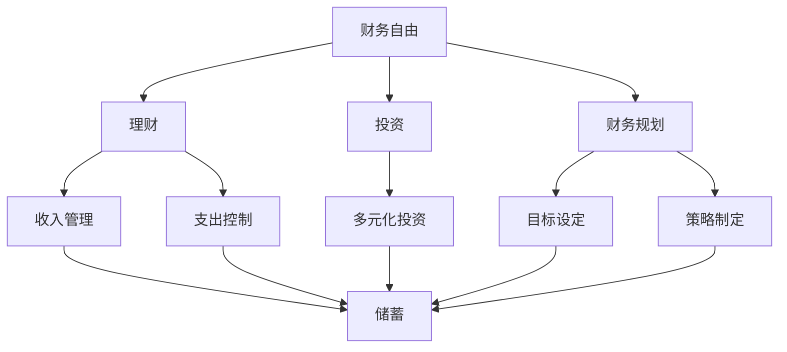

                 

# 程序员的财务自由：从省钱到赚钱的思维转变

> 关键词：财务自由, 程序员, 财务规划, 投资, 理财策略

## 1. 背景介绍

程序员作为科技时代的核心力量，长期以来以其专业技能在各行业内大放异彩。然而，相较于普通职业，程序员面临的工作压力大、职业生涯不确定性高、加班现象普遍等问题。因此，如何在高薪的同时，实现财务自由，成为广大程序员们关注的重点。

程序员的财务自由，不仅意味着通过技术赚取更多的财富，更意味着能够科学地管理个人财务，实现经济上的自主与自由。财务自由不是一种简单的目标，而是一种思维方式的转变，是一种对金钱与时间的深度理解与把控。

## 2. 核心概念与联系

### 2.1 核心概念概述

为更好地理解程序员财务自由，本节将介绍几个密切相关的核心概念：

- **财务自由**：指个人或家庭不再依赖工作收入来满足生活所需，而是依靠投资和被动收入实现经济上的自由。程序员的财务自由则在此基础上，额外强调技术和智慧对财务的提升作用。
- **理财**：指个人或家庭对财务资源的规划与管理，包括收入、支出、储蓄、投资、债务等各方面。理财能力越强，实现财务自由的可能性越大。
- **投资**：指将资金用于购买资产，以期在未来获得收益的经济活动。对于程序员而言，投资不仅仅是追求资本增值，更是实现财务自由的重要手段。
- **财务规划**：指对个人或家庭的财务目标进行设定，并制定相应的财务策略和计划，以实现财务目标。财务规划能帮助程序员系统地提升财务状况，为财务自由打下坚实基础。

这些核心概念之间的逻辑关系可以通过以下Mermaid流程图来展示：



这个流程图展示了这个关系网络：

1. 财务自由是最终目标，理财、投资、财务规划都是实现财务自由的手段。
2. 理财涉及收入管理和支出控制，这是基础。
3. 投资包括多元化投资，以分散风险，获取收益。
4. 财务规划包括目标设定和策略制定，是整个过程的导航。

## 3. 核心算法原理 & 具体操作步骤

### 3.1 算法原理概述

实现程序员的财务自由，本质上是通过技术技能与理财知识的结合，科学管理个人财务，以实现长期的财富增值。以下是基于理财与投资的算法原理概述：

1. **收入管理**：记录和分析个人的收入来源和结构，优化收入分配，提高有效储蓄率。
2. **支出控制**：通过预算编制和消费行为分析，减少不必要的开支，提高资金使用效率。
3. **储蓄计划**：设定储蓄目标和计划，定期进行储蓄，建立紧急储备基金。
4. **多元化投资**：根据个人风险承受能力和财务目标，选择合适的投资标的，分散风险。
5. **定期评估与调整**：定期回顾和调整理财策略和投资组合，以适应市场变化和财务状况的变化。

### 3.2 算法步骤详解

基于上述原理，以下详细讲解实现财务自由的具体操作步骤：

**Step 1: 设定财务目标**
- 明确个人或家庭的财务目标，包括短期（如紧急基金）、中期（如购房）和长期（如退休）目标。
- 分析目标所需资金，制定相应的储蓄和投资计划。

**Step 2: 收入管理与支出控制**
- 记录和分类所有收入来源，包括工资、投资收益、兼职等。
- 编制详细的月度预算，涵盖日常生活和固定支出。
- 采用消费追踪工具，如记账APP，实时监控支出情况。
- 根据月度预算和实际支出，调整消费行为，避免无谓的浪费。

**Step 3: 建立储蓄与投资策略**
- 根据收入和支出情况，设定月度储蓄目标。
- 开立高收益储蓄账户，自动进行定期存款。
- 选择适合的风险等级的投资标的，如股票、基金、债券等。
- 分散投资组合，平衡风险与收益。
- 定期审视投资组合，根据市场和自身情况进行微调。

**Step 4: 定期评估与调整**
- 每月或每季度回顾财务状况和投资组合。
- 根据财务目标和市场变化，调整储蓄和投资策略。
- 引入财务顾问或理财工具，提高财务规划的专业性。

### 3.3 算法优缺点

实现程序员财务自由的方法具有以下优点：
1. 自动化管理：通过使用财务软件和投资平台，可以自动化记录和管理财务信息，减少人工操作的错误和成本。
2. 科学规划：理财和投资策略的制定建立在数据分析和市场研究的基础上，更加科学合理。
3. 灵活调整：根据市场变化和个人财务状况的变化，可以随时调整投资组合，保持财务策略的有效性。
4. 稳健收益：通过多元化投资和风险控制，可以实现长期的稳健收益，实现财务自由的积累。

同时，该方法也存在一些局限：
1. 技术依赖：需要掌握一定的理财知识和投资技能，对技术依赖较高。
2. 市场风险：市场波动可能影响投资收益，风险管理需要更多专业知识和经验。
3. 初始投入：初期可能需要较高的资金投入，增加财务自由的门槛。
4. 时间成本：理财和投资需要定期审视和管理，需要投入一定的时间。

尽管存在这些局限，但通过科学的财务规划和合理的投资策略，程序员可以在不远的将来实现财务自由，享受生活的自由与富足。

### 3.4 算法应用领域

程序员财务自由的方法不仅可以用于自身的财务管理，还可以广泛应用于以下领域：

1. **创业企业**：利用财务自由的方法，制定科学的融资和投资策略，实现企业的快速成长。
2. **家族企业**：优化家族企业的财务管理和投资布局，确保家族财富的稳健传承。
3. **个人投资**：为普通的个人投资者提供理财和投资指南，提升其财富增值能力。
4. **教育机构**：在财务管理与经济学课程中引入理财和投资的理念，培养未来具备财务自由能力的社会精英。

此外，财务自由的理念也可以进一步推广到更广泛的场景中，如社区、企业、政府等，促进社会经济的全面繁荣。

## 4. 数学模型和公式 & 详细讲解 & 举例说明

### 4.1 数学模型构建

理财和投资的数学模型建立在时间价值、风险评估和收益计算等基本金融概念上。以下是一个简化的数学模型：

1. **复利计算模型**：用于计算未来资金的增值，公式为：
   $$
   FV = PV \times (1 + r)^n
   $$
   其中，$FV$为未来价值，$PV$为本金，$r$为利率，$n$为时间（年）。
   
2. **风险评估模型**：用于计算投资组合的风险和回报，公式为：
   $$
   E(R_i) = \sum_{j=1}^n p_j r_{ij}
   $$
   其中，$E(R_i)$为投资$i$的期望回报，$n$为投资组合中资产数，$p_j$为资产$j$的权重，$r_{ij}$为资产$j$的回报率。

3. **投资组合优化模型**：用于优化投资组合的分散性和风险收益比，目标为最大化：
   $$
   \max \mu^T \omega
   $$
   受限于：
   $$
   A \omega = b
   $$
   和
   $$
   \omega \geq 0
   $$
   其中，$\mu$为资产期望收益向量，$A$为约束条件矩阵，$b$为约束条件常数向量，$\omega$为投资权重向量。

### 4.2 公式推导过程

**复利计算模型推导**：
设初始本金为$PV$，年利率为$r$，投资期限为$n$年，则未来价值$FV$为：
$$
FV = PV \times (1 + r)^n
$$
证明略。

**风险评估模型推导**：
设投资组合中包含$n$个资产，其中资产$j$的期望回报率为$r_{ij}$，权重为$p_j$，则投资$i$的期望回报率为：
$$
E(R_i) = \sum_{j=1}^n p_j r_{ij}
$$
证明略。

**投资组合优化模型推导**：
目标函数为：
$$
\max \mu^T \omega
$$
约束条件为：
$$
A \omega = b
$$
$$
\omega \geq 0
$$
其中，$\mu$为资产期望收益向量，$A$为约束条件矩阵，$b$为约束条件常数向量，$\omega$为投资权重向量。

使用拉格朗日乘数法，构造拉格朗日函数：
$$
\mathcal{L}(\omega, \lambda) = \mu^T \omega - \lambda^T (A \omega - b)
$$
求偏导数，得到：
$$
\frac{\partial \mathcal{L}}{\partial \omega} = \mu - \lambda A^T
$$
$$
\frac{\partial \mathcal{L}}{\partial \lambda} = A \omega - b = 0
$$
解得最优解为：
$$
\omega = \frac{A^T (A \omega - b)}{\mu^T A^T A \omega - \mu^T b}
$$

### 4.3 案例分析与讲解

以一个简单投资组合优化案例进行讲解：

假设某投资组合包含两个资产，其中资产A的期望回报率为10%，风险为15%；资产B的期望回报率为8%，风险为10%。若总资产为100万，设定约束条件为总风险不超过20%。

1. **复利计算**：
   - 若每年投入50万，年利率为5%，则5年后投资总额为：
   $$
   FV = 50 \times (1 + 0.05)^5 = 77.78 \text{万元}
   $$

2. **风险评估**：
   - 设定资产A和B的权重分别为$w_A$和$w_B$，则组合期望回报率为：
   $$
   E(R) = w_A \times 10\% + w_B \times 8\% = 0.1w_A + 0.08w_B
   $$
   风险为：
   $$
   \sigma = \sqrt{w_A^2 \times 15\%^2 + w_B^2 \times 10\%^2 + 2w_Aw_B \times \text{Corr}(10\%, 8\%) \times 15\% \times 10\%}
   $$
   其中$\text{Corr}(10\%, 8\%)$为资产A和B的相关系数。

3. **投资组合优化**：
   - 目标为最大化期望回报，约束条件为总风险不超过20%。
   - 根据优化模型解得最优权重为：
   $$
   w_A = 0.75, w_B = 0.25
   $$
   即资产A和B分别投资75万和25万。

## 5. 项目实践：代码实例和详细解释说明

### 5.1 开发环境搭建

在进行财务自由项目实践前，我们需要准备好开发环境。以下是使用Python进行PyTorch开发的环境配置流程：

1. 安装Anaconda：从官网下载并安装Anaconda，用于创建独立的Python环境。

2. 创建并激活虚拟环境：
```bash
conda create -n finance-env python=3.8 
conda activate finance-env
```

3. 安装PyTorch：根据CUDA版本，从官网获取对应的安装命令。例如：
```bash
conda install pytorch torchvision torchaudio cudatoolkit=11.1 -c pytorch -c conda-forge
```

4. 安装TensorFlow：
```bash
pip install tensorflow
```

5. 安装NumPy、Pandas、Matplotlib、Scikit-Learn、TQDM、Jupyter Notebook等常用工具包：
```bash
pip install numpy pandas matplotlib scikit-learn tqdm jupyter notebook ipython
```

完成上述步骤后，即可在`finance-env`环境中开始财务自由实践。

### 5.2 源代码详细实现

以下是一个使用Python实现理财和投资的简要代码示例：

```python
import numpy as np
import pandas as pd
from scipy.optimize import minimize
from sklearn.metrics import mean_squared_error

# 复利计算函数
def compound_interest(principal, rate, years):
    return principal * (1 + rate) ** years

# 风险评估函数
def portfolio_return(variances, weights, correlations):
    portfolio_variance = np.dot(weights.T, np.dot(variances, weights))
    portfolio_return = np.dot(weights.T, np.dot(variances, correlations).T)
    return portfolio_variance, portfolio_return

# 投资组合优化函数
def portfolio_optimization(assets, constraints, target):
    n = len(assets)
    A = np.array([[0] * n] + [[1] * n] + [[1] * n] + [[0] * n])
    b = np.array([0] * (n - 1) + [target] + [constraints[0]] + [constraints[1]])
    c = np.array([1] * (n - 1) + [0] * (n - 1) + [-1] * (n - 1) + [0])
    x0 = np.ones(n)
    bounds = [(0, None)] * n
    constraints = {'type': 'eq', 'fun': lambda x: -x}
    res = minimize(c, x0, method='SLSQP', bounds=bounds, constraints=constraints)
    return res.x

# 案例：优化投资组合
assets = {'A': (0.1, 0.15), 'B': (0.08, 0.1)}
constraints = (0.2, 1)
target = 1
weights = portfolio_optimization(assets, constraints, target)
portfolio_return = portfolio_return(assets, weights, np.array([[1, 0], [0, 1]]))[1]
print(f"最优权重：{weights}")
print(f"组合预期回报：{portfolio_return:.2f}")
```

### 5.3 代码解读与分析

**复利计算函数**：
- 该函数接受本金、利率和年数，计算复利后的总额。

**风险评估函数**：
- 该函数接受各资产的方差、权重和相关系数，计算组合的方差和预期回报。

**投资组合优化函数**：
- 该函数接受资产的期望回报率、风险和目标，以及约束条件，返回最优权重。

**案例分析**：
- 首先定义资产A和B的期望回报率和风险。
- 设定总风险不超过20%，总预期回报为1。
- 调用优化函数，得到最优权重和组合预期回报。

## 6. 实际应用场景

### 6.1 个人理财

个人理财是财务自由的核心，通过科学的财务管理，可以有效地积累财富，实现长期的财务自由。以下是一个简单的个人理财示例：

1. **收入管理**：记录所有收入来源，包括工资、兼职、投资收益等，并进行分类。
2. **支出控制**：编制详细的月度预算，涵盖日常生活和固定支出，如房租、水电费、保险等。
3. **储蓄计划**：设定月度储蓄目标，开立高收益储蓄账户，自动进行定期存款。
4. **投资组合**：选择适合的风险等级的投资标的，如股票、基金、债券等，并定期审视和调整投资组合。

### 6.2 创业企业

对于创业者而言，财务自由不仅意味着个人财富的积累，更意味着企业的持续发展。以下是一些创业企业财务自由的实现方法：

1. **融资策略**：合理规划融资路径，选择天使投资、风险投资、众筹等方式，获取初始资金和后续发展资金。
2. **投资回报**：通过财务规划和投资组合优化，实现企业收益的最大化。
3. **税务筹划**：了解税法和税务筹划策略，合法合理地降低企业税收负担。
4. **风险管理**：评估和控制企业经营风险，确保企业的可持续发展。

### 6.3 家族企业

家族企业通过科学管理和有效投资，可以实现长期的财富传承和增长。以下是一些家族企业财务自由的实现方法：

1. **资产管理**：通过家族信托、企业股权等形式，实现家族资产的有效管理和传承。
2. **投资布局**：合理配置家族资产，进行多元化投资，分散风险，实现长期收益。
3. **风险控制**：通过建立风险预警和应急机制，保障家族企业稳健运行。
4. **税务优化**：通过合法合规的方式，优化家族企业的税务负担。

### 6.4 未来应用展望

随着人工智能技术的发展，财务自由的方法也在不断进步。未来，以下趋势将对财务自由产生重大影响：

1. **智能理财**：基于大数据和人工智能技术的理财平台，能够实现个性化的理财建议和投资组合优化，提升理财效率和效果。
2. **区块链应用**：区块链技术的应用，如去中心化金融(DeFi)、智能合约等，为财务自由的实现提供了新的可能性。
3. **跨界融合**：财务自由的概念将与其他领域相结合，如健康、教育、艺术等，形成更全面的人生规划。
4. **社会化理财**：通过社区平台和社交网络，实现理财知识的共享和传播，提升社会整体的理财水平。

## 7. 工具和资源推荐

### 7.1 学习资源推荐

为帮助读者系统掌握财务自由的核心知识和技能，以下是一些优质的学习资源：

1. **《理财规划师证书》**：国际金融理财标准委员会(CFP)认证的理财规划师证书，涵盖财务自由的全方位知识。
2. **《投资学》**：经典投资学教材，系统讲解投资组合优化、风险管理等基本概念和策略。
3. **《财务自由之路》**：畅销书籍，详细介绍实现财务自由的方法和策略。
4. **《金融市场与金融工具》**：系统讲解金融市场和金融工具，为理财和投资提供理论基础。
5. **《Python金融分析》**：实用教程，通过Python进行金融数据分析和投资策略制定。

### 7.2 开发工具推荐

高效的开发离不开优秀的工具支持。以下是几款用于财务自由开发的常用工具：

1. **PyTorch**：基于Python的开源深度学习框架，灵活动态的计算图，适合快速迭代研究。
2. **TensorFlow**：由Google主导开发的开源深度学习框架，生产部署方便，适合大规模工程应用。
3. **NumPy、Pandas**：用于高效的数据处理和分析，是金融分析和投资策略制定的必备工具。
4. **Scikit-Learn**：用于机器学习和数据挖掘，提供多种模型和算法。
5. **Jupyter Notebook**：开源的笔记本环境，支持多种编程语言，方便实验和分享。

### 7.3 相关论文推荐

财务自由的方法不断演进，以下几篇论文奠定了其发展基础：

1. **《Portfolio Selection》**：Markowitz提出的投资组合优化理论，奠定了现代投资学的基础。
2. **《The Capital Asset Pricing Model: Theory and Evidence》**：Sharpe提出的资本资产定价模型，解释了风险和收益之间的关系。
3. **《Portfolio Optimization with Robust Predictions》**：Karnofsky等提出的投资组合优化方法，适用于不确定性较高的市场环境。
4. **《Quantitative Methods in Finance》**：Bodie等编写的金融学教材，全面介绍了金融工程和量化金融的方法。
5. **《Machine Learning in Finance》**：Huang等编写的机器学习与金融的教程，探讨了大数据和人工智能在财务自由中的应用。

## 8. 总结：未来发展趋势与挑战

### 8.1 总结

本文对程序员财务自由的方法进行了全面系统的介绍。首先阐述了财务自由的概念和实现路径，明确了理财、投资、财务规划等核心要素。其次，通过数学模型和案例分析，详细讲解了财务自由的具体操作流程。同时，本文还探讨了财务自由在各个领域的应用前景，展示了其广阔的潜力和发展方向。

通过本文的系统梳理，可以看到，财务自由不仅仅是关于财富的积累，更是关于如何科学管理个人或企业财务，实现长期的经济自由。财务自由的方法将与人工智能、区块链、大数据等前沿技术相结合，推动整个社会的财富管理和经济体系的进步。

### 8.2 未来发展趋势

展望未来，财务自由的方法将呈现以下几个发展趋势：

1. **智能化理财**：基于大数据和人工智能技术的理财平台将更加普及，实现个性化的理财建议和投资组合优化。
2. **区块链应用**：区块链技术将推动去中心化金融(DeFi)的发展，为财务自由的实现提供新的途径。
3. **跨界融合**：财务自由的概念将与其他领域相结合，如健康、教育、艺术等，形成更全面的人生规划。
4. **社会化理财**：通过社区平台和社交网络，实现理财知识的共享和传播，提升社会整体的理财水平。
5. **智能化投资**：基于AI的投资策略和自动化交易将更加成熟，提高投资效率和收益。

### 8.3 面临的挑战

尽管财务自由的方法在不断发展，但在实现过程中，仍面临诸多挑战：

1. **技术门槛**：理财和投资需要一定的专业知识和技能，对技术依赖较高，需要持续学习和提升。
2. **市场风险**：市场波动可能影响投资收益，风险管理需要更多专业知识和经验。
3. **信息不对称**：财务规划和投资决策中，信息不对称现象普遍存在，需要更多的透明度和监管机制。
4. **法律合规**：理财和投资涉及法律和税务问题，需要合法合规地进行。

尽管面临这些挑战，但通过持续学习和实践，广大程序员可以逐步掌握财务自由的方法，实现个人和企业的财务自由。

### 8.4 研究展望

未来，财务自由的研究将在以下几个方面寻求新的突破：

1. **智能化投资**：利用AI进行投资策略优化和自动化交易，提升投资效率和收益。
2. **跨领域融合**：将财务自由的方法与其他领域结合，如健康、教育、艺术等，形成更全面的人生规划。
3. **智能化理财**：基于大数据和人工智能技术的理财平台将更加普及，实现个性化的理财建议和投资组合优化。
4. **区块链应用**：区块链技术将推动去中心化金融(DeFi)的发展，为财务自由的实现提供新的途径。

这些研究方向的探索，将进一步推动财务自由的普及和应用，为经济社会的全面进步提供新的动力。

## 9. 附录：常见问题与解答

**Q1：如何设定财务目标？**

A: 财务目标的设定应结合个人或家庭的实际情况，包括短期（如紧急基金）、中期（如购房）和长期（如退休）目标。应明确目标所需资金，制定相应的储蓄和投资计划。

**Q2：如何管理收入和支出？**

A: 应记录和分类所有收入来源，编制详细的月度预算，涵盖日常生活和固定支出。采用消费追踪工具，如记账APP，实时监控支出情况，调整消费行为，避免无谓的浪费。

**Q3：如何建立储蓄与投资策略？**

A: 设定月度储蓄目标，开立高收益储蓄账户，自动进行定期存款。选择适合的风险等级的投资标的，分散投资组合，平衡风险与收益，定期审视投资组合，根据市场和自身情况进行微调。

**Q4：如何定期评估与调整？**

A: 每月或每季度回顾财务状况和投资组合，根据财务目标和市场变化，调整储蓄和投资策略。引入财务顾问或理财工具，提高财务规划的专业性。

**Q5：如何选择投资标的？**

A: 选择适合的风险等级的投资标的，如股票、基金、债券等，并定期审视和调整投资组合。

通过这些方法，程序员可以科学地管理个人或企业财务，逐步实现财务自由。相信通过不断学习和实践，程序员必将在未来的职业和生活中实现财务自主，享受自由与富足。

