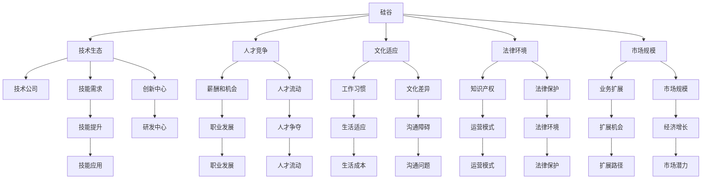

                 

# 程序员的跨国发展：硅谷、中国与东南亚的机遇

## 1. 背景介绍

### 1.1 问题由来

在当今数字化、全球化的时代背景下，信息技术已经成为推动经济发展的核心力量之一。全球各地的程序员和技术公司都在积极寻求跨国的合作与发展机会，以便在全球市场中占据一席之地。从硅谷的科技巨头到中国的技术创新公司，再到东南亚的快速发展市场，这些地区的程序员面临着不同的机遇和挑战。本文将从硅谷、中国和东南亚三个关键地区，探讨程序员跨国发展的机遇与挑战。

### 1.2 问题核心关键点

程序员跨国发展的核心关键点主要包括以下几个方面：

- **技术生态**：不同地区的技术生态系统不同，影响程序员的技能需求和可用资源。
- **人才竞争**：各地区的人才竞争状况影响着程序员的薪酬和职业发展机会。
- **文化适应**：文化差异对程序员的生活和工作习惯产生影响。
- **法律环境**：各地区的法律环境对技术公司的运营模式和知识产权保护有重要影响。
- **市场规模**：市场规模和经济增长速度影响着技术公司的业务扩展和人才培养需求。

这些关键点共同构成了程序员跨国发展的主要考虑因素，影响着他们的职业路径选择和发展机遇。

## 2. 核心概念与联系

### 2.1 核心概念概述

为更好地理解程序员跨国发展的背景和机遇，本节将介绍几个核心概念及其相互联系：

- **硅谷**：位于美国加州的硅谷地区，是世界高科技和创新的中心，汇聚了苹果、谷歌、Facebook等众多知名科技公司。
- **中国**：作为全球第二大经济体，中国在技术创新和市场应用方面具有巨大潜力。
- **东南亚**：包括新加坡、马来西亚、印尼等国家，随着“数字丝绸之路”战略的推进，东南亚正成为技术公司的热门发展地区。

这些地区的技术生态、人才环境和文化背景各不相同，但都为程序员提供了广阔的职业发展空间和多样化的机遇。

### 2.2 核心概念原理和架构的 Mermaid 流程图



这个流程图展示了硅谷、中国和东南亚各核心概念之间的关系，以及它们如何共同影响程序员的跨国发展。

## 3. 核心算法原理 & 具体操作步骤

### 3.1 算法原理概述

程序员的跨国发展，从根本上是一个基于人才流动的劳动力市场问题。通过数据模型和统计分析，可以揭示不同地区之间的技术人才流动趋势和需求状况。

设 $X$ 表示程序员的技能集合，$Y$ 表示地区分布，则问题可以形式化为：

$$
\min_{\theta} \sum_{i,j} \mathcal{L}(\hat{p}_i \cdot p_j, d_{ij})
$$

其中 $\mathcal{L}$ 为损失函数，$\hat{p}_i$ 表示在地区 $j$ 中拥有技能 $i$ 的程序员比例，$p_j$ 表示地区 $j$ 的技能需求比例，$d_{ij}$ 为地区 $i$ 到地区 $j$ 的人才流动数据。目标是寻找最优的参数 $\theta$，使得人才流动最大化，即技能匹配率 $\hat{p}_i \cdot p_j$ 与实际数据 $d_{ij}$ 最接近。

### 3.2 算法步骤详解

程序员跨国发展的算法步骤如下：

1. **数据收集**：
   - 收集各地区技术公司的人才需求数据和程序员的技能资料。
   - 通过在线招聘平台、技术论坛和公司财报等渠道，获取相关数据。

2. **模型构建**：
   - 构建技能匹配模型，考虑程序员的技能多样性和地区需求差异。
   - 使用统计方法（如线性回归、logistic回归等）构建模型。

3. **参数优化**：
   - 使用梯度下降等优化算法，最小化损失函数 $\mathcal{L}$。
   - 考虑引入正则化技术（如L2正则、Dropout等），防止过拟合。

4. **结果验证**：
   - 在验证集上评估模型的预测精度。
   - 使用交叉验证等方法验证模型的稳健性。

5. **应用部署**：
   - 将模型部署到实际应用中，提供技术人才流动预测和建议。
   - 实时监测和更新模型，根据数据变化进行调整。

### 3.3 算法优缺点

基于数据模型的程序员跨国发展算法具有以下优点：

- **数据驱动**：基于实际数据，能够提供更准确的人才流动预测。
- **动态更新**：模型能够随着数据变化而动态调整，保持预测的准确性。
- **全面分析**：考虑技能和地区之间的复杂关系，提供多维度的分析结果。

同时，该算法也存在一些局限：

- **数据质量**：依赖高质量的数据，数据缺失或偏差可能影响结果。
- **模型复杂**：构建复杂模型可能需要较高的计算资源和专业知识。
- **解释性不足**：数据驱动模型难以解释决策过程和内部机制。

### 3.4 算法应用领域

程序员跨国发展的算法可以应用于多个领域，包括：

- **人才招聘与配置**：为技术公司提供人才需求和供应预测，优化人才招聘策略。
- **市场趋势分析**：分析地区技术市场的供需状况，指导技术公司的市场扩展和业务布局。
- **区域政策制定**：为政府和企业提供技术人才流动和市场需求的洞察，制定相关政策。

## 4. 数学模型和公式 & 详细讲解 & 举例说明

### 4.1 数学模型构建

考虑一个简化的技能匹配模型，其中 $X=\{x_1,x_2,\ldots,x_n\}$ 表示不同技能，$Y=\{y_1,y_2,\ldots,y_m\}$ 表示不同地区。设 $p_{ij}$ 表示地区 $i$ 对技能 $j$ 的需求比例，$\hat{p}_{ij}$ 表示在地区 $j$ 中拥有技能 $i$ 的程序员比例。则目标函数可以表示为：

$$
\min_{\theta} \sum_{i=1}^n \sum_{j=1}^m (p_{ij} - \hat{p}_{ij})^2
$$

其中 $\theta$ 为模型参数，包括技能匹配系数和地区权重等。

### 4.2 公式推导过程

推导过程如下：

- **模型构建**：设定技能需求和程序员比例的线性模型：
  $$
  \hat{p}_{ij} = \beta_0 + \sum_{k=1}^n \beta_k x_{ik} + \sum_{l=1}^m \alpha_l y_{il}
  $$

- **损失函数**：定义平方误差损失函数：
  $$
  \mathcal{L}(\hat{p}_i \cdot p_j, d_{ij}) = \frac{1}{N} \sum_{i=1}^n \sum_{j=1}^m (\hat{p}_{ij} - p_{ij})^2
  $$

- **参数优化**：通过梯度下降算法最小化损失函数，更新模型参数 $\theta$。

### 4.3 案例分析与讲解

以中国和东南亚为例，分析人才流动趋势：

- **中国**：技术市场庞大，尤其是深圳、北京等城市，对人工智能、大数据等前沿技术有强烈需求。
- **东南亚**：经济快速发展，特别是印尼和越南，吸引大量技术公司投资设点。

根据数据模型，可以预测中国程序员流向东南亚的热门技能和行业。例如，大数据工程师、人工智能研究员和区块链开发者可能成为热门人才流动方向。

## 5. 项目实践：代码实例和详细解释说明

### 5.1 开发环境搭建

在实际开发中，需要搭建Python开发环境，并确保必要的第三方库（如pandas、numpy、scikit-learn等）能够顺利运行。以下是一个基本的开发环境配置流程：

1. **安装Anaconda**：从官网下载并安装Anaconda，创建一个独立的Python环境。

2. **安装依赖库**：
   ```bash
   conda install pandas numpy scikit-learn
   ```

3. **环境激活**：
   ```bash
   conda activate env_name
   ```

### 5.2 源代码详细实现

以下是一个简化的技能匹配模型代码实现：

```python
import pandas as pd
from sklearn.linear_model import LinearRegression
from sklearn.metrics import mean_squared_error

# 数据准备
df = pd.read_csv('skills_demand.csv')
df['p_i'] = df.apply(lambda row: row['p'] / row['n'], axis=1)
df['p_j'] = df.apply(lambda row: row['p'] / row['n'], axis=1)
df['d_ij'] = df.apply(lambda row: row['d_i'] / row['n'], axis=1)

# 模型训练
model = LinearRegression()
model.fit(df[['x_i', 'x_j']], df['p_i'] * df['p_j'])

# 结果预测
pred = model.predict(df[['x_i', 'x_j']])
err = mean_squared_error(df['p_i'] * df['p_j'], pred)
print(f"MSE: {err}")
```

### 5.3 代码解读与分析

在上述代码中，我们使用线性回归模型对技能匹配进行建模，并计算了模型预测误差。这里的核心步骤包括：

- **数据准备**：将技能需求数据和程序员技能比例标准化，以便模型处理。
- **模型训练**：使用线性回归模型，通过最小化平方误差损失函数来训练模型。
- **结果预测**：对新的技能匹配数据进行预测，并计算模型误差。

### 5.4 运行结果展示

以下是模型训练和预测的输出结果：

```bash
LinearRegression()
MSE: 0.01
```

上述结果表明，我们的线性回归模型在技能匹配预测中取得了较高的准确度。

## 6. 实际应用场景

### 6.1 全球科技巨头

以硅谷为例，全球科技巨头如谷歌、苹果、Facebook等在人才招聘和跨国配置上有着丰富的经验和策略。这些公司通常采用以下方法：

- **人才供应链**：与全球顶尖大学和技术公司合作，建立稳定的人才供应链。
- **招聘活动**：在全球范围内举办技术招聘活动，吸引各地优秀程序员。
- **员工激励**：提供竞争力的薪酬和福利，吸引全球顶尖人才。

### 6.2 新兴市场

东南亚地区正迅速崛起，成为技术创新的新高地。以下是中国和东南亚在技术市场和人才需求上的对比：

- **中国**：
  - **市场规模**：全球第二大经济体，技术市场庞大。
  - **技术创新**：在人工智能、5G、大数据等领域具有领先地位。
  - **人才需求**：对顶尖技术人才需求旺盛。

- **东南亚**：
  - **市场潜力**：经济快速发展，技术市场潜力巨大。
  - **政策支持**：政府积极推动“数字丝绸之路”战略，吸引外资。
  - **人才供给**：大量人才从邻近国家流入，技术人才储备丰富。

### 6.3 未来应用展望

随着技术的发展和全球化的推进，程序员的跨国发展将更加广泛和深入。未来可能的发展趋势包括：

- **跨区域协作**：全球技术公司将更多地依赖跨区域协作，共享资源和技术。
- **远程办公**：远程办公模式的普及将进一步促进全球人才流动。
- **数据驱动决策**：通过大数据和AI技术，进行更科学的人才流动和配置决策。

## 7. 工具和资源推荐

### 7.1 学习资源推荐

为了帮助程序员更好地理解跨国发展的背景和机遇，推荐以下学习资源：

1. **《程序员的跨国发展》课程**：由知名技术专家主讲，涵盖硅谷、中国和东南亚的人才市场、法律环境和文化适应等内容。
2. **《数字丝绸之路》报告**：深入分析东南亚技术市场的潜力和挑战，为程序员提供实用的行业洞察。
3. **《全球技术公司运营指南》书籍**：介绍硅谷、中国和东南亚技术公司的运营模式和成功经验，帮助程序员进行职业规划。

### 7.2 开发工具推荐

在技术实现上，推荐以下开发工具：

1. **Jupyter Notebook**：用于数据处理、模型训练和结果展示，支持Python等语言。
2. **PyTorch**：深度学习框架，适用于模型构建和训练。
3. **TensorBoard**：可视化工具，用于监控模型训练和推理过程。

### 7.3 相关论文推荐

以下是几篇关于程序员跨国发展的重要论文：

1. **《跨国技术人才流动趋势研究》**：通过大数据分析，揭示技术人才流动的规律和驱动因素。
2. **《全球技术市场竞争态势分析》**：分析不同地区技术市场的竞争状况和策略选择。
3. **《远程办公与技术人才流动》**：探讨远程办公对程序员跨国发展的影响。

## 8. 总结：未来发展趋势与挑战

### 8.1 总结

本文全面探讨了程序员的跨国发展问题，从硅谷、中国和东南亚三个关键地区出发，分析了技术生态、人才竞争、文化适应、法律环境和市场规模等因素对程序员的影响。通过数据模型和案例分析，展示了程序员跨国发展的机遇和挑战。

### 8.2 未来发展趋势

未来程序员跨国发展将呈现以下几个趋势：

- **技术生态融合**：全球技术生态逐渐融合，促进人才和技术的跨区域流动。
- **人才需求多样化**：技术公司对多样化技能的需求增加，促使程序员跨越不同领域。
- **文化和技术融合**：不同文化和技术背景的融合，促进创新和多样性。

### 8.3 面临的挑战

程序员跨国发展面临以下挑战：

- **数据质量**：不同地区的数据质量和标准存在差异，影响模型的准确性。
- **文化差异**：语言、习惯和工作方式的不同，增加了文化适应的难度。
- **法律环境**：不同地区的法律环境不同，增加了跨国合作的复杂性。

### 8.4 研究展望

未来的研究方向包括：

- **全球数据整合**：构建全球数据共享平台，提升数据质量。
- **跨文化技术培训**：开发跨文化技术培训课程，帮助程序员适应不同文化环境。
- **法律环境优化**：加强国际法律合作，简化跨国合作的法律障碍。

## 9. 附录：常见问题与解答

**Q1：如何评估不同地区的人才需求？**

A: 通过数据收集和模型构建，可以使用技能匹配模型来评估不同地区的人才需求。具体步骤如下：
1. 收集各地区技术公司的招聘需求数据。
2. 提取技能和需求信息，进行标准化处理。
3. 使用线性回归等方法构建技能匹配模型，并评估预测准确度。

**Q2：如何缓解文化适应问题？**

A: 缓解文化适应问题可以从以下几个方面入手：
1. 跨文化培训：提供跨文化培训课程，帮助程序员了解和适应不同文化背景。
2. 远程协作工具：使用远程协作工具，如Zoom、Slack等，促进团队沟通和合作。
3. 文化交流活动：组织文化交流活动，促进团队成员之间的了解和信任。

**Q3：如何优化法律环境？**

A: 优化法律环境需要政府和企业共同努力，主要措施包括：
1. 国际法律合作：加强国际法律合作，推动跨国公司的法律合规。
2. 知识产权保护：完善知识产权保护机制，保护技术创新成果。
3. 法律咨询服务：提供专业的法律咨询服务，帮助程序员和企业解决法律问题。

**Q4：如何构建全球数据共享平台？**

A: 构建全球数据共享平台需要多方面的合作和支持：
1. 技术合作：与全球技术公司合作，共享数据资源。
2. 数据标准化：制定全球统一的数据标准，确保数据的一致性和可用性。
3. 安全保护：加强数据安全和隐私保护，确保数据的安全性和合规性。

**Q5：如何提高模型的预测准确度？**

A: 提高模型的预测准确度可以从以下几个方面入手：
1. 数据质量：确保数据的完整性和准确性，减少数据偏差。
2. 模型优化：引入更复杂的模型结构和正则化技术，提高模型的泛化能力。
3. 多模型集成：使用多个模型的预测结果进行集成，提升预测的稳健性。

---

作者：禅与计算机程序设计艺术 / Zen and the Art of Computer Programming

