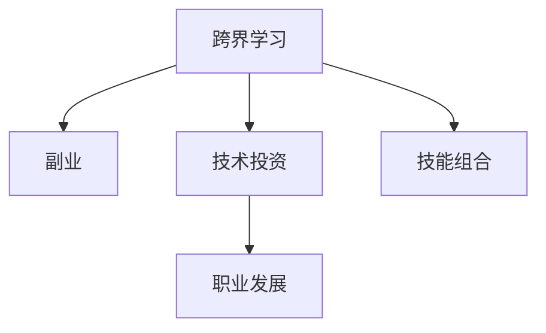

                 

# 程序员的跨界学习：拓宽收入渠道

> 关键词：跨界学习, 副业, 技术投资, 技能组合, 职业发展

## 1. 背景介绍

在快速发展的数字时代，技术的边界正在不断模糊，跨界学习成为了程序员拓宽收入渠道、提升职业竞争力的重要途径。从主业到副业，从本国到国际，程序员可以借助跨界学习打破专业壁垒，开辟新的职业道路。本文将系统探讨程序员跨界学习的方法、策略与价值，为处于职业瓶颈期的程序员提供全面指南。

## 2. 核心概念与联系

### 2.1 核心概念概述

要理解程序员的跨界学习，首先需要明确几个核心概念：

- **跨界学习(Cross-Disciplinary Learning)**：指将不同领域的知识和方法融合到自身专业领域中，通过跨学科学习拓宽技能和视野。
- **副业(Secondary Incomes)**：指利用主业之外的时间或资源进行的盈利活动，如编程教育、技术咨询、产品开发等。
- **技术投资(Technology Investment)**：指投入时间和精力学习新的技术领域，从而增加自身技术栈的深度和广度。
- **技能组合(Skill Composition)**：指将多种技能组合成一个复合技能集，满足复杂项目或职业发展的需求。
- **职业发展(Career Development)**：指通过不断学习新技能和适应新环境，提升个人职业层次和市场竞争力。

### 2.2 核心概念原理和架构的 Mermaid 流程图



这个流程图展示了跨界学习与副业、技术投资、技能组合、职业发展之间的关系：

1. 跨界学习是副业、技术投资和技能组合的基础。
2. 副业和技术投资都是技能组合的一部分，可以帮助程序员增加收入渠道。
3. 技能组合是提升职业发展的重要手段，能够增强程序员的竞争力和市场价值。
4. 职业发展是跨界学习的最终目标，通过不断学习新技能和适应新环境，程序员能够在职业生涯中保持持续进步。

## 3. 核心算法原理 & 具体操作步骤

### 3.1 算法原理概述

程序员的跨界学习通常遵循以下基本原理：

1. **自上而下规划**：从职业目标出发，识别需要补充的技能和知识领域。
2. **自下而上实践**：通过实际项目或课程逐步掌握新技能，并在工作中应用。
3. **迭代优化**：持续评估学习效果和职业发展状态，调整学习计划和目标。

### 3.2 算法步骤详解

#### 3.2.1 确定跨界目标

1. **职业目标设定**：明确你希望通过跨界学习达成的职业目标，如晋升高级工程师、转型技术经理、开启副业等。
2. **需求分析**：分析达成目标所需的技能和知识领域，如编程语言、技术栈、管理能力等。
3. **优先级排序**：根据难易程度、收益预期、学习成本等因素，对需要学习的技能进行优先级排序。

#### 3.2.2 选择合适的学习资源

1. **在线课程和教程**：如Coursera、edX、Udemy等平台提供的大量编程和技术课程。
2. **书籍和文档**：经典书籍如《算法导论》、《深入理解计算机系统》、《Clean Code》等，以及官方文档如React、Vue等框架的文档。
3. **实践项目**：如GitHub上的开源项目、公司内部的项目等，提供实践机会。
4. **社区和论坛**：如Stack Overflow、Reddit、Hacker News等，获取最新技术和解决问题。

#### 3.2.3 制定学习计划

1. **时间安排**：根据每日、每周的时间安排，制定详细的学习计划。
2. **资源分配**：根据难易程度和优先级，合理分配学习资源和精力。
3. **进度跟踪**：定期评估学习进度，调整学习计划和目标。

#### 3.2.4 实施和验证

1. **理论学习**：通过阅读书籍、观看视频等形式，掌握新技能的基础知识和理论。
2. **实践应用**：通过实际项目、练习、实验等方式，验证和巩固所学知识。
3. **反馈循环**：在实践中收集反馈，识别问题和不足，进行迭代优化。

### 3.3 算法优缺点

#### 3.3.1 算法优点

1. **多样化的收入来源**：通过跨界学习，程序员可以开启新的副业，增加收入渠道。
2. **提升竞争力**：跨界学习能够扩展技术栈，增强职业竞争力和市场价值。
3. **灵活性和适应性**：跨界学习使程序员能够应对快速变化的技术环境，适应新的职业挑战。
4. **自我实现**：通过实现职业目标和提升技能，程序员能够实现自我价值和成就感。

#### 3.3.2 算法缺点

1. **时间成本**：跨界学习需要投入大量时间和精力，可能影响主业和家庭生活。
2. **知识深度不足**：跨界学习往往难以深入掌握新领域的核心知识和技能。
3. **学习资源分散**：需要同时关注多个领域，可能导致资源分散和注意力分散。
4. **实践机会有限**：跨界学习通常缺乏实际工作中的实践机会，需要通过项目或兼职等方式弥补。

### 3.4 算法应用领域

跨界学习在多个领域都有广泛应用，主要包括：

- **技术教育**：通过教授编程、软件开发生命周期等课程，开启编程教育副业。
- **技术咨询**：利用自身技术优势，为客户提供技术方案和咨询服务。
- **产品开发**：利用跨界技能开发新产品或改进现有产品，增加收入来源。
- **数据分析**：通过学习数据分析技能，提供数据驱动的解决方案。
- **自动化与AI**：学习自动化和AI相关技术，提高工作效率和创造价值。
- **区块链与加密货币**：学习区块链和加密货币技术，参与区块链项目或提供相关服务。

## 4. 数学模型和公式 & 详细讲解 & 举例说明

### 4.1 数学模型构建

假设程序员的跨界学习目标为 $T$，当前技能集为 $S_0$，所需新增技能集为 $S_1$。则跨界学习的数学模型可以表示为：

$$
T = S_0 \cup S_1
$$

其中 $S_0$ 和 $S_1$ 是互斥的，表示当前技能集和新增技能集的并集。

### 4.2 公式推导过程

为了衡量跨界学习的进度和效果，可以定义一个技能掌握度函数 $f(s)$，其中 $s$ 表示学习后技能集的规模：

$$
f(s) = \frac{s}{s_0 + s_1}
$$

其中 $s_0$ 为学习前的技能集规模，$s_1$ 为新增技能集规模。

此外，还可以定义一个时间成本函数 $c(t)$，表示学习所需的时间 $t$：

$$
c(t) = t \times p
$$

其中 $p$ 为每小时的学习效率。

### 4.3 案例分析与讲解

假设一名前端开发者希望学习后端开发技能，初始技能集规模为 $s_0 = 50$，新增技能集规模为 $s_1 = 30$。通过在线课程学习，每天学习3小时，每小时学习效率为 $p = 0.5$。则学习后端开发技能的掌握度 $f(s)$ 和时间成本 $c(t)$ 可以计算如下：

$$
f(s) = \frac{s_0 + s_1 - 30}{s_0 + s_1} = \frac{80 - 30}{80} = 0.625
$$

$$
c(t) = 3t \times 0.5 = 1.5t
$$

通过不断学习，掌握度 $f(s)$ 可以逐渐接近1，表示掌握了大部分新增技能。时间成本 $c(t)$ 随时间 $t$ 增加而增加，需要合理分配学习时间以平衡效果和成本。

## 5. 项目实践：代码实例和详细解释说明

### 5.1 开发环境搭建

为了实践跨界学习，需要先搭建开发环境。以下是基本的开发环境配置流程：

1. **选择编程语言**：根据跨界学习目标选择合适的编程语言，如Python、Java、C++等。
2. **安装开发工具**：安装IDE、文本编辑器、版本控制等工具，如Visual Studio Code、Sublime Text、Git等。
3. **配置开发环境**：配置Python环境、编译器、数据库等开发环境，确保工具的顺利运行。

### 5.2 源代码详细实现

以学习JavaScript和Node.js为例，展示跨界学习的代码实现：

#### 5.2.1 前端技能学习

```javascript
// 使用Node.js编写脚本，读取文件内容
const fs = require('fs');
const data = fs.readFileSync('file.txt', 'utf8');
console.log(data);
```

#### 5.2.2 后端技能学习

```python
# 使用Python编写Flask应用
from flask import Flask
app = Flask(__name__)

@app.route('/')
def hello_world():
    return 'Hello, World!'

if __name__ == '__main__':
    app.run(debug=True)
```

### 5.3 代码解读与分析

以上代码展示了使用Node.js和Python进行前端和后端技能学习的实现。通过实际编写代码，可以加深对新技能的理解和掌握。

### 5.4 运行结果展示

- **前端学习**：通过浏览器访问 `http://localhost:3000`，可以看到输出 `Hello, World!`。
- **后端学习**：通过访问 `http://localhost:5000`，可以看到输出 `Hello, World!`。

通过实际项目和练习，可以逐步提升技能水平，增强自信心。

## 6. 实际应用场景

### 6.1 技术教育

技术教育是程序员跨界学习的常见应用场景之一。通过教授编程语言和技术栈，程序员可以开启副业，增加收入来源。

#### 6.1.1 在线课程

利用Udemy、Coursera等平台，录制和上传编程课程，吸引学员付费学习。

#### 6.1.2 社区活动

在GitHub、Stack Overflow等社区，通过公开代码和解答问题，积累声誉和学员，进一步扩大影响力。

#### 6.1.3 企业培训

与企业合作，提供定制化的技术培训，解决企业的技术难题。

### 6.2 技术咨询

技术咨询是程序员跨界学习的另一种常见应用场景。利用自身技术优势，为其他企业或个人提供技术方案和咨询服务。

#### 6.2.1 企业技术顾问

作为企业的技术顾问，参与项目评审、技术决策等工作，提供专业意见和解决方案。

#### 6.2.2 个人技术咨询

通过在线平台或社交媒体，提供技术咨询服务，解决个人或企业的技术问题。

### 6.3 产品开发

产品开发是程序员跨界学习的另一重要应用场景。利用跨界技能，开发新产品或改进现有产品，增加收入来源。

#### 6.3.1 开发新应用

开发符合市场需求的新应用，如移动应用、网站、区块链应用等，并通过应用商店或网站发布。

#### 6.3.2 改进现有产品

对现有产品进行技术改进和功能扩展，增加用户粘性和市场竞争力。

### 6.4 数据分析

数据分析是程序员跨界学习的另一个热门领域。通过学习数据分析技能，提供数据驱动的解决方案。

#### 6.4.1 数据可视化

利用数据可视化工具如D3.js、Tableau等，将数据转换为图表和报表，帮助用户理解和分析数据。

#### 6.4.2 机器学习

通过学习机器学习算法和框架如TensorFlow、Scikit-Learn等，进行数据挖掘和预测分析。

### 6.5 自动化与AI

自动化和AI是程序员跨界学习的未来方向之一。通过学习自动化和AI相关技术，提高工作效率和创造价值。

#### 6.5.1 自动化工具开发

开发自动化工具和脚本，自动化重复性任务，提高工作效率。

#### 6.5.2 AI模型应用

学习并应用AI模型和框架如TensorFlow、PyTorch等，进行自然语言处理、图像识别等应用。

## 7. 工具和资源推荐

### 7.1 学习资源推荐

#### 7.1.1 编程语言学习资源

- Codecademy（交互式编程学习平台）
- LeetCode（算法编程练习平台）
- CodeCombat（游戏化编程学习平台）

#### 7.1.2 技术栈学习资源

- Udemy（在线课程平台）
- Coursera（在线课程平台）
- edX（在线课程平台）

#### 7.1.3 新技术学习资源

- arXiv（学术论文平台）
- GitHub（开源社区）
- Stack Overflow（技术问答社区）

### 7.2 开发工具推荐

#### 7.2.1 IDE和文本编辑器

- Visual Studio Code（免费且功能强大的代码编辑器）
- Sublime Text（高效轻量级文本编辑器）
- Atom（可定制的文本编辑器）

#### 7.2.2 版本控制工具

- Git（主流的版本控制系统）
- GitHub（代码托管平台）
- GitLab（代码托管平台）

#### 7.2.3 开发平台

- Google Cloud Platform（云服务平台）
- AWS（云服务平台）
- Microsoft Azure（云服务平台）

### 7.3 相关论文推荐

#### 7.3.1 跨界学习相关论文

- "The Cross-Disciplinary Learning Process in Software Engineering"（《软件工程中的跨学科学习过程》）
- "Cross-Disciplinary Learning: Concepts, Approaches, and Examples"（《跨学科学习：概念、方法和实例》）
- "Cross-Disciplinary Learning in Computer Science Education"（《计算机科学教育中的跨学科学习》）

#### 7.3.2 副业和副业收入相关论文

- "Secondary Incomes in the Digital Economy: Trends and Opportunities"（《数字经济中的副业收入趋势与机遇》）
- "The Gig Economy and Secondary Incomes"（《零工经济与副业收入》）
- "Secondary Incomes and the Future of Work"（《副业收入与未来的工作》）

## 8. 总结：未来发展趋势与挑战

### 8.1 研究成果总结

跨界学习作为程序员拓宽收入渠道的重要手段，已经在多个领域得到了广泛应用。通过学习新技能和知识，程序员可以开启副业、增强竞争力、实现职业发展，从而提升生活质量。

### 8.2 未来发展趋势

1. **技能组合多样化**：跨界学习将不再局限于单一领域的技能组合，而是向多领域、多技能组合发展。
2. **技术与市场的深度融合**：跨界学习将更加注重技术应用与市场需求的深度融合，提高技术转化率。
3. **在线学习和远程工作**：随着网络技术的进步，在线学习和远程工作将成为主流，跨界学习可以更加灵活便捷。
4. **人工智能与自动化**：跨界学习将更多地与人工智能和自动化技术结合，提升工作效率和智能化水平。

### 8.3 面临的挑战

1. **时间管理和平衡**：跨界学习需要投入大量时间和精力，可能影响主业和家庭生活。
2. **知识深度不足**：跨界学习往往难以深入掌握新领域的核心知识和技能。
3. **资源分散和注意力不集中**：需要同时关注多个领域，可能导致资源分散和注意力不集中。
4. **实践机会有限**：跨界学习通常缺乏实际工作中的实践机会，需要通过项目或兼职等方式弥补。

### 8.4 研究展望

1. **智能学习系统**：开发智能学习系统，根据学习者的需求和进度，推荐合适的学习资源和路径。
2. **跨界学习社区**：建立跨界学习社区，促进学习者之间的交流和协作，分享经验和资源。
3. **跨界学习平台**：开发跨界学习平台，整合多种学习资源和工具，提供一站式学习体验。

## 9. 附录：常见问题与解答

### 9.1 常见问题

1. **如何选择跨界学习目标？**
   - 选择与主业相关且感兴趣的技能领域，如前端开发、后端开发、数据分析等。
2. **如何平衡主业和副业？**
   - 合理分配时间，设定明确的优先级，确保每个领域都能获得足够关注。
3. **如何获取学习资源？**
   - 利用在线课程、书籍、社区、论坛等资源，选择适合自己学习风格和节奏的资源。
4. **如何验证学习效果？**
   - 通过实际项目或练习，验证和巩固所学知识，收集反馈进行迭代优化。

### 9.2 解答

1. **如何选择跨界学习目标？**
   - 选择与主业相关且感兴趣的技能领域，如前端开发、后端开发、数据分析等。可以通过市场需求、职业规划等角度进行考量。

2. **如何平衡主业和副业？**
   - 合理分配时间，设定明确的优先级，确保每个领域都能获得足够关注。可以通过时间块分配、优先级排序等方式进行管理。

3. **如何获取学习资源？**
   - 利用在线课程、书籍、社区、论坛等资源，选择适合自己学习风格和节奏的资源。如Coursera、edX、Udemy等平台，以及GitHub、Stack Overflow等社区。

4. **如何验证学习效果？**
   - 通过实际项目或练习，验证和巩固所学知识，收集反馈进行迭代优化。如GitHub上的开源项目、公司内部的项目等。

---

作者：禅与计算机程序设计艺术 / Zen and the Art of Computer Programming

