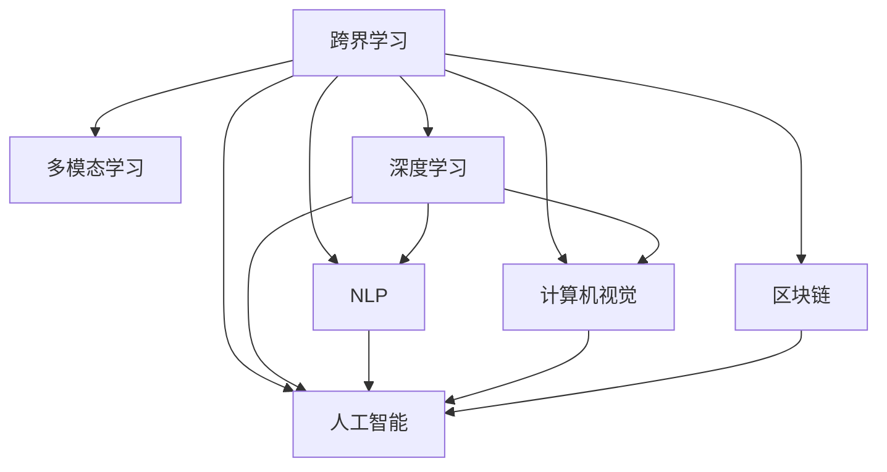

                 

# 程序员的跨界学习：拓宽收入渠道

## 1. 背景介绍

在数字经济的浪潮下，互联网、人工智能、区块链等新兴技术正在重塑传统行业，程序员这一传统的技术岗位也面临着转型升级的挑战。如何在技术的海洋中寻求新的增长点，拓宽收入渠道，成为程序员职业发展的重要课题。

本文将从程序员跨界学习这一主题出发，深入探讨如何通过多领域、多维度的知识积累和技能提升，打开新的职业发展道路，实现个人价值的最大化。

## 2. 核心概念与联系

### 2.1 核心概念概述

为了更好地理解程序员跨界学习的全貌，本节将介绍几个核心概念及其相互联系：

- **跨界学习(Cross-Disciplinary Learning)**：指不同领域之间知识的交流和整合，通过多领域知识的融合提升综合素质和创新能力。
- **多模态学习(Multimodal Learning)**：指同时利用文本、图像、语音等多模态数据进行学习，增强对复杂情境的理解能力。
- **深度学习(Deep Learning)**：指利用神经网络进行复杂模式识别和处理，实现高效的智能决策和预测。
- **自然语言处理(Natural Language Processing, NLP)**：指利用人工智能技术理解和生成自然语言，实现人机交互的智能化。
- **计算机视觉(Computer Vision)**：指通过算法让计算机“看懂”图像和视频内容，用于物体识别、图像分割等场景。
- **区块链(Blockchain)**：指一种分布式账本技术，实现去中心化、透明、安全的交易记录和管理。
- **人工智能(AI)**：指模拟人类智能行为的技术，包括机器学习、自然语言处理、计算机视觉等诸多领域。

这些核心概念之间的逻辑关系可以通过以下Mermaid流程图来展示：



这个流程图展示了许多核心概念之间的联系：

1. **跨界学习**：作为入口，覆盖了多个领域的学习过程。
2. **多模态学习**：从数据角度出发，融合了多种数据形式的理解能力。
3. **深度学习**：作为核心技术，实现了对复杂数据和模式的深度分析。
4. **NLP**：聚焦于语言处理，实现了人机对话的智能化。
5. **计算机视觉**：侧重于图像处理，增强了计算机对视觉内容的理解能力。
6. **区块链**：提供了一种去中心化的技术框架，用于安全和透明的交易记录。
7. **人工智能**：综合了上述多个领域的知识和技术，推动了智能应用的广泛发展。

## 3. 核心算法原理 & 具体操作步骤

### 3.1 算法原理概述

跨界学习的核心算法原理可以简单概括为：通过融合不同领域的知识，利用深度学习技术，实现多模态数据的联合学习，最终形成具有跨领域能力的人工智能系统。

具体而言，跨界学习通过以下步骤实现：

1. **数据收集与预处理**：从不同领域收集数据，并进行数据清洗、归一化等预处理操作。
2. **多模态特征提取**：利用深度学习模型，对不同模态的数据进行特征提取，形成高维特征向量。
3. **联合学习**：将不同模态的特征向量进行拼接、融合，通过深度学习模型进行联合学习。
4. **任务适配**：根据具体应用场景，训练模型进行分类、预测等任务。

### 3.2 算法步骤详解

以下详细介绍跨界学习的主要操作步骤：

**Step 1: 数据收集与预处理**
- 收集不同领域的数据，如NLP领域的文字、图像领域的图像、区块链领域的交易记录等。
- 对收集到的数据进行清洗，去除噪音和不相关的信息。
- 对数据进行归一化处理，使其具备相同的数据规模和分布。

**Step 2: 多模态特征提取**
- 利用深度学习模型，如CNN、RNN、LSTM等，对不同模态的数据进行特征提取，形成高维特征向量。
- 例如，对于图像数据，可以使用卷积神经网络(CNN)进行特征提取；对于文本数据，可以使用循环神经网络(RNN)或Transformer模型进行特征提取。

**Step 3: 联合学习**
- 将不同模态的特征向量进行拼接、融合，形成联合特征向量。
- 通过深度学习模型，如卷积神经网络、Transformer等，对联合特征向量进行联合学习。

**Step 4: 任务适配**
- 根据具体应用场景，设计相应的任务适配层，如分类层、回归层、生成层等。
- 使用训练集数据，对模型进行监督学习，使其能够完成指定的任务。
- 在测试集上评估模型性能，进行必要的调参和优化。

### 3.3 算法优缺点

跨界学习作为一种融合多领域知识的技术，具有以下优点：

1. **提升综合能力**：跨界学习能够提升程序员的综合能力，使其在多个领域都有所建树，具备更强的竞争力和创新能力。
2. **增强问题解决能力**：多模态数据的联合学习，使得模型能够更好地理解复杂情境，提升问题解决的准确性和效率。
3. **推动技术创新**：跨界学习能够促进不同领域技术的融合创新，推动人工智能技术的发展。

同时，跨界学习也存在以下缺点：

1. **学习难度大**：跨界学习涉及多个领域的技术，学习难度较大，需要较长时间积累。
2. **资源需求高**：跨界学习需要大量的数据和计算资源，可能面临资源限制的问题。
3. **效果不确定**：由于多个领域的知识融合复杂，模型的性能可能存在不确定性。

### 3.4 算法应用领域

跨界学习已经在多个领域得到了广泛应用，例如：

- **金融科技(FinTech)**：利用多模态数据进行风险评估、信用评分、智能投顾等应用。
- **医疗健康**：结合图像、文本、基因等多模态数据，进行疾病诊断、健康管理、药物研发等。
- **智能制造**：通过物联网设备收集的多模态数据，进行设备监控、故障预测、生产优化等。
- **城市管理**：利用摄像头图像、传感器数据等，进行城市交通管理、环境监测、公共安全等。
- **智慧农业**：结合传感器数据、无人机图像等，进行农业生产监测、农作物识别、智能灌溉等。

## 4. 数学模型和公式 & 详细讲解 & 举例说明

### 4.1 数学模型构建

本节将使用数学语言对跨界学习的过程进行更加严格的刻画。

记多模态数据集为 $\mathcal{X} = \{(X_i, Y_i)\}_{i=1}^N$，其中 $X_i = (X_i^1, X_i^2, ..., X_i^m)$ 表示多模态数据的各个模态，$Y_i$ 为对应标签。

设多模态特征提取模型为 $\phi(X_i) = (F^1(X_i^1), F^2(X_i^2), ..., F^m(X_i^m))$，其中 $F^k$ 表示对第 $k$ 个模态的特征提取模型。

联合学习模型为 $H(\phi(X_i))$，表示将多模态特征向量拼接、融合后进行联合学习的模型。

任务适配模型为 $T$，根据具体任务需求设计，如分类模型、回归模型、生成模型等。

最终的模型输出为 $T(H(\phi(X_i)))$，表示模型在联合学习的基础上，进行任务适配得到的结果。

### 4.2 公式推导过程

以下我们以二分类任务为例，推导多模态联合学习模型的数学公式。

假设多模态数据集 $\mathcal{X}$ 中每个样本包含图像 $X_i^1$ 和文本 $X_i^2$ 两个模态，文本为自然语言形式，图像为自然图像形式。分别使用卷积神经网络(CNN)和Transformer模型对图像和文本进行特征提取，得到高维特征向量 $F^1(X_i^1)$ 和 $F^2(X_i^2)$。

联合学习模型 $H$ 可以设计为简单的全连接神经网络，将两个特征向量拼接后，通过多层神经网络进行联合学习：

$$
H(\phi(X_i)) = \sigma(W_H \tanh(H_1(W_{H_1} [F^1(X_i^1), F^2(X_i^2)] + b_H))
$$

其中 $\sigma$ 为激活函数，$W_H, b_H, H_1$ 为神经网络的权重和偏置项。

任务适配模型 $T$ 可以选择多输出分类器，如Softmax分类器：

$$
\hat{y} = \text{Softmax}(W_T \tanh(W_{T_1}H(\phi(X_i)) + b_{T_1}) + b_T)
$$

最终的预测结果为 $\hat{y}_i$，表示第 $i$ 个样本的预测标签。

在训练过程中，使用交叉熵损失函数对模型进行监督学习：

$$
\mathcal{L} = -\frac{1}{N}\sum_{i=1}^N \sum_{k=1}^C y_{ik} \log \hat{y}_{ik}
$$

其中 $C$ 为分类数目。

优化算法通常选择随机梯度下降(SGD)或其变种，更新模型的参数：

$$
\theta \leftarrow \theta - \eta \nabla_{\theta}\mathcal{L}
$$

其中 $\theta$ 为模型参数，$\eta$ 为学习率，$\nabla_{\theta}\mathcal{L}$ 为损失函数对模型参数的梯度。

### 4.3 案例分析与讲解

下面以一个具体案例来说明跨界学习的实际应用。

**案例：金融风控系统**

假设某金融科技公司需要构建一个风控系统，以识别欺诈行为。该系统需要将用户的历史交易记录、身份信息、社交媒体行为等多模态数据进行联合学习，识别出潜在的欺诈用户。

**数据收集**：
- 交易记录：包含用户的交易金额、时间、地点等。
- 身份信息：包含用户的姓名、身份证号码、住址等。
- 社交媒体行为：包含用户在社交媒体上的行为记录、好友关系等。

**特征提取**：
- 对于交易记录，使用简单的统计特征提取，如总交易金额、平均交易金额、交易次数等。
- 对于身份信息，使用自然语言处理技术，提取用户姓名、住址等关键信息。
- 对于社交媒体行为，使用情感分析等技术，提取用户的情感倾向。

**联合学习**：
- 将交易记录、身份信息、社交媒体行为等多模态数据进行拼接，形成联合特征向量。
- 使用Transformer模型对联合特征向量进行联合学习，提取用户行为的复杂模式。

**任务适配**：
- 设计多输出分类器，对用户行为进行分类，判断其是否存在欺诈风险。
- 在训练集上对模型进行监督学习，最小化损失函数。
- 在测试集上评估模型性能，进行必要的调参和优化。

通过跨界学习，该系统能够充分利用多模态数据，提高欺诈识别的准确性和效率，为金融安全提供有力保障。

## 5. 项目实践：代码实例和详细解释说明

### 5.1 开发环境搭建

在进行跨界学习实践前，我们需要准备好开发环境。以下是使用Python进行PyTorch开发的环境配置流程：

1. 安装Anaconda：从官网下载并安装Anaconda，用于创建独立的Python环境。

2. 创建并激活虚拟环境：
```bash
conda create -n pytorch-env python=3.8 
conda activate pytorch-env
```

3. 安装PyTorch：根据CUDA版本，从官网获取对应的安装命令。例如：
```bash
conda install pytorch torchvision torchaudio cudatoolkit=11.1 -c pytorch -c conda-forge
```

4. 安装相关库：
```bash
pip install torch torchvision torchtext
```

完成上述步骤后，即可在`pytorch-env`环境中开始跨界学习实践。

### 5.2 源代码详细实现

这里我们以一个简单的多模态数据联合学习案例为例，给出使用PyTorch和Transformers库实现的代码。

首先，定义数据处理函数：

```python
from torch.utils.data import Dataset
from torchvision import transforms
from transformers import BertTokenizer

class MultiModalDataset(Dataset):
    def __init__(self, data, tokenizer):
        self.data = data
        self.tokenizer = tokenizer
        
    def __len__(self):
        return len(self.data)
    
    def __getitem__(self, index):
        # 假设每个样本包含图像和文本两个模态
        img_path = self.data[index]['image']
        text = self.data[index]['text']
        
        # 图像数据预处理
        img_transforms = transforms.Compose([
            transforms.Resize((224, 224)),
            transforms.ToTensor(),
            transforms.Normalize(mean=[0.485, 0.456, 0.406], std=[0.229, 0.224, 0.225])
        ])
        img_tensor = img_transforms(Image.open(img_path)).unsqueeze(0)
        
        # 文本数据预处理
        encoded = self.tokenizer(text, return_tensors='pt', padding='max_length', truncation=True)
        input_ids = encoded['input_ids']
        attention_mask = encoded['attention_mask']
        
        return {'img': img_tensor, 'input_ids': input_ids, 'attention_mask': attention_mask}
```

然后，定义模型和优化器：

```python
from torch import nn
from transformers import BertForSequenceClassification, AdamW

model = BertForSequenceClassification.from_pretrained('bert-base-uncased', num_labels=2)

optimizer = AdamW(model.parameters(), lr=2e-5)
```

接着，定义训练和评估函数：

```python
from torch.utils.data import DataLoader
from tqdm import tqdm
from sklearn.metrics import accuracy_score

device = torch.device('cuda') if torch.cuda.is_available() else torch.device('cpu')
model.to(device)

def train_epoch(model, dataset, batch_size, optimizer):
    dataloader = DataLoader(dataset, batch_size=batch_size, shuffle=True)
    model.train()
    epoch_loss = 0
    for batch in tqdm(dataloader, desc='Training'):
        inputs = batch['img'].to(device), batch['input_ids'].to(device), batch['attention_mask'].to(device)
        model.zero_grad()
        outputs = model(*inputs)
        loss = outputs.loss
        epoch_loss += loss.item()
        loss.backward()
        optimizer.step()
    return epoch_loss / len(dataloader)

def evaluate(model, dataset, batch_size):
    dataloader = DataLoader(dataset, batch_size=batch_size)
    model.eval()
    preds, labels = [], []
    with torch.no_grad():
        for batch in tqdm(dataloader, desc='Evaluating'):
            inputs = batch['img'].to(device), batch['input_ids'].to(device), batch['attention_mask'].to(device)
            outputs = model(*inputs)
            preds.append(outputs.logits.argmax(dim=1).tolist())
            labels.append(batch['labels'].tolist())
            
    print(accuracy_score(labels, preds))
```

最后，启动训练流程并在测试集上评估：

```python
epochs = 5
batch_size = 16

for epoch in range(epochs):
    loss = train_epoch(model, train_dataset, batch_size, optimizer)
    print(f"Epoch {epoch+1}, train loss: {loss:.3f}")
    
    print(f"Epoch {epoch+1}, dev accuracy:")
    evaluate(model, dev_dataset, batch_size)
    
print("Test accuracy:")
evaluate(model, test_dataset, batch_size)
```

以上就是使用PyTorch和Transformers库对多模态数据进行联合学习的代码实现。可以看到，利用这些工具，我们可以很方便地进行多模态数据的联合学习和模型训练。

### 5.3 代码解读与分析

让我们再详细解读一下关键代码的实现细节：

**MultiModalDataset类**：
- `__init__`方法：初始化数据和分词器等关键组件。
- `__len__`方法：返回数据集的样本数量。
- `__getitem__`方法：对单个样本进行处理，将图像和文本数据输入模型。

**模型定义**：
- 使用BertForSequenceClassification模型进行二分类任务。
- 设置AdamW优化器，使用2e-5的学习率进行训练。

**训练和评估函数**：
- 使用PyTorch的DataLoader对数据集进行批次化加载，供模型训练和推理使用。
- 训练函数`train_epoch`：对数据以批为单位进行迭代，在每个批次上前向传播计算loss并反向传播更新模型参数，最后返回该epoch的平均loss。
- 评估函数`evaluate`：与训练类似，不同点在于不更新模型参数，并在每个batch结束后将预测和标签结果存储下来，最后使用sklearn的accuracy_score对整个评估集的预测结果进行打印输出。

**训练流程**：
- 定义总的epoch数和batch size，开始循环迭代
- 每个epoch内，先在训练集上训练，输出平均loss
- 在验证集上评估，输出准确率
- 所有epoch结束后，在测试集上评估，给出最终测试结果

可以看到，PyTorch配合Transformers库使得跨界学习的代码实现变得简洁高效。开发者可以将更多精力放在数据处理、模型改进等高层逻辑上，而不必过多关注底层的实现细节。

当然，工业级的系统实现还需考虑更多因素，如模型的保存和部署、超参数的自动搜索、更灵活的任务适配层等。但核心的跨界学习范式基本与此类似。

## 6. 实际应用场景
### 6.1 智能客服系统

跨界学习技术在智能客服系统中的应用，可以显著提升客户咨询体验。传统的客服系统依赖人工客服进行客户问答，存在响应慢、效率低等问题。而通过跨界学习，可以将自然语言处理技术和计算机视觉技术结合起来，构建智能客服机器人。

**应用场景**：
- **多模态数据收集**：利用摄像头、麦克风等设备，收集客户与机器人的交互数据。
- **特征提取**：对文字、语音、图像等多模态数据进行特征提取，形成高维特征向量。
- **联合学习**：使用深度学习模型，如Transformer，对多模态特征向量进行联合学习，识别客户意图和情绪。
- **任务适配**：根据客户意图，生成合适的回答。对于不明确的问题，进行多轮对话，直至识别出客户需求。

**效果**：
- 能够处理多轮对话，提供个性化服务。
- 能够实时监测客户情绪，提高服务质量。
- 能够智能推荐相关产品或服务，提升客户满意度。

### 6.2 金融风险管理

在金融领域，跨界学习可以用于风险评估和管理。传统的风险评估依赖人工经验，存在主观性和局限性。而通过跨界学习，可以将文本、图像、行为数据等多模态信息结合起来，构建更加全面和客观的风险评估模型。

**应用场景**：
- **多模态数据收集**：收集用户的交易记录、身份证信息、社交媒体行为等数据。
- **特征提取**：对不同模态的数据进行特征提取，形成高维特征向量。
- **联合学习**：使用深度学习模型，如CNN、RNN，对多模态特征向量进行联合学习，识别出风险用户。
- **任务适配**：设计多输出分类器，对用户行为进行分类，判断其是否存在欺诈风险。

**效果**：
- 能够识别出潜在的欺诈行为，降低金融风险。
- 能够实时监测用户行为，及时预警异常交易。
- 能够提供个性化的风险评估报告，提升客户信任度。

### 6.3 智能制造

在制造业，跨界学习可以用于设备监测和预测性维护。传统的设备监测依赖人工检查和记录，存在效率低、精度差等问题。而通过跨界学习，可以将传感器数据、无人机图像等多模态信息结合起来，构建智能监测系统。

**应用场景**：
- **多模态数据收集**：利用传感器、无人机等设备，收集设备的运行数据和图像。
- **特征提取**：对不同模态的数据进行特征提取，形成高维特征向量。
- **联合学习**：使用深度学习模型，如CNN、RNN，对多模态特征向量进行联合学习，识别出设备异常。
- **任务适配**：设计多输出分类器，对设备状态进行分类，预测其故障。

**效果**：
- 能够实时监测设备状态，提前预警故障。
- 能够识别设备异常模式，提高维护效率。
- 能够优化生产流程，提升产品质量。

### 6.4 未来应用展望

随着跨界学习技术的发展，未来在更多领域将展现出巨大的应用潜力。以下是几个可能的未来应用方向：

- **智慧城市**：利用多模态数据，构建智能交通、智能安防、智能垃圾处理等系统。
- **农业智能化**：结合传感器数据、无人机图像等，实现精准农业、智能灌溉、病虫害监测等应用。
- **教育智能化**：利用多模态数据，构建智能课堂、智能作业批改、智能学习推荐等系统。
- **医疗智能化**：结合图像、基因、文本等多模态数据，实现疾病诊断、健康管理、药物研发等应用。
- **能源管理**：利用传感器数据、图像等，实现智能电网、智能水网、智能气网等应用。

## 7. 工具和资源推荐
### 7.1 学习资源推荐

为了帮助程序员系统掌握跨界学习的相关知识，这里推荐一些优质的学习资源：

1. **《Python多模态学习》**：一本详细讲解多模态学习的书籍，涵盖图像、文本、声音等多模态数据的处理和联合学习。

2. **CS231n《计算机视觉：基础和挑战》**：斯坦福大学开设的计算机视觉课程，包括图像分类、目标检测等经典任务。

3. **Coursera《深度学习专项课程》**：由深度学习领域的顶尖学者讲授，涵盖深度学习的基础理论和实践应用。

4. **Kaggle竞赛平台**：数据科学爱好者聚集的竞赛平台，提供大量实际应用场景的数据集和任务，适合实践跨界学习技术。

5. **arXiv预印本网站**：访问最新的深度学习研究论文，了解学术界的最新进展和突破。

通过对这些资源的学习实践，相信你一定能够快速掌握跨界学习的精髓，并用于解决实际的跨领域问题。

### 7.2 开发工具推荐

高效的开发离不开优秀的工具支持。以下是几款用于跨界学习开发的常用工具：

1. **Jupyter Notebook**：开源的交互式计算环境，适合进行数据探索、模型训练等任务。

2. **PyTorch**：基于Python的开源深度学习框架，灵活动态的计算图，适合快速迭代研究。

3. **TensorFlow**：由Google主导开发的开源深度学习框架，生产部署方便，适合大规模工程应用。

4. **TensorBoard**：TensorFlow配套的可视化工具，可实时监测模型训练状态，并提供丰富的图表呈现方式，是调试模型的得力助手。

5. **Weights & Biases**：模型训练的实验跟踪工具，可以记录和可视化模型训练过程中的各项指标，方便对比和调优。

6. **HuggingFace Transformers库**：包含大量预训练语言模型，支持多模态数据的联合学习，是进行跨界学习任务开发的利器。

合理利用这些工具，可以显著提升跨界学习任务的开发效率，加快创新迭代的步伐。

### 7.3 相关论文推荐

跨界学习技术的发展源于学界的持续研究。以下是几篇奠基性的相关论文，推荐阅读：

1. **《多模态学习的进展》**：综述了多模态学习的理论、算法和应用，涵盖了视觉、文本、语音等多个领域的联合学习。

2. **《多模态深度学习的挑战和未来》**：讨论了多模态深度学习面临的挑战，提出了一些新的研究方向和应用场景。

3. **《多模态深度学习在医学影像分析中的应用》**：展示了多模态深度学习在医学影像分析中的成功应用，提升了疾病诊断的准确性。

4. **《跨界学习：多模态深度学习的新方向》**：探讨了跨界学习的基本原理和实践方法，为多模态深度学习提供了新的思路。

这些论文代表了大跨界学习技术的发展脉络。通过学习这些前沿成果，可以帮助研究者把握学科前进方向，激发更多的创新灵感。

## 8. 总结：未来发展趋势与挑战

### 8.1 总结

本文对跨界学习这一主题进行了全面系统的介绍。首先阐述了跨界学习的背景和意义，明确了其对程序员职业发展的潜在价值。其次，从原理到实践，详细讲解了跨界学习的数学原理和关键步骤，给出了跨界学习任务开发的完整代码实例。同时，本文还广泛探讨了跨界学习技术在多个行业领域的应用前景，展示了其巨大的应用潜力。

通过本文的系统梳理，可以看到，跨界学习作为程序员跨界学习的一种重要形式，在拓展职业道路、提升技术水平、拓宽收入渠道等方面具有重要意义。未来，随着技术的发展和应用的深入，跨界学习必将为程序员带来更多新的职业机会和发展空间。

### 8.2 未来发展趋势

展望未来，跨界学习技术将呈现以下几个发展趋势：

1. **技术进步**：随着深度学习模型的不断优化和升级，跨界学习的效果将进一步提升。未来将出现更加高效、鲁棒的多模态联合学习模型。
2. **应用拓展**：跨界学习将广泛应用于更多领域，如智慧城市、智慧农业、智慧医疗等，带来更多创新应用。
3. **多领域融合**：跨界学习将与大数据、云计算、物联网等技术深度融合，构建更加复杂、智能的跨领域系统。
4. **跨学科协作**：跨界学习将需要跨学科的知识和技能，进一步推动不同领域专家之间的合作与交流。
5. **伦理与安全**：跨界学习过程中需要注意数据隐私、算法透明性等伦理和安全问题，确保技术的健康发展。

### 8.3 面临的挑战

尽管跨界学习技术已经取得了显著进展，但在实际应用过程中，仍面临诸多挑战：

1. **数据获取难度大**：跨界学习需要大量高质量、多样化的数据，获取和标注数据的过程往往耗时耗力。
2. **计算资源需求高**：多模态联合学习模型的训练需要大量计算资源，可能面临资源瓶颈。
3. **模型复杂度高**：跨界学习模型通常较为复杂，难以理解和调试。
4. **效果不稳定**：多模态联合学习模型的效果存在不确定性，模型泛化能力有待提高。
5. **应用场景限制**：并非所有领域和应用场景都适合跨界学习，需要根据具体需求进行选择。

### 8.4 研究展望

面对跨界学习面临的挑战，未来的研究需要在以下几个方面寻求新的突破：

1. **数据自动化获取**：利用数据生成、主动学习等技术，自动化获取高质量的多模态数据。
2. **计算资源优化**：开发高效的计算图和并行计算技术，优化跨界学习模型的计算资源消耗。
3. **模型解释性提升**：研究跨界学习模型的可解释性，提供透明的算法决策过程。
4. **多领域知识融合**：探索如何更好地融合不同领域的知识，提升跨界学习的效果。
5. **多模态数据联合学习**：开发更加高效、稳定的联合学习算法，提升跨界学习的泛化能力。

这些研究方向的探索，必将引领跨界学习技术迈向更高的台阶，为程序员跨界学习提供更广阔的舞台。面向未来，跨界学习需要更多的跨学科合作和技术突破，才能真正实现其价值，为程序员带来更多的职业机会和发展空间。

## 9. 附录：常见问题与解答

**Q1：跨界学习是否适用于所有应用场景？**

A: 跨界学习适用于需要多模态数据支持的场景，如自然语言处理、计算机视觉、智能制造等。对于只需要单一数据源的场景，如文本分类、图像识别等，跨界学习可能不适用。

**Q2：跨界学习所需的数据量是否很大？**

A: 跨界学习通常需要较大的数据量，特别是对于多模态数据的联合学习。但随着技术的发展，一些高效的联合学习算法，如Cross-Modal Sketch Learning，可以在相对较少的数据下取得不错的效果。

**Q3：跨界学习所需的时间成本是否很高？**

A: 跨界学习确实需要较长的时间进行模型训练和优化，特别是对于复杂的多模态联合学习模型。但通过自动化数据生成和并行计算等技术，可以显著缩短训练时间，提升效率。

**Q4：跨界学习对程序员的技能要求是否很高？**

A: 跨界学习需要程序员掌握多种领域的知识，如深度学习、计算机视觉、自然语言处理等。但随着相关技术的普及和工具的完善，初学者也可以通过在线课程和实践项目逐步掌握跨界学习技能。

**Q5：跨界学习如何应用于实际项目？**

A: 跨界学习可以应用于多个实际项目，如智能客服、金融风控、智能制造等。首先需要收集和处理多模态数据，然后构建模型，进行训练和评估。最后，在实际应用中，通过接口调用等方式，将模型集成到业务系统中。

通过本文的系统梳理，可以看到，跨界学习作为程序员跨界学习的一种重要形式，在拓展职业道路、提升技术水平、拓宽收入渠道等方面具有重要意义。未来，随着技术的发展和应用的深入，跨界学习必将为程序员带来更多新的职业机会和发展空间。

---

作者：禅与计算机程序设计艺术 / Zen and the Art of Computer Programming

