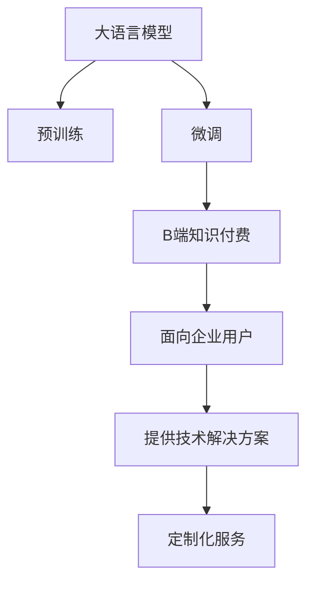

                 

# 程序员知识付费：B端市场的机会

## 1. 背景介绍

### 1.1 问题由来

在当今数字化时代，技术不断革新，程序员的需求和要求也在不断变化。随着技术栈的复杂化、项目要求的日益提高，以及行业内竞争的加剧，越来越多的程序员开始寻求通过知识付费获取技术支持、项目咨询和职业发展的机会。同时，B端市场也正经历着数字化的转型，各类企业对于技术解决方案的需求日益增长。

面对这一趋势，传统以C端用户为主的在线教育和知识付费平台，开始逐步向B端市场拓展，以期获得新的增长点。B端市场相较于C端，有着更大的市场潜力、更稳定的客源和更高的盈利空间。

### 1.2 问题核心关键点

大语言模型微调方法，指在大规模无标签文本数据上预训练的通用语言模型，通过针对特定任务的数据进行微调，使模型能够执行具体的语言处理任务，如自然语言理解、生成、分类等。B端知识付费市场，则是指面向企业级用户提供技术知识、解决方案的在线平台，用户多为企业IT部门、项目团队、技术咨询公司等，对于高技术含量的定制化服务需求较大。

将大语言模型微调方法与B端知识付费结合，一方面可以解决企业对于特定技术问题难以独立解决的痛点，另一方面也可以为程序员提供一个新的、更稳定和高效的收入渠道。

### 1.3 问题研究意义

本文聚焦于程序员知识付费与大语言模型微调在B端市场应用的结合，分析其市场潜力、可行性，并提出具体的商业模式和实施策略。研究具有以下意义：

1. **开拓市场空间**：大语言模型微调和B端知识付费的结合，开辟了新的业务方向，为技术知识付费市场带来新的增长点。
2. **提升服务质量**：通过大语言模型微调，平台能够提供更加高效、专业的技术支持服务，提升用户体验。
3. **优化资源配置**：在B端市场中，知识和资源共享更加高效，可以更好地利用专家和企业的技术资源。
4. **推动技术创新**：该研究结合了大数据、自然语言处理和知识管理等前沿技术，具有前瞻性和创新性。

## 2. 核心概念与联系

### 2.1 核心概念概述

为更好地理解程序员知识付费与大语言模型微调在B端市场的应用，本文将介绍几个关键概念及其联系：

- **大语言模型(Large Language Model, LLM)**：基于自回归或自编码模型，通过大规模无标签文本数据预训练，具备强大的语言处理能力。
- **微调(Fine-tuning)**：在预训练模型的基础上，通过有监督学习优化模型特定任务的能力，如自然语言理解、生成、分类等。
- **B端市场(Business-to-Business, B2B)**：面向企业用户提供技术解决方案和知识付费服务，与C端市场(Customer-to-Business, C2B)相对。
- **知识付费**：指通过在线平台，提供专业知识、技术解决方案的付费服务，以获得稳定收入。
- **自然语言处理(Natural Language Processing, NLP)**：研究如何让计算机理解和处理人类语言的技术。

这些概念之间的逻辑关系可以通过以下Mermaid流程图来展示：



这个流程图展示了大语言模型预训练和微调的过程，以及如何通过B端知识付费平台提供定制化技术支持服务。

## 3. 核心算法原理 & 具体操作步骤

### 3.1 算法原理概述

基于大语言模型微调的B端知识付费方法，其核心思想是通过预训练的语言模型，在特定任务上进行微调，以提供高效、专业的技术解决方案。具体步骤如下：

1. **数据准备**：收集并标注B端市场中的具体任务数据，如企业IT需求、技术咨询问题、项目管理要求等。
2. **模型选择与微调**：选择合适的预训练语言模型，如BERT、GPT系列，通过微调技术，针对特定任务进行优化。
3. **平台搭建**：搭建B端知识付费平台，集成微调后的语言模型，提供API接口，供企业用户调用。
4. **服务提供与迭代**：企业用户通过API调用获取技术解决方案，平台收集反馈，不断优化模型和算法，提升服务质量。

### 3.2 算法步骤详解

以面向企业IT需求的技术支持为例，详细讲解B端知识付费中大语言模型微调的操作步骤：

**Step 1: 数据准备**
- **数据收集**：收集B端市场中的企业IT需求数据，如常见问题、故障排解、技术方案等。
- **数据标注**：对数据进行标注，如问题描述、解决方案、专家推荐等。

**Step 2: 模型选择与微调**
- **模型选择**：选择适合的预训练语言模型，如BERT、GPT系列。
- **微调任务设计**：设计微调任务，如问答、问题分类、故障诊断等。
- **微调流程**：
  1. 使用微调工具（如TensorFlow、PyTorch）搭建模型架构。
  2. 导入预训练模型参数和标注数据。
  3. 设置微调超参数，如学习率、优化器、正则化等。
  4. 执行微调训练，优化模型在特定任务上的表现。

**Step 3: 平台搭建与部署**
- **平台搭建**：搭建知识付费平台，包括用户管理、任务管理、专家管理系统等。
- **模型集成**：将微调后的语言模型集成到平台中，提供API接口，供企业用户调用。
- **部署环境**：选择适合的部署环境，如云服务器、私有云、边缘计算等，确保模型性能和安全性。

**Step 4: 服务提供与迭代**
- **API接口**：企业用户通过API接口提交技术需求，获取推荐问题和解决方案。
- **反馈收集**：收集企业用户对推荐结果的反馈，进行数据分析。
- **模型迭代**：根据用户反馈和需求变化，不断优化微调模型和算法。

### 3.3 算法优缺点

大语言模型微调结合B端知识付费的方法，具有以下优点：

1. **高效性**：预训练模型在大规模文本数据上预训练，能够在短时间内完成微调任务。
2. **泛化能力强**：预训练模型具备较强的泛化能力，能够适应不同的企业需求。
3. **服务稳定**：通过API接口提供服务，能够保障服务稳定性和可扩展性。

同时，也存在一些缺点：

1. **数据质量要求高**：B端市场对数据质量和标注准确性要求较高，需要花费大量时间和精力进行数据处理。
2. **技术复杂度**：微调和平台搭建需要较高的技术门槛，需要专业知识丰富的团队支持。
3. **定制化程度低**：微调模型虽然可以应对常见的技术问题，但对于特定企业的复杂需求，可能需要人工干预和专家指导。

### 3.4 算法应用领域

基于大语言模型微调的B端知识付费方法，在以下领域有着广泛的应用前景：

1. **企业IT支持**：为企业的IT部门提供常见问题解答、故障排解、技术方案推荐等服务。
2. **项目管理咨询**：为企业项目团队提供项目管理工具、资源配置建议、进度跟踪等服务。
3. **技术咨询与培训**：为企业的技术咨询部门提供技术方案、系统架构、培训服务。
4. **数据分析与可视化**：为企业的业务部门提供数据分析工具、数据可视化服务。

## 4. 数学模型和公式 & 详细讲解  
### 4.1 数学模型构建

设企业IT需求数据集为 $D=\{(x_i,y_i)\}_{i=1}^N, x_i$ 为需求描述，$y_i$ 为解决方案。假设使用预训练模型 $M_{\theta}$，微调后的模型为 $M_{\hat{\theta}}$。

定义损失函数为交叉熵损失函数：

$$
\ell(M_{\hat{\theta}}(x_i),y_i) = -[y_i\log M_{\hat{\theta}}(x_i) + (1-y_i)\log (1-M_{\hat{\theta}}(x_i))]
$$

在数据集 $D$ 上，经验风险为：

$$
\mathcal{L}(\theta) = \frac{1}{N} \sum_{i=1}^N \ell(M_{\hat{\theta}}(x_i),y_i)
$$

微调的目标是最小化经验风险，即：

$$
\hat{\theta}=\mathop{\arg\min}_{\theta} \mathcal{L}(\theta)
$$

### 4.2 公式推导过程

以问答系统为例，推导微调模型的损失函数：

1. **数据表示**：将企业IT需求 $x_i$ 表示为向量 $x_i \in \mathbb{R}^d$。
2. **解决方案预测**：使用微调后的模型 $M_{\hat{\theta}}$ 预测每个需求对应的解决方案 $y_i$。
3. **损失函数**：使用交叉熵损失函数衡量预测结果与真实标签之间的差异。

具体公式推导如下：

$$
\mathcal{L}(\theta) = \frac{1}{N}\sum_{i=1}^N \ell(M_{\hat{\theta}}(x_i),y_i)
$$

其中：

$$
\ell(M_{\hat{\theta}}(x_i),y_i) = -[y_i\log M_{\hat{\theta}}(x_i) + (1-y_i)\log (1-M_{\hat{\theta}}(x_i))]
$$

通过反向传播算法计算梯度，更新模型参数 $\theta$，最小化损失函数 $\mathcal{L}(\theta)$。

### 4.3 案例分析与讲解

假设某企业的IT需求数据集 $D$ 如下：

| 需求描述 | 解决方案 |
| --- | --- |
| 服务器故障 | 重启服务器 |
| 数据库错误 | 检查配置 |
| 网络中断 | 检查线路 |

选择预训练模型 $M_{\theta}$ 和微调任务，进行模型微调。

**Step 1: 数据准备**

- **数据收集**：收集企业IT需求数据。
- **数据标注**：将需求描述和解决方案标注为向量形式，如 $x_i=[1,0,1,0]$，表示“服务器故障”，解决方案向量 $y_i=[0,1,0,0]$。

**Step 2: 模型选择与微调**

- **模型选择**：选择BERT作为预训练模型。
- **微调任务**：设计问答任务，模型输出为需求描述对应的解决方案。
- **微调流程**：
  1. 搭建模型架构。
  2. 导入预训练模型参数和标注数据。
  3. 设置微调超参数，如学习率、优化器、正则化等。
  4. 执行微调训练，更新模型参数 $\theta$。

**Step 3: 平台搭建与部署**

- **平台搭建**：搭建知识付费平台，包括用户管理、任务管理、专家管理系统等。
- **模型集成**：将微调后的BERT模型集成到平台中，提供API接口。
- **部署环境**：选择适合的部署环境，如云服务器、私有云、边缘计算等。

**Step 4: 服务提供与迭代**

- **API接口**：企业用户通过API接口提交技术需求，获取推荐问题和解决方案。
- **反馈收集**：收集企业用户对推荐结果的反馈，进行数据分析。
- **模型迭代**：根据用户反馈和需求变化，不断优化微调模型和算法。

## 5. 项目实践：代码实例和详细解释说明
### 5.1 开发环境搭建

在进行B端知识付费项目实践前，需要准备好开发环境。以下是使用Python进行PyTorch开发的环境配置流程：

1. 安装Anaconda：从官网下载并安装Anaconda，用于创建独立的Python环境。

2. 创建并激活虚拟环境：
```bash
conda create -n pytorch-env python=3.8 
conda activate pytorch-env
```

3. 安装PyTorch：根据CUDA版本，从官网获取对应的安装命令。例如：
```bash
conda install pytorch torchvision torchaudio cudatoolkit=11.1 -c pytorch -c conda-forge
```

4. 安装Transformers库：
```bash
pip install transformers
```

5. 安装各类工具包：
```bash
pip install numpy pandas scikit-learn matplotlib tqdm jupyter notebook ipython
```

完成上述步骤后，即可在`pytorch-env`环境中开始项目实践。

### 5.2 源代码详细实现

下面以面向企业IT需求的技术支持为例，给出使用Transformers库对BERT模型进行微调的PyTorch代码实现。

首先，定义IT需求数据处理函数：

```python
from transformers import BertTokenizer
from torch.utils.data import Dataset
import torch

class ITDataset(Dataset):
    def __init__(self, texts, labels, tokenizer, max_len=128):
        self.texts = texts
        self.labels = labels
        self.tokenizer = tokenizer
        self.max_len = max_len
        
    def __len__(self):
        return len(self.texts)
    
    def __getitem__(self, item):
        text = self.texts[item]
        label = self.labels[item]
        
        encoding = self.tokenizer(text, return_tensors='pt', max_length=self.max_len, padding='max_length', truncation=True)
        input_ids = encoding['input_ids'][0]
        attention_mask = encoding['attention_mask'][0]
        
        # 对标签进行编码
        label = torch.tensor(label, dtype=torch.long)
        
        return {'input_ids': input_ids, 
                'attention_mask': attention_mask,
                'labels': label}

# 标签与id的映射
label2id = {'重启服务器': 0, '检查配置': 1, '检查线路': 2}
id2label = {v: k for k, v in label2id.items()}

# 创建dataset
tokenizer = BertTokenizer.from_pretrained('bert-base-cased')

train_dataset = ITDataset(train_texts, train_labels, tokenizer)
dev_dataset = ITDataset(dev_texts, dev_labels, tokenizer)
test_dataset = ITDataset(test_texts, test_labels, tokenizer)
```

然后，定义模型和优化器：

```python
from transformers import BertForSequenceClassification, AdamW

model = BertForSequenceClassification.from_pretrained('bert-base-cased', num_labels=len(label2id))

optimizer = AdamW(model.parameters(), lr=2e-5)
```

接着，定义训练和评估函数：

```python
from torch.utils.data import DataLoader
from tqdm import tqdm
from sklearn.metrics import classification_report

device = torch.device('cuda') if torch.cuda.is_available() else torch.device('cpu')
model.to(device)

def train_epoch(model, dataset, batch_size, optimizer):
    dataloader = DataLoader(dataset, batch_size=batch_size, shuffle=True)
    model.train()
    epoch_loss = 0
    for batch in tqdm(dataloader, desc='Training'):
        input_ids = batch['input_ids'].to(device)
        attention_mask = batch['attention_mask'].to(device)
        labels = batch['labels'].to(device)
        model.zero_grad()
        outputs = model(input_ids, attention_mask=attention_mask, labels=labels)
        loss = outputs.loss
        epoch_loss += loss.item()
        loss.backward()
        optimizer.step()
    return epoch_loss / len(dataloader)

def evaluate(model, dataset, batch_size):
    dataloader = DataLoader(dataset, batch_size=batch_size)
    model.eval()
    preds, labels = [], []
    with torch.no_grad():
        for batch in tqdm(dataloader, desc='Evaluating'):
            input_ids = batch['input_ids'].to(device)
            attention_mask = batch['attention_mask'].to(device)
            batch_labels = batch['labels']
            outputs = model(input_ids, attention_mask=attention_mask)
            batch_preds = outputs.logits.argmax(dim=2).to('cpu').tolist()
            batch_labels = batch_labels.to('cpu').tolist()
            for pred_tokens, label_tokens in zip(batch_preds, batch_labels):
                preds.append(pred_tokens[:len(label_tokens)])
                labels.append(label_tokens)
                
    print(classification_report(labels, preds))
```

最后，启动训练流程并在测试集上评估：

```python
epochs = 5
batch_size = 16

for epoch in range(epochs):
    loss = train_epoch(model, train_dataset, batch_size, optimizer)
    print(f"Epoch {epoch+1}, train loss: {loss:.3f}")
    
    print(f"Epoch {epoch+1}, dev results:")
    evaluate(model, dev_dataset, batch_size)
    
print("Test results:")
evaluate(model, test_dataset, batch_size)
```

以上就是使用PyTorch对BERT进行企业IT需求技术支持微调的完整代码实现。可以看到，得益于Transformers库的强大封装，我们可以用相对简洁的代码完成BERT模型的加载和微调。

### 5.3 代码解读与分析

让我们再详细解读一下关键代码的实现细节：

**ITDataset类**：
- `__init__`方法：初始化文本、标签、分词器等关键组件。
- `__len__`方法：返回数据集的样本数量。
- `__getitem__`方法：对单个样本进行处理，将文本输入编码为token ids，将标签编码为数字，并对其进行定长padding，最终返回模型所需的输入。

**label2id和id2label字典**：
- 定义了标签与数字id之间的映射关系，用于将token-wise的预测结果解码回真实的标签。

**训练和评估函数**：
- 使用PyTorch的DataLoader对数据集进行批次化加载，供模型训练和推理使用。
- 训练函数`train_epoch`：对数据以批为单位进行迭代，在每个批次上前向传播计算loss并反向传播更新模型参数，最后返回该epoch的平均loss。
- 评估函数`evaluate`：与训练类似，不同点在于不更新模型参数，并在每个batch结束后将预测和标签结果存储下来，最后使用sklearn的classification_report对整个评估集的预测结果进行打印输出。

**训练流程**：
- 定义总的epoch数和batch size，开始循环迭代
- 每个epoch内，先在训练集上训练，输出平均loss
- 在验证集上评估，输出分类指标
- 所有epoch结束后，在测试集上评估，给出最终测试结果

可以看到，PyTorch配合Transformers库使得BERT微调的代码实现变得简洁高效。开发者可以将更多精力放在数据处理、模型改进等高层逻辑上，而不必过多关注底层的实现细节。

当然，工业级的系统实现还需考虑更多因素，如模型的保存和部署、超参数的自动搜索、更灵活的任务适配层等。但核心的微调范式基本与此类似。

## 6. 实际应用场景
### 6.1 智能客服系统

基于大语言模型微调的对话技术，可以广泛应用于智能客服系统的构建。传统客服往往需要配备大量人力，高峰期响应缓慢，且一致性和专业性难以保证。而使用微调后的对话模型，可以7x24小时不间断服务，快速响应客户咨询，用自然流畅的语言解答各类常见问题。

在技术实现上，可以收集企业内部的历史客服对话记录，将问题和最佳答复构建成监督数据，在此基础上对预训练对话模型进行微调。微调后的对话模型能够自动理解用户意图，匹配最合适的答案模板进行回复。对于客户提出的新问题，还可以接入检索系统实时搜索相关内容，动态组织生成回答。如此构建的智能客服系统，能大幅提升客户咨询体验和问题解决效率。

### 6.2 金融舆情监测

金融机构需要实时监测市场舆论动向，以便及时应对负面信息传播，规避金融风险。传统的人工监测方式成本高、效率低，难以应对网络时代海量信息爆发的挑战。基于大语言模型微调的文本分类和情感分析技术，为金融舆情监测提供了新的解决方案。

具体而言，可以收集金融领域相关的新闻、报道、评论等文本数据，并对其进行主题标注和情感标注。在此基础上对预训练语言模型进行微调，使其能够自动判断文本属于何种主题，情感倾向是正面、中性还是负面。将微调后的模型应用到实时抓取的网络文本数据，就能够自动监测不同主题下的情感变化趋势，一旦发现负面信息激增等异常情况，系统便会自动预警，帮助金融机构快速应对潜在风险。

### 6.3 个性化推荐系统

当前的推荐系统往往只依赖用户的历史行为数据进行物品推荐，无法深入理解用户的真实兴趣偏好。基于大语言模型微调技术，个性化推荐系统可以更好地挖掘用户行为背后的语义信息，从而提供更精准、多样的推荐内容。

在实践中，可以收集用户浏览、点击、评论、分享等行为数据，提取和用户交互的物品标题、描述、标签等文本内容。将文本内容作为模型输入，用户的后续行为（如是否点击、购买等）作为监督信号，在此基础上微调预训练语言模型。微调后的模型能够从文本内容中准确把握用户的兴趣点。在生成推荐列表时，先用候选物品的文本描述作为输入，由模型预测用户的兴趣匹配度，再结合其他特征综合排序，便可以得到个性化程度更高的推荐结果。

### 6.4 未来应用展望

随着大语言模型微调技术的发展，其应用范围和深度将不断扩展。未来，在以下几个领域将有望获得更多的应用：

1. **医疗健康**：基于微调的医疗问答、病历分析、药物研发等应用将提升医疗服务的智能化水平，辅助医生诊疗，加速新药开发进程。
2. **智能制造**：基于微调的工业物联网、机器人控制等技术，将提升智能制造的效率和质量。
3. **教育培训**：微调技术可应用于在线教育、智能辅导、课程推荐等，因材施教，促进教育公平，提高教学质量。
4. **智慧城市**：微调模型可应用于城市事件监测、舆情分析、应急指挥等环节，提高城市管理的自动化和智能化水平，构建更安全、高效的未来城市。

此外，在企业生产、社会治理、文娱传媒等众多领域，基于大语言模型微调的人工智能应用也将不断涌现，为经济社会发展注入新的动力。

## 7. 工具和资源推荐
### 7.1 学习资源推荐

为了帮助开发者系统掌握大语言模型微调的理论基础和实践技巧，这里推荐一些优质的学习资源：

1. **《Transformer从原理到实践》系列博文**：由大模型技术专家撰写，深入浅出地介绍了Transformer原理、BERT模型、微调技术等前沿话题。
2. **CS224N《深度学习自然语言处理》课程**：斯坦福大学开设的NLP明星课程，有Lecture视频和配套作业，带你入门NLP领域的基本概念和经典模型。
3. **《Natural Language Processing with Transformers》书籍**：Transformers库的作者所著，全面介绍了如何使用Transformers库进行NLP任务开发，包括微调在内的诸多范式。
4. **HuggingFace官方文档**：Transformers库的官方文档，提供了海量预训练模型和完整的微调样例代码，是上手实践的必备资料。
5. **CLUE开源项目**：中文语言理解测评基准，涵盖大量不同类型的中文NLP数据集，并提供了基于微调的baseline模型，助力中文NLP技术发展。

通过对这些资源的学习实践，相信你一定能够快速掌握大语言模型微调的精髓，并用于解决实际的NLP问题。
###  7.2 开发工具推荐

高效的开发离不开优秀的工具支持。以下是几款用于大语言模型微调开发的常用工具：

1. **PyTorch**：基于Python的开源深度学习框架，灵活动态的计算图，适合快速迭代研究。大部分预训练语言模型都有PyTorch版本的实现。
2. **TensorFlow**：由Google主导开发的开源深度学习框架，生产部署方便，适合大规模工程应用。同样有丰富的预训练语言模型资源。
3. **Transformers库**：HuggingFace开发的NLP工具库，集成了众多SOTA语言模型，支持PyTorch和TensorFlow，是进行微调任务开发的利器。
4. **Weights & Biases**：模型训练的实验跟踪工具，可以记录和可视化模型训练过程中的各项指标，方便对比和调优。与主流深度学习框架无缝集成。
5. **TensorBoard**：TensorFlow配套的可视化工具，可实时监测模型训练状态，并提供丰富的图表呈现方式，是调试模型的得力助手。
6. **Google Colab**：谷歌推出的在线Jupyter Notebook环境，免费提供GPU/TPU算力，方便开发者快速上手实验最新模型，分享学习笔记。

合理利用这些工具，可以显著提升大语言模型微调任务的开发效率，加快创新迭代的步伐。

### 7.3 相关论文推荐

大语言模型和微调技术的发展源于学界的持续研究。以下是几篇奠基性的相关论文，推荐阅读：

1. **Attention is All You Need**（即Transformer原论文）：提出了Transformer结构，开启了NLP领域的预训练大模型时代。
2. **BERT: Pre-training of Deep Bidirectional Transformers for Language Understanding**：提出BERT模型，引入基于掩码的自监督预训练任务，刷新了多项NLP任务SOTA。
3. **Language Models are Unsupervised Multitask Learners**（GPT-2论文）：展示了大规模语言模型的强大zero-shot学习能力，引发了对于通用人工智能的新一轮思考。
4. **Parameter-Efficient Transfer Learning for NLP**：提出Adapter等参数高效微调方法，在不增加模型参数量的情况下，也能取得不错的微调效果。
5. **Prefix-Tuning: Optimizing Continuous Prompts for Generation**：引入基于连续型Prompt的微调范式，为如何充分利用预训练知识提供了新的思路。
6. **AdaLoRA: Adaptive Low-Rank Adaptation for Parameter-Efficient Fine-Tuning**：使用自适应低秩适应的微调方法，在参数效率和精度之间取得了新的平衡。

这些论文代表了大语言模型微调技术的发展脉络。通过学习这些前沿成果，可以帮助研究者把握学科前进方向，激发更多的创新灵感。

## 8. 总结：未来发展趋势与挑战

### 8.1 总结

本文对程序员知识付费与大语言模型微调在B端市场的应用进行了全面系统的介绍。首先阐述了程序员知识付费和B端市场的背景和意义，明确了微调在拓展预训练模型应用、提升下游任务性能方面的独特价值。其次，从原理到实践，详细讲解了微调的数学原理和关键步骤，给出了微调任务开发的完整代码实例。同时，本文还广泛探讨了微调方法在智能客服、金融舆情、个性化推荐等多个行业领域的应用前景，展示了微调范式的巨大潜力。此外，本文精选了微调技术的各类学习资源，力求为读者提供全方位的技术指引。

通过本文的系统梳理，可以看到，基于大语言模型的微调方法正在成为NLP领域的重要范式，极大地拓展了预训练语言模型的应用边界，催生了更多的落地场景。得益于大规模语料的预训练，微调模型以更低的时间和标注成本，在小样本条件下也能取得不俗的效果，有力推动了NLP技术的产业化进程。未来，伴随预训练语言模型和微调方法的持续演进，相信NLP技术将在更广阔的应用领域大放异彩，深刻影响人类的生产生活方式。

### 8.2 未来发展趋势

展望未来，大语言模型微调技术将呈现以下几个发展趋势：

1. **模型规模持续增大**：随着算力成本的下降和数据规模的扩张，预训练语言模型的参数量还将持续增长。超大规模语言模型蕴含的丰富语言知识，有望支撑更加复杂多变的下游任务微调。
2. **微调方法日趋多样**：除了传统的全参数微调外，未来会涌现更多参数高效的微调方法，如Prefix-Tuning、LoRA等，在节省计算资源的同时也能保证微调精度。
3. **持续学习成为常态**：随着数据分布的不断变化，微调模型也需要持续学习新知识以保持性能。如何在不遗忘原有知识的同时，高效吸收新样本信息，将成为重要的研究课题。
4. **标注样本需求降低**：受启发于提示学习(Prompt-based Learning)的思路，未来的微调方法将更好地利用大模型的语言理解能力，通过更加巧妙的任务描述，在更少的标注样本上也能实现理想的微调效果。
5. **多模态微调崛起**：当前的微调主要聚焦于纯文本数据，未来会进一步拓展到图像、视频、语音等多模态数据微调。多模态信息的融合，将显著提升语言模型对现实世界的理解和建模能力。
6. **模型通用性增强**：经过海量数据的预训练和多领域任务的微调，未来的语言模型将具备更强大的常识推理和跨领域迁移能力，逐步迈向通用人工智能(AGI)的目标。

以上趋势凸显了大语言模型微调技术的广阔前景。这些方向的探索发展，必将进一步提升NLP系统的性能和应用范围，为人类认知智能的进化带来深远影响。

### 8.3 面临的挑战

尽管大语言模型微调技术已经取得了瞩目成就，但在迈向更加智能化、普适化应用的过程中，它仍面临着诸多挑战：

1. **标注成本瓶颈**：B端市场对数据质量和标注准确性要求较高，需要花费大量时间和精力进行数据处理。如何进一步降低微调对标注样本的依赖，将是一大难题。
2. **模型鲁棒性不足**：当前微调模型面对域外数据时，泛化性能往往大打折扣。对于测试样本的微小扰动，微调模型的预测也容易发生波动。如何提高微调模型的鲁棒性，避免灾难性遗忘，还需要更多理论和实践的积累。
3. **推理效率有待提高**：大规模语言模型虽然精度高，但在实际部署时往往面临推理速度慢、内存占用大等效率问题。如何在保证性能的同时，简化模型结构，提升推理速度，优化资源占用，将是重要的优化方向。
4. **可解释性亟需加强**：当前微调模型更像是"黑盒"系统，难以解释其内部工作机制和决策逻辑。对于医疗、金融等高风险应用，算法的可解释性和可审计性尤为重要。如何赋予微调模型更强的可解释性，将是亟待攻克的难题。
5. **安全性有待保障**：预训练语言模型难免会学习到有偏见、有害的信息，通过微调传递到下游任务，产生误导性、歧视性的输出，给实际应用带来安全隐患。如何从数据和算法层面消除模型偏见，避免恶意用途，确保输出的安全性，也将是重要的研究课题。
6. **知识整合能力不足**：现有的微调模型往往局限于任务内数据，难以灵活吸收和运用更广泛的先验知识。如何让微调过程更好地与外部知识库、规则库等专家知识结合，形成更加全面、准确的信息整合能力，还有很大的想象空间。

正视微调面临的这些挑战，积极应对并寻求突破，将是大语言模型微调走向成熟的必由之路。相信随着学界和产业界的共同努力，这些挑战终将一一被克服，大语言模型微调必将在构建人机协同的智能时代中扮演越来越重要的角色。

### 8.4 未来突破

面对大语言模型微调所面临的种种挑战，未来的研究需要在以下几个方面寻求新的突破：

1. **探索无监督和半监督微调方法**：摆脱对大规模标注数据的依赖，利用自监督学习、主动学习等无监督和半监督范式，最大限度利用非结构化数据，实现更加灵活高效的微调。
2. **研究参数高效和计算高效的微调范式**：开发更加参数高效的微调方法，在固定大部分预训练参数的同时，只更新极少量的任务相关参数。同时优化微调模型的计算图，减少前向传播和反向传播的资源消耗，实现更加轻量级、实时性的部署。
3. **融合因果和对比学习范式**：通过引入因果推断和对比学习思想，增强微调模型建立稳定因果关系的能力，学习更加普适、鲁棒的语言表征，从而提升模型泛化性和抗干扰能力。
4. **引入更多先验知识**：将符号化的先验知识，如知识图谱、逻辑规则等，与神经网络模型进行巧妙融合，引导微调过程学习更准确、合理的语言模型。同时加强不同模态数据的整合，实现视觉、语音等多模态信息与文本信息的协同建模。
5. **结合因果分析和博弈论工具**：将因果分析方法引入微调模型，识别出模型决策的关键特征，增强输出解释的因果性和逻辑性。借助博弈论工具刻画人机交互过程，主动探索并规避模型的脆弱点，提高系统稳定性。
6. **纳入伦理道德约束**：在模型训练目标中引入伦理导向的评估指标，过滤和惩罚有偏见、有害的输出倾向。同时加强人工干预和审核，建立模型行为的监管机制，确保输出符合人类价值观和伦理道德。

这些研究方向的探索，必将引领大语言模型微调技术迈向更高的台阶，为构建安全、可靠、可解释、可控的智能系统铺平道路。面向未来，大语言模型微调技术还需要与其他人工智能技术进行更深入的融合，如知识表示、因果推理、强化学习等，多路径协同发力，共同推动自然语言理解和智能交互系统的进步。只有勇于创新、敢于突破，才能不断拓展语言模型的边界，让智能技术更好地造福人类社会。

## 9. 附录：常见问题与解答

**Q1：程序员知识付费是否适合所有B端市场？**

A: 程序员知识付费在面向企业级用户提供技术支持、项目咨询和职业发展的服务时，有着广泛的应用前景。但并非所有B端市场都适合，尤其是对数据质量和标注准确性要求极高的行业，如金融、医疗等，可能需要进行更深入的定制化开发和验证。

**Q2：微调过程中如何选择合适的学习率？**

A: 微调的学习率一般要比预训练时小1-2个数量级，如果使用过大的学习率，容易破坏预训练权重，导致过拟合。一般建议从1e-5开始调参，逐步减小学习率，直至收敛。也可以使用warmup策略，在开始阶段使用较小的学习率，再逐渐过渡到预设值。

**Q3：采用大模型微调时会面临哪些资源瓶颈？**

A: 当前主流的预训练大模型动辄以亿计的参数规模，对算力、内存、存储都提出了很高的要求。GPU/TPU等高性能设备是必不可少的，但即便如此，超大批次的训练和推理也可能遇到显存不足的问题。因此需要采用一些资源优化技术，如梯度积累、混合精度训练、模型并行等，来突破硬件瓶颈。

**Q4：如何缓解微调过程中的过拟合问题？**

A: 过拟合是微调面临的主要挑战，尤其是在标注数据不足的情况下。常见的缓解策略包括：
1. 数据增强：通过回译、近义替换等方式扩充训练集
2. 正则化：使用L2正则、Dropout、Early Stopping等避免过拟合
3. 对抗训练：引入对抗样本，提高模型鲁棒性
4. 参数高效微调：只调整少量参数(如Adapter、Prefix等)，减小过拟合风险
5. 多模型集成：训练多个微调模型，取平均输出，抑制过拟合

这些策略往往需要根据具体任务和数据特点进行灵活组合。只有在数据、模型、训练、推理等各环节进行全面优化，才能最大限度地发挥大模型微调的威力。

**Q5：微调模型在落地部署时需要注意哪些问题？**

A: 将微调模型转化为实际应用，还需要考虑以下因素：
1. 模型裁剪：去除不必要的层和参数，减小模型尺寸，加快推理速度
2. 量化加速：将浮点模型转为定点模型，压缩存储空间，提高计算效率
3. 服务化封装：将模型封装为标准化服务接口，便于集成调用
4. 弹性伸缩：根据请求流量动态调整资源配置，平衡服务质量和成本
5. 监控告警：实时采集系统指标，设置异常告警阈值，确保服务稳定性
6. 安全防护：采用访问鉴权、数据脱敏等措施，保障数据和模型安全

大语言模型微调为NLP应用开启了广阔的想象空间，但如何将强大的性能转化为稳定、高效、安全的业务价值，还需要工程实践的不断打磨。唯有从数据、算法、工程、业务等多个维度协同发力，才能真正实现人工智能技术在垂直行业的规模化落地。总之，微调需要开发者根据具体任务，不断迭代和优化模型、数据和算法，方能得到理想的效果。

---

作者：禅与计算机程序设计艺术 / Zen and the Art of Computer Programming

