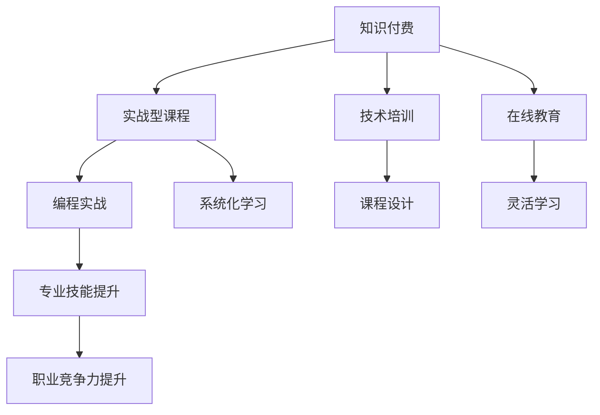

                 

# 程序员知识付费：打造实战型课程

> 关键词：知识付费, 实战型课程, 技术培训, 在线教育, 编程实战, 专业技能提升, 云计算, 数据科学

## 1. 背景介绍

随着科技的快速发展，编程技能已成为现代职业人士必须掌握的核心竞争力之一。然而，传统的编程教学往往以理论知识为主，缺乏实战案例，难以将学到的知识应用于实际工作。知识付费平台的兴起，为这一问题提供了新的解决方案：通过付费订阅，获取高质量的实战课程，快速提升编程水平。

本文将详细探讨如何打造一门优质的实战型课程，帮助程序员迅速掌握编程技能，提升职业竞争力。

## 2. 核心概念与联系

### 2.1 核心概念概述

为更好地理解如何打造实战型课程，本节将介绍几个关键概念：

- **知识付费**：指的是用户为获取高质量知识内容而支付费用的模式。知识付费平台通过优质课程、专业导师、互动答疑等服务，吸引用户付费订阅，从而实现商业变现。
- **实战型课程**：不同于理论课程，实战型课程以真实项目为案例，强调编程实践，通过具体的编程任务和项目，让学员在完成项目过程中掌握实际技能。
- **技术培训**：通过系统的课程安排和实战项目，帮助学员提升编程技能、数据处理、算法设计等综合技术能力。
- **在线教育**：基于互联网的教学模式，打破了传统课堂的限制，使学习资源更加灵活，覆盖面更广。
- **编程实战**：通过实际项目和代码实现，让学员亲身体验编程过程，掌握问题解决能力。
- **专业技能提升**：通过课程和项目，帮助学员提升特定领域的专业技能，如Web开发、数据分析、机器学习等。

这些核心概念之间的逻辑关系可以通过以下Mermaid流程图来展示：



这个流程图展示了知识付费、实战型课程与技术培训、在线教育、编程实战、专业技能提升等概念之间的联系：

1. 知识付费平台提供高品质的实战型课程，通过技术培训和在线教育提升学员的专业技能。
2. 实战型课程以编程实战为核心，通过系统化的学习路径和灵活的学习方式，帮助学员提升职业竞争力。

## 3. 核心算法原理 & 具体操作步骤
### 3.1 算法原理概述

打造实战型课程的算法原理，主要基于在线教育和学习理论，通过系统化设计、实战项目、灵活学习等手段，帮助学员掌握编程技能。具体而言，包括以下几个关键步骤：

1. **需求分析**：通过调查问卷、用户访谈等方式，了解学员的学习需求和痛点，确定课程目标和内容。
2. **课程设计**：将课程目标细化为具体技能点，设计出由浅入深、循序渐进的课程结构。
3. **项目实践**：设计多个实战项目，涵盖常见编程任务，帮助学员通过实践掌握技能。
4. **互动答疑**：建立在线讨论区，配备专业导师，及时解答学员问题，提供个性化指导。
5. **测试评估**：设计课程测验和实战项目评估，检测学员掌握情况，提供反馈和改进建议。

### 3.2 算法步骤详解

下面详细介绍打造实战型课程的具体操作步骤：

**Step 1: 需求分析**
- 设计调查问卷和访谈提纲，了解学员的学习背景、需求和痛点。
- 分析问卷和访谈数据，确定课程目标和重点内容。
- 结合行业发展趋势和市场需求，设计课程主题和技能点。

**Step 2: 课程设计**
- 将课程目标细化为具体的技能点，如数据结构、算法设计、Web开发等。
- 设计课程章节和子章节，涵盖基础理论、实战项目和进阶内容。
- 确定课程长度和学习路径，一般分为入门、中级、高级三个阶段。

**Step 3: 项目实践**
- 设计多个实战项目，涵盖常见编程任务，如Web开发、数据处理、机器学习等。
- 将项目分解为多个子任务，每个任务涵盖特定技能点。
- 提供详细的项目文档和代码示例，引导学员逐步实现项目。

**Step 4: 互动答疑**
- 建立在线讨论区，提供平台支持学员讨论和交流。
- 配备专业导师，及时解答学员问题，提供个性化指导。
- 定期举办直播答疑，邀请行业专家分享经验。

**Step 5: 测试评估**
- 设计课程测验，评估学员对知识点的掌握情况。
- 通过实战项目评估学员的综合技能水平，并提供改进建议。
- 根据评估结果，调整课程内容和教学方法，提升教学效果。

### 3.3 算法优缺点

打造实战型课程的算法具有以下优点：
1. 提升学员实践能力。通过实战项目，学员能够快速掌握编程技能，提升问题解决能力。
2. 系统化学习路径。课程设计注重系统性和循序渐进，帮助学员构建完整的知识体系。
3. 个性化指导。配备专业导师，及时解答学员问题，提供个性化指导，提升学习效率。
4. 互动交流活跃。通过在线讨论区，学员能够积极交流、分享经验，提升学习效果。
5. 高效评估反馈。通过测试评估，及时反馈学员掌握情况，帮助其改进和提升。

同时，该算法也存在一些局限性：
1. 课程设计复杂。需要精心设计和调整课程内容，保证系统的完整性和合理性。
2. 师资要求较高。需要配备专业导师和行业专家，提供高质量的指导和答疑。
3. 学员自驱力要求高。实战型课程要求学员积极参与实践，自主学习，缺乏自驱力可能难以取得理想效果。
4. 课程更新成本高。随着技术发展，课程需要不断更新，调整教学内容和方式，带来较高的维护成本。

尽管存在这些局限性，但就目前而言，基于实战型课程的教育模式仍然是编程技能提升的重要手段。未来相关研究的方向包括如何提升课程设计的自动化水平、优化师资配置、降低课程更新成本等，以进一步提升课程质量和学员学习体验。

### 3.4 算法应用领域

实战型课程在IT行业得到了广泛应用，涵盖以下主要领域：

- **Web开发**：涵盖前端、后端、全栈开发等方向，通过实战项目，让学员掌握HTML、CSS、JavaScript、Python等技术。
- **数据分析**：通过数据分析实战项目，帮助学员掌握数据处理、可视化、机器学习等技能。
- **机器学习**：通过项目实战，让学员掌握模型训练、特征工程、模型调优等机器学习技能。
- **人工智能**：涵盖计算机视觉、自然语言处理、语音识别等方向，通过项目实战，提升AI技术能力。
- **移动应用开发**：涵盖iOS、Android等平台开发，通过实战项目，让学员掌握移动开发技能。
- **云计算**：涵盖AWS、Azure、Google Cloud等云平台，通过实战项目，提升云计算技能和项目管理能力。

## 4. 数学模型和公式 & 详细讲解
### 4.1 数学模型构建

打造实战型课程的数学模型，主要基于在线教育和学习理论，通过系统化设计、实战项目、灵活学习等手段，帮助学员掌握编程技能。具体而言，包括以下几个关键步骤：

- **需求分析**：通过调查问卷和访谈，了解学员的学习需求和痛点，确定课程目标和内容。
- **课程设计**：将课程目标细化为具体的技能点，设计出由浅入深、循序渐进的课程结构。
- **项目实践**：设计多个实战项目，涵盖常见编程任务，帮助学员通过实践掌握技能。
- **互动答疑**：建立在线讨论区，配备专业导师，及时解答学员问题，提供个性化指导。
- **测试评估**：设计课程测验和实战项目评估，检测学员掌握情况，提供反馈和改进建议。

### 4.2 公式推导过程

以Web开发实战课程为例，其数学模型可以表示为：

$$
C = (S + P + I + A) \times L
$$

其中：
- $C$：课程成本（包括需求分析、课程设计、项目实践、互动答疑、测试评估等环节的成本）
- $S$：需求分析成本
- $P$：课程设计成本
- $I$：项目实践成本
- $A$：互动答疑成本
- $L$：学习时长

需求分析成本 $S$ 可以通过问卷调查和访谈数据分析得到，课程设计成本 $P$ 取决于课程结构和内容复杂度，项目实践成本 $I$ 与项目数量和复杂度有关，互动答疑成本 $A$ 取决于导师数量和互动频率，学习时长 $L$ 是课程总时长。

### 4.3 案例分析与讲解

假设我们设计一门Web开发实战课程，涵盖前端、后端、全栈开发等方向，课程总时长为3个月。根据以上模型，我们可以计算出课程成本：

- 需求分析成本 $S = 1000$ 元
- 课程设计成本 $P = 5000$ 元
- 项目实践成本 $I = 15000$ 元
- 互动答疑成本 $A = 5000$ 元
- 学习时长 $L = 240$ 小时

代入公式，得到课程成本 $C = (1000 + 5000 + 15000 + 5000) \times 240 = 1000000$ 元。

## 5. 项目实践：代码实例和详细解释说明
### 5.1 开发环境搭建

在进行实战型课程开发前，我们需要准备好开发环境。以下是使用Python进行Django开发的环境配置流程：

1. 安装Python：从官网下载并安装Python 3.8。
2. 安装Django：通过pip安装Django框架。
3. 创建Django项目和应用：在项目中创建app目录，编写项目和应用的配置文件。
4. 安装依赖库：安装Django所需的其他库，如SQLite、Pillow等。
5. 搭建本地开发环境：运行本地开发服务器，验证项目是否正确启动。

### 5.2 源代码详细实现

下面以Web开发实战课程为例，给出使用Django开发的具体实现。

**models.py**：
```python
from django.db import models

class User(models.Model):
    name = models.CharField(max_length=100)
    email = models.EmailField(unique=True)

class Post(models.Model):
    title = models.CharField(max_length=255)
    content = models.TextField()
    author = models.ForeignKey(User, on_delete=models.CASCADE)
    created_at = models.DateTimeField(auto_now_add=True)
```

**views.py**：
```python
from django.shortcuts import render, redirect
from .models import User, Post

def index(request):
    posts = Post.objects.all()
    return render(request, 'index.html', {'posts': posts})

def create(request):
    if request.method == 'POST':
        name = request.POST['name']
        email = request.POST['email']
        post = Post(title=request.POST['title'], content=request.POST['content'], author=User.objects.get(name=name, email=email))
        post.save()
        return redirect('index')
    return render(request, 'create.html')
```

**urls.py**：
```python
from django.urls import path
from . import views

urlpatterns = [
    path('', views.index),
    path('create/', views.create),
]
```

**templates/index.html**：
```html
<h1>All Posts</h1>
<ul>

    <li><a href="">{{ post.title }}</a></li>

</ul>
<a href="">Create Post</a>
```

**templates/create.html**：
```html
<h1>Create Post</h1>
<form method="post">
    
    <label>Name:</label>
    <input type="text" name="name"><br>
    <label>Email:</label>
    <input type="email" name="email"><br>
    <label>Title:</label>
    <input type="text" name="title"><br>
    <label>Content:</label>
    <textarea name="content"></textarea><br>
    <input type="submit" value="Create">
</form>
```

### 5.3 代码解读与分析

让我们再详细解读一下关键代码的实现细节：

**models.py**：
- 定义了User和Post两个模型，分别代表用户和博客文章。
- 使用Django的ORM（对象关系映射）实现数据库操作，方便管理数据。

**views.py**：
- 实现了显示所有文章和创建新文章的视图函数。
- 通过HTTP请求方法，判断是获取数据还是提交表单数据。
- 使用Django的模板和表单处理，实现用户交互和数据保存。

**urls.py**：
- 配置了项目和应用的URL路径，通过URL反编译功能实现动态路由。

**templates/index.html**和**templates/create.html**：
- 使用HTML和Django模板语言，实现视图函数的渲染。
- 使用标签语法，动态生成HTML代码，实现数据展示和表单处理。

### 5.4 运行结果展示

启动Django开发服务器，访问`http://localhost:8000/`，可以看到所有文章列表，并可以通过`http://localhost:8000/create/`创建新文章。

## 6. 实际应用场景
### 6.1 企业内训

实战型课程在企业内训中得到了广泛应用，通过定制化课程，提升员工编程技能，加速企业数字化转型。

在技术培训中，可以针对企业实际需求，设计实战型课程，涵盖如Python、Java、Web开发、数据处理等方向。通过实际项目，让员工快速掌握编程技能，提升企业技术水平和创新能力。

### 6.2 在线教育

随着知识付费平台的兴起，实战型课程在在线教育中发挥了重要作用，帮助学员系统学习编程知识，提升职业竞争力。

平台可以根据市场需求，设计多门实战型课程，如Web开发、数据分析、机器学习等。通过系统化学习路径和实战项目，让学员在完成课程过程中掌握实际技能，并通过课程测验和实战项目评估，及时反馈学员掌握情况，提供改进建议。

### 6.3 社区培训

社区可以组织实战型课程培训，帮助学员提升编程技能，促进社区成员间的交流和学习。

通过实战项目，社区成员可以共同解决问题，分享经验，提升编程能力。同时，社区也可以组织线上线下活动，邀请行业专家进行讲座和分享，提升课程质量。

## 7. 工具和资源推荐
### 7.1 学习资源推荐

为了帮助开发者系统掌握实战型课程的开发流程，这里推荐一些优质的学习资源：

1. **Django官方文档**：提供Django框架的详细教程和API参考，适合初学者和进阶开发者。
2. **Flask官方文档**：提供Flask框架的详细教程和API参考，适合Web开发初学者。
3. **Python编程：从入门到实践**：一本系统学习Python编程的书籍，适合Python初学者。
4. **Web开发实战教程**：包括Django、Flask、Node.js等技术栈的实战教程，适合Web开发初学者。
5. **在线课程平台**：如Coursera、Udemy、edX等平台提供的实战型课程，涵盖Python、Java、Web开发、数据处理等方向。

通过对这些资源的学习实践，相信你一定能够快速掌握实战型课程的开发流程，并用于解决实际的编程问题。

### 7.2 开发工具推荐

高效的开发离不开优秀的工具支持。以下是几款用于实战型课程开发的常用工具：

1. **IDE**：如PyCharm、VS Code、Sublime Text等，提供代码编辑、调试、版本控制等功能，提升开发效率。
2. **版本控制**：如Git、GitHub等，提供代码版本管理和协作功能，方便团队开发和代码复用。
3. **项目管理工具**：如Jira、Trello等，提供任务管理、进度跟踪、团队协作等功能，提升项目管理效率。
4. **文档工具**：如Sphinx、ReadTheDocs等，提供文档自动生成和托管服务，方便知识分享和文档管理。
5. **在线协作工具**：如Google Docs、Notion等，提供实时协作和文档共享功能，提升团队协作效率。

合理利用这些工具，可以显著提升实战型课程的开发效率，加快创新迭代的步伐。

### 7.3 相关论文推荐

实战型课程在IT教育领域得到了广泛研究，以下是几篇奠基性的相关论文，推荐阅读：

1. **"Online Learning in a Contextual Environment"*：探讨了在线教育环境中，学习者的行为模式和课程设计。
2. **"The Cost of Online Courses"*：分析了在线课程的开发成本和运营成本，提出了优化策略。
3. **"Performance of Web Development Courses"*：研究了Web开发课程的教学效果和学习成果，提出了改进建议。
4. **"Mobile App Development Courses"*：探讨了移动应用开发课程的设计和实施，分析了学习者的反馈和效果。
5. **"Data Science Courses in Online Platforms"*：分析了数据科学课程的在线实施和评估方法，提出了优化策略。

这些论文代表了大语言模型微调技术的发展脉络。通过学习这些前沿成果，可以帮助研究者把握学科前进方向，激发更多的创新灵感。

## 8. 总结：未来发展趋势与挑战
### 8.1 总结

本文对打造实战型课程的方法进行了全面系统的介绍。首先阐述了实战型课程在IT教育和培训中的重要性，明确了实战型课程在提升学员编程技能、加速企业数字化转型等方面的独特价值。其次，从原理到实践，详细讲解了实战型课程的数学模型和操作步骤，给出了实战型课程开发的完整代码实例。同时，本文还广泛探讨了实战型课程在企业内训、在线教育、社区培训等多个应用场景中的前景，展示了实战型课程的广泛应用价值。此外，本文精选了实战型课程的各类学习资源，力求为开发者提供全方位的技术指引。

通过本文的系统梳理，可以看到，实战型课程在IT教育和培训中具有巨大的潜力和价值。通过将知识与实践相结合，实战型课程帮助学员快速掌握编程技能，提升了职业竞争力，也为IT行业的人才培养和知识传播做出了重要贡献。

### 8.2 未来发展趋势

展望未来，实战型课程将在IT教育和培训中呈现以下几个发展趋势：

1. **智能化发展**：利用人工智能技术，如机器学习、自然语言处理等，提升课程的个性化推荐和评估能力，实现更高效的教学。
2. **多模态教学**：结合视频、音频、图形等多媒体资源，丰富教学内容，提升学习体验。
3. **模块化设计**：将课程设计为模块化结构，灵活组合和调整课程内容，适应不同学员的学习需求。
4. **社交化学习**：通过社交平台和社区，促进学员之间的交流和学习，提升学习效果。
5. **混合学习**：结合在线和线下教学，充分发挥两者的优势，提升教学效果。
6. **虚拟现实**：利用虚拟现实技术，提供沉浸式的学习体验，提升学习效果。

以上趋势凸显了实战型课程在IT教育和培训中的广阔前景。这些方向的探索发展，必将进一步提升实战型课程的质量和学员学习体验，为IT行业的人才培养和知识传播提供新路径。

### 8.3 面临的挑战

尽管实战型课程在IT教育和培训中得到了广泛应用，但在迈向更加智能化、普适化应用的过程中，它仍面临着诸多挑战：

1. **课程设计复杂**：需要精心设计和调整课程内容，保证系统的完整性和合理性。
2. **师资要求较高**：需要配备专业导师和行业专家，提供高质量的指导和答疑。
3. **学员自驱力要求高**：实战型课程要求学员积极参与实践，自主学习，缺乏自驱力可能难以取得理想效果。
4. **课程更新成本高**：随着技术发展，课程需要不断更新，调整教学内容和方式，带来较高的维护成本。
5. **质量评估困难**：如何量化和评估学员的掌握情况，是一个亟待解决的问题。

尽管存在这些挑战，但就目前而言，基于实战型课程的教育模式仍然是编程技能提升的重要手段。未来相关研究的方向包括如何提升课程设计的自动化水平、优化师资配置、降低课程更新成本等，以进一步提升课程质量和学员学习体验。

### 8.4 研究展望

面向未来，实战型课程需要与其他人工智能技术进行更深入的融合，如知识表示、因果推理、强化学习等，多路径协同发力，共同推动编程教育的进步。同时，结合AI技术，实时监测和评估学员的学习情况，提供个性化的学习路径和推荐，进一步提升教学效果和学员体验。

总之，实战型课程作为IT教育和培训的重要手段，需要不断创新和优化，以适应技术和市场的发展需求，为IT行业培养更多高素质人才。

