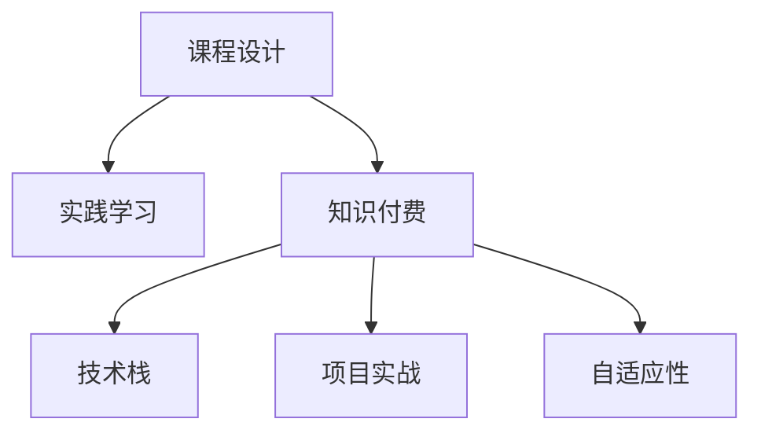

                 

# 程序员知识付费：打造实践型课程

> 关键词：程序员教育, 知识付费, 课程设计, 实践学习, 自学资源, 技能提升, 技术栈

## 1. 背景介绍

### 1.1 问题由来

在数字化时代，软件开发作为核心的生产力工具，其重要性和需求日益增长。然而，技术更新迭代迅速，新手入门门槛高，如何高效、系统地掌握和应用新技术，成为广大开发者的共同挑战。为此，知识付费模式应运而生，通过在线课程、专栏、直播等方式，集中优质资源，帮助开发者掌握最新技术。

然而，当前的很多知识付费内容往往过于理论化，缺乏实战性和互动性，难以真正达到传授技术、解决实际问题的目的。开发者依然难以通过这些课程，实现从入门到精通的系统性提升。

### 1.2 问题核心关键点

针对当前知识付费内容存在的痛点，打造实践型课程的必要性愈发凸显：

- 实用性强：课程设计应以解决实际问题为出发点，内容应与实际工作紧密结合，切实帮助开发者提升技术能力。
- 实战导向：课程应注重实践，提供大量操作性强的项目实战案例，通过项目驱动，训练开发者的动手能力。
- 互动高效：课程应提供及时的互动反馈，如直播答疑、线上讨论、代码评审等，加强课程效果。
- 自适应性：课程设计应具有灵活性，适应不同程度和技术栈的开发者，满足个性化学习需求。
- 可持续性：课程内容应不断更新迭代，紧跟技术发展趋势，持续提供价值。

### 1.3 问题研究意义

1. **提升技能水平**：通过系统学习，开发者可以迅速掌握新技术，提升自身竞争力。
2. **促进职业发展**：高质量的实践课程，帮助开发者实现从初级到高级的转变，助力职业晋升。
3. **降低学习成本**：相比于传统培训机构，知识付费课程更加灵活、经济，节省了时间和金钱成本。
4. **加速行业发展**：通过提升开发者技能，加速技术在各行业的落地应用，推动技术创新和产业升级。

## 2. 核心概念与联系

### 2.1 核心概念概述

为更好地理解实践型课程的建设，本节将介绍几个关键概念：

- **课程设计**：课程设计包括课程目标、内容结构、教学方法等，是决定课程质量的关键。
- **实践学习**：通过实际操作，获得直接的感性经验，有助于理解理论知识。
- **知识付费**：通过付费获取优质课程内容，享受专家指导和个性化服务。
- **技术栈**：指项目所需的各种技术和工具，如编程语言、框架、库等。
- **项目实战**：通过实际项目开发，掌握完整的工作流程和技能。
- **自适应性**：课程应适应不同水平和学习需求，满足个性化学习。

这些概念之间的联系可以通过以下Mermaid流程图来展示：



这个流程图展示了课程设计的各个组成部分及其关系：

1. 课程设计是基础，决定了实践学习的内容和质量。
2. 实践学习是手段，通过实际操作提升技能。
3. 知识付费是方式，通过付费获取优质课程资源。
4. 技术栈和项目实战是目标，通过真实项目掌握技能。
5. 自适应性是灵活性，满足不同开发者的个性化需求。

## 3. 核心算法原理 & 具体操作步骤
### 3.1 算法原理概述

实践型课程的核心算法原理，是通过系统的课程设计和精心设计的项目实践，实现知识的高效传递和技能的高效习得。具体来说，课程设计应包括以下几个步骤：

1. **需求分析**：明确课程目标和受众，确定课程内容和难度。
2. **内容结构设计**：按照由浅入深、循序渐进的原则，组织课程内容。
3. **实践项目设计**：选择真实或模拟的项目，进行项目分解和任务设计。
4. **互动反馈机制**：建立及时的互动反馈机制，如在线答疑、代码评审等。
5. **评估与改进**：通过课程评估和学员反馈，持续改进课程内容和教学方法。

### 3.2 算法步骤详解

以下是实践型课程的详细设计步骤：

**Step 1: 需求分析**
- **确定目标**：明确课程旨在解决的问题，如某个技术栈的开发，某个项目的实现等。
- **了解受众**：分析目标受众的技术水平和学习需求，设计合适的课程内容和难度。
- **市场调研**：调研市场需求和现有课程，寻找差异化的切入点，避免同质化竞争。

**Step 2: 内容结构设计**
- **模块划分**：将课程内容划分为若干模块，每个模块有明确的学习目标和预期结果。
- **内容编排**：按照由浅入深、由简单到复杂的原则，设计课程内容的编排顺序。
- **案例引入**：每个模块引入具体案例，帮助学员理解理论和实现方法。
- **知识融合**：将相关知识融合贯通，避免孤立讲解，提高课程的连贯性和系统性。

**Step 3: 实践项目设计**
- **项目选择**：选择具有代表性的真实项目或模拟项目，分解为若干子任务。
- **任务设计**：设计每个子任务的详细要求和评分标准。
- **实践环境**：搭建实践环境，提供必要的工具和资源，支持学员开发和测试。
- **成果展示**：学员需提交项目成果，进行代码评审和技术讨论。

**Step 4: 互动反馈机制**
- **在线答疑**：定期安排直播答疑，解决学员在学习中遇到的问题。
- **代码评审**：安排导师或高级学员进行代码评审，提供技术指导和反馈。
- **讨论互动**：建立学习群组，鼓励学员之间交流讨论，互相帮助。

**Step 5: 评估与改进**
- **定期测试**：定期进行小测验和项目评审，评估学员学习效果。
- **学员反馈**：收集学员的反馈和建议，用于课程改进。
- **课程更新**：根据市场和技术发展，持续更新课程内容和教学方法。

### 3.3 算法优缺点

实践型课程具有以下优点：
1. **实践性强**：通过实际项目操作，训练学员的动手能力。
2. **效果显著**：系统性学习，循序渐进，有助于提高技能水平。
3. **灵活高效**：可根据学员反馈和学习进度，调整课程内容。
4. **内容丰富**：结合真实项目和模拟案例，提供丰富的学习资源。

同时，该课程也存在一定的局限性：
1. **依赖导师经验**：课程设计需要丰富的实践经验和行业知识，优秀的导师是关键。
2. **课程时间和成本**：课程需要投入大量时间和资源，尤其是导师和助教团队。
3. **技术栈复杂性**：不同技术栈的项目设计需要多维度考虑，难度较大。
4. **学员自律性**：课程设计需结合学员自律性，避免被动学习。

尽管存在这些局限性，但实践型课程仍是大规模开发者系统提升的重要手段。未来相关研究的重点在于如何进一步提高课程的灵活性、互动性和个性化，同时兼顾内容丰富性和实用性。

### 3.4 算法应用领域

实践型课程在软件开发和IT教育领域有着广泛的应用，具体包括：

- **编程语言**：如Python、Java、C++等，通过实际项目训练学员的编程技能。
- **框架和库**：如Django、Vue、React等，通过项目开发训练学员的技术栈。
- **数据库**：如MySQL、MongoDB等，通过项目实践掌握数据库设计和操作。
- **云计算**：如AWS、Azure等，通过项目实战训练云计算和大数据技能。
- **前端开发**：如UI设计、前端框架等，通过实际项目训练UI设计和交互技能。

除了上述这些典型应用外，实践型课程还可拓展到更多场景中，如人工智能、物联网、区块链等新兴技术领域，为开发者的技术栈升级提供全方位的支持。

## 4. 数学模型和公式 & 详细讲解 & 举例说明（备注：数学公式请使用latex格式，latex嵌入文中独立段落使用 $$，段落内使用 $)
### 4.1 数学模型构建

在实践型课程中，数学模型和公式主要用于教学方法的科学设计和课程内容的精确评估。以下是常见的一些数学模型和公式：

**课程评估模型**：
- **目标达成度**：
$$
D = \frac{C}{T}
$$
其中，$D$为目标达成度，$C$为达到目标的次数，$T$为总目标数。

**学习效果评估**：
- **测验成绩**：
$$
S = \frac{1}{N}\sum_{i=1}^{N} s_i
$$
其中，$S$为平均测验成绩，$N$为测验次数，$s_i$为第$i$次测验成绩。

**项目完成度**：
- **完成比例**：
$$
P = \frac{A}{T}
$$
其中，$P$为项目完成比例，$A$为已完成的项目数，$T$为总项目数。

### 4.2 公式推导过程

以下是一些常见数学模型的推导过程：

**目标达成度推导**：
- **定义**：目标达成度$D$表示目标完成的比例。
- **推导**：
$$
D = \frac{C}{T}
$$
其中，$C$为目标达到的次数，$T$为总目标数。通过比值$D$，可以量化目标的完成情况。

**学习效果评估推导**：
- **定义**：平均测验成绩$S$表示学员在多次测验中的平均表现。
- **推导**：
$$
S = \frac{1}{N}\sum_{i=1}^{N} s_i
$$
其中，$s_i$为第$i$次测验成绩，$N$为测验次数。通过求平均值，可以综合评估学员的学习效果。

**项目完成度推导**：
- **定义**：项目完成比例$P$表示学员在项目中的实际完成情况。
- **推导**：
$$
P = \frac{A}{T}
$$
其中，$A$为已完成的项目数，$T$为总项目数。通过比值$P$，可以量化学员的实践能力和工作量。

### 4.3 案例分析与讲解

以Python开发课程为例，进行详细讲解：

**需求分析**：
- **目标**：掌握Python编程技能。
- **受众**：零基础的入门开发者。
- **市场调研**：Python是目前最流行的编程语言之一，学习需求旺盛。

**内容结构设计**：
- **模块划分**：分为基础语法、数据结构、面向对象、Web开发、数据科学等模块。
- **内容编排**：从基础语法开始，逐步深入到数据科学等高级内容。
- **案例引入**：每个模块引入实际项目案例，如Web开发中的Flask框架项目。

**实践项目设计**：
- **项目选择**：选择Flask框架的Web应用开发项目。
- **任务设计**：分解为数据库设计、界面设计、后端开发、测试等子任务。
- **实践环境**：搭建Python开发环境，提供必要的工具和资源。
- **成果展示**：提交项目代码，进行代码评审和技术讨论。

**互动反馈机制**：
- **在线答疑**：定期安排直播答疑，解决学员在学习中遇到的问题。
- **代码评审**：安排导师或高级学员进行代码评审，提供技术指导和反馈。
- **讨论互动**：建立学习群组，鼓励学员之间交流讨论，互相帮助。

**评估与改进**：
- **定期测试**：定期进行小测验和项目评审，评估学员学习效果。
- **学员反馈**：收集学员的反馈和建议，用于课程改进。
- **课程更新**：根据市场和技术发展，持续更新课程内容和教学方法。

## 5. 项目实践：代码实例和详细解释说明
### 5.1 开发环境搭建

在Python开发课程中，需要进行环境搭建：

1. **安装Python**：
   - 下载Python安装包，进行安装。
   - 使用pip安装必要的第三方库，如Django、Flask等。

2. **搭建开发环境**：
   - 创建虚拟环境，防止依赖冲突。
   - 使用IDE（如PyCharm、VS Code等）进行开发。

3. **代码版本管理**：
   - 使用Git进行代码版本管理，便于协作和备份。
   - 搭建Git仓库，进行版本控制。

### 5.2 源代码详细实现

以下是Python开发课程中Web应用开发项目的源代码实现：

**项目需求**：
- 开发一个简单的在线商城，包含商品列表、商品详情、购物车、用户注册和登录等功能。

**项目实现**：
- **数据库设计**：使用SQLite数据库，定义商品表、用户表等。
- **界面设计**：使用HTML/CSS设计前端界面。
- **后端开发**：使用Flask框架实现后端逻辑。
- **测试**：编写测试用例，进行单元测试和功能测试。

**代码示例**：
```python
# 后端代码示例
from flask import Flask, render_template, request, redirect, url_for

app = Flask(__name__)

@app.route('/')
def index():
    return render_template('index.html')

@app.route('/login', methods=['GET', 'POST'])
def login():
    if request.method == 'POST':
        username = request.form['username']
        password = request.form['password']
        if username == 'admin' and password == '123456':
            return redirect(url_for('admin_dashboard'))
        else:
            return 'Invalid username or password'
    return render_template('login.html')

@app.route('/admin')
def admin_dashboard():
    return render_template('admin.html')
```

**代码解读与分析**：
- **Flask框架**：使用Flask框架，实现路由和视图函数。
- **路由**：通过`@app.route`装饰器，定义不同的URL路由。
- **视图函数**：定义路由对应的视图函数，处理HTTP请求。
- **模板渲染**：使用`render_template`函数，渲染HTML模板，展示界面。

**运行结果展示**：
- 在本地运行项目，访问`http://localhost:5000`，可以看到商城主界面。
- 通过登录页面`http://localhost:5000/login`，输入用户名和密码，即可登录到管理员界面`http://localhost:5000/admin`。

## 6. 实际应用场景
### 6.1 软件开发企业

在软件开发企业中，实践型课程可以用于员工的技能提升和项目开发。企业可以通过购买知识付费课程，为员工提供系统的技术培训，提升其编程能力和项目开发水平，加速企业项目的落地和交付。

**应用场景**：
- **员工培训**：定期组织员工参加实践型课程，提升技术能力和工作质量。
- **项目开发**：通过课程实践项目，训练员工的项目开发能力，提升项目交付速度和质量。
- **技术迭代**：根据市场和技术发展，不断更新课程内容，保持企业技术领先。

**实际案例**：
- 某软件开发企业定期组织员工参加Python开发课程，通过实践项目训练，提升了员工的编程能力和项目开发效率，实现了多款应用的顺利上线。

### 6.2 高校计算机专业

在高校计算机专业中，实践型课程可以用于学生的技能训练和就业准备。高校可以通过开设实践型课程，培养学生的编程技能和项目开发能力，提升其就业竞争力。

**应用场景**：
- **课程设计**：根据学生的学习进度和课程需求，设计适合的实践型课程。
- **项目实践**：通过实际项目训练，提升学生的编程能力和项目开发水平。
- **就业指导**：通过项目实战和就业指导，帮助学生顺利进入职场。

**实际案例**：
- 某计算机专业开设了Python开发课程，通过实践项目训练，学生的编程能力和项目开发能力显著提升，多名学生顺利进入知名IT公司。

### 6.3 自学编程爱好者

在自学编程爱好者中，实践型课程可以用于系统学习编程技能和项目开发。自学者可以通过购买知识付费课程，系统学习编程知识和技能，提升其技术水平和项目开发能力。

**应用场景**：
- **系统学习**：通过系统学习编程课程，掌握编程技能和项目开发方法。
- **实践训练**：通过实践项目训练，提升编程能力和项目开发水平。
- **资源获取**：获取高质量的学习资源和实践案例，提升自学效果。

**实际案例**：
- 某自学编程爱好者购买了Python开发课程，通过系统学习编程知识和实践项目训练，掌握了Python编程技能，成功完成了多个个人项目。

### 6.4 未来应用展望

随着知识付费模式的持续发展，实践型课程将在更多领域得到应用，为开发者的技术提升提供全面的支持：

- **跨领域应用**：实践型课程将拓展到更多技术领域，如AI、大数据、区块链等，为开发者的技能升级提供全方位支持。
- **实时更新**：课程内容将持续更新迭代，紧跟技术发展趋势，保持课程的时效性和实用性。
- **国际合作**：与国际知名教育机构和IT企业合作，提升课程质量和国际化水平，促进全球技术交流。
- **可持续发展**：构建开放的知识共享平台，促进知识付费模式的健康发展，实现可持续的行业进步。

## 7. 工具和资源推荐
### 7.1 学习资源推荐

为帮助开发者系统掌握实践型课程的理论基础和实践技巧，这里推荐一些优质的学习资源：

1. **Coursera**：提供大量优秀的计算机科学课程，涵盖编程语言、数据科学、人工智能等多个领域，适合系统学习。
2. **Udacity**：提供实践导向的技术课程，通过项目驱动，训练开发者的动手能力。
3. **edX**：提供来自全球顶尖大学的计算机科学课程，适合深度学习和研究。
4. **Codecademy**：提供互动性强的编程课程，通过在线编程环境，训练开发者的编程技能。
5. **LeetCode**：提供丰富的编程练习题，通过刷题训练，提升开发者的编程能力和算法能力。

这些资源可以帮助开发者系统掌握编程知识和技能，提升项目开发能力。

### 7.2 开发工具推荐

高效的开发离不开优秀的工具支持。以下是几款用于实践型课程开发的常用工具：

1. **Git**：版本控制系统，便于协作和版本控制。
2. **IDE**：集成开发环境，如PyCharm、VS Code等，支持代码编写、调试和测试。
3. **Jupyter Notebook**：交互式编程环境，适合数据分析和机器学习项目。
4. **Docker**：容器化技术，便于项目部署和运行。
5. **Kubernetes**：容器编排工具，支持大规模集群管理和部署。

合理利用这些工具，可以显著提升开发效率，加速项目开发和部署。

### 7.3 相关论文推荐

知识付费和实践型课程的发展，离不开学界的持续研究。以下是几篇奠基性的相关论文，推荐阅读：

1. **Knowledge is Power: The Impact of Paid Online Learning on Student Outcomes**：研究知识付费对学生学习效果的影响。
2. **Effective Teaching Strategies for Online Courses**：探讨在线课程的有效教学策略，提升课程质量。
3. **The Future of Online Learning: Trends, Challenges, and Opportunities**：分析在线学习的发展趋势和挑战，展望未来方向。
4. **Designing Effective Online Learning Experiences**：介绍在线学习的设计原则和最佳实践，提升课程设计质量。
5. **Engaging Students in Online Learning**：研究如何提高学生的在线学习参与度，提升课程效果。

这些论文代表了大语言模型微调技术的发展脉络。通过学习这些前沿成果，可以帮助研究者把握学科前进方向，激发更多的创新灵感。

## 8. 总结：未来发展趋势与挑战
### 8.1 总结

本文对知识付费和实践型课程进行了全面系统的介绍。首先阐述了知识付费和实践型课程的研究背景和意义，明确了课程设计和项目实践的核心价值。其次，从原理到实践，详细讲解了实践型课程的数学模型和关键步骤，给出了实践型课程的完整代码实例。同时，本文还广泛探讨了课程在软件开发、高等教育、自学编程等领域的应用前景，展示了实践型课程的巨大潜力。此外，本文精选了课程设计的各类学习资源，力求为读者提供全方位的技术指引。

通过本文的系统梳理，可以看到，知识付费和实践型课程在大规模开发者系统提升中的重要作用。开发者通过系统学习编程知识和实践项目训练，可以显著提升技术能力和项目开发水平，实现从入门到精通的系统性提升。未来，伴随知识付费模式的不断发展，实践型课程必将在更多领域得到应用，为开发者的技术进步提供全方位的支持。

### 8.2 未来发展趋势

展望未来，实践型课程将呈现以下几个发展趋势：

1. **个性化学习**：结合人工智能和大数据技术，实现个性化学习路径，满足不同开发者的学习需求。
2. **互动性增强**：通过虚拟现实、增强现实等技术，提升课程的互动性和沉浸式体验。
3. **多模态融合**：结合视频、音频、文本等多种模态，提升课程的丰富性和生动性。
4. **国际化和本地化**：根据不同国家和地区的教育特点，进行课程的本地化设计和国际化拓展。
5. **开放共享**：构建开放的知识共享平台，促进知识付费模式的健康发展，实现可持续的行业进步。

以上趋势凸显了实践型课程的广阔前景。这些方向的探索发展，必将进一步提升开发者技能提升的效果，推动技术在各行业的落地应用，实现技术的普惠和进步。

### 8.3 面临的挑战

尽管实践型课程已经取得了瞩目成就，但在迈向更加智能化、普适化应用的过程中，它仍面临着诸多挑战：

1. **课程设计复杂性**：课程设计需要丰富的行业经验和教学方法，需要大量时间和资源。
2. **课程质量保障**：课程内容需要不断更新迭代，保持时效性和实用性，需要持续投入。
3. **学员自律性**：需要依赖学员自律性，避免被动学习，需要提供更多激励机制。
4. **技术栈多样性**：不同技术栈的课程设计需要多维度考虑，难度较大。
5. **互动反馈不足**：课程互动反馈不足，需要建立及时的互动反馈机制。

尽管存在这些挑战，但通过不断优化和改进，课程设计和技术体系将更加完善，满足不同开发者的学习需求。

### 8.4 研究展望

面向未来，实践型课程需要在以下几个方面寻求新的突破：

1. **个性化学习路径**：结合人工智能和大数据技术，实现个性化学习路径，满足不同开发者的学习需求。
2. **互动性增强**：通过虚拟现实、增强现实等技术，提升课程的互动性和沉浸式体验。
3. **多模态融合**：结合视频、音频、文本等多种模态，提升课程的丰富性和生动性。
4. **国际化和本地化**：根据不同国家和地区的教育特点，进行课程的本地化设计和国际化拓展。
5. **开放共享**：构建开放的知识共享平台，促进知识付费模式的健康发展，实现可持续的行业进步。

这些研究方向的探索，必将引领实践型课程迈向更高的台阶，为开发者提供全方位的技术提升支持，推动技术的普惠和进步。

## 9. 附录：常见问题与解答

**Q1：如何选择合适的实践型课程？**

A: 选择合适的实践型课程需要考虑以下几个因素：
- **目标匹配**：课程目标与自身需求是否匹配，是否能够解决实际问题。
- **内容深度**：课程内容的深度和广度，是否能够覆盖技术栈和项目需求。
- **互动性**：课程的互动性如何，是否提供及时的答疑和反馈。
- **学习资源**：课程提供的学习资源是否丰富，是否包含实战案例和案例讲解。
- **评价反馈**：查看课程的评价和反馈，了解学员的学习体验和效果。

**Q2：如何进行实践型课程的个性化设计？**

A: 进行个性化设计需要考虑以下几个方面：
- **学员调研**：了解学员的技术水平和学习需求，设计适合的学习路径和难度。
- **任务分解**：将课程内容分解为多个子任务，每个任务都有明确的目标和评分标准。
- **灵活调整**：根据学员的学习进度和反馈，灵活调整课程内容和教学方法。
- **激励机制**：设计激励机制，如奖励和表彰，鼓励学员积极学习。

**Q3：如何提高实践型课程的互动性？**

A: 提高实践型课程的互动性可以通过以下几个方式：
- **在线答疑**：定期安排直播答疑，解决学员在学习中遇到的问题。
- **代码评审**：安排导师或高级学员进行代码评审，提供技术指导和反馈。
- **讨论互动**：建立学习群组，鼓励学员之间交流讨论，互相帮助。
- **虚拟现实**：通过虚拟现实技术，提升课程的沉浸式体验。
- **增强现实**：通过增强现实技术，增强课程的互动性。

**Q4：如何进行实践型课程的持续更新？**

A: 进行持续更新需要考虑以下几个方面：
- **市场调研**：定期进行市场调研，了解技术发展趋势和市场需求。
- **学员反馈**：收集学员的反馈和建议，用于课程改进。
- **教学改进**：根据市场和技术发展，持续更新课程内容和教学方法。
- **资源更新**：更新课程提供的学习资源，包括教材、案例、视频等。
- **技术支持**：保持对最新技术和工具的支持，提供最新的开发环境和工具。

**Q5：如何提升实践型课程的实用性和市场竞争力？**

A: 提升实践型课程的实用性和市场竞争力可以通过以下几个方式：
- **真实项目**：选择真实的项目案例，提升课程的实用性和操作性。
- **技能实战**：通过项目实战训练，提升学员的动手能力和项目开发水平。
- **技术栈全面**：覆盖多种技术栈和编程语言，提升课程的全面性和实用性。
- **市场调研**：结合市场需求和行业特点，设计课程内容和教学方法。
- **优质资源**：提供高质量的学习资源，包括教材、案例、视频等，提升课程的价值。

通过不断优化和改进，实践型课程必将在知识付费领域发挥更大的作用，为开发者提供全方位的技术提升支持，推动技术的普惠和进步。

---

作者：禅与计算机程序设计艺术 / Zen and the Art of Computer Programming

