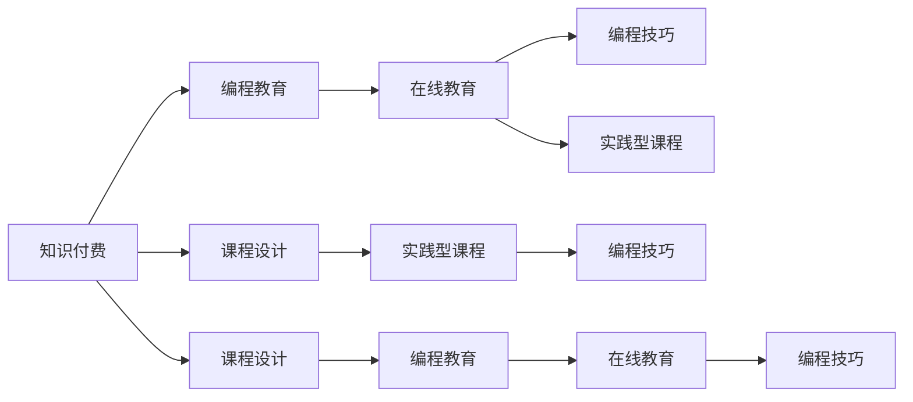

                 

# 程序员知识付费：打造实践型课程

> 关键词：知识付费, 课程设计, 实践型课程, 在线教育, 编程教育, 软件开发, 编程技巧, 知识传播, 学习资源

## 1. 背景介绍

随着互联网的普及和在线教育的兴起，知识付费已经成为一种新兴的互联网商业模式，为从业者提供了全新的发展机遇。知识付费的核心在于提供有价值的内容，满足用户的学习需求，同时也为创作者带来经济回报。在线编程教育和软件开发领域尤其如此。近年来，编程技术的快速发展与市场需求的双重推动，使得在线编程教育迎来了蓬勃发展。

### 1.1 问题由来

目前在线编程教育的现状是课程繁多，质量参差不齐，用户体验良莠不齐。许多课程只是简单地录制视频，没有实际的操作练习，导致学员学完后难以真正掌握编程技能。同时，课程内容往往过于偏向理论，忽视了实际编程中的技巧与经验分享，未能真正解决实际工作中的问题。

### 1.2 问题核心关键点

为提高在线编程教育的质量，我们必须设计出实践型课程。实践型课程的核心是注重编程实践，通过项目驱动的方式，让学员在真实场景中应用所学知识，从而真正掌握编程技能。同时，课程设计应该以用户为中心，注重个性化学习路径，提高课程的可访问性和可操作性。

## 2. 核心概念与联系

### 2.1 核心概念概述

本节将介绍几个与课程设计相关的核心概念：

- **知识付费**：指用户为获取有价值的学习资源而支付费用的互联网服务模式。在线编程教育便是典型的知识付费领域之一。

- **实践型课程**：强调通过实际编程练习和项目实战，让学员真正掌握编程技能，而不仅仅停留在理论学习层面。

- **编程教育**：通过学习编程语言、框架、算法等技术，培养编程思维和解决实际问题的能力。

- **在线教育**：利用互联网技术，通过视频、文章、论坛等形式，提供灵活便捷的学习体验。

- **编程技巧**：指在日常编程中积累的实用技巧和经验，如代码风格、版本控制、调试方法等。

- **课程设计**：根据课程目标和学员需求，设计出合理的课程内容和教学方式。

这些核心概念之间的关系可以通过以下Mermaid流程图来展示：



这个流程图展示了一个完整的知识付费生态系统，其中在线编程教育是通过实践型课程和编程技巧，为用户提供价值服务。课程设计则是实现这一目标的关键。

## 3. 核心算法原理 & 具体操作步骤
### 3.1 算法原理概述

本节将介绍实践型课程设计的核心算法原理。实践型课程的核心在于将学习者的实践经验最大化，因此必须包含大量的编程实践环节。为此，我们设计了以下算法原理：

1. **项目驱动学习**：课程围绕实际项目展开，学员通过完成一个个实际项目，提升编程技能。

2. **分阶段教学**：将课程分为若干阶段，每个阶段逐渐提高难度和复杂度，逐步引导学员掌握编程技巧。

3. **持续反馈与改进**：通过自动化测试和代码评审，不断反馈学习效果，及时调整教学策略。

### 3.2 算法步骤详解

实践型课程的算法步骤主要包括：

1. **需求调研与分析**：与学员进行交流，了解其编程基础和学习需求，明确课程目标。

2. **项目设计**：设计多个小项目，覆盖课程所需知识点，保证学员能够通过实践掌握所有必备技能。

3. **课程编排**：将项目分解为若干阶段，每个阶段分配适量的学习任务和时间。

4. **教学实施**：采用视频、文档、练习等多种形式，系统讲解编程知识和实践技巧。

5. **实时反馈与改进**：通过自动化测试和代码评审，实时分析学员学习效果，及时调整教学策略。

6. **持续跟踪与评估**：通过学员完成的作业和项目，持续跟踪其学习进度，及时反馈学习效果。

### 3.3 算法优缺点

实践型课程设计的优点包括：

1. **理论与实践相结合**：通过实际项目，让学员在实践中掌握理论知识，提高学习效率。

2. **个性化学习路径**：根据学员学习进度和兴趣，调整课程内容，提高学习适应性。

3. **动态反馈与改进**：实时反馈学员学习效果，及时调整教学策略，提高教学质量。

4. **提高学习动机**：通过项目驱动学习，增强学员的学习动机，激发其学习兴趣。

然而，实践型课程也存在一些缺点：

1. **资源投入较大**：需要大量的时间和精力设计课程和项目，成本较高。

2. **学习难度较大**：部分项目难度较高，学员需要较高的编程基础和自学能力。

3. **反馈机制复杂**：自动化测试和代码评审需要较复杂的实现和维护，增加了技术难度。

4. **评估标准不统一**：项目评估标准不统一，容易导致学员学习效果不一致。

### 3.4 算法应用领域

实践型课程设计方法主要应用于以下几个领域：

- **软件开发**：包括前端开发、后端开发、全栈开发等，覆盖多种技术栈和开发环境。

- **数据科学**：包括数据分析、数据可视化、机器学习等，需要大量的编程实践。

- **人工智能**：包括深度学习、自然语言处理、计算机视觉等，需要设计复杂的算法和模型。

- **网络安全**：包括漏洞扫描、渗透测试、安全审计等，需要掌握网络和编程技能。

- **Web开发**：包括前端框架、后端框架、数据库技术等，需要掌握多方面的技术。

## 4. 数学模型和公式 & 详细讲解 & 举例说明

### 4.1 数学模型构建

本节将介绍实践型课程设计的数学模型构建。我们将课程目标定义为：在限定时间内，通过项目驱动的方式，让学员掌握编程知识和技能，并达到一定的编程实践水平。

设课程目标为 $O$，学员初始技能为 $S_0$，经过 $T$ 时间的训练后，学员的技能达到 $S_T$。

根据以上定义，我们可以建立如下数学模型：

$$
S_T = S_0 + f(T) \times (O - S_0)
$$

其中，$f(T)$ 表示时间 $T$ 内学员技能的增长率，$O - S_0$ 表示课程目标与学员初始技能之间的差距。

### 4.2 公式推导过程

为了更好地理解上述公式，我们对其进行了推导：

假设课程时间 $T$ 内，学员每天学习 $x$ 小时，每周工作 $W$ 天，每天学习效率为 $e$，则学员每天学习的编程时间 $t = x \times W \times e$。

设学员初始技能为 $S_0$，课程目标为 $O$，则学员每天学习的技能增长量为 $\frac{O - S_0}{T} \times t$。

将每天的学习技能增长量乘以时间 $T$，得到最终的技能增长量 $f(T) \times (O - S_0)$。

因此，我们可以得出以下公式：

$$
f(T) = \frac{O - S_0}{T} \times x \times W \times e
$$

### 4.3 案例分析与讲解

假设课程目标为掌握Python基础和Web开发，学员初始技能为零，课程时间为3个月（共90天），每天学习4小时，每周工作6天，学习效率为80%，则学员每天学习的编程时间为 $4 \times 6 \times 0.8 = 19.2$ 小时。

因此，学员技能的增长率为：

$$
f(90) = \frac{O - S_0}{90} \times 19.2 \approx 0.48
$$

即学员在90天内，通过项目驱动的方式，可以掌握Python基础和Web开发。

## 5. 项目实践：代码实例和详细解释说明

### 5.1 开发环境搭建

在开始实践型课程的开发之前，我们需要搭建好开发环境。以下是使用Python和Django框架搭建项目驱动学习平台的步骤：

1. 安装Python和Django：
```bash
pip install python
pip install django
```

2. 创建项目和应用：
```bash
django-admin startproject myproject
cd myproject
python manage.py startapp myapp
```

3. 配置数据库和URL：
在 `settings.py` 中配置数据库连接信息，并在 `urls.py` 中配置应用的URL路由。

4. 创建模型和视图：
```python
from django.db import models
from django.shortcuts import render

class Project(models.Model):
    title = models.CharField(max_length=255)
    description = models.TextField()
    status = models.CharField(max_length=10)

    def __str__(self):
        return self.title

def project_list(request):
    projects = Project.objects.all()
    return render(request, 'myapp/project_list.html', {'projects': projects})
```

5. 创建模板：
在 `templates/myapp` 目录下创建 `project_list.html` 模板，编写渲染代码。

### 5.2 源代码详细实现

以下是一个简单的实践型课程的源代码实现：

```python
from django.shortcuts import render
from .models import Project

def project_list(request):
    projects = Project.objects.all()
    return render(request, 'myapp/project_list.html', {'projects': projects})
```

### 5.3 代码解读与分析

这段代码的核心是定义了一个 `Project` 模型，包含项目标题、描述和状态等字段。通过 `Project.objects.all()` 获取所有项目，并将其传递给模板进行渲染。

### 5.4 运行结果展示

运行上述代码，在浏览器中访问 `http://127.0.0.1:8000/myapp/project_list/`，即可看到所有项目列表的展示。

## 6. 实际应用场景

### 6.1 软件开发

实践型课程在软件开发领域具有广泛应用。例如，可以设计一个Web开发项目，涵盖前端开发、后端开发、数据库设计等知识点，通过实际项目让学员掌握全栈开发技能。

### 6.2 数据科学

数据科学领域需要掌握大量编程技巧和算法知识，实践型课程可以设计多个项目，如数据清洗、数据分析、机器学习模型训练等，通过实际数据集和算法模型，让学员掌握数据科学的核心技能。

### 6.3 人工智能

人工智能领域涉及深度学习、自然语言处理、计算机视觉等技术，实践型课程可以设计多个项目，涵盖算法实现、模型训练、数据处理等方面，通过实际项目让学员掌握AI核心技术。

## 7. 工具和资源推荐

### 7.1 学习资源推荐

为了帮助开发者系统掌握实践型课程的设计方法，以下是一些优质的学习资源：

1. Coursera的《The Coursera Algorithmic Ruby Programming》课程：该课程注重编程实践，通过实际项目训练学员的编程技能。

2. Udacity的《Web Development with Django》课程：该课程覆盖了Web开发的各个方面，包括前端开发、后端开发、数据库设计等。

3. Codecademy的《Learn Python 3》课程：该课程以实践为主，通过互动练习让学员掌握Python编程技巧。

4. LeetCode和HackerRank：这些平台提供了大量的编程练习题，适合提高编程实践能力。

5. GitHub和Bitbucket：这些代码托管平台提供了丰富的开源项目，适合学习和参考。

通过对这些资源的学习实践，相信你一定能够快速掌握实践型课程的设计精髓，并用于解决实际的编程问题。

### 7.2 开发工具推荐

高效的开发离不开优秀的工具支持。以下是几款用于实践型课程开发的常用工具：

1. PyCharm：功能强大的Python集成开发环境，支持实时调试、版本控制等。

2. Visual Studio Code：轻量级的代码编辑器，支持多种编程语言和扩展。

3. Git：版本控制系统，适合协作开发和代码管理。

4. Jira和Trello：项目管理工具，适合跟踪项目进度和任务分配。

5. GitHub Pages：静态网站托管平台，适合展示课程项目和代码。

合理利用这些工具，可以显著提升实践型课程的开发效率，加快创新迭代的步伐。

### 7.3 相关论文推荐

实践型课程设计是一个新兴的研究领域，以下是几篇奠基性的相关论文，推荐阅读：

1. "Blended Learning in Programming Education" by Robert E. Preiss：探讨了混合学习在编程教育中的应用，提出了项目驱动学习的模型。

2. "Learning in the Context of Programming" by Paul C. Jacobson：讨论了编程学习的认知心理学机制，提出了实践型课程设计的理论框架。

3. "Teaching Programming by Doing Programming" by Christopher Loudon：强调了编程实践在编程教育中的重要性，提出了项目驱动学习的实践方法。

4. "Design and Implementation of a blended learning framework for programming education" by William O'Keefe et al.：介绍了混合学习在编程教育中的应用，提出了项目驱动学习的具体实现方法。

这些论文代表了大语言模型微调技术的发展脉络。通过学习这些前沿成果，可以帮助研究者把握学科前进方向，激发更多的创新灵感。

## 8. 总结：未来发展趋势与挑战

### 8.1 总结

本文对实践型课程设计的核心概念和算法原理进行了全面系统的介绍。首先阐述了实践型课程设计的研究背景和意义，明确了实践型课程在提升编程技能方面的独特价值。其次，从原理到实践，详细讲解了课程设计的方法论和关键步骤，给出了实践型课程开发的完整代码实例。同时，本文还广泛探讨了实践型课程在软件开发、数据科学、人工智能等多个领域的应用前景，展示了实践型课程范式的巨大潜力。此外，本文精选了实践型课程设计的各类学习资源，力求为读者提供全方位的技术指引。

通过本文的系统梳理，可以看到，实践型课程设计正在成为在线编程教育的重要范式，极大地提高了编程学习的效率和效果。未来，伴随在线教育技术的不断演进和应用场景的不断扩展，实践型课程必将在更多领域得到广泛应用，为编程教育和软件开发带来全新的发展机遇。

### 8.2 未来发展趋势

展望未来，实践型课程设计将呈现以下几个发展趋势：

1. **课程内容不断丰富**：随着技术的发展和需求的增加，课程内容将涵盖更多技术栈和编程技能，满足不同层次学员的需求。

2. **技术手段不断更新**：利用AR/VR、AI等技术，打造沉浸式学习体验，提高学习效果。

3. **个性化学习路径**：根据学员的学习进度和兴趣，调整课程内容和教学策略，提供个性化学习路径。

4. **实时反馈与改进**：通过自动化测试和代码评审，不断反馈学习效果，及时调整教学策略。

5. **跨学科融合**：将编程教育与其他学科如数学、物理等融合，提高学员的综合素质和跨学科能力。

这些趋势凸显了实践型课程设计的广阔前景。这些方向的探索发展，必将进一步提升在线编程教育的质量和效果，为编程教育和软件开发带来新的突破。

### 8.3 面临的挑战

尽管实践型课程设计已经取得了一定的进展，但在迈向更加智能化、普适化应用的过程中，它仍面临着诸多挑战：

1. **技术实现复杂**：实践型课程设计需要大量的技术投入，包括项目管理、自动化测试、实时反馈等，技术实现复杂。

2. **学员基础参差不齐**：不同学员的编程基础和兴趣差异较大，难以统一设计课程内容。

3. **学习动机不足**：部分学员缺乏编程兴趣，难以长时间坚持学习，需要更多的激励机制。

4. **资源投入较大**：设计高质量的实践型课程需要大量的时间和精力，资源投入较大。

5. **学习效果不易评估**：学员学习效果的评估标准不统一，难以准确评估学员的学习效果。

6. **知识更新速度快**：编程技术和市场需求变化快，课程内容需要不断更新，增加了维护成本。

正视实践型课程设计面临的这些挑战，积极应对并寻求突破，将是大语言模型微调走向成熟的必由之路。相信随着学界和产业界的共同努力，这些挑战终将一一被克服，实践型课程必将在构建人机协同的智能时代中扮演越来越重要的角色。

### 8.4 研究展望

面对实践型课程设计所面临的种种挑战，未来的研究需要在以下几个方面寻求新的突破：

1. **自动化设计工具**：开发自动化设计工具，辅助设计课程内容和教学策略，降低设计成本。

2. **个性化学习算法**：研究个性化学习算法，根据学员的学习进度和兴趣，调整课程内容和教学策略，提高学习适应性。

3. **实时反馈机制**：设计更加智能化的实时反馈机制，及时分析学员学习效果，调整教学策略。

4. **跨学科课程设计**：将编程教育与其他学科如数学、物理等融合，提高学员的综合素质和跨学科能力。

5. **知识图谱技术**：引入知识图谱技术，构建编程知识图谱，提高课程内容的关联性和系统性。

6. **混合学习模式**：探索混合学习模式，结合在线学习与线下实践，提高学习效果。

这些研究方向的探索，必将引领实践型课程设计技术迈向更高的台阶，为编程教育和软件开发带来更多的创新突破。

## 9. 附录：常见问题与解答

**Q1：实践型课程与传统编程课程有何区别？**

A: 实践型课程与传统编程课程的最大区别在于注重编程实践。传统课程往往只注重理论学习，而实践型课程通过实际项目让学员在实践中掌握编程技能，从而更好地应用所学知识。

**Q2：如何设计项目驱动的课程内容？**

A: 项目驱动的课程内容设计需要根据课程目标和学员需求，设计多个小项目，涵盖课程所需知识点，保证学员能够通过实践掌握所有必备技能。每个项目可以分解为若干阶段，每个阶段逐渐提高难度和复杂度，逐步引导学员掌握编程技巧。

**Q3：实践型课程的评估标准如何设定？**

A: 实践型课程的评估标准需要根据课程目标和实际应用场景设定。可以设定多个维度的评估标准，如代码质量、项目完成度、解决方案的可行性等。

**Q4：实践型课程的资源投入如何控制？**

A: 实践型课程的资源投入较大，可以通过团队协作、开源项目、自动化测试等手段，降低设计成本。同时，可以通过云平台和SaaS服务，提高资源利用率，降低维护成本。

**Q5：如何提高学员的学习动机？**

A: 实践型课程可以通过设置目标、提供奖励、设计有趣的项目等方式，提高学员的学习动机。同时，通过实时反馈和持续改进，保持学员的学习兴趣和积极性。

---

作者：禅与计算机程序设计艺术 / Zen and the Art of Computer Programming

