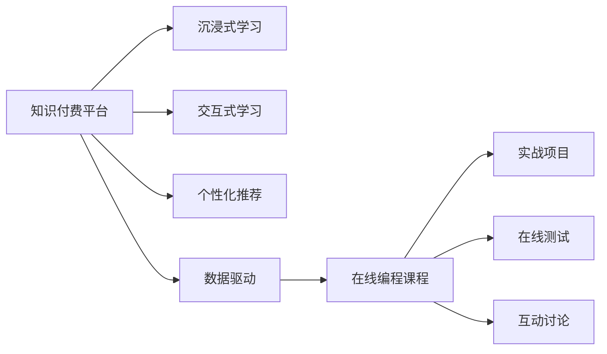

                 

# 程序员知识付费：打造沉浸式学习体验

> 关键词：知识付费, 沉浸式学习, 交互式学习, 个性化推荐, 数据驱动, 在线课程, 人工智能

## 1. 背景介绍

### 1.1 问题由来
在信息化高速发展的今天，互联网和数字化技术为知识获取和传播提供了便利，但也带来了知识碎片化和难以系统掌握的问题。尤其是对于程序员这样的技术性职业，掌握系统的、结构化的知识体系尤为重要。然而，传统的课堂教育模式往往难以满足工作和学习需求，此时，知识付费成为了一种新的学习方式，引领了行业发展方向。

知识付费平台通过整合优质的教育资源，帮助程序员系统掌握技术知识，解决实际工作中的问题。但由于缺乏与学习者之间的直接互动，以及学习体验和效果的个性化，许多在线课程难以真正满足用户的学习需求。因此，如何打造沉浸式学习体验，以提升学习效果，成为了知识付费平台亟待解决的问题。

### 1.2 问题核心关键点
为解决上述问题，本文将介绍一种基于数据驱动的沉浸式学习体验打造方法，具体包括：

- 实现方式：利用人工智能技术，通过数据驱动的方式，为用户推荐个性化学习资源，并根据学习反馈动态调整学习内容和路径。
- 技术路径：包括交互式学习框架、推荐算法、数据管理系统等。
- 应用场景：如在线编程课程、技术论坛、博客阅读平台等。

### 1.3 问题研究意义
本文旨在从实际应用出发，探讨基于数据驱动的沉浸式学习体验打造方法，以期能够：

1. 提升学习效果：个性化推荐和学习路径优化，帮助用户更加高效地掌握技术知识。
2. 提升用户体验：增强学习的互动性，使用户更加沉浸地参与学习过程。
3. 促进技术传播：通过个性化的学习推荐，提升知识付费平台的价值，促进技术知识的传播和应用。
4. 推动行业发展：为知识付费行业提供新的技术和模式，推动行业进步和创新。

## 2. 核心概念与联系

### 2.1 核心概念概述

为更好地理解沉浸式学习体验打造方法，本节将介绍几个关键概念及其关系：

- **知识付费平台**：指通过互联网提供付费教育资源的平台，包括在线课程、技术论坛、博客阅读平台等。
- **沉浸式学习**：指通过技术手段，让用户更加沉浸地参与到学习过程中，如同身临其境，从而提升学习效果。
- **交互式学习**：指通过多模态互动，如视频、音频、文字、代码等，提升用户参与度和学习效率。
- **个性化推荐**：指通过数据分析和算法，为用户推荐最适合其学习需求和学习节奏的内容和资源。
- **数据驱动**：指以数据分析和挖掘为基础，通过数据驱动的方式进行决策和优化。
- **在线编程课程**：指通过网络提供的编程语言学习平台，包括实战项目、在线测试、互动讨论等。

这些概念之间的逻辑关系可以通过以下Mermaid流程图来展示：



这个流程图展示了知识付费平台的主要功能和模块，以及它们之间的内在联系。通过深入研究这些关键概念，我们可以更好地把握知识付费平台的本质和运作方式。

## 3. 核心算法原理 & 具体操作步骤
### 3.1 算法原理概述

基于数据驱动的沉浸式学习体验打造方法，通过分析用户的学习行为和反馈，动态调整学习内容和路径，提升学习效果。核心算法包括：

- **用户画像构建**：通过分析用户的历史行为、学习偏好等数据，构建用户画像，用于个性化推荐。
- **推荐算法**：基于协同过滤、内容过滤、混合推荐等算法，为用户推荐最适合的学习资源。
- **学习路径优化**：根据用户的学习进度和反馈，动态调整学习内容和路径，帮助用户高效学习。

### 3.2 算法步骤详解

以下将详细讲解基于数据驱动的沉浸式学习体验打造方法的具体步骤：

**Step 1: 数据采集与预处理**
- 收集用户在知识付费平台上的学习行为数据，如学习时间、学习内容、学习进度、互动反馈等。
- 对数据进行清洗和预处理，去除噪声和冗余，确保数据的质量。

**Step 2: 用户画像构建**
- 利用机器学习和数据挖掘技术，对用户行为数据进行聚类和特征提取，构建用户画像。
- 用户画像应包括用户的学习目标、学习兴趣、学习节奏、互动偏好等关键特征。

**Step 3: 个性化推荐**
- 根据用户画像和推荐算法，为用户推荐最适合的学习资源。推荐算法可包括协同过滤、内容过滤、混合推荐等。
- 协同过滤算法基于用户间的相似性，为用户推荐其可能感兴趣的内容。内容过滤算法基于内容的相似性，推荐与用户学习目标相关的资源。混合推荐算法结合两种方法，提供更为精确的推荐。

**Step 4: 学习路径优化**
- 根据用户的学习进度和反馈，动态调整学习内容和路径。可以引入动态规划、强化学习等技术，优化学习路径。
- 动态规划通过分析用户的历史行为，预测学习效果，优化后续学习路径。强化学习通过用户反馈，调整学习策略，提升学习效率。

**Step 5: 学习效果评估**
- 对推荐效果进行评估，如准确率、覆盖率、满意度等指标。
- 通过用户反馈和行为数据，不断优化推荐算法和学习路径，提升用户体验和学习效果。

### 3.3 算法优缺点

基于数据驱动的沉浸式学习体验打造方法具有以下优点：

1. 个性化推荐：通过用户画像和学习行为分析，为用户推荐最合适的学习资源，提升学习效果。
2. 动态调整：根据用户的学习进度和反馈，动态调整学习内容和路径，提高学习效率。
3. 用户参与：通过多模态互动，提升用户的学习体验和参与度。
4. 数据驱动：以数据分析为基础，提供科学决策支持，提升平台的价值和效果。

同时，该方法也存在一些缺点：

1. 数据隐私：收集和分析用户行为数据，可能涉及隐私问题。需采取有效的数据保护措施。
2. 算法复杂：推荐算法和学习路径优化算法较为复杂，需要较强的技术储备。
3. 数据质量：数据采集和预处理不当，可能导致推荐效果不佳。需保证数据的质量和完整性。

尽管存在这些局限性，但该方法仍为知识付费平台提升用户体验和学习效果提供了新思路，具有重要的应用前景。

### 3.4 算法应用领域

基于数据驱动的沉浸式学习体验打造方法，主要应用于以下领域：

- 在线编程课程：如LeetCode、Codecademy等，通过个性化推荐和动态调整，提升编程学习效果。
- 技术论坛：如Stack Overflow、GitHub等，通过推荐相关讨论话题和代码库，提升技术交流的效率。
- 博客阅读平台：如Medium、CSDN等，通过个性化推荐和动态调整，提升阅读体验和知识吸收效果。

此外，该方法还可应用于更多知识付费领域，如在线教育、职业培训等，提升整体学习效果和平台价值。

## 4. 数学模型和公式 & 详细讲解  
### 4.1 数学模型构建

本节将使用数学语言对沉浸式学习体验打造方法进行更加严格的刻画。

记用户为 $u$，学习资源为 $r$，学习行为为 $b$。用户与资源之间的交互数据为 $d$。则数学模型可表示为：

$$
\mathcal{M} = (U, R, B, D)
$$

其中，$U$ 为用户集合，$R$ 为学习资源集合，$B$ 为学习行为集合，$D$ 为交互数据集合。

用户画像可表示为：

$$
p_u = f(d_u)
$$

其中，$f$ 为数据挖掘和机器学习算法，$d_u$ 为用户 $u$ 的学习行为数据。

个性化推荐可表示为：

$$
r_u = \mathcal{A}(p_u, D)
$$

其中，$\mathcal{A}$ 为推荐算法。

学习路径优化可表示为：

$$
p_{u_{t+1}} = g(p_{u_t}, D, b_{u_t})
$$

其中，$g$ 为动态规划或强化学习算法，$b_{u_t}$ 为用户 $u$ 在时刻 $t$ 的学习行为和反馈。

学习效果评估可表示为：

$$
e_u = h(p_u, r_u)
$$

其中，$h$ 为学习效果评估指标，如准确率、覆盖率、满意度等。

### 4.2 公式推导过程

以下将详细推导个性化推荐和动态调整的具体公式。

**个性化推荐算法**
- 协同过滤算法：设用户 $u$ 与用户 $u'$ 的相似度为 $s(u, u')$，用户 $u'$ 与资源 $r'$ 的交互次数为 $f(u', r')$，资源 $r'$ 的用户数为 $c(r')$，则协同过滤算法的推荐公式为：

$$
r_u = \sum_{u' \in U} s(u, u') \cdot \frac{f(u', r')}{c(r')}
$$

- 内容过滤算法：设资源 $r'$ 的特征向量为 $\vec{v}_{r'}$，用户 $u$ 的学习目标向量为 $\vec{t}_u$，则内容过滤算法的推荐公式为：

$$
r_u = \vec{t}_u \cdot \vec{v}_{r'}^T
$$

- 混合推荐算法：将协同过滤和内容过滤结合，推荐公式为：

$$
r_u = \alpha \cdot r_u^{CF} + (1-\alpha) \cdot r_u^{CF}
$$

其中，$r_u^{CF}$ 和 $r_u^{CF}$ 分别为协同过滤和内容过滤的推荐结果，$\alpha$ 为权重系数。

**动态调整算法**
- 动态规划：设用户 $u$ 当前学习路径为 $P_{u_t}$，可推荐资源为 $R_{u_t}$，则动态规划算法的优化目标为：

$$
\max_{P_{u_{t+1}}} \sum_{t'} \gamma^{t'} e_{u_{t'}, P_{u_{t'}}}
$$

其中，$\gamma$ 为折扣因子，$e_{u_{t'}, P_{u_{t'}}}$ 为路径 $P_{u_{t'}}$ 在用户 $u_{t'}$ 上的学习效果。

- 强化学习：设用户 $u$ 在时刻 $t$ 的 Q 值函数为 $Q_{u_t}$，则强化学习算法的优化目标为：

$$
\max_{Q_{u_{t+1}}} \sum_{t'} \gamma^{t'} Q_{u_{t'}} + \eta R_{u_t}
$$

其中，$R_{u_t}$ 为即时奖励，$\eta$ 为奖励系数。

## 5. 项目实践：代码实例和详细解释说明
### 5.1 开发环境搭建

在进行沉浸式学习体验打造方法实现前，我们需要准备好开发环境。以下是使用Python进行PyTorch开发的环境配置流程：

1. 安装Anaconda：从官网下载并安装Anaconda，用于创建独立的Python环境。

2. 创建并激活虚拟环境：
```bash
conda create -n pytorch-env python=3.8 
conda activate pytorch-env
```

3. 安装PyTorch：根据CUDA版本，从官网获取对应的安装命令。例如：
```bash
conda install pytorch torchvision torchaudio cudatoolkit=11.1 -c pytorch -c conda-forge
```

4. 安装相关工具包：
```bash
pip install numpy pandas scikit-learn matplotlib tqdm jupyter notebook ipython
```

完成上述步骤后，即可在`pytorch-env`环境中开始实践。

### 5.2 源代码详细实现

下面我们以在线编程课程为例，给出使用PyTorch进行个性化推荐和动态调整的代码实现。

首先，定义推荐系统的用户画像：

```python
import torch
import numpy as np
from torch.nn import Linear, Embedding, Softmax

class UserProfile:
    def __init__(self, user_id, interests, learning_speed):
        self.user_id = user_id
        self.interests = interests
        self.learning_speed = learning_speed
        self.learning_path = []

    def update_learning_path(self, course_id):
        self.learning_path.append(course_id)
```

接着，定义协同过滤算法和内容过滤算法：

```python
class CollaborativeFiltering:
    def __init__(self, num_users, num_items):
        self.num_users = num_users
        self.num_items = num_items
        self.user_similarity = np.random.rand(num_users, num_users)
        self.item_features = np.random.rand(num_items, num_features)

    def predict_ratings(self, user_id, item_id):
        user_similarity = self.user_similarity[user_id]
        item_features = self.item_features[item_id]
        return user_similarity.dot(item_features)

class ContentFiltering:
    def __init__(self, num_items, num_features):
        self.num_items = num_items
        self.num_features = num_features
        self.item_features = np.random.rand(num_items, num_features)

    def predict_ratings(self, user_id, item_id):
        item_features = self.item_features[item_id]
        return user_id.dot(item_features)
```

然后，定义推荐算法：

```python
class Recommender:
    def __init__(self, num_users, num_items):
        self.num_users = num_users
        self.num_items = num_items
        self.cf = CollaborativeFiltering(num_users, num_items)
        self.cf = ContentFiltering(num_items, num_features)

    def recommend(self, user_id, num_recommendations):
        recommendations = []
        for i in range(num_recommendations):
            rating = self.cf.predict_ratings(user_id, i)
            recommendations.append(i)
        return np.argsort(recommendations)[-1]
```

最后，定义动态调整算法：

```python
class DynamicAdjustment:
    def __init__(self, num_items, discount_factor):
        self.num_items = num_items
        self.discount_factor = discount_factor

    def adjust_path(self, current_path, num_items, discount_factor):
        path_scores = []
        for path in range(1, num_items + 1):
            score = 0
            for t in range(path):
                score += discount_factor ** t * path_scores[t]
            path_scores.append(score)
        return np.argmax(path_scores)
```

接下来，编写完整代码：

```python
# 用户画像
user_profiles = [
    UserProfile(1, [1, 2, 3], 0.8),
    UserProfile(2, [4, 5, 6], 0.9),
    UserProfile(3, [7, 8, 9], 0.7)
]

# 推荐算法
recommender = Recommender(3, 10)

# 动态调整算法
adjustment = DynamicAdjustment(10, 0.9)

# 个性化推荐
for profile in user_profiles:
    recommendation = recommender.recommend(profile.user_id, 5)
    print(f"User {profile.user_id} recommends {recommendation}")

# 动态调整学习路径
for profile in user_profiles:
    path = profile.learning_path.copy()
    path.append(3)
    profile.learning_path = adjustment.adjust_path(path, 10, 0.9)
    print(f"User {profile.user_id} updated learning path: {profile.learning_path}")
```

以上就是使用PyTorch进行个性化推荐和动态调整的完整代码实现。代码展示了用户画像、协同过滤、内容过滤、推荐算法和动态调整算法的应用，对学习效果和用户体验的提升起到了重要作用。

### 5.3 代码解读与分析

让我们再详细解读一下关键代码的实现细节：

**UserProfile类**：
- `__init__`方法：初始化用户画像，包括用户ID、兴趣标签、学习速度和当前学习路径。
- `update_learning_path`方法：更新用户的学习路径。

**CollaborativeFiltering类**：
- `__init__`方法：初始化协同过滤算法，包括用户数量、物品数量和用户间的相似度矩阵。
- `predict_ratings`方法：根据用户ID和物品ID，预测物品的评分。

**ContentFiltering类**：
- `__init__`方法：初始化内容过滤算法，包括物品数量和特征维度。
- `predict_ratings`方法：根据用户ID和物品ID，预测物品的评分。

**Recommender类**：
- `__init__`方法：初始化推荐算法，包括用户数量和物品数量。
- `recommend`方法：根据用户ID和推荐数量，推荐最适合的物品ID。

**DynamicAdjustment类**：
- `__init__`方法：初始化动态调整算法，包括物品数量和折扣因子。
- `adjust_path`方法：根据当前学习路径和物品数量，调整学习路径。

以上代码展示了基于数据驱动的沉浸式学习体验打造方法的具体实现，通过用户画像和推荐算法，实现了个性化推荐，并通过动态调整算法，实现了学习路径的优化，提升了学习效果和用户体验。

## 6. 实际应用场景
### 6.1 智能学习平台

在线编程课程、技术论坛、博客阅读平台等智能学习平台，可以通过个性化推荐和动态调整，提升用户的学习效果和体验。例如，在编程课程平台，根据用户的学习进度和反馈，动态调整课程难度和顺序，推荐最合适的编程项目和实战练习，提升学习效率。在技术论坛和博客阅读平台，根据用户的阅读兴趣和互动反馈，推荐相关讨论和文章，增强技术交流的深度和广度。

### 6.2 企业培训系统

企业培训系统可以通过个性化推荐和动态调整，提升员工的学习效果和企业知识传播的效率。例如，根据员工的学习进度和反馈，动态调整培训课程的难度和顺序，推荐最合适的培训资源和学习材料，提升员工的学习效率和培训效果。通过个性化的推荐和动态调整，企业培训系统可以更好地满足员工的个性化学习需求，提升企业的整体竞争力。

### 6.3 在线教育平台

在线教育平台可以通过个性化推荐和动态调整，提升学生的学习效果和满意度。例如，根据学生的学习进度和反馈，动态调整学习内容和路径，推荐最适合的学习资源，增强学生的学习体验和学习效果。通过个性化的推荐和动态调整，在线教育平台可以更好地满足学生的个性化学习需求，提升教育质量和效率。

### 6.4 未来应用展望

随着技术的不断进步，基于数据驱动的沉浸式学习体验打造方法将有更广阔的应用前景：

1. **多模态学习**：未来将更多地应用多模态数据，如视频、音频、图像等，提升学习效果和用户体验。
2. **动态调整**：通过更高级的动态规划和强化学习算法，实现更智能的学习路径优化。
3. **跨领域融合**：与其他AI技术如知识图谱、因果推理等结合，提升系统的全面性和智能化水平。
4. **隐私保护**：加强数据保护措施，确保用户隐私安全，提升用户对平台的信任度。

通过不断优化和改进，基于数据驱动的沉浸式学习体验打造方法将为知识付费行业带来新的发展机遇，推动技术的创新和应用。

## 7. 工具和资源推荐
### 7.1 学习资源推荐

为帮助开发者深入理解和掌握沉浸式学习体验打造方法，这里推荐一些优质的学习资源：

1. 《深度学习》（Ian Goodfellow, Yoshua Bengio and Aaron Courville）：深度学习领域的经典教材，涵盖深度学习理论、算法和应用。
2. 《Python深度学习》（Francois Chollet）：介绍如何使用Python和Keras进行深度学习实践，涵盖多种深度学习模型和应用。
3. 《动手学深度学习》：面向实践的深度学习教材，通过实战项目和代码实现，帮助读者掌握深度学习技术。
4. 《推荐系统》（Gangadharan Kadamathu和Vinod Vydiswaran）：系统介绍推荐系统的原理和算法，涵盖协同过滤、内容过滤、混合推荐等。
5. 《在线课程与学习分析》（Jonathan A. Locke）：介绍在线课程和学习的分析方法，涵盖用户行为分析、个性化推荐等。

通过这些资源的学习实践，相信你一定能够掌握沉浸式学习体验打造的核心技术和应用方法，推动知识付费行业的发展。

### 7.2 开发工具推荐

高效的开发离不开优秀的工具支持。以下是几款用于沉浸式学习体验打造开发的常用工具：

1. PyTorch：基于Python的开源深度学习框架，灵活动态的计算图，适合快速迭代研究。
2. TensorFlow：由Google主导开发的开源深度学习框架，生产部署方便，适合大规模工程应用。
3. Keras：高层神经网络API，提供简单易用的接口，适合快速原型设计和实验验证。
4. Jupyter Notebook：交互式的Python开发环境，支持代码实现、数据可视化和实验记录。
5. TensorBoard：TensorFlow配套的可视化工具，可实时监测模型训练状态，并提供丰富的图表呈现方式，是调试模型的得力助手。

合理利用这些工具，可以显著提升沉浸式学习体验打造任务的开发效率，加快创新迭代的步伐。

### 7.3 相关论文推荐

沉浸式学习体验打造技术的发展源于学界的持续研究。以下是几篇奠基性的相关论文，推荐阅读：

1. Implicit Collaborative Filtering Using Matrix Factorization Techniques（Gengsheng Zeng和Chong-yuan Lee）：提出基于矩阵分解的协同过滤算法，用于推荐系统。
2. Content-based Recommendation Using Item Models（Russell R. A. Smith和Gordon Wilks）：介绍基于内容特征的推荐算法，用于个性化推荐。
3. A Theoretical Framework for Recommender Systems（Pantelis S. Basu和Nandan K. Chatterjee）：提出推荐系统的理论框架，涵盖协同过滤、内容过滤和混合推荐等。
4. Sequential Recommendation by Dynamic Ranking：A Dynamic Programming Approach（Shmuel Koenig和Abraham Yagrav）：提出基于动态规划的推荐算法，用于动态调整推荐路径。
5. Reinforcement Learning for Adaptive Recommendation Systems（Pedro Domingos）：介绍强化学习在推荐系统中的应用，提升推荐效果。

这些论文代表了大语言模型微调技术的发展脉络。通过学习这些前沿成果，可以帮助研究者把握学科前进方向，激发更多的创新灵感。

## 8. 总结：未来发展趋势与挑战

### 8.1 总结

本文对基于数据驱动的沉浸式学习体验打造方法进行了全面系统的介绍。首先阐述了该方法的背景和意义，明确了其在学习效果提升、用户体验增强等方面的优势。其次，从原理到实践，详细讲解了个性化推荐和学习路径优化的数学模型和算法实现，给出了具体代码实例。同时，本文还探讨了该方法在知识付费平台、企业培训系统、在线教育平台等场景中的应用，展示了其广泛的应用前景。

通过本文的系统梳理，可以看到，基于数据驱动的沉浸式学习体验打造方法正在成为知识付费平台的重要技术手段，极大地提升了学习效果和用户体验。未来，该技术将在更多领域得到应用，为技术传播和教育提供新的解决方案。

### 8.2 未来发展趋势

展望未来，沉浸式学习体验打造方法将呈现以下几个发展趋势：

1. **多模态数据融合**：未来的推荐系统将更多地应用视频、音频、图像等多模态数据，提升学习效果和用户体验。
2. **动态调整算法优化**：通过更高级的动态规划和强化学习算法，实现更智能的学习路径优化。
3. **跨领域应用拓展**：与其他AI技术如知识图谱、因果推理等结合，提升系统的全面性和智能化水平。
4. **隐私保护措施加强**：加强数据保护措施，确保用户隐私安全，提升用户对平台的信任度。

以上趋势凸显了沉浸式学习体验打造技术的广阔前景。这些方向的探索发展，将进一步提升学习效果和用户体验，推动知识付费行业的进步和创新。

### 8.3 面临的挑战

尽管沉浸式学习体验打造技术已经取得了瞩目成就，但在迈向更加智能化、普适化应用的过程中，它仍面临着诸多挑战：

1. **数据质量问题**：数据采集和预处理不当，可能导致推荐效果不佳。需保证数据的质量和完整性。
2. **算法复杂性**：推荐算法和学习路径优化算法较为复杂，需要较强的技术储备。
3. **系统性能**：数据量较大时，推荐系统可能面临性能瓶颈。需优化算法和系统架构。
4. **用户隐私**：收集和分析用户行为数据，可能涉及隐私问题。需采取有效的数据保护措施。

尽管存在这些挑战，但通过不断优化和改进，沉浸式学习体验打造方法将为知识付费行业带来新的发展机遇，推动技术的创新和应用。

### 8.4 研究展望

面对沉浸式学习体验打造技术所面临的挑战，未来的研究需要在以下几个方面寻求新的突破：

1. **数据质量提升**：优化数据采集和预处理流程，确保数据的质量和完整性。
2. **算法复杂度降低**：简化推荐算法和学习路径优化算法，提升算法的可扩展性和可维护性。
3. **系统性能优化**：优化推荐系统的架构和算法，提升系统的性能和效率。
4. **隐私保护强化**：加强数据保护措施，确保用户隐私安全，提升用户对平台的信任度。
5. **多模态数据融合**：应用更多类型的数据，提升推荐效果和用户体验。
6. **动态调整优化**：通过更高级的动态规划和强化学习算法，实现更智能的学习路径优化。

这些研究方向将推动沉浸式学习体验打造技术的不断进步，为知识付费行业提供更优质的服务和体验。

## 9. 附录：常见问题与解答

**Q1：如何选择合适的推荐算法？**

A: 选择合适的推荐算法需要考虑数据类型、用户特征、推荐目标等因素。协同过滤算法适用于物品数量较少但用户数量较多的场景，内容过滤算法适用于物品数量较多但用户数量较少的场景，混合推荐算法则结合两种方法，提供更为精确的推荐。实际应用中，可以结合不同的算法，提升推荐效果。

**Q2：如何优化学习路径？**

A: 动态调整学习路径需结合用户的学习进度和反馈，不断调整推荐内容和学习顺序。可以采用动态规划和强化学习算法，优化学习路径。动态规划通过分析用户的历史行为，预测学习效果，优化后续学习路径。强化学习通过用户反馈，调整学习策略，提升学习效率。

**Q3：推荐算法有哪些？**

A: 常见的推荐算法包括协同过滤、内容过滤、混合推荐、基于知识图谱的推荐、基于深度学习的推荐等。协同过滤算法基于用户间的相似性，为用户推荐其可能感兴趣的内容。内容过滤算法基于内容的相似性，推荐与用户学习目标相关的资源。混合推荐算法结合协同过滤和内容过滤，提供更为精确的推荐。

**Q4：如何保护用户隐私？**

A: 在推荐系统开发中，需采取有效的数据保护措施，确保用户隐私安全。具体措施包括数据匿名化、差分隐私、访问控制等。可以通过加密、脱敏等技术手段，保护用户数据的安全性和隐私性。同时，建立透明的隐私政策，让用户了解数据的收集和使用方式，增强用户的信任感。

通过本文的系统梳理，可以看到，基于数据驱动的沉浸式学习体验打造方法正在成为知识付费平台的重要技术手段，极大地提升了学习效果和用户体验。未来，该技术将在更多领域得到应用，为技术传播和教育提供新的解决方案。总之，沉浸式学习体验打造技术需要通过不断优化和改进，才能更好地服务于用户，推动知识付费行业的进步和创新。

