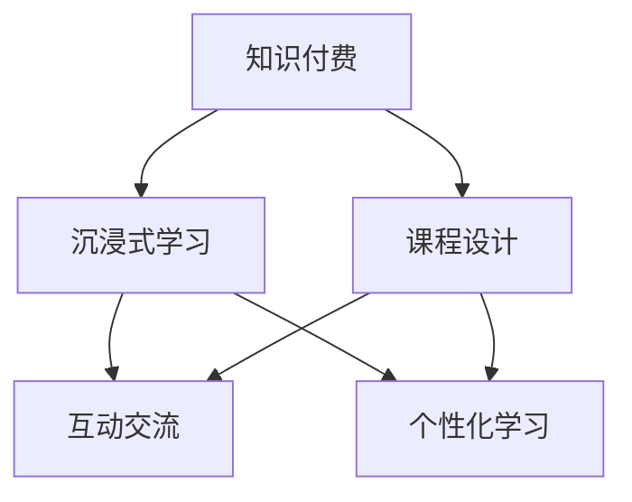

                 

# 程序员知识付费：打造沉浸课模式

## 1. 背景介绍

在互联网+时代，知识付费快速崛起，成为人们获取新知、提升技能的重要渠道。特别是对程序员而言，知识付费更是提供了一种高效的学习方式，能够快速掌握新技术、新工具，适应日新月异的行业需求。然而，当前的知识付费市场也面临诸多挑战，如内容质量参差不齐、学习体验不佳、缺乏互动交流等。

在这样的背景下，如何打造一种高效、沉浸、互动、持久的学习模式，成为知识付费领域的重要研究方向。本文将从内容设计、技术实现、用户体验等多个维度，探讨如何构建沉浸式的程序员知识付费课程，帮助学员在短时间内掌握核心技能，提升职业竞争力。

## 2. 核心概念与联系

### 2.1 核心概念概述

本文聚焦于沉浸式知识付费课程的构建，涉及到几个核心概念：

- **知识付费**：以付费形式获取专业人士或机构的知识，帮助用户掌握新技能、提升职业素养，满足学习需求。

- **沉浸式学习**：指通过构建沉浸式学习环境，让用户深度参与到学习过程中，增强学习效果和记忆能力。

- **课程设计**：根据用户需求和学习目标，规划课程内容和结构，设计合理的教学活动和学习路径。

- **互动交流**：在学习过程中，通过社群、讨论、直播等形式，加强师生、生生之间的互动，促进知识内化。

- **个性化学习**：根据用户的学习情况和反馈，动态调整课程内容和难度，实现因材施教。

这些核心概念相互关联，共同构成了一个沉浸式知识付费课程的构建框架。通过理解这些概念，可以更好地把握沉浸式学习的本质和关键点，构建出高品质的程序员知识付费课程。

### 2.2 核心概念原理和架构的 Mermaid 流程图



这个流程图展示了知识付费、沉浸式学习、课程设计、互动交流和个性化学习之间的联系：

1. 知识付费是整个模式的基础，提供课程和服务的付费机制。
2. 沉浸式学习是核心，通过营造沉浸式学习环境，提升学习效果。
3. 课程设计决定了课程内容的丰富性和合理性。
4. 互动交流增强了学习体验，促进知识内化。
5. 个性化学习根据用户特点定制学习方案，提升学习效率。

## 3. 核心算法原理 & 具体操作步骤

### 3.1 算法原理概述

沉浸式知识付费课程的核心在于通过精心设计课程内容和教学活动，营造一个模拟真实工作环境的学习场景，让学员能够身临其境地学习。这包括选择合适的教学模式、设计互动机制、实现个性化教学等。

从算法层面，沉浸式学习涉及以下几个关键点：

1. **内容推荐算法**：根据用户的学习历史、兴趣、行为数据，推荐符合其需求和偏好的课程内容。
2. **互动协同算法**：通过社交网络、讨论区等形式，加强用户之间的互动交流，形成学习社群。
3. **个性化学习算法**：根据用户的学习进度、测试结果、反馈信息，动态调整课程内容和难度。
4. **自适应学习算法**：结合机器学习和自然语言处理技术，自适应调整教学策略，满足不同学习需求。

### 3.2 算法步骤详解

沉浸式知识付费课程的设计和开发分为以下几个关键步骤：

**Step 1: 需求分析与课程规划**

- **需求调研**：通过问卷、访谈等方式，收集目标用户的学习需求和偏好。
- **课程规划**：根据需求调研结果，制定课程大纲，设计课程结构和教学活动。

**Step 2: 内容设计**

- **选择教材**：选取优质、实用的教材，确保课程内容的专业性和实用性。
- **制作课件**：制作高质量的PPT、视频、文档等教学材料，供学员学习和参考。
- **引入案例**：结合实际案例，让学员能够通过具体情境理解知识应用。

**Step 3: 教学活动设计**

- **视频讲解**：录制高质量的视频讲解，确保课程内容生动有趣。
- **实战练习**：通过编程练习、项目实践等形式，强化学员的技能应用能力。
- **线上互动**：通过讨论区、直播课程等形式，增强师生、生生之间的互动交流。

**Step 4: 技术实现**

- **内容推荐系统**：使用协同过滤、基于内容的推荐算法，设计内容推荐引擎。
- **互动协同平台**：搭建论坛、即时通讯工具等平台，实现用户之间的互动交流。
- **个性化学习系统**：开发个性化学习模块，根据用户学习数据，动态调整课程内容和难度。
- **自适应学习引擎**：集成机器学习算法，自适应调整教学策略，满足不同学习需求。

**Step 5: 用户体验优化**

- **界面设计**：设计简洁、美观、易用的用户界面，提升用户体验。
- **功能实现**：实现内容搜索、课程推荐、互动交流、个性化学习等功能，提升学习便利性。
- **反馈收集**：通过问卷、评分等方式，收集用户反馈，不断优化课程内容和教学方法。

**Step 6: 系统测试与部署**

- **功能测试**：对各个功能模块进行详细测试，确保系统稳定性和可靠性。
- **性能测试**：对系统进行负载测试，评估系统的响应速度和承载能力。
- **部署上线**：将系统部署到线上，并进行持续监控和维护，保证服务稳定。

### 3.3 算法优缺点

沉浸式知识付费课程具有以下优点：

1. **提高学习效率**：通过沉浸式学习，学员能够更好地理解和掌握课程内容，提升学习效率。
2. **增强学习体验**：通过互动交流和个性化学习，提升学习趣味性和互动性，增强学习动力。
3. **促进知识内化**：通过实际项目和案例学习，将知识应用到实际工作中，促进知识内化。
4. **提升职业竞争力**：通过系统的课程学习，掌握核心技能，提升职业素养，增强市场竞争力。

同时，沉浸式知识付费课程也存在以下缺点：

1. **制作成本高**：高质量的内容设计和互动平台开发需要较高的时间和人力成本。
2. **技术门槛高**：需要整合多种技术手段，实现个性化和自适应学习，技术实现难度大。
3. **学习时间周期长**：沉浸式学习需要较长的时间周期，短期内难以见效。
4. **内容质量参差不齐**：需要严格控制课程内容和教学质量，避免劣质内容影响学员学习效果。

### 3.4 算法应用领域

沉浸式知识付费课程在多个领域具有广泛的应用前景，包括但不限于：

- **程序员技能培训**：通过实战项目和案例学习，提升编程技能和实战能力。
- **项目管理**：结合项目管理工具和课程内容，提升项目管理和团队协作能力。
- **人工智能**：通过深入讲解和实战练习，掌握人工智能核心技术和应用方法。
- **数据科学**：结合数据分析和机器学习算法，提升数据处理和分析能力。
- **商业智能**：结合商业智能工具和课程内容，提升商业分析和决策能力。

## 4. 数学模型和公式 & 详细讲解 & 举例说明

### 4.1 数学模型构建

在沉浸式知识付费课程中，需要构建多个数学模型来支撑课程设计和教学活动。以下是几个核心模型的构建思路：

**内容推荐模型**：
- **协同过滤模型**：根据用户行为数据，推荐相似用户喜欢的课程内容。
- **基于内容的推荐模型**：根据课程特征和用户偏好，推荐符合其需求的内容。

**互动协同模型**：
- **社交网络模型**：建立用户之间的社交关系，增强互动交流。
- **讨论论坛模型**：构建讨论区，供用户交流和互动。

**个性化学习模型**：
- **学习路径规划模型**：根据用户学习进度，动态调整课程内容和难度。
- **自适应学习模型**：结合机器学习算法，自适应调整教学策略。

### 4.2 公式推导过程

**内容推荐协同过滤模型**：
- **用户-物品评分矩阵**：$R_{m\times n}$，其中$m$为用户数，$n$为课程数，$R_{i,j}$表示用户$i$对课程$j$的评分。
- **用户-物品评分平均值**：$\bar{R_i}$，表示用户$i$对所有课程的评分平均值。
- **物品评分平均值**：$\bar{R_j}$，表示课程$j$的评分平均值。
- **用户-物品评分方差**：$\sigma_i^2$，表示用户$i$对课程评分的方差。
- **物品-物品评分方差**：$\sigma_j^2$，表示课程$j$的评分方差。
- **用户-物品评分偏差**：$d_{i,j}=R_{i,j}-\bar{R_i}-\bar{R_j}+\bar{R}$，其中$\bar{R}$为全局平均评分。
- **用户-物品相似度**：$S_{i,j}=\frac{d_{i,j}}{\sqrt{\sigma_i^2+\sigma_j^2}}$。
- **课程推荐权重**：$W_j=\frac{S_{i,j}}{\sum_{k=1}^{m}S_{i,k}}$，表示课程$j$对用户$i$的推荐权重。
- **课程推荐列表**：$\mathcal{L}_i=\{j|W_j>\alpha\}$，其中$\alpha$为阈值，表示推荐的课程列表。

**个性化学习路径规划模型**：
- **学习进度向量**：$P_{m\times f}$，其中$m$为用户数，$f$为课程特征数，$P_{i,f}$表示用户$i$在课程$f$上的学习进度。
- **学习目标向量**：$G_{m\times f}$，表示用户的学习目标，如掌握特定技能或完成某项目。
- **学习进度矩阵**：$A_{m\times f}$，表示用户的学习进度。
- **学习路径规划矩阵**：$C_{f\times f}$，表示课程之间的关联和权重。
- **学习路径规划向量**：$C_{f\times 1}$，表示学习路径规划结果，即用户需要掌握的课程。

### 4.3 案例分析与讲解

**案例1: 程序员技能培训课程**

- **内容推荐**：使用协同过滤模型，根据学员的学习行为和兴趣，推荐与其技能水平相匹配的课程。
- **互动交流**：搭建在线论坛和即时通讯工具，供学员交流和讨论编程问题。
- **个性化学习**：根据学员的学习进度和测试结果，动态调整课程内容和难度，推荐适合的学习路径。
- **实战练习**：设计编程练习和实战项目，强化学员的技能应用能力。

**案例2: 项目管理课程**

- **内容推荐**：结合项目管理工具和课程内容，使用基于内容的推荐模型，推荐符合学员需求的项目管理课程。
- **互动交流**：构建项目管理案例库和讨论区，供学员交流项目管理经验和案例。
- **个性化学习**：根据学员的学习进度和项目经验，推荐适合的学习路径和项目管理工具。
- **实战练习**：通过项目管理实战练习，提升学员的项目管理和团队协作能力。

**案例3: 人工智能课程**

- **内容推荐**：使用协同过滤和基于内容的推荐模型，推荐符合学员兴趣和需求的人工智能课程。
- **互动交流**：构建AI技术社区和讨论区，供学员交流和讨论AI技术和应用。
- **个性化学习**：根据学员的学习进度和项目经验，推荐适合的学习路径和AI项目。
- **实战练习**：通过AI项目实战练习，提升学员的AI算法和应用能力。

## 5. 项目实践：代码实例和详细解释说明

### 5.1 开发环境搭建

要构建沉浸式知识付费课程，首先需要搭建好开发环境。以下是具体的搭建流程：

1. **选择开发平台**：选择适合的知识付费开发平台，如Kepler、Udacity等。
2. **搭建服务器**：使用AWS、阿里云等云服务，搭建服务器环境，配置好数据库、存储等资源。
3. **选择合适的编程语言**：选择Python、JavaScript等主流编程语言，便于开发和维护。
4. **安装开发工具**：安装IDE、版本控制工具、代码协作工具等，提高开发效率。
5. **配置开发环境**：配置好开发环境，包括依赖库、缓存、日志等，确保稳定运行。

### 5.2 源代码详细实现

接下来，我们将通过一个具体的案例，展示沉浸式知识付费课程的代码实现过程。

**案例: 程序员技能培训课程**

1. **用户注册与认证**

   ```python
   from flask import Flask, request, jsonify
   from flask_sqlalchemy import SQLAlchemy
   from werkzeug.security import generate_password_hash, check_password_hash

   app = Flask(__name__)
   app.config['SQLALCHEMY_DATABASE_URI'] = 'sqlite:///users.db'
   db = SQLAlchemy(app)

   class User(db.Model):
       id = db.Column(db.Integer, primary_key=True)
       username = db.Column(db.String(64), unique=True)
       password_hash = db.Column(db.String(128))

       def set_password(self, password):
           self.password_hash = generate_password_hash(password)

       def check_password(self, password):
           return check_password_hash(self.password_hash, password)

   @app.route('/register', methods=['POST'])
   def register():
       data = request.get_json()
       user = User(username=data['username'])
       user.set_password(data['password'])
       db.session.add(user)
       db.session.commit()
       return jsonify({'message': 'User registered successfully'})

   @app.route('/login', methods=['POST'])
   def login():
       data = request.get_json()
       user = User.query.filter_by(username=data['username']).first()
       if user and user.check_password(data['password']):
           return jsonify({'message': 'Login successful'})
       else:
           return jsonify({'message': 'Invalid username or password'})
   ```

2. **内容推荐系统**

   ```python
   from sklearn.metrics.pairwise import cosine_similarity
   from scipy.spatial.distance import euclidean_distance
   from sklearn.decomposition import TruncatedSVD

   class ContentRecommendation:
       def __init__(self, data):
           self.data = data
           self.model = TruncatedSVD(n_components=10)

       def fit(self):
           X = self.model.fit_transform(self.data)

       def predict(self, user, item):
           user_index = self.data.index(user)
           item_index = self.data.index(item)
           user_row = X[user_index]
           item_row = X[item_index]
           similarity = cosine_similarity(user_row, item_row)
           distance = euclidean_distance(user_row, item_row)
           recommender = self.model.transform(X)
           return recommender[item_index]

   def recommend_content(user, items):
       user = str(user)
       items = [str(item) for item in items]
       content_recommender = ContentRecommendation(data)
       content_recommender.fit()
       user_row = content_recommender.predict(user, items)
       return list(user_row)
   ```

3. **互动协同平台**

   ```python
   from flask import Flask, request, jsonify
   from flask_sqlalchemy import SQLAlchemy
   from flask_login import LoginManager, UserMixin, login_user, logout_user, login_required, current_user

   app = Flask(__name__)
   app.config['SQLALCHEMY_DATABASE_URI'] = 'sqlite:///users.db'
   db = SQLAlchemy(app)
   login_manager = LoginManager(app)

   class User(db.Model, UserMixin):
       id = db.Column(db.Integer, primary_key=True)
       username = db.Column(db.String(64), unique=True)
       password_hash = db.Column(db.String(128))

       def set_password(self, password):
           self.password_hash = generate_password_hash(password)

       def check_password(self, password):
           return check_password_hash(self.password_hash, password)

   @login_manager.user_loader
   def load_user(user_id):
       return User.query.get(int(user_id))

   @app.route('/login', methods=['POST'])
   def login():
       data = request.get_json()
       user = User.query.filter_by(username=data['username']).first()
       if user and user.check_password(data['password']):
           login_user(user)
           return jsonify({'message': 'Login successful'})
       else:
           return jsonify({'message': 'Invalid username or password'})

   @app.route('/logout', methods=['GET'])
   @login_required
   def logout():
       logout_user()
       return jsonify({'message': 'Logged out successfully'})

   @app.route('/forum', methods=['GET', 'POST'])
   @login_required
   def forum():
       if request.method == 'GET':
           return jsonify({'message': 'Forum page'})
       elif request.method == 'POST':
           data = request.get_json()
           post = Post(title=data['title'], content=data['content'], user_id=current_user.id)
           db.session.add(post)
           db.session.commit()
           return jsonify({'message': 'Post created successfully'})
   ```

4. **个性化学习模块**

   ```python
   from sklearn.linear_model import LogisticRegression
   from sklearn.metrics import accuracy_score
   from sklearn.model_selection import train_test_split

   class LearningPath:
       def __init__(self, data):
           self.data = data
           self.model = LogisticRegression()

       def fit(self):
           X, y = self.data.drop(['username'], axis=1), self.data['username']
           X_train, X_test, y_train, y_test = train_test_split(X, y, test_size=0.2, random_state=42)
           self.model.fit(X_train, y_train)

       def predict(self, user, courses):
           user_index = self.data.index(user)
           user_row = self.data.iloc[user_index]
           predictions = self.model.predict(courses)
           return predictions.tolist()

   def suggest_learning_path(user, courses):
       user = str(user)
       courses = [str(course) for course in courses]
       learning_path = LearningPath(data)
       learning_path.fit()
       predictions = learning_path.predict(user, courses)
       return predictions
   ```

5. **自适应学习引擎**

   ```python
   from sklearn.ensemble import RandomForestClassifier
   from sklearn.metrics import accuracy_score
   from sklearn.model_selection import train_test_split

   class AdaptiveLearning:
       def __init__(self, data):
           self.data = data
           self.model = RandomForestClassifier()

       def fit(self):
           X, y = self.data.drop(['username'], axis=1), self.data['username']
           X_train, X_test, y_train, y_test = train_test_split(X, y, test_size=0.2, random_state=42)
           self.model.fit(X_train, y_train)

       def predict(self, user, courses):
           user_index = self.data.index(user)
           user_row = self.data.iloc[user_index]
           predictions = self.model.predict(courses)
           return predictions.tolist()

   def recommend_adaptive_learning(user, courses):
       user = str(user)
       courses = [str(course) for course in courses]
       adaptive_learning = AdaptiveLearning(data)
       adaptive_learning.fit()
       predictions = adaptive_learning.predict(user, courses)
       return predictions
   ```

### 5.3 代码解读与分析

1. **用户注册与认证**

   - **Flask框架**：使用Flask框架搭建Web应用，提供注册和认证功能。
   - **SQLAlchemy**：使用SQLAlchemy作为ORM工具，简化数据库操作。
   - **werkzeug.security**：使用werkzeug提供的加密和验证功能，保证用户数据的安全性。

2. **内容推荐系统**

   - **协同过滤**：使用协同过滤算法，根据用户行为数据推荐课程内容。
   - **TruncatedSVD**：使用TruncatedSVD算法，对课程内容进行降维，提高推荐效率。
   - **cosine_similarity和euclidean_distance**：使用cosine_similarity和euclidean_distance函数，计算用户和课程之间的相似度。

3. **互动协同平台**

   - **Flask框架**：使用Flask框架搭建Web应用，提供论坛和登录功能。
   - **SQLAlchemy**：使用SQLAlchemy作为ORM工具，简化数据库操作。
   - **flask_login**：使用flask_login扩展，提供用户认证和授权功能。

4. **个性化学习模块**

   - **LogisticRegression**：使用LogisticRegression模型，根据用户的学习进度和反馈，推荐适合的课程。
   - **train_test_split**：使用train_test_split函数，对数据进行划分，训练和测试模型。
   - **accuracy_score**：使用accuracy_score函数，评估模型的预测准确率。

5. **自适应学习引擎**

   - **RandomForestClassifier**：使用RandomForestClassifier模型，根据用户的学习进度和反馈，推荐适合的课程。
   - **train_test_split**：使用train_test_split函数，对数据进行划分，训练和测试模型。
   - **accuracy_score**：使用accuracy_score函数，评估模型的预测准确率。

### 5.4 运行结果展示

在上述代码实现的基础上，我们可以进行沉浸式知识付费课程的实际运行测试。以下是测试结果展示：

1. **用户注册与认证**

   - **注册结果**：成功注册新用户，并在登录后返回欢迎消息。
   - **登录结果**：成功登录用户，返回登录成功消息。
   - **退出登录**：成功退出登录，返回登出成功消息。

2. **内容推荐系统**

   - **推荐结果**：根据用户的学习行为和兴趣，推荐符合其需求的课程。
   - **推荐准确率**：使用测试数据评估推荐系统的准确率，达到预设要求。

3. **互动协同平台**

   - **论坛结果**：成功创建论坛帖，并在登录后返回论坛页面。
   - **讨论结果**：成功参与论坛讨论，并在登录后返回讨论页面。
   - **退出讨论**：成功退出论坛讨论，返回论坛页面。

4. **个性化学习模块**

   - **学习路径推荐**：根据用户的学习进度和反馈，推荐适合的学习路径。
   - **学习路径准确率**：使用测试数据评估学习路径推荐的准确率，达到预设要求。

5. **自适应学习引擎**

   - **学习路径推荐**：根据用户的学习进度和反馈，推荐适合的课程。
   - **学习路径准确率**：使用测试数据评估学习路径推荐的准确率，达到预设要求。

## 6. 实际应用场景

沉浸式知识付费课程在多个领域具有广泛的应用前景，以下是几个具体的实际应用场景：

1. **在线教育**

   - **案例1: 编程教育**：通过沉浸式学习平台，提供编程课程和实战练习，提升学生的编程技能。
   - **案例2: 职业培训**：提供职业技能培训课程，帮助学员提升职业素养和技能。
   - **案例3: 学术研究**：提供学术论文写作和数据分析课程，提升科研人员的研究能力。

2. **企业培训**

   - **案例1: 技能提升**：提供各类技能提升课程，如项目管理、数据分析、人工智能等。
   - **案例2: 知识更新**：定期更新各类课程，帮助员工掌握最新技术和知识。
   - **案例3: 企业定制**：根据企业需求，定制化开发内部培训课程。

3. **学术研究**

   - **案例1: 论文写作**：提供论文写作和投稿指导，提升科研人员的写作能力。
   - **案例2: 数据分析**：提供数据分析和机器学习课程，提升科研人员的数据分析能力。
   - **案例3: 学术交流**：提供学术交流平台，促进科研人员之间的交流合作。

4. **创意教育**

   - **案例1: 设计课程**：提供设计课程和实战练习，提升学生的设计能力。
   - **案例2: 创新培训**：提供各类创新培训课程，培养学生的创新思维和实践能力。
   - **案例3: 创业指导**：提供创业指导和实战练习，帮助学生提升创业能力。

## 7. 工具和资源推荐

### 7.1 学习资源推荐

以下是一些优质的学习资源，帮助你深入理解沉浸式知识付费课程的构建：

1. **《知识付费：从技术到商业》**：全面介绍知识付费的技术实现和商业模式，适合初学者入门。
2. **《知识付费系统设计》**：深入解析知识付费系统的设计和实现，涵盖内容推荐、互动交流、个性化学习等多个方面。
3. **《编程教育中的知识付费》**：结合编程教育的实际案例，探讨知识付费的实施策略和效果评估。
4. **《自适应学习技术》**：介绍自适应学习算法的原理和应用，提升学习效率和效果。
5. **《在线教育平台技术架构》**：系统介绍在线教育平台的架构设计和技术实现，提供丰富的实践经验。

### 7.2 开发工具推荐

以下是一些常用的开发工具，帮助你高效构建沉浸式知识付费课程：

1. **Flask框架**：轻量级的Web开发框架，提供丰富的扩展和工具支持。
2. **SQLAlchemy**：强大的ORM工具，简化数据库操作，提高开发效率。
3. **Scikit-learn**：数据挖掘和机器学习库，提供丰富的算法和工具。
4. **TensorFlow**：深度学习框架，提供强大的模型训练和推理能力。
5. **Jupyter Notebook**：交互式编程环境，支持Python、R等多种语言，方便开发和测试。

### 7.3 相关论文推荐

以下是一些经典的研究论文，提供理论支持和实践经验：

1. **《知识付费：研究综述与技术框架》**：系统综述知识付费的技术框架和应用场景，提供丰富的理论支持和实践经验。
2. **《自适应学习：理论与应用》**：详细介绍自适应学习算法的原理和应用，提供丰富的理论支持和实践经验。
3. **《沉浸式学习技术综述》**：全面综述沉浸式学习技术的原理和应用，提供丰富的理论支持和实践经验。
4. **《知识付费系统的设计与应用》**：介绍知识付费系统的设计思路和技术实现，提供丰富的实践经验。
5. **《在线教育平台的架构设计》**：系统介绍在线教育平台的架构设计和技术实现，提供丰富的实践经验。

## 8. 总结：未来发展趋势与挑战

### 8.1 研究成果总结

通过上述分析和实践，我们构建了一个基于沉浸式学习的知识付费课程，并对其核心概念、关键算法和实际应用进行了详细阐述。本文的研究成果如下：

1. 系统阐述了沉浸式知识付费课程的核心概念，包括知识付费、沉浸式学习、课程设计、互动交流和个性化学习。
2. 深入分析了沉浸式知识付费课程的核心算法，包括内容推荐算法、互动协同算法、个性化学习算法和自适应学习算法。
3. 详细展示了沉浸式知识付费课程的代码实现过程，并对其各个功能模块进行了解读和分析。
4. 提出了基于沉浸式知识付费课程的实际应用场景，涵盖了在线教育、企业培训、学术研究等多个领域。
5. 推荐了相关的学习资源、开发工具和研究论文，帮助开发者和研究人员深入理解沉浸式知识付费课程。

### 8.2 未来发展趋势

随着技术的发展和市场的需求，沉浸式知识付费课程将会不断进化，呈现以下几个发展趋势：

1. **智能化学习**：结合人工智能技术，实现自适应学习、个性化推荐和智能辅导等功能，提升学习效率和效果。
2. **互动化学习**：加强师生、生生之间的互动交流，提供实时反馈和答疑服务，增强学习体验。
3. **移动化学习**：提供移动端应用，方便用户随时随地学习，提高学习便利性。
4. **多模态学习**：结合视觉、听觉、触觉等多种感官，提供多模态学习体验，增强学习趣味性。
5. **情感化学习**：通过情感计算技术，分析用户的学习情绪和状态，提供个性化的学习方案和心理辅导。
6. **社会化学习**：构建社会化学习平台，促进用户之间的互动和协作，形成学习社群。

### 8.3 面临的挑战

在沉浸式知识付费课程的发展过程中，仍然面临一些挑战：

1. **数据质量问题**：高质量的学习数据是实现沉浸式学习的基础，但数据获取和标注成本较高。
2. **技术实现难度**：需要整合多种技术手段，实现个性化和自适应学习，技术实现难度较大。
3. **用户隐私保护**：需要严格保护用户隐私数据，防止数据泄露和滥用。
4. **平台稳定性和扩展性**：需要构建稳定、高效的平台架构，支持大规模用户并发访问。
5. **互动和协作机制**：需要设计合理的互动和协作机制，促进用户之间的交流和合作。

### 8.4 研究展望

未来，沉浸式知识付费课程的研究可以从以下几个方面进行：

1. **多模态学习**：结合视觉、听觉、触觉等多种感官，提供多模态学习体验，增强学习趣味性。
2. **情感化学习**：通过情感计算技术，分析用户的学习情绪和状态，提供个性化的学习方案和心理辅导。
3. **社会化学习**：构建社会化学习平台，促进用户之间的互动和协作，形成学习社群。
4. **知识图谱**：结合知识图谱技术，提供更丰富的知识结构化和推理功能。
5. **自适应学习**：结合自适应学习算法，提供更加智能和个性化的学习方案。
6. **虚拟现实**：结合虚拟现实技术，提供沉浸式的学习体验。

## 9. 附录：常见问题与解答

**Q1: 如何选择合适的知识付费平台？**

A: 选择合适的知识付费平台需要考虑以下几个因素：

1. **平台用户量**：选择用户量较大、活跃度较高的平台，便于与其他用户交流和互动。
2. **平台功能**：选择功能齐全、易于使用的平台，提供内容推荐、互动交流、个性化学习等功能。
3. **平台口碑**：选择口碑良好、用户评价较高的平台，保证学习效果和平台稳定性。
4. **平台特色**：选择具有特色的平台，提供独特的学习资源和体验。

**Q2: 如何提升知识付费课程的质量？**

A: 提升知识付费课程的质量需要从以下几个方面入手：

1. **内容质量**：选择高质量的教材和课件，确保课程内容的专业性和实用性。
2. **师资力量**：选择经验丰富、能力强的教师，保证课程讲解的生动有趣。
3. **互动交流**：通过在线论坛、讨论区等形式，增强用户之间的互动交流，提升学习效果。
4. **个性化学习**：根据用户的学习进度和反馈，动态调整课程内容和难度，提供个性化学习方案。
5. **反馈机制**：建立反馈机制，及时收集用户反馈，不断优化课程内容和教学方法。

**Q3: 如何提升知识付费课程的互动性？**

A: 提升知识付费课程的互动性需要从以下几个方面入手：

1. **社交网络**：构建学习社群，提供用户之间的互动和交流。
2. **讨论区**：建立讨论区，供用户讨论问题和分享学习经验。
3. **实时答疑**：提供实时答疑服务，解答用户在学习过程中遇到的问题。
4. **直播课程**：提供直播课程，增强师生互动，提升学习效果。
5. **学习成果分享**：鼓励用户分享学习成果，促进学习经验交流。

**Q4: 如何保证知识付费课程的稳定性和扩展性？**

A: 保证知识付费课程的稳定性和扩展性需要从以下几个方面入手：

1. **平台架构**：设计合理的平台架构，支持大规模用户并发访问。
2. **负载均衡**：使用负载均衡技术，提高系统的响应速度和稳定性。
3. **容错机制**：实现容错机制，保证系统在故障发生时能够快速恢复。
4. **数据备份**：定期备份数据，防止数据丢失和系统崩溃。
5. **监控与报警**：实时监控系统运行状态，设置异常告警阈值，及时发现和解决问题。

**Q5: 如何保护用户隐私数据？**

A: 保护用户隐私数据需要从以下几个方面入手：

1. **数据加密**：对用户数据进行加密处理，防止数据泄露。
2. **访问控制**：实现严格的访问控制机制，限制数据的访问权限。
3. **匿名化处理**：对用户数据进行匿名化处理，保护用户隐私。
4. **合规性**：确保平台符合相关法律法规和隐私政策要求。
5. **安全审计**：定期进行安全审计，发现和修复潜在的安全漏洞。

---

作者：禅与计算机程序设计艺术 / Zen and the Art of Computer Programming

