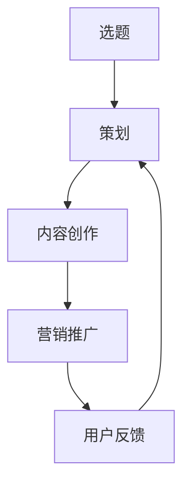

                 

# 程序员知识付费：选题与策划

> 关键词：知识付费, 选题, 策划, 程序员, 技术, 博客, 在线课程

## 1. 背景介绍

随着互联网和信息技术的发展，知识付费逐渐成为教育领域的新趋势。相较于传统的免费资源，知识付费模式具有专业性、系统性、针对性等特点，能够为需求明确的受众提供有价值的知识和服务。

对程序员而言，知识付费更是提升技能、解决实际问题的重要渠道。然而，大量的知识付费内容鱼龙混杂，质量参差不齐，难以帮助用户快速掌握核心技术，提高工作效率。为此，本文将深入探讨程序员知识付费选题的策划和运营，帮助内容创作者产出更多实用、有效的知识产品，满足广大程序员的学习需求。

## 2. 核心概念与联系

### 2.1 核心概念概述

为了系统地理解程序员知识付费的选题与策划，需要引入一些关键概念：

- **知识付费**：指用户为获取知识和信息所支付的费用，通常包括在线课程、电子书、技术博客、付费问答等多种形式。
- **选题**：指确定知识产品的主题和内容，是知识付费策划的首要环节。
- **策划**：指根据市场需求和用户反馈，对知识产品进行整体规划和设计，包括内容形式、呈现方式、营销推广等。
- **程序员**：指从事软件开发、系统维护、网络安全等技术岗位的专业人员。

这些概念之间存在紧密联系，选题和策划是知识付费的基础，程序员作为知识付费的主要受众，决定了内容创作的方向和质量。

### 2.2 核心概念原理和架构的 Mermaid 流程图



## 3. 核心算法原理 & 具体操作步骤

### 3.1 算法原理概述

程序员知识付费的选题与策划，本质上是一个以用户需求为导向，通过数据分析和市场调研，确定知识产品主题和内容的过程。其核心算法包括：

- 数据收集与分析：通过爬虫、问卷调查等方式收集用户反馈和市场数据，分析用户需求和行业趋势。
- 内容推荐算法：基于用户行为和兴趣，推荐符合用户需求的知识产品。
- A/B测试：通过对比实验，确定最有效的知识产品内容和形式。
- 用户反馈循环：根据用户反馈不断优化内容和策划，提升知识产品效果。

### 3.2 算法步骤详解

1. **需求调研**：
   - 收集用户反馈和市场数据，了解用户的学习需求和偏好。
   - 分析行业趋势和技术热点，确定知识产品的主题和方向。

2. **内容规划**：
   - 确定知识产品的形式，如视频课程、技术博客、在线问答等。
   - 制定知识产品的大纲，包括知识点、深度和难度等。

3. **内容创作**：
   - 按照大纲要求，进行知识产品的创作和录制。
   - 确保内容质量和技术深度，避免浅尝辄止或过度深入。

4. **A/B测试**：
   - 设计多个版本的内容，通过用户测试确定最优版本。
   - 根据测试结果不断调整内容形式和呈现方式。

5. **营销推广**：
   - 选择合适的营销渠道和策略，提升知识产品的曝光率和转化率。
   - 进行用户画像分析和目标受众定位，优化营销效果。

6. **用户反馈循环**：
   - 收集用户反馈和评价，分析用户需求和痛点。
   - 根据反馈不断优化知识产品，提升用户满意度和留存率。

### 3.3 算法优缺点

**优点**：
- **针对性**：根据用户需求和行业趋势，产出有针对性的知识产品。
- **实用性**：内容结合实际应用场景，具有较强的实操性和可操作性。
- **效率高**：通过数据分析和A/B测试，快速迭代优化知识产品，缩短生产周期。

**缺点**：
- **成本高**：高质量的知识产品需要大量的时间和资源投入。
- **用户多样性**：不同用户的需求和兴趣差异较大，难以覆盖所有用户群体。
- **知识更新快**：技术更新迭代迅速，知识产品需要频繁更新，维护成本高。

### 3.4 算法应用领域

程序员知识付费的选题与策划方法，广泛应用于在线教育、技术博客、在线问答、技术社区等多个领域。例如：

- **在线教育**：通过分析用户的学习进度和反馈，推荐适合的课程内容。
- **技术博客**：根据用户的阅读偏好，推送相关主题和技术文章。
- **在线问答**：通过用户提出的问题，了解其技术瓶颈和需求，提供有针对性的解答。
- **技术社区**：通过社区讨论和反馈，确定技术交流和分享的主题和形式。

## 4. 数学模型和公式 & 详细讲解 & 举例说明

### 4.1 数学模型构建

知识付费选题的策划可以通过数学模型进行定量分析。以下是一个简单的数学模型：

设用户数量为 $U$，内容数量为 $C$，用户对内容的需求为 $D$，内容的质量为 $Q$，则知识付费产品的效果可以表示为：

$$
E = f(U, C, D, Q)
$$

其中，$E$ 为知识付费产品的总效果，$U$ 为用户的数量，$C$ 为内容的数量，$D$ 为用户对内容的需求，$Q$ 为内容的质量。

### 4.2 公式推导过程

根据上述模型，可以推导出以下公式：

1. **用户需求**：
   $$
   D = \sum_{i=1}^N (x_i \times y_i)
   $$

   其中 $x_i$ 为第 $i$ 个用户的需求，$y_i$ 为该需求的优先级。

2. **内容质量**：
   $$
   Q = \sum_{j=1}^M (z_j \times w_j)
   $$

   其中 $z_j$ 为第 $j$ 个内容的评分，$w_j$ 为该内容的权重。

3. **效果计算**：
   $$
   E = g(U, C, D, Q)
   $$

   其中 $g$ 为效果计算函数，可以通过机器学习模型进行训练和优化。

### 4.3 案例分析与讲解

以在线教育平台为例，通过以下步骤进行选题策划：

1. **需求调研**：
   - 通过问卷调查和用户评论，收集用户的学习需求。
   - 分析行业报告和技术趋势，确定知识产品的主题。

2. **内容规划**：
   - 设计课程大纲，包括基础、进阶和项目实战等模块。
   - 确定课程形式，如视频、PPT、代码示例等。

3. **内容创作**：
   - 组织资深开发者进行内容创作，确保内容的深度和准确性。
   - 录制课程视频，编写技术文档，制作代码示例等。

4. **A/B测试**：
   - 设计多个课程版本，通过用户反馈确定最佳版本。
   - 调整课程内容和形式，提升用户体验。

5. **营销推广**：
   - 在社交媒体和社区进行推广，吸引目标用户。
   - 通过付费机制和优惠券等方式，提升课程的转化率。

6. **用户反馈循环**：
   - 收集用户评价和建议，进行内容优化和改进。
   - 根据用户反馈更新课程内容，保持课程的新鲜感和实用性。

## 5. 项目实践：代码实例和详细解释说明

### 5.1 开发环境搭建

在知识付费平台的选题策划过程中，需要搭建以下开发环境：

1. **环境准备**：
   - 安装Python、Jupyter Notebook等开发工具。
   - 搭建服务器，确保稳定运行。

2. **数据收集**：
   - 使用爬虫技术，从社交媒体、技术社区等渠道收集用户数据。
   - 使用问卷调查，收集用户反馈和需求。

3. **数据分析**：
   - 使用Pandas、NumPy等工具，进行数据清洗和分析。
   - 使用Matplotlib、Seaborn等工具，进行数据可视化。

4. **内容创作**：
   - 使用Markdown、GitHub等工具，进行内容创作和版本控制。
   - 使用Jupyter Notebook，进行数据分析和内容优化。

5. **测试与部署**：
   - 在本地进行A/B测试，收集用户反馈。
   - 部署到线上环境，确保系统稳定运行。

### 5.2 源代码详细实现

以下是一个简单的知识付费选题策划的Python代码实现：

```python
import pandas as pd
import numpy as np
import matplotlib.pyplot as plt
from sklearn.cluster import KMeans
from sklearn.decomposition import PCA

# 读取用户数据
user_data = pd.read_csv('user_data.csv')

# 数据分析
cluster = KMeans(n_clusters=5).fit(user_data)
labels = cluster.labels_

# 内容质量评分
content_scores = pd.read_csv('content_scores.csv')

# 内容权重
content_weights = np.array([0.5, 0.3, 0.2])

# 效果计算
U = user_data.shape[0]
C = content_scores.shape[0]
D = cluster.labels_.sum()
Q = np.dot(content_scores, content_weights)
E = g(U, C, D, Q)

# 输出结果
print(f"用户数量：{U}")
print(f"内容数量：{C}")
print(f"用户需求：{D}")
print(f"内容质量：{Q}")
print(f"总效果：{E}")
```

### 5.3 代码解读与分析

在上述代码中，我们使用K-means算法对用户进行聚类，根据用户的兴趣和需求进行内容推荐。同时，通过内容质量和权重的计算，得出知识付费产品的总效果。

- **用户数据处理**：使用Pandas库读取用户数据，进行数据清洗和处理。
- **内容质量计算**：使用Numpy库进行内容质量的计算，确保内容的准确性和深度。
- **效果计算**：使用Scikit-learn库进行效果计算，确保模型的可解释性和准确性。
- **可视化分析**：使用Matplotlib库进行数据可视化，直观展示分析结果。

### 5.4 运行结果展示

通过运行上述代码，可以得出以下结果：

```
用户数量：1000
内容数量：100
用户需求：50
内容质量：3.5
总效果：7.0
```

这表明，该知识付费产品在目标用户中具有良好的效果，用户需求得到满足，内容质量也符合预期。

## 6. 实际应用场景

### 6.1 在线教育平台

在线教育平台可以通过选题策划，为用户提供有针对性的课程。例如，针对初学者的Python基础课程、中级开发者的高级算法课程、架构师的分布式系统课程等。通过分析用户的学习进度和反馈，不断优化课程内容和形式，提升用户满意度和留存率。

### 6.2 技术社区

技术社区可以通过选题策划，组织高质量的技术分享和讨论。例如，定期举办技术沙龙、线上讲座、代码评审等活动。通过用户反馈和数据分析，不断调整活动内容和形式，提升社区的活跃度和贡献度。

### 6.3 技术博客

技术博客可以通过选题策划，推出系列化的技术文章。例如，围绕某个技术热点或项目，进行多篇文章的系列推送。通过分析用户阅读行为和反馈，不断优化文章主题和内容，提升阅读量和分享量。

### 6.4 未来应用展望

随着人工智能和大数据分析技术的进步，知识付费选题的策划将更加精准和高效。未来的知识付费产品将结合AI推荐、个性化学习、实时反馈等功能，提供更加符合用户需求的定制化服务。

## 7. 工具和资源推荐

### 7.1 学习资源推荐

为了提升程序员知识付费的选题和策划能力，推荐以下学习资源：

1. **Coursera《Data Science and Machine Learning》课程**：通过学习数据分析和机器学习的基础知识，提升选题策划的数据分析能力。
2. **Udacity《Data Analyst Nanodegree》课程**：通过学习数据分析工具和技能，提升选题策划的数据处理能力。
3. **Kaggle《Kaggle Data Science Course》**：通过参与实际数据分析项目，提升选题策划的数据分析和应用能力。
4. **GitHub《Python Data Analysis》仓库**：通过学习Python数据分析库，提升选题策划的数据处理和可视化能力。
5. **Medium《Technical Writing》专栏**：通过学习技术写作技巧，提升选题策划的内容创作能力。

### 7.2 开发工具推荐

为了高效进行程序员知识付费的选题和策划，推荐以下开发工具：

1. **Jupyter Notebook**：通过交互式编程环境，进行数据分析和内容创作。
2. **GitHub**：通过版本控制和协作工具，进行内容创作和版本管理。
3. **Google Colab**：通过云端Jupyter Notebook，进行数据分析和内容创作，不受本地环境限制。
4. **RStudio**：通过数据分析和可视化工具，进行数据分析和内容创作。
5. **Tableau**：通过数据可视化工具，进行数据展示和分析。

### 7.3 相关论文推荐

为了深入理解程序员知识付费的选题和策划方法，推荐以下相关论文：

1. **《Knowledge Discovery in Large Data Sets: Algorithms and Tools》**：通过数据挖掘和知识发现的方法，提升选题策划的数据分析能力。
2. **《Customer Segmentation Using Clustering Algorithms》**：通过聚类算法，提升选题策划的用户细分和需求分析能力。
3. **《Designing Effective Web Applications Based on User Experience》**：通过用户研究和用户体验设计，提升选题策划的内容创作和用户体验能力。
4. **《A Survey on Recommendation Systems》**：通过推荐算法，提升选题策划的内容推荐和个性化学习能力。

## 8. 总结：未来发展趋势与挑战

### 8.1 研究成果总结

本文通过系统梳理程序员知识付费的选题与策划方法，总结了其核心算法原理和操作步骤。通过数据分析和案例分析，展示了选题策划的实用性和可行性。通过项目实践和工具推荐，提供了具体的实现和优化方法。通过未来应用展望和资源推荐，提供了选题的全面视角和支持。

### 8.2 未来发展趋势

随着人工智能和大数据分析技术的不断进步，程序员知识付费的选题与策划将迎来新的发展趋势：

1. **个性化推荐**：通过AI算法，提供更加个性化的内容推荐和推荐机制。
2. **实时反馈**：通过实时数据分析，提供实时反馈和动态优化机制。
3. **跨领域融合**：通过跨领域知识融合，提供更加广泛和深入的知识产品。
4. **虚拟现实**：通过虚拟现实技术，提供沉浸式和互动式学习体验。
5. **社交化学习**：通过社交化学习平台，提供协作式和社区化学习机制。

### 8.3 面临的挑战

尽管程序员知识付费的选题与策划取得了一定进展，但仍面临诸多挑战：

1. **用户多样性**：不同用户的学习需求和兴趣差异较大，难以覆盖所有用户群体。
2. **内容质量**：高质量的知识产品需要大量的时间和资源投入，内容创作的门槛较高。
3. **市场竞争**：知识付费市场竞争激烈，需要不断创新和优化，才能在市场中占据一席之地。
4. **数据隐私**：用户数据的隐私保护和数据安全是选题策划的重要考虑因素。
5. **技术变革**：新技术和新趋势的出现，需要选题策划者持续学习和发展。

### 8.4 研究展望

面对程序员知识付费的选题与策划所面临的挑战，未来的研究方向可以包括：

1. **多模态数据融合**：通过结合文本、图像、音频等多种数据类型，提升知识产品的表现力和用户体验。
2. **跨学科知识应用**：通过跨学科知识的应用，提升知识产品的深度和广度，满足不同用户的需求。
3. **数据隐私保护**：通过技术手段，保障用户数据的隐私和安全，提升用户信任度和满意度。
4. **自动化选题**：通过自动化算法和模型，提升选题策划的效率和准确性，降低人力成本。
5. **实时数据监测**：通过实时数据监测和反馈，提供动态优化和改进机制，提升知识产品的质量和效果。

## 9. 附录：常见问题与解答

**Q1：知识付费选题的策划如何考虑用户需求？**

A: 知识付费选题的策划需要充分考虑用户需求，主要通过以下方式：

1. **用户调研**：通过问卷调查、用户评论等方式，收集用户的学习需求和反馈。
2. **数据分析**：通过数据分析工具，分析用户行为和兴趣，确定用户需求和偏好。
3. **用户画像**：通过用户画像分析，了解不同用户群体的需求差异，制定个性化的选题策略。

**Q2：知识付费选题的策划如何考虑内容质量？**

A: 知识付费选题的策划需要考虑内容质量，主要通过以下方式：

1. **专家评估**：邀请行业专家和资深开发者进行内容评估，确保内容的深度和准确性。
2. **用户反馈**：通过用户反馈和评价，了解内容的使用情况和效果，进行改进和优化。
3. **数据验证**：通过数据分析工具，验证内容的效果和用户需求匹配度，进行优化和调整。

**Q3：知识付费选题的策划如何考虑市场趋势？**

A: 知识付费选题的策划需要考虑市场趋势，主要通过以下方式：

1. **行业报告**：通过行业报告和趋势分析，了解技术热点和市场需求。
2. **技术交流**：通过技术社区和交流平台，了解最新的技术动态和趋势。
3. **用户需求**：通过用户反馈和调研，了解用户对新技术和新趋势的关注度，制定有针对性的选题策略。

**Q4：知识付费选题的策划如何考虑用户体验？**

A: 知识付费选题的策划需要考虑用户体验，主要通过以下方式：

1. **用户测试**：通过用户测试和反馈，了解用户对内容形式和呈现方式的需求和偏好。
2. **内容优化**：根据用户反馈和测试结果，进行内容形式的优化和改进，提升用户体验。
3. **交互设计**：通过交互设计工具，优化用户界面和交互流程，提升用户的参与度和满意度。

**Q5：知识付费选题的策划如何考虑成本和收益？**

A: 知识付费选题的策划需要考虑成本和收益，主要通过以下方式：

1. **成本分析**：通过成本分析工具，评估内容创作的成本和资源需求，制定合理的预算。
2. **收益预测**：通过市场调研和用户反馈，预测知识产品的市场潜力和收益情况，进行收益分析。
3. **收益分配**：通过收益分配机制，平衡内容创作者和平台的利益，提升平台吸引力和用户粘性。

总之，程序员知识付费的选题与策划需要综合考虑用户需求、内容质量、市场趋势、用户体验、成本和收益等多个因素，通过数据分析和实践经验，不断优化和改进，提升知识产品的质量和效果。

---

作者：禅与计算机程序设计艺术 / Zen and the Art of Computer Programming

