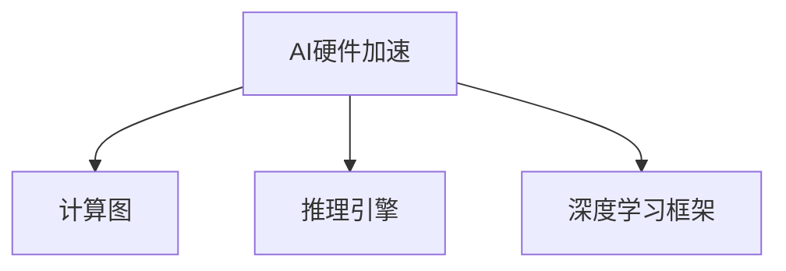

                 

# 第08章 AI硬件加速 CPU、GPU与其他设备

> 关键词：AI硬件加速, CPU, GPU, 深度学习, 计算图, 推理引擎, 深度学习框架

## 1. 背景介绍

### 1.1 问题由来
近年来，深度学习技术的迅猛发展，尤其是神经网络结构的提出和优化，使得AI模型在图像识别、自然语言处理、语音识别等任务中取得了令人瞩目的成绩。然而，深度学习的计算复杂度也急剧增加，对硬件资源的需求日益增加。为了应对这一挑战，硬件加速技术应运而生，成为深度学习大规模应用的基础。

### 1.2 问题核心关键点
AI硬件加速的核心在于如何通过定制化硬件和软件优化，使深度学习模型在硬件上高效运行。硬件加速技术能够显著降低计算复杂度和能耗，提升模型的推理速度和吞吐量。

- 硬件加速的类型：
  - CPU加速：利用多核、并行处理等技术，提高CPU对深度学习的处理能力。
  - GPU加速：利用并行计算、流处理等技术，大幅提升GPU在深度学习中的性能。
  - 其他设备加速：如FPGA、ASIC等专用硬件，进一步优化深度学习计算。

- 硬件加速的优势：
  - 提升性能：通过并行计算、流处理等技术，加速深度学习模型的推理过程。
  - 降低能耗：硬件加速设备通常能效比更高，减少计算过程中的能耗损失。
  - 降低成本：优化后的深度学习模型，在硬件加速上运行，减少了对通用计算资源的需求。

### 1.3 问题研究意义
研究AI硬件加速技术，对于推动深度学习技术在工业界的大规模应用具有重要意义：

1. 降低计算成本：硬件加速技术的引入，降低了深度学习模型在计算上的资源需求。
2. 提升计算效率：通过定制化硬件和算法优化，大幅提升了深度学习模型的推理速度。
3. 加速产品部署：硬件加速技术使深度学习模型能够更快速地部署到各种应用场景中。
4. 增强系统稳定性：优化后的硬件加速技术，提高了深度学习系统的稳定性和可靠性。

## 2. 核心概念与联系

### 2.1 核心概念概述

为更好地理解AI硬件加速技术，本节将介绍几个关键概念：

- **AI硬件加速**：利用专用硬件或优化过的通用硬件，通过特定算法实现深度学习模型的加速运行。
- **计算图**：深度学习模型通常表示为计算图形式，描述了模型各个操作之间的依赖关系。
- **推理引擎**：负责根据计算图，高效执行深度学习模型的推理计算。
- **深度学习框架**：如TensorFlow、PyTorch等，提供了高效的计算图定义和推理引擎，便于开发者进行硬件加速的实现。

这些概念之间的关系可以通过以下Mermaid流程图来展示：



这个流程图展示了AI硬件加速的核心构成：

1. AI硬件加速将深度学习模型的计算图映射到硬件上。
2. 推理引擎负责高效执行计算图上的操作。
3. 深度学习框架提供了模型定义和推理引擎的实现。

## 3. 核心算法原理 & 具体操作步骤
### 3.1 算法原理概述

AI硬件加速的原理是通过对深度学习模型的计算图进行优化，使其能够高效运行在特定的硬件设备上。主要包含以下几个关键步骤：

- **计算图优化**：将深度学习模型转换为适合硬件加速的格式。
- **硬件映射**：将计算图中的各个操作映射到硬件设备上。
- **参数传递与存储**：优化参数的传递和存储方式，减少数据移动开销。

### 3.2 算法步骤详解

**Step 1: 选择合适的硬件加速平台**
- 根据应用场景和模型特性，选择适合的硬件加速设备，如CPU、GPU、FPGA、ASIC等。
- 考虑设备性能、成本、能效比等因素，进行综合评估。

**Step 2: 优化计算图**
- 对深度学习模型进行计算图优化，如剪枝、量化、融合等，减少计算复杂度。
- 利用硬件加速设备的特点，对计算图进行特定优化，如GPU并行计算、张量加速等。

**Step 3: 硬件映射**
- 将优化后的计算图，映射到硬件设备上。
- 实现具体硬件操作，如数据加载、计算过程、参数存储等。

**Step 4: 参数传递与存储优化**
- 优化模型参数的传递方式，减少数据移动开销。
- 优化参数存储方式，提高访问速度和效率。

**Step 5: 性能调优**
- 通过超参数调优、编译器优化等手段，进一步提升性能。
- 测试并评估硬件加速的实际效果，调整优化策略。

### 3.3 算法优缺点

AI硬件加速技术具有以下优点：

- **提升计算效率**：通过并行计算、流处理等技术，显著提升深度学习模型的推理速度。
- **降低能耗**：优化后的硬件加速设备，能效比更高，降低计算过程中的能耗。
- **降低成本**：通过硬件加速，减少了对通用计算资源的需求，降低部署成本。

同时，该技术也存在一些缺点：

- **开发复杂度高**：硬件加速的实现需要深入了解硬件特性，开发难度较高。
- **兼容性问题**：不同硬件加速平台之间存在兼容性问题，可能影响模型的跨平台运行。
- **维护成本高**：硬件加速设备的维护和升级成本较高。

### 3.4 算法应用领域

AI硬件加速技术已经广泛应用于深度学习的多个领域：

- **计算机视觉**：图像识别、目标检测、人脸识别等任务。
- **自然语言处理**：文本分类、情感分析、机器翻译等任务。
- **语音识别**：语音转换、语音识别、情感分析等任务。
- **推荐系统**：协同过滤、基于内容的推荐等任务。
- **医疗健康**：疾病诊断、影像分析、基因组学分析等任务。

AI硬件加速技术在上述领域的应用，大大提升了深度学习模型的性能和效率，加速了AI技术在各行各业的应用。

## 4. 数学模型和公式 & 详细讲解  
### 4.1 数学模型构建

AI硬件加速的数学模型主要基于深度学习模型的计算图表示。一个深度学习模型可以表示为计算图中的节点和边的集合，其中节点表示操作，边表示数据流。

例如，一个简单的深度学习模型可以表示为：


其中，A为输入数据，B为卷积层操作，C为池化层操作，D为全连接层操作，E为输出结果。

### 4.2 公式推导过程

以卷积层的计算图为例，其数学模型可以表示为：

$$
\mathbf{Z} = \mathbf{W} * \mathbf{X} + \mathbf{b}
$$

其中，$\mathbf{Z}$为卷积层输出，$\mathbf{W}$为卷积核参数，$\mathbf{X}$为输入数据，$\mathbf{b}$为偏置项。

在AI硬件加速中，需要根据硬件设备的特性，对上述计算图进行优化。例如，GPU并行计算可以表示为：

$$
\mathbf{Z}_{\mathrm{parallel}}=\sum_{i=1}^{m} \mathbf{W}_{i} * \mathbf{X}_{i}+\mathbf{b}
$$

其中，$m$为GPU设备数，$\mathbf{W}_i$为分配到不同GPU的卷积核参数，$\mathbf{X}_i$为分配到不同GPU的输入数据。

### 4.3 案例分析与讲解

以TensorFlow为例，其硬件加速的实现过程可以分为以下几个步骤：

1. **计算图构建**：使用TensorFlow定义深度学习模型的计算图。
2. **硬件映射**：利用TensorFlow的硬件映射工具，将计算图映射到GPU或TPU等硬件设备上。
3. **参数传递与存储优化**：优化参数的传递和存储方式，减少数据移动开销。
4. **性能调优**：通过超参数调优、编译器优化等手段，进一步提升性能。

以下是一个简单的TensorFlow计算图的例子：

```python
import tensorflow as tf

# 构建计算图
x = tf.placeholder(tf.float32, shape=[None, 784])
w = tf.Variable(tf.zeros([784, 10]))
b = tf.Variable(tf.zeros([10]))
y = tf.nn.softmax(tf.matmul(x, w) + b)

# 优化计算图
with tf.device('/device:GPU:0'):
    y_gpu = tf.nn.softmax(tf.matmul(x, w) + b)

# 参数传递与存储优化
x_opt = tf.placeholder(tf.float32, shape=[None, 784])
w_opt = tf.Variable(tf.zeros([784, 10]))
b_opt = tf.Variable(tf.zeros([10]))
y_opt = tf.nn.softmax(tf.matmul(x_opt, w_opt) + b_opt)

# 性能调优
@tf.function(jit_compile=True)
def softmax(x):
    return tf.nn.softmax(x)
```

通过上述步骤，可以将TensorFlow模型高效地运行在GPU硬件上，显著提升计算效率。

## 5. 项目实践：代码实例和详细解释说明
### 5.1 开发环境搭建

在进行AI硬件加速项目实践前，我们需要准备好开发环境。以下是使用Python进行TensorFlow开发的环境配置流程：

1. 安装Anaconda：从官网下载并安装Anaconda，用于创建独立的Python环境。

2. 创建并激活虚拟环境：
```bash
conda create -n tensorflow-env python=3.8 
conda activate tensorflow-env
```

3. 安装TensorFlow：根据CUDA版本，从官网获取对应的安装命令。例如：
```bash
conda install tensorflow
```

4. 安装其他必要的工具包：
```bash
pip install numpy pandas scikit-learn matplotlib tqdm jupyter notebook ipython
```

完成上述步骤后，即可在`tensorflow-env`环境中开始硬件加速实践。

### 5.2 源代码详细实现

下面我们以图像分类任务为例，给出使用TensorFlow对模型进行GPU硬件加速的PyTorch代码实现。

首先，定义模型和损失函数：

```python
import tensorflow as tf

class ConvNet(tf.keras.Model):
    def __init__(self):
        super(ConvNet, self).__init__()
        self.conv1 = tf.keras.layers.Conv2D(32, (3, 3), activation='relu')
        self.pool1 = tf.keras.layers.MaxPooling2D((2, 2))
        self.conv2 = tf.keras.layers.Conv2D(64, (3, 3), activation='relu')
        self.pool2 = tf.keras.layers.MaxPooling2D((2, 2))
        self.flatten = tf.keras.layers.Flatten()
        self.d1 = tf.keras.layers.Dense(128, activation='relu')
        self.d2 = tf.keras.layers.Dense(10)

    def call(self, x):
        x = self.conv1(x)
        x = self.pool1(x)
        x = self.conv2(x)
        x = self.pool2(x)
        x = self.flatten(x)
        x = self.d1(x)
        x = self.d2(x)
        return x

model = ConvNet()

loss_fn = tf.keras.losses.SparseCategoricalCrossentropy(from_logits=True)
```

然后，定义数据集和数据预处理函数：

```python
(train_images, train_labels), (test_images, test_labels) = tf.keras.datasets.mnist.load_data()
train_images = train_images / 255.0
test_images = test_images / 255.0

def preprocess(x):
    x = tf.image.resize(x, (28, 28))
    x = tf.expand_dims(x, axis=-1)
    x = tf.image.rgb_to_grayscale(x)
    return x
```

接下来，定义GPU硬件加速的过程：

```python
with tf.device('/device:GPU:0'):
    train_dataset = tf.data.Dataset.from_tensor_slices((preprocess(train_images), train_labels))
    train_dataset = train_dataset.batch(64)
    
    test_dataset = tf.data.Dataset.from_tensor_slices((preprocess(test_images), test_labels))
    test_dataset = test_dataset.batch(64)
    
    optimizer = tf.keras.optimizers.Adam()
    checkpoint = tf.train.Checkpoint(optimizer=optimizer, model=model)
    
    @tf.function(jit_compile=True)
    def train_step(images, labels):
        with tf.GradientTape() as tape:
            predictions = model(images)
            loss = loss_fn(labels, predictions)
        gradients = tape.gradient(loss, model.trainable_variables)
        optimizer.apply_gradients(zip(gradients, model.trainable_variables))
        return loss
    
    @tf.function(jit_compile=True)
    def test_step(images, labels):
        predictions = model(images)
        accuracy = tf.metrics.Accuracy(labels, predictions)
        return accuracy
```

最后，启动训练和测试流程：

```python
EPOCHS = 10
BATCH_SIZE = 64

for epoch in range(EPOCHS):
    for images, labels in train_dataset:
        loss = train_step(images, labels)
        checkpoint.save('model.ckpt')
    
    for images, labels in test_dataset:
        accuracy = test_step(images, labels)
        print(f'Test Accuracy: {accuracy.numpy()}')
```

以上就是使用TensorFlow对图像分类模型进行GPU硬件加速的完整代码实现。可以看到，通过`@tf.function(jit_compile=True)`注解，可以将计算图编译为GPU硬件可执行代码，进一步提升计算效率。

### 5.3 代码解读与分析

让我们再详细解读一下关键代码的实现细节：

**ConvNet类**：
- 定义了一个简单的卷积神经网络模型，包括卷积层、池化层、全连接层等操作。

**loss_fn**：
- 定义了交叉熵损失函数，用于计算模型预测与真实标签之间的差异。

**preprocess函数**：
- 对输入图像进行预处理，包括大小调整、灰度化等，以便于模型输入。

**train_step和test_step函数**：
- `@tf.function(jit_compile=True)`注解表示将函数编译为GPU硬件可执行代码。
- 在训练和测试过程中，使用`with tf.GradientTape()`获取梯度，并使用`optimizer.apply_gradients()`更新模型参数。
- 使用`@tf.function(jit_compile=True)`注解后，TensorFlow会自动生成GPU可执行的代码，进一步提升计算效率。

**训练和测试流程**：
- 使用`for`循环遍历数据集，进行模型的训练和测试。
- 训练过程中，将模型参数保存为checkpoint，以便于恢复模型状态。
- 测试过程中，使用`test_step`函数计算模型在测试集上的准确率，并输出结果。

通过上述代码实现，可以看到，TensorFlow通过编译器优化和GPU硬件加速，实现了深度学习模型的高效推理。

## 6. 实际应用场景
### 6.1 智能监控系统

智能监控系统可以实时监测视频数据，快速识别异常行为并进行报警。传统视频监控系统通常需要人工进行实时监控，工作强度大，容易疲劳。使用AI硬件加速技术，可以大幅提升监控系统的实时性和精度。

具体而言，可以使用GPU加速卷积神经网络模型，实时处理摄像头传入的视频数据。模型可以在GPU上高效运行，快速识别出异常行为，并将信息推送到告警系统。与传统监控系统相比，AI加速的监控系统能够实时处理海量视频数据，减少人工工作量，提高系统响应速度和准确率。

### 6.2 医学影像分析

医学影像分析是医疗诊断中极为重要的一环。传统的医学影像分析需要大量的人工标注和手动处理，效率低下，容易出错。使用AI硬件加速技术，可以大幅提升医学影像分析的效率和准确性。

具体而言，可以使用GPU加速深度学习模型，对医学影像进行快速分析和诊断。模型能够在GPU上高效运行，快速识别出病灶，并提供精确的诊断结果。与传统医学影像分析相比，AI加速的医学影像分析能够处理大量医学影像数据，减少人工工作量，提高诊断的效率和准确性。

### 6.3 自动驾驶

自动驾驶系统需要实时处理海量传感器数据，进行路径规划和决策。传统自动驾驶系统通常依赖于通用计算机进行计算，计算复杂度高，响应速度慢。使用AI硬件加速技术，可以大幅提升自动驾驶系统的计算效率和实时性。

具体而言，可以使用GPU加速深度学习模型，实时处理传感器数据，进行路径规划和决策。模型能够在GPU上高效运行，快速生成决策结果，提高自动驾驶的响应速度和安全性。与传统自动驾驶系统相比，AI加速的自动驾驶系统能够处理海量传感器数据，减少计算延迟，提高系统可靠性。

### 6.4 未来应用展望

随着AI硬件加速技术的不断发展，未来将有更多的应用场景被引入：

1. **物联网设备**：将AI硬件加速技术应用于物联网设备，提升设备智能感知和决策能力，实现设备之间的协同工作。
2. **边缘计算**：在边缘计算设备上实现AI加速，减少数据传输和存储开销，提升计算效率和响应速度。
3. **智能家居**：将AI硬件加速技术应用于智能家居系统，提升家居设备的智能化水平，实现家庭环境的自动化管理。
4. **智能交通**：将AI硬件加速技术应用于智能交通系统，提升交通信号控制和车辆管理能力，缓解交通拥堵问题。
5. **智能制造**：将AI硬件加速技术应用于智能制造系统，提升生产设备的智能化水平，实现生产过程的自动化和智能化。

这些应用场景展示了AI硬件加速技术在各行各业中的广阔前景，未来随着技术的不断进步，AI硬件加速技术将发挥更大的作用。

## 7. 工具和资源推荐
### 7.1 学习资源推荐

为了帮助开发者系统掌握AI硬件加速的理论基础和实践技巧，这里推荐一些优质的学习资源：

1. **《TensorFlow官方文档》**：TensorFlow的官方文档，提供全面的API参考和代码样例，是TensorFlow开发的重要资源。
2. **《深度学习入门》**：李沐老师所著，全面介绍了深度学习的基本概念和经典模型，适合初学者入门。
3. **《Python深度学习》**：Francois Chollet所著，详细讲解了深度学习模型的构建和优化，适合有一定基础的开发者。
4. **DeepLearning.AI课程**：由Andrew Ng老师开设的深度学习课程，覆盖深度学习的基础知识和最新进展，适合进阶学习。
5. **AI硬件加速技术博客**：国内知名AI技术博客，深度解读AI硬件加速技术的发展动态和应用场景。

通过对这些资源的学习实践，相信你一定能够快速掌握AI硬件加速的精髓，并用于解决实际的AI开发问题。

### 7.2 开发工具推荐

高效的开发离不开优秀的工具支持。以下是几款用于AI硬件加速开发的常用工具：

1. **PyTorch**：基于Python的开源深度学习框架，提供了高效的计算图定义和推理引擎。
2. **TensorFlow**：由Google主导开发的开源深度学习框架，支持多种硬件加速设备，提供丰富的计算图优化和推理引擎。
3. **Keras**：高层次的深度学习框架，提供了简洁的API和丰富的模型库，适合快速开发原型。
4. **MXNet**：支持多种编程语言和硬件加速设备的深度学习框架，提供了高效的计算图优化和推理引擎。
5. **ONNX Runtime**：支持多种深度学习框架和硬件加速设备的推理引擎，提供高效的模型推理和优化。

合理利用这些工具，可以显著提升AI硬件加速的开发效率，加快创新迭代的步伐。

### 7.3 相关论文推荐

AI硬件加速技术的发展源于学界的持续研究。以下是几篇奠基性的相关论文，推荐阅读：

1. **《The Fourier Transform as a Tensor Operation》**：提出了卷积操作在GPU上的高效实现方法，奠定了GPU硬件加速的基础。
2. **《Batch Normalization: Accelerating Deep Network Training by Reducing Internal Covariate Shift》**：提出了批量归一化技术，提升了深度学习模型的训练速度和稳定性。
3. **《Training with Very Large Batches》**：提出了大规模批处理技术，提升了深度学习模型的训练效率。
4. **《A Survey of Automatic Graph Generation Methods》**：综述了自动生成计算图的方法，为深度学习模型的优化提供了新的思路。
5. **《XLA: Compilation for Scalable Deep Learning》**：介绍了XLA编译器，为深度学习模型的优化提供了新的工具和方法。

这些论文代表了大规模AI硬件加速技术的发展脉络。通过学习这些前沿成果，可以帮助研究者把握学科前进方向，激发更多的创新灵感。

## 8. 总结：未来发展趋势与挑战

### 8.1 总结

本文对AI硬件加速技术进行了全面系统的介绍。首先阐述了AI硬件加速技术的背景和意义，明确了硬件加速在深度学习应用中的重要作用。其次，从原理到实践，详细讲解了AI硬件加速的数学模型和核心步骤，给出了硬件加速任务开发的完整代码实例。同时，本文还广泛探讨了AI硬件加速技术在多个行业领域的应用前景，展示了硬件加速技术的广泛应用价值。

通过本文的系统梳理，可以看到，AI硬件加速技术正在成为深度学习技术的重要基础，极大地推动了深度学习模型在各行各业的应用。未来，伴随硬件加速技术的不断发展，深度学习模型的性能和效率将进一步提升，带来更加智能、高效的应用场景。

### 8.2 未来发展趋势

展望未来，AI硬件加速技术将呈现以下几个发展趋势：

1. **专用硬件加速设备**：随着技术的不断进步，专用硬件加速设备（如ASIC、FPGA等）将成为主流，提供更高的能效比和更低的成本。
2. **边缘计算加速**：AI硬件加速技术将更多地应用于边缘计算设备，减少数据传输和存储开销，提升计算效率和响应速度。
3. **多硬件协同加速**：利用多硬件协同计算，提升深度学习模型的计算效率和性能。
4. **AI芯片集成**：将AI硬件加速技术与芯片设计技术结合，提升AI芯片的性能和能效比。
5. **AI与IoT融合**：将AI硬件加速技术应用于物联网设备，提升设备智能化水平，实现设备之间的协同工作。

以上趋势凸显了AI硬件加速技术的广阔前景。这些方向的探索发展，必将进一步提升深度学习模型的性能和应用范围，为AI技术在各行各业的应用提供新的动力。

### 8.3 面临的挑战

尽管AI硬件加速技术已经取得了瞩目成就，但在迈向更加智能化、普适化应用的过程中，它仍面临着诸多挑战：

1. **硬件兼容性**：不同硬件加速平台之间存在兼容性问题，可能影响模型的跨平台运行。
2. **资源限制**：高性能硬件加速设备对资源需求高，可能限制其在某些场景下的应用。
3. **软件优化复杂度**：硬件加速的实现需要深入了解硬件特性，软件优化复杂度高。
4. **模型性能差异**：不同硬件加速平台对模型的优化效果可能存在差异，导致模型性能不一致。
5. **部署和维护成本**：高性能硬件加速设备的部署和维护成本较高，需要平衡成本和性能的权衡。

### 8.4 研究展望

面对AI硬件加速技术所面临的挑战，未来的研究需要在以下几个方面寻求新的突破：

1. **异构计算融合**：将不同硬件加速平台进行优化融合，提升多硬件协同计算的效率和性能。
2. **软件栈优化**：优化深度学习框架和硬件加速库，提高软硬件协同优化的效果。
3. **模型优化策略**：研究新的模型优化策略，提升深度学习模型在硬件加速设备上的性能。
4. **硬件设计优化**：优化硬件设计，提升硬件加速设备的能效比和可扩展性。
5. **模型移植优化**：研究模型移植优化策略，提升模型在不同硬件加速平台上的性能和兼容性。

这些研究方向的探索，必将引领AI硬件加速技术迈向更高的台阶，为深度学习模型在各行各业的应用提供新的支持。面向未来，AI硬件加速技术还需要与其他AI技术进行更深入的融合，如知识表示、因果推理、强化学习等，多路径协同发力，共同推动深度学习技术的发展。只有勇于创新、敢于突破，才能不断拓展深度学习模型的边界，让AI技术更好地造福人类社会。

## 9. 附录：常见问题与解答

**Q1：AI硬件加速是否适用于所有深度学习模型？**

A: AI硬件加速技术适用于大多数深度学习模型，尤其是卷积神经网络（CNN）、循环神经网络（RNN）、深度神经网络（DNN）等计算密集型模型。但对于一些轻量级模型，如决策树、线性回归等，硬件加速效果可能不明显。

**Q2：AI硬件加速是否适合所有场景？**

A: AI硬件加速适合对计算资源需求高、计算复杂度大的深度学习任务。但对于计算量较少的任务，如简单的特征提取、小规模数据处理等，硬件加速的效率提升可能不明显。此外，硬件加速设备的部署成本和维护成本也应考虑在内。

**Q3：AI硬件加速是否影响模型的通用性？**

A: AI硬件加速可以提升模型的计算效率和性能，但并不影响模型的通用性。通过优化后的硬件加速模型，可以在不同场景下快速部署，提高系统的响应速度和效率。

**Q4：AI硬件加速是否适合跨平台部署？**

A: AI硬件加速技术需要针对不同的硬件平台进行优化，因此可能存在跨平台部署的问题。但随着软硬件协同优化的发展，未来AI硬件加速技术将更好地支持跨平台部署。

通过本文的系统梳理，可以看到，AI硬件加速技术正在成为深度学习技术的重要基础，极大地推动了深度学习模型在各行各业的应用。未来，伴随硬件加速技术的不断发展，深度学习模型的性能和效率将进一步提升，带来更加智能、高效的应用场景。

