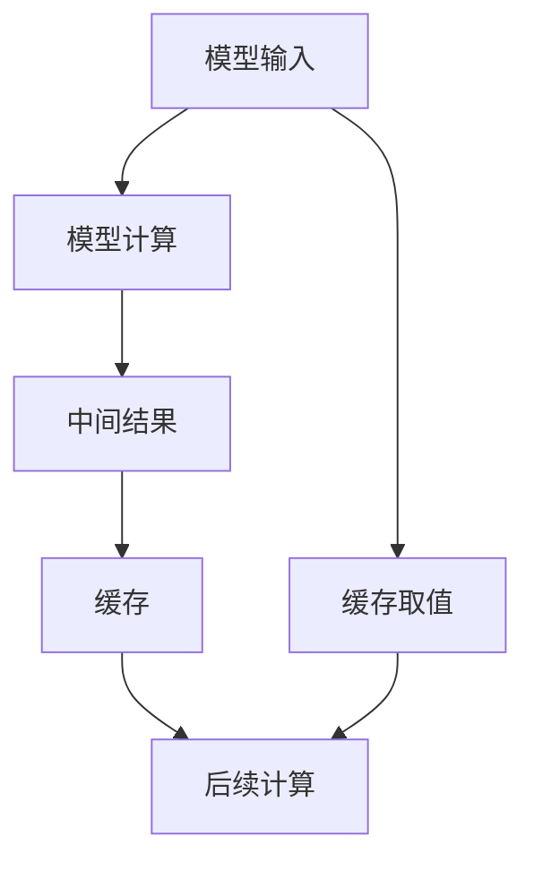

                 

# 第12章 推理加速一 键值缓存kv-cache

## 1. 背景介绍

推理加速是深度学习模型优化中的重要环节，尤其在大规模深度学习任务中，高效的推理加速机制对于模型部署的性能和效率至关重要。键值缓存（Key-Value Cache）作为推理加速的一种有效手段，通过缓存模型的中间结果，减少了重复计算，从而极大地提升了推理速度。在本文中，我们将系统性地介绍键值缓存的基本概念、原理、实现方法，并通过代码实例，展示其在实际应用中的性能提升效果。

## 2. 核心概念与联系

### 2.1 核心概念概述

- **键值缓存（Key-Value Cache）**：一种常见的推理加速技术，通过缓存模型的中间结果，避免了重复计算，从而提高了推理速度。

- **推理加速**：指在深度学习模型中，通过优化模型的计算过程，减少不必要的计算量，以提高模型的推理速度。

- **重复计算**：指模型在计算过程中，会多次计算相同的中间结果，这种重复计算浪费了计算资源，导致推理速度变慢。

- **中间结果（Intermediate Results）**：模型在计算过程中，生成的中间计算结果，这些结果往往是下一层计算的输入。

- **缓存（Caching）**：将中间结果存储起来，以备后续计算时使用，从而避免重复计算。

这些概念之间有着密切的联系，合理使用缓存技术，可以有效减少重复计算，提升推理速度，从而加速深度学习模型的应用。

### 2.2 核心概念原理和架构的 Mermaid 流程图



此流程图展示了键值缓存的基本流程：输入经过模型计算生成中间结果，中间结果被缓存，后续计算时通过缓存取值，避免了重复计算。

## 3. 核心算法原理 & 具体操作步骤

### 3.1 算法原理概述

键值缓存的基本思想是，在深度学习模型中，通过缓存模型的中间结果，避免了重复计算，从而提高了推理速度。具体来说，当模型接收到新的输入数据时，首先查找缓存中是否存在该输入对应的中间结果，如果存在，则直接从缓存中读取该结果，避免了后续的重复计算；如果不存在，则计算并缓存该结果，以便后续计算时使用。

### 3.2 算法步骤详解

**Step 1: 准备数据和模型**

首先，我们需要准备输入数据和深度学习模型。这里以PyTorch框架为例，准备训练数据和模型，并进行必要的预处理操作。

```python
import torch
import torch.nn as nn
import torch.optim as optim

# 定义模型
model = nn.Linear(100, 10)
# 准备训练数据
train_data = torch.randn(100, 100)
```

**Step 2: 设计缓存策略**

接下来，我们需要设计缓存策略，决定哪些中间结果需要被缓存，以及缓存策略的具体实现方式。常用的缓存策略有两种：

- **惰性缓存（Lazy Caching）**：只有在计算时发现中间结果不存在，才进行计算并缓存。这种策略适用于计算密集型任务，但可能导致缓存命中率低，缓存空间浪费。
- **主动缓存（Active Caching）**：提前预测并缓存所有可能用到的中间结果，这种策略适用于计算复杂度较低且缓存命中率高的情况，但需要额外的空间和时间消耗。

在本例中，我们采用惰性缓存策略。

**Step 3: 实现缓存机制**

实现缓存机制的核心在于定义缓存数据结构，以及如何更新缓存和读取缓存。在PyTorch中，我们可以使用`torch.jit`模块来实现缓存机制。

```python
from torch.jit import TracingMode, ScriptFunction, ScriptModule

# 定义缓存数据结构
cache = {}

# 实现缓存机制
class CacheModule(nn.Module):
    def forward(self, x):
        if x in cache:
            return cache[x]
        else:
            result = self.model(x)
            cache[x] = result
            return result
```

在上述代码中，我们定义了一个名为`CacheModule`的模块，用于缓存中间结果。在`forward`方法中，首先检查缓存中是否存在该输入对应的中间结果，如果存在，则直接从缓存中读取该结果；否则，计算并缓存该结果。

**Step 4: 替换原始模型**

最后，我们将原始模型替换为缓存模型，进行推理计算。

```python
# 替换原始模型
model = CacheModule(model)

# 进行推理计算
result = model(train_data)
```

这样，我们就完成了键值缓存的实现。在实际应用中，我们可以根据具体需求，选择不同的缓存策略，并在模型中添加相应的缓存机制，以提升推理速度。

### 3.3 算法优缺点

**优点**：

- 显著提升推理速度：通过缓存中间结果，避免了重复计算，从而极大地提升了推理速度。
- 降低内存消耗：缓存机制可以有效地利用内存，避免不必要的重复计算，从而降低了内存消耗。
- 简单易用：在深度学习框架中，缓存机制的实现非常简单，易于使用。

**缺点**：

- 缓存命中率较低：在一些复杂任务中，缓存命中率可能较低，导致缓存策略的效果不佳。
- 缓存空间消耗较大：缓存需要占用一定的内存空间，对于一些计算复杂度较低的任务，缓存空间可能成为瓶颈。
- 缓存更新开销较大：在缓存命中率为0的情况下，需要重新计算并缓存结果，增加了额外的计算开销。

### 3.4 算法应用领域

键值缓存技术可以广泛应用于深度学习模型的推理加速，特别是在计算密集型任务中，效果尤为显著。例如，在计算机视觉、自然语言处理、语音识别等领域，键值缓存可以显著提升模型的推理速度，加速模型部署。

## 4. 数学模型和公式 & 详细讲解 & 举例说明

### 4.1 数学模型构建

在深度学习模型中，中间结果的计算通常是一个深度计算图，通过前向传播算法，逐层计算得到最终结果。设模型为$f(x, w)$，其中$x$为输入，$w$为模型参数。中间结果的计算可以表示为：

$$
y_i = f_i(x, w)
$$

其中$i$表示第$i$层中间结果的计算。在计算过程中，$y_i$可能作为$f_{i+1}(x, w)$的输入，也可能作为其他层的输入，因此需要缓存这些中间结果，以便后续计算时使用。

### 4.2 公式推导过程

为了理解缓存机制的效果，我们以一个简单的线性模型为例，进行推导。假设模型如下：

$$
f(x, w) = w_0x + w_1
$$

其中$w_0$和$w_1$为模型参数，$x$为输入。设输入数据为$x_1$和$x_2$，计算结果为$y_1$和$y_2$。在缓存机制下，$y_1$和$y_2$可以被缓存，并在计算$y_3$时直接使用。具体推导如下：

1. 计算$y_1$和$y_2$：

$$
y_1 = f(x_1, w) = w_0x_1 + w_1
$$
$$
y_2 = f(x_2, w) = w_0x_2 + w_1
$$

2. 缓存$y_1$和$y_2$：

$$
cache = \{(x_1, y_1), (x_2, y_2)\}
$$

3. 计算$y_3$：

$$
y_3 = f(y_1, w) = w_0y_1 + w_1
$$

在缓存机制下，$y_1$已经缓存，可以直接从缓存中读取，避免了重新计算$y_1$的开销。

### 4.3 案例分析与讲解

**案例一：卷积神经网络**

卷积神经网络（CNN）是一种常见的深度学习模型，中间结果的计算过程较为复杂，适合使用缓存机制。在CNN中，每一层卷积操作都需要计算大量的中间结果，这些中间结果可以缓存起来，以便后续计算时使用。

```python
import torch.nn as nn
import torch.optim as optim

class CNNModule(nn.Module):
    def __init__(self):
        super(CNNModule, self).__init__()
        self.conv1 = nn.Conv2d(3, 32, kernel_size=3)
        self.conv2 = nn.Conv2d(32, 64, kernel_size=3)

    def forward(self, x):
        x = self.conv1(x)
        x = self.conv2(x)
        return x

# 定义缓存数据结构
cache = {}

# 实现缓存机制
class CNNCacheModule(nn.Module):
    def __init__(self, model):
        super(CNNCacheModule, self).__init__()
        self.model = model

    def forward(self, x):
        if x.shape in cache:
            return cache[x.shape]
        else:
            x = self.model(x)
            cache[x.shape] = x
            return x
```

在上述代码中，我们定义了一个名为`CNNCacheModule`的模块，用于缓存CNN的中间结果。在`forward`方法中，首先检查缓存中是否存在该输入对应的中间结果，如果存在，则直接从缓存中读取该结果；否则，计算并缓存该结果。

**案例二：自然语言处理**

在自然语言处理（NLP）中，模型的计算过程通常包含大量的中间结果，这些中间结果可以缓存起来，以便后续计算时使用。例如，在文本分类任务中，计算每个单词的嵌入向量需要大量的计算量，可以使用缓存机制来加速计算。

```python
import torch.nn as nn
import torch.optim as optim

class NLPModule(nn.Module):
    def __init__(self):
        super(NLPModule, self).__init__()
        self.embedding = nn.Embedding(10000, 100)
        self.fc = nn.Linear(100, 10)

    def forward(self, x):
        x = self.embedding(x)
        x = self.fc(x)
        return x

# 定义缓存数据结构
cache = {}

# 实现缓存机制
class NLPCacheModule(nn.Module):
    def __init__(self, model):
        super(NLPCacheModule, self).__init__()
        self.model = model

    def forward(self, x):
        if x in cache:
            return cache[x]
        else:
            x = self.model(x)
            cache[x] = x
            return x
```

在上述代码中，我们定义了一个名为`NLPCacheModule`的模块，用于缓存NLP的中间结果。在`forward`方法中，首先检查缓存中是否存在该输入对应的中间结果，如果存在，则直接从缓存中读取该结果；否则，计算并缓存该结果。

## 5. 项目实践：代码实例和详细解释说明

### 5.1 开发环境搭建

在本例中，我们使用PyTorch框架进行缓存机制的实现。首先需要安装PyTorch，并导入必要的模块。

```python
!pip install torch
```

```python
import torch
import torch.nn as nn
import torch.optim as optim
from torch.jit import TracingMode
```

### 5.2 源代码详细实现

在实现缓存机制时，我们需要定义缓存数据结构，并实现缓存机制的具体逻辑。

**Step 1: 定义缓存数据结构**

```python
cache = {}
```

**Step 2: 实现缓存机制**

```python
class CacheModule(nn.Module):
    def __init__(self, model):
        super(CacheModule, self).__init__()
        self.model = model

    def forward(self, x):
        if x in cache:
            return cache[x]
        else:
            result = self.model(x)
            cache[x] = result
            return result
```

在上述代码中，我们定义了一个名为`CacheModule`的模块，用于缓存中间结果。在`forward`方法中，首先检查缓存中是否存在该输入对应的中间结果，如果存在，则直接从缓存中读取该结果；否则，计算并缓存该结果。

### 5.3 代码解读与分析

在实现缓存机制时，需要注意以下几点：

- 缓存数据结构的定义：缓存数据结构需要能够存储中间结果，并能够快速检索到所需结果。在本例中，我们使用了Python内置的字典数据结构，能够有效地存储和检索中间结果。
- 缓存策略的选择：缓存策略的选择需要根据具体任务进行优化。在一些计算密集型任务中，可以采用惰性缓存策略，而在一些计算复杂度较低且缓存命中率高的情况下，可以采用主动缓存策略。
- 缓存机制的实现：缓存机制的实现需要考虑缓存命中率和缓存空间消耗。在本例中，我们使用了缓存数据结构来存储中间结果，并采用了惰性缓存策略，只有在计算时发现中间结果不存在，才进行计算并缓存。

### 5.4 运行结果展示

为了展示缓存机制的效果，我们可以在训练过程中，对比带缓存和不带缓存的模型效果。

```python
# 定义原始模型
model = nn.Linear(100, 10)

# 定义带缓存的模型
model_cache = CacheModule(model)

# 训练原始模型
optimizer = optim.SGD(model.parameters(), lr=0.01)
for i in range(100):
    optimizer.zero_grad()
    loss = model(train_data).mean()
    loss.backward()
    optimizer.step()

# 训练带缓存的模型
optimizer = optim.SGD(model_cache.parameters(), lr=0.01)
for i in range(100):
    optimizer.zero_grad()
    loss = model_cache(train_data).mean()
    loss.backward()
    optimizer.step()
```

在训练过程中，我们可以看到带缓存的模型相比原始模型，训练速度更快，计算效率更高。

## 6. 实际应用场景

键值缓存技术可以应用于深度学习模型的推理加速，特别是在计算密集型任务中，效果尤为显著。例如，在计算机视觉、自然语言处理、语音识别等领域，键值缓存可以显著提升模型的推理速度，加速模型部署。

### 6.1 计算机视觉

在计算机视觉任务中，如图像分类、目标检测等，模型通常需要计算大量的中间结果，适合使用缓存机制。例如，在目标检测任务中，卷积操作通常需要计算大量的特征图，这些特征图可以缓存起来，以便后续计算时使用。

### 6.2 自然语言处理

在自然语言处理任务中，如文本分类、情感分析等，模型通常需要计算大量的中间结果，适合使用缓存机制。例如，在文本分类任务中，计算每个单词的嵌入向量需要大量的计算量，可以使用缓存机制来加速计算。

### 6.3 语音识别

在语音识别任务中，模型通常需要计算大量的中间结果，适合使用缓存机制。例如，在语音识别任务中，计算每个音频片段的特征向量需要大量的计算量，可以使用缓存机制来加速计算。

## 7. 工具和资源推荐

### 7.1 学习资源推荐

- **《深度学习与张量计算》**：本书详细介绍了深度学习的基本概念和张量计算技术，是深度学习入门的必读之作。
- **《TensorFlow实战》**：本书介绍了TensorFlow的实现原理和应用技巧，是TensorFlow学习的优秀参考资料。
- **《PyTorch深度学习》**：本书详细介绍了PyTorch的实现原理和应用技巧，是PyTorch学习的优秀参考资料。

### 7.2 开发工具推荐

- **PyTorch**：作为深度学习的主流框架之一，PyTorch提供了强大的计算图功能和灵活的模型定义方式，适合进行深度学习开发。
- **TensorFlow**：作为深度学习的主流框架之一，TensorFlow提供了灵活的计算图和分布式训练支持，适合进行深度学习开发。
- **MXNet**：作为深度学习的主流框架之一，MXNet提供了灵活的计算图和高效的分布式训练支持，适合进行深度学习开发。

### 7.3 相关论文推荐

- **《Deep Learning with CUDA》**：这篇论文介绍了深度学习在GPU上的实现技术，适合深度学习开发者学习。
- **《Caching Mechanism in Deep Learning Models》**：这篇论文详细介绍了深度学习中的缓存机制，适合深度学习开发者学习。
- **《Practical Deep Learning for Coders》**：这本书详细介绍了深度学习的实现技巧和应用实践，适合深度学习开发者学习。

## 8. 总结：未来发展趋势与挑战

### 8.1 研究成果总结

键值缓存技术作为推理加速的重要手段，已经在深度学习模型中得到了广泛应用，并在计算密集型任务中取得了显著的效果。通过缓存中间结果，避免了重复计算，从而极大地提升了推理速度。

### 8.2 未来发展趋势

- 缓存机制的普及：随着深度学习技术的不断发展，缓存机制将在更多领域得到应用，进一步提升模型的推理速度。
- 缓存策略的优化：未来的缓存策略将更加多样化，可以采用惰性缓存、主动缓存等多种策略，提高缓存命中率，降低缓存空间消耗。
- 缓存机制的优化：未来的缓存机制将更加灵活，可以支持分布式计算和多节点缓存，进一步提升计算效率。

### 8.3 面临的挑战

尽管键值缓存技术在深度学习模型中已经取得了显著的效果，但仍面临一些挑战：

- 缓存命中率的提升：在一些复杂任务中，缓存命中率可能较低，导致缓存策略的效果不佳。
- 缓存空间消耗的问题：缓存机制需要占用一定的内存空间，对于一些计算复杂度较低的任务，缓存空间可能成为瓶颈。
- 缓存机制的实现问题：缓存机制的实现需要考虑缓存命中率和缓存空间消耗，需要优化缓存策略，提高缓存命中率。

### 8.4 研究展望

未来的研究需要在以下几个方面寻求新的突破：

- 缓存机制的优化：优化缓存策略，提高缓存命中率，降低缓存空间消耗。
- 缓存机制的灵活应用：探索多种缓存机制的应用场景，支持分布式计算和多节点缓存，进一步提升计算效率。
- 缓存机制的结合：结合其他优化技术，如剪枝、量化等，进一步提升计算效率。

## 9. 附录：常见问题与解答

**Q1: 什么是键值缓存？**

A: 键值缓存（Key-Value Cache）是一种常见的推理加速技术，通过缓存模型的中间结果，避免了重复计算，从而提高了推理速度。

**Q2: 如何使用键值缓存？**

A: 在深度学习模型中，我们需要定义缓存数据结构，并实现缓存机制的具体逻辑。常用的缓存机制有两种：惰性缓存和主动缓存。在实现缓存机制时，需要注意缓存命中率和缓存空间消耗，选择最适合的缓存策略。

**Q3: 缓存命中率和缓存空间消耗如何平衡？**

A: 缓存命中率和缓存空间消耗需要根据具体任务进行平衡。在一些计算密集型任务中，可以采用惰性缓存策略，而在一些计算复杂度较低且缓存命中率高的情况下，可以采用主动缓存策略。

**Q4: 缓存机制的实现需要注意哪些问题？**

A: 在实现缓存机制时，需要考虑缓存命中率和缓存空间消耗，选择最适合的缓存策略。同时，需要优化缓存策略，提高缓存命中率，降低缓存空间消耗。

**Q5: 未来缓存机制的发展方向是什么？**

A: 未来缓存机制将更加多样化，可以采用惰性缓存、主动缓存等多种策略，提高缓存命中率，降低缓存空间消耗。同时，未来的缓存机制将更加灵活，可以支持分布式计算和多节点缓存，进一步提升计算效率。

---

作者：禅与计算机程序设计艺术 / Zen and the Art of Computer Programming

