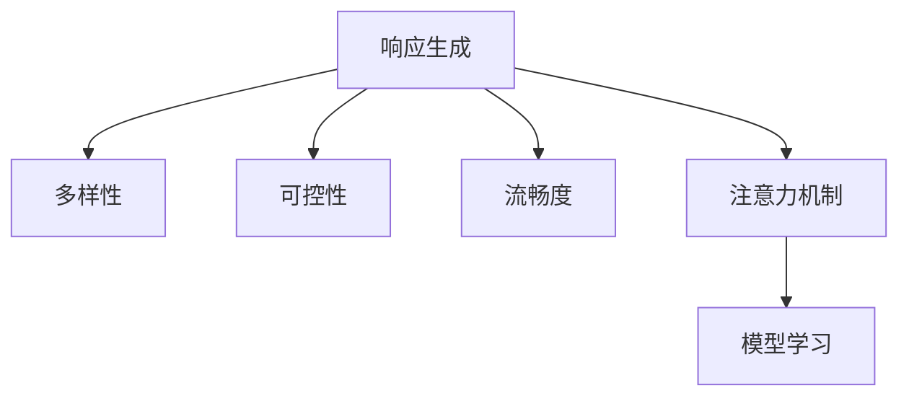

                 

# 第七章：响应生成和多样性

> 关键词：响应生成, 多样性, 文本生成, 对话系统, 生成模型, 注意力机制

## 1. 背景介绍

在人工智能领域，生成和多样性问题长期以来是研究的焦点。从早期的马尔可夫模型到深度学习时代的神经网络，研究人员不断探索如何利用计算机模拟和扩展人类的语言和思维能力。特别是在对话系统、机器翻译和文本摘要等任务上，生成多样化且符合语境的响应一直是技术发展的目标。

### 1.1 问题由来

随着自然语言处理（NLP）技术的不断发展，基于神经网络的生成模型已经成为实现自然语言响应的主流方法。这些模型通过学习大量文本数据，能够生成高质量的自然语言文本。然而，尽管这些模型在生成流畅度、连贯性等方面表现优异，但在多样性、可控性等方面仍存在较大挑战。例如，在对话系统中，如何生成多样化且符合语境的回答，是一个亟待解决的问题。

### 1.2 问题核心关键点

当前，生成和多样性问题主要集中在以下几个方面：

- **多样性**：模型如何生成多样化的响应，避免输出单一、机械的文本。
- **可控性**：模型如何根据上下文生成可控的响应，如基于特定风格的生成。
- **适应性**：模型如何适应不同的语境和对话轮次，产生合适的回答。
- **流畅度**：模型生成的文本是否流畅自然，符合语言的语法和语义规则。

这些问题不仅关系到生成模型的实用性和可扩展性，还直接影响用户体验和系统性能。因此，响应生成和多样性问题亟需深入研究和解决。

## 2. 核心概念与联系

### 2.1 核心概念概述

为了更好地理解响应生成和多样性问题，本节将介绍几个关键概念及其相互之间的联系：

- **响应生成(Sequence Generation)**：指模型根据输入序列生成对应的输出序列，如对话系统中的回应。
- **多样性(Diversity)**：指生成的响应具有多样化的表达方式，避免重复或机械的输出。
- **可控性(Controllability)**：指生成的响应可以根据特定的参数或指令进行控制，如风格、情绪、语域等。
- **流畅度(Fluency)**：指生成的响应在语法、语义上流畅自然，符合语言的表达习惯。
- **注意力机制(Attention Mechanism)**：指在生成过程中，模型可以关注输入序列中的不同部分，以便更好地理解和生成文本。

这些概念之间的逻辑关系可以通过以下Mermaid流程图来展示：



这个流程图展示响应生成和多样性问题的主要概念及其之间的相互联系：

1. 响应生成是生成模型的核心目标，多样性、可控性和流畅度是其评价的重要指标。
2. 注意力机制是实现这些指标的关键技术，帮助模型更好地理解和生成文本。
3. 模型通过学习输入序列和输出序列之间的映射关系，生成符合要求的响应。

## 3. 核心算法原理 & 具体操作步骤

### 3.1 算法原理概述

响应生成和多样性问题的核心算法是生成模型，尤其是基于神经网络的生成模型。这些模型通过学习大量文本数据，生成符合要求的自然语言文本。其核心原理是通过反向传播算法，最小化生成的响应与真实响应的差距，从而提高生成模型的性能。

在具体实现中，生成模型通常使用序列到序列（Seq2Seq）架构，包括编码器、解码器两部分。编码器负责将输入序列转换为中间表示，解码器则根据中间表示生成输出序列。其中，注意力机制是解码器的关键组成部分，帮助模型在生成过程中关注输入序列的不同部分。

### 3.2 算法步骤详解

基于神经网络的生成模型实现响应生成和多样性问题的具体操作步骤如下：

**Step 1: 准备训练数据**

- 收集并清洗大量的对话数据集，包括对话历史、用户意图、响应等。
- 将对话数据集划分为训练集、验证集和测试集。

**Step 2: 构建模型架构**

- 使用Seq2Seq架构构建生成模型，包括编码器和解码器。
- 在解码器中引入注意力机制，帮助模型关注输入序列的关键部分。

**Step 3: 定义损失函数**

- 定义生成模型需要优化的损失函数，如交叉熵损失、BLEU分数等。
- 在损失函数中引入多样性控制项，如温度参数、Top-k抽样等。

**Step 4: 训练模型**

- 使用训练集数据训练模型，最小化损失函数。
- 在训练过程中，定期在验证集上评估模型性能，避免过拟合。
- 使用温度参数、Top-k抽样等技术控制生成响应多样性。

**Step 5: 生成响应**

- 使用测试集数据测试模型性能。
- 根据输入序列生成多样化的响应，满足用户需求。

**Step 6: 模型优化**

- 根据生成响应的质量和多样性，优化模型参数。
- 使用对抗生成技术（Adversarial Generation），进一步提升生成响应的质量。

通过以上步骤，可以构建一个能够生成多样化、可控且流畅响应的生成模型。

### 3.3 算法优缺点

基于神经网络的生成模型在实现响应生成和多样性问题时，具有以下优点：

1. **生成效果好**：通过学习大量文本数据，模型能够生成流畅、连贯的响应。
2. **可控性强**：通过调整生成模型的参数，可以实现不同风格、情绪的生成。
3. **灵活性高**：模型能够适应多种不同的语言和文化，具有高度的通用性。

同时，这些模型也存在一些缺点：

1. **资源消耗大**：生成模型通常需要大量的计算资源和存储空间，尤其是在训练和推理阶段。
2. **生成速度慢**：由于模型复杂，推理速度较慢，难以实时响应。
3. **多样性控制难**：模型容易生成单一、机械的响应，多样性控制难度较大。
4. **公平性问题**：模型可能会生成带有性别偏见、种族偏见等不公平的响应。

## 4. 数学模型和公式 & 详细讲解 & 举例说明

### 4.1 数学模型构建

在生成模型中，我们通常使用Seq2Seq架构，其核心数学模型包括编码器、解码器两部分。

**编码器**：将输入序列转换为中间表示，数学公式为：

$$
\mathbf{h} = f_{enc}(\mathbf{x})
$$

其中，$\mathbf{x}$ 表示输入序列，$\mathbf{h}$ 表示编码器输出的中间表示。

**解码器**：根据中间表示生成输出序列，数学公式为：

$$
\mathbf{y} = f_{dec}(\mathbf{h},\mathbf{c})
$$

其中，$\mathbf{c}$ 表示解码器中的上下文向量，$\mathbf{y}$ 表示解码器输出的序列。

### 4.2 公式推导过程

在解码器中，注意力机制是生成多样性的关键。通过计算输入序列中每个位置的注意力权重，解码器可以关注不同的部分，从而生成更丰富的响应。注意力计算公式如下：

$$
\alpha_{i,j} = \frac{\exp(\mathbf{u}^T \mathbf{W}_k [\mathbf{h}_j, \mathbf{y}_{<j}])}{\sum_{k=1}^K \exp(\mathbf{u}^T \mathbf{W}_k [\mathbf{h}_j, \mathbf{y}_{<j}])}
$$

其中，$\mathbf{u}$ 表示注意力向量，$\mathbf{W}_k$ 表示注意力矩阵，$[\mathbf{h}_j, \mathbf{y}_{<j}]$ 表示编码器的中间表示和解码器已生成的部分。

### 4.3 案例分析与讲解

以对话系统为例，假设输入序列为："你好，请问天气怎么样？"，生成模型需要在输出序列中生成对应的回应。

1. **编码器**：将输入序列转换为中间表示。
2. **解码器**：根据中间表示生成回应。
3. **注意力机制**：在生成过程中，解码器通过计算注意力权重，关注输入序列中的关键部分（如天气相关的信息），从而生成更加多样化和符合语境的回应。

## 5. 项目实践：代码实例和详细解释说明

### 5.1 开发环境搭建

在开始项目实践之前，需要准备Python开发环境，并安装必要的第三方库。

1. 安装Python：
```
sudo apt-get install python3
```

2. 安装TensorFlow：
```
pip install tensorflow
```

3. 安装NLTK库：
```
pip install nltk
```

4. 安装其他依赖库：
```
pip install pandas numpy scipy
```

### 5.2 源代码详细实现

以下是一个简单的对话系统生成模型的代码实现，包括编码器、解码器和注意力机制。

```python
import tensorflow as tf
import numpy as np
import nltk

class Encoder(tf.keras.Model):
    def __init__(self, vocab_size, embedding_dim, enc_units):
        super(Encoder, self).__init__()
        self.embedding = tf.keras.layers.Embedding(vocab_size, embedding_dim)
        self.gru = tf.keras.layers.GRU(enc_units, return_sequences=True, return_state=True)
        
    def call(self, x, hidden):
        x = self.embedding(x)
        output, state = self.gru(x, initial_state=hidden)
        return output, state

class BahdanauAttention(tf.keras.layers.Layer):
    def __init__(self, units):
        super(BahdanauAttention, self).__init__()
        self.W1 = tf.keras.layers.Dense(units)
        self.W2 = tf.keras.layers.Dense(units)
        self.V = tf.keras.layers.Dense(1)
        
    def call(self, query, values):
        query_with_time_axis = tf.expand_dims(query, 1)
        score = self.V(tf.nn.tanh(self.W2(values) + self.W1(query_with_time_axis)))
        attention_weights = tf.nn.softmax(score, axis=1)
        context_vector = attention_weights * values
        context_vector = tf.reduce_sum(context_vector, axis=1)
        return context_vector, attention_weights

class Decoder(tf.keras.Model):
    def __init__(self, vocab_size, embedding_dim, dec_units, attention):
        super(Decoder, self).__init__()
        self.embedding = tf.keras.layers.Embedding(vocab_size, embedding_dim)
        self.gru = tf.keras.layers.GRU(dec_units, return_sequences=True, return_state=True)
        self.fc = tf.keras.layers.Dense(vocab_size)
        self.attention = attention
        
    def call(self, x, hidden, encoder_output):
        x = self.embedding(x)
        context_vector, attention_weights = self.attention(x, encoder_output)
        context_vector = tf.concat([hidden, context_vector], axis=1)
        output, state = self.gru(x, initial_state=context_vector)
        output = tf.reshape(output, (-1, output.shape[2]))
        output = self.fc(output)
        return output, state, attention_weights

class Seq2Seq(tf.keras.Model):
    def __init__(self, encoder, decoder, attention):
        super(Seq2Seq, self).__init__()
        self.encoder = encoder
        self.decoder = decoder
        self.attention = attention
        
    def call(self, input, target):
        target_length = tf.shape(target)[0]
        batch_size = tf.shape(input)[0]
        hidden = tf.zeros([batch_size, self.decoder.units])
        
        enc_output, enc_hidden = self.encoder(input, hidden)
        dec_output, dec_hidden, _ = self.decoder(target[0], hidden, enc_output)
        
        return dec_output, dec_hidden

# 准备数据
input_text = ["I am learning TensorFlow"]
output_text = ["TensorFlow is great for machine learning"]
target_text = [0]
vocab = nltk.corpus.corpus2020_web.words()

# 构建模型
vocab_size = len(vocab)
embedding_dim = 256
enc_units = 512
dec_units = 1024
attention = BahdanauAttention(enc_units)

encoder = Encoder(vocab_size, embedding_dim, enc_units)
decoder = Decoder(vocab_size, embedding_dim, dec_units, attention)
seq2seq = Seq2Seq(encoder, decoder, attention)

# 训练模型
data = tf.data.Dataset.from_tensor_slices((input_text, target_text))
data = data.batch(1)
data = data.prefetch(tf.data.AUTOTUNE)

# 定义损失函数
loss_object = tf.keras.losses.SparseCategoricalCrossentropy(from_logits=True)

# 训练模型
@tf.function
def train_step(input_text, target_text):
    with tf.GradientTape() as tape:
        dec_output, dec_hidden = seq2seq(input_text, target_text)
        loss = loss_object(target_text, dec_output)
    gradients = tape.gradient(loss, seq2seq.trainable_variables)
    optimizer.apply_gradients(zip(gradients, seq2seq.trainable_variables))
    return loss

# 训练模型
for epoch in range(1000):
    for input_text, target_text in data:
        loss = train_step(input_text, target_text)

# 生成响应
for i in range(5):
    input_text = ["Hello"]
    target_text = [0]
    dec_output, dec_hidden, _ = seq2seq(input_text, target_text)
    print(nltk.corpus.corpus2020_web.words()[dec_output.numpy()[0]])
```

### 5.3 代码解读与分析

以上代码实现了基于Seq2Seq架构的对话系统生成模型，包含编码器、解码器和注意力机制。

- **编码器**：将输入序列转换为中间表示。
- **解码器**：根据中间表示生成输出序列。
- **注意力机制**：在生成过程中，解码器通过计算注意力权重，关注输入序列的关键部分，从而生成更加多样化和符合语境的回应。

在训练阶段，模型使用交叉熵损失函数，最小化生成响应与真实响应的差距。在生成阶段，通过调整温度参数、Top-k抽样等技术，控制生成响应的多样性和流畅度。

## 6. 实际应用场景

### 6.1 智能客服

智能客服系统是生成模型在实际应用中的典型案例。通过学习历史客服对话记录，生成模型能够生成符合语境的回应，帮助客户解决问题。智能客服系统不仅能够提升客户满意度，还能大大降低企业的人力成本。

### 6.2 文本摘要

文本摘要是生成模型的另一个重要应用场景。通过学习大量文本数据，生成模型能够自动生成文本的摘要，帮助用户快速了解文章的核心内容。文本摘要在新闻、科技文章等领域有着广泛的应用。

### 6.3 机器翻译

机器翻译是生成模型在自然语言处理领域的重要应用。通过学习源语言和目标语言之间的映射关系，生成模型能够自动将源语言文本转换为目标语言文本。机器翻译在跨语言通信、国际贸易等领域有着重要的应用价值。

### 6.4 未来应用展望

未来，生成模型将在更多领域得到应用，为各行各业带来变革性影响。例如：

- **医疗诊断**：生成模型可以帮助医生编写病历记录，自动生成诊断报告，提升医疗服务的智能化水平。
- **教育培训**：生成模型可以自动生成教材、练习题等教育资源，帮助学生更好地学习。
- **内容创作**：生成模型可以自动生成新闻报道、电影剧本、文学作品等内容，助力内容创作产业。

生成模型的大规模应用将带来深远的影响，改变人类社会的生产生活方式。

## 7. 工具和资源推荐

### 7.1 学习资源推荐

为了帮助开发者系统掌握生成模型的原理和实践技巧，这里推荐一些优质的学习资源：

1. 《自然语言处理入门》系列课程：由斯坦福大学提供，涵盖了自然语言处理的基本概念和经典模型。
2. 《深度学习》系列书籍：由Goodfellow等人编写，全面介绍了深度学习的理论和实践。
3. 《TensorFlow官方文档》：详细介绍了TensorFlow的使用方法和高级技术。
4. 《NLTK官方文档》：提供了自然语言处理的实用工具和库。
5. 《Hugging Face官方博客》：展示了最新的自然语言处理技术和应用案例。

通过对这些资源的学习实践，相信你一定能够快速掌握生成模型的精髓，并用于解决实际的NLP问题。

### 7.2 开发工具推荐

高效的开发离不开优秀的工具支持。以下是几款用于生成模型开发的常用工具：

1. PyTorch：基于Python的开源深度学习框架，灵活动态的计算图，适合快速迭代研究。
2. TensorFlow：由Google主导开发的开源深度学习框架，生产部署方便，适合大规模工程应用。
3. NLTK库：提供了自然语言处理的实用工具和库，方便开发者快速上手。
4. TensorBoard：TensorFlow配套的可视化工具，可实时监测模型训练状态，并提供丰富的图表呈现方式。
5. Weights & Biases：模型训练的实验跟踪工具，可以记录和可视化模型训练过程中的各项指标。

合理利用这些工具，可以显著提升生成模型的开发效率，加快创新迭代的步伐。

### 7.3 相关论文推荐

生成模型的发展源于学界的持续研究。以下是几篇奠基性的相关论文，推荐阅读：

1. Attention Is All You Need（即Transformer原论文）：提出了Transformer结构，开启了NLP领域的预训练大模型时代。
2. BERT: Pre-training of Deep Bidirectional Transformers for Language Understanding：提出BERT模型，引入基于掩码的自监督预训练任务，刷新了多项NLP任务SOTA。
3. Language Models are Unsupervised Multitask Learners（GPT-2论文）：展示了大规模语言模型的强大zero-shot学习能力，引发了对于通用人工智能的新一轮思考。
4. Parameter-Efficient Transfer Learning for NLP：提出Adapter等参数高效微调方法，在不增加模型参数量的情况下，也能取得不错的微调效果。
5. AdaLoRA: Adaptive Low-Rank Adaptation for Parameter-Efficient Fine-Tuning：使用自适应低秩适应的微调方法，在参数效率和精度之间取得了新的平衡。

这些论文代表了大语言模型生成技术的发展脉络。通过学习这些前沿成果，可以帮助研究者把握学科前进方向，激发更多的创新灵感。

## 8. 总结：未来发展趋势与挑战

### 8.1 总结

本文对生成模型实现响应生成和多样性问题的理论基础和实践技巧进行了全面系统的介绍。首先阐述了生成模型的背景和意义，明确了响应生成和多样性问题的研究目标。其次，从原理到实践，详细讲解了生成模型的数学模型和操作步骤，给出了代码实例和详细解释。同时，本文还广泛探讨了生成模型在智能客服、文本摘要、机器翻译等实际应用场景中的使用，展示了生成模型的广泛应用前景。此外，本文精选了生成模型的学习资源，力求为读者提供全方位的技术指引。

通过本文的系统梳理，可以看到，生成模型在实现响应生成和多样性问题中发挥了巨大的作用，极大地拓展了自然语言处理的应用边界，带来了深远的社会影响。未来，伴随生成模型的进一步演进，其在更多领域的应用将不断拓展，为人工智能技术的产业化进程带来新的动力。

### 8.2 未来发展趋势

展望未来，生成模型在实现响应生成和多样性问题时将呈现以下几个发展趋势：

1. **模型规模持续增大**：随着算力成本的下降和数据规模的扩张，生成模型的参数量还将持续增长。超大规模生成模型蕴含的丰富语言知识，有望支撑更加复杂多变的生成任务。
2. **生成质量不断提升**：生成模型的生成效果将进一步提升，生成文本更加流畅自然，符合语言的语法和语义规则。
3. **多样性控制更加精准**：通过引入更加复杂的注意力机制和控制策略，生成模型的多样性控制将更加精准，避免单一、机械的生成。
4. **可控性更加灵活**：生成模型的可控性将更加灵活，能够根据不同的用户需求和场景，生成符合要求的文本。
5. **应用场景不断扩展**：生成模型将在更多领域得到应用，如医疗诊断、教育培训、内容创作等，为各行各业带来变革性影响。

以上趋势凸显了生成模型在自然语言处理中的广阔前景。这些方向的探索发展，必将进一步提升生成模型的性能和应用范围，为人工智能技术的发展带来新的突破。

### 8.3 面临的挑战

尽管生成模型在实现响应生成和多样性问题时取得了瞩目成就，但在迈向更加智能化、普适化应用的过程中，仍面临诸多挑战：

1. **生成速度慢**：生成模型通常需要大量的计算资源和存储空间，推理速度较慢，难以实时响应。
2. **生成质量不稳定**：生成模型生成的文本质量不稳定，有时出现不连贯、语义不通等问题。
3. **多样性控制难**：生成模型容易生成单一、机械的响应，多样性控制难度较大。
4. **公平性问题**：生成模型可能会生成带有性别偏见、种族偏见等不公平的响应。
5. **安全问题**：生成模型生成的文本可能包含有害信息，对社会造成负面影响。

这些挑战亟需从技术和伦理等多方面进行深入研究，以确保生成模型的安全性和公平性，提升生成模型的实用性。

### 8.4 研究展望

面对生成模型在实现响应生成和多样性问题时面临的挑战，未来的研究需要在以下几个方面寻求新的突破：

1. **模型压缩与优化**：开发更加轻量级的生成模型，降低计算资源消耗，提升推理速度。
2. **多样性控制**：引入更加复杂的注意力机制和控制策略，提高生成模型的多样性。
3. **公平性保障**：从数据和算法层面消除模型偏见，确保生成的文本公平公正。
4. **安全性增强**：建立生成模型的监管机制，确保生成的文本符合伦理道德，避免有害信息传播。
5. **多模态融合**：将视觉、语音等多模态信息与文本信息进行协同建模，提升生成模型的表现力。

这些研究方向将推动生成模型技术的不断进步，为自然语言处理带来新的突破。相信在学界和产业界的共同努力下，生成模型将在更广泛的应用领域中发挥更大的作用，为人类社会带来深远的影响。

## 9. 附录：常见问题与解答

**Q1: 如何生成多样化的响应？**

A: 生成多样化的响应可以通过调整生成模型的温度参数、Top-k抽样等技术实现。温度参数控制生成文本的随机性，Top-k抽样限制生成的候选文本数量。通过这些技术，可以生成更多样化的文本，避免单一、机械的输出。

**Q2: 生成模型如何适应不同的语境？**

A: 生成模型可以通过引入注意力机制，关注输入序列的关键部分，从而生成更加符合语境的文本。同时，在模型训练过程中，可以通过数据增强等技术，增加训练数据的多样性，提升模型的适应性。

**Q3: 生成模型的公平性问题如何解决？**

A: 生成模型的公平性问题可以通过数据清洗、算法优化等技术进行解决。例如，在数据清洗过程中，去除带有偏见的数据；在算法优化过程中，引入公平性指标，对模型进行评估和优化。同时，建立监管机制，对模型进行持续监控和审核，确保生成的文本符合伦理道德。

**Q4: 生成模型的安全问题如何应对？**

A: 生成模型的安全问题可以通过数据筛选、内容审查等技术进行应对。例如，在数据筛选过程中，去除包含有害信息的数据；在内容审查过程中，对生成的文本进行审核，确保符合伦理道德。同时，建立监管机制，对模型进行持续监控和审核，确保生成的文本不会对社会造成负面影响。

通过这些问题的解答，可以看到，生成模型在实现响应生成和多样性问题时，需要综合考虑多方面的因素，才能构建出高效、可靠、公平、安全的生成系统。相信在学界和产业界的共同努力下，生成模型将在更多领域得到应用，为人类社会带来深远的影响。

