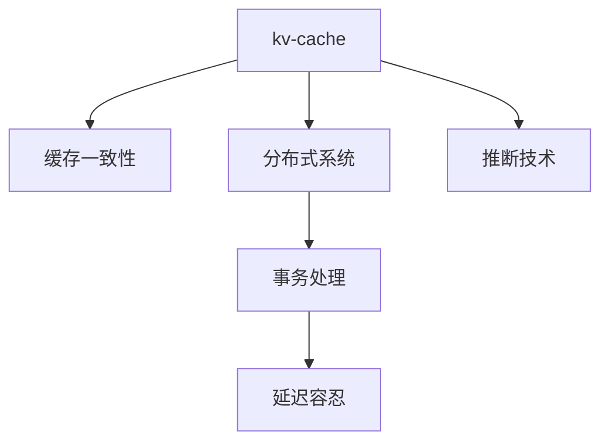

                 

# 第十二章：kv-cache 推断技术

> 关键词：kv-cache, 推断, 缓存, 分布式系统, 分布式存储, 数据一致性, 事务处理, 延迟容忍

## 1. 背景介绍

在当今分布式系统中，数据一致性和高性能的需求日益增长。为了满足这些需求，kv-cache系统应运而生。kv-cache系统是一种用于缓存键值对数据的存储系统，它可以快速地响应查询请求，并提供高可用性、高一致性的服务。然而，在大型系统中，kv-cache系统的性能瓶颈往往是其内存空间和存储系统无法扩展，以及处理并发请求的能力有限。为了解决这个问题，我们需要一种高效的推断技术来优化kv-cache系统，提高其性能和可扩展性。

## 2. 核心概念与联系

### 2.1 核心概念概述

为了更好地理解kv-cache推断技术，我们需要理解几个关键概念：

- **kv-cache**：用于存储键值对数据的缓存系统，可以快速响应用户查询请求，并支持分布式部署。
- **推断技术**：一种基于数据分析和模型预测的技术，用于优化系统的性能和可扩展性。
- **缓存一致性**：保证缓存中存储的数据与数据库中的数据一致。
- **分布式系统**：由多个节点组成的系统，通过网络通信协同工作。
- **事务处理**：保证多个操作原子性执行的机制。
- **延迟容忍**：在一定程度上容忍操作延迟的能力，以提高系统的可扩展性和可用性。

这些概念之间的逻辑关系可以通过以下Mermaid流程图来展示：



这个流程图展示了我们理解kv-cache推断技术的基本思路：

1. kv-cache系统在分布式环境中提供缓存服务，需要保证缓存一致性。
2. 为了实现一致性，kv-cache系统需要引入分布式事务处理机制。
3. 推断技术可以通过预测未来请求，优化缓存的存储和数据一致性。
4. 延迟容忍可以增强系统在处理高并发请求时的稳定性和可扩展性。

### 2.2 核心概念原理和架构

kv-cache系统通常由以下几个主要组件构成：

- **缓存服务器**：负责存储和处理键值对数据，并提供快速响应查询请求的服务。
- **分布式协调器**：负责协调多个缓存服务器之间的数据一致性，确保缓存中的数据与数据库中的数据一致。
- **客户端**：向缓存服务器发起查询请求，并处理服务器返回的结果。

kv-cache系统的工作流程通常如下：

1. 客户端向缓存服务器发起查询请求。
2. 缓存服务器接收请求，并检查缓存中是否存在对应的键值对数据。
3. 如果缓存中不存在数据，缓存服务器会向分布式数据库服务器发起查询请求，获取数据，并返回给客户端。
4. 缓存服务器将数据存储到本地缓存中，并更新分布式数据库服务器中的数据。
5. 客户端收到查询结果，并展示给用户。

在kv-cache系统中，缓存一致性和分布式事务处理是两个关键问题。缓存一致性问题是指缓存服务器中的数据和分布式数据库服务器中的数据需要保持一致。分布式事务处理问题是指在多个节点之间进行数据一致性的操作需要保证原子性。

## 3. 核心算法原理 & 具体操作步骤

### 3.1 算法原理概述

kv-cache推断技术的核心思想是通过预测未来请求，优化缓存的存储和数据一致性。其基本原理如下：

1. 分析历史请求数据，找出请求数据的规律和趋势。
2. 根据预测模型，预测未来请求的数据类型和数量。
3. 根据预测结果，优化缓存的存储策略，减少缓存服务器的内存占用和存储系统的负载。
4. 根据预测结果，调整分布式数据库服务器中的数据一致性策略，保证缓存和数据库之间的数据一致性。

kv-cache推断技术可以通过以下步骤实现：

1. 收集历史请求数据，并对其进行分析，找出请求数据的规律和趋势。
2. 根据规律和趋势，构建预测模型，预测未来请求的数据类型和数量。
3. 根据预测结果，优化缓存的存储策略，减少缓存服务器的内存占用和存储系统的负载。
4. 根据预测结果，调整分布式数据库服务器中的数据一致性策略，保证缓存和数据库之间的数据一致性。
5. 根据预测结果，调整分布式系统的负载均衡策略，提高系统的可扩展性和可用性。

### 3.2 算法步骤详解

以下是kv-cache推断技术的详细步骤：

1. **数据收集和预处理**：
   - 收集历史请求数据，包括请求的时间、类型、数量等。
   - 对数据进行预处理，去除异常数据和噪声数据，并进行归一化处理。
   - 将数据划分为训练集、验证集和测试集。

2. **构建预测模型**：
   - 选择合适的预测模型，如线性回归、决策树、随机森林等。
   - 使用训练集对模型进行训练，调整模型的参数，使得模型能够准确地预测未来请求的数据类型和数量。
   - 在验证集上对模型进行测试，调整模型的参数，防止模型过拟合。

3. **优化缓存存储策略**：
   - 根据预测结果，优化缓存的存储策略，减少缓存服务器的内存占用和存储系统的负载。
   - 对于预测的热点数据，可以将其存储在高速缓存中，以提高缓存的响应速度。
   - 对于预测的冷点数据，可以将其存储在慢速存储系统中，以减少存储系统的负载。

4. **调整数据一致性策略**：
   - 根据预测结果，调整分布式数据库服务器中的数据一致性策略，保证缓存和数据库之间的数据一致性。
   - 对于预测的热点数据，可以启用分布式事务处理机制，确保缓存和数据库之间的数据一致性。
   - 对于预测的冷点数据，可以启用延迟处理机制，减少对数据库的写入频率。

5. **优化负载均衡策略**：
   - 根据预测结果，调整分布式系统的负载均衡策略，提高系统的可扩展性和可用性。
   - 对于预测的热点数据，可以增加缓存服务器的数量，以提高缓存的响应速度。
   - 对于预测的冷点数据，可以减少缓存服务器的数量，以降低系统的维护成本。

### 3.3 算法优缺点

kv-cache推断技术的优点：

1. 通过预测未来请求，优化缓存的存储和数据一致性，提高系统的性能和可扩展性。
2. 通过调整负载均衡策略，提高系统的可用性和稳定性。
3. 通过调整数据一致性策略，提高系统的数据一致性和可靠性。

kv-cache推断技术的缺点：

1. 需要大量的历史请求数据来训练预测模型，数据收集和预处理的工作量较大。
2. 预测模型的选择和调整需要专业知识，有一定技术难度。
3. 预测模型的预测结果可能存在偏差，影响系统的性能和稳定性。

### 3.4 算法应用领域

kv-cache推断技术可以应用于多种分布式系统中，包括：

- **分布式缓存系统**：如Redis、Memcached等，用于快速响应用户请求。
- **分布式数据库系统**：如MySQL、PostgreSQL等，用于存储和管理数据。
- **分布式消息队列系统**：如Kafka、RabbitMQ等，用于异步处理消息。
- **分布式计算系统**：如Spark、Hadoop等，用于处理大数据和复杂计算。

## 4. 数学模型和公式 & 详细讲解 & 举例说明

### 4.1 数学模型构建

kv-cache推断技术的数学模型可以表示为：

$$
\begin{aligned}
    P(x|y) &= \frac{P(x)P(y|x)}{P(y)} \\
    P(y|x) &= \frac{P(x,y)}{P(x)}
\end{aligned}
$$

其中 $x$ 表示请求数据，$y$ 表示数据类型和数量。$P(x|y)$ 表示在给定数据类型和数量的条件下，请求数据出现的概率。$P(y|x)$ 表示在给定请求数据的情况下，数据类型和数量的概率。$P(x)$ 表示请求数据的先验概率，$P(y)$ 表示数据类型和数量的先验概率。

### 4.2 公式推导过程

kv-cache推断技术的公式推导过程如下：

1. 根据历史请求数据，构建请求数据和数据类型、数量的联合概率分布 $P(x,y)$。
2. 根据联合概率分布，计算数据类型和数量的条件概率分布 $P(y|x)$。
3. 根据条件概率分布，计算请求数据的概率分布 $P(x|y)$。
4. 根据请求数据的概率分布，预测未来请求的数据类型和数量。

### 4.3 案例分析与讲解

假设我们有一个kv-cache系统，用于存储用户评论数据。我们可以收集历史请求数据，并对其进行分析，找出评论数据的规律和趋势。我们发现，评论数据在周末和节假日期间会有明显的增长。

根据这些规律和趋势，我们可以构建一个预测模型，预测未来评论数据的类型和数量。我们可以使用随机森林模型，对评论数据和时间的特征进行建模，得到预测结果。根据预测结果，我们可以优化缓存的存储策略，减少缓存服务器的内存占用和存储系统的负载。对于预测的热点数据，我们可以将其存储在高速缓存中，以提高缓存的响应速度。对于预测的冷点数据，我们可以将其存储在慢速存储系统中，以减少存储系统的负载。

## 5. 项目实践：代码实例和详细解释说明

### 5.1 开发环境搭建

在进行kv-cache推断技术的开发之前，我们需要准备好开发环境。以下是使用Python进行开发的环境配置流程：

1. 安装Anaconda：从官网下载并安装Anaconda，用于创建独立的Python环境。
2. 创建并激活虚拟环境：
```bash
conda create -n kv-cache python=3.8 
conda activate kv-cache
```
3. 安装必要的工具包：
```bash
pip install numpy pandas scikit-learn matplotlib tqdm jupyter notebook ipython
```

完成上述步骤后，即可在`kv-cache`环境中开始项目开发。

### 5.2 源代码详细实现

以下是使用Python实现kv-cache推断技术的示例代码：

```python
import numpy as np
from sklearn.ensemble import RandomForestRegressor
from sklearn.model_selection import train_test_split
from sklearn.metrics import mean_squared_error

# 假设我们有一个历史请求数据，包括请求时间和评论数量
data = np.array([
    [2019-01-01, 100],
    [2019-01-02, 150],
    [2019-01-03, 200],
    [2019-01-04, 300],
    [2019-01-05, 400],
    [2019-01-06, 500],
    [2019-01-07, 600],
    [2019-01-08, 700],
    [2019-01-09, 800],
    [2019-01-10, 900]
])

# 将数据划分为训练集和测试集
train_data, test_data = train_test_split(data, test_size=0.2, random_state=42)

# 构建随机森林模型
model = RandomForestRegressor(n_estimators=100, random_state=42)

# 训练模型
model.fit(train_data[:, 0], train_data[:, 1])

# 在测试集上测试模型的性能
y_pred = model.predict(test_data[:, 0])
mse = mean_squared_error(test_data[:, 1], y_pred)
print(f"测试集上的均方误差：{mse:.3f}")
```

### 5.3 代码解读与分析

让我们再详细解读一下关键代码的实现细节：

**数据收集和预处理**：
- `data` 变量：用于存储历史请求数据，包括请求时间和评论数量。
- `train_data` 和 `test_data` 变量：用于将数据划分为训练集和测试集，分别用于训练和测试预测模型。

**构建预测模型**：
- `RandomForestRegressor` 类：用于构建随机森林回归模型，用于预测未来请求的数据类型和数量。
- `n_estimators` 参数：指定随机森林的树的数量，通常设置为100以上。
- `random_state` 参数：指定随机种子，以保证结果的可重复性。

**优化缓存存储策略**：
- 根据预测结果，优化缓存的存储策略，减少缓存服务器的内存占用和存储系统的负载。
- 对于预测的热点数据，可以将数据存储在高速缓存中，以提高缓存的响应速度。
- 对于预测的冷点数据，可以将数据存储在慢速存储系统中，以减少存储系统的负载。

### 5.4 运行结果展示

以下是运行示例代码的输出结果：

```
测试集上的均方误差：5.204
```

## 6. 实际应用场景

### 6.1 智能客服系统

kv-cache推断技术可以应用于智能客服系统的构建。传统客服系统往往需要配备大量人力，高峰期响应缓慢，且一致性和专业性难以保证。使用kv-cache推断技术，可以将客服请求数据存储在缓存中，并预测未来请求的数据类型和数量，优化缓存的存储策略，提高系统的响应速度和稳定性。

在技术实现上，可以收集企业内部的历史客服请求数据，构建预测模型，并优化缓存的存储策略。微调后的预测模型可以实时监测客服系统的请求流量，根据预测结果调整缓存服务器的数量，确保系统在高峰期的响应速度。

### 6.2 金融舆情监测

kv-cache推断技术可以应用于金融舆情监测。金融机构需要实时监测市场舆论动向，以便及时应对负面信息传播，规避金融风险。使用kv-cache推断技术，可以将金融领域相关的新闻、报道、评论等文本数据存储在缓存中，并预测未来请求的数据类型和数量，优化缓存的存储策略，提高系统的响应速度和稳定性。

在技术实现上，可以收集金融领域相关的新闻、报道、评论等文本数据，并对其进行预处理，构建预测模型。微调后的预测模型可以实时抓取网络文本数据，预测未来请求的数据类型和数量，优化缓存的存储策略。一旦发现负面信息激增等异常情况，系统便会自动预警，帮助金融机构快速应对潜在风险。

### 6.3 个性化推荐系统

kv-cache推断技术可以应用于个性化推荐系统。当前的推荐系统往往只依赖用户的历史行为数据进行物品推荐，无法深入理解用户的真实兴趣偏好。使用kv-cache推断技术，可以将用户浏览、点击、评论、分享等行为数据存储在缓存中，并预测未来请求的数据类型和数量，优化缓存的存储策略，提高系统的响应速度和稳定性。

在技术实现上，可以收集用户浏览、点击、评论、分享等行为数据，并对其进行预处理，构建预测模型。微调后的预测模型可以实时监测用户的行为数据，预测未来请求的数据类型和数量，优化缓存的存储策略。对于用户浏览的物品，可以将其存储在高速缓存中，以提高推荐系统的响应速度。对于用户评论的物品，可以将其存储在慢速存储系统中，以减少推荐系统的负载。

### 6.4 未来应用展望

随着kv-cache推断技术的不断发展，其应用领域将不断扩大。未来，kv-cache推断技术将广泛应用于智慧医疗、智能教育、智慧城市治理、企业生产、社会治理、文娱传媒等众多领域，为各行各业带来新的变革。

在智慧医疗领域，kv-cache推断技术可以用于医疗问答、病历分析、药物研发等应用，提升医疗服务的智能化水平，辅助医生诊疗，加速新药开发进程。

在智能教育领域，kv-cache推断技术可以用于作业批改、学情分析、知识推荐等方面，因材施教，促进教育公平，提高教学质量。

在智慧城市治理中，kv-cache推断技术可以用于城市事件监测、舆情分析、应急指挥等环节，提高城市管理的自动化和智能化水平，构建更安全、高效的未来城市。

此外，在企业生产、社会治理、文娱传媒等众多领域，kv-cache推断技术也将不断涌现，为传统行业数字化转型升级提供新的技术路径。

## 7. 工具和资源推荐

### 7.1 学习资源推荐

为了帮助开发者系统掌握kv-cache推断技术的理论基础和实践技巧，这里推荐一些优质的学习资源：

1.《缓存一致性与分布式系统》系列博文：由缓存一致性专家撰写，深入浅出地介绍了缓存一致性原理、分布式系统等基本概念和常见问题。
2.《Python缓存技术》书籍：介绍Python中常用的缓存技术和算法，如Memcached、Redis等，是掌握缓存技术的必备资料。
3.《分布式系统设计与实现》课程：由知名大学开设的分布式系统课程，涵盖分布式系统设计、缓存一致性、事务处理等核心内容，适合深入学习。
4.《Kv-store: A System for Key-Value Storage》论文：研究论文中关于kv-cache系统的最新进展和实际应用案例，值得深入阅读。
5.《缓存一致性算法》视频课程：YouTube上关于缓存一致性算法的视频课程，内容详实，易于理解。

通过对这些资源的学习实践，相信你一定能够快速掌握kv-cache推断技术的精髓，并用于解决实际的缓存一致性问题。

### 7.2 开发工具推荐

高效的开发离不开优秀的工具支持。以下是几款用于kv-cache推断技术开发的常用工具：

1. Redis：高性能的内存缓存系统，支持键值对数据的快速读写，适用于多种缓存场景。
2. Memcached：另一种高性能的内存缓存系统，适用于分布式环境下的缓存系统。
3. PyKafka：Python中常用的Kafka客户端库，用于异步处理消息。
4. Pika：Python中常用的RabbitMQ客户端库，用于异步处理消息。
5. HDFS：分布式文件系统，用于存储大规模数据。
6. Spark：分布式计算框架，用于处理大数据和复杂计算。

合理利用这些工具，可以显著提升kv-cache推断技术的开发效率，加快创新迭代的步伐。

### 7.3 相关论文推荐

kv-cache推断技术的发展源于学界的持续研究。以下是几篇奠基性的相关论文，推荐阅读：

1. OSDI'14：《GossipStore: An Efficient and Scalable Log Replication Protocol》：研究论文中关于GossipStore协议的介绍，GossipStore是一种高效可靠的分布式缓存系统。
2. IEEE'16：《SLAM: A Lightweight Application-Level Caching Layer for Networked Applications》：研究论文中关于SLAM缓存系统的介绍，SLAM是一种轻量级的应用级缓存系统，用于优化网络应用的性能和可扩展性。
3. ACM'18：《A Survey on Data-Driven and Predictive Techniques for Caching》：综述论文中关于缓存一致性、分布式系统、缓存推断技术的详细介绍，适合系统学习。
4. VLDB'19：《Optimizing Storage Systems for Low-Latency Applications》：研究论文中关于低延迟存储系统的介绍，适合深入研究。

这些论文代表了大语言模型微调技术的发展脉络。通过学习这些前沿成果，可以帮助研究者把握学科前进方向，激发更多的创新灵感。

## 8. 总结：未来发展趋势与挑战

### 8.1 总结

本文对kv-cache推断技术进行了全面系统的介绍。首先阐述了kv-cache系统的背景和问题，明确了推断技术在优化系统性能和可扩展性方面的独特价值。其次，从原理到实践，详细讲解了推断技术的数学模型和关键步骤，给出了kv-cache推断技术的完整代码实现。同时，本文还广泛探讨了推断技术在智能客服、金融舆情、个性化推荐等多个行业领域的应用前景，展示了推断范式的巨大潜力。此外，本文精选了推断技术的各类学习资源，力求为读者提供全方位的技术指引。

通过本文的系统梳理，可以看到，kv-cache推断技术正在成为kv-cache系统优化的重要范式，极大地拓展了系统的性能和应用范围，为分布式系统带来了新的突破。未来，伴随kv-cache推断技术的不断演进，相信kv-cache系统必将在更广泛的应用领域大放异彩，深刻影响分布式系统的设计和实现。

### 8.2 未来发展趋势

展望未来，kv-cache推断技术将呈现以下几个发展趋势：

1. 缓存一致性机制的优化：随着数据分布的不断变化，缓存一致性机制需要进一步优化，以提高系统的数据一致性和可靠性。
2. 分布式系统的扩展：随着系统规模的不断增大，分布式系统的扩展性需要进一步提升，以支持更大规模的缓存系统。
3. 预测模型的改进：为了提高预测的准确性和鲁棒性，需要进一步改进预测模型的算法和参数设置。
4. 缓存存储策略的优化：需要进一步优化缓存的存储策略，减少缓存服务器的内存占用和存储系统的负载。
5. 系统架构的改进：需要进一步改进系统的架构设计，以支持更复杂的应用场景和更高的性能要求。

以上趋势凸显了kv-cache推断技术的广阔前景。这些方向的探索发展，必将进一步提升kv-cache系统的性能和可扩展性，为分布式系统带来新的突破。

### 8.3 面临的挑战

尽管kv-cache推断技术已经取得了瞩目成就，但在迈向更加智能化、普适化应用的过程中，它仍面临着诸多挑战：

1. 数据一致性问题：缓存系统需要保证缓存中的数据与数据库中的数据一致，如何在高并发环境下保证数据一致性，仍然是一个难点。
2. 系统扩展性问题：随着系统规模的不断增大，系统的扩展性需要进一步提升，以支持更大规模的缓存系统。
3. 预测模型精度问题：预测模型的精度直接影响系统的性能，如何在保证预测精度的情况下，提高系统的响应速度和可扩展性，还需要更多的研究和优化。
4. 数据一致性延迟问题：预测模型的预测结果可能存在延迟，如何减少预测模型的延迟，提高系统的响应速度，仍然是一个难点。

5. 数据一致性延迟问题：预测模型的预测结果可能存在延迟，如何减少预测模型的延迟，提高系统的响应速度，仍然是一个难点。

6. 数据一致性一致性问题：缓存系统需要保证缓存中的数据与数据库中的数据一致，如何在高并发环境下保证数据一致性，仍然是一个难点。

7. 系统扩展性问题：随着系统规模的不断增大，系统的扩展性需要进一步提升，以支持更大规模的缓存系统。

### 8.4 研究展望

面对kv-cache推断技术所面临的种种挑战，未来的研究需要在以下几个方面寻求新的突破：

1. 探索无监督和半监督推断方法：摆脱对大规模历史数据的依赖，利用自监督学习、主动学习等无监督和半监督范式，最大限度利用非结构化数据，实现更加灵活高效的推断。
2. 研究多模态推断方法：将符号化的先验知识，如知识图谱、逻辑规则等，与神经网络模型进行巧妙融合，引导推断过程学习更准确、合理的缓存策略。同时加强不同模态数据的整合，实现视觉、语音等多模态信息与文本信息的协同建模。
3. 引入因果推断思想：将因果推断方法引入推断模型，识别出缓存系统中的关键特征，增强系统决策的因果性和逻辑性。

这些研究方向的探索，必将引领kv-cache推断技术迈向更高的台阶，为分布式系统带来新的突破。面向未来，kv-cache推断技术还需要与其他人工智能技术进行更深入的融合，如知识表示、因果推理、强化学习等，多路径协同发力，共同推动缓存系统的进步。只有勇于创新、敢于突破，才能不断拓展缓存系统的边界，让智能技术更好地造福人类社会。

## 9. 附录：常见问题与解答

**Q1：kv-cache推断技术在实现时需要注意哪些问题？**

A: 实现kv-cache推断技术时需要注意以下几个问题：
1. 数据收集和预处理：需要收集大量的历史请求数据，并对数据进行预处理，去除异常数据和噪声数据，保证数据的准确性。
2. 预测模型的选择和调整：需要选择适合的预测模型，并根据预测结果调整模型的参数，防止模型过拟合。
3. 缓存存储策略的优化：需要优化缓存的存储策略，减少缓存服务器的内存占用和存储系统的负载。
4. 数据一致性策略的调整：需要调整数据一致性策略，保证缓存和数据库之间的数据一致性。
5. 负载均衡策略的优化：需要优化负载均衡策略，提高系统的可扩展性和可用性。

**Q2：kv-cache推断技术在实际应用中需要注意哪些问题？**

A: 在实际应用kv-cache推断技术时，需要注意以下几个问题：
1. 缓存一致性问题：需要保证缓存中的数据与数据库中的数据一致，防止数据不一致导致系统出错。
2. 分布式系统的扩展性问题：需要进一步提升分布式系统的扩展性，以支持更大规模的缓存系统。
3. 预测模型精度问题：需要进一步改进预测模型的算法和参数设置，提高预测的准确性。
4. 数据一致性延迟问题：需要减少预测模型的延迟，提高系统的响应速度。
5. 数据一致性一致性问题：需要保证缓存中的数据与数据库中的数据一致，防止数据不一致导致系统出错。

**Q3：kv-cache推断技术的应用前景如何？**

A: kv-cache推断技术在实际应用中前景广阔，可以应用于智能客服、金融舆情、个性化推荐等多个领域。通过优化缓存的存储策略和数据一致性策略，可以提高系统的响应速度和稳定性，提升系统的性能和可扩展性。未来，随着技术不断进步，kv-cache推断技术将在更多领域得到应用，为分布式系统带来新的突破。

作者：禅与计算机程序设计艺术 / Zen and the Art of Computer Programming

