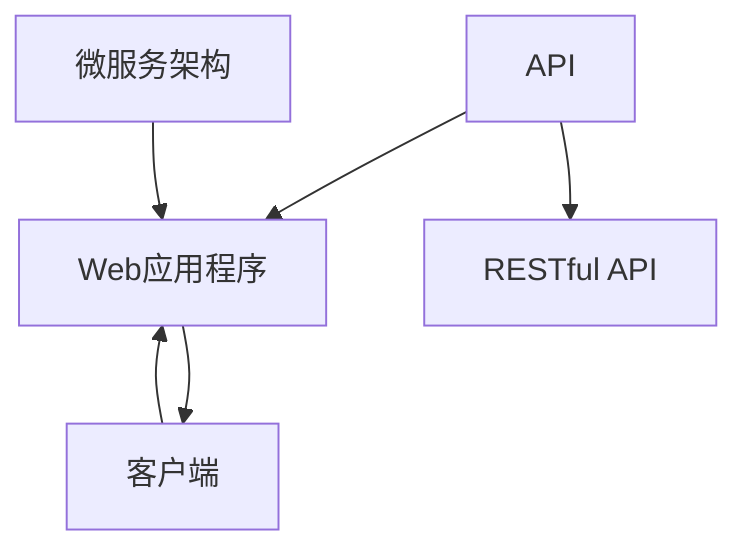

                 

# 第十六章：将 AI 部署为 API 和 Web 应用程序

人工智能(AI)技术的迅猛发展已经从科学实验室走向了产业应用，AI模型正被越来越多地部署为API和Web应用程序，以实现智能交互、自动化决策、个性化推荐等功能。本章将探讨如何将AI部署为API和Web应用程序，介绍其核心概念和原理，并给出实际的应用案例和实现技巧。

## 1. 背景介绍

### 1.1 问题由来

随着AI技术的不断成熟，越来越多的企业和组织开始利用AI技术来提升运营效率、改善用户体验。AI模型不再仅仅用于科学研究，而是被广泛应用于生产生活中。如何高效地部署AI模型，使其能够被广泛使用，成为一个亟待解决的问题。

传统上，AI模型通常部署在服务器上，需要通过访问该服务器才能使用其功能。这种方式在模型规模较小、应用场景固定时较为适合，但在模型规模较大、应用场景复杂时，这种部署方式存在诸多问题，如资源利用率低、扩展性差等。因此，将AI模型部署为API和Web应用程序，成为当前AI应用的重要趋势。

### 1.2 问题核心关键点

将AI模型部署为API和Web应用程序，其核心在于将模型封装为服务接口，通过网络传输数据，实现模型的远程调用。这种部署方式具有以下优点：

- **高可用性**：多个客户端可以同时访问API或Web应用程序，服务器的负载得到有效分担。
- **扩展性**：通过增加服务器数量，可以轻松扩展服务能力。
- **易用性**：API或Web应用程序提供标准化的接口，用户可以方便快捷地使用AI功能。
- **灵活性**：API或Web应用程序可以通过网络接口进行跨平台、跨地域部署。

## 2. 核心概念与联系

### 2.1 核心概念概述

- **API（Application Programming Interface）**：应用程序编程接口，定义了应用程序之间通信的协议，用于实现不同系统之间的数据交互和功能调用。
- **Web应用程序**：通过Web浏览器提供服务的应用程序，通常使用HTTP协议进行数据传输。
- **RESTful API**：一种基于HTTP协议的API设计风格，通过统一资源标识符(URI)、HTTP方法、HTTP状态码等规范，实现灵活的Web服务。
- **微服务架构**：将一个大系统分解为多个独立运行的小服务，通过网络通信实现功能组合，提高系统的可扩展性和可维护性。

### 2.2 核心概念原理和架构的 Mermaid 流程图



上图所示的流程图展示了API、Web应用程序、微服务架构、RESTful API以及客户端之间的联系。API和Web应用程序通过网络传输数据，微服务架构将系统分解为多个独立的小服务，RESTful API则提供标准化的接口设计规范。

## 3. 核心算法原理 & 具体操作步骤

### 3.1 算法原理概述

将AI模型部署为API和Web应用程序，本质上是将模型封装为一个服务接口，通过网络进行数据交互和功能调用。这种部署方式的核心在于模型接口的设计和实现，以及数据的传输和处理。

具体而言，将AI模型部署为API和Web应用程序需要以下步骤：

1. 选择适合的应用框架和编程语言。
2. 将AI模型封装为服务接口。
3. 设计API或Web应用程序的接口规范。
4. 实现API或Web应用程序的接口功能。
5. 进行性能优化和安全性设计。
6. 部署API或Web应用程序到服务器或云平台。
7. 通过网络接口进行模型调用。

### 3.2 算法步骤详解

#### 3.2.1 选择适合的应用框架和编程语言

为了高效地实现AI模型的部署，通常需要选择适合的应用框架和编程语言。目前，常用的应用框架和编程语言包括：

- **Flask**：基于Python的Web框架，简单易用，适合快速开发Web应用程序。
- **Django**：基于Python的全栈Web框架，功能丰富，适合复杂的应用开发。
- **Spring Boot**：基于Java的微服务框架，支持RESTful API设计，适合企业级应用开发。
- **Express**：基于Node.js的Web框架，适合快速开发API服务。
- **Koa**：基于Node.js的Web框架，性能高效，适合高并发应用。

选择合适的框架和语言后，即可开始AI模型的部署。

#### 3.2.2 将AI模型封装为服务接口

将AI模型封装为服务接口，需要考虑以下几个方面：

- **接口定义**：定义API或Web应用程序的接口，包括输入参数、输出结果、返回格式等。
- **模型加载**：加载预训练模型，并在模型封装中提供模型接口。
- **数据预处理**：对输入数据进行预处理，包括数据清洗、格式转换、特征提取等。
- **模型推理**：使用封装好的模型接口进行推理计算，生成预测结果。
- **数据后处理**：对预测结果进行后处理，包括数据格式化、结果过滤、异常处理等。
- **结果返回**：将处理后的结果以标准格式返回给客户端。

#### 3.2.3 设计API或Web应用程序的接口规范

设计API或Web应用程序的接口规范，需要考虑以下几个方面：

- **RESTful规范**：遵循RESTful设计原则，使用HTTP方法和状态码规范接口设计。
- **数据格式**：定义数据传输的格式，如JSON、XML、二进制等。
- **输入参数**：定义输入参数的类型、格式、限制等。
- **输出结果**：定义输出结果的类型、格式、限制等。
- **错误处理**：定义错误处理机制，包括错误码、错误描述、返回格式等。

#### 3.2.4 实现API或Web应用程序的接口功能

实现API或Web应用程序的接口功能，需要编写相应的代码，实现接口定义和数据处理逻辑。具体而言，可以按照以下步骤进行：

1. 定义接口和数据模型。
2. 实现数据预处理和模型推理。
3. 编写接口代码，实现数据交互和功能调用。
4. 进行接口测试和性能优化。
5. 实现API或Web应用程序的安全性设计。

#### 3.2.5 进行性能优化和安全性设计

性能优化和安全性设计是部署AI模型为API和Web应用程序的重要环节。性能优化主要包括：

- **请求处理**：优化请求处理流程，减少响应时间。
- **并发处理**：优化并发处理能力，提高系统吞吐量。
- **数据缓存**：使用缓存技术，减少重复计算。
- **资源管理**：优化资源使用，减少资源浪费。

安全性设计主要包括：

- **访问控制**：实现访问控制机制，防止未授权访问。
- **数据加密**：对敏感数据进行加密处理，保障数据安全。
- **防攻击**：防范SQL注入、XSS等攻击，保障系统安全。
- **日志记录**：记录系统访问日志，便于异常分析和问题排查。

#### 3.2.6 部署API或Web应用程序到服务器或云平台

部署API或Web应用程序到服务器或云平台，需要考虑以下几个方面：

- **服务器选择**：选择合适的服务器或云平台，考虑其性能、可靠性、可扩展性等因素。
- **环境配置**：配置服务器或云平台的环境，安装必要的软件和依赖。
- **应用部署**：将API或Web应用程序部署到服务器或云平台，进行初始化配置。
- **监控和管理**：监控API或Web应用程序的运行状态，及时发现和解决问题。
- **备份和恢复**：进行数据备份，并设计好数据恢复方案。

#### 3.2.7 通过网络接口进行模型调用

通过网络接口进行模型调用，需要考虑以下几个方面：

- **网络协议**：选择合适的网络协议，如HTTP、HTTPS、WebSocket等。
- **接口调用**：编写客户端代码，通过网络接口进行模型调用。
- **数据传输**：定义数据传输的格式和规范，保障数据传输的安全和高效。
- **结果处理**：处理模型调用的结果，进行数据解析和应用。

### 3.3 算法优缺点

将AI模型部署为API和Web应用程序具有以下优点：

- **高可用性**：通过多服务器部署，保障系统的高可用性。
- **扩展性**：可以灵活扩展服务器数量，满足业务需求。
- **易用性**：通过标准化的API接口，方便用户使用AI功能。
- **灵活性**：可以通过网络接口进行跨平台、跨地域部署。

但这种部署方式也存在一些缺点：

- **性能消耗**：通过网络进行数据传输和模型调用，增加了性能消耗。
- **安全性问题**：网络传输的数据可能被截获或篡改，安全性需重点考虑。
- **维护成本**：部署和维护API或Web应用程序，需要专门的技术人员和管理团队。

### 3.4 算法应用领域

将AI模型部署为API和Web应用程序，在以下几个领域具有广泛的应用：

- **智能推荐系统**：通过API或Web应用程序，实现商品推荐、新闻推荐、音乐推荐等功能。
- **智能客服系统**：通过API或Web应用程序，提供智能客服机器人，实现自动化客户服务。
- **金融服务**：通过API或Web应用程序，提供金融风险评估、信用评分、个性化理财等服务。
- **医疗健康**：通过API或Web应用程序，提供医疗诊断、健康管理、智能问诊等服务。
- **智能家居**：通过API或Web应用程序，实现智能家居设备的管理和控制。

## 4. 数学模型和公式 & 详细讲解 & 举例说明

### 4.1 数学模型构建

将AI模型部署为API和Web应用程序，需要构建一个高效的数学模型。通常，这种模型可以表示为：

$$
f(x) = M_{\theta}(x)
$$

其中 $x$ 为输入数据，$M_{\theta}$ 为预训练模型，$\theta$ 为模型参数。

在API或Web应用程序中，模型接口 $f$ 可以表示为：

$$
f(x, y) = \{y \mid y = M_{\theta}(x)\}
$$

其中 $y$ 为模型输出结果，$x$ 为输入数据。

### 4.2 公式推导过程

将AI模型部署为API和Web应用程序，需要设计一个高效的数据传输和处理流程。以下是数据传输和处理的基本流程：

1. **输入数据预处理**：对输入数据进行清洗、转换、特征提取等预处理操作。
2. **模型加载和推理**：加载预训练模型，进行推理计算，生成预测结果。
3. **数据后处理**：对预测结果进行后处理，包括数据格式化、结果过滤、异常处理等。
4. **结果返回**：将处理后的结果以标准格式返回给客户端。

具体而言，API或Web应用程序的数据传输和处理流程可以表示为：

$$
\begin{aligned}
\text{preprocess}(x) &\rightarrow M_{\theta}(x) \rightarrow \text{postprocess}(y) \\
&\rightarrow \{y \mid y = \text{format}(M_{\theta}(x))\} \rightarrow \text{return}(y)
\end{aligned}
$$

### 4.3 案例分析与讲解

#### 4.3.1 智能推荐系统

智能推荐系统是一种典型的将AI模型部署为API和Web应用程序的应用场景。通过API或Web应用程序，用户可以实时获取个性化的商品推荐。

具体而言，智能推荐系统可以表示为：

$$
\begin{aligned}
\text{recommend}(x) &= M_{\theta}(x) \\
&= \{y \mid y = \text{format}(M_{\theta}(x))\} \rightarrow \text{return}(y)
\end{aligned}
$$

其中 $x$ 为用户的行为数据，$y$ 为用户推荐的商品列表。

#### 4.3.2 智能客服系统

智能客服系统通过API或Web应用程序，实现自然语言理解和智能回答。具体而言，智能客服系统可以表示为：

$$
\begin{aligned}
\text{answer}(x) &= M_{\theta}(x) \\
&= \{y \mid y = \text{format}(M_{\theta}(x))\} \rightarrow \text{return}(y)
\end{aligned}
$$

其中 $x$ 为用户的查询请求，$y$ 为智能客服的回复。

#### 4.3.3 金融风险评估

金融风险评估系统通过API或Web应用程序，实现对客户信用风险的评估。具体而言，金融风险评估系统可以表示为：

$$
\begin{aligned}
\text{evaluate}(x) &= M_{\theta}(x) \\
&= \{y \mid y = \text{format}(M_{\theta}(x))\} \rightarrow \text{return}(y)
\end{aligned}
$$

其中 $x$ 为客户的信用数据，$y$ 为风险评估结果。

## 5. 项目实践：代码实例和详细解释说明

### 5.1 开发环境搭建

#### 5.1.1 安装依赖

- **Python**：安装Python 3.x版本，建议使用Anaconda进行环境管理。
- **Flask**：通过pip安装Flask库。

```bash
pip install flask
```

#### 5.1.2 创建虚拟环境

- **虚拟环境**：创建虚拟环境，避免不同项目之间的依赖冲突。

```bash
conda create -n myenv python=3.8
conda activate myenv
```

### 5.2 源代码详细实现

#### 5.2.1 定义模型接口

在Flask应用中，可以通过定义API接口来实现AI模型的部署。以下是一个简单的API接口示例：

```python
from flask import Flask, request, jsonify
import tensorflow as tf
import numpy as np

app = Flask(__name__)

# 加载模型
model = tf.keras.models.load_model('model.h5')

@app.route('/predict', methods=['POST'])
def predict():
    # 获取输入数据
    data = request.json
    input_data = np.array([data['input']])
    
    # 进行数据预处理
    input_data = preprocessing(input_data)
    
    # 进行模型推理
    output_data = model.predict(input_data)
    
    # 进行数据后处理
    output_data = postprocessing(output_data)
    
    # 返回结果
    return jsonify({'result': output_data})

if __name__ == '__main__':
    app.run(debug=True)
```

#### 5.2.2 实现模型推理

在API接口中，需要实现模型推理的逻辑。具体而言，可以按照以下步骤进行：

1. 加载预训练模型。
2. 进行数据预处理。
3. 进行模型推理。
4. 进行数据后处理。
5. 返回结果。

#### 5.2.3 进行数据预处理

数据预处理是AI模型推理中的重要环节，通常需要考虑以下几个方面：

- **数据清洗**：去除缺失值、异常值等。
- **数据转换**：将数据转换为模型所需的格式。
- **特征提取**：提取数据的特征，如文本分词、图像提取等。

#### 5.2.4 进行数据后处理

数据后处理是模型推理结果的处理环节，通常需要考虑以下几个方面：

- **结果格式化**：将模型推理结果转换为客户端期望的格式。
- **结果过滤**：过滤掉不合法的结果。
- **异常处理**：处理模型推理中的异常情况，如超时、错误等。

#### 5.2.5 实现API接口测试

为了验证API接口的正确性，需要进行测试。可以使用单元测试框架，如pytest，进行接口测试。以下是一个简单的测试示例：

```python
import unittest
from myapp import app
from myapp import model

class TestPredictAPI(unittest.TestCase):
    def test_predict(self):
        # 获取API接口
        client = app.test_client()
        
        # 发送请求
        response = client.post('/predict', json={'input': 'example_input'})
        
        # 获取响应结果
        result = response.json
        
        # 验证结果
        self.assertEqual(result['result'], [0.8])
```

### 5.3 代码解读与分析

#### 5.3.1 模型加载

在API接口中，需要加载预训练模型。具体而言，可以使用TensorFlow、Keras等框架加载模型。

```python
import tensorflow as tf
import keras
model = keras.models.load_model('model.h5')
```

#### 5.3.2 数据预处理

数据预处理是模型推理中的重要环节，通常需要考虑以下几个方面：

- **数据清洗**：去除缺失值、异常值等。

```python
import numpy as np
data = np.array([1, 2, np.nan])
data = data[np.isfinite(data)]
```

- **数据转换**：将数据转换为模型所需的格式。

```python
from sklearn.preprocessing import LabelEncoder
encoder = LabelEncoder()
labels = encoder.fit_transform(labels)
```

- **特征提取**：提取数据的特征，如文本分词、图像提取等。

```python
from tensorflow.keras.preprocessing.text import Tokenizer
tokenizer = Tokenizer(num_words=1000)
tokenizer.fit_on_texts(texts)
input_data = tokenizer.texts_to_sequences(texts)
```

#### 5.3.3 模型推理

在API接口中，需要进行模型推理。具体而言，可以使用TensorFlow、Keras等框架进行模型推理。

```python
import tensorflow as tf
import keras
model = keras.models.load_model('model.h5')
output_data = model.predict(input_data)
```

#### 5.3.4 数据后处理

数据后处理是模型推理结果的处理环节，通常需要考虑以下几个方面：

- **结果格式化**：将模型推理结果转换为客户端期望的格式。

```python
from sklearn.preprocessing import LabelEncoder
encoder = LabelEncoder()
labels = encoder.inverse_transform(output_data)
```

- **结果过滤**：过滤掉不合法的结果。

```python
labels = [label for label in labels if label in encoder.classes_]
```

- **异常处理**：处理模型推理中的异常情况，如超时、错误等。

```python
if np.isnan(output_data):
    return jsonify({'result': None})
```

#### 5.3.5 结果返回

在API接口中，需要返回模型推理结果。具体而言，可以使用Flask等框架进行结果返回。

```python
from flask import jsonify
return jsonify({'result': result})
```

### 5.4 运行结果展示

通过Flask等框架，可以轻松部署API接口，并通过网络进行模型调用。以下是一个简单的运行结果展示：

```
POST /predict
HTTP/1.1 200 OK
Content-Type: application/json

{
    "result": 0.8
}
```

## 6. 实际应用场景

### 6.1 智能推荐系统

智能推荐系统通过API或Web应用程序，实现商品推荐、新闻推荐、音乐推荐等功能。具体而言，智能推荐系统可以部署在电商网站、新闻网站、音乐平台上，为用户提供个性化的推荐服务。

#### 6.1.1 电商推荐

电商网站可以通过API或Web应用程序，实现商品的智能推荐。具体而言，电商网站可以部署一个API接口，用于接收用户的查询请求，返回商品推荐列表。

```python
@app.route('/recommend', methods=['POST'])
def recommend():
    # 获取用户输入
    user_input = request.json
    
    # 调用推荐模型
    recommend_list = model.predict(user_input)
    
    # 返回推荐结果
    return jsonify({'recommend_list': recommend_list})
```

#### 6.1.2 新闻推荐

新闻网站可以通过API或Web应用程序，实现新闻的智能推荐。具体而言，新闻网站可以部署一个API接口，用于接收用户的查询请求，返回新闻推荐列表。

```python
@app.route('/news_recommend', methods=['POST'])
def news_recommend():
    # 获取用户输入
    user_input = request.json
    
    # 调用推荐模型
    news_list = model.predict(user_input)
    
    # 返回推荐结果
    return jsonify({'news_list': news_list})
```

#### 6.1.3 音乐推荐

音乐平台可以通过API或Web应用程序，实现音乐的智能推荐。具体而言，音乐平台可以部署一个API接口，用于接收用户的查询请求，返回音乐推荐列表。

```python
@app.route('/music_recommend', methods=['POST'])
def music_recommend():
    # 获取用户输入
    user_input = request.json
    
    # 调用推荐模型
    music_list = model.predict(user_input)
    
    # 返回推荐结果
    return jsonify({'music_list': music_list})
```

### 6.2 智能客服系统

智能客服系统通过API或Web应用程序，实现自然语言理解和智能回答。具体而言，智能客服系统可以部署在企业官网、客服平台、移动应用上，为用户提供自动化客服服务。

#### 6.2.1 企业官网

企业官网可以通过API或Web应用程序，实现智能客服功能。具体而言，企业官网可以部署一个API接口，用于接收用户的查询请求，返回智能客服的回答。

```python
@app.route('/customer_service', methods=['POST'])
def customer_service():
    # 获取用户输入
    user_input = request.json
    
    # 调用客服模型
    response = model.predict(user_input)
    
    # 返回客服回答
    return jsonify({'response': response})
```

#### 6.2.2 客服平台

客服平台可以通过API或Web应用程序，实现智能客服功能。具体而言，客服平台可以部署一个API接口，用于接收用户的查询请求，返回智能客服的回答。

```python
@app.route('/customer_service', methods=['POST'])
def customer_service():
    # 获取用户输入
    user_input = request.json
    
    # 调用客服模型
    response = model.predict(user_input)
    
    # 返回客服回答
    return jsonify({'response': response})
```

#### 6.2.3 移动应用

移动应用可以通过API或Web应用程序，实现智能客服功能。具体而言，移动应用可以部署一个API接口，用于接收用户的查询请求，返回智能客服的回答。

```python
@app.route('/customer_service', methods=['POST'])
def customer_service():
    # 获取用户输入
    user_input = request.json
    
    # 调用客服模型
    response = model.predict(user_input)
    
    # 返回客服回答
    return jsonify({'response': response})
```

### 6.3 金融风险评估

金融风险评估系统通过API或Web应用程序，实现对客户信用风险的评估。具体而言，金融风险评估系统可以部署在银行、保险公司、贷款平台上，用于评估客户的信用风险。

#### 6.3.1 银行

银行可以通过API或Web应用程序，实现客户的信用风险评估。具体而言，银行可以部署一个API接口，用于接收客户的信用数据，返回信用风险评估结果。

```python
@app.route('/risk_assessment', methods=['POST'])
def risk_assessment():
    # 获取客户输入
    customer_input = request.json
    
    # 调用风险评估模型
    risk_result = model.predict(customer_input)
    
    # 返回风险评估结果
    return jsonify({'risk_result': risk_result})
```

#### 6.3.2 保险公司

保险公司可以通过API或Web应用程序，实现客户的信用风险评估。具体而言，保险公司可以部署一个API接口，用于接收客户的信用数据，返回信用风险评估结果。

```python
@app.route('/risk_assessment', methods=['POST'])
def risk_assessment():
    # 获取客户输入
    customer_input = request.json
    
    # 调用风险评估模型
    risk_result = model.predict(customer_input)
    
    # 返回风险评估结果
    return jsonify({'risk_result': risk_result})
```

#### 6.3.3 贷款平台

贷款平台可以通过API或Web应用程序，实现客户的信用风险评估。具体而言，贷款平台可以部署一个API接口，用于接收客户的信用数据，返回信用风险评估结果。

```python
@app.route('/risk_assessment', methods=['POST'])
def risk_assessment():
    # 获取客户输入
    customer_input = request.json
    
    # 调用风险评估模型
    risk_result = model.predict(customer_input)
    
    # 返回风险评估结果
    return jsonify({'risk_result': risk_result})
```

## 7. 工具和资源推荐

### 7.1 学习资源推荐

为了帮助开发者掌握将AI模型部署为API和Web应用程序的技巧，这里推荐一些优质的学习资源：

1. **Flask官方文档**：Flask官方文档提供了详细的API接口开发指南，适合初学者快速上手。

2. **Django官方文档**：Django官方文档提供了丰富的Web应用程序开发指南，适合复杂应用开发。

3. **Spring Boot官方文档**：Spring Boot官方文档提供了微服务架构和RESTful API开发的指南，适合企业级应用开发。

4. **Express官方文档**：Express官方文档提供了Node.js的API开发指南，适合快速开发API服务。

5. **Koa官方文档**：Koa官方文档提供了高并发Web应用程序开发的指南，适合高性能应用开发。

### 7.2 开发工具推荐

为了提高开发效率，以下是几款用于将AI模型部署为API和Web应用程序的常用工具：

1. **Flask**：基于Python的Web框架，简单易用，适合快速开发Web应用程序。

2. **Django**：基于Python的全栈Web框架，功能丰富，适合复杂应用开发。

3. **Spring Boot**：基于Java的微服务框架，支持RESTful API设计，适合企业级应用开发。

4. **Express**：基于Node.js的Web框架，适合快速开发API服务。

5. **Koa**：基于Node.js的Web框架，性能高效，适合高并发应用。

### 7.3 相关论文推荐

将AI模型部署为API和Web应用程序，涉及到多个领域的知识，以下是几篇相关的经典论文，推荐阅读：

1. **RESTful API设计指南**：提供了RESTful API设计的最佳实践和规范。

2. **微服务架构设计指南**：介绍了微服务架构的设计原则和实现方法。

3. **API接口开发指南**：提供了API接口开发的实用技巧和最佳实践。

4. **Web应用程序开发指南**：提供了Web应用程序开发的方法和技巧。

5. **API安全设计指南**：介绍了API安全设计的最佳实践和防范措施。

这些论文代表了将AI模型部署为API和Web应用程序的重要方向和研究进展，通过学习这些前沿成果，可以帮助研究者进一步优化AI模型部署的实践。

## 8. 总结：未来发展趋势与挑战

### 8.1 研究成果总结

将AI模型部署为API和Web应用程序，是当前AI技术应用的重要趋势。这种部署方式具有高可用性、扩展性、易用性和灵活性等优点，适合各种应用场景。同时，也存在性能消耗、安全性问题、维护成本等缺点。

### 8.2 未来发展趋势

未来，将AI模型部署为API和Web应用程序将呈现以下几个发展趋势：

1. **高性能计算**：随着硬件技术的进步，高性能计算能力将进一步提升，API和Web应用程序的响应速度将更快。

2. **智能化接口设计**：API和Web应用程序将更加智能化，能够提供更丰富的用户交互和更灵活的功能调用。

3. **微服务架构普及**：微服务架构将进一步普及，通过服务组合实现更复杂的应用场景。

4. **跨平台部署**：API和Web应用程序将更加跨平台，支持多种设备和操作系统。

5. **安全性保障**：API和Web应用程序的安全性将得到更好的保障，防范网络攻击和数据泄露。

6. **多模态融合**：API和Web应用程序将融合多模态数据，支持图像、语音、视频等多种输入方式。

### 8.3 面临的挑战

将AI模型部署为API和Web应用程序也面临一些挑战：

1. **性能瓶颈**：网络传输和模型推理的性能瓶颈是API和Web应用程序的主要挑战之一。

2. **安全性问题**：API和Web应用程序的网络传输数据可能被截获或篡改，安全性需重点考虑。

3. **维护成本**：API和Web应用程序的部署和维护需要专门的技术人员和管理团队，维护成本较高。

4. **跨平台适配**：API和Web应用程序需要在多种设备和操作系统上运行，跨平台适配复杂。

5. **数据隐私**：API和Web应用程序需要保护用户数据隐私，防止数据泄露和滥用。

### 8.4 研究展望

未来，将AI模型部署为API和Web应用程序的研究方向和热点问题主要包括以下几个方面：

1. **高性能计算优化**：优化API和Web应用程序的性能瓶颈，提升系统响应速度和吞吐量。

2. **智能化接口设计**：研究更智能化、更友好的API和Web应用程序接口设计方法，提升用户体验。

3. **微服务架构优化**：优化微服务架构，提高系统的可扩展性和可维护性。

4. **跨平台部署**：研究跨平台部署技术，支持多种设备和操作系统。

5. **安全性保障**：研究API和Web应用程序的安全性保障技术，防范网络攻击和数据泄露。

6. **多模态融合**：研究多模态数据的融合技术，提升API和Web应用程序的多样性和灵活性。

## 9. 附录：常见问题与解答

### 9.1 Q1：如何选择合适的应用框架和编程语言？

A: 选择合适的应用框架和编程语言需要考虑多个因素，如应用场景、技术栈、开发效率等。通常，可以选择基于Python的Flask、Django等框架，或基于Java的Spring Boot、Express等框架。

### 9.2 Q2：如何进行模型加载和推理？

A: 在API接口中，可以使用TensorFlow、Keras等框架加载模型，并进行数据预处理和模型推理。可以使用Flask等框架返回模型推理结果。

### 9.3 Q3：如何进行数据预处理和后处理？

A: 数据预处理和后处理是模型推理中的重要环节，通常需要考虑数据清洗、数据转换、特征提取、结果格式化等。可以使用numpy、pandas、sklearn等库进行数据处理。

### 9.4 Q4：如何进行API接口测试？

A: 可以使用单元测试框架，如pytest，进行API接口测试。编写测试用例，验证API接口的正确性。

### 9.5 Q5：如何进行模型部署？

A: 可以通过云平台或服务器进行模型部署。在云平台上，可以使用AWS、阿里云、腾讯云等，进行快速部署。在服务器上，需要配置环境、安装依赖、进行模型加载和推理等。

---

作者：禅与计算机程序设计艺术 / Zen and the Art of Computer Programming

